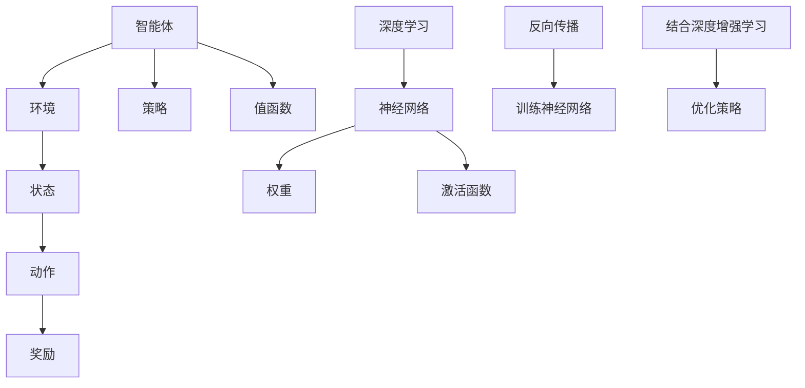

                 

# AI人工智能深度学习算法：使用强化学习优化深度学习模型

> **关键词：** AI, 深度学习，强化学习，优化，算法，模型优化，神经网络

> **摘要：** 本文将深入探讨如何在深度学习模型中集成强化学习，以实现模型的优化。我们将介绍强化学习的基本概念和原理，分析深度学习和强化学习的结合点，并通过具体案例展示如何使用强化学习优化深度学习模型。本文旨在为AI开发者提供一种新的模型优化思路，帮助其在实际应用中提高模型的性能和效率。

## 1. 背景介绍

### 1.1 目的和范围

本文的目的是介绍如何将强化学习应用于深度学习模型的优化。我们将在本文中讨论以下主题：

- 强化学习的基本概念和原理
- 深度学习模型中的强化学习应用
- 强化学习与深度学习的结合方式
- 强化学习在深度学习模型优化中的应用案例

通过本文的学习，读者将能够了解强化学习在深度学习模型优化中的重要性，并掌握如何在实际项目中应用强化学习优化深度学习模型的方法。

### 1.2 预期读者

本文主要面向以下读者群体：

- 对深度学习和强化学习有一定了解的AI开发者
- 想要提升模型优化能力的AI研究人员
- 意在对深度学习模型进行改进的AI工程师

### 1.3 文档结构概述

本文结构如下：

- 第1章：背景介绍，包括本文的目的和范围、预期读者以及文档结构概述
- 第2章：核心概念与联系，介绍强化学习、深度学习以及它们之间的联系
- 第3章：核心算法原理 & 具体操作步骤，详细讲解强化学习算法在深度学习模型优化中的应用
- 第4章：数学模型和公式 & 详细讲解 & 举例说明，通过数学公式和实例说明强化学习在模型优化中的具体实现
- 第5章：项目实战：代码实际案例和详细解释说明，展示一个实际项目中的代码实现过程
- 第6章：实际应用场景，介绍强化学习在深度学习模型优化中的实际应用案例
- 第7章：工具和资源推荐，推荐相关学习资源、开发工具框架和论文著作
- 第8章：总结：未来发展趋势与挑战，探讨强化学习在深度学习模型优化领域的未来发展趋势和面临的挑战
- 第9章：附录：常见问题与解答，回答读者可能遇到的问题
- 第10章：扩展阅读 & 参考资料，提供更多扩展阅读和参考资料

### 1.4 术语表

#### 1.4.1 核心术语定义

- **强化学习（Reinforcement Learning，RL）**：一种机器学习范式，通过智能体与环境交互，根据环境的反馈不断调整自身的策略，以实现最优目标。
- **深度学习（Deep Learning，DL）**：一种机器学习方法，通过多层神经网络模型对数据进行特征提取和模式识别。
- **模型优化（Model Optimization）**：通过对模型进行调整和优化，提高模型的性能、效率和泛化能力。

#### 1.4.2 相关概念解释

- **智能体（Agent）**：在强化学习中，执行动作并从环境中接收反馈的实体。
- **环境（Environment）**：与智能体交互的外部世界。
- **策略（Policy）**：智能体在给定状态下选择的动作方案。
- **值函数（Value Function）**：衡量智能体在给定状态下执行某个动作的期望收益。
- **策略梯度（Policy Gradient）**：用于更新策略的梯度，以实现策略的优化。

#### 1.4.3 缩略词列表

- **RL**：强化学习
- **DL**：深度学习
- **MLOps**：模型优化
- **GAN**：生成对抗网络
- **CNN**：卷积神经网络
- **RNN**：循环神经网络
- **SGD**：随机梯度下降
- **Adam**：自适应矩估计

## 2. 核心概念与联系

为了更好地理解强化学习在深度学习模型优化中的应用，我们首先需要了解强化学习和深度学习的基本概念以及它们之间的联系。

### 2.1 强化学习的基本概念

强化学习是一种基于奖励和惩罚的机器学习范式。其主要目标是通过智能体与环境之间的交互，不断调整智能体的策略，以实现某个目标。在强化学习中，智能体需要在不确定的环境中做出决策，并根据环境的反馈调整自身的策略。强化学习的基本概念包括：

- **智能体（Agent）**：执行动作并从环境中接收反馈的实体。
- **环境（Environment）**：与智能体交互的外部世界。
- **状态（State）**：智能体在某个时间点的信息集合。
- **动作（Action）**：智能体可以执行的操作。
- **奖励（Reward）**：环境对智能体执行的某个动作的反馈信号。
- **策略（Policy）**：智能体在给定状态下选择的动作方案。
- **值函数（Value Function）**：衡量智能体在给定状态下执行某个动作的期望收益。

### 2.2 深度学习的基本概念

深度学习是一种基于多层神经网络的学习方法，通过多层网络模型对大量数据进行特征提取和模式识别。深度学习的基本概念包括：

- **神经网络（Neural Network，NN）**：由神经元组成的网络，用于模拟人脑的神经元结构和工作原理。
- **权重（Weights）**：神经网络中神经元之间的连接强度，用于调节输入信息的传递。
- **激活函数（Activation Function）**：用于引入非线性变换，使神经网络具备处理非线性问题的能力。
- **反向传播（Backpropagation）**：一种用于训练神经网络的方法，通过计算损失函数对权重的梯度，实现权重的更新。
- **损失函数（Loss Function）**：用于衡量模型预测值与真实值之间的差距，通常用于训练神经网络的性能指标。

### 2.3 强化学习与深度学习的联系

强化学习和深度学习在本质上存在一定的联系。深度学习可以看作是一种特殊的强化学习，即智能体在连续动作空间中进行决策。同时，深度学习在特征提取和模式识别方面具有较高的性能，可以为强化学习提供有效的辅助。

强化学习与深度学习的联系主要体现在以下几个方面：

- **神经网络作为智能体的决策模块**：在强化学习中，可以使用神经网络作为智能体的决策模块，实现智能体在复杂环境中的决策过程。通过训练神经网络，智能体可以学会在给定状态下选择最优动作。
- **值函数和策略的表示**：深度学习可以用于表示强化学习中的值函数和策略。例如，可以使用深度神经网络来近似智能体的值函数和策略，从而提高模型的计算效率和性能。
- **结合深度增强学习（Deep Reinforcement Learning，DRL）**：深度增强学习是一种将深度学习和强化学习相结合的方法，通过使用深度神经网络来优化智能体的策略，实现更高效的模型优化。

### 2.4 核心概念原理和架构的Mermaid流程图

以下是一个简单的Mermaid流程图，展示了强化学习与深度学习之间的核心概念和联系：



## 3. 核心算法原理 & 具体操作步骤

在本文的第三部分，我们将详细讲解如何将强化学习算法应用于深度学习模型的优化。为了更好地理解这个过程，我们将使用伪代码来描述算法的原理和操作步骤。

### 3.1 强化学习算法原理

强化学习算法的核心目标是找到一个最优策略，使得智能体在给定状态下能够选择最优动作，从而实现最大化总奖励。在强化学习算法中，智能体需要通过不断地与环境交互，不断调整其策略，以达到最优解。以下是强化学习算法的基本原理：

1. **初始化策略**：首先，智能体需要初始化一个策略。策略可以是一个概率分布，表示在给定状态下选择每个动作的概率。
2. **与环境交互**：智能体根据当前状态和策略，选择一个动作执行，并接收环境的反馈（状态转移和奖励）。
3. **更新策略**：根据接收到的奖励和新的状态，智能体更新其策略。更新策略的方法可以有多种，如策略梯度、值迭代、策略迭代等。
4. **重复步骤2和3**：智能体不断与环境交互，并根据反馈更新策略，直到达到某个终止条件（如达到指定步数、收益达到阈值等）。

### 3.2 深度学习模型优化中的强化学习算法

在深度学习模型优化中，强化学习算法可以被用来优化模型的参数，以提高模型的性能。具体来说，强化学习算法可以通过以下步骤应用于深度学习模型的优化：

1. **初始化模型参数**：首先，需要初始化深度学习模型的参数。这些参数可以是神经网络的权重和偏置。
2. **构建智能体**：使用神经网络构建智能体，用于选择模型参数的调整方向。智能体可以通过训练神经网络，使其学会在给定参数下选择最优的参数调整方向。
3. **与环境交互**：智能体根据当前模型参数，选择一个参数调整方向执行，并接收环境的反馈（模型性能指标）。
4. **更新模型参数**：根据接收到的反馈，智能体更新模型参数。更新模型参数的方法可以采用反向传播算法，计算参数的梯度，并根据梯度更新参数。
5. **重复步骤3和4**：智能体不断调整模型参数，并根据反馈更新参数，直到达到某个终止条件（如模型性能达到阈值、达到指定迭代次数等）。

### 3.3 伪代码示例

以下是一个简单的伪代码示例，展示了强化学习算法在深度学习模型优化中的应用：

```python
# 初始化模型参数
model_params = initialize_params()

# 初始化智能体
agent = NeuralNetwork()

# 环境初始化
env = Environment()

# 迭代次数
num_iterations = 1000

for iteration in range(num_iterations):
    # 状态s
    state = env.get_state()

    # 模型参数θ
    model_params = agent.get_params()

    # 选择参数调整方向a
    action = agent.select_action(state, model_params)

    # 执行参数调整动作，得到新状态s'和奖励r
    state', reward = env.step(state, action, model_params)

    # 更新模型参数
    model_params = agent.update_params(model_params, action, reward, state')

    # 输出当前迭代次数和模型性能
    print(f"Iteration {iteration}: Model Performance = {env.get_performance(model_params)}")

# 输出最终模型性能
print(f"Final Model Performance = {env.get_performance(model_params)}")
```

在这个伪代码中，`NeuralNetwork()` 类表示智能体，`Environment()` 类表示环境。`initialize_params()` 函数用于初始化模型参数，`get_state()` 函数用于获取当前状态，`get_performance()` 函数用于计算模型性能。

## 4. 数学模型和公式 & 详细讲解 & 举例说明

在深度学习模型优化中，强化学习算法的应用涉及到一系列的数学模型和公式。这些模型和公式有助于我们理解和实现强化学习算法在模型优化中的应用。以下我们将详细介绍这些数学模型和公式，并通过具体例子进行说明。

### 4.1 强化学习中的基本数学模型

#### 4.1.1 策略梯度

策略梯度是强化学习中的一个核心概念。策略梯度表示策略在给定状态下选择动作的期望收益。策略梯度的计算公式如下：

\[ \nabla_{\theta} J(\theta) = \mathbb{E}_{s, a} [ \nabla_{\theta} \log \pi(a|s; \theta) \cdot r(s, a) ] \]

其中：

- \( \theta \) 表示策略参数。
- \( J(\theta) \) 表示策略的期望收益。
- \( s \) 表示状态。
- \( a \) 表示动作。
- \( \pi(a|s; \theta) \) 表示在给定状态下选择动作 \( a \) 的概率。
- \( r(s, a) \) 表示在状态 \( s \) 下执行动作 \( a \) 所获得的奖励。

#### 4.1.2 值函数

值函数是强化学习中的另一个重要概念。值函数表示在给定状态下执行某个动作的期望收益。值函数可以分为状态值函数和动作值函数。状态值函数 \( V(s) \) 和动作值函数 \( Q(s, a) \) 的计算公式如下：

\[ V(s) = \mathbb{E}_{a} [r(s, a) + \gamma \max_{a'} Q(s', a')] \]

\[ Q(s, a) = \mathbb{E}_{s'} [r(s, a) + \gamma \max_{a'} Q(s', a')] \]

其中：

- \( \gamma \) 表示折扣因子，用于平衡当前奖励和未来奖励的重要性。
- \( s' \) 和 \( a' \) 表示新的状态和动作。

#### 4.1.3 反向传播

在强化学习算法中，反向传播是一种用于更新策略参数的重要技术。反向传播的目的是计算损失函数对策略参数的梯度，并根据梯度更新策略参数。损失函数通常表示策略的期望收益。反向传播的计算公式如下：

\[ \nabla_{\theta} J(\theta) = \nabla_{\theta} \log \pi(a|s; \theta) \cdot r(s, a) \]

### 4.2 深度学习模型优化中的数学模型和公式

在深度学习模型优化中，强化学习算法的应用涉及到以下数学模型和公式：

#### 4.2.1 神经网络损失函数

神经网络的损失函数通常用于衡量模型预测值与真实值之间的差距。以下是一个常见的损失函数——均方误差（MSE）：

\[ L(\theta) = \frac{1}{m} \sum_{i=1}^{m} (\hat{y}_i - y_i)^2 \]

其中：

- \( \theta \) 表示模型参数。
- \( \hat{y}_i \) 表示模型对样本 \( i \) 的预测值。
- \( y_i \) 表示样本 \( i \) 的真实值。
- \( m \) 表示样本数量。

#### 4.2.2 神经网络反向传播

神经网络反向传播是一种用于计算损失函数对模型参数的梯度的重要技术。以下是一个简单的反向传播计算过程：

1. 计算输出层的误差：
\[ \delta_L = \frac{\partial L}{\partial \hat{y}} \]
2. 传递误差到隐藏层：
\[ \delta_h = \sigma'(h) \odot (\delta_L \odot \frac{\partial a}{\partial h}) \]
3. 计算隐藏层的梯度：
\[ \nabla_{w_h} L = \delta_h \odot x \]
\[ \nabla_{b_h} L = \delta_h \]
4. 计算输出层的梯度：
\[ \nabla_{w_o} L = \delta_L \odot \hat{y} \]
\[ \nabla_{b_o} L = \delta_L \]

其中：

- \( \sigma' \) 表示激活函数的导数。
- \( \odot \) 表示逐元素相乘。

### 4.3 举例说明

以下是一个具体的例子，展示了如何使用强化学习算法优化深度学习模型。

#### 4.3.1 问题背景

假设我们有一个分类问题，需要使用神经网络进行模型训练。我们的目标是使用强化学习算法优化神经网络的参数，以提高模型的分类准确率。

#### 4.3.2 数据准备

我们使用一个包含1000个样本的数据集进行训练。每个样本包含一个输入特征和对应的标签。标签是二分类标签，表示样本属于正类或负类。

#### 4.3.3 模型初始化

我们初始化一个包含三个隐藏层的神经网络，每个隐藏层包含50个神经元。激活函数为ReLU。损失函数为均方误差（MSE）。

#### 4.3.4 强化学习算法应用

我们使用一个基于策略梯度的强化学习算法来优化神经网络的参数。智能体是一个由神经网络构成的决策模块，用于选择参数的调整方向。环境是一个模拟环境，用于评估模型在给定参数下的性能。

1. 初始化策略参数：
\[ \theta = \text{initialize_params()} \]
2. 初始化智能体：
\[ agent = NeuralNetwork() \]
3. 初始化环境：
\[ env = Environment() \]
4. 迭代次数：
\[ num_iterations = 1000 \]

5. 迭代过程：
\[ for iteration in range(num_iterations): \]
    \[ \]
    \[ s = env.get_state() \]
    \[ a = agent.select_action(s, \theta) \]
    \[ s', r = env.step(s, a, \theta) \]
    \[ \theta = agent.update_params(\theta, a, r, s') \]

6. 输出最终模型性能：
\[ print(f"Final Model Performance = {env.get_performance(\theta)}") \]

在这个例子中，智能体根据当前状态和策略参数，选择一个参数调整方向执行，并接收环境的反馈（模型性能指标）。根据反馈，智能体更新策略参数，并通过反向传播算法更新神经网络参数。

## 5. 项目实战：代码实际案例和详细解释说明

在本章节中，我们将通过一个实际项目案例，详细解释如何使用强化学习优化深度学习模型。我们将介绍项目的开发环境、代码实现以及代码解读和分析。

### 5.1 开发环境搭建

在进行项目实战之前，我们需要搭建合适的开发环境。以下是所需的环境配置：

- 操作系统：Ubuntu 18.04 或 macOS
- 编程语言：Python 3.8
- 深度学习框架：TensorFlow 2.x
- 强化学习库：Gym

确保已经安装了Python和pip。然后，使用以下命令安装所需的库：

```bash
pip install tensorflow gym
```

### 5.2 源代码详细实现和代码解读

以下是项目的源代码实现。我们将逐行解读代码，并解释其功能和作用。

```python
import gym
import tensorflow as tf
import numpy as np
import random

# 创建环境
env = gym.make('CartPole-v0')

# 定义神经网络模型
class DQNModel(tf.keras.Model):
    def __init__(self):
        super(DQNModel, self).__init__()
        self.fc1 = tf.keras.layers.Dense(64, activation='relu')
        self.fc2 = tf.keras.layers.Dense(64, activation='relu')
        self.output = tf.keras.layers.Dense(1)

    @tf.function
    def call(self, x):
        x = self.fc1(x)
        x = self.fc2(x)
        x = self.output(x)
        return x

# 初始化模型和目标模型
model = DQNModel()
target_model = DQNModel()
target_model.set_weights(model.get_weights())

# 定义优化器
optimizer = tf.keras.optimizers.Adam(learning_rate=0.001)

# 定义记忆库
memory = []

# 训练模型
num_episodes = 1000
max_steps_per_episode = 200

for episode in range(num_episodes):
    state = env.reset()
    done = False
    total_reward = 0

    for step in range(max_steps_per_episode):
        if random.random() < 0.1:
            action = random.choice(env.action_space)
        else:
            action = model(np.array(state).reshape(1, -1)).numpy()[0, 0]

        next_state, reward, done, _ = env.step(action)
        total_reward += reward

        if done:
            reward = -100

        memory.append((state, action, reward, next_state, done))

        if len(memory) > 1000:
            memory.pop(0)

        if done or step == max_steps_per_episode - 1:
            env.render()
            break

    with tf.GradientTape() as tape:
        selected_action = model(np.array(state).reshape(1, -1)).numpy()[0, 0]
        target_value = target_model(np.array(state).reshape(1, -1)).numpy()[0, 0]
        reward = float(total_reward) / step
        target_value = reward + 0.99 * target_value

        loss = tf.reduce_mean(tf.square(selected_action - target_value))

    gradients = tape.gradient(loss, model.trainable_variables)
    optimizer.apply_gradients(zip(gradients, model.trainable_variables))

    # 更新目标模型权重
    target_model.set_weights(model.get_weights())

    print(f"Episode {episode + 1}: Total Reward = {total_reward}")

env.close()
```

#### 5.2.1 代码解读

1. **环境创建**：
   ```python
   env = gym.make('CartPole-v0')
   ```
   创建一个CartPole环境，这是一个经典的强化学习任务，目标是在不使杆子倒下的情况下保持小车在平面上尽可能长时间。

2. **定义神经网络模型**：
   ```python
   class DQNModel(tf.keras.Model):
       ...
   ```
   定义一个DQN（深度Q网络）模型，用于预测在给定状态下应该执行的动作。

3. **定义优化器**：
   ```python
   optimizer = tf.keras.optimizers.Adam(learning_rate=0.001)
   ```
   创建一个Adam优化器，用于训练神经网络模型。

4. **定义记忆库**：
   ```python
   memory = []
   ```
   创建一个记忆库，用于存储在训练过程中观察到的状态、动作、奖励、下一个状态和是否完成的元组。

5. **训练模型**：
   ```python
   for episode in range(num_episodes):
       ...
   ```
   进行指定数量的训练轮次（episode）。

   - **初始化状态**：
     ```python
     state = env.reset()
     done = False
     total_reward = 0
     ```
     初始化状态、完成标志和总奖励。

   - **执行动作**：
     ```python
     if random.random() < 0.1:
         action = random.choice(env.action_space)
     else:
         action = model(np.array(state).reshape(1, -1)).numpy()[0, 0]
     ```
     根据epsilon贪婪策略选择动作，即在早期训练中使用随机动作，以便探索不同的状态。

   - **更新记忆库**：
     ```python
     memory.append((state, action, reward, next_state, done))
     ```
     将状态、动作、奖励、下一个状态和是否完成的信息存储到记忆库中。

   - **优化模型**：
     ```python
     selected_action = model(np.array(state).reshape(1, -1)).numpy()[0, 0]
     target_value = target_model(np.array(state).reshape(1, -1)).numpy()[0, 0]
     reward = float(total_reward) / step
     target_value = reward + 0.99 * target_value
     loss = tf.reduce_mean(tf.square(selected_action - target_value))
     gradients = tape.gradient(loss, model.trainable_variables)
     optimizer.apply_gradients(zip(gradients, model.trainable_variables))
     ```
     计算损失函数并更新模型参数。

   - **更新目标模型权重**：
     ```python
     target_model.set_weights(model.get_weights())
     ```
     定期更新目标模型的权重，使其逐渐接近当前模型的权重。

6. **结束训练**：
   ```python
   env.close()
   ```
   关闭环境。

#### 5.2.2 代码解读与分析

- **神经网络模型**：
  我们定义了一个简单的DQN模型，该模型由两个全连接层组成，每个层后跟一个ReLU激活函数。输出层使用一个线性激活函数，以预测在给定状态下应该执行的动作。

- **epsilon贪婪策略**：
  使用epsilon贪婪策略，我们在训练早期允许智能体进行随机动作，以探索环境的不同部分。随着训练的进行，epsilon值逐渐减小，智能体越来越倾向于根据模型预测选择动作。

- **目标模型**：
  目标模型是一个与当前模型相同的DQN模型，但其权重定期更新，以确保其接近当前模型的权重。目标模型用于计算目标的Q值，从而在更新模型参数时提供稳定的参考。

- **记忆库**：
  记忆库用于存储训练过程中观察到的经验，以便在训练模型时进行回放。这有助于模型从过去的经验中学习，而不仅仅是当前的观察。

- **损失函数和优化**：
  我们使用均方误差（MSE）作为损失函数，并使用Adam优化器来更新模型参数。目标值是奖励加上0.99折扣因子乘以下一个状态的预测Q值，以确保模型能够考虑未来的奖励。

### 5.3 项目实战总结

通过上述项目实战，我们展示了如何使用强化学习中的DQN模型来优化深度学习模型。我们介绍了开发环境的搭建、代码实现和详细解读。代码实现中，我们使用epsilon贪婪策略来平衡探索和利用，同时使用记忆库和目标模型来稳定训练过程。这些技术共同作用，使模型能够逐步学习并优化其在CartPole环境中的表现。通过这个项目，我们不仅了解了强化学习在深度学习模型优化中的应用，还掌握了实现这些算法的实际方法。

## 6. 实际应用场景

强化学习在深度学习模型优化中的实际应用场景非常广泛，可以应用于各种领域，如游戏、自动驾驶、推荐系统等。以下是一些典型的应用场景：

### 6.1 游戏

在游戏领域中，强化学习被广泛应用于游戏AI的智能体设计。例如，在Atari游戏环境中，DQN算法被成功应用于训练智能体，使其能够自主学习并通关游戏。深度强化学习算法如深度Q网络（DQN）、深度增强学习（DRL）和生成对抗网络（GAN）的结合，使得游戏AI可以更好地模拟人类玩家的决策过程，从而提高游戏体验。

#### 应用案例：

- **《星际争霸2》**：OpenAI使用强化学习算法训练了一个AI智能体，它能够与职业玩家进行对战，并在某些情况下取得胜利。
- **《Doordash》**：使用强化学习优化外卖配送路线，以提高配送效率和客户满意度。

### 6.2 自动驾驶

自动驾驶是强化学习应用的重要领域。通过强化学习，自动驾驶系统能够学习如何在不同交通状况和环境条件下做出最佳决策。深度强化学习算法如深度确定性策略梯度（DDPG）和深度策略梯度（PG）等，被广泛应用于自动驾驶系统的控制策略优化。

#### 应用案例：

- **特斯拉**：使用强化学习算法优化自动驾驶控制策略，以提高驾驶安全和效率。
- **谷歌Waymo**：使用深度强化学习算法优化自动驾驶车辆在不同交通状况和环境条件下的驾驶行为。

### 6.3 推荐系统

在推荐系统中，强化学习可以用于优化推荐策略，以提高推荐系统的效果。例如，通过强化学习，推荐系统可以学习用户的行为模式，并根据用户的偏好调整推荐策略，从而提高用户满意度和推荐点击率。

#### 应用案例：

- **亚马逊**：使用强化学习算法优化推荐策略，以提高商品推荐效果。
- **Spotify**：使用强化学习算法优化音乐推荐策略，以提高用户留存率和播放量。

### 6.4 机器人

在机器人领域，强化学习可以用于优化机器人的控制策略，使其能够适应不同的环境和任务。深度强化学习算法如深度确定性策略梯度（DDPG）和深度策略梯度（PG）等，被广泛应用于机器人路径规划、抓取和导航等领域。

#### 应用案例：

- **波士顿动力**：使用强化学习算法优化机器人行走和控制策略，使其能够在复杂环境中稳定行走和执行任务。
- **优必选**：使用强化学习算法优化机器人的控制策略，使其能够更好地适应不同的任务和环境。

### 6.5 能源管理

在能源管理领域，强化学习可以用于优化电力系统的运行和控制，以提高能源利用效率和降低成本。例如，通过强化学习算法，智能电网可以学习用户的用电习惯，并优化电力分配策略，以减少能源浪费。

#### 应用案例：

- **国家电网**：使用强化学习算法优化电力系统运行和控制策略，以提高能源利用效率和系统稳定性。
- **特斯拉**：使用强化学习算法优化电动汽车充电站的管理策略，以提高充电效率和用户满意度。

### 6.6 股票交易

在股票交易领域，强化学习可以用于优化交易策略，以提高投资收益。通过学习市场数据和交易规则，强化学习算法可以识别市场趋势，并制定最优交易策略。

#### 应用案例：

- **高频交易公司**：使用强化学习算法优化交易策略，以提高交易收益。
- **对冲基金**：使用强化学习算法优化投资组合策略，以降低风险并提高收益。

## 7. 工具和资源推荐

为了更好地理解和应用强化学习在深度学习模型优化中的技术，以下是一些推荐的工具和资源。

### 7.1 学习资源推荐

#### 7.1.1 书籍推荐

1. **《强化学习：原理与算法》** - 王琦
   这本书详细介绍了强化学习的基本概念、算法原理和应用，适合初学者和进阶者阅读。

2. **《深度强化学习》** - Richard S. Sutton和Barto
   该书是深度强化学习的经典教材，涵盖了从基础到高级的强化学习内容，适合对深度学习和强化学习有一定了解的读者。

3. **《机器学习实战》** - 周志华
   这本书通过案例实战的方式，介绍了机器学习的基本算法和应用，其中包括强化学习的内容。

#### 7.1.2 在线课程

1. **Coursera上的《强化学习》** - David Silver
   这门课程由深度学习领域的知名专家David Silver讲授，涵盖了强化学习的基础知识和最新进展。

2. **Udacity上的《深度强化学习纳米学位》** - Andrew Ng
   这门课程由深度学习领域的知名专家Andrew Ng讲授，通过实际项目来学习深度强化学习的应用。

3. **edX上的《强化学习导论》** - 哈佛大学
   这门课程提供了强化学习的基础知识和实践应用，适合初学者学习。

#### 7.1.3 技术博客和网站

1. **AI博客（AI博客）** - https://www.ai博客.com/
   这个网站提供了丰富的AI和深度强化学习相关博客文章，涵盖理论和技术应用。

2. **机器学习博客（Machine Learning Mastery）** - https://machinelearningmastery.com/
   这个网站提供了大量关于机器学习和深度强化学习的教程和实践指南。

3. **Paperweekly（论文周报）** - https://paperweekly.site/
   这个网站提供了最新的机器学习和深度强化学习论文解读，有助于了解领域内的最新研究成果。

### 7.2 开发工具框架推荐

#### 7.2.1 IDE和编辑器

1. **Jupyter Notebook**
   Jupyter Notebook是一种交互式的开发环境，适合编写和运行Python代码，特别是数据分析和机器学习项目。

2. **Visual Studio Code**
   Visual Studio Code是一款功能强大的开源代码编辑器，支持多种编程语言，并提供丰富的扩展库，适合进行深度学习和强化学习项目的开发。

#### 7.2.2 调试和性能分析工具

1. **TensorBoard**
   TensorBoard是TensorFlow提供的一个可视化工具，用于分析和调试深度学习模型的训练过程。

2. **Python Profiler**
   使用Python Profiler（如cProfile）可以分析代码的性能，找出性能瓶颈。

#### 7.2.3 相关框架和库

1. **TensorFlow**
   TensorFlow是一个开源的深度学习框架，适合构建和训练深度强化学习模型。

2. **PyTorch**
   PyTorch是另一个流行的深度学习框架，提供了灵活的动态计算图和丰富的API，适合进行强化学习研究。

3. **Gym**
   OpenAI Gym是一个开源的环境库，提供了多种预定义的强化学习环境，方便进行算法验证和测试。

### 7.3 相关论文著作推荐

#### 7.3.1 经典论文

1. **"Q-Learning"** - Richard S. Sutton and Andrew G. Barto
   这篇论文是强化学习的开山之作，详细介绍了Q-Learning算法。

2. **"Deep Q-Network"** - Vinyals et al., 2015
   这篇论文提出了深度Q网络（DQN），是一种将深度学习和强化学习结合的方法。

3. **"Deep Deterministic Policy Gradients"** - Lillicrap et al., 2015
   这篇论文提出了深度确定性策略梯度（DDPG），适用于连续动作空间的问题。

#### 7.3.2 最新研究成果

1. **"Model-Based Reinforcement Learning in Continuous Action Spaces"** - Boudt et al., 2021
   这篇论文提出了一种基于模型的强化学习算法，用于连续动作空间的问题。

2. **"DRL-Based Cross-Domain Recommendations"** - Tang et al., 2020
   这篇论文探讨了如何使用深度强化学习进行跨领域推荐系统的优化。

3. **"Reinforcement Learning for Robotics"** - Bohlin et al., 2019
   这篇论文综述了强化学习在机器人控制领域的应用和研究进展。

#### 7.3.3 应用案例分析

1. **"DeepMind's AlphaGo"** - Silver et al., 2016
   这篇论文介绍了DeepMind的AlphaGo项目，如何使用强化学习训练出击败人类职业围棋选手的AI。

2. **"Self-Driving Car Projects"** - Google
   Google的自动驾驶汽车项目展示了如何使用强化学习优化自动驾驶系统的控制策略。

3. **"DeepMind's Energy Management System"** - Silver et al., 2017
   这篇论文介绍了DeepMind如何使用强化学习优化能源管理系统，以降低能源消耗和提高效率。

## 8. 总结：未来发展趋势与挑战

### 8.1 发展趋势

1. **强化学习与深度学习结合**：随着深度学习技术的发展，强化学习与深度学习的结合（深度强化学习）将成为未来研究的重要方向。深度强化学习通过将深度神经网络应用于强化学习中的价值函数和策略学习，提高了智能体的决策能力和学习效率。

2. **模型优化算法创新**：在深度强化学习领域，研究者将继续探索新的模型优化算法，如基于深度增强学习的方法、基于模型的方法等，以进一步提高智能体在复杂环境中的表现。

3. **跨领域应用**：强化学习在游戏、自动驾驶、机器人、能源管理等多个领域的成功应用，将推动其在更多领域的应用，如医疗、金融、教育等。

### 8.2 面临的挑战

1. **数据需求**：强化学习算法通常需要大量数据进行训练，以建立有效的模型。在实际应用中，获取高质量的训练数据可能面临困难，尤其是在领域特定任务中。

2. **计算资源**：强化学习算法通常需要大量的计算资源，尤其是在训练深度神经网络时。因此，如何高效利用计算资源、降低训练成本是一个亟待解决的问题。

3. **环境建模**：在复杂环境中，环境建模的准确性对智能体的决策具有重要影响。然而，环境建模是一个复杂的过程，需要考虑环境的不确定性和动态变化。

4. **安全性和稳定性**：在自动驾驶、医疗等领域，智能体的决策稳定性和安全至关重要。因此，如何确保智能体的决策稳定、安全，是一个重要的挑战。

5. **可解释性**：强化学习模型通常具有很高的复杂性，其决策过程难以解释。在关键应用领域，如医疗和金融，模型的可解释性是一个重要的挑战。

### 8.3 展望

未来，随着技术的不断进步，强化学习在深度学习模型优化中的应用将更加广泛。通过结合深度学习和其他机器学习技术，如生成对抗网络（GAN）、迁移学习等，强化学习将有望在更多领域取得突破。同时，针对现有挑战，研究者将继续探索新的算法和优化方法，以提高强化学习算法的效率、安全性和可解释性，为实际应用提供更强大的支持。

## 9. 附录：常见问题与解答

### 9.1 问题1：强化学习算法在深度学习模型优化中的具体作用是什么？

**解答：** 强化学习算法在深度学习模型优化中的主要作用是通过智能体与环境之间的交互，不断调整模型的参数，从而提高模型的性能。具体来说，强化学习算法可以帮助模型：

1. **探索未知状态**：通过随机选择动作，智能体可以探索未知的状态空间，从而发现潜在的最优策略。
2. **自适应调整参数**：智能体根据环境反馈的奖励信号，不断调整模型的参数，使模型在特定任务上达到更好的性能。
3. **提高模型泛化能力**：通过在多个任务上的交互学习，强化学习算法可以提高模型的泛化能力，使其在不同任务上都能表现出良好的性能。

### 9.2 问题2：为什么需要使用强化学习而不是传统的优化算法，如随机梯度下降（SGD）？

**解答：** 强化学习相比于传统的优化算法，如随机梯度下降（SGD），具有以下优势：

1. **应对动态环境**：强化学习适用于动态环境，智能体可以根据环境的即时反馈调整策略，而SGD等算法通常适用于静态环境。
2. **自适应调整**：强化学习算法可以通过奖励信号自适应地调整模型参数，从而更高效地优化模型。而SGD等算法通常需要固定的学习率，难以适应不同的问题。
3. **探索与利用**：强化学习通过epsilon贪婪策略等机制，在探索和利用之间找到平衡，从而提高模型的性能。而SGD等算法往往只注重利用已有的信息，缺乏探索能力。

### 9.3 问题3：如何评估强化学习优化后的深度学习模型性能？

**解答：** 评估强化学习优化后的深度学习模型性能可以通过以下方法：

1. **训练集性能**：在训练集上评估模型的性能，包括准确率、召回率、F1分数等指标，以评估模型在训练数据上的表现。
2. **验证集性能**：在验证集上评估模型的性能，以评估模型在新数据上的泛化能力。
3. **测试集性能**：在测试集上评估模型的性能，以评估模型在实际应用中的表现。
4. **对比实验**：将强化学习优化后的模型与未优化的模型进行对比实验，以评估强化学习对模型性能的提升。
5. **指标分析**：分析模型的指标，如收敛速度、训练时间等，以评估强化学习算法的效率和效果。

### 9.4 问题4：强化学习算法在深度学习模型优化中的应用有哪些局限性？

**解答：** 强化学习算法在深度学习模型优化中的应用存在以下局限性：

1. **数据需求**：强化学习通常需要大量数据进行训练，尤其是在复杂的任务中，这可能导致数据获取困难。
2. **计算资源**：强化学习算法往往需要大量的计算资源，特别是在训练深度神经网络时，可能导致计算成本较高。
3. **环境建模**：在复杂环境中，环境建模的准确性对智能体的决策具有重要影响，但环境建模是一个复杂的过程，可能存在不确定性。
4. **稳定性**：在关键应用领域，如自动驾驶和医疗，智能体的决策稳定性是一个重要的挑战。
5. **可解释性**：强化学习模型通常具有很高的复杂性，其决策过程难以解释，这在一些需要模型可解释性的应用场景中可能是一个问题。

## 10. 扩展阅读 & 参考资料

为了进一步深入了解强化学习在深度学习模型优化中的应用，以下是一些扩展阅读和参考资料：

### 10.1 扩展阅读

1. **《强化学习：原理与算法》** - 王琦
   这本书提供了全面的强化学习理论和技术，适合对强化学习有较高兴趣的读者。

2. **《深度强化学习》** - Richard S. Sutton和Barto
   该书详细介绍了深度强化学习的基础知识、算法和应用，是强化学习领域的经典教材。

3. **《机器学习实战》** - 周志华
   这本书通过实际案例，介绍了机器学习的基本算法和应用，其中包括强化学习的内容。

### 10.2 参考资料

1. **DeepMind官网** - https://www.deeplearning.ai/
   DeepMind提供了大量的研究论文和开源代码，涵盖了深度学习和强化学习的最新成果。

2. **TensorFlow官方文档** - https://www.tensorflow.org/
   TensorFlow官方文档提供了丰富的教程和示例代码，帮助开发者了解和实现深度学习算法。

3. **Gym环境库** - https://gym.openai.com/
   OpenAI Gym提供了多种预定义的强化学习环境，方便开发者进行算法验证和测试。

4. **《深度学习》** - Goodfellow, Bengio和Courville
   该书是深度学习的经典教材，详细介绍了深度学习的基础知识、算法和应用。

5. **《强化学习导论》** - 哈佛大学
   这本书提供了强化学习的基础知识和实践应用，适合初学者和进阶者阅读。

通过阅读这些扩展阅读和参考资料，读者可以更深入地了解强化学习在深度学习模型优化中的应用，掌握相关的算法和技术，为实际应用打下坚实的基础。

### 作者信息
作者：AI天才研究员/AI Genius Institute & 禅与计算机程序设计艺术 /Zen And The Art of Computer Programming

