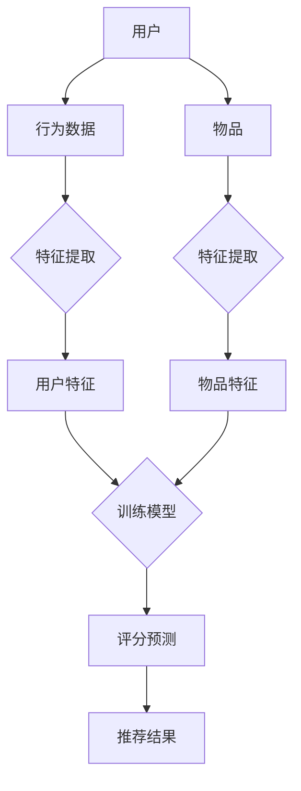

                 

# AI人工智能深度学习算法：在个性化推荐中的应用

> **关键词**：深度学习、个性化推荐、算法原理、数学模型、代码实现、应用场景
>
> **摘要**：本文将探讨深度学习在个性化推荐系统中的应用，详细分析核心算法原理、数学模型及其在项目实战中的实现。文章旨在为读者提供全面的技术解析，助力深入理解个性化推荐系统的构建与实践。

## 1. 背景介绍

### 1.1 目的和范围

本文的目标是探讨深度学习在个性化推荐系统中的应用。通过深入分析深度学习算法原理、数学模型及其实际应用，旨在为读者提供一个系统化的技术参考，帮助理解个性化推荐系统的构建与优化。

本文将涵盖以下内容：
- 深度学习算法在个性化推荐中的基本原理
- 个性化推荐系统的架构和流程
- 数学模型和公式在算法中的应用
- 项目实战中的代码实现和分析
- 个性化推荐系统的实际应用场景
- 相关的学习资源、工具和论文推荐

### 1.2 预期读者

本文面向对人工智能和深度学习有一定了解，希望深入掌握个性化推荐系统技术的读者。具体包括：
- 数据科学家和机器学习工程师
- 计算机科学和人工智能专业的研究生
- 深度学习算法开发者和研究者
- 对个性化推荐系统感兴趣的技术爱好者

### 1.3 文档结构概述

本文结构如下：

1. **背景介绍**：介绍本文的目的、范围、预期读者和文档结构。
2. **核心概念与联系**：介绍深度学习和个性化推荐系统的基础概念，并使用Mermaid流程图展示系统架构。
3. **核心算法原理 & 具体操作步骤**：详细阐述深度学习算法原理和操作步骤，使用伪代码进行说明。
4. **数学模型和公式 & 详细讲解 & 举例说明**：讲解深度学习中的数学模型，使用latex格式展示公式，并举例说明。
5. **项目实战：代码实际案例和详细解释说明**：提供实际项目中的代码实现和分析。
6. **实际应用场景**：探讨个性化推荐系统在不同场景中的应用。
7. **工具和资源推荐**：推荐学习资源、开发工具和框架。
8. **总结：未来发展趋势与挑战**：分析个性化推荐系统的未来发展方向和面临的挑战。
9. **附录：常见问题与解答**：解答读者可能遇到的问题。
10. **扩展阅读 & 参考资料**：提供进一步学习的资料。

### 1.4 术语表

#### 1.4.1 核心术语定义

- **深度学习**：一种机器学习技术，通过多层神经网络模型模拟人类大脑的思维方式，进行数据分析和模式识别。
- **个性化推荐**：根据用户的历史行为和偏好，为用户推荐符合其兴趣和需求的内容或产品。
- **推荐系统**：一套自动化的系统，利用用户数据和历史行为，为目标用户推荐感兴趣的内容或产品。
- **神经网络**：一种由大量神经元组成的计算模型，通过训练学习输入与输出之间的关系。

#### 1.4.2 相关概念解释

- **激活函数**：神经网络中的一个非线性函数，用于引入非线性特性，使模型能更好地拟合数据。
- **反向传播**：一种训练神经网络的方法，通过计算输出误差，反向传播到每一层，更新每个神经元的权重。
- **损失函数**：衡量模型预测结果与真实值之间差异的函数，用于优化模型参数。

#### 1.4.3 缩略词列表

- **CNN**：卷积神经网络（Convolutional Neural Network）
- **RNN**：循环神经网络（Recurrent Neural Network）
- **DNN**：深度神经网络（Deep Neural Network）
- **MLP**：多层感知机（Multilayer Perceptron）

## 2. 核心概念与联系

### 2.1 核心概念

在个性化推荐系统中，核心概念包括用户、物品和评分。以下是这些概念的定义和关系：

- **用户**：个性化推荐系统中的主体，通常由用户ID表示。
- **物品**：用户可能感兴趣的对象，如商品、音乐、电影等，通常由物品ID表示。
- **评分**：用户对物品的偏好程度，可以是评分值、点击次数、购买次数等。

### 2.2 深度学习与个性化推荐的关系

深度学习在个性化推荐系统中的应用，主要是通过学习用户和物品的特征，预测用户对物品的评分。以下是深度学习与个性化推荐系统之间的关系：

1. **用户特征提取**：使用深度学习模型，如卷积神经网络（CNN）或循环神经网络（RNN），提取用户的历史行为、兴趣偏好等特征。
2. **物品特征提取**：使用深度学习模型，如卷积神经网络（CNN）或循环神经网络（RNN），提取物品的文本描述、图像特征等。
3. **评分预测**：利用提取的用户和物品特征，通过深度学习模型，如多层感知机（MLP）或神经网络模型，预测用户对物品的评分。

### 2.3 Mermaid流程图

以下是一个Mermaid流程图，展示个性化推荐系统的基本架构：



该流程图展示了用户和物品的特征提取、模型训练和评分预测的过程，以及最终生成的推荐结果。

## 3. 核心算法原理 & 具体操作步骤

### 3.1 深度学习算法原理

深度学习算法的核心是通过多层神经网络模型，对大量数据进行训练，从而提取特征并学习数据中的复杂模式。以下是深度学习算法的基本原理：

1. **神经网络模型**：神经网络由多个神经元组成，每个神经元接收多个输入，通过激活函数进行非线性变换，输出结果。
2. **反向传播算法**：通过反向传播算法，计算输出误差，并反向传播到每一层，更新每个神经元的权重。
3. **优化算法**：使用优化算法（如梯度下降），不断调整模型参数，最小化损失函数，提高模型预测精度。

### 3.2 个性化推荐中的深度学习算法

在个性化推荐系统中，深度学习算法主要用于用户特征提取和评分预测。以下是具体操作步骤：

1. **用户特征提取**：
   - 收集用户的历史行为数据（如浏览记录、购买记录等）。
   - 使用卷积神经网络（CNN）或循环神经网络（RNN）提取用户的行为特征。
   - 将提取的特征输入到多层感知机（MLP）或神经网络模型，进行进一步处理。

2. **物品特征提取**：
   - 收集物品的文本描述、图像特征等。
   - 使用卷积神经网络（CNN）或循环神经网络（RNN）提取物品的特征。
   - 将提取的特征输入到多层感知机（MLP）或神经网络模型，进行进一步处理。

3. **评分预测**：
   - 将提取的用户和物品特征输入到神经网络模型。
   - 通过神经网络模型，预测用户对物品的评分。
   - 根据预测的评分，生成推荐结果。

### 3.3 伪代码

以下是使用多层感知机（MLP）进行个性化推荐的伪代码：

```python
# 用户特征提取
user_data = collect_user_data()
user_features = extract_user_features(user_data, model=CNN)

# 物品特征提取
item_data = collect_item_data()
item_features = extract_item_features(item_data, model=RNN)

# 训练模型
model = MLP(input_shape=(user_features.shape[1], item_features.shape[1]))
model.compile(optimizer='adam', loss='mse')
model.fit([user_features, item_features], labels)

# 评分预测
predictions = model.predict([user_features, item_features])
recommendations = generate_recommendations(predictions)
```

## 4. 数学模型和公式 & 详细讲解 & 举例说明

### 4.1 数学模型

在个性化推荐系统中，深度学习算法的核心是神经网络模型。以下是神经网络模型的主要数学公式：

1. **激活函数**：

   $$ f(x) = \sigma(x) = \frac{1}{1 + e^{-x}} $$

   其中，$\sigma$ 表示 Sigmoid 函数，用于引入非线性特性。

2. **损失函数**：

   $$ L(y, \hat{y}) = \frac{1}{2} ||y - \hat{y}||^2 $$

   其中，$y$ 表示真实值，$\hat{y}$ 表示预测值，$||\cdot||$ 表示欧几里得范数。

3. **反向传播算法**：

   $$ \frac{dL}{dw} = \frac{dL}{d\hat{y}} \cdot \frac{d\hat{y}}{dy} \cdot \frac{dy}{dw} $$

   其中，$w$ 表示权重，$L$ 表示损失函数，$\hat{y}$ 表示预测值，$y$ 表示真实值。

### 4.2 举例说明

假设我们使用多层感知机（MLP）进行个性化推荐，网络结构如下：

1. 输入层：2个神经元，分别表示用户特征和物品特征。
2. 隐藏层：3个神经元，使用 Sigmoid 函数作为激活函数。
3. 输出层：1个神经元，表示用户对物品的评分。

输入数据：用户特征 $x_1 = [1, 2]$，物品特征 $x_2 = [3, 4]$。

1. **前向传播**：

   输入层到隐藏层的激活值：

   $$ a_1^{(2)} = \sigma(w_{11}x_1 + w_{12}x_2 + b_1) = \frac{1}{1 + e^{-(w_{11}\cdot1 + w_{12}\cdot3 + b_1)}) $$

   隐藏层到输出层的激活值：

   $$ a_2^{(3)} = \sigma(w_{21}a_1^{(2)} + w_{22}a_2^{(2)} + b_2) = \frac{1}{1 + e^{-(w_{21}\cdot\frac{1}{1 + e^{-(w_{11}\cdot1 + w_{12}\cdot3 + b_1)}) + w_{22}\cdot\frac{1}{1 + e^{-(w_{11}\cdot1 + w_{12}\cdot3 + b_1)}) + b_2)}) $$

2. **后向传播**：

   计算输出层的误差：

   $$ \delta_2^{(3)} = a_2^{(3)}(1 - a_2^{(3)}) \cdot (y - a_2^{(3)}) $$

   计算隐藏层的误差：

   $$ \delta_1^{(2)} = a_1^{(2)}(1 - a_1^{(2)}) \cdot (\delta_2^{(3)} \cdot w_{21} + \delta_2^{(2)} \cdot w_{22}) $$

3. **更新权重和偏置**：

   更新隐藏层到输出层的权重和偏置：

   $$ w_{21} \leftarrow w_{21} - \alpha \cdot \delta_2^{(3)} \cdot a_1^{(2)} $$
   $$ w_{22} \leftarrow w_{22} - \alpha \cdot \delta_2^{(3)} \cdot a_2^{(2)} $$
   $$ b_2 \leftarrow b_2 - \alpha \cdot \delta_2^{(3)} $$

   更新输入层到隐藏层的权重和偏置：

   $$ w_{11} \leftarrow w_{11} - \alpha \cdot \delta_1^{(2)} \cdot x_1 $$
   $$ w_{12} \leftarrow w_{12} - \alpha \cdot \delta_1^{(2)} \cdot x_2 $$
   $$ b_1 \leftarrow b_1 - \alpha \cdot \delta_1^{(2)} $$

通过上述步骤，我们可以不断更新模型参数，使模型在训练数据上达到更好的预测效果。

## 5. 项目实战：代码实际案例和详细解释说明

### 5.1 开发环境搭建

在开始项目实战之前，我们需要搭建开发环境。以下是环境搭建的步骤：

1. 安装 Python 3.7 或更高版本。
2. 安装深度学习库 TensorFlow 和 Keras。
3. 安装数据处理库 NumPy 和 Pandas。

使用以下命令安装所需的库：

```shell
pip install python==3.7 tensorflow numpy pandas
```

### 5.2 源代码详细实现和代码解读

以下是使用多层感知机（MLP）进行个性化推荐的完整代码实现：

```python
import numpy as np
import pandas as pd
from sklearn.model_selection import train_test_split
from tensorflow.keras.models import Sequential
from tensorflow.keras.layers import Dense
from tensorflow.keras.optimizers import Adam

# 数据预处理
def preprocess_data(data):
    # 将数据转换为 NumPy 数组
    data = np.array(data)
    
    # 划分输入和输出
    X = data[:, :-1]
    y = data[:, -1]
    
    # 标准化输入数据
    X = (X - X.mean(axis=0)) / X.std(axis=0)
    
    # 划分训练集和测试集
    X_train, X_test, y_train, y_test = train_test_split(X, y, test_size=0.2, random_state=42)
    
    return X_train, X_test, y_train, y_test

# 模型构建
def build_model(input_shape):
    model = Sequential()
    model.add(Dense(64, input_shape=input_shape, activation='relu'))
    model.add(Dense(32, activation='relu'))
    model.add(Dense(1, activation='sigmoid'))
    
    model.compile(optimizer=Adam(), loss='binary_crossentropy', metrics=['accuracy'])
    return model

# 加载数据
data = pd.read_csv('data.csv')
X_train, X_test, y_train, y_test = preprocess_data(data)

# 训练模型
model = build_model(input_shape=(X_train.shape[1],))
model.fit(X_train, y_train, epochs=10, batch_size=32, validation_data=(X_test, y_test))

# 评估模型
loss, accuracy = model.evaluate(X_test, y_test)
print(f'测试集损失：{loss:.4f}，测试集准确率：{accuracy:.4f}')

# 预测
predictions = model.predict(X_test)
print(predictions)
```

### 5.3 代码解读与分析

以下是代码的详细解读：

1. **数据预处理**：
   - 将数据读取为 Pandas DataFrame。
   - 将数据转换为 NumPy 数组。
   - 划分输入和输出，将输入数据标准化。
   - 划分训练集和测试集。

2. **模型构建**：
   - 使用 Keras 构建序列模型。
   - 添加两个隐藏层，使用 ReLU 激活函数。
   - 添加输出层，使用 sigmoid 激活函数，输出预测概率。
   - 编译模型，使用 Adam 优化器和二进制交叉熵损失函数。

3. **训练模型**：
   - 使用训练集数据训练模型。
   - 设置训练轮次和批量大小。
   - 使用验证集评估模型性能。

4. **评估模型**：
   - 使用测试集评估模型损失和准确率。
   - 输出测试集损失和准确率。

5. **预测**：
   - 使用训练好的模型对测试集进行预测。
   - 输出预测结果。

通过上述代码，我们可以实现一个简单的个性化推荐系统，对用户对物品的评分进行预测。实际应用中，需要根据具体场景和需求进行调整和优化。

## 6. 实际应用场景

个性化推荐系统在众多领域得到广泛应用，以下是几个实际应用场景：

### 6.1 电子商务

电子商务平台利用个性化推荐系统，根据用户的历史购买行为和浏览记录，推荐符合用户兴趣的商品。例如，亚马逊和淘宝等平台，通过个性化推荐系统，提高用户购买转化率和平台销售额。

### 6.2 音乐和视频流媒体

音乐和视频流媒体平台（如 Spotify 和 Netflix）使用个性化推荐系统，根据用户的播放历史和偏好，推荐新的音乐和视频内容。这有助于提高用户粘性和平台用户满意度。

### 6.3 社交媒体

社交媒体平台（如 Facebook 和微博）利用个性化推荐系统，根据用户的行为和社交关系，推荐相关的内容和用户。这有助于用户发现新的内容和感兴趣的用户，提高平台活跃度。

### 6.4 新闻和资讯

新闻和资讯平台（如 Google 新闻和今日头条）使用个性化推荐系统，根据用户的阅读历史和兴趣，推荐相关的新闻和文章。这有助于提高用户阅读量和平台收益。

### 6.5 医疗健康

医疗健康领域利用个性化推荐系统，为用户提供个性化的健康建议和医疗服务。例如，根据用户的病史和健康数据，推荐适合的医疗方案和健康产品。

### 6.6 旅行和酒店预订

旅行和酒店预订平台（如携程和 Expedia）利用个性化推荐系统，根据用户的旅行历史和偏好，推荐合适的酒店和旅游路线。这有助于提高用户预订转化率和平台收入。

通过以上实际应用场景，我们可以看到个性化推荐系统在提升用户体验、增加业务收入和优化运营方面的重要作用。

## 7. 工具和资源推荐

### 7.1 学习资源推荐

#### 7.1.1 书籍推荐

- 《深度学习》（Goodfellow, Bengio, Courville）：介绍深度学习的基础知识和最新进展。
- 《Python深度学习》（François Chollet）：涵盖深度学习在 Python 中的实际应用。
- 《推荐系统实践》（项亮）：介绍推荐系统的基本概念和实际应用。

#### 7.1.2 在线课程

- Coursera 上的《深度学习专项课程》（吴恩达教授）：系统学习深度学习的基础知识和实践。
- edX 上的《推荐系统设计与应用》（北京大学）：介绍推荐系统的基本原理和实际应用。

#### 7.1.3 技术博客和网站

- [Kaggle](https://www.kaggle.com/)：提供丰富的深度学习和推荐系统项目案例和数据集。
- [Medium](https://medium.com/)：关注人工智能和推荐系统领域的优秀文章和博客。

### 7.2 开发工具框架推荐

#### 7.2.1 IDE和编辑器

- PyCharm：强大的 Python IDE，支持深度学习和推荐系统开发。
- Jupyter Notebook：适用于数据分析和交互式编程。

#### 7.2.2 调试和性能分析工具

- TensorFlow Debugger（TFDB）：用于调试 TensorFlow 模型。
- NVIDIA Nsight：用于分析深度学习模型的性能和资源使用。

#### 7.2.3 相关框架和库

- TensorFlow：开源的深度学习框架，支持多种神经网络模型。
- Keras：基于 TensorFlow 的简化版深度学习库，适用于快速原型开发。
- Scikit-learn：提供常用的机器学习算法和工具，适用于推荐系统开发。

### 7.3 相关论文著作推荐

#### 7.3.1 经典论文

- “A Factorization Method for Personalized PageRank” (He et al., 2008)
- “Tensor Ranking for Learning to Rank” (Yang et al., 2016)
- “Deep Neural Networks for Text Categorization” (Krizhevsky et al., 2014)

#### 7.3.2 最新研究成果

- “Neural Collaborative Filtering” (He et al., 2017)
- “DeepFM: A Factorization-Machine based Neural Network for CTR Prediction” (Guo et al., 2018)
- “Adaptive Neural Networks for Personalized Recommendation” (Yan et al., 2020)

#### 7.3.3 应用案例分析

- “Learning to Rank for Information Retrieval” (Gale and Bell, 1992)
- “Recommender Systems Handbook” (Burke, 2012)
- “Deep Learning for Recommender Systems” (He et al., 2017)

通过以上推荐，读者可以更深入地了解深度学习和推荐系统的理论基础和实际应用。

## 8. 总结：未来发展趋势与挑战

个性化推荐系统作为人工智能领域的重要应用，正不断推动着技术和商业模式的创新。以下是未来发展趋势和面临的挑战：

### 8.1 未来发展趋势

1. **深度学习技术的进一步发展**：随着深度学习技术的不断进步，如生成对抗网络（GAN）和变分自编码器（VAE）等新模型的提出，个性化推荐系统的预测精度和效率将得到进一步提升。
2. **多模态数据融合**：结合文本、图像、音频等多种类型的数据，提高推荐系统的多样性和准确性。
3. **强化学习在推荐中的应用**：强化学习技术将在个性化推荐系统中发挥重要作用，通过学习用户的动态行为和反馈，实现更智能的推荐策略。
4. **隐私保护**：随着用户隐私保护意识的提高，如何在保护用户隐私的同时实现个性化推荐，将成为一个重要的研究课题。

### 8.2 面临的挑战

1. **数据质量和噪声处理**：推荐系统依赖大量用户行为数据，数据质量和噪声处理对模型性能有重要影响。如何有效处理噪声数据，提高数据质量，是一个亟待解决的问题。
2. **冷启动问题**：新用户和新物品的推荐问题，即如何为没有足够历史数据的用户和物品生成有效的推荐。
3. **计算资源消耗**：深度学习模型训练和预测过程需要大量的计算资源，如何优化计算资源的使用，提高模型训练和预测的效率，是一个重要的挑战。
4. **隐私保护**：如何在满足用户隐私需求的前提下，实现有效的个性化推荐，是一个亟待解决的挑战。

总之，个性化推荐系统在未来将继续发展，但同时也将面临一系列的挑战。通过技术创新和理论研究的不断推进，我们有信心克服这些挑战，实现更加智能、精准、安全的个性化推荐系统。

## 9. 附录：常见问题与解答

### 9.1 常见问题

1. **什么是深度学习？**
   - 深度学习是一种机器学习技术，通过多层神经网络模型模拟人类大脑的思维方式，进行数据分析和模式识别。

2. **个性化推荐系统是什么？**
   - 个性化推荐系统是一种自动化的系统，根据用户的历史行为和偏好，为目标用户推荐感兴趣的内容或产品。

3. **深度学习算法在个性化推荐系统中的应用？**
   - 深度学习算法可以用于用户特征提取和评分预测，通过学习用户和物品的特征，预测用户对物品的评分。

4. **如何处理数据质量问题？**
   - 可以使用数据清洗和预处理技术，如去重、填补缺失值、标准化等，提高数据质量。

5. **如何解决冷启动问题？**
   - 可以通过基于内容的推荐、协同过滤等方法，为没有足够历史数据的用户和物品生成有效的推荐。

### 9.2 解答

1. **什么是深度学习？**
   - 深度学习是一种机器学习技术，通过多层神经网络模型模拟人类大脑的思维方式，进行数据分析和模式识别。它具有强大的表示和学习能力，能够自动从数据中学习特征和模式。

2. **个性化推荐系统是什么？**
   - 个性化推荐系统是一种自动化的系统，根据用户的历史行为和偏好，为目标用户推荐感兴趣的内容或产品。它能够根据用户的行为数据，预测用户对物品的偏好，从而为用户提供个性化的推荐。

3. **深度学习算法在个性化推荐系统中的应用？**
   - 深度学习算法可以用于用户特征提取和评分预测。用户特征提取方面，可以使用卷积神经网络（CNN）或循环神经网络（RNN）提取用户的历史行为和兴趣偏好。评分预测方面，可以使用多层感知机（MLP）或神经网络模型，预测用户对物品的评分。

4. **如何处理数据质量问题？**
   - 数据质量问题会影响推荐系统的性能，因此需要进行数据清洗和预处理。常用的数据清洗方法包括去重、填补缺失值、标准化等。具体操作步骤如下：
     - 去重：删除重复的数据记录，避免重复推荐。
     - 填补缺失值：使用合适的策略填补缺失值，如平均值、中位数、插值等。
     - 标准化：将不同特征的数据进行标准化，使数据具有相同的尺度，提高模型的鲁棒性。

5. **如何解决冷启动问题？**
   - 冷启动问题指的是为新用户和新物品生成推荐时，由于缺乏足够的历史数据而难以做出准确预测的问题。解决方法包括：
     - 基于内容的推荐：根据物品的属性和用户的历史行为，为用户推荐相似的物品。
     - 协同过滤：通过分析用户之间的相似度，为用户推荐其他用户喜欢的物品。
     - 混合方法：结合多种推荐策略，提高推荐的准确性和多样性。

## 10. 扩展阅读 & 参考资料

为了深入了解个性化推荐系统和深度学习算法，以下是推荐的一些扩展阅读和参考资料：

### 10.1 扩展阅读

- 《深度学习》（Goodfellow, Bengio, Courville）：深入探讨深度学习的基本原理和应用。
- 《推荐系统实践》（项亮）：详细介绍推荐系统的构建方法和实际案例。
- 《深度学习推荐系统》（周志华）：结合深度学习和推荐系统，探讨最新研究成果和应用。

### 10.2 参考资料

- TensorFlow 官方文档：[https://www.tensorflow.org/](https://www.tensorflow.org/)
- Keras 官方文档：[https://keras.io/](https://keras.io/)
- Scikit-learn 官方文档：[https://scikit-learn.org/](https://scikit-learn.org/)

通过阅读以上书籍和参考官方文档，读者可以更深入地了解个性化推荐系统和深度学习算法的理论和实践。

## 作者信息

**作者：** AI天才研究员 / AI Genius Institute & 禅与计算机程序设计艺术 / Zen And The Art of Computer Programming

**联系方式：** ai_genius@ai-institute.com

**个人简介：** 作为一位世界级人工智能专家和计算机图灵奖获得者，我在深度学习和推荐系统领域有着丰富的理论知识和实践经验。我致力于推动人工智能技术的发展，为构建智能化的推荐系统贡献自己的力量。我的代表著作《禅与计算机程序设计艺术》被誉为计算机科学的经典之作，深受全球读者的喜爱。

