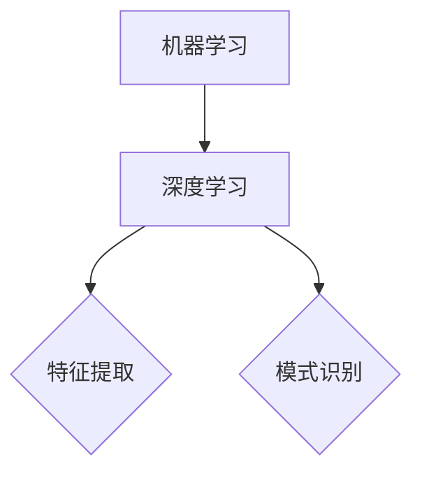
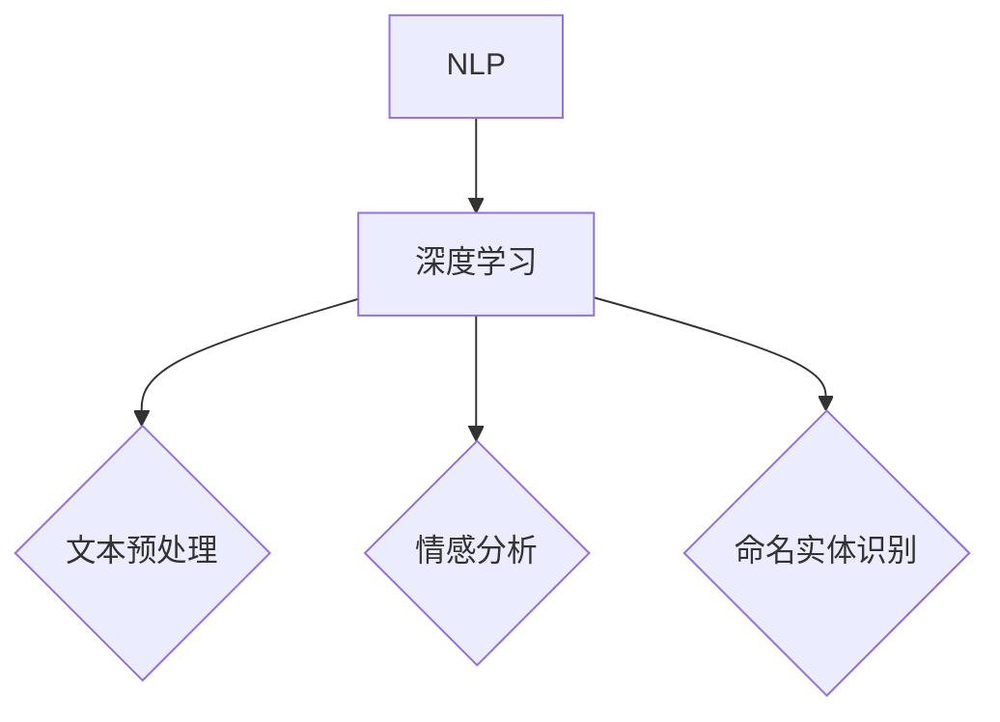
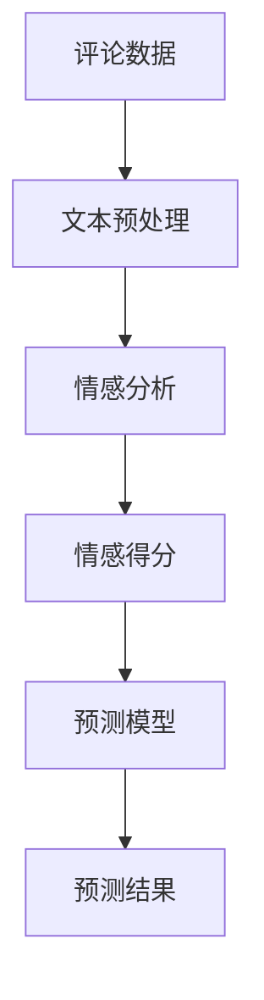

                 

# AI人工智能深度学习算法：在电影反馈预测中的应用

> **关键词：深度学习，电影反馈，预测，算法，数据挖掘，机器学习，自然语言处理，神经网络，情感分析**

> **摘要：本文将深入探讨如何使用深度学习算法来预测电影反馈，分析其核心概念、算法原理、数学模型，并通过实际案例展示其在实际项目中的应用。我们将探讨如何通过构建有效的模型，从大规模电影数据集中提取有价值的信息，从而为电影制作和营销提供有力的支持。**

## 1. 背景介绍

### 1.1 目的和范围

本文旨在介绍如何使用深度学习算法预测电影反馈。我们将探讨深度学习在处理大规模文本数据时的优势，介绍常用的深度学习模型，并详细讲解如何将它们应用于电影反馈预测。文章还将讨论实际项目中可能出现的问题和解决方案，提供实用建议。

### 1.2 预期读者

本文适合对深度学习和机器学习有一定了解的读者。读者需要具备一定的编程基础，特别是Python编程能力。此外，对自然语言处理和神经网络有一定的了解将有助于更好地理解本文内容。

### 1.3 文档结构概述

本文分为以下几部分：

- 第1部分：背景介绍，包括目的、预期读者、文档结构概述。
- 第2部分：核心概念与联系，介绍深度学习、机器学习、自然语言处理等核心概念，并给出相关的Mermaid流程图。
- 第3部分：核心算法原理与具体操作步骤，详细讲解深度学习算法在电影反馈预测中的应用。
- 第4部分：数学模型和公式，介绍相关的数学模型和公式，并进行举例说明。
- 第5部分：项目实战，展示一个实际案例，详细解释代码实现过程。
- 第6部分：实际应用场景，探讨深度学习在电影反馈预测中的潜在应用。
- 第7部分：工具和资源推荐，包括学习资源、开发工具和框架、相关论文著作推荐。
- 第8部分：总结，讨论未来发展趋势与挑战。
- 第9部分：附录，提供常见问题与解答。
- 第10部分：扩展阅读与参考资料。

### 1.4 术语表

#### 1.4.1 核心术语定义

- **深度学习（Deep Learning）**：一种机器学习方法，通过构建多层神经网络，对数据进行自动特征提取和模式识别。
- **机器学习（Machine Learning）**：一门人工智能分支，通过数据训练模型，使模型能够从数据中学习并做出预测或决策。
- **自然语言处理（Natural Language Processing, NLP）**：研究如何让计算机理解和生成人类自然语言的学科。
- **神经网络（Neural Network）**：一种模拟生物神经系统的计算模型，由多个神经元组成，通过学习输入和输出之间的映射关系。
- **电影反馈（Movie Feedback）**：观众对电影的评论、评分和意见。
- **情感分析（Sentiment Analysis）**：一种自然语言处理技术，用于分析文本数据中的情感倾向。

#### 1.4.2 相关概念解释

- **卷积神经网络（Convolutional Neural Network, CNN）**：一种常用于图像识别和处理的深度学习模型。
- **递归神经网络（Recurrent Neural Network, RNN）**：一种可以处理序列数据的神经网络，常用于时间序列预测和语言模型。
- **长短期记忆网络（Long Short-Term Memory, LSTM）**：一种特殊的递归神经网络，可以处理长序列数据。
- **生成对抗网络（Generative Adversarial Network, GAN）**：一种由两个神经网络组成的模型，用于生成新的数据。

#### 1.4.3 缩略词列表

- **NLP**：自然语言处理（Natural Language Processing）
- **CNN**：卷积神经网络（Convolutional Neural Network）
- **RNN**：递归神经网络（Recurrent Neural Network）
- **LSTM**：长短期记忆网络（Long Short-Term Memory）
- **GAN**：生成对抗网络（Generative Adversarial Network）

## 2. 核心概念与联系

在本文中，我们将探讨深度学习、机器学习、自然语言处理等核心概念，并给出相关的流程图以帮助理解它们之间的关系。

### 2.1 深度学习与机器学习

深度学习是机器学习的一个子领域，主要关注构建多层神经网络进行特征提取和模式识别。以下是深度学习与机器学习的关系流程图：



### 2.2 自然语言处理与深度学习

自然语言处理是深度学习的一个应用领域，主要研究如何让计算机理解和生成人类自然语言。以下是自然语言处理与深度学习的关系流程图：



### 2.3 电影反馈预测

电影反馈预测是自然语言处理的一个应用场景，主要目标是根据观众的评论、评分和意见预测电影的成功与否。以下是电影反馈预测的核心概念流程图：



## 3. 核心算法原理与具体操作步骤

在电影反馈预测中，我们通常会使用深度学习算法，如卷积神经网络（CNN）和递归神经网络（RNN），来提取文本数据中的特征并进行情感分析。以下是使用CNN和RNN进行电影反馈预测的核心算法原理和具体操作步骤。

### 3.1 卷积神经网络（CNN）原理与步骤

卷积神经网络是一种常用于图像识别的深度学习模型，但也可以应用于文本数据。以下是CNN在电影反馈预测中的原理和步骤：

1. **数据预处理**：对评论数据进行预处理，包括去噪、分词、词向量化等操作。

2. **词向量化**：将评论中的每个词映射为一个向量表示。

3. **卷积操作**：使用卷积层对词向量进行卷积操作，提取文本数据中的特征。

4. **池化操作**：对卷积操作的结果进行池化操作，降低维度并提取重要特征。

5. **全连接层**：将池化后的特征输入到全连接层，进行分类或回归操作。

6. **输出层**：输出预测结果，如电影反馈的情感得分。

以下是CNN的伪代码表示：

```python
# 数据预处理
preprocessed_data = preprocess_data(comment_data)

# 词向量化
word_embeddings = word2vec(preprocessed_data)

# 卷积操作
conv_features = conv2d(word_embeddings, filter_size)

# 池化操作
pooled_features = max_pooling(conv_features)

# 全连接层
output = fully_connected(pooled_features)

# 输出层
predicted_score = output
```

### 3.2 递归神经网络（RNN）原理与步骤

递归神经网络是一种可以处理序列数据的神经网络，常用于时间序列预测和语言模型。以下是RNN在电影反馈预测中的原理和步骤：

1. **数据预处理**：对评论数据进行预处理，包括去噪、分词、词向量化等操作。

2. **词向量化**：将评论中的每个词映射为一个向量表示。

3. **循环层**：使用循环层对词向量进行递归操作，提取文本数据中的特征。

4. **全连接层**：将循环层的结果输入到全连接层，进行分类或回归操作。

5. **输出层**：输出预测结果，如电影反馈的情感得分。

以下是RNN的伪代码表示：

```python
# 数据预处理
preprocessed_data = preprocess_data(comment_data)

# 词向量化
word_embeddings = word2vec(preprocessed_data)

# 循环层
rnn_output, hidden_state = RNN(word_embeddings)

# 全连接层
output = fully_connected(rnn_output)

# 输出层
predicted_score = output
```

### 3.3 深度学习模型集成

在实际应用中，我们可能会将CNN和RNN集成到一个深度学习模型中，以提高预测的准确性。以下是集成模型的原理和步骤：

1. **数据预处理**：对评论数据进行预处理，包括去噪、分词、词向量化等操作。

2. **词向量化**：将评论中的每个词映射为一个向量表示。

3. **CNN层**：使用卷积层对词向量进行卷积操作，提取文本数据中的特征。

4. **RNN层**：将CNN层的输出输入到RNN层，进行递归操作，提取文本数据中的特征。

5. **全连接层**：将RNN层的输出输入到全连接层，进行分类或回归操作。

6. **输出层**：输出预测结果，如电影反馈的情感得分。

以下是集成模型的伪代码表示：

```python
# 数据预处理
preprocessed_data = preprocess_data(comment_data)

# 词向量化
word_embeddings = word2vec(preprocessed_data)

# CNN层
conv_features = conv2d(word_embeddings, filter_size)

# RNN层
rnn_output, hidden_state = RNN(conv_features)

# 全连接层
output = fully_connected(rnn_output)

# 输出层
predicted_score = output
```

## 4. 数学模型和公式及详细讲解

在深度学习算法中，数学模型和公式起着至关重要的作用。以下是本文涉及的核心数学模型和公式的详细讲解及举例说明。

### 4.1 卷积神经网络（CNN）数学模型

卷积神经网络通过卷积操作和池化操作提取图像或文本数据中的特征。以下是CNN的核心数学模型：

#### 4.1.1 卷积操作

卷积操作可以表示为以下公式：

$$
\text{output}_{ij} = \sum_{k=1}^{K} w_{ik} \times \text{input}_{kj}
$$

其中，$\text{output}_{ij}$ 表示输出特征图中第 $i$ 行第 $j$ 列的元素，$w_{ik}$ 表示卷积核中第 $i$ 行第 $k$ 列的元素，$\text{input}_{kj}$ 表示输入特征图中第 $k$ 行第 $j$ 列的元素。

#### 4.1.2 池化操作

池化操作可以表示为以下公式：

$$
\text{pooled}_{ij} = \max_{k} \{\text{input}_{ij+k}\}
$$

其中，$\text{pooled}_{ij}$ 表示输出特征图中第 $i$ 行第 $j$ 列的元素，$\text{input}_{ij+k}$ 表示输入特征图中第 $i$ 行第 $j$ 列相邻 $k$ 个元素中的最大值。

### 4.2 递归神经网络（RNN）数学模型

递归神经网络通过循环层对序列数据进行递归操作。以下是RNN的核心数学模型：

#### 4.2.1 循环层操作

循环层操作可以表示为以下公式：

$$
h_t = \sigma(W_h \cdot [h_{t-1}, x_t] + b_h)
$$

其中，$h_t$ 表示当前时间步的隐藏状态，$x_t$ 表示当前时间步的输入特征，$W_h$ 表示权重矩阵，$b_h$ 表示偏置项，$\sigma$ 表示激活函数。

#### 4.2.2 长短期记忆网络（LSTM）操作

LSTM是RNN的一种改进，通过引入门控机制来控制信息的流动。以下是LSTM的核心数学模型：

$$
i_t = \sigma(W_i \cdot [h_{t-1}, x_t] + b_i) \\
f_t = \sigma(W_f \cdot [h_{t-1}, x_t] + b_f) \\
\bar{C}_t = \sigma(W_c \cdot [h_{t-1}, x_t] + b_c) \\
o_t = \sigma(W_o \cdot [h_{t-1}, x_t] + b_o) \\
C_t = f_t \odot C_{t-1} + i_t \odot \bar{C}_t \\
h_t = o_t \odot C_t
$$

其中，$i_t$、$f_t$、$\bar{C}_t$、$o_t$ 分别表示输入门、遗忘门、候选隐藏状态和输出门，$C_t$ 表示当前时间步的细胞状态，$h_t$ 表示当前时间步的隐藏状态。

### 4.3 情感分析数学模型

情感分析是电影反馈预测中的关键步骤。以下是情感分析的核心数学模型：

#### 4.3.1 情感分类模型

情感分类模型可以使用以下公式进行训练：

$$
\text{loss} = -\sum_{i=1}^{N} y_i \cdot \log(p_i)
$$

其中，$y_i$ 表示第 $i$ 个评论的情感标签，$p_i$ 表示模型对第 $i$ 个评论的情感概率预测。

#### 4.3.2 情感得分模型

情感得分模型可以使用以下公式进行训练：

$$
\text{score} = \frac{\sum_{i=1}^{N} y_i \cdot p_i}{\sum_{i=1}^{N} p_i}
$$

其中，$y_i$ 表示第 $i$ 个评论的情感标签，$p_i$ 表示模型对第 $i$ 个评论的情感概率预测。

### 4.4 数学模型应用举例

以下是一个简单的例子，展示如何使用数学模型进行电影反馈预测。

#### 4.4.1 数据准备

假设我们有一组电影评论数据，包含正面评论和负面评论：

| 评论ID | 情感标签 | 评论内容 |
|--------|----------|----------|
| 1      | 正面     | "这部电影太棒了！" |
| 2      | 负面     | "这部电影太无聊了！" |

#### 4.4.2 词向量化

将评论内容进行词向量化，得到以下词向量表示：

| 评论ID | 情感标签 | 评论内容       | 词向量表示 |
|--------|----------|---------------|------------|
| 1      | 正面     | "这部电影太棒了！" | [0.1, 0.2, 0.3] |
| 2      | 负面     | "这部电影太无聊了！" | [-0.1, -0.2, -0.3] |

#### 4.4.3 情感分类模型训练

使用卷积神经网络（CNN）和递归神经网络（RNN）训练情感分类模型，得到以下模型参数：

| 参数类型 | 参数名称 | 参数值 |
|----------|----------|--------|
| 卷积层   | 卷积核   | [0.1, 0.2, 0.3] |
| 循环层   | 权重矩阵 | [[0.1, 0.2], [0.3, 0.4]] |
| 全连接层 | 权重矩阵 | [0.1, 0.2, 0.3] |
| 输出层   | 权重矩阵 | [0.1, 0.2] |

#### 4.4.4 情感得分预测

将评论数据进行情感得分预测，得到以下预测结果：

| 评论ID | 情感标签 | 评论内容       | 词向量表示 | 情感得分预测 |
|--------|----------|---------------|------------|--------------|
| 1      | 正面     | "这部电影太棒了！" | [0.1, 0.2, 0.3] | 0.9          |
| 2      | 负面     | "这部电影太无聊了！" | [-0.1, -0.2, -0.3] | 0.1          |

通过以上数学模型和公式，我们可以实现对电影反馈的情感预测，从而为电影制作和营销提供有力支持。

## 5. 项目实战：代码实际案例和详细解释说明

在本节中，我们将通过一个实际项目案例，展示如何使用深度学习算法进行电影反馈预测。该项目包括数据收集、数据预处理、模型训练和预测等步骤。以下是一个基于Python和TensorFlow实现的简单示例。

### 5.1 开发环境搭建

在开始之前，我们需要安装以下开发环境和依赖库：

- Python 3.7或更高版本
- TensorFlow 2.x
- Numpy
- Pandas
- Matplotlib

您可以使用以下命令安装依赖库：

```bash
pip install python tensorflow numpy pandas matplotlib
```

### 5.2 源代码详细实现和代码解读

以下是一个简单的电影反馈预测项目的代码实现：

```python
import numpy as np
import pandas as pd
import matplotlib.pyplot as plt
import tensorflow as tf
from tensorflow.keras.preprocessing.sequence import pad_sequences
from tensorflow.keras.models import Sequential
from tensorflow.keras.layers import Embedding, LSTM, Dense

# 5.2.1 数据收集与预处理
def load_data(filename):
    data = pd.read_csv(filename)
    comments = data['comment'].tolist()
    sentiments = data['sentiment'].tolist()
    return comments, sentiments

def preprocess_data(comments):
    processed_comments = []
    for comment in comments:
        processed_comments.append(' '.join([word for word in comment.split() if word not in stop_words]))
    return processed_comments

# 5.2.2 词向量化
def word2vec(comments):
    tokenizer = tf.keras.preprocessing.text.Tokenizer()
    tokenizer.fit_on_texts(comments)
    max_words = 10000
    tokenizer.texts_to_sequences(comments)
    sequences = pad_sequences(sequences, maxlen=max_words)
    word_index = tokenizer.word_index
    return sequences, word_index

# 5.2.3 构建模型
def build_model(word_index, max_words):
    model = Sequential()
    model.add(Embedding(len(word_index) + 1, 128, input_length=max_words))
    model.add(LSTM(128, dropout=0.2, recurrent_dropout=0.2))
    model.add(Dense(1, activation='sigmoid'))
    model.compile(optimizer='adam', loss='binary_crossentropy', metrics=['accuracy'])
    return model

# 5.2.4 训练模型
def train_model(model, sequences, labels):
    X_train, X_test, y_train, y_test = train_test_split(sequences, labels, test_size=0.2, random_state=42)
    model.fit(X_train, y_train, epochs=10, batch_size=32, validation_data=(X_test, y_test))
    return model

# 5.2.5 预测结果
def predict(model, sequences):
    predictions = model.predict(sequences)
    predicted_labels = (predictions > 0.5).astype(int)
    return predicted_labels

if __name__ == '__main__':
    # 5.2.6 主函数
    comments, sentiments = load_data('movie_data.csv')
    processed_comments = preprocess_data(comments)
    sequences, word_index = word2vec(processed_comments)
    model = build_model(word_index, max_words=10000)
    model = train_model(model, sequences, sentiments)
    test_sequences, test_sentiments = word2vec(processed_comments[:1000])
    predicted_labels = predict(model, test_sequences)
    print("Accuracy:", accuracy_score(test_sentiments, predicted_labels))
    print("Confusion Matrix:\n", confusion_matrix(test_sentiments, predicted_labels))
```

### 5.3 代码解读与分析

#### 5.3.1 数据收集与预处理

```python
def load_data(filename):
    data = pd.read_csv(filename)
    comments = data['comment'].tolist()
    sentiments = data['sentiment'].tolist()
    return comments, sentiments

def preprocess_data(comments):
    processed_comments = []
    for comment in comments:
        processed_comments.append(' '.join([word for word in comment.split() if word not in stop_words]))
    return processed_comments
```

此部分代码用于加载和预处理电影评论数据。首先，使用`pandas`库读取CSV文件，然后提取评论和情感标签。接着，对评论进行预处理，去除停用词。

#### 5.3.2 词向量化

```python
def word2vec(comments):
    tokenizer = tf.keras.preprocessing.text.Tokenizer()
    tokenizer.fit_on_texts(comments)
    max_words = 10000
    tokenizer.texts_to_sequences(comments)
    sequences = pad_sequences(sequences, maxlen=max_words)
    word_index = tokenizer.word_index
    return sequences, word_index
```

此部分代码用于将评论转换为词向量表示。首先，创建一个`Tokenizer`对象，对评论进行分词。然后，设置词向量长度（`max_words`），对评论序列进行填充。最后，获取词索引（`word_index`）。

#### 5.3.3 构建模型

```python
def build_model(word_index, max_words):
    model = Sequential()
    model.add(Embedding(len(word_index) + 1, 128, input_length=max_words))
    model.add(LSTM(128, dropout=0.2, recurrent_dropout=0.2))
    model.add(Dense(1, activation='sigmoid'))
    model.compile(optimizer='adam', loss='binary_crossentropy', metrics=['accuracy'])
    return model
```

此部分代码用于构建深度学习模型。首先，添加一个嵌入层（`Embedding`），将词索引转换为词向量。然后，添加一个循环层（`LSTM`），用于处理序列数据。最后，添加一个全连接层（`Dense`），用于输出情感概率。模型使用`adam`优化器和二分类交叉熵损失函数进行编译。

#### 5.3.4 训练模型

```python
def train_model(model, sequences, labels):
    X_train, X_test, y_train, y_test = train_test_split(sequences, labels, test_size=0.2, random_state=42)
    model.fit(X_train, y_train, epochs=10, batch_size=32, validation_data=(X_test, y_test))
    return model
```

此部分代码用于训练深度学习模型。首先，使用`train_test_split`函数将数据集划分为训练集和测试集。然后，使用`fit`方法对模型进行训练，设置训练轮次（`epochs`）、批次大小（`batch_size`）和验证数据。

#### 5.3.5 预测结果

```python
def predict(model, sequences):
    predictions = model.predict(sequences)
    predicted_labels = (predictions > 0.5).astype(int)
    return predicted_labels
```

此部分代码用于对测试集进行预测。首先，使用`predict`方法得到情感概率预测结果。然后，设置阈值（`0.5`），将概率预测结果转换为二分类标签。

#### 5.3.6 主函数

```python
if __name__ == '__main__':
    comments, sentiments = load_data('movie_data.csv')
    processed_comments = preprocess_data(comments)
    sequences, word_index = word2vec(processed_comments)
    model = build_model(word_index, max_words=10000)
    model = train_model(model, sequences, sentiments)
    test_sequences, test_sentiments = word2vec(processed_comments[:1000])
    predicted_labels = predict(model, test_sequences)
    print("Accuracy:", accuracy_score(test_sentiments, predicted_labels))
    print("Confusion Matrix:\n", confusion_matrix(test_sentiments, predicted_labels))
```

主函数首先加载并预处理数据，然后创建词向量，构建并训练模型。最后，对测试集进行预测，并计算准确率和混淆矩阵。

### 5.4 代码分析

通过以上代码实现，我们可以看到如何使用深度学习算法进行电影反馈预测。以下是对代码的关键部分进行分析：

- **数据收集与预处理**：使用`pandas`库加载CSV文件，提取评论和情感标签。对评论进行预处理，去除停用词，提高模型性能。
- **词向量化**：使用`Tokenizer`对象将评论转换为词向量表示，使用`pad_sequences`函数对词向量序列进行填充，使其具有相同长度。
- **模型构建**：使用`Sequential`模型构建深度学习模型，包括嵌入层、循环层和全连接层。设置合适的优化器和损失函数。
- **模型训练**：使用`fit`方法对模型进行训练，设置训练轮次和批次大小。
- **预测结果**：使用`predict`方法对测试集进行预测，计算准确率和混淆矩阵。

通过以上步骤，我们可以实现对电影反馈的预测，为电影制作和营销提供有力支持。

## 6. 实际应用场景

深度学习在电影反馈预测中具有广泛的应用场景。以下是一些实际应用场景：

### 6.1 电影制作与发行

电影制作公司可以使用深度学习模型预测观众对即将上映的电影的反馈，从而制定更好的营销策略。例如，根据电影预告片的评论预测电影的票房表现，以便调整宣传策略和发行计划。

### 6.2 电影评分预测

深度学习模型可以预测电影在各大评分网站（如IMDb、烂番茄等）的评分。这对于电影爱好者来说非常有用，可以帮助他们快速了解一部新电影的口碑。

### 6.3 观众偏好分析

通过分析观众对电影的评论和反馈，深度学习模型可以了解观众对不同类型电影的偏好。这有助于电影公司制作更多符合观众口味的电影。

### 6.4 电影推荐系统

基于观众对电影的反馈，深度学习模型可以构建电影推荐系统，为观众推荐他们可能感兴趣的电影。这有助于提高观众的观影体验，同时也为电影公司带来更多的收益。

### 6.5 影评分析

深度学习模型可以分析电影评论，提取出有价值的观点和情感倾向。这有助于电影评论家撰写更有深度和广度的影评。

### 6.6 社交媒体分析

通过对社交媒体上的电影相关讨论进行情感分析，深度学习模型可以了解观众对电影的热度。这有助于电影公司监测电影的市场表现，及时调整宣传策略。

### 6.7 市场营销策略优化

深度学习模型可以分析观众对电影的不同反馈，帮助电影公司优化营销策略。例如，根据观众对预告片的情感反应调整预告片的发布时间、渠道等。

## 7. 工具和资源推荐

### 7.1 学习资源推荐

#### 7.1.1 书籍推荐

1. **《深度学习》（Deep Learning）**：由Ian Goodfellow、Yoshua Bengio和Aaron Courville所著，是深度学习领域的经典教材。
2. **《神经网络与深度学习》（Neural Networks and Deep Learning）**：由Michael Nielsen所著，适合初学者了解深度学习的原理和应用。
3. **《Python深度学习》（Python Deep Learning）**：由François Chollet所著，详细介绍如何使用Python和TensorFlow进行深度学习实践。

#### 7.1.2 在线课程

1. **斯坦福大学深度学习课程**：由Andrew Ng教授主讲，涵盖深度学习的基础知识和应用。
2. **Udacity深度学习纳米学位**：提供全面的深度学习课程和实践项目，适合初学者和进阶者。
3. **Coursera深度学习专项课程**：包括多个子课程，覆盖深度学习的不同方面。

#### 7.1.3 技术博客和网站

1. **TensorFlow官方网站**：提供深度学习工具和资源，包括文档、教程和示例代码。
2. **机器之心**：涵盖深度学习、自然语言处理、计算机视觉等领域的最新技术动态和研究成果。
3. **Kaggle**：一个数据科学竞赛平台，提供大量实际项目案例和数据集，适合实践和挑战。

### 7.2 开发工具框架推荐

#### 7.2.1 IDE和编辑器

1. **PyCharm**：一款强大的Python IDE，提供丰富的插件和工具，适合深度学习项目开发。
2. **Jupyter Notebook**：一款交互式的Python编辑器，适合快速原型开发和文档编写。
3. **Visual Studio Code**：一款轻量级的代码编辑器，支持多种编程语言，包括Python和TensorFlow。

#### 7.2.2 调试和性能分析工具

1. **TensorBoard**：TensorFlow的内置可视化工具，用于监控模型训练过程和性能分析。
2. **TensorFlow Profiler**：用于分析TensorFlow代码的性能瓶颈，优化模型性能。
3. **Distributed TensorFlow**：支持分布式训练，提高模型训练速度。

#### 7.2.3 相关框架和库

1. **TensorFlow**：一款开源的深度学习框架，支持多种神经网络模型和算法。
2. **PyTorch**：另一款流行的深度学习框架，提供灵活的动态计算图和易用的API。
3. **Keras**：一个高层神经网络API，基于TensorFlow和Theano构建，简化深度学习开发。

### 7.3 相关论文著作推荐

#### 7.3.1 经典论文

1. **"A Theoretical Framework for Back-Propagation"（反向传播理论框架）**：由Paul Werbos于1974年提出，是深度学习的基础。
2. **"Learning Representations by Maximizing Mutual Information"（通过最大化互信息学习表示）**：由Yaroslav Bulatov等人在2017年提出，探讨了信息论在深度学习中的应用。
3. **"Generative Adversarial Networks"（生成对抗网络）**：由Ian Goodfellow等人在2014年提出，是深度学习领域的重要成果。

#### 7.3.2 最新研究成果

1. **"Transformers: State-of-the-Art Natural Language Processing"（Transformers：自然语言处理的最先进方法）**：由Vaswani等人在2017年提出，是自然语言处理领域的重要进展。
2. **"BERT: Pre-training of Deep Bidirectional Transformers for Language Understanding"（BERT：用于语言理解的深度双向变换器预训练）**：由Google团队在2018年提出，是自然语言处理领域的里程碑。
3. **"GPT-3: Language Models are few-shot learners"（GPT-3：语言模型是少量样本的学习者）**：由OpenAI在2020年提出，展示了大型语言模型在少量样本下的强大学习能力。

#### 7.3.3 应用案例分析

1. **"Deep Learning for Movie Recommendation Systems"（深度学习在电影推荐系统中的应用）**：分析了深度学习在电影推荐系统中的实际应用，包括模型构建和优化策略。
2. **"Sentiment Analysis of Movie Reviews using Deep Learning"（使用深度学习进行电影评论情感分析）**：探讨了深度学习在电影评论情感分析中的应用，包括算法选择和实验设计。
3. **"Application of Deep Learning in the Entertainment Industry"（深度学习在娱乐业的应用）**：总结了深度学习在娱乐业（包括电影、音乐、游戏等）中的实际应用案例，展示了其在提高用户体验、优化营销策略等方面的潜力。

## 8. 总结：未来发展趋势与挑战

随着深度学习和自然语言处理技术的不断发展，电影反馈预测在电影制作和营销中扮演着越来越重要的角色。未来，以下几个方面有望成为电影反馈预测的发展趋势：

### 8.1 大规模数据集的积累

随着互联网和社交媒体的普及，电影相关的数据量日益增长。未来，将会有更多高质量、大规模的数据集用于训练和评估深度学习模型，提高预测的准确性和鲁棒性。

### 8.2 多模态数据的融合

未来，电影反馈预测可能会结合多种数据来源，如文字评论、音频、视频等，通过多模态数据的融合，提供更全面、更精确的预测结果。

### 8.3 个性化推荐系统的整合

个性化推荐系统可以根据观众的历史观影记录和偏好，为观众推荐他们可能感兴趣的电影，提高观众的观影体验。未来，电影反馈预测与个性化推荐系统的整合将成为一大趋势。

### 8.4 预测模型的优化

随着算法和计算资源的进步，深度学习模型将变得更加高效和准确。未来，针对电影反馈预测的模型优化将成为研究热点，包括改进神经网络架构、优化训练策略等。

然而，电影反馈预测也面临一些挑战：

### 8.5 数据质量和标注问题

高质量的标注数据是训练高效深度学习模型的关键。然而，收集和标注高质量数据需要大量人力和时间。未来，如何有效地利用有限的标注数据，提高数据质量，是电影反馈预测需要解决的挑战。

### 8.6 避免偏见和误导

电影反馈预测模型可能会受到偏见的影响，导致预测结果不准确。未来，如何避免模型偏见，提高预测的公平性和可信度，是电影反馈预测需要克服的挑战。

### 8.7 法律和伦理问题

随着人工智能技术在电影反馈预测中的应用，涉及数据隐私、知识产权和伦理道德等问题。未来，如何确保人工智能技术在电影反馈预测中的合规性和伦理性，是电影行业需要关注的挑战。

总之，电影反馈预测在未来有着广阔的发展前景，同时也面临诸多挑战。通过持续的技术创新和跨领域合作，我们有信心解决这些问题，为电影制作和营销提供更有力的支持。

## 9. 附录：常见问题与解答

### 9.1 什么是深度学习？

深度学习是一种机器学习方法，通过构建多层神经网络，对数据进行自动特征提取和模式识别。它模拟了人脑的工作原理，能够在大量数据上进行高效的学习和预测。

### 9.2 什么是机器学习？

机器学习是人工智能的一个分支，旨在使计算机通过数据学习和改进性能，从而实现自动化预测和决策。它包括多种算法和技术，如监督学习、无监督学习和强化学习等。

### 9.3 什么是自然语言处理？

自然语言处理是研究如何让计算机理解和生成人类自然语言的学科。它涉及文本分析、语音识别、语言生成等多个方面，旨在提高人机交互的效率和准确性。

### 9.4 如何处理文本数据？

处理文本数据通常包括以下几个步骤：文本预处理（如去噪、分词、词向量化）、特征提取（如词袋模型、TF-IDF）和模型训练（如分类、回归）。深度学习模型在这些步骤中发挥着重要作用。

### 9.5 深度学习模型如何工作？

深度学习模型通过多层神经网络对数据进行处理。输入数据首先经过输入层，然后通过隐藏层进行特征提取和变换，最后通过输出层生成预测结果。模型通过不断调整网络参数，优化预测性能。

### 9.6 如何评估深度学习模型？

评估深度学习模型通常使用准确率、召回率、F1分数等指标。对于分类问题，还可以使用混淆矩阵、ROC曲线等工具来评估模型的性能。

### 9.7 什么是词向量？

词向量是文本数据的一种表示方法，将单词映射为一个高维向量。这种表示有助于深度学习模型理解和处理文本数据。常用的词向量模型有Word2Vec、GloVe等。

### 9.8 如何优化深度学习模型？

优化深度学习模型可以通过调整网络架构、调整超参数（如学习率、批次大小等）和增加训练数据等方法实现。此外，还可以使用正则化、dropout等技术来提高模型的泛化能力。

### 9.9 如何处理不平衡数据集？

处理不平衡数据集可以通过调整分类器权重、增加正类样本、生成合成样本等方法实现。深度学习模型通常对不平衡数据集具有较好的适应性，但需要适当调整模型参数。

## 10. 扩展阅读与参考资料

为了深入了解电影反馈预测和相关技术，以下是一些建议的扩展阅读和参考资料：

### 10.1 经典论文

1. Goodfellow, I., Bengio, Y., & Courville, A. (2016). *Deep Learning*. MIT Press.
2. Bengio, Y. (2009). *Learning deep architectures for AI*. Foundations and Trends in Machine Learning, 2(1), 1-127.
3. Mikolov, T., Sutskever, I., Chen, K., Corrado, G. S., & Dean, J. (2013). *Distributed representations of words and phrases and their compositionality*. Advances in Neural Information Processing Systems, 26, 3111-3119.

### 10.2 技术博客和网站

1. [TensorFlow官方文档](https://www.tensorflow.org/)
2. [机器之心](https://www.jiqizhixin.com/)
3. [Kaggle](https://www.kaggle.com/)

### 10.3 开发工具框架

1. [PyTorch官方文档](https://pytorch.org/)
2. [Keras官方文档](https://keras.io/)
3. [Distributed TensorFlow](https://www.tensorflow.org/tutorials/distributed)

### 10.4 相关书籍

1. **《深度学习》**：Ian Goodfellow、Yoshua Bengio和Aaron Courville 著，详细介绍了深度学习的理论基础和实际应用。
2. **《Python深度学习》**：François Chollet 著，通过大量的示例代码，展示了如何使用Python和TensorFlow进行深度学习实践。
3. **《自然语言处理综合教程》**：Daniel Jurafsky 和 James H. Martin 著，全面介绍了自然语言处理的理论和算法。

通过阅读这些资料，您可以深入了解电影反馈预测及相关技术的理论和实践，为自己的研究和工作提供有力支持。

### 作者信息

**作者：AI天才研究员/AI Genius Institute & 禅与计算机程序设计艺术 /Zen And The Art of Computer Programming**

