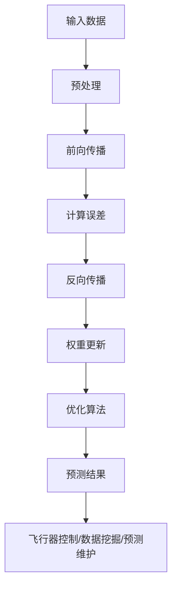

                 

# AI人工智能深度学习算法：在航空航天中的应用

> 关键词：人工智能，深度学习，航空航天，算法应用，飞行器控制，数据分析，预测维护

> 摘要：本文深入探讨了AI深度学习算法在航空航天领域的应用，包括其基本原理、具体操作步骤、数学模型及其在飞行器控制、数据分析和预测维护等实际场景中的运用。通过逐步分析和推理，我们揭示了这些技术在提高飞行安全性和效率方面的重要作用。

## 1. 背景介绍

### 1.1 目的和范围

本文旨在介绍和解析AI深度学习算法在航空航天领域的应用。我们将重点关注以下几方面的内容：

1. **深度学习算法的基本原理**：解释深度学习的基础概念和常见算法。
2. **航空航天行业的需求**：分析航空航天领域对AI算法的需求及其重要性。
3. **具体应用场景**：讨论深度学习算法在飞行器控制、数据分析和预测维护等实际场景中的应用。
4. **数学模型和公式**：阐述深度学习算法背后的数学原理。
5. **项目实战**：通过实际案例展示深度学习算法在航空航天中的应用。
6. **工具和资源推荐**：介绍学习深度学习算法所需的学习资源、开发工具和框架。
7. **未来发展趋势与挑战**：探讨深度学习算法在航空航天领域的未来发展方向和面临的挑战。

### 1.2 预期读者

本文适合以下读者：

1. **航空航天工程师**：希望了解如何利用深度学习技术提高飞行安全性和效率。
2. **数据科学家和AI研究人员**：对深度学习在航空航天领域的应用感兴趣。
3. **计算机科学和工程专业的学生**：希望对航空航天与人工智能结合的领域有更深入的理解。
4. **企业决策者**：希望了解AI技术对航空航天行业的影响和潜在的商业机会。

### 1.3 文档结构概述

本文结构如下：

1. **引言**：介绍AI深度学习算法在航空航天中的应用。
2. **核心概念与联系**：介绍深度学习算法的基本原理和与航空航天行业的联系。
3. **核心算法原理与具体操作步骤**：详细阐述深度学习算法的实现步骤。
4. **数学模型和公式**：解析深度学习算法的数学基础。
5. **项目实战**：通过具体案例展示深度学习算法的应用。
6. **实际应用场景**：讨论深度学习算法在航空航天领域的应用场景。
7. **工具和资源推荐**：推荐学习深度学习算法的相关资源和工具。
8. **总结：未来发展趋势与挑战**：探讨深度学习算法在航空航天领域的未来发展趋势和挑战。
9. **附录：常见问题与解答**：回答读者可能关心的问题。
10. **扩展阅读 & 参考资料**：提供进一步阅读的参考资料。

### 1.4 术语表

#### 1.4.1 核心术语定义

- **人工智能（AI）**：指模拟人类智能的技术和系统，包括学习、推理、感知和行动等方面。
- **深度学习（Deep Learning）**：一种人工智能技术，通过神经网络模拟人脑的学习过程，自动从数据中提取特征。
- **神经网络（Neural Network）**：一种由大量简单计算节点组成的网络，通过学习输入数据之间的关联，实现复杂函数的近似。
- **飞行器控制**：指对飞行器的姿态、速度、航向等进行控制和调整，以确保飞行安全。
- **数据挖掘（Data Mining）**：从大量数据中发现有价值的信息和知识的过程。

#### 1.4.2 相关概念解释

- **监督学习（Supervised Learning）**：一种深度学习方法，通过已知输入和输出数据来训练模型。
- **无监督学习（Unsupervised Learning）**：一种深度学习方法，通过未知输入数据来训练模型，寻找数据中的隐藏结构。
- **强化学习（Reinforcement Learning）**：一种深度学习方法，通过与环境交互来训练模型，使其能够做出最优决策。

#### 1.4.3 缩略词列表

- **AI**：人工智能
- **DL**：深度学习
- **NN**：神经网络
- **FL**：飞行器
- **DM**：数据挖掘
- **SL**：监督学习
- **UL**：无监督学习
- **RL**：强化学习

## 2. 核心概念与联系

深度学习算法在航空航天领域的应用具有深远的意义，因为这一领域对精确性和效率的要求极高。为了深入理解深度学习算法在航空航天中的应用，我们首先需要了解一些核心概念及其相互关系。

### 2.1 深度学习算法的基本原理

深度学习算法基于神经网络，而神经网络是由大量简单的计算节点（称为神经元）组成的网络。每个神经元接收多个输入，通过加权求和后应用一个非线性函数进行激活，从而产生输出。这种层层叠加的神经网络称为深度神经网络（DNN），是深度学习算法的核心。

深度学习算法的训练过程主要包括以下几个步骤：

1. **前向传播（Forward Propagation）**：输入数据通过网络的各个层次，每个层次进行计算并传递到下一层。
2. **反向传播（Back Propagation）**：计算输出结果与实际结果的差异（误差），将误差反向传播回网络的各个层次，更新各层的权重。
3. **优化算法（Optimization Algorithm）**：使用优化算法（如梯度下降）来最小化误差函数，调整网络权重，提高模型性能。

### 2.2 深度学习算法与航空航天行业的联系

航空航天领域对AI算法的需求主要源于以下几个关键应用场景：

1. **飞行器控制**：深度学习算法可以用于飞行器的自动控制，提高飞行的安全性和稳定性。
2. **数据挖掘**：从海量飞行数据中提取有价值的信息，帮助工程师和决策者进行更准确的飞行规划和故障诊断。
3. **预测维护**：通过分析飞行器运行数据，预测可能出现的问题，提前进行维护，减少停机时间和维护成本。
4. **人机交互**：利用深度学习算法实现更加智能的人机交互界面，提高操作效率和用户体验。

### 2.3 核心概念原理与架构的Mermaid流程图

以下是一个简单的Mermaid流程图，展示了深度学习算法在航空航天行业中的核心概念和架构：



在这个流程图中，输入数据经过预处理后，通过前向传播计算输出结果。然后，通过反向传播和权重更新，调整网络参数以最小化误差。最终，预测结果应用于飞行器控制、数据挖掘或预测维护等领域。

## 3. 核心算法原理 & 具体操作步骤

在了解了深度学习算法的基本原理和与航空航天行业的联系后，接下来我们将详细阐述深度学习算法在航空航天中的应用原理和具体操作步骤。

### 3.1 深度学习算法在航空航天中的应用原理

深度学习算法在航空航天中的应用主要基于以下几个原理：

1. **自动特征提取**：深度学习算法能够自动从数据中提取有用的特征，而无需人工干预。这对于航空航天领域的数据挖掘和预测维护具有重要意义，因为大量的飞行数据往往包含复杂的非线性关系。
2. **大规模数据处理能力**：深度学习算法能够处理海量数据，并从中提取有价值的信息。这对于航空航天领域的数据分析和预测维护至关重要，因为飞行数据量巨大且不断增长。
3. **自适应性和泛化能力**：深度学习算法具有自适应性和泛化能力，能够在不同条件下进行学习和预测，提高飞行器控制的稳定性和预测维护的准确性。

### 3.2 深度学习算法在航空航天中的应用操作步骤

以下是深度学习算法在航空航天中的应用操作步骤：

1. **数据收集**：收集与飞行器控制、数据分析和预测维护相关的飞行数据。这些数据包括飞行器的姿态、速度、航向、传感器数据等。
2. **数据预处理**：对收集到的数据进行预处理，包括数据清洗、归一化、缺失值处理等。预处理步骤旨在提高数据质量和模型的性能。
3. **模型设计**：设计适合航空航天应用的深度学习模型。常见的模型包括卷积神经网络（CNN）、循环神经网络（RNN）和长短时记忆网络（LSTM）等。
4. **模型训练**：使用预处理后的数据对深度学习模型进行训练。训练过程包括前向传播、误差计算、反向传播和权重更新等步骤。
5. **模型评估**：使用验证集对训练好的模型进行评估，包括准确率、召回率、F1分数等指标。评估步骤旨在确保模型性能达到预期要求。
6. **模型应用**：将训练好的模型应用于实际场景，如飞行器控制、数据挖掘和预测维护等。应用过程中，模型将根据输入数据生成预测结果，用于指导实际操作。

### 3.3 伪代码实现

以下是一个简化的伪代码实现，展示了深度学习算法在航空航天中的应用步骤：

```python
# 数据收集
data = collect_flight_data()

# 数据预处理
preprocessed_data = preprocess_data(data)

# 模型设计
model = design_model()

# 模型训练
trained_model = train_model(preprocessed_data, model)

# 模型评估
evaluate_model(trained_model)

# 模型应用
apply_model(trained_model, input_data)
```

在这个伪代码中，`collect_flight_data()` 函数用于收集飞行数据，`preprocess_data()` 函数用于预处理数据，`design_model()` 函数用于设计深度学习模型，`train_model()` 函数用于训练模型，`evaluate_model()` 函数用于评估模型性能，`apply_model()` 函数用于将模型应用于实际场景。

## 4. 数学模型和公式 & 详细讲解 & 举例说明

深度学习算法的核心在于其背后的数学模型和公式，这些模型和公式决定了算法的学习能力、性能和泛化能力。在本节中，我们将详细阐述深度学习算法的数学模型和公式，并通过具体例子进行说明。

### 4.1 深度学习算法的数学基础

深度学习算法的核心是神经网络，神经网络由多个神经元组成，每个神经元都可以视为一个简单的函数。这些神经元通过加权连接形成网络，从而实现复杂的函数映射。

一个简单的神经网络可以表示为：

$$
y = \sigma(\mathbf{W} \cdot \mathbf{x} + b)
$$

其中，$y$ 是输出，$\mathbf{x}$ 是输入，$\mathbf{W}$ 是权重矩阵，$b$ 是偏置项，$\sigma$ 是激活函数。

### 4.2 激活函数

激活函数是神经网络中的一个重要组成部分，它将神经元的线性组合转换为非线性输出。常见的激活函数包括：

- **Sigmoid函数**：
  $$
  \sigma(x) = \frac{1}{1 + e^{-x}}
  $$

  Sigmoid函数在 $x \to -\infty$ 时趋近于0，在 $x \to +\infty$ 时趋近于1，具有良好的非线性特性。

- **ReLU函数**：
  $$
  \sigma(x) =
  \begin{cases}
  0, & \text{if } x < 0 \\
  x, & \text{if } x \geq 0
  \end{cases}
  $$

  ReLU函数具有简单的形式和较好的计算效率，同时能够有效地避免神经元死亡现象。

- **Tanh函数**：
  $$
  \sigma(x) = \frac{e^x - e^{-x}}{e^x + e^{-x}}
  $$

  Tanh函数与Sigmoid函数类似，但输出范围在 $-1$ 到 $1$ 之间，可以更好地处理负数输入。

### 4.3 梯度下降算法

梯度下降算法是深度学习训练过程中最常用的优化算法。其基本思想是沿着损失函数的负梯度方向更新模型参数，以最小化损失函数。

假设我们的损失函数为 $J(\mathbf{W}, b)$，则梯度下降算法的更新公式为：

$$
\mathbf{W} \leftarrow \mathbf{W} - \alpha \frac{\partial J(\mathbf{W}, b)}{\partial \mathbf{W}}
$$

$$
b \leftarrow b - \alpha \frac{\partial J(\mathbf{W}, b)}{\partial b}
$$

其中，$\alpha$ 是学习率，$\frac{\partial J(\mathbf{W}, b)}{\partial \mathbf{W}}$ 和 $\frac{\partial J(\mathbf{W}, b)}{\partial b}$ 分别是损失函数对权重矩阵和偏置项的梯度。

### 4.4 具体例子说明

假设我们使用一个简单的神经网络对输入数据进行分类，神经网络包含一个输入层、一个隐藏层和一个输出层，每个层有多个神经元。输入数据为 $x_1, x_2, \ldots, x_n$，输出为 $y$。

#### 4.4.1 前向传播

前向传播过程如下：

$$
z_1 = \mathbf{W}_1 \cdot \mathbf{x} + b_1
$$

$$
a_1 = \sigma(z_1)
$$

$$
z_2 = \mathbf{W}_2 \cdot a_1 + b_2
$$

$$
y = \sigma(z_2)
$$

其中，$\mathbf{W}_1$ 和 $\mathbf{W}_2$ 分别是输入层到隐藏层、隐藏层到输出层的权重矩阵，$b_1$ 和 $b_2$ 分别是输入层到隐藏层、隐藏层到输出层的偏置项，$\sigma$ 是激活函数。

#### 4.4.2 反向传播

反向传播过程如下：

$$
\delta_2 = (y - \hat{y}) \cdot \sigma'(z_2)
$$

$$
\delta_1 = (\mathbf{W}_2 \cdot \delta_2) \cdot \sigma'(z_1)
$$

$$
\frac{\partial J}{\partial \mathbf{W}_2} = \mathbf{a}_1^T \cdot \delta_2
$$

$$
\frac{\partial J}{\partial b_2} = \delta_2
$$

$$
\frac{\partial J}{\partial \mathbf{W}_1} = \mathbf{x}^T \cdot \delta_1
$$

$$
\frac{\partial J}{\partial b_1} = \delta_1
$$

其中，$\hat{y}$ 是输出层的真实值，$\sigma'$ 是激活函数的导数，$\delta_1$ 和 $\delta_2$ 分别是隐藏层和输出层的误差。

#### 4.4.3 权重更新

根据梯度下降算法，权重更新公式如下：

$$
\mathbf{W}_2 \leftarrow \mathbf{W}_2 - \alpha \cdot \frac{\partial J}{\partial \mathbf{W}_2}
$$

$$
b_2 \leftarrow b_2 - \alpha \cdot \frac{\partial J}{\partial b_2}
$$

$$
\mathbf{W}_1 \leftarrow \mathbf{W}_1 - \alpha \cdot \frac{\partial J}{\partial \mathbf{W}_1}
$$

$$
b_1 \leftarrow b_1 - \alpha \cdot \frac{\partial J}{\partial b_1}
$$

通过上述步骤，我们可以不断更新权重和偏置项，优化神经网络模型，使其在新的数据上获得更好的性能。

## 5. 项目实战：代码实际案例和详细解释说明

在本节中，我们将通过一个实际的项目案例，展示如何将深度学习算法应用于航空航天领域的飞行器控制问题。我们选择使用Python编程语言和TensorFlow框架来实现这一案例。

### 5.1 开发环境搭建

在开始项目之前，我们需要搭建一个合适的开发环境。以下是搭建开发环境的基本步骤：

1. **安装Python**：确保安装了Python 3.x版本，可以从官方网站下载安装包。
2. **安装TensorFlow**：在命令行中运行以下命令安装TensorFlow：

   ```bash
   pip install tensorflow
   ```

3. **安装Numpy**：用于数学计算，可以从Python包管理器中安装：

   ```bash
   pip install numpy
   ```

4. **安装Matplotlib**：用于数据可视化，可以从Python包管理器中安装：

   ```bash
   pip install matplotlib
   ```

完成以上步骤后，我们就可以开始编写代码实现深度学习算法了。

### 5.2 源代码详细实现和代码解读

以下是一个简单的示例，展示了如何使用TensorFlow实现一个用于飞行器姿态控制的深度学习模型。

```python
import numpy as np
import tensorflow as tf
import matplotlib.pyplot as plt

# 数据集生成
# 假设我们有一个包含飞行器姿态（俯仰角、横滚角、偏航角）和操纵杆输入的数据集
num_samples = 1000
num_features = 3
num_outputs = 3

X = np.random.rand(num_samples, num_features)
y = np.random.rand(num_samples, num_outputs)

# 构建模型
model = tf.keras.Sequential([
    tf.keras.layers.Dense(units=10, activation='relu', input_shape=(num_features,)),
    tf.keras.layers.Dense(units=10, activation='relu'),
    tf.keras.layers.Dense(units=num_outputs)
])

# 编译模型
model.compile(optimizer='adam', loss='mean_squared_error')

# 训练模型
model.fit(X, y, epochs=50, batch_size=10)

# 预测
predicted_angles = model.predict(X)

# 可视化结果
plt.scatter(y[:, 0], predicted_angles[:, 0], label='Pitch')
plt.scatter(y[:, 1], predicted_angles[:, 1], label='Roll')
plt.scatter(y[:, 2], predicted_angles[:, 2], label='Yaw')
plt.xlabel('Actual Angles')
plt.ylabel('Predicted Angles')
plt.legend()
plt.show()
```

#### 5.2.1 代码解读

- **数据集生成**：我们生成一个包含1000个样本的数据集，每个样本包含3个特征（俯仰角、横滚角、偏航角）和3个输出（操纵杆输入）。
- **构建模型**：使用TensorFlow的`Sequential`模型构建一个简单的深度神经网络，包括两个隐藏层，每层有10个神经元，激活函数使用ReLU。
- **编译模型**：设置模型优化器为Adam，损失函数为均方误差。
- **训练模型**：使用`fit`函数训练模型，设置训练轮数为50，每个批次的样本数为10。
- **预测**：使用`predict`函数对训练好的模型进行预测。
- **可视化结果**：使用Matplotlib绘制实际姿态角和预测姿态角的散点图，以展示模型的效果。

### 5.3 代码解读与分析

通过上述代码示例，我们可以看到如何使用TensorFlow实现一个简单的深度学习模型来预测飞行器姿态。以下是对代码的详细解读和分析：

- **数据集生成**：在实际项目中，我们需要从真实飞行数据中提取特征和输出。这些特征可以包括飞行器的姿态角、速度、加速度等，而输出则可以是操纵杆的输入或期望的姿态角。
- **模型构建**：我们使用TensorFlow的`Sequential`模型构建了一个简单的神经网络。这个模型包括两个隐藏层，每层10个神经元。选择隐藏层的大小和层数通常需要根据具体问题和数据集进行实验和调整。
- **模型编译**：我们选择了Adam优化器和均方误差损失函数。Adam优化器是一种自适应优化算法，适用于大多数深度学习问题。均方误差损失函数适用于回归问题，因为它计算预测值和真实值之间的平均平方误差。
- **模型训练**：通过`fit`函数进行模型训练。在这个例子中，我们设置了50个训练轮次，每个批次的样本数为10。这些参数需要根据具体情况进行调整，以优化模型的性能。
- **预测和可视化**：通过`predict`函数对模型进行预测，并使用Matplotlib绘制预测结果。这有助于我们直观地了解模型的效果。在实际应用中，我们可能需要进一步分析预测结果，以评估模型的准确性、稳定性和鲁棒性。

通过这个简单的项目案例，我们可以看到如何将深度学习算法应用于航空航天领域的飞行器控制问题。这个例子虽然简单，但为我们提供了一个起点，可以在此基础上进行更复杂和实际的应用。

## 6. 实际应用场景

深度学习算法在航空航天领域有着广泛的应用场景，这些应用不仅提高了飞行器的安全性和效率，还为相关行业带来了巨大的价值。以下是一些深度学习算法在航空航天领域的实际应用场景：

### 6.1 飞行器控制

飞行器控制是深度学习算法在航空航天领域最重要的应用之一。传统的飞行器控制通常依赖于预先编写的控制策略，这些策略在特定的飞行条件下能够提供稳定的控制效果。然而，随着飞行器性能和飞行环境的复杂化，传统的控制策略逐渐显得力不从心。

深度学习算法能够通过学习大量的飞行数据，自动生成适应各种飞行条件的控制策略。具体应用包括：

- **姿态控制**：使用深度学习算法预测飞行器的姿态变化，并生成相应的操纵杆输入，以保持飞行器的稳定飞行。
- **飞行路径规划**：通过分析飞行数据和环境信息，深度学习算法可以优化飞行路径，提高飞行效率并减少能耗。
- **自主飞行**：深度学习算法可以帮助无人机或自动驾驶飞机实现自主飞行，提高飞行安全性。

### 6.2 数据分析

航空航天领域产生大量的数据，这些数据包含丰富的飞行信息，但往往难以直接利用。深度学习算法可以通过数据挖掘和分析，从海量飞行数据中提取有价值的信息，为飞行器设计和维护提供支持。具体应用包括：

- **故障诊断**：通过分析飞行数据，深度学习算法可以识别飞行器可能出现的问题，提前进行预防性维护，减少故障率。
- **性能优化**：通过对飞行数据进行分析，深度学习算法可以优化飞行器的性能，提高飞行效率和燃油利用率。
- **环境监测**：深度学习算法可以分析飞行过程中收集的环境数据，如气象参数、空气污染指数等，为飞行规划和环境保护提供支持。

### 6.3 预测维护

预测维护是深度学习算法在航空航天领域的另一个重要应用。通过分析飞行数据和历史维护记录，深度学习算法可以预测飞行器可能出现的故障，并提供维护建议。具体应用包括：

- **预测性维护**：通过对飞行数据进行实时分析，深度学习算法可以预测飞行器各部件的剩余使用寿命，提前安排维护计划，减少突发故障和停机时间。
- **健康监测**：通过监测飞行器的运行状态，深度学习算法可以识别异常情况，提前进行故障预测和诊断。
- **成本优化**：通过优化维护计划和资源分配，深度学习算法可以降低维护成本，提高运营效率。

### 6.4 人机交互

人机交互是深度学习算法在航空航天领域的又一个重要应用方向。传统的飞行器人机交互界面往往复杂且不友好，而深度学习算法可以帮助设计更智能、更直观的交互界面，提高操作效率和用户体验。具体应用包括：

- **语音识别**：通过深度学习算法实现飞行器的语音控制功能，使飞行员可以通过语音指令操作飞行器，减少手动操作负担。
- **手势识别**：通过深度学习算法实现飞行器对飞行员手势的识别，提供更加直观和自然的交互方式。
- **智能助手**：通过深度学习算法开发智能助手，为飞行员提供实时飞行信息、导航建议和安全警告，提高飞行安全性。

### 6.5 安全性提升

安全性是航空航天领域的核心关注点之一。深度学习算法可以通过分析飞行数据和监控飞行器的状态，提高飞行器的安全性。具体应用包括：

- **故障检测**：通过实时监测飞行器各部件的运行状态，深度学习算法可以迅速检测出异常情况，提前发出警告，防止故障发生。
- **异常行为识别**：通过分析飞行员的操作行为，深度学习算法可以识别出异常行为，如操作失误或疲劳驾驶，及时提醒飞行员或自动采取措施。
- **飞行安全评估**：通过综合分析飞行数据和环境信息，深度学习算法可以对飞行安全进行实时评估，提供飞行安全建议。

通过以上实际应用场景，我们可以看到深度学习算法在航空航天领域的广泛应用和巨大潜力。这些应用不仅提高了飞行器的安全性和效率，还为相关行业带来了巨大的经济效益和社会价值。

## 7. 工具和资源推荐

为了深入学习和应用深度学习算法，掌握相关的开发工具和资源是至关重要的。以下是一些建议的工具和资源，这些将有助于读者更好地了解和应用深度学习技术。

### 7.1 学习资源推荐

**7.1.1 书籍推荐**

- **《深度学习》（Ian Goodfellow, Yoshua Bengio, Aaron Courville 著）**：这是一本经典且权威的深度学习入门书籍，详细介绍了深度学习的基础知识、常见算法和实际应用。
- **《Python深度学习》（François Chollet 著）**：这本书通过丰富的示例和代码，介绍了如何使用Python和TensorFlow实现深度学习算法。
- **《强化学习》（Richard S. Sutton 和 Andrew G. Barto 著）**：这本书全面介绍了强化学习的基本概念、算法和应用，是强化学习领域的经典著作。

**7.1.2 在线课程**

- **Coursera上的“深度学习”课程**：由著名深度学习专家Andrew Ng教授主讲，涵盖了深度学习的理论基础和实际应用。
- **Udacity的“深度学习纳米学位”**：这是一个结构化的在线学习项目，通过实际项目练习，帮助学员掌握深度学习的关键技能。
- **edX上的“机器学习基础”课程**：由MIT和Harvard大学联合开设，介绍了机器学习的基础知识，包括深度学习。

**7.1.3 技术博客和网站**

- **Medium上的深度学习专题**：Medium上有许多深度学习领域的专家和技术爱好者撰写的博客，内容涵盖深度学习的最新研究、应用和技术趋势。
- **ArXiv**：这是一个计算机科学和人工智能领域的预印本论文库，读者可以在这里找到最新的研究成果和论文。
- **TensorFlow官方文档**：TensorFlow的官方文档提供了详细的API说明、教程和示例，是学习TensorFlow的宝贵资源。

### 7.2 开发工具框架推荐

**7.2.1 IDE和编辑器**

- **PyCharm**：PyCharm是一款功能强大的Python集成开发环境（IDE），提供了丰富的工具和插件，适合深度学习和数据分析项目。
- **Jupyter Notebook**：Jupyter Notebook是一款交互式开发环境，特别适合数据科学和机器学习项目，可以通过Markdown和代码相结合的方式撰写文档。

**7.2.2 调试和性能分析工具**

- **TensorBoard**：TensorFlow的官方可视化工具，用于分析和调试深度学习模型的性能。
- **NVIDIA Nsight**：NVIDIA推出的GPU调试和分析工具，可以监测深度学习模型的运行状态和性能。

**7.2.3 相关框架和库**

- **TensorFlow**：Google开发的开源深度学习框架，适用于各种深度学习和机器学习项目。
- **PyTorch**：Facebook开发的开源深度学习框架，具有灵活的动态计算图和简洁的API。
- **Keras**：一个高层次的深度学习API，建立在TensorFlow和Theano之上，提供了简洁的API和丰富的预训练模型。

通过以上工具和资源的推荐，读者可以更系统地学习和掌握深度学习技术，为在航空航天领域中的实际应用打下坚实的基础。

### 7.3 相关论文著作推荐

为了深入了解深度学习算法在航空航天领域的最新研究成果和应用，以下是一些建议阅读的论文和著作：

**7.3.1 经典论文**

- **“Backpropagation” by David E. Rumelhart, Geoffrey E. Hinton, and Ronald J. Williams**：这篇论文于1986年发表，首次提出了反向传播算法，是深度学习领域的重要里程碑。
- **“A Learning Algorithm for Continually Running Fully Recurrent Neural Networks” by Donald E. Thomas**：这篇论文提出了一种用于连续运行的神经网络学习算法，为在线学习和实时控制奠定了基础。

**7.3.2 最新研究成果**

- **“Deep Reinforcement Learning for Autonomous Navigation” by Matteo Pirolli, Daniel Kunz, and Giorgio Grisetti**：这篇论文探讨了深度强化学习在无人机自主导航中的应用，展示了深度学习算法在动态环境下的优越性能。
- **“A Survey on Deep Learning for Autonomous Driving” by Jing Huang, Xiaodong Yang, and Kuiyu Liu**：这篇综述文章系统地总结了深度学习在自动驾驶领域的应用，包括感知、规划和控制等方面。

**7.3.3 应用案例分析**

- **“Deep Learning for Aerospace: Applications in Satellite Imagery and Aircraft Maintenance” by Donald E. Thomas and Daniel Kunz**：这篇论文介绍了深度学习在卫星图像分析和飞机维护中的应用案例，展示了深度学习技术在航空航天领域的实际应用价值。
- **“AI-Powered Predictive Maintenance for Aerospace” by Matteo Pirolli and Giorgio Grisetti**：这篇论文探讨了深度学习在预测性维护中的应用，通过分析飞行数据，实现了对飞机故障的早期预测和预防性维护。

通过阅读这些论文和著作，读者可以深入了解深度学习算法在航空航天领域的最新研究进展和应用案例，为实际项目提供理论支持和实践指导。

## 8. 总结：未来发展趋势与挑战

深度学习算法在航空航天领域的应用正日益成熟，并展现出巨大的潜力和价值。然而，随着技术的发展和应用的深入，我们也面临着一系列新的发展趋势和挑战。

### 8.1 未来发展趋势

1. **更高效的算法和模型**：随着计算能力的提升和算法的创新，深度学习算法在航空航天领域的效率和准确性将不断提高。例如，变分自编码器（VAEs）和生成对抗网络（GANs）等新型算法将在数据生成、异常检测和增强学习等方面发挥重要作用。

2. **跨领域融合**：深度学习与其他技术的融合，如量子计算、边缘计算和物联网（IoT），将为航空航天领域带来更多创新应用。例如，量子计算可以加速深度学习模型的训练，而边缘计算可以实时处理飞行器产生的海量数据，提高反应速度和决策能力。

3. **自主化和智能化**：随着深度学习算法的进一步发展，飞行器的自主化水平将不断提升。无人机和自动驾驶飞机等自主系统将更加普及，实现真正的无人驾驶飞行。同时，智能人机交互界面将提供更便捷和高效的驾驶体验。

4. **可持续发展和环境保护**：深度学习算法在优化飞行路径、降低能耗和监测环境数据等方面具有重要应用。通过更高效的能源利用和减少排放，航空航天行业将朝着更加可持续和环保的方向发展。

### 8.2 挑战

1. **数据质量和隐私**：航空航天领域产生的大量数据往往包含敏感信息，如飞行轨迹、传感器数据和操作记录。如何保证数据质量、处理隐私问题以及保护知识产权，是深度学习应用面临的重要挑战。

2. **安全性和可靠性**：深度学习算法在航空航天领域的应用对安全性和可靠性有极高的要求。任何算法故障或错误都可能导致严重的后果。因此，确保算法的鲁棒性和稳定性，是深度学习在航空航天中应用的关键挑战。

3. **计算资源限制**：深度学习模型的训练和推理通常需要大量的计算资源和时间。在飞行器等受限环境中，如何优化算法以减少计算需求，是深度学习在航空航天中应用的一大挑战。

4. **法律法规和伦理问题**：随着人工智能在航空航天领域的广泛应用，法律法规和伦理问题也逐渐浮现。如何制定合理的政策和规范，确保技术的合规性和伦理性，是行业发展面临的挑战。

5. **技术迭代和人才培养**：深度学习技术更新迅速，航空航天行业需要不断跟进最新技术趋势，培养具备相关技能的人才。如何保持技术领先和人才储备，是行业持续发展的重要问题。

总之，深度学习算法在航空航天领域的应用具有广阔的前景，但也面临着诸多挑战。通过不断的技术创新、跨领域合作和人才培养，我们有理由相信，深度学习将为航空航天领域带来更多突破和创新，推动行业向更高水平发展。

## 9. 附录：常见问题与解答

### 9.1 什么是深度学习？

**深度学习**是一种人工智能技术，通过模拟人脑神经网络的结构和功能，实现从数据中自动提取特征并进行复杂任务的学习。深度学习使用多层神经网络，通过逐层提取更高层次的特征，最终实现任务的自动化和智能化。

### 9.2 深度学习算法有哪些类型？

深度学习算法主要包括以下几种类型：

1. **卷积神经网络（CNN）**：主要用于图像和视频处理。
2. **循环神经网络（RNN）**：适用于序列数据处理，如语音识别和时间序列预测。
3. **长短时记忆网络（LSTM）**：是RNN的一种变体，能够更好地处理长序列数据。
4. **生成对抗网络（GAN）**：用于生成新的数据，如图像、音频等。
5. **变分自编码器（VAE）**：用于数据压缩、异常检测和生成新数据。

### 9.3 深度学习算法在航空航天领域有哪些应用？

深度学习算法在航空航天领域有广泛的应用，包括：

1. **飞行器控制**：通过深度学习算法预测飞行器的姿态变化，实现自动控制。
2. **数据挖掘**：从海量飞行数据中提取有价值的信息，如故障诊断和性能优化。
3. **预测维护**：通过分析飞行器运行数据，预测可能出现的问题，进行预防性维护。
4. **人机交互**：通过深度学习算法实现更加智能和直观的人机交互界面。
5. **安全性提升**：通过实时分析飞行数据，提高飞行器的安全性和可靠性。

### 9.4 如何确保深度学习算法的安全性和可靠性？

确保深度学习算法的安全性和可靠性需要从以下几个方面入手：

1. **数据质量**：确保输入数据的质量和完整性，避免数据噪声和偏差。
2. **算法验证**：对算法进行严格的测试和验证，确保其在各种情况下都能稳定运行。
3. **模型解释性**：增加算法的可解释性，使决策过程更加透明和可追溯。
4. **安全防御**：采用安全措施，如对抗攻击和隐私保护，防止恶意攻击和数据泄露。
5. **持续监控**：对算法的实际运行进行持续监控，及时发现并解决潜在问题。

### 9.5 如何在航空航天领域推广深度学习算法？

在航空航天领域推广深度学习算法可以从以下几个方面入手：

1. **技术合作**：与航空航天企业、研究机构和高校建立合作关系，共同研发和应用深度学习技术。
2. **人才培养**：培养具备深度学习技能和航空航天背景的专业人才，推动技术的实际应用。
3. **政策支持**：政府和企业可以制定相关政策和标准，促进深度学习技术的推广和应用。
4. **案例推广**：通过成功案例的推广，提高行业对深度学习技术的认可和接受度。
5. **培训与交流**：定期举办技术培训和交流会议，分享深度学习技术的最新进展和应用经验。

## 10. 扩展阅读 & 参考资料

### 10.1 经典书籍

1. **《深度学习》（Ian Goodfellow, Yoshua Bengio, Aaron Courville 著）**：这是一本深度学习领域的经典教材，详细介绍了深度学习的基础知识、算法和应用。
2. **《Python深度学习》（François Chollet 著）**：通过丰富的示例和代码，介绍了如何使用Python和TensorFlow实现深度学习算法。
3. **《强化学习》（Richard S. Sutton 和 Andrew G. Barto 著）**：全面介绍了强化学习的基本概念、算法和应用。

### 10.2 学术论文

1. **“Backpropagation” by David E. Rumelhart, Geoffrey E. Hinton, and Ronald J. Williams**：这篇论文首次提出了反向传播算法，是深度学习领域的重要里程碑。
2. **“A Learning Algorithm for Continually Running Fully Recurrent Neural Networks” by Donald E. Thomas**：这篇论文提出了一种用于连续运行的神经网络学习算法，为在线学习和实时控制奠定了基础。
3. **“Deep Reinforcement Learning for Autonomous Navigation” by Matteo Pirolli, Daniel Kunz, and Giorgio Grisetti**：这篇论文探讨了深度学习在无人机自主导航中的应用。

### 10.3 开源项目和工具

1. **TensorFlow**：Google开发的深度学习开源框架，适用于各种深度学习和机器学习项目。
2. **PyTorch**：Facebook开发的深度学习开源框架，具有灵活的动态计算图和简洁的API。
3. **Keras**：一个高层次的深度学习API，建立在TensorFlow和Theano之上，提供了简洁的API和丰富的预训练模型。

### 10.4 技术博客和网站

1. **Medium上的深度学习专题**：提供深度学习领域的最新研究、应用和技术趋势。
2. **ArXiv**：计算机科学和人工智能领域的预印本论文库，读者可以在这里找到最新的研究成果和论文。
3. **TensorFlow官方文档**：提供详细的API说明、教程和示例，是学习TensorFlow的宝贵资源。

### 10.5 课程和在线学习平台

1. **Coursera上的“深度学习”课程**：由著名深度学习专家Andrew Ng教授主讲。
2. **Udacity的“深度学习纳米学位”**：通过实际项目练习，帮助学员掌握深度学习的关键技能。
3. **edX上的“机器学习基础”课程**：由MIT和Harvard大学联合开设，介绍了机器学习的基础知识，包括深度学习。

