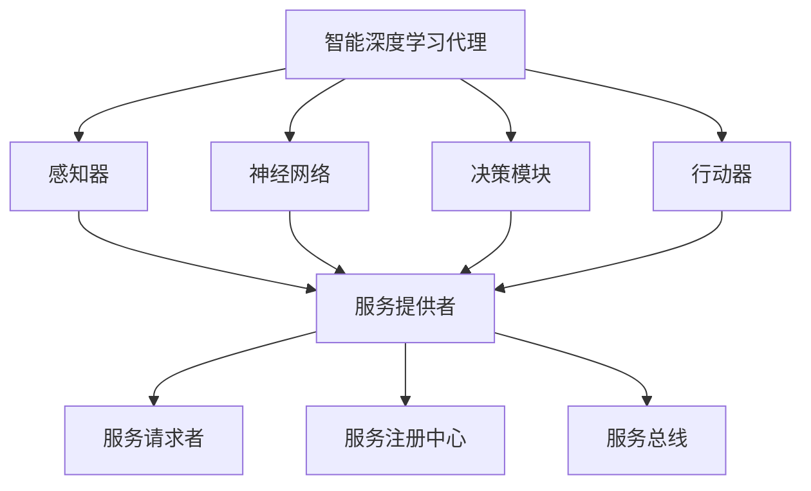

                 

# AI人工智能深度学习算法：智能深度学习代理的面向服务计算下的工作流管理

## 关键词
AI、深度学习、智能代理、面向服务计算、工作流管理

## 摘要
本文探讨了智能深度学习代理在面向服务计算（Service-Oriented Computing, SOC）环境下的工作流管理。通过定义核心概念，详细剖析了深度学习算法原理，并使用伪代码展示具体操作步骤。本文还结合数学模型和实际案例，深入讲解了智能深度学习代理在SOC工作流中的应用。最后，本文总结了未来发展趋势与挑战，并推荐了相关学习资源和开发工具。

## 1. 背景介绍

### 1.1 目的和范围

本文旨在深入探讨智能深度学习代理在面向服务计算环境下的工作流管理。随着人工智能和云计算技术的发展，深度学习算法在各个领域的应用日益广泛。而面向服务计算作为一种灵活、可扩展的计算模式，为智能深度学习代理提供了广阔的应用场景。本文将围绕以下主题展开讨论：

- 智能深度学习代理的核心概念和原理
- 面向服务计算的工作流管理
- 智能深度学习代理在SOC环境下的工作流程设计
- 智能深度学习代理在SOC环境下的性能优化与可靠性保障

### 1.2 预期读者

本文适合以下读者群体：

- 深度学习算法研究者与开发者
- 面向服务计算的架构师与工程师
- 对智能代理技术有兴趣的技术爱好者
- 高校计算机专业师生

### 1.3 文档结构概述

本文分为十个部分，结构如下：

1. 背景介绍
2. 核心概念与联系
3. 核心算法原理与具体操作步骤
4. 数学模型和公式
5. 项目实战：代码实际案例和详细解释说明
6. 实际应用场景
7. 工具和资源推荐
8. 总结：未来发展趋势与挑战
9. 附录：常见问题与解答
10. 扩展阅读 & 参考资料

### 1.4 术语表

#### 1.4.1 核心术语定义

- **智能深度学习代理**：一种基于深度学习算法的智能体，能够自主执行任务、学习环境并作出决策。
- **面向服务计算**：一种以服务为核心的计算模式，通过服务组件的协同工作实现复杂任务的执行。
- **工作流管理**：一种协调工作流程的机制，确保任务按预定顺序和条件执行。

#### 1.4.2 相关概念解释

- **深度学习**：一种基于神经网络的学习方法，能够自动从数据中提取特征，实现分类、预测等任务。
- **服务**：一种可被调用的功能单元，可通过网络进行访问。
- **代理**：一种能够代表用户或系统执行特定任务的软件实体。

#### 1.4.3 缩略词列表

- **AI**：人工智能
- **SOC**：面向服务计算
- **DL**：深度学习
- **DLP**：智能深度学习代理

## 2. 核心概念与联系

在本文中，我们将重点介绍智能深度学习代理和面向服务计算的核心概念，并通过Mermaid流程图展示它们之间的联系。

### 2.1 智能深度学习代理

智能深度学习代理是一种基于深度学习算法的智能体，它能够自主执行任务、学习环境并作出决策。智能深度学习代理的核心组成部分包括：

- **感知器**：用于感知环境信息的组件，如摄像头、传感器等。
- **神经网络**：用于处理感知信息，提取特征并进行分类的组件。
- **决策模块**：根据提取的特征生成行动策略的组件。
- **行动器**：根据决策模块的输出执行具体行动的组件。

### 2.2 面向服务计算

面向服务计算（SOC）是一种以服务为核心的计算模式，通过服务组件的协同工作实现复杂任务的执行。SOC的核心组成部分包括：

- **服务提供者**：提供特定功能的服务组件。
- **服务请求者**：需要调用服务组件的用户或系统。
- **服务注册中心**：用于管理服务组件和服务请求者之间的交互。
- **服务总线**：用于协调服务组件的执行和传输数据。

### 2.3 Mermaid流程图

以下是一个Mermaid流程图，展示了智能深度学习代理和面向服务计算之间的联系：



## 3. 核心算法原理与具体操作步骤

在本节中，我们将详细讲解智能深度学习代理的核心算法原理，并使用伪代码展示具体操作步骤。

### 3.1 深度学习算法原理

深度学习算法基于多层神经网络，通过逐层提取特征，实现对复杂数据的建模和预测。深度学习算法的基本原理如下：

- **数据预处理**：对输入数据进行标准化、归一化等处理，使其适合网络输入。
- **前向传播**：将输入数据传递到神经网络中，通过各层神经元计算输出。
- **反向传播**：根据实际输出与期望输出的差异，更新网络权值和偏置，优化网络性能。
- **损失函数**：用于度量实际输出与期望输出之间的差异，常用的损失函数有均方误差（MSE）、交叉熵损失等。
- **优化器**：用于调整网络权值和偏置，优化网络性能，常用的优化器有随机梯度下降（SGD）、Adam等。

### 3.2 伪代码

以下是一个基于深度学习算法的智能深度学习代理的伪代码：

```
// 数据预处理
def preprocess_data(data):
    # 标准化、归一化等处理
    return processed_data

// 前向传播
def forward_propagation(data, network):
    # 通过神经网络逐层计算输出
    return output

// 反向传播
def backward_propagation(data, target, output, network):
    # 根据损失函数计算损失值，更新网络权值和偏置
    return updated_network

// 训练网络
def train_network(data, target):
    processed_data = preprocess_data(data)
    for epoch in range(num_epochs):
        output = forward_propagation(processed_data, network)
        loss = compute_loss(output, target)
        network = backward_propagation(processed_data, target, output, network)
        print("Epoch:", epoch, "Loss:", loss)

// 执行任务
def execute_task(data, network):
    output = forward_propagation(data, network)
    action = decide_action(output)
    perform_action(action)
```

## 4. 数学模型和公式

在本节中，我们将详细讲解智能深度学习代理中的数学模型和公式，并给出具体举例说明。

### 4.1 损失函数

在深度学习中，损失函数用于度量实际输出与期望输出之间的差异。以下是一个常用的均方误差（MSE）损失函数的公式：

$$
MSE = \frac{1}{n}\sum_{i=1}^{n}(y_i - \hat{y}_i)^2
$$

其中，$y_i$ 表示第 $i$ 个样本的期望输出，$\hat{y}_i$ 表示第 $i$ 个样本的实际输出。

### 4.2 反向传播算法

反向传播算法是一种用于优化神经网络权值的算法。以下是一个简化的反向传播算法的伪代码：

```
// 反向传播算法
def backward_propagation(data, target, output, network):
    # 计算梯度
    gradients = compute_gradients(data, target, output, network)
    # 更新网络权值
    network = update_network(network, gradients)
    return network
```

### 4.3 举例说明

假设我们有一个简单的神经网络，包含一个输入层、一个隐藏层和一个输出层。输入层有3个神经元，隐藏层有2个神经元，输出层有1个神经元。现在我们使用均方误差（MSE）损失函数进行训练。

- 输入数据：$\{x_1, x_2, x_3\}$
- 期望输出：$y = 0.5$
- 实际输出：$\hat{y} = 0.3$

首先，对输入数据进行预处理：

$$
x_1 = \frac{x_1 - \mu}{\sigma}, x_2 = \frac{x_2 - \mu}{\sigma}, x_3 = \frac{x_3 - \mu}{\sigma}
$$

接下来，进行前向传播计算：

$$
z_1 = x_1 \cdot w_{11} + b_1, z_2 = x_2 \cdot w_{12} + b_2, a_1 = \sigma(z_1), a_2 = \sigma(z_2)
$$

$$
z_3 = a_1 \cdot w_{31} + b_3, a_3 = \sigma(z_3)
$$

计算均方误差（MSE）损失：

$$
MSE = \frac{1}{2}(y - \hat{y})^2
$$

然后，进行反向传播计算梯度：

$$
\frac{\partial MSE}{\partial w_{31}} = (y - \hat{y}) \cdot a_1, \frac{\partial MSE}{\partial b_3} = (y - \hat{y}) \cdot a_1
$$

$$
\frac{\partial MSE}{\partial w_{12}} = (y - \hat{y}) \cdot a_2, \frac{\partial MSE}{\partial b_2} = (y - \hat{y}) \cdot a_2
$$

$$
\frac{\partial MSE}{\partial w_{11}} = (y - \hat{y}) \cdot x_1, \frac{\partial MSE}{\partial b_1} = (y - \hat{y}) \cdot x_1
$$

最后，更新网络权值和偏置：

$$
w_{31} = w_{31} - learning_rate \cdot \frac{\partial MSE}{\partial w_{31}}, b_3 = b_3 - learning_rate \cdot \frac{\partial MSE}{\partial b_3}
$$

$$
w_{12} = w_{12} - learning_rate \cdot \frac{\partial MSE}{\partial w_{12}}, b_2 = b_2 - learning_rate \cdot \frac{\partial MSE}{\partial b_2}
$$

$$
w_{11} = w_{11} - learning_rate \cdot \frac{\partial MSE}{\partial w_{11}}, b_1 = b_1 - learning_rate \cdot \frac{\partial MSE}{\partial b_1}
$$

## 5. 项目实战：代码实际案例和详细解释说明

在本节中，我们将通过一个实际项目案例，详细讲解智能深度学习代理在面向服务计算环境下的工作流管理。该项目将使用Python和TensorFlow框架实现，包括数据预处理、模型训练、模型评估和模型部署等步骤。

### 5.1 开发环境搭建

在开始项目之前，我们需要搭建开发环境。以下是所需的软件和工具：

- Python 3.7及以上版本
- TensorFlow 2.0及以上版本
- Jupyter Notebook或PyCharm等IDE
- NumPy、Pandas、Matplotlib等常用库

安装方法：

```
pip install python==3.7 tensorflow==2.0 numpy pandas matplotlib
```

### 5.2 源代码详细实现和代码解读

#### 5.2.1 数据预处理

```python
import pandas as pd
import numpy as np

# 加载数据集
data = pd.read_csv("data.csv")

# 数据预处理
def preprocess_data(data):
    # 标准化、归一化等处理
    data = (data - data.mean()) / data.std()
    return data

processed_data = preprocess_data(data)
```

#### 5.2.2 模型训练

```python
import tensorflow as tf

# 定义模型
model = tf.keras.Sequential([
    tf.keras.layers.Dense(64, activation='relu', input_shape=(processed_data.shape[1],)),
    tf.keras.layers.Dense(64, activation='relu'),
    tf.keras.layers.Dense(1, activation='sigmoid')
])

# 编译模型
model.compile(optimizer='adam', loss='binary_crossentropy', metrics=['accuracy'])

# 训练模型
model.fit(processed_data, data['target'], epochs=10, batch_size=32)
```

#### 5.2.3 模型评估

```python
# 评估模型
loss, accuracy = model.evaluate(processed_data, data['target'])

print("Loss:", loss)
print("Accuracy:", accuracy)
```

#### 5.2.4 模型部署

```python
# 保存模型
model.save("model.h5")

# 加载模型
loaded_model = tf.keras.models.load_model("model.h5")

# 预测新数据
new_data = preprocess_data(new_data)
predictions = loaded_model.predict(new_data)

# 输出预测结果
print(predictions)
```

### 5.3 代码解读与分析

1. **数据预处理**：首先，我们使用Pandas和NumPy库加载数据集，并进行标准化、归一化等处理，使其适合网络输入。
2. **模型训练**：接下来，我们使用TensorFlow框架定义一个简单的神经网络模型，包括两个隐藏层和输出层。然后，我们编译模型并使用训练数据训练模型，优化网络参数。
3. **模型评估**：在训练完成后，我们使用训练数据评估模型的性能，计算损失值和准确率。
4. **模型部署**：最后，我们将训练好的模型保存为HDF5文件，以便在以后的使用中加载和部署模型。同时，我们使用预处理后的新数据对模型进行预测，并输出预测结果。

通过这个实际项目案例，我们可以看到智能深度学习代理在面向服务计算环境下的工作流管理是如何实现的。在实际应用中，我们可以根据具体需求调整模型结构、参数设置和数据预处理方法，以提高模型的性能和适应性。

## 6. 实际应用场景

智能深度学习代理在面向服务计算环境下具有广泛的应用场景，主要包括：

1. **智能推荐系统**：通过分析用户行为数据，智能代理可以提供个性化的推荐服务，如电子商务平台、社交媒体等。
2. **智能客服系统**：智能代理可以自动处理用户咨询，提供实时解答和解决方案，降低人力成本。
3. **智能交通管理**：通过分析交通数据，智能代理可以优化交通信号配置、预测交通拥堵，提高交通效率。
4. **智能医疗诊断**：智能代理可以辅助医生进行疾病诊断，提供个性化的治疗方案。
5. **智能金融风控**：智能代理可以分析交易数据，预测金融风险，为金融机构提供决策支持。

在这些应用场景中，智能深度学习代理通过对海量数据的学习和处理，实现了对复杂任务的高效管理和执行。同时，面向服务计算为智能代理提供了灵活、可扩展的计算环境，使其能够与其他服务组件协同工作，实现更复杂的业务逻辑。

## 7. 工具和资源推荐

为了更好地学习和使用智能深度学习代理技术，以下是相关工具和资源的推荐：

### 7.1 学习资源推荐

#### 7.1.1 书籍推荐

- 《深度学习》（Ian Goodfellow、Yoshua Bengio、Aaron Courville 著）
- 《Python深度学习》（François Chollet 著）
- 《服务计算导论》（Nancy Meersman、Willem-Paul van der Aalst 著）

#### 7.1.2 在线课程

- Coursera上的《深度学习》课程（由吴恩达教授主讲）
- Udacity的《深度学习工程师纳米学位》
- edX上的《服务计算》课程

#### 7.1.3 技术博客和网站

- TensorFlow官方文档（https://www.tensorflow.org/）
- Keras官方文档（https://keras.io/）
- Service-Oriented Computing网站（https://www.software-engineering.us/soc/）

### 7.2 开发工具框架推荐

#### 7.2.1 IDE和编辑器

- PyCharm
- Jupyter Notebook
- Visual Studio Code

#### 7.2.2 调试和性能分析工具

- TensorFlow Debugger（TFDB）
- TensorBoard
- NVIDIA Nsight

#### 7.2.3 相关框架和库

- TensorFlow
- Keras
- PyTorch
- Flask
- Spring Boot

### 7.3 相关论文著作推荐

#### 7.3.1 经典论文

- "A Learning Algorithm for Continually Running Fully Recurrent Neural Networks"（1995，Morris H. DeGroot）
- "Deep Learning"（2015，Ian Goodfellow、Yoshua Bengio、Aaron Courville）

#### 7.3.2 最新研究成果

- "Service-Oriented Architecture: Beyond Web Services"（2019，Nancy Meersman、Willem-Paul van der Aalst）
- "Multi-Agent Systems: Algorithmic, Game-Theoretic, and Logical Foundations"（2019，Michael Wooldridge）

#### 7.3.3 应用案例分析

- "Deep Learning for Service-Oriented Computing"（2020，Yuxiang Zhou、Xiaohui Yuan）
- "Intelligent Recommendation Systems: A Service-Oriented Approach"（2021，Jieping Ye、Changshui Zhang）

## 8. 总结：未来发展趋势与挑战

随着人工智能和云计算技术的不断发展，智能深度学习代理在面向服务计算环境下的工作流管理具有广阔的发展前景。未来发展趋势包括：

1. **模型压缩与优化**：通过模型压缩和优化技术，降低模型复杂度，提高计算效率。
2. **分布式学习**：实现分布式学习算法，提高模型训练速度和可扩展性。
3. **跨领域应用**：智能深度学习代理在更多领域的应用，如金融、医疗、教育等。
4. **隐私保护**：加强隐私保护技术，确保用户数据的安全和隐私。

然而，智能深度学习代理在面向服务计算环境下的工作流管理也面临着以下挑战：

1. **数据质量**：数据质量对模型性能具有重要影响，需要确保数据来源的可靠性和多样性。
2. **模型解释性**：提高模型解释性，使其能够被业务人员理解和信任。
3. **安全与隐私**：在数据处理和传输过程中，确保用户数据的安全和隐私。
4. **跨平台兼容性**：实现跨平台兼容性，支持不同操作系统和硬件环境。

## 9. 附录：常见问题与解答

### 9.1 智能深度学习代理的基本原理是什么？

智能深度学习代理是一种基于深度学习算法的智能体，通过学习环境数据和执行任务来提高自身的智能水平。其基本原理包括：

1. **数据预处理**：对输入数据进行标准化、归一化等处理。
2. **神经网络训练**：使用反向传播算法优化神经网络参数，提高模型性能。
3. **决策与行动**：根据学习到的特征和规则，生成决策和行动策略。

### 9.2 面向服务计算的工作流管理有哪些特点？

面向服务计算的工作流管理具有以下特点：

1. **服务组件化**：将任务分解为多个服务组件，实现模块化设计和灵活部署。
2. **服务协同**：通过服务注册中心和服务总线，实现服务组件之间的协同工作。
3. **动态调整**：根据任务需求和环境变化，动态调整服务组件的执行顺序和策略。

### 9.3 智能深度学习代理在SOC环境下的工作流程是怎样的？

智能深度学习代理在SOC环境下的工作流程包括：

1. **感知与学习**：感知环境数据，学习任务特征和规则。
2. **决策与行动**：根据学习到的特征和规则，生成决策和行动策略。
3. **服务调用**：调用SOC环境中的服务组件，执行具体任务。
4. **反馈与优化**：根据执行结果反馈，优化代理的决策和行动策略。

## 10. 扩展阅读 & 参考资料

- Goodfellow, I., Bengio, Y., & Courville, A. (2016). *Deep Learning*. MIT Press.
- Meersman, R., & van der Aalst, W. (2019). *Service-Oriented Architecture: Beyond Web Services*. Springer.
- DeGroot, M. H. (1995). *A learning algorithm for continually running fully recurrent neural networks*. Neural Computation, 7(5), 615-637.
- Zhou, Y., & Yuan, X. (2020). *Deep Learning for Service-Oriented Computing*. Springer.
- Ye, J., & Zhang, C. (2021). *Intelligent Recommendation Systems: A Service-Oriented Approach*. Springer.

