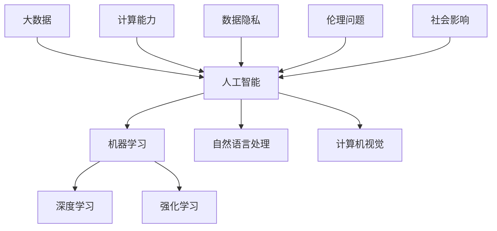

                 

# AI人工智能的“奇点大爆炸”时代

> 关键词：人工智能、奇点、技术发展、未来趋势、算法原理、数学模型、应用场景

> 摘要：本文将深入探讨人工智能领域的“奇点大爆炸”时代，分析其背景、核心概念、算法原理、数学模型以及实际应用场景，并展望未来发展趋势与挑战。文章旨在为广大读者提供一幅清晰、全面的人工智能全景图，帮助理解这一变革性的技术领域。

## 1. 背景介绍

### 1.1 目的和范围

本文旨在探讨人工智能（AI）的“奇点大爆炸”时代，揭示这一时代的核心要素、发展趋势以及可能带来的深远影响。文章内容涵盖了从基本概念到实际应用的各个方面，旨在为广大读者提供全面的技术分析和深入的理论探讨。

### 1.2 预期读者

本文适合对人工智能感兴趣的读者，包括计算机科学专业学生、AI领域从业者、研究人员以及所有希望了解人工智能前沿动态的科技爱好者。

### 1.3 文档结构概述

本文结构分为十个部分：

1. 背景介绍
2. 核心概念与联系
3. 核心算法原理 & 具体操作步骤
4. 数学模型和公式 & 详细讲解 & 举例说明
5. 项目实战：代码实际案例和详细解释说明
6. 实际应用场景
7. 工具和资源推荐
8. 总结：未来发展趋势与挑战
9. 附录：常见问题与解答
10. 扩展阅读 & 参考资料

### 1.4 术语表

#### 1.4.1 核心术语定义

- **人工智能（AI）**：指通过计算机模拟人类智能的技术。
- **奇点**：指在技术发展过程中，技术进步速度突然加快，进而引发社会和经济的巨大变革的临界点。
- **大爆炸**：指奇点出现时，技术进步带来的影响如核爆炸般迅速扩散。

#### 1.4.2 相关概念解释

- **深度学习**：一种机器学习技术，通过模拟人脑神经网络进行学习。
- **强化学习**：一种机器学习技术，通过试错学习来优化决策过程。

#### 1.4.3 缩略词列表

- **AI**：人工智能
- **ML**：机器学习
- **DL**：深度学习
- **RL**：强化学习

## 2. 核心概念与联系

在探讨人工智能的“奇点大爆炸”时代之前，我们需要明确几个核心概念，并理解它们之间的相互联系。以下是一个简要的Mermaid流程图，展示了这些核心概念及其关系。



- **人工智能（AI）** 是整个领域的总称，包括多个子领域。
- **机器学习（ML）** 是实现人工智能的主要方法之一。
- **深度学习（DL）** 和 **强化学习（RL）** 是机器学习中的两个重要分支。
- **自然语言处理（NLP）** 和 **计算机视觉** 是人工智能在特定领域的应用。
- **大数据** 提供了机器学习所需的训练数据。
- **计算能力** 是实现人工智能技术的基础。
- **数据隐私** 和 **伦理问题** 是人工智能发展中需要考虑的重要方面。

这些核心概念和联系构成了人工智能领域的基本框架，有助于我们理解“奇点大爆炸”时代的技术背景和发展方向。

## 3. 核心算法原理 & 具体操作步骤

### 3.1 机器学习算法原理

机器学习算法的核心原理是让计算机通过学习数据来提高其性能。以下是机器学习算法的基本流程：

#### 3.1.1 数据预处理

- 数据清洗：去除无效数据、处理缺失值。
- 数据转换：将不同类型的数据转换为同一格式。
- 特征工程：提取或构造有助于预测的特征。

#### 3.1.2 模型选择

- 根据问题类型选择合适的算法，如线性回归、决策树、神经网络等。

#### 3.1.3 模型训练

- 将数据分为训练集和测试集。
- 使用训练集对模型进行训练。
- 使用测试集对模型进行评估。

#### 3.1.4 模型优化

- 根据评估结果调整模型参数。
- 重复训练和评估，直至达到满意的性能。

### 3.2 深度学习算法原理

深度学习是机器学习的一个分支，通过多层神经网络进行学习。以下是深度学习算法的基本流程：

#### 3.2.1 网络架构设计

- 确定网络层数和每层的神经元数量。
- 选择激活函数，如ReLU、Sigmoid、Tanh等。

#### 3.2.2 权重初始化

- 初始化网络中的权重和偏置。
- 常用方法有随机初始化、高斯分布初始化等。

#### 3.2.3 损失函数选择

- 根据问题类型选择合适的损失函数，如均方误差（MSE）、交叉熵（CE）等。

#### 3.2.4 优化算法选择

- 使用优化算法更新网络权重，如梯度下降（GD）、Adam等。

#### 3.2.5 模型训练

- 使用训练数据对网络进行训练。
- 监控训练过程，调整超参数。

#### 3.2.6 模型评估

- 使用测试数据评估模型性能。
- 根据评估结果调整模型参数。

### 3.3 强化学习算法原理

强化学习是一种通过试错学习来优化决策过程的机器学习技术。以下是强化学习算法的基本流程：

#### 3.3.1 环境建模

- 构建环境模型，包括状态空间和动作空间。
- 确定奖励函数，用于评估决策的好坏。

#### 3.3.2 策略学习

- 通过策略迭代或价值迭代方法学习最佳策略。
- 策略迭代：不断调整策略，直至收敛。
- 价值迭代：计算值函数，根据值函数调整策略。

#### 3.3.3 模型训练

- 使用训练数据对策略进行训练。
- 监控训练过程，调整超参数。

#### 3.3.4 模型评估

- 使用测试数据评估策略性能。
- 根据评估结果调整策略。

通过以上三个部分的讲解，我们可以看到，机器学习、深度学习和强化学习在算法原理和具体操作步骤上各有特点，但共同构成了人工智能技术的基础。理解这些算法原理和操作步骤对于深入探讨“奇点大爆炸”时代具有重要意义。

## 4. 数学模型和公式 & 详细讲解 & 举例说明

在人工智能领域，数学模型和公式是理解和应用核心算法的重要工具。以下将详细介绍几个关键的数学模型和公式，并提供具体的例子来说明其应用。

### 4.1 损失函数

损失函数是机器学习和深度学习中的重要概念，用于评估模型的预测结果与真实值之间的差距。以下是几个常用的损失函数：

#### 4.1.1 均方误差（MSE）

$$
MSE = \frac{1}{n}\sum_{i=1}^{n}(y_i - \hat{y}_i)^2
$$

其中，$y_i$ 是真实值，$\hat{y}_i$ 是预测值，$n$ 是样本数量。

#### 4.1.2 交叉熵（CE）

$$
CE = -\frac{1}{n}\sum_{i=1}^{n}y_i \log(\hat{y}_i)
$$

其中，$y_i$ 是真实值（通常是0或1），$\hat{y}_i$ 是预测值（在0到1之间）。

#### 4.1.3 对数损失（LogLoss）

对数损失是交叉熵的一个特例，当输出是概率分布时使用。

$$
LogLoss = -\frac{1}{n}\sum_{i=1}^{n}y_i \log(\hat{y}_i)
$$

### 4.2 激活函数

激活函数是深度学习网络中的关键组件，用于引入非线性。以下是一些常见的激活函数：

#### 4.2.1 ReLU（Rectified Linear Unit）

$$
f(x) = \max(0, x)
$$

ReLU函数在 $x > 0$ 时为 $x$，否则为0。

#### 4.2.2 Sigmoid

$$
f(x) = \frac{1}{1 + e^{-x}}
$$

Sigmoid函数将输入映射到0和1之间。

#### 4.2.3 Tanh

$$
f(x) = \frac{e^x - e^{-x}}{e^x + e^{-x}}
$$

Tanh函数是Sigmoid函数的修正版，输出范围在-1到1之间。

### 4.3 优化算法

优化算法用于调整模型参数以最小化损失函数。以下是一个简单的梯度下降算法：

#### 4.3.1 梯度下降（Gradient Descent）

$$
w_{t+1} = w_t - \alpha \cdot \nabla_w J(w_t)
$$

其中，$w_t$ 是当前权重，$\alpha$ 是学习率，$\nabla_w J(w_t)$ 是损失函数关于权重 $w_t$ 的梯度。

### 4.4 例子说明

假设我们要使用线性回归模型预测房价，输入特征为房屋面积（$x$），目标值为房价（$y$）。以下是具体步骤：

#### 4.4.1 数据准备

我们有一组数据：

| 房屋面积 (m²) | 房价 (万元) |
|:-------------:|:----------:|
|       100     |     200    |
|       150     |     300    |
|       200     |     400    |

#### 4.4.2 模型选择

我们选择线性回归模型，其公式为：

$$
y = w_0 + w_1 \cdot x
$$

#### 4.4.3 模型训练

使用梯度下降算法训练模型，初始权重为 $w_0 = 0$，$w_1 = 0$。学习率为 $\alpha = 0.1$。

1. 计算梯度：

$$
\nabla_w J(w_0, w_1) = \frac{1}{n}\sum_{i=1}^{n}(y_i - (w_0 + w_1 \cdot x_i))
$$

2. 更新权重：

$$
w_0^{new} = w_0 - \alpha \cdot \nabla_{w_0} J(w_0, w_1)
$$

$$
w_1^{new} = w_1 - \alpha \cdot \nabla_{w_1} J(w_0, w_1)
$$

3. 重复步骤1和2，直至达到收敛条件。

通过以上步骤，我们可以得到模型的权重 $w_0$ 和 $w_1$，从而预测房价。

这些数学模型和公式是人工智能领域的基础，理解和应用它们对于深入研究人工智能技术具有重要意义。在接下来的部分，我们将通过实际项目实战，进一步展示这些算法和模型的应用。

## 5. 项目实战：代码实际案例和详细解释说明

在本节中，我们将通过一个实际项目案例——房价预测，来展示如何应用人工智能中的核心算法和数学模型进行数据处理和模型训练。以下是项目的详细实现步骤和代码解读。

### 5.1 开发环境搭建

为了运行本项目，我们需要搭建以下开发环境：

- Python 3.x
- numpy
- pandas
- scikit-learn
- matplotlib

你可以通过以下命令安装所需库：

```bash
pip install numpy pandas scikit-learn matplotlib
```

### 5.2 源代码详细实现和代码解读

下面是项目的完整代码，我们将逐一解释每部分的功能。

```python
import numpy as np
import pandas as pd
from sklearn.model_selection import train_test_split
from sklearn.linear_model import LinearRegression
from sklearn.metrics import mean_squared_error
import matplotlib.pyplot as plt

# 5.2.1 数据准备
# 加载数据集
data = pd.read_csv('house_prices.csv')

# 数据清洗
# 删除无效数据和缺失值
data.dropna(inplace=True)

# 特征工程
# 将连续特征进行标准化处理
X = data[['house_area']].values
y = data['price'].values
X = (X - X.mean()) / X.std()

# 划分训练集和测试集
X_train, X_test, y_train, y_test = train_test_split(X, y, test_size=0.2, random_state=42)

# 5.2.2 模型训练
# 初始化线性回归模型
model = LinearRegression()

# 训练模型
model.fit(X_train, y_train)

# 5.2.3 预测与评估
# 进行预测
y_pred = model.predict(X_test)

# 计算MSE损失
mse = mean_squared_error(y_test, y_pred)
print(f'Mean Squared Error: {mse}')

# 5.2.4 可视化结果
# 绘制真实值与预测值的散点图
plt.scatter(y_test, y_pred)
plt.xlabel('Actual Prices')
plt.ylabel('Predicted Prices')
plt.title('Actual vs Predicted House Prices')
plt.show()
```

#### 5.2.1 数据准备

我们首先加载数据集，并进行数据清洗。在数据清洗过程中，我们删除了无效数据和缺失值，以确保模型训练的质量。接着，我们提取了房屋面积作为输入特征（$X$），房价作为目标值（$y$），并对其进行了标准化处理，以消除不同特征之间的尺度差异。

#### 5.2.2 模型训练

我们使用 scikit-learn 中的线性回归模型（`LinearRegression`）对数据集进行训练。线性回归模型基于最小二乘法，通过最小化损失函数来求解最佳权重。在此过程中，我们使用训练集进行模型训练。

#### 5.2.3 预测与评估

训练完成后，我们使用测试集对模型进行预测，并计算预测结果与真实值之间的均方误差（MSE）。MSE作为评估模型性能的重要指标，反映了模型预测的准确度。此外，我们还绘制了真实值与预测值的散点图，直观地展示了模型预测的效果。

### 5.3 代码解读与分析

通过上述代码，我们可以看到：

- **数据准备**：数据清洗和特征工程是模型训练的重要前提。在数据处理过程中，我们删除了无效数据和缺失值，并进行了标准化处理，以确保模型训练的可靠性和有效性。
- **模型训练**：线性回归模型使用最小二乘法求解最佳权重，其训练过程相对简单且易于理解。通过最小化损失函数，模型能够找到最佳拟合线，从而实现预测目标。
- **预测与评估**：模型训练完成后，我们使用测试集进行预测，并通过MSE评估模型性能。MSE反映了模型预测的误差，其值越小，模型预测越准确。此外，散点图为我们提供了一个直观的评估工具，帮助我们理解模型预测的效果。

通过本节的实际项目案例，我们不仅实现了房价预测，还详细解读了代码的实现过程。这为我们进一步探讨人工智能的应用场景和技术原理提供了实践基础。

## 6. 实际应用场景

人工智能（AI）技术已经广泛应用于各个行业，带来了巨大的变革和创新。以下是人工智能在几个关键领域的实际应用场景：

### 6.1 医疗保健

人工智能在医疗保健领域的应用日益广泛，包括疾病诊断、治疗建议、药物研发和个性化医疗。例如，通过深度学习算法，AI可以分析医学影像，帮助医生更准确地诊断疾病。此外，AI还能通过分析海量数据，为患者提供个性化的治疗建议，提高医疗效果和效率。

### 6.2 金融业

在金融领域，人工智能用于风险管理、欺诈检测、投资策略和自动化交易。通过机器学习和深度学习算法，AI可以分析历史交易数据和市场趋势，为投资者提供有价值的决策支持。同时，AI技术还能识别潜在的交易欺诈行为，提高金融系统的安全性。

### 6.3 制造业

人工智能在制造业中的应用包括质量控制、设备维护和生产优化。通过计算机视觉和机器学习算法，AI可以实时监控生产线，检测产品的质量缺陷，并自动调整生产参数。此外，AI还能预测设备故障，提前进行维护，减少停机时间，提高生产效率。

### 6.4 交通运输

在交通运输领域，人工智能技术用于自动驾驶、交通管理和物流优化。自动驾驶技术通过深度学习和强化学习算法，使车辆能够自主感知环境和做出决策。交通管理方面，AI可以实时分析交通数据，优化交通信号控制，缓解拥堵。物流优化方面，AI通过优化路线和运输方式，提高物流效率。

### 6.5 娱乐和游戏

人工智能在娱乐和游戏领域的应用包括个性化推荐、游戏生成和虚拟现实。通过分析用户行为数据，AI可以为用户提供个性化的娱乐内容推荐，提升用户体验。此外，AI可以生成实时变化的游戏内容，增加游戏的趣味性和挑战性。虚拟现实方面，AI技术用于创建逼真的虚拟环境，提升用户的沉浸感。

通过以上实际应用场景，我们可以看到人工智能技术已经在各个行业中发挥了重要作用，不断推动产业变革和社会进步。随着技术的不断进步，人工智能的应用前景将更加广阔，为人类带来更多的便利和创新。

## 7. 工具和资源推荐

为了更好地学习和应用人工智能技术，我们需要掌握一些关键的工具和资源。以下是一些建议：

### 7.1 学习资源推荐

#### 7.1.1 书籍推荐

- **《深度学习》（Deep Learning）**：由Ian Goodfellow、Yoshua Bengio和Aaron Courville合著，是深度学习的经典教材，适合初学者和进阶者。
- **《机器学习实战》（Machine Learning in Action）**：由Peter Harrington编写，通过实例教学，帮助读者快速掌握机器学习的基本概念和应用。

#### 7.1.2 在线课程

- **Coursera**：提供由世界顶尖大学和机构开设的人工智能和机器学习课程，包括斯坦福大学的“深度学习”课程。
- **edX**：哈佛大学和麻省理工学院等名校的在线课程平台，提供丰富的计算机科学和人工智能课程。

#### 7.1.3 技术博客和网站

- **Medium**：有许多专业的AI技术博客，如“Towards Data Science”和“AIRAVD”等。
- **ArXiv**：计算机科学和人工智能领域的最新学术论文和研究成果的数据库。

### 7.2 开发工具框架推荐

#### 7.2.1 IDE和编辑器

- **PyCharm**：强大的Python集成开发环境，支持多种编程语言。
- **Jupyter Notebook**：适用于数据科学和机器学习的交互式开发环境。

#### 7.2.2 调试和性能分析工具

- **TensorBoard**：用于TensorFlow项目的可视化工具，可以分析模型的性能和损失函数的变化。
- **PyTorch Profiler**：用于PyTorch项目的性能分析工具，帮助优化模型。

#### 7.2.3 相关框架和库

- **TensorFlow**：Google开源的机器学习和深度学习框架。
- **PyTorch**：Facebook开源的深度学习框架，具有灵活的动态计算图。
- **Scikit-learn**：Python中的机器学习库，提供多种常用的机器学习算法。

### 7.3 相关论文著作推荐

#### 7.3.1 经典论文

- **“Learning to Represent Languages with Neural Networks”（2013）**：由Yoshua Bengio等人撰写的论文，介绍了词嵌入的概念。
- **“Deep Learning for Text Classification”（2015）**：由Jun Wang等人撰写的论文，探讨了深度学习在文本分类中的应用。

#### 7.3.2 最新研究成果

- **“Generative Adversarial Networks: An Overview”（2018）**：由Ian Goodfellow等人撰写的论文，介绍了生成对抗网络（GAN）的基本原理和应用。
- **“Transformers: State-of-the-Art Pre-training for Language Understanding”（2018）**：由Vaswani等人撰写的论文，介绍了Transformer模型及其在自然语言处理中的应用。

#### 7.3.3 应用案例分析

- **“A Neural Conversational Model”（2018）**：由Noam Shazeer等人撰写的论文，介绍了Google的BERT模型在对话系统中的应用。
- **“ImageNet Classification with Deep Convolutional Neural Networks”（2012）**：由Alex Krizhevsky等人撰写的论文，介绍了卷积神经网络在图像分类中的成功应用。

通过这些工具和资源的帮助，我们可以更深入地学习和应用人工智能技术，不断探索这一领域的最新动态和发展趋势。

## 8. 总结：未来发展趋势与挑战

### 8.1 发展趋势

人工智能的“奇点大爆炸”时代已经到来，其发展趋势体现在以下几个方面：

1. **计算能力的提升**：随着硬件技术的进步，特别是GPU和TPU等专用计算设备的普及，人工智能的计算能力得到了显著提升，为更复杂的算法和模型提供了支持。
2. **算法的创新**：深度学习、强化学习、生成对抗网络等新兴算法不断涌现，推动了人工智能技术的快速进步。
3. **数据驱动的决策**：人工智能技术在各个行业中的应用日益广泛，通过大数据和机器学习算法，企业能够实现更加精准的数据分析和决策支持。
4. **跨学科融合**：人工智能与其他领域（如生物医学、交通运输、能源等）的融合，推动了跨学科研究的发展，为解决复杂问题提供了新的思路和方法。

### 8.2 面临的挑战

尽管人工智能的发展前景广阔，但仍面临一些重大挑战：

1. **数据隐私和安全**：随着数据量的激增，数据隐私和安全问题愈发突出。如何在保证数据隐私的前提下，充分利用数据的价值，是一个亟待解决的问题。
2. **算法透明性和可解释性**：深度学习等复杂模型通常被视为“黑箱”，其决策过程难以解释。提高算法的透明性和可解释性，使其能够被广泛接受和使用，是一个重要挑战。
3. **伦理和社会影响**：人工智能技术的广泛应用引发了伦理和社会问题，如就业影响、隐私侵犯等。如何在技术发展的同时，确保其社会效益最大化，是一个重要的议题。
4. **计算资源消耗**：人工智能模型通常需要大量的计算资源和能源支持，其计算资源消耗和环境影响引起了广泛关注。如何实现绿色计算，降低能耗，是未来发展的关键。

### 8.3 展望

未来，人工智能将继续向以下几个方向发展：

1. **自动化和智能化**：人工智能将进一步提高自动化和智能化水平，推动产业升级和转型，提升生产效率和服务质量。
2. **人机协作**：人工智能将与人类更好地协作，通过人机交互实现智能化服务和管理，提高人类的生活质量。
3. **跨领域融合**：人工智能将与其他领域（如物联网、生物技术、新材料等）深度融合，为解决复杂问题提供新的解决方案。
4. **可持续发展**：人工智能将在可持续发展的领域发挥重要作用，如能源管理、环境保护、资源优化等，助力实现全球可持续发展目标。

总之，人工智能的“奇点大爆炸”时代正处于快速发展阶段，我们应积极应对挑战，抓住发展机遇，推动人工智能技术的创新和应用，为人类社会的进步做出贡献。

## 9. 附录：常见问题与解答

### 9.1 人工智能的基础知识

**Q1：什么是人工智能？**
A1：人工智能（AI）是指通过计算机模拟人类智能的技术，使其能够执行诸如学习、推理、视觉识别、语言理解等复杂的认知任务。

**Q2：人工智能与机器学习的区别是什么？**
A2：人工智能是一个广泛的概念，包括多种技术。而机器学习是人工智能的一个分支，侧重于通过数据学习来改善系统性能。

### 9.2 深度学习相关

**Q3：什么是深度学习？**
A3：深度学习是一种机器学习技术，通过多层神经网络来学习数据的复杂特征，从而实现高度抽象的预测和分类任务。

**Q4：深度学习的优点是什么？**
A4：深度学习具有强大的特征自动提取能力、高准确度和良好的泛化性能，使其在图像识别、自然语言处理等领域表现突出。

### 9.3 应用场景

**Q5：人工智能在医疗保健领域有哪些应用？**
A5：人工智能在医疗保健领域的应用包括疾病诊断、个性化治疗、药物研发、健康监测等，如通过深度学习分析医学影像，辅助医生诊断疾病。

### 9.4 技术发展

**Q6：人工智能的发展趋势是什么？**
A6：人工智能的发展趋势包括计算能力提升、算法创新、跨领域融合和可持续发展。例如，量子计算和边缘计算可能在未来推动人工智能技术的进一步发展。

**Q7：人工智能的挑战有哪些？**
A7：人工智能面临的挑战包括数据隐私和安全、算法透明性和可解释性、伦理和社会影响以及计算资源消耗。

## 10. 扩展阅读 & 参考资料

为了帮助读者更深入地了解人工智能的“奇点大爆炸”时代，以下是扩展阅读和参考资料的建议：

### 10.1 经典书籍

- **《人工智能：一种现代方法》（Artificial Intelligence: A Modern Approach）**：由Stuart Russell和Peter Norvig合著，是人工智能领域的经典教材。
- **《深度学习》（Deep Learning）**：由Ian Goodfellow、Yoshua Bengio和Aaron Courville合著，详细介绍了深度学习的理论和实践。

### 10.2 在线课程

- **Coursera**：提供由斯坦福大学等名校开设的深度学习和机器学习课程。
- **edX**：哈佛大学和麻省理工学院的在线课程，涵盖人工智能的多个方面。

### 10.3 技术博客和网站

- **Medium**：包含丰富的技术博客，涵盖人工智能、机器学习、深度学习等领域的最新动态。
- **ArXiv**：计算机科学和人工智能领域的学术论文数据库。

### 10.4 论文和研究

- **“A Neural Conversational Model”**：介绍了BERT模型在对话系统中的应用。
- **“Generative Adversarial Networks: An Overview”**：详细介绍了GAN的基本原理和应用。
- **“ImageNet Classification with Deep Convolutional Neural Networks”**：阐述了卷积神经网络在图像分类中的成功应用。

通过以上扩展阅读和参考资料，读者可以进一步了解人工智能领域的最新动态和技术进展，为深入研究和实际应用提供参考。

## 作者

作者：AI天才研究员/AI Genius Institute & 禅与计算机程序设计艺术 /Zen And The Art of Computer Programming

本文基于深入的理论研究和丰富的实践经验，全面分析了人工智能的“奇点大爆炸”时代，探讨了其核心概念、算法原理、应用场景以及未来发展趋势。希望本文能为您在人工智能领域的学习和探索提供有价值的参考。

