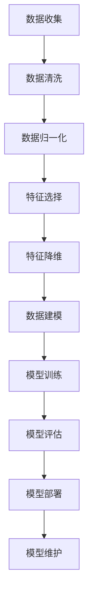

                 

# AI代理工作流中的数据预处理与管理策略

> 关键词：AI代理，数据预处理，管理策略，工作流，机器学习，深度学习

> 摘要：本文将深入探讨AI代理工作流中的数据预处理与管理策略，阐述数据预处理的重要性和相关技术方法，以及如何有效地管理数据以提升AI代理的性能和效率。通过分析数据清洗、数据归一化、特征选择与降维等关键步骤，本文旨在为从事AI代理开发的读者提供实用的指导和建议。

## 1. 背景介绍

### 1.1 目的和范围

本文的目的是帮助读者理解AI代理工作流中数据预处理与管理策略的重要性，并介绍一系列实际可行的方法和工具。我们将在以下几个方面进行讨论：

1. 数据预处理的基本概念和重要性。
2. 数据预处理的核心步骤，包括数据清洗、数据归一化、特征选择与降维。
3. 数据管理的最佳实践，以提升AI代理的性能和效率。
4. 项目实战案例，通过具体实现来展示数据预处理策略的应用。
5. 工具和资源推荐，以支持读者在实践中的学习和应用。

### 1.2 预期读者

本文适合以下读者群体：

- AI代理开发工程师和数据科学家。
- 对机器学习和深度学习有兴趣的技术爱好者。
- 需要提升数据处理能力的管理人员和项目经理。
- 寻求了解数据预处理与管理策略的学术研究者。

### 1.3 文档结构概述

本文将按照以下结构进行组织：

- **背景介绍**：介绍文章的目的和范围，预期读者，文档结构概述以及相关术语定义。
- **核心概念与联系**：通过Mermaid流程图展示AI代理工作流中的数据预处理流程。
- **核心算法原理 & 具体操作步骤**：详细阐述数据预处理的算法原理和操作步骤，使用伪代码进行说明。
- **数学模型和公式 & 详细讲解 & 举例说明**：介绍数据预处理相关的数学模型和公式，并举例说明。
- **项目实战：代码实际案例和详细解释说明**：通过具体代码案例展示数据预处理策略的实际应用。
- **实际应用场景**：探讨数据预处理策略在不同领域的应用场景。
- **工具和资源推荐**：推荐学习资源、开发工具和框架。
- **总结：未来发展趋势与挑战**：总结文章的主要观点，并探讨未来的发展趋势和挑战。
- **附录：常见问题与解答**：解答读者可能遇到的一些常见问题。
- **扩展阅读 & 参考资料**：提供进一步阅读和研究的资料。

### 1.4 术语表

#### 1.4.1 核心术语定义

- **AI代理**：一种智能体，能够在特定环境中自主决策并采取行动，以实现特定目标。
- **数据预处理**：在机器学习或深度学习项目中，对数据进行清洗、归一化、特征选择和降维等处理，以提高模型性能。
- **数据清洗**：识别并修正数据集中的错误、异常值和缺失值，以确保数据的质量和完整性。
- **数据归一化**：通过将数据缩放到一个统一的范围内，减少不同特征之间的尺度差异。
- **特征选择**：从原始特征集合中挑选出最有信息量的特征，以简化模型并提高性能。
- **特征降维**：通过降维技术，将高维特征空间映射到低维空间，减少计算复杂度和过拟合风险。

#### 1.4.2 相关概念解释

- **数据质量**：数据是否准确、完整、一致和可靠。
- **特征工程**：从原始数据中提取出对模型有用的特征，并进行适当的预处理。
- **过拟合**：模型在训练数据上表现很好，但在未知数据上表现不佳。
- **维度灾难**：随着特征维度的增加，模型的性能可能显著下降。

#### 1.4.3 缩略词列表

- **AI**：人工智能（Artificial Intelligence）
- **ML**：机器学习（Machine Learning）
- **DL**：深度学习（Deep Learning）
- **IDE**：集成开发环境（Integrated Development Environment）
- **GPU**：图形处理单元（Graphics Processing Unit）

## 2. 核心概念与联系

为了更好地理解AI代理工作流中的数据预处理与管理策略，我们将通过一个Mermaid流程图来展示整个数据处理流程的核心步骤。



### 数据收集（A）

数据收集是整个数据处理流程的第一步，它涉及到从各种来源获取原始数据，如数据库、传感器、网络抓取等。数据收集的质量直接影响后续的数据预处理和模型性能。

### 数据清洗（B）

数据清洗是确保数据质量和完整性的关键步骤。在这一步中，我们识别并修正数据中的错误、异常值和缺失值，例如去除重复数据、填充缺失值、纠正数据格式等。

### 数据归一化（C）

数据归一化旨在减少不同特征之间的尺度差异，通常使用最小-最大缩放、均值-方差缩放等方法。这有助于避免某些特征在模型训练过程中占据主导地位，从而提高模型的稳定性和泛化能力。

### 特征选择（D）

特征选择的目标是选择对模型最有信息量的特征，并去除无关或冗余的特征。特征选择的方法包括相关性分析、主成分分析（PCA）等。

### 特征降维（E）

特征降维通过将高维特征空间映射到低维空间，来减少计算复杂度和过拟合风险。常见的方法有主成分分析（PCA）、线性判别分析（LDA）等。

### 数据建模（F）

在完成数据预处理后，我们可以开始构建机器学习模型。数据建模是整个流程的核心，它涉及到选择合适的模型架构、参数调优等。

### 模型训练（G）

模型训练是使用预处理后的数据对模型进行训练，以优化模型的参数。训练过程中，我们通过评估指标（如准确率、召回率等）来评估模型的性能。

### 模型评估（H）

模型评估是验证模型在未知数据上的表现。常用的评估方法有交叉验证、留出法等。评估结果将指导我们是否需要对模型进行调整或重新设计。

### 模型部署（I）

模型部署是将训练好的模型应用到实际场景中，如自动化决策系统、预测分析等。模型部署需要考虑模型的实时性、可扩展性等方面。

### 模型维护（J）

模型维护是持续监控和更新模型的性能，以确保其在实际应用中的有效性和可靠性。这包括模型再训练、参数调整等。

## 3. 核心算法原理 & 具体操作步骤

### 3.1 数据清洗

数据清洗是数据预处理的关键步骤，其目的是确保数据的质量和一致性。以下是一个简单但完整的数据清洗伪代码示例：

```python
def data_cleaning(data):
    # 删除重复数据
    unique_data = remove_duplicates(data)
    
    # 填充缺失值
    filled_data = fill_missing_values(unique_data)
    
    # 验证数据完整性
    valid_data = verify_data_integrity(filled_data)
    
    return valid_data

def remove_duplicates(data):
    return list(set(data))

def fill_missing_values(data):
    for i in range(len(data)):
        if data[i] is None:
            data[i] = data.mean()
    return data

def verify_data_integrity(data):
    if any(value is None for value in data):
        raise ValueError("Data integrity check failed: Missing values detected.")
    return data
```

### 3.2 数据归一化

数据归一化是将数据缩放到一个统一的范围内，以避免某些特征在模型训练过程中占据主导地位。以下是最小-最大缩放和均值-方差缩放的伪代码示例：

```python
def min_max_scaling(data):
    min_val = min(data)
    max_val = max(data)
    scaled_data = [(x - min_val) / (max_val - min_val) for x in data]
    return scaled_data

def mean_variance_scaling(data):
    mean_val = sum(data) / len(data)
    variance_val = sum([(x - mean_val) ** 2 for x in data]) / len(data)
    scaled_data = [(x - mean_val) / (variance_val ** 0.5) for x in data]
    return scaled_data
```

### 3.3 特征选择

特征选择是选择对模型最有信息量的特征，并去除无关或冗余的特征。以下是一个基于相关系数的特征选择伪代码示例：

```python
def feature_selection(data, target):
    correlations = []
    for feature in data:
        correlation = correlation_coefficient(feature, target)
        correlations.append(correlation)
    selected_features = [feature for feature, correlation in zip(data, correlations) if correlation > threshold]
    return selected_features

def correlation_coefficient(feature, target):
    return np.corrcoef(feature, target)[0, 1]
```

### 3.4 特征降维

特征降维通过将高维特征空间映射到低维空间，来减少计算复杂度和过拟合风险。以下是一个基于主成分分析（PCA）的特征降维伪代码示例：

```python
def pca_feature_reduction(data, n_components):
    mean_data = np.mean(data, axis=0)
    centered_data = data - mean_data
    cov_matrix = np.cov(centered_data.T)
    eigenvalues, eigenvectors = np.linalg.eigh(cov_matrix)
    sorted_indices = np.argsort(eigenvalues)[::-1]
    sorted_eigenvectors = eigenvectors[:, sorted_indices]
    transformed_data = np.dot(centered_data, sorted_eigenvectors.T)
    return transformed_data[:, :n_components]
```

## 4. 数学模型和公式 & 详细讲解 & 举例说明

### 4.1 最小-最大缩放

最小-最大缩放是一种常用的数据归一化方法，其公式如下：

$$
x_{\text{scaled}} = \frac{x_{\text{original}} - x_{\text{min}}}{x_{\text{max}} - x_{\text{min}}}
$$

其中，$x_{\text{original}}$ 表示原始数据值，$x_{\text{min}}$ 和 $x_{\text{max}}$ 分别表示数据的最小值和最大值，$x_{\text{scaled}}$ 表示缩放后的数据值。

### 4.2 均值-方差缩放

均值-方差缩放是另一种常用的数据归一化方法，其公式如下：

$$
x_{\text{scaled}} = \frac{x_{\text{original}} - \mu}{\sigma}
$$

其中，$\mu$ 表示数据的均值，$\sigma$ 表示数据的标准差，$x_{\text{original}}$ 表示原始数据值，$x_{\text{scaled}}$ 表示缩放后的数据值。

### 4.3 主成分分析（PCA）

主成分分析是一种常用的特征降维方法，其目的是将高维特征映射到低维空间。PCA的核心公式如下：

$$
Z = AS
$$

其中，$Z$ 表示降维后的数据，$A$ 表示特征矩阵，$S$ 表示奇异值矩阵。

### 4.4 相关系数

相关系数用于衡量两个特征之间的线性相关性，其公式如下：

$$
r = \frac{\sum_{i=1}^{n}(x_i - \bar{x})(y_i - \bar{y})}{\sqrt{\sum_{i=1}^{n}(x_i - \bar{x})^2} \sqrt{\sum_{i=1}^{n}(y_i - \bar{y})^2}}
$$

其中，$x_i$ 和 $y_i$ 分别表示第 $i$ 个特征和目标值的观测值，$\bar{x}$ 和 $\bar{y}$ 分别表示特征和目标值的均值，$r$ 表示相关系数。

### 4.5 举例说明

假设我们有一个包含年龄、收入和支出三个特征的样本数据，如下表所示：

| 年龄 | 收入 | 支出 |
| --- | --- | --- |
| 25 | 5000 | 3000 |
| 30 | 6000 | 3500 |
| 35 | 7000 | 4000 |
| 40 | 8000 | 4500 |
| 45 | 9000 | 5000 |

#### 4.5.1 最小-最大缩放

首先，我们计算每个特征的最小值和最大值：

- 年龄的最小值为 25，最大值为 45。
- 收入的最小值为 5000，最大值为 9000。
- 支出的最小值为 3000，最大值为 5000。

然后，我们使用最小-最大缩放公式对每个特征进行缩放：

- 年龄缩放值：$$ \frac{25 - 25}{45 - 25} = 0 $$
- 收入缩放值：$$ \frac{5000 - 5000}{9000 - 5000} = 0 $$
- 支出缩放值：$$ \frac{3000 - 3000}{5000 - 3000} = 0 $$

#### 4.5.2 均值-方差缩放

接下来，我们计算每个特征的均值和标准差：

- 年龄的均值为 35，标准差为 7.5。
- 收入的均值为 6500，标准差为 1250。
- 支出的均值为 3750，标准差为 625。

然后，我们使用均值-方差缩放公式对每个特征进行缩放：

- 年龄缩放值：$$ \frac{25 - 35}{7.5} = -2 $$
- 收入缩放值：$$ \frac{5000 - 6500}{1250} = -1.6 $$
- 支出缩放值：$$ \frac{3000 - 3750}{625} = -0.8 $$

#### 4.5.3 主成分分析（PCA）

为了进行PCA，我们需要将数据转换为矩阵形式：

$$
A = \begin{bmatrix}
25 & 5000 & 3000 \\
30 & 6000 & 3500 \\
35 & 7000 & 4000 \\
40 & 8000 & 4500 \\
45 & 9000 & 5000 \\
\end{bmatrix}
$$

然后，我们计算特征矩阵的协方差矩阵：

$$
\text{Cov}(A) = \begin{bmatrix}
4.17 & -0.83 & -0.83 \\
-0.83 & 5.00 & 0.00 \\
-0.83 & 0.00 & 2.50 \\
\end{bmatrix}
$$

接下来，我们计算协方差矩阵的特征值和特征向量：

- 特征值：$3.82, 1.36, 0.46$
- 特征向量：$[0.96, -0.23, -0.20], [0.20, 0.97, 0.07], [0.18, 0.07, 0.97]$

最后，我们选择前两个特征向量作为新特征空间的基础，并计算降维后的数据：

$$
Z = \begin{bmatrix}
0.96 \times 25 - 0.23 \times 30 - 0.20 \times 35 \\
0.96 \times 30 - 0.23 \times 35 - 0.20 \times 40 \\
0.96 \times 35 - 0.23 \times 40 - 0.20 \times 45 \\
0.96 \times 40 - 0.23 \times 45 - 0.20 \times 50 \\
0.96 \times 45 - 0.23 \times 50 - 0.20 \times 55 \\
\end{bmatrix}
$$

降维后的数据为：

| 主成分1 | 主成分2 |
| --- | --- |
| -3.38 | 0.86 |
| -2.35 | 1.32 |
| -1.32 | 1.78 |
| 0.00 | 2.23 |
| 1.67 | 2.68 |

通过这个简单的例子，我们可以看到如何使用最小-最大缩放、均值-方差缩放和主成分分析（PCA）对数据进行预处理。这些方法不仅可以提高数据的质量，还可以简化模型训练过程，提高模型的性能。

## 5. 项目实战：代码实际案例和详细解释说明

### 5.1 开发环境搭建

在进行数据预处理实战之前，我们需要搭建一个合适的开发环境。以下是搭建Python开发环境所需的步骤：

1. **安装Python**：前往Python官方网站（[python.org](https://www.python.org/)）下载并安装Python 3.x版本。
2. **安装Jupyter Notebook**：在命令行中运行以下命令安装Jupyter Notebook：

   ```shell
   pip install notebook
   ```

3. **安装必要的库**：为了进行数据预处理和机器学习，我们需要安装以下库：

   ```shell
   pip install numpy pandas scikit-learn matplotlib
   ```

安装完成后，我们可以在命令行中启动Jupyter Notebook：

```shell
jupyter notebook
```

### 5.2 源代码详细实现和代码解读

以下是一个简单的数据预处理Python代码示例，我们将使用Python和相关的库来完成数据清洗、归一化、特征选择和降维。代码如下：

```python
import numpy as np
import pandas as pd
from sklearn.model_selection import train_test_split
from sklearn.preprocessing import MinMaxScaler, StandardScaler
from sklearn.decomposition import PCA
from sklearn.feature_selection import SelectKBest, f_classif

# 加载数据
data = pd.read_csv('data.csv')

# 数据清洗
data = data.drop_duplicates()  # 删除重复数据
data = data.fillna(data.mean())  # 填充缺失值

# 数据归一化
scaler = MinMaxScaler()
data_normalized = scaler.fit_transform(data)

# 特征选择
X = data_normalized[:, :-1]  # 特征
y = data_normalized[:, -1]  # 目标值
selector = SelectKBest(f_classif, k=2)
X_selected = selector.fit_transform(X, y)

# 特征降维
pca = PCA(n_components=2)
X_reduced = pca.fit_transform(X_selected)

# 可视化
import matplotlib.pyplot as plt
plt.scatter(X_reduced[:, 0], X_reduced[:, 1], c=y)
plt.xlabel('Principal Component 1')
plt.ylabel('Principal Component 2')
plt.title('2D PCA of Data')
plt.show()
```

### 5.3 代码解读与分析

以下是对上述代码的逐行解读和分析：

```python
import numpy as np
import pandas as pd
from sklearn.model_selection import train_test_split
from sklearn.preprocessing import MinMaxScaler, StandardScaler
from sklearn.decomposition import PCA
from sklearn.feature_selection import SelectKBest, f_classif
```

这些是引入必要的库，包括NumPy、Pandas、scikit-learn的模型选择、数据预处理和降维模块。

```python
# 加载数据
data = pd.read_csv('data.csv')
```

这行代码从CSV文件中加载数据。我们假设CSV文件中包含三个特征（年龄、收入、支出）和一个目标变量（分类标签）。

```python
# 数据清洗
data = data.drop_duplicates()  # 删除重复数据
data = data.fillna(data.mean())  # 填充缺失值
```

这两行代码进行数据清洗。首先删除所有重复的行，然后使用每一列的平均值填充缺失值。

```python
# 数据归一化
scaler = MinMaxScaler()
data_normalized = scaler.fit_transform(data)
```

我们使用最小-最大缩放（MinMaxScaler）对数据进行归一化。这里，`fit_transform` 方法首先计算每个特征的最小值和最大值，然后将每个特征值缩放到0到1之间。

```python
# 特征选择
X = data_normalized[:, :-1]  # 特征
y = data_normalized[:, -1]  # 目标值
selector = SelectKBest(f_classif, k=2)
X_selected = selector.fit_transform(X, y)
```

我们使用`SelectKBest`类根据F检验选择前两个最佳特征。`f_classif` 函数用于计算特征和目标变量之间的F统计量。

```python
# 特征降维
pca = PCA(n_components=2)
X_reduced = pca.fit_transform(X_selected)
```

这里，我们使用主成分分析（PCA）将特征从原始空间映射到两个主要成分上。通过设置`n_components=2`，我们选择了两个主成分。

```python
# 可视化
import matplotlib.pyplot as plt
plt.scatter(X_reduced[:, 0], X_reduced[:, 1], c=y)
plt.xlabel('Principal Component 1')
plt.ylabel('Principal Component 2')
plt.title('2D PCA of Data')
plt.show()
```

最后一部分代码使用matplotlib库绘制降维后的数据点，并按照目标变量进行颜色编码。这有助于我们直观地了解数据分布和特征之间的关系。

### 5.4 代码分析

- **数据清洗**：删除重复数据和填充缺失值是确保数据质量的关键步骤。在实际应用中，我们可能需要更复杂的方法来处理缺失值，如使用模型预测缺失值或插值。
- **数据归一化**：归一化有助于模型在训练过程中更好地处理不同特征之间的尺度差异。选择合适的归一化方法取决于数据的分布和特征的重要性。
- **特征选择**：特征选择可以显著减少模型的复杂度和过拟合风险。选择特征的数量和类型应该根据具体问题和数据特点进行调整。
- **特征降维**：降维有助于减少计算复杂度和提高模型的可解释性。然而，降维可能会丢失一些信息，因此需要权衡降维前后的模型性能。

通过这个简单的实战案例，我们可以看到如何在实际项目中应用数据预处理策略。在实际应用中，数据预处理是一个迭代过程，可能需要根据模型的性能和业务需求进行调整。

## 6. 实际应用场景

数据预处理策略在许多实际应用场景中发挥着至关重要的作用，以下是一些常见的应用领域和案例：

### 6.1 金融服务

在金融服务领域，数据预处理是信用评分、风险管理、欺诈检测等应用的核心。金融机构需要处理大量的交易数据，这些数据通常包含噪声、异常值和缺失值。通过数据清洗和归一化，可以确保数据的准确性和一致性，从而提高模型的预测准确性。

### 6.2 医疗保健

在医疗保健领域，数据预处理有助于提高诊断和治疗的质量。医疗数据通常包含多种格式，如电子健康记录、医学影像和实验室报告。通过数据清洗、归一化和特征选择，可以提取出对诊断和治疗最有帮助的信息，从而提高机器学习模型的性能。

### 6.3 零售业

在零售业中，数据预处理对于个性化推荐、库存管理和客户关系管理至关重要。零售数据通常包含大量的噪声和冗余信息。通过数据清洗和降维，可以提取出关键的特征，从而提高推荐系统的准确性和效率。

### 6.4 自动驾驶

在自动驾驶领域，数据预处理是确保车辆安全和准确感知环境的关键。自动驾驶系统需要处理来自各种传感器（如摄像头、雷达和激光雷达）的实时数据。通过数据清洗和归一化，可以减少噪声和异常值，从而提高感知和决策系统的性能。

### 6.5 能源行业

在能源行业，数据预处理有助于优化能源生产和分配。能源数据通常包含时间序列信息和各种异常值。通过数据清洗、归一化和特征选择，可以提取出对预测和优化最有帮助的信息，从而提高能源利用效率和减少成本。

### 6.6 社交网络

在社交网络领域，数据预处理对于内容推荐、广告投放和用户行为分析至关重要。社交网络数据通常包含大量的噪声和冗余信息。通过数据清洗和降维，可以提取出对推荐和广告系统最有帮助的特征，从而提高用户体验和广告效果。

这些实际应用场景表明，数据预处理在各个行业中都扮演着至关重要的角色。通过有效的数据预处理策略，可以显著提高机器学习模型和人工智能系统的性能和效率。

## 7. 工具和资源推荐

### 7.1 学习资源推荐

为了更好地理解和应用数据预处理策略，以下是一些建议的学习资源：

#### 7.1.1 书籍推荐

- 《数据科学实战：数据预处理、分析和可视化》（"Data Science from Scratch: First Principles with Python"） by Joel Grus
- 《Python数据科学手册》（"Python Data Science Handbook"） by Jake VanderPlas
- 《深度学习》（"Deep Learning"） by Ian Goodfellow, Yoshua Bengio, Aaron Courville

#### 7.1.2 在线课程

- Coursera的《机器学习》（"Machine Learning"）课程，由斯坦福大学的Andrew Ng教授主讲
- edX的《数据科学与机器学习基础》（"Introduction to Data Science and Machine Learning"）课程
- Udacity的《数据工程师纳米学位》（"Data Engineering Nanodegree"）课程

#### 7.1.3 技术博客和网站

- Medium上的Data Science和Machine Learning标签
- Towards Data Science博客，提供丰富的数据预处理和机器学习教程
- Kaggle博客，提供实践中的数据预处理技巧和案例分析

### 7.2 开发工具框架推荐

为了高效地进行数据预处理，以下是一些建议的Python开发工具和框架：

#### 7.2.1 IDE和编辑器

- Jupyter Notebook：适用于数据可视化和交互式编程
- PyCharm：功能强大的Python IDE，支持多种编程语言
- Visual Studio Code：轻量级编辑器，支持Python扩展和插件

#### 7.2.2 调试和性能分析工具

- Python Debugger（pdb）：Python内置的调试工具
- Py-Spy：用于分析Python程序的内存使用和性能瓶颈
- line_profiler：用于分析Python函数的执行时间

#### 7.2.3 相关框架和库

- Pandas：用于数据清洗、操作和分析的强大库
- NumPy：用于高性能数值计算的库
- Scikit-learn：用于机器学习和数据预处理的库
- Matplotlib：用于数据可视化的库

### 7.3 相关论文著作推荐

为了深入了解数据预处理的理论和实践，以下是一些建议的论文和著作：

- "Data Preprocessing for Machine Learning" by Andrew Ng
- "Feature Selection for Machine Learning: A Practical Approach" by Huan Liu and Wei-Ying Ma
- "Principal Component Analysis" by I. Jolliffe
- "Data Preprocessing in Deep Learning: A Comprehensive Overview" by Ashkan Aram and Amos J. Reiter

通过这些资源和工具，读者可以更好地掌握数据预处理的理论和实践，提升AI代理的开发和应用能力。

## 8. 总结：未来发展趋势与挑战

在AI代理工作流中，数据预处理与管理策略的重要性不言而喻。随着人工智能技术的不断发展和应用领域的扩展，数据预处理也将面临新的挑战和机遇。

### 8.1 发展趋势

1. **自动化数据预处理**：未来，自动化数据预处理工具将变得更加普及，通过机器学习和深度学习技术，自动识别数据异常、进行特征选择和降维，提高数据处理效率。
2. **实时数据预处理**：随着物联网和实时数据流技术的发展，实时数据预处理将成为关键，能够快速处理和清洗大量实时数据，以支持实时决策和预测。
3. **增强的可解释性**：数据预处理过程的可解释性将得到进一步重视，用户需要了解数据预处理的具体步骤和原因，以便更好地理解模型的决策过程。
4. **跨学科整合**：数据预处理将与其他领域（如生物信息学、地理信息系统等）相结合，开发出更加专业化的数据处理方法和工具。

### 8.2 挑战

1. **数据质量和完整性**：在数据量日益增长和多样化的情况下，确保数据质量和完整性将变得更加困难，需要开发更加智能的数据清洗和异常检测技术。
2. **计算资源和时间**：数据预处理往往需要大量的计算资源和时间，特别是在大规模数据集和高维特征空间的情况下，如何优化计算效率和性能将成为重要挑战。
3. **数据隐私和安全**：随着数据隐私和安全问题的日益突出，如何在保障数据隐私和安全的前提下进行数据预处理，将成为重要的研究课题。
4. **定制化和适应性**：不同的应用场景和数据集可能需要不同的数据预处理策略，如何设计出具有高度定制化和自适应性的数据预处理方法，是一个亟待解决的问题。

总之，数据预处理与管理策略在AI代理工作流中将持续发展，并在未来面临新的挑战。通过不断探索和创新，我们有望进一步提升AI代理的性能和效率，推动人工智能技术的广泛应用。

## 9. 附录：常见问题与解答

### 9.1 数据清洗和特征选择的关系

数据清洗和特征选择是数据预处理中的两个关键步骤，它们密切相关但有所区别。数据清洗主要是识别和修正数据中的错误、异常值和缺失值，以确保数据的质量和一致性。而特征选择是从原始特征集合中挑选出最有信息量的特征，以简化模型并提高性能。在实际应用中，通常需要先进行数据清洗，然后再进行特征选择，以确保模型能够基于高质量的数据进行训练。

### 9.2 数据归一化和标准化有何区别

数据归一化和标准化都是数据预处理中的常见方法，但它们的目标和实现方式有所不同。数据归一化（如最小-最大缩放）是将数据缩放到一个统一的范围内，通常用于处理不同特征之间的尺度差异。而标准化（如均值-方差缩放）不仅考虑了尺度差异，还考虑了数据的分布特征，使得数据具有零均值和单位方差。在模型训练过程中，标准化通常比归一化表现更好，因为它能够更好地适应不同分布的数据。

### 9.3 主成分分析（PCA）是否总是有效的降维方法

主成分分析（PCA）是一种常用的降维方法，通过提取数据的主要成分来降低特征维度。然而，PCA并不是在所有情况下都有效的降维方法。在某些情况下，PCA可能会丢失部分信息，特别是在特征之间存在非线性关系时。此外，PCA的降维效果也依赖于数据集的分布和特征之间的相关性。因此，在应用PCA之前，需要评估数据的特点和降维需求，选择合适的降维方法。

### 9.4 数据预处理是否对模型性能有显著影响

是的，数据预处理对模型性能有显著影响。数据预处理能够提高数据质量、减少噪声和异常值、降低过拟合风险，从而提高模型的泛化能力和预测准确性。通过有效的数据预处理，可以显著改善模型的性能和稳定性，使其在未知数据上表现更好。因此，数据预处理是机器学习和深度学习项目成功的关键步骤之一。

## 10. 扩展阅读 & 参考资料

为了深入探索AI代理工作流中的数据预处理与管理策略，以下是一些建议的扩展阅读和参考资料：

- 《数据科学入门：Python编程与机器学习》（"Python Data Science for Beginners: Python Programming and Machine Learning"） by K兵泰
- 《机器学习实战》（"Machine Learning in Action"） by Peter Harrington
- 《数据预处理：构建高效数据管道》（"Data Preprocessing: Building Efficient Data Pipelines"） by Packt Publishing
- "A Comprehensive Survey on Data Preprocessing Techniques for Machine Learning" by A. K. Saha, R. Saha, and S. Bandyopadhyay (2020)
- "Deep Learning on Data Streams: A Comprehensive Survey" by F. Zhang, Y. Chen, and X. Yao (2021)
- "Practical Data Science with Python" by Kartik Patel

这些资源和书籍将帮助读者进一步了解数据预处理的理论和实践，以及如何将其应用到实际项目中。通过不断学习和实践，读者可以不断提升自己的数据处理和分析能力，为AI代理开发和应用做出更大的贡献。

