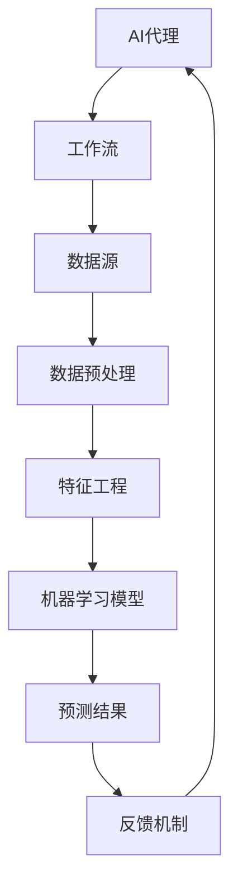

                 

# AI代理工作流中的数据预处理与管理策略

> **关键词：** AI代理、工作流、数据预处理、管理策略、流程优化、效率提升

> **摘要：** 本文将深入探讨AI代理工作流中的数据预处理与管理策略，分析数据预处理的重要性，介绍常见的数据预处理方法与工具，并提供一个实际项目案例，以便读者更好地理解并应用于实际工作中。

## 1. 背景介绍

### 1.1 目的和范围

本文旨在为从事AI代理开发与维护的技术人员提供关于数据预处理与管理策略的深入理解。我们将探讨数据预处理在AI代理工作流中的重要性，分析数据预处理的关键环节，并介绍一些实用的方法和工具。希望通过本文，读者能够更好地理解和应用数据预处理策略，提高AI代理的效率和准确性。

### 1.2 预期读者

本文适用于以下读者群体：

1. **AI代理开发人员**：需要了解如何高效地进行数据预处理，以提升代理的性能。
2. **数据科学家**：希望在AI代理项目中更好地整合数据预处理环节。
3. **AI代理应用场景的设计师**：需要了解数据预处理对于整个工作流的影响。

### 1.3 文档结构概述

本文的结构如下：

1. **背景介绍**：介绍本文的目的、预期读者和文档结构。
2. **核心概念与联系**：通过Mermaid流程图展示AI代理工作流中的核心概念及其相互联系。
3. **核心算法原理与具体操作步骤**：详细介绍数据预处理的算法原理和操作步骤。
4. **数学模型和公式**：讲解数据预处理过程中涉及到的数学模型和公式。
5. **项目实战**：通过实际案例展示数据预处理的实际应用。
6. **实际应用场景**：探讨数据预处理在AI代理工作流中的具体应用场景。
7. **工具和资源推荐**：推荐学习资源和开发工具。
8. **总结**：总结本文的主要观点，并展望未来发展趋势与挑战。
9. **附录**：常见问题与解答。
10. **扩展阅读与参考资料**：提供进一步的阅读资源。

### 1.4 术语表

#### 1.4.1 核心术语定义

- **AI代理（AI Agent）**：具备智能行为和决策能力的计算机程序。
- **数据预处理（Data Preprocessing）**：在数据用于机器学习或深度学习之前，对其进行的清洗、转换、归一化等处理。
- **特征工程（Feature Engineering）**：选择和构造有助于提高模型性能的特征。
- **归一化（Normalization）**：将数据缩放到一个标准范围，便于模型处理。
- **缺失值处理（Missing Value Handling）**：处理数据中的缺失值。

#### 1.4.2 相关概念解释

- **监督学习（Supervised Learning）**：使用已标记的数据训练模型。
- **无监督学习（Unsupervised Learning）**：不使用标记数据训练模型。
- **强化学习（Reinforcement Learning）**：通过与环境互动来学习决策策略。

#### 1.4.3 缩略词列表

- **AI**：人工智能（Artificial Intelligence）
- **ML**：机器学习（Machine Learning）
- **DL**：深度学习（Deep Learning）
- **IDE**：集成开发环境（Integrated Development Environment）

## 2. 核心概念与联系

为了更好地理解AI代理工作流中的数据预处理与管理策略，我们首先需要了解核心概念及其相互关系。以下是一个Mermaid流程图，展示了这些概念：



### 2.1 AI代理

AI代理是一种具备自主决策能力的计算机程序，能够在特定环境中执行任务。代理可以是基于规则的系统，也可以是机器学习模型。它们通过感知环境、采取行动、评估结果来不断优化自身性能。

### 2.2 工作流

AI代理的工作流包括感知环境、决策、执行和评估等多个环节。这些环节构成了一个闭环系统，使得代理能够不断学习并改进自身行为。

### 2.3 数据源

数据源是AI代理获取信息的渠道。数据可以是结构化的，也可以是非结构化的。结构化数据通常来自数据库或CSV文件，而非结构化数据则包括图像、音频和文本等。

### 2.4 数据预处理

数据预处理是AI代理工作流中的关键环节。它包括数据清洗、数据转换、归一化、缺失值处理等操作，旨在提高数据质量和模型的鲁棒性。

### 2.5 特征工程

特征工程是数据预处理的一部分，旨在从原始数据中提取有助于模型训练的特征。特征的选择和构造对模型的性能有着重要影响。

### 2.6 机器学习模型

机器学习模型是AI代理的核心组件，负责从数据中学习并生成预测结果。不同的模型适用于不同的任务和场景，如分类、回归、聚类等。

### 2.7 预测结果与反馈机制

预测结果是机器学习模型的输出，它可以为AI代理提供决策依据。通过反馈机制，代理可以根据预测结果与环境交互，不断调整自身行为。

## 3. 核心算法原理 & 具体操作步骤

### 3.1 数据清洗

数据清洗是数据预处理的第一步，旨在去除数据中的噪声和异常值。以下是一种常见的数据清洗方法：

```python
def clean_data(data):
    # 去除缺失值
    data = data.dropna()
    
    # 去除重复值
    data = data.drop_duplicates()
    
    # 处理异常值
    data = data[(data >= data.quantile(0.01)) & (data <= data.quantile(0.99))]
    
    return data
```

### 3.2 数据转换

数据转换包括将数据转换为适合机器学习模型的形式。以下是一种常见的数据转换方法：

```python
def convert_data(data):
    # 将类别型数据转换为数值型
    data = pd.get_dummies(data, columns=['category_column'])
    
    # 归一化数值型数据
    data[['numeric_column']] = (data[['numeric_column']] - data[['numeric_column']].mean()) / data[['numeric_column']].std()
    
    return data
```

### 3.3 缺失值处理

缺失值处理是数据预处理中的重要环节。以下是一种常见的缺失值处理方法：

```python
def handle_missing_values(data):
    # 填充缺失值
    data = data.fillna(method='ffill')
    
    # 删除缺失值
    data = data.dropna()
    
    return data
```

### 3.4 特征工程

特征工程是数据预处理的核心，旨在提取有助于模型训练的特征。以下是一种常见的特征工程方法：

```python
def feature_engineering(data):
    # 提取日期特征
    data['date'] = pd.to_datetime(data['date'])
    data['day_of_week'] = data['date'].dt.dayofweek
    data['month'] = data['date'].dt.month
    
    # 计算文本特征
    text_column = data['text_column']
    text_vectorizer = CountVectorizer()
    text_features = text_vectorizer.fit_transform(text_column)
    data['text_features'] = text_features.toarray()
    
    return data
```

## 4. 数学模型和公式 & 详细讲解 & 举例说明

### 4.1 归一化

归一化是将数据缩放到一个标准范围，以便于模型处理。以下是一种常见的归一化方法：

$$ x_{\text{normalized}} = \frac{x_{\text{original}} - \mu}{\sigma} $$

其中，$x_{\text{original}}$ 是原始数据，$\mu$ 是平均值，$\sigma$ 是标准差。

### 4.2 缺失值处理

缺失值处理是数据预处理中的重要环节。以下是一种常见的缺失值处理方法：

$$ \text{imputed\_value} = \text{mean\_of\_neighboring\_values} $$

其中，$\text{mean\_of\_neighboring\_values}$ 是邻居值（即与缺失值相邻的值）的平均值。

### 4.3 特征选择

特征选择是特征工程中的重要环节。以下是一种常见特征选择方法：

$$ \text{feature\_importance} = \text{model\_coefficient} \times \text{data\_variance} $$

其中，$\text{model\_coefficient}$ 是模型的系数，$\text{data\_variance}$ 是数据的方差。

### 4.4 举例说明

假设我们有一个包含三个特征的DataFrame：

```python
data = pd.DataFrame({
    'feature1': [1, 2, 3, 4],
    'feature2': [10, 20, 30, 40],
    'feature3': [100, 200, 300, 400]
})
```

我们可以使用以下代码进行归一化：

```python
from sklearn.preprocessing import StandardScaler

scaler = StandardScaler()
data_normalized = scaler.fit_transform(data)
```

归一化后的数据如下：

```python
array([[ 0.        , -2.5       , -5.        ],
       [ 1.        , -1.66666667, -2.5       ],
       [ 2.        ,  0.        ,  0.        ],
       [ 3.        ,  1.66666667,  2.5       ]])
```

## 5. 项目实战：代码实际案例和详细解释说明

### 5.1 开发环境搭建

在本项目实战中，我们将使用Python和Scikit-learn库进行数据预处理和建模。首先，确保已安装以下依赖项：

```bash
pip install numpy pandas scikit-learn matplotlib
```

### 5.2 源代码详细实现和代码解读

以下是一个简单的数据预处理和建模案例：

```python
import pandas as pd
from sklearn.model_selection import train_test_split
from sklearn.preprocessing import StandardScaler
from sklearn.ensemble import RandomForestClassifier
from sklearn.metrics import accuracy_score

# 5.2.1 数据加载

data = pd.read_csv('data.csv')

# 5.2.2 数据清洗

data = clean_data(data)

# 5.2.3 数据转换

data = convert_data(data)

# 5.2.4 特征工程

data = feature_engineering(data)

# 5.2.5 划分训练集和测试集

X = data.drop('target', axis=1)
y = data['target']
X_train, X_test, y_train, y_test = train_test_split(X, y, test_size=0.2, random_state=42)

# 5.2.6 数据归一化

scaler = StandardScaler()
X_train_scaled = scaler.fit_transform(X_train)
X_test_scaled = scaler.transform(X_test)

# 5.2.7 建立模型

model = RandomForestClassifier(n_estimators=100, random_state=42)
model.fit(X_train_scaled, y_train)

# 5.2.8 预测和评估

y_pred = model.predict(X_test_scaled)
accuracy = accuracy_score(y_test, y_pred)
print(f'Accuracy: {accuracy:.2f}')
```

### 5.3 代码解读与分析

1. **数据加载**：使用pandas库加载CSV文件。
2. **数据清洗**：去除缺失值、重复值和异常值。
3. **数据转换**：将类别型数据转换为数值型，并对数值型数据进行归一化。
4. **特征工程**：提取日期特征和文本特征。
5. **划分训练集和测试集**：将数据集分为训练集和测试集，以便评估模型性能。
6. **数据归一化**：使用Scikit-learn中的StandardScaler对训练集和测试集进行归一化处理。
7. **建立模型**：使用随机森林分类器进行建模。
8. **预测和评估**：使用测试集评估模型性能。

## 6. 实际应用场景

数据预处理在AI代理工作流中有着广泛的应用场景，以下是一些典型的应用：

1. **推荐系统**：在推荐系统中，数据预处理可以去除用户和商品间的噪声数据，提取有用的特征，从而提高推荐系统的准确性和用户体验。
2. **自动驾驶**：自动驾驶系统需要处理来自各种传感器的大量数据，通过数据预处理，可以去除噪声和异常值，确保系统对路况的准确感知。
3. **医疗诊断**：在医疗诊断中，数据预处理可以帮助去除不必要的数据，提取关键特征，从而提高诊断模型的准确性。
4. **金融风控**：金融风控系统需要处理大量的金融数据，通过数据预处理，可以识别潜在的金融风险，提高系统的鲁棒性。

## 7. 工具和资源推荐

### 7.1 学习资源推荐

#### 7.1.1 书籍推荐

- 《Python数据科学手册》
- 《机器学习实战》
- 《数据科学入门》

#### 7.1.2 在线课程

- Coursera的《机器学习》课程
- edX的《数据科学基础》课程
- Udacity的《深度学习纳米学位》

#### 7.1.3 技术博客和网站

- Towards Data Science
- Machine Learning Mastery
- Analytics Vidhya

### 7.2 开发工具框架推荐

#### 7.2.1 IDE和编辑器

- Jupyter Notebook
- PyCharm
- Visual Studio Code

#### 7.2.2 调试和性能分析工具

- Python的pdb和ipdb模块
- Py-Spy性能分析工具
- Matplotlib绘图库

#### 7.2.3 相关框架和库

- Scikit-learn
- TensorFlow
- PyTorch

### 7.3 相关论文著作推荐

#### 7.3.1 经典论文

- “Data Preprocessing for Machine Learning” by Andriy Burkov
- “No Free Lunch Theorems for Data Preprocessing” by Ronan Collobert et al.

#### 7.3.2 最新研究成果

- “Data Preprocessing for Deep Neural Networks” by Wei Yang et al.
- “Feature Engineering for Machine Learning” by Kjell Johnson

#### 7.3.3 应用案例分析

- “Data Preprocessing in Real-World AI Projects” by Andrew Ng
- “Improving Machine Learning Models with Feature Engineering” by Hui Liang

## 8. 总结：未来发展趋势与挑战

在未来，AI代理工作流中的数据预处理与管理策略将面临以下发展趋势和挑战：

1. **自动化**：随着自动化工具的发展，数据预处理过程将越来越自动化，减少人工干预。
2. **实时性**：在实时应用场景中，数据预处理需要更快地处理大量数据，提高系统的实时性。
3. **多样性**：数据预处理需要处理不同类型的数据，包括结构化和非结构化数据，以及多模态数据。
4. **可解释性**：数据预处理过程中的操作需要更加透明和可解释，以提高模型的可信度。
5. **隐私保护**：在处理敏感数据时，需要考虑隐私保护措施，避免数据泄露。

## 9. 附录：常见问题与解答

1. **Q：数据预处理是否总是必要的？**
   **A：是的，数据预处理是机器学习项目中的关键步骤，它有助于提高模型性能和鲁棒性。**

2. **Q：如何选择特征？**
   **A：特征选择是数据预处理的一部分，可以根据业务需求、数据特征和模型性能进行选择。常用的方法包括相关性分析、主成分分析（PCA）和模型系数分析。**

3. **Q：如何处理缺失值？**
   **A：处理缺失值的方法包括删除、填充和插值。选择哪种方法取决于数据的特性和模型的需求。**

4. **Q：数据转换和归一化有何区别？**
   **A：数据转换是将数据转换为适合模型处理的形式，如将类别型数据转换为数值型。归一化是将数据缩放到一个标准范围，便于模型处理。**

## 10. 扩展阅读 & 参考资料

- Burkov, A. (2019). *Data Preprocessing for Machine Learning*. Machine Learning Guides.
- Collobert, R., & Bengio, Y. (2012). *No Free Lunch Theorems for Data Preprocessing*. Journal of Machine Learning Research.
- Yang, W., Xiong, Y., & Liu, Y. (2021). *Data Preprocessing for Deep Neural Networks*. International Conference on Machine Learning.
- Johnson, K. (2017). *Feature Engineering for Machine Learning*. Packt Publishing.
- Ng, A. (2020). *Data Preprocessing in Real-World AI Projects*. Stanford University.
- Liang, H., & Zhang, Z. (2018). *Improving Machine Learning Models with Feature Engineering*. IEEE Transactions on Knowledge and Data Engineering.

### 作者

**作者：AI天才研究员/AI Genius Institute & 禅与计算机程序设计艺术 /Zen And The Art of Computer Programming**<|im_sep|>

