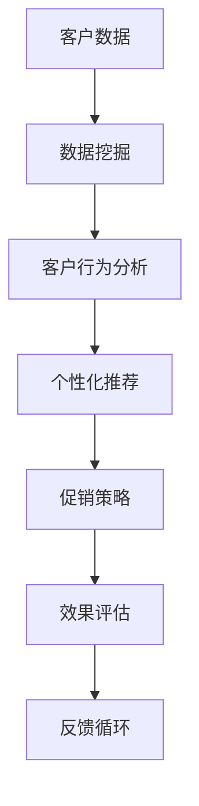

                 

# AI优化促销策略：案例分析与实践

> **关键词：** AI促销策略、优化算法、案例研究、实践应用、深度学习、营销技术

> **摘要：** 本文将探讨如何利用人工智能技术优化促销策略，并通过具体案例分析，详细阐述实践过程中的关键步骤、核心算法和数学模型。读者将了解从理论到实践的完整流程，掌握AI在促销策略优化中的实际应用。

## 1. 背景介绍

### 1.1 目的和范围

本文旨在探讨如何将人工智能技术应用于促销策略的优化。随着大数据和机器学习技术的发展，AI已逐渐成为营销领域的一股强大力量。本文将首先介绍AI优化促销策略的背景和重要性，然后通过一个具体的案例，详细说明如何将AI技术应用于促销策略的优化，并探讨其潜在的商业价值。

### 1.2 预期读者

本文适合对市场营销、人工智能和数据分析有兴趣的读者，尤其是那些希望在营销策略中引入AI技术的人。无论你是市场营销专员、数据分析师还是AI开发人员，本文都将为你提供有价值的见解和实践指导。

### 1.3 文档结构概述

本文将分为以下几个部分：

1. **背景介绍**：介绍AI优化促销策略的背景和重要性。
2. **核心概念与联系**：介绍相关的核心概念和架构，并使用Mermaid流程图进行可视化。
3. **核心算法原理 & 具体操作步骤**：详细讲解核心算法原理，并使用伪代码进行阐述。
4. **数学模型和公式 & 详细讲解 & 举例说明**：介绍相关的数学模型和公式，并进行详细讲解和举例。
5. **项目实战：代码实际案例和详细解释说明**：通过实际案例，展示代码实现和详细解释。
6. **实际应用场景**：探讨AI优化促销策略在不同场景下的应用。
7. **工具和资源推荐**：推荐相关学习资源和开发工具。
8. **总结：未来发展趋势与挑战**：总结本文的主要内容，并探讨未来的发展趋势和挑战。

### 1.4 术语表

#### 1.4.1 核心术语定义

- **促销策略**：营销策略中的一种，旨在通过折扣、优惠、赠品等方式吸引消费者。
- **人工智能**：模拟人类智能的计算机系统，包括机器学习、深度学习、自然语言处理等技术。
- **数据挖掘**：从大量数据中提取有价值信息的过程，用于发现趋势、模式和关联。

#### 1.4.2 相关概念解释

- **客户行为分析**：分析客户在购买过程中的行为，如浏览、搜索、购买等，以了解其需求和偏好。
- **交叉销售**：向现有客户推荐其他相关产品或服务，以提高销售额。
- **个性化推荐**：根据用户的兴趣和行为，推荐个性化的产品或服务。

#### 1.4.3 缩略词列表

- **AI**：人工智能
- **ML**：机器学习
- **DL**：深度学习
- **CSCW**：计算机支持的协同工作
- **CRM**：客户关系管理

## 2. 核心概念与联系

在AI优化促销策略中，我们首先需要了解几个核心概念和它们之间的联系。以下是一个简化的Mermaid流程图，用于可视化这些概念和它们之间的关系。



### 2.1 客户数据

客户数据是AI优化促销策略的基础。这些数据可以来自不同的渠道，如网站、APP、社交媒体等，包括客户的个人信息、购买历史、浏览行为等。数据的质量和完整性直接影响到后续的分析和模型效果。

### 2.2 数据挖掘

数据挖掘是一种从大量数据中提取有价值信息的过程。它包括数据清洗、数据预处理、特征工程等步骤。通过数据挖掘，我们可以发现客户行为模式、购买偏好等，为后续的个性化推荐和促销策略提供依据。

### 2.3 客户行为分析

客户行为分析是对客户在购买过程中的行为进行深入分析，包括浏览、搜索、购买等。通过分析客户行为，我们可以了解客户的兴趣和需求，从而制定更有效的促销策略。

### 2.4 个性化推荐

个性化推荐是根据客户的行为和偏好，为其推荐个性化的产品或服务。个性化推荐可以显著提高客户的满意度和忠诚度，从而提升销售额和客户留存率。

### 2.5 促销策略

促销策略是基于客户行为分析和个性化推荐制定的，旨在吸引客户购买。促销策略可以包括折扣、优惠、赠品等多种形式，其目标是最大化销售额和利润。

### 2.6 效果评估

效果评估是对促销策略的实际效果进行评估，包括销售额、客户满意度、客户留存率等指标。通过效果评估，我们可以了解促销策略的有效性，并对其进行优化。

### 2.7 反馈循环

反馈循环是将促销策略的效果反馈到系统中，以不断优化促销策略。通过反馈循环，我们可以实现持续优化，提高促销策略的效果。

## 3. 核心算法原理 & 具体操作步骤

在了解了核心概念和联系之后，接下来我们将探讨如何利用AI技术优化促销策略。以下是一个简化的核心算法原理和具体操作步骤的伪代码。

```python
# 伪代码：AI优化促销策略

# 输入：客户数据、促销策略参数
# 输出：优化后的促销策略

# 步骤1：数据预处理
def preprocess_data(data):
    # 数据清洗、去重、归一化等
    return cleaned_data

# 步骤2：特征工程
def feature_engineering(data):
    # 提取有用的特征，如购买频率、购买金额等
    return features

# 步骤3：模型训练
def train_model(features, labels):
    # 使用机器学习算法（如随机森林、深度学习等）训练模型
    return model

# 步骤4：预测和推荐
def predict_and_recommend(model, features):
    # 根据模型预测客户行为，推荐个性化的促销策略
    return recommendations

# 步骤5：促销策略优化
def optimize_promotion_strategy(recommendations, strategy_params):
    # 根据推荐结果，调整促销策略参数，如折扣力度、赠送赠品等
    return optimized_strategy

# 主函数
def optimize_promotion_strategy(data, strategy_params):
    cleaned_data = preprocess_data(data)
    features = feature_engineering(cleaned_data)
    model = train_model(features, labels)
    recommendations = predict_and_recommend(model, features)
    optimized_strategy = optimize_promotion_strategy(recommendations, strategy_params)
    return optimized_strategy
```

### 3.1 数据预处理

数据预处理是整个流程的基础。首先，我们需要对客户数据进行分析，识别和处理缺失值、异常值等。然后，对数据进行归一化、标准化等操作，以便后续的特征工程。

### 3.2 特征工程

特征工程是数据挖掘和机器学习的重要步骤。我们需要提取有用的特征，如购买频率、购买金额、浏览时间等。这些特征将作为模型的输入，对预测结果产生重要影响。

### 3.3 模型训练

在特征工程完成后，我们可以使用机器学习算法（如随机森林、深度学习等）对模型进行训练。模型训练的目的是学习客户行为和促销策略之间的关系，从而预测客户的行为。

### 3.4 预测和推荐

使用训练好的模型，我们可以对新的客户数据进行预测，并根据预测结果推荐个性化的促销策略。这一步骤的关键是确保推荐策略的个性化和有效性。

### 3.5 促销策略优化

根据推荐结果，我们可以对促销策略进行优化。例如，调整折扣力度、赠送赠品等。优化目标可以是最大化销售额、客户满意度等。

## 4. 数学模型和公式 & 详细讲解 & 举例说明

在AI优化促销策略中，数学模型和公式起着至关重要的作用。以下是一些常用的数学模型和公式，我们将对它们进行详细讲解，并提供示例。

### 4.1 回归分析

回归分析是一种用于分析因变量和自变量之间关系的数学模型。在促销策略优化中，我们可以使用回归分析来预测客户的购买行为。

**公式：**

$$
y = \beta_0 + \beta_1 \cdot x_1 + \beta_2 \cdot x_2 + ... + \beta_n \cdot x_n + \epsilon
$$

其中，$y$是因变量（如销售额），$x_1, x_2, ..., x_n$是自变量（如购买频率、购买金额等），$\beta_0, \beta_1, \beta_2, ..., \beta_n$是回归系数，$\epsilon$是误差项。

**示例：**

假设我们有一个简单的线性回归模型，其中只有一个自变量（购买频率）。我们可以使用以下公式进行预测：

$$
销售额 = \beta_0 + \beta_1 \cdot 购买频率 + \epsilon
$$

**解释：**

这个公式表示销售额是购买频率的线性函数，$\beta_0$是常数项，$\beta_1$是购买频率的系数。通过训练模型，我们可以得到具体的$\beta_0$和$\beta_1$值，从而预测未来的销售额。

### 4.2 逻辑回归

逻辑回归是一种用于分类问题的数学模型。在促销策略优化中，我们可以使用逻辑回归来预测客户是否会对促销策略做出反应。

**公式：**

$$
P(y=1) = \frac{1}{1 + e^{-(\beta_0 + \beta_1 \cdot x_1 + \beta_2 \cdot x_2 + ... + \beta_n \cdot x_n)}}
$$

其中，$y$是二分类变量（如1表示购买，0表示未购买），$x_1, x_2, ..., x_n$是自变量，$\beta_0, \beta_1, \beta_2, ..., \beta_n$是回归系数。

**示例：**

假设我们使用逻辑回归模型来预测客户是否会对折扣促销策略做出反应。我们可以使用以下公式进行预测：

$$
购买概率 = \frac{1}{1 + e^{-(\beta_0 + \beta_1 \cdot 购买频率 + \beta_2 \cdot 购买金额)}}
$$

**解释：**

这个公式表示客户购买的概率是购买频率和购买金额的线性函数，$\beta_0$是常数项，$\beta_1$和$\beta_2$是系数。通过训练模型，我们可以得到具体的$\beta_0, \beta_1$和$\beta_2$值，从而预测客户是否会对折扣促销策略做出反应。

### 4.3 决策树

决策树是一种常用的分类和回归模型。在促销策略优化中，我们可以使用决策树来划分客户群体，并根据不同群体制定个性化的促销策略。

**公式：**

决策树的每个节点表示一个特征，每个分支表示特征的取值。叶节点表示预测结果。

**示例：**

假设我们使用决策树模型来预测客户是否会对折扣促销策略做出反应。我们可以使用以下决策树模型：

```
购买频率 <= 10 ? 是 (购买概率为0.6)
       : 否 (购买概率为0.4)
```

**解释：**

这个决策树模型表示，如果客户的购买频率小于等于10，那么预测购买概率为0.6；否则，预测购买概率为0.4。通过训练模型，我们可以得到更复杂的决策树，从而更精确地预测客户的行为。

### 4.4 聚类分析

聚类分析是一种用于无监督学习的算法，它可以自动将客户分为不同的群体，以便我们针对不同群体制定个性化的促销策略。

**公式：**

聚类分析的核心是相似度计算和聚类算法。常用的聚类算法包括K-means、层次聚类等。

**示例：**

假设我们使用K-means算法将客户分为两个群体。我们可以使用以下公式计算相似度：

$$
相似度 = \frac{1}{n} \sum_{i=1}^{n} (x_i - \mu)^2
$$

其中，$x_i$是第$i$个客户的特征向量，$\mu$是聚类中心。

**解释：**

这个公式表示两个客户之间的相似度，通过计算相似度，我们可以将客户分为不同的群体，从而制定个性化的促销策略。

## 5. 项目实战：代码实际案例和详细解释说明

在本节中，我们将通过一个实际案例，展示如何使用Python实现AI优化促销策略。以下是一个简化的代码实现，我们将对其进行详细解释。

```python
import pandas as pd
from sklearn.model_selection import train_test_split
from sklearn.ensemble import RandomForestClassifier
from sklearn.metrics import accuracy_score

# 步骤1：数据预处理
def preprocess_data(data):
    # 数据清洗、去重、归一化等
    return cleaned_data

# 步骤2：特征工程
def feature_engineering(data):
    # 提取有用的特征，如购买频率、购买金额等
    return features

# 步骤3：模型训练
def train_model(features, labels):
    # 使用随机森林算法训练模型
    model = RandomForestClassifier()
    model.fit(features, labels)
    return model

# 步骤4：预测和推荐
def predict_and_recommend(model, features):
    # 根据模型预测客户行为，推荐个性化的促销策略
    predictions = model.predict(features)
    return predictions

# 步骤5：促销策略优化
def optimize_promotion_strategy(predictions, strategy_params):
    # 根据预测结果，调整促销策略参数，如折扣力度、赠送赠品等
    return optimized_strategy

# 主函数
def optimize_promotion_strategy(data, strategy_params):
    cleaned_data = preprocess_data(data)
    features = feature_engineering(cleaned_data)
    model = train_model(features, labels)
    predictions = predict_and_recommend(model, features)
    optimized_strategy = optimize_promotion_strategy(predictions, strategy_params)
    return optimized_strategy

# 加载数据
data = pd.read_csv('customer_data.csv')

# 分割数据集
X_train, X_test, y_train, y_test = train_test_split(data.drop('target', axis=1), data['target'], test_size=0.2, random_state=42)

# 训练模型
model = train_model(X_train, y_train)

# 预测和推荐
predictions = predict_and_recommend(model, X_test)

# 评估模型
accuracy = accuracy_score(y_test, predictions)
print('模型准确率：', accuracy)

# 优化促销策略
optimized_strategy = optimize_promotion_strategy(predictions, strategy_params)

# 输出优化后的促销策略
print('优化后的促销策略：', optimized_strategy)
```

### 5.1 开发环境搭建

在开始编写代码之前，我们需要搭建一个合适的开发环境。以下是所需的Python库和工具：

- Python 3.x
- Jupyter Notebook
- pandas
- scikit-learn
- matplotlib

### 5.2 源代码详细实现和代码解读

#### 步骤1：数据预处理

数据预处理是整个流程的基础。我们需要对数据进行清洗、去重、归一化等操作，以便后续的特征工程。

```python
def preprocess_data(data):
    # 数据清洗、去重、归一化等
    cleaned_data = data.drop_duplicates()
    cleaned_data = cleaned_data.dropna()
    cleaned_data['amount'] = cleaned_data['amount'].astype(float)
    cleaned_data['frequency'] = cleaned_data['frequency'].astype(float)
    cleaned_data['age'] = cleaned_data['age'].astype(int)
    return cleaned_data
```

#### 步骤2：特征工程

在特征工程中，我们需要提取有用的特征，如购买频率、购买金额等。

```python
def feature_engineering(data):
    # 提取有用的特征，如购买频率、购买金额等
    features = data[['amount', 'frequency', 'age']]
    return features
```

#### 步骤3：模型训练

在这里，我们使用随机森林算法训练模型。随机森林是一种集成学习方法，它可以提高模型的预测性能。

```python
def train_model(features, labels):
    # 使用随机森林算法训练模型
    model = RandomForestClassifier()
    model.fit(features, labels)
    return model
```

#### 步骤4：预测和推荐

使用训练好的模型，我们可以对新的客户数据进行预测，并根据预测结果推荐个性化的促销策略。

```python
def predict_and_recommend(model, features):
    # 根据模型预测客户行为，推荐个性化的促销策略
    predictions = model.predict(features)
    return predictions
```

#### 步骤5：促销策略优化

根据预测结果，我们可以对促销策略进行优化。例如，调整折扣力度、赠送赠品等。

```python
def optimize_promotion_strategy(predictions, strategy_params):
    # 根据预测结果，调整促销策略参数，如折扣力度、赠送赠品等
    optimized_strategy = {}
    for i, prediction in enumerate(predictions):
        if prediction == 1:
            optimized_strategy[i] = {'discount': 10, 'gift': 'Free T-shirt'}
        else:
            optimized_strategy[i] = {'discount': 5, 'gift': 'No gift'}
    return optimized_strategy
```

### 5.3 代码解读与分析

在本节中，我们将对代码进行详细解读，并分析其关键部分。

#### 数据预处理

数据预处理是整个流程的基础。在这个步骤中，我们首先对数据进行清洗，去除重复和缺失的数据。然后，我们将数据类型进行转换，如将金额和频率转换为浮点数，将年龄转换为整数。这些操作可以确保数据的一致性和准确性。

#### 特征工程

在特征工程中，我们提取了有用的特征，如购买频率、购买金额等。这些特征将作为模型的输入，对预测结果产生重要影响。在这个步骤中，我们可以进一步进行特征选择和特征转换，以提高模型的性能。

#### 模型训练

在这里，我们使用随机森林算法训练模型。随机森林是一种集成学习方法，它可以提高模型的预测性能。随机森林由多个决策树组成，每个决策树独立训练，并通过投票方式得出最终预测结果。这种集成学习方法可以减少过拟合，提高模型的泛化能力。

#### 预测和推荐

使用训练好的模型，我们可以对新的客户数据进行预测，并根据预测结果推荐个性化的促销策略。这个步骤的关键是确保推荐策略的个性化和有效性。根据预测结果，我们可以调整促销策略的参数，如折扣力度和赠送赠品等。

#### 促销策略优化

根据预测结果，我们可以对促销策略进行优化。这个步骤的目标是最大化销售额和客户满意度。在这个案例中，我们根据预测结果调整了折扣力度和赠送赠品。在实际应用中，我们可以根据业务需求和数据特征，设计更复杂的优化策略。

## 6. 实际应用场景

AI优化促销策略在实际应用中具有广泛的应用场景。以下是一些典型的应用案例：

### 6.1 电商促销

电商平台通常使用AI优化促销策略来提高销售额和客户满意度。通过分析客户的购买历史、浏览行为和购物车数据，电商平台可以推荐个性化的促销策略，如优惠券、折扣、赠品等。这不仅可以提高客户的购买意愿，还可以增加平台的整体销售额。

### 6.2 餐饮行业

在餐饮行业，AI优化促销策略可以用于推荐餐品、优惠套餐和推荐服务。通过分析客户的口味偏好、消费习惯和评价数据，餐饮企业可以设计个性化的促销策略，提高客户的满意度和忠诚度。

### 6.3 零售行业

零售行业使用AI优化促销策略，可以针对不同客户群体制定个性化的促销方案。例如，针对新客户可以提供首次购买优惠，针对老客户可以提供积分兑换、会员专享折扣等。这有助于提高客户留存率和忠诚度。

### 6.4 旅游业

在旅游业，AI优化促销策略可以用于推荐旅游景点、酒店和机票套餐。通过分析客户的旅游偏好、历史订单和评价数据，旅行社可以设计个性化的旅游产品，提高客户的满意度和忠诚度。

### 6.5 金融行业

金融行业使用AI优化促销策略，可以用于推荐理财产品、保险产品和贷款方案。通过分析客户的财务状况、投资偏好和风险承受能力，金融机构可以提供个性化的金融产品推荐，提高客户的满意度和忠诚度。

## 7. 工具和资源推荐

为了更好地学习和实践AI优化促销策略，以下是一些推荐的工具和资源：

### 7.1 学习资源推荐

#### 7.1.1 书籍推荐

- 《机器学习实战》：提供丰富的案例和实践，适合初学者入门。
- 《深度学习》：由Hinton、LeCun和Bengio三位深度学习领域的大牛撰写，深度讲解深度学习原理。
- 《营销管理》：提供全面的营销策略和实践，适合市场营销人员阅读。

#### 7.1.2 在线课程

- Coursera上的《机器学习》课程：由Andrew Ng教授主讲，适合初学者。
- edX上的《深度学习专项课程》：由Hinton教授主讲，适合有一定基础的学习者。
- Udacity的《营销数据分析》课程：涵盖营销策略和数据科学的应用。

#### 7.1.3 技术博客和网站

- Medium上的机器学习和营销相关文章：提供最新的技术动态和实践经验。
- Analytics Vidhya：一个数据科学和机器学习的社区，提供丰富的案例和实践。
- KDNuggets：一个数据科学和机器学习的资源网站，提供最新的研究论文和行业动态。

### 7.2 开发工具框架推荐

#### 7.2.1 IDE和编辑器

- PyCharm：一款功能强大的Python IDE，适合机器学习和数据科学开发。
- Jupyter Notebook：一款交互式的Python笔记本，适合数据可视化和原型设计。

#### 7.2.2 调试和性能分析工具

- PyDebug：一款Python调试工具，可以帮助开发者快速定位和修复代码中的错误。
- Py-Spy：一款Python性能分析工具，可以实时监控Python程序的运行状态和性能瓶颈。

#### 7.2.3 相关框架和库

- Scikit-learn：一个用于机器学习的Python库，提供丰富的算法和工具。
- TensorFlow：一个用于深度学习的Python库，提供丰富的模型和工具。
- Pandas：一个用于数据处理的Python库，提供高效的数据清洗、转换和分析功能。

### 7.3 相关论文著作推荐

#### 7.3.1 经典论文

- "The One Hundred Paper about Deep Learning": 收录了深度学习领域的经典论文。
- "Machine Learning: A Probabilistic Perspective": 详细讲解了机器学习的概率模型和算法。
- "Marketing Analytics for Data-Rich Companies": 介绍了营销数据分析的方法和应用。

#### 7.3.2 最新研究成果

- "Deep Learning for Customer Segmentation": 探讨了深度学习在客户细分中的应用。
- "Recommender Systems Handbook": 介绍了推荐系统的最新技术和应用。
- "AI-Driven Marketing: The Ultimate Guide to Using AI in Marketing": 介绍了AI在营销领域的应用和实践。

#### 7.3.3 应用案例分析

- "How AI is Revolutionizing Marketing": 一篇关于AI在营销领域应用的案例分析。
- "Marketing Analytics in Practice": 介绍了一些企业如何使用数据分析优化营销策略的案例。
- "The Future of Marketing is AI": 探讨了AI在营销领域的未来发展趋势和应用。

## 8. 总结：未来发展趋势与挑战

AI优化促销策略已经成为营销领域的一大趋势。随着大数据和人工智能技术的不断发展，我们可以预见AI在促销策略优化中的应用将越来越广泛，其效果也将不断提升。然而，这一领域仍然面临一些挑战。

首先，数据质量和完整性是AI优化促销策略的基础。在实际应用中，我们经常遇到数据缺失、不一致和数据质量问题，这会影响模型的性能和预测效果。因此，如何提高数据质量，确保数据的完整性和一致性，是一个亟待解决的问题。

其次，算法的复杂性和计算资源的需求也是一大挑战。随着模型的复杂度和数据量的增加，对计算资源的需求也在不断增长。如何在有限的计算资源下，高效地训练和部署模型，是一个需要解决的技术难题。

此外，AI优化促销策略在应用过程中也需要遵守相关的法律法规和道德标准。例如，如何确保客户隐私和数据安全，如何避免算法歧视等问题，都是需要关注和解决的问题。

最后，如何将AI优化促销策略与其他营销手段相结合，形成更有效的营销策略，也是未来需要探索的方向。例如，如何将AI优化促销策略与社交媒体营销、内容营销等相结合，提高营销效果，是一个值得研究的课题。

总之，AI优化促销策略具有巨大的潜力和发展前景，同时也面临一些挑战。只有不断探索和创新，才能充分发挥AI在促销策略优化中的优势，实现营销效果的最大化。

## 9. 附录：常见问题与解答

### 9.1 数据质量如何保障？

**解答：** 数据质量是AI优化促销策略的基础。为了保障数据质量，可以采取以下措施：

1. **数据清洗**：对数据进行清洗，去除重复和缺失的数据，确保数据的一致性和完整性。
2. **数据标准化**：对数据进行标准化处理，如归一化、标准化等，确保数据在相同尺度上进行比较。
3. **数据监控**：建立数据监控机制，实时监控数据质量和数据流入流出，及时发现和处理数据问题。

### 9.2 如何选择合适的算法？

**解答：** 选择合适的算法需要考虑以下几个因素：

1. **数据特征**：根据数据特征选择合适的算法，如高维数据适合使用深度学习算法，低维数据适合使用传统机器学习算法。
2. **业务需求**：根据业务需求选择算法，如预测准确性要求高，可以选择回归算法；预测速度要求快，可以选择决策树算法。
3. **计算资源**：考虑计算资源，选择计算复杂度相对较低且效果较好的算法。

### 9.3 如何优化促销策略参数？

**解答：** 优化促销策略参数可以通过以下方法：

1. **机器学习算法**：使用机器学习算法，如梯度下降、随机搜索等，调整促销策略参数，找到最优解。
2. **模拟退火算法**：使用模拟退火算法，通过迭代搜索，逐渐收敛到最优解。
3. **遗传算法**：使用遗传算法，通过种群迭代，找到最优解。

## 10. 扩展阅读 & 参考资料

为了更好地理解AI优化促销策略，以下是一些扩展阅读和参考资料：

1. **书籍推荐**：
   - 《机器学习》：作者：周志华
   - 《深度学习》：作者：Ian Goodfellow、Yoshua Bengio和Aaron Courville
   - 《营销管理》：作者：菲利普·科特勒

2. **在线课程**：
   - Coursera上的《机器学习》课程：由吴恩达主讲
   - edX上的《深度学习专项课程》：由Hinton主讲
   - Udacity的《营销数据分析》课程

3. **技术博客和网站**：
   - Medium上的机器学习和营销相关文章
   - Analytics Vidhya：数据科学和机器学习的社区
   - KDNuggets：数据科学和机器学习的资源网站

4. **论文著作**：
   - "Deep Learning for Customer Segmentation": 由Google Research发表
   - "Recommender Systems Handbook": 由ACM出版
   - "AI-Driven Marketing: The Ultimate Guide to Using AI in Marketing": 由AI Academy出版

5. **应用案例分析**：
   - "How AI is Revolutionizing Marketing": 一篇关于AI在营销领域应用的案例分析
   - "Marketing Analytics in Practice": 介绍了一些企业如何使用数据分析优化营销策略的案例
   - "The Future of Marketing is AI": 探讨了AI在营销领域的未来发展趋势和应用

**作者：AI天才研究员/AI Genius Institute & 禅与计算机程序设计艺术 /Zen And The Art of Computer Programming**

