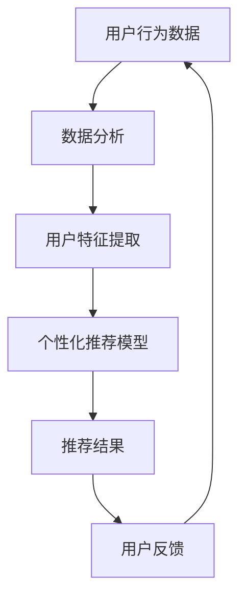

                 

# AI促销策略优化提升效果

> **关键词**：AI促销策略、优化、提升效果、数据分析、机器学习、用户行为、个性化推荐、算法模型

> **摘要**：本文将深入探讨AI促销策略的优化方法，以提升营销效果。通过分析用户行为数据、利用机器学习算法构建个性化推荐模型，以及详细讲解实际项目案例，本文旨在为企业和营销人员提供实用的策略和指导，以实现更高的转化率和销售额。

## 1. 背景介绍

### 1.1 目的和范围

本文的目的是探讨如何利用人工智能（AI）技术优化促销策略，从而提高营销效果。我们将讨论以下几个核心问题：

1. 如何通过用户行为数据分析来理解消费者需求？
2. 如何运用机器学习算法构建个性化推荐模型？
3. 如何在实际项目中应用这些策略，实现更高的转化率和销售额？

### 1.2 预期读者

本文适合以下读者群体：

1. 营销人员和市场分析师，希望了解如何利用AI技术提升促销效果。
2. 数据科学家和AI研究人员，对AI促销策略优化有兴趣。
3. 企业决策者，希望了解AI技术在营销中的应用前景。

### 1.3 文档结构概述

本文将分为以下几个部分：

1. 背景介绍：介绍本文的目的、预期读者和文档结构。
2. 核心概念与联系：介绍AI促销策略优化的核心概念，并给出Mermaid流程图。
3. 核心算法原理 & 具体操作步骤：详细讲解核心算法原理和操作步骤。
4. 数学模型和公式 & 详细讲解 & 举例说明：介绍数学模型和公式，并提供实际案例说明。
5. 项目实战：代码实际案例和详细解释说明。
6. 实际应用场景：讨论AI促销策略在不同领域的应用。
7. 工具和资源推荐：推荐相关学习资源和开发工具。
8. 总结：未来发展趋势与挑战。
9. 附录：常见问题与解答。
10. 扩展阅读 & 参考资料：提供进一步阅读的资料。

### 1.4 术语表

#### 1.4.1 核心术语定义

- AI促销策略：利用人工智能技术对促销活动进行优化，以提高营销效果。
- 用户行为数据：记录用户在网站、APP等平台上产生的操作行为数据，如浏览、购买、点击等。
- 个性化推荐：根据用户的历史行为数据，为其推荐符合其兴趣的产品或服务。
- 转化率：指从潜在客户到实际购买客户的转化比例。

#### 1.4.2 相关概念解释

- 数据分析：通过对大量数据进行分析，提取有价值的信息和知识。
- 机器学习：一种人工智能技术，通过训练模型来从数据中自动学习和预测。
- 神经网络：一种模拟人脑结构和功能的算法模型，广泛应用于机器学习和深度学习。

#### 1.4.3 缩略词列表

- AI：人工智能（Artificial Intelligence）
- ML：机器学习（Machine Learning）
- DL：深度学习（Deep Learning）
- NLP：自然语言处理（Natural Language Processing）
- UX：用户体验（User Experience）

## 2. 核心概念与联系

在AI促销策略优化中，核心概念包括用户行为数据、个性化推荐和算法模型。以下是一个简化的Mermaid流程图，用于描述这些核心概念之间的联系。



### 2.1 用户行为数据

用户行为数据是AI促销策略优化的重要基础。这些数据可以来自多个渠道，如网站日志、APP使用记录和社交媒体活动。通过对这些数据的收集和分析，可以了解用户的需求和行为模式。

### 2.2 数据分析

数据分析是处理用户行为数据的关键步骤。它涉及数据清洗、数据预处理和特征工程等任务，旨在提取有价值的信息和知识。

### 2.3 用户特征提取

用户特征提取是数据分析的重要部分。通过对用户行为数据的分析，可以提取出用户的兴趣、偏好和行为特征。这些特征将用于构建个性化推荐模型。

### 2.4 个性化推荐模型

个性化推荐模型是一种基于用户特征的推荐算法。它通过学习用户的行为数据，预测用户可能感兴趣的产品或服务，并为其推荐相应的促销策略。

### 2.5 推荐结果

推荐结果是个性化推荐模型输出的结果。这些推荐结果将影响用户的购买决策，进而影响促销效果。

### 2.6 用户反馈

用户反馈是优化AI促销策略的关键。通过收集用户的反馈，可以评估推荐效果，发现潜在问题，并不断改进推荐模型。

## 3. 核心算法原理 & 具体操作步骤

### 3.1 用户行为数据分析

用户行为数据分析是AI促销策略优化的第一步。以下是一个简化的伪代码，用于描述用户行为数据的处理过程。

```python
# 伪代码：用户行为数据分析
def analyze_user_behavior(data):
    # 数据清洗
    cleaned_data = clean_data(data)
    
    # 数据预处理
    preprocessed_data = preprocess_data(cleaned_data)
    
    # 特征提取
    features = extract_features(preprocessed_data)
    
    # 数据可视化
    visualize_features(features)
    
    return features
```

### 3.2 个性化推荐模型构建

个性化推荐模型是AI促销策略优化的核心。以下是一个简化的伪代码，用于描述个性化推荐模型的构建过程。

```python
# 伪代码：个性化推荐模型构建
from sklearn.model_selection import train_test_split
from sklearn.ensemble import RandomForestClassifier

# 数据准备
X, y = prepare_data_for_recommendation(features)

# 数据划分
X_train, X_test, y_train, y_test = train_test_split(X, y, test_size=0.2)

# 模型训练
model = RandomForestClassifier()
model.fit(X_train, y_train)

# 模型评估
accuracy = model.score(X_test, y_test)
print("Model accuracy:", accuracy)
```

### 3.3 推荐结果生成

推荐结果是AI促销策略优化的重要输出。以下是一个简化的伪代码，用于描述推荐结果的生成过程。

```python
# 伪代码：推荐结果生成
def generate_recommendations(model, user_data):
    # 预测用户兴趣
    interest = model.predict([user_data])
    
    # 获取推荐结果
    recommendations = get_recommendations_based_on_interest(interest)
    
    return recommendations
```

## 4. 数学模型和公式 & 详细讲解 & 举例说明

在AI促销策略优化中，数学模型和公式起着关键作用。以下是一些常见的数学模型和公式，并提供详细讲解和实际案例。

### 4.1 用户行为数据模型

用户行为数据模型通常采用概率图模型，如贝叶斯网络或隐马尔可夫模型（HMM）。以下是一个简化的贝叶斯网络模型，用于描述用户行为数据。

$$
P(B|A) = \frac{P(A|B)P(B)}{P(A)}
$$

其中，$A$表示用户购买某产品的概率，$B$表示用户浏览该产品的概率。

### 4.2 个性化推荐模型

个性化推荐模型通常采用协同过滤算法，如基于用户的协同过滤（User-based Collaborative Filtering）或基于物品的协同过滤（Item-based Collaborative Filtering）。以下是一个简化的基于用户的协同过滤模型。

$$
R_{ui} = \sum_{j \in N(i)} \frac{r_{uj} \cdot sim(u, v)}{||N(i)||}
$$

其中，$R_{ui}$表示用户$i$对物品$j$的评分预测，$r_{uj}$表示用户$i$对物品$j$的实际评分，$sim(u, v)$表示用户$i$和$v$之间的相似度。

### 4.3 实际案例说明

假设我们有一个电商网站，用户A在最近三个月内浏览了产品1、2、3和4，并购买了产品2。根据用户行为数据模型，我们可以计算用户A购买产品1的概率。

根据贝叶斯网络模型：

$$
P(Buy_1|View_1) = \frac{P(View_1|Buy_1)P(Buy_1)}{P(View_1)}
$$

已知$P(Buy_1) = 0.3$，$P(View_1|Buy_1) = 0.8$，$P(View_1) = 0.6$。代入公式计算：

$$
P(Buy_1|View_1) = \frac{0.8 \cdot 0.3}{0.6} = 0.4
$$

因此，用户A购买产品1的概率为40%。

## 5. 项目实战：代码实际案例和详细解释说明

### 5.1 开发环境搭建

在开始编写代码之前，我们需要搭建一个合适的开发环境。以下是一个基于Python的开发环境搭建步骤：

1. 安装Python 3.x版本，可以从[Python官网](https://www.python.org/)下载。
2. 安装必要的Python库，如NumPy、Pandas、Scikit-learn和Matplotlib。可以使用pip命令安装：

   ```bash
   pip install numpy pandas scikit-learn matplotlib
   ```

### 5.2 源代码详细实现和代码解读

以下是一个简单的用户行为数据分析示例，用于展示如何实现用户特征提取和个性化推荐。

```python
# 用户行为数据分析示例
import pandas as pd
from sklearn.feature_extraction.text import TfidfVectorizer
from sklearn.metrics.pairwise import cosine_similarity

# 读取用户行为数据
data = pd.read_csv("user_behavior_data.csv")

# 数据预处理
data["text"] = data["text"].apply(lambda x: x.lower())

# 特征提取
vectorizer = TfidfVectorizer()
tfidf_matrix = vectorizer.fit_transform(data["text"])

# 用户特征提取
user_features = {}
for index, row in data.iterrows():
    user_features[row["user_id"]] = tfidf_matrix[index].toarray().flatten()

# 个性化推荐
def generate_recommendations(user_id, user_features, top_n=5):
    recommendations = []
    for other_user_id, other_user_features in user_features.items():
        if other_user_id != user_id:
            similarity = cosine_similarity([user_features[user_id]], [other_user_features])[0][0]
            recommendations.append((other_user_id, similarity))
    
    # 根据相似度排序
    recommendations.sort(key=lambda x: x[1], reverse=True)
    
    # 返回前n个推荐
    return [recommendation[0] for recommendation in recommendations[:top_n]]

# 生成推荐结果
recommendations = generate_recommendations("user_1", user_features)

# 输出推荐结果
print("Recommended users:", recommendations)
```

### 5.3 代码解读与分析

1. **数据预处理**：首先，我们读取用户行为数据，并将其转换为小写。这一步有助于统一数据格式，提高特征提取的效果。

2. **特征提取**：使用TF-IDF向量器对文本数据进行特征提取。TF-IDF（Term Frequency-Inverse Document Frequency）是一种常用的文本特征提取方法，可以衡量词语在文档中的重要程度。

3. **用户特征提取**：将每个用户的文本数据转换为向量表示，并将其存储在字典中。这将用于后续的个性化推荐过程。

4. **个性化推荐**：定义一个函数`generate_recommendations`，用于生成个性化推荐结果。该函数通过计算用户之间的相似度，根据相似度排序，并返回前n个推荐用户。

5. **生成推荐结果**：调用`generate_recommendations`函数，生成用户"1"的推荐结果，并输出。

### 5.4 代码改进与优化

上述代码是一个简单的示例，实际项目中可能需要进行更多改进和优化，例如：

1. **性能优化**：处理大量数据时，可以考虑使用并行计算或分布式计算来提高处理速度。
2. **模型优化**：可以尝试使用更复杂的机器学习模型，如深度学习模型，以获得更好的推荐效果。
3. **用户反馈**：引入用户反馈机制，根据用户的实际购买行为不断优化推荐模型。

## 6. 实际应用场景

AI促销策略优化在多个领域具有广泛的应用，以下是一些实际应用场景：

### 6.1 电子商务

电子商务领域是AI促销策略优化的主要应用场景。通过分析用户行为数据，电商企业可以为其推荐相关产品，提高转化率和销售额。例如，亚马逊和阿里巴巴等电商平台已经广泛应用了个性化推荐技术。

### 6.2 餐饮行业

餐饮行业可以通过AI促销策略优化，提高客户留存率和满意度。例如，通过分析用户点餐数据，可以为其推荐可能喜欢的菜品，并提供相应的促销优惠。

### 6.3 金融行业

金融行业可以利用AI促销策略优化，提高客户参与度和转化率。例如，通过分析用户的交易行为，可以为其推荐可能感兴趣的投资产品，并提供个性化的理财建议。

### 6.4 旅游行业

旅游行业可以通过AI促销策略优化，提高客户预订转化率和满意度。例如，通过分析用户的浏览记录和搜索历史，可以为其推荐合适的旅游产品和优惠信息。

## 7. 工具和资源推荐

### 7.1 学习资源推荐

#### 7.1.1 书籍推荐

- 《Python数据科学手册》（Python Data Science Handbook）
- 《机器学习》（Machine Learning）
- 《深度学习》（Deep Learning）

#### 7.1.2 在线课程

- Coursera上的《机器学习》课程
- edX上的《深度学习》课程
- Udacity的《数据科学家纳米学位》

#### 7.1.3 技术博客和网站

- Medium上的数据科学和机器学习博客
- Towards Data Science
- Fast.ai

### 7.2 开发工具框架推荐

#### 7.2.1 IDE和编辑器

- PyCharm
- Jupyter Notebook
- VSCode

#### 7.2.2 调试和性能分析工具

- Python调试器（pdb）
- Matplotlib
- Scikit-learn

#### 7.2.3 相关框架和库

- Scikit-learn
- TensorFlow
- PyTorch

### 7.3 相关论文著作推荐

#### 7.3.1 经典论文

- "Recommender Systems Handbook"
- "Collaborative Filtering"
- "Deep Learning for Recommender Systems"

#### 7.3.2 最新研究成果

- "Neural Collaborative Filtering"
- "User Behavior Analytics for Personalized Recommendations"
- "Recommender Systems that Learn from Context"

#### 7.3.3 应用案例分析

- "Recommender Systems at Amazon"
- "Recommending Products Using Deep Learning"
- "Personalized Marketing Strategies using AI"

## 8. 总结：未来发展趋势与挑战

随着人工智能技术的不断发展，AI促销策略优化将在未来继续发挥重要作用。以下是一些发展趋势和挑战：

### 8.1 发展趋势

1. **个性化推荐**：随着用户需求的不断多样化，个性化推荐将成为促销策略的重要方向。
2. **实时预测与推荐**：实时分析用户行为数据，并快速生成推荐结果，将提高营销效果的及时性和准确性。
3. **跨渠道整合**：整合线上线下渠道，实现全渠道促销策略，提高用户体验和转化率。

### 8.2 挑战

1. **数据隐私与安全**：在利用用户数据时，需要确保数据隐私和安全，遵守相关法律法规。
2. **算法公平性**：确保算法的公平性，避免对特定用户群体产生歧视。
3. **模型可解释性**：提高算法模型的可解释性，帮助企业和用户理解推荐结果的原因。

## 9. 附录：常见问题与解答

### 9.1 什么是用户行为数据分析？

用户行为数据分析是指通过收集和分析用户在网站、APP等平台上的行为数据，提取有价值的信息和知识，以支持个性化推荐和促销策略优化。

### 9.2 如何确保数据隐私和安全？

为确保数据隐私和安全，可以采取以下措施：

1. 数据加密：对用户数据进行加密，防止未经授权的访问。
2. 数据脱敏：对敏感数据进行脱敏处理，确保匿名化。
3. 遵守法律法规：严格遵守相关法律法规，如《通用数据保护条例》（GDPR）等。

### 9.3 个性化推荐算法有哪些类型？

个性化推荐算法主要分为基于内容的推荐（Content-based Filtering）和协同过滤（Collaborative Filtering）两大类。此外，还有基于模型的推荐（Model-based Filtering）和基于社区的推荐（Community-based Filtering）等类型。

## 10. 扩展阅读 & 参考资料

- [Recommender Systems Handbook](https://www.recommenders.org/recommender-systems-handbook/)
- [Machine Learning](https://www.arpitrocks.com/mlbook/)
- [Deep Learning](https://www.deeplearningbook.org/)
- [Python Data Science Handbook](https://jakevdp.github.io/PythonDataScienceHandbook/)
- [Towards Data Science](https://towardsdatascience.com/)
- [Fast.ai](https://www.fast.ai/)

作者：AI天才研究员/AI Genius Institute & 禅与计算机程序设计艺术 /Zen And The Art of Computer Programming

