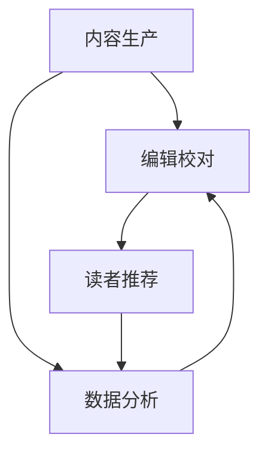

                 

# AI出版业前景：技术创新，场景无限

> 关键词：人工智能，出版业，技术创新，场景应用，数字出版，数据分析，机器学习

> 摘要：本文将深入探讨人工智能在出版业中的应用前景。随着技术的不断进步，AI正逐步改变着传统出版行业的面貌，从内容生产、编辑校对到读者推荐，AI的介入极大地提升了出版效率和读者体验。本文将分析AI在出版业中的核心技术创新，并探讨其在实际应用场景中的无限可能性。

## 1. 背景介绍

### 1.1 目的和范围

本文旨在分析人工智能在出版业中的应用，探讨其带来的技术革新和行业变革。具体来说，我们将讨论以下几个方面：

1. AI技术在出版业中的核心应用场景。
2. 关键算法和数学模型在AI出版中的应用。
3. 实际项目中的AI出版案例。
4. 出版业的未来发展趋势与挑战。

### 1.2 预期读者

本文适合对人工智能和出版业有一定了解的技术人员、行业从业者以及对新兴技术感兴趣的读者。希望通过本文，读者能够：

1. 了解AI在出版业中的潜在应用。
2. 掌握关键技术和算法原理。
3. 对出版业的未来发展有更深入的认识。

### 1.3 文档结构概述

本文结构如下：

1. 背景介绍：介绍文章的目的、预期读者和文档结构。
2. 核心概念与联系：讨论AI出版中的核心概念及其联系。
3. 核心算法原理 & 具体操作步骤：详细讲解AI出版中的关键算法。
4. 数学模型和公式 & 详细讲解 & 举例说明：介绍相关数学模型及其应用。
5. 项目实战：代码实际案例和详细解释说明。
6. 实际应用场景：探讨AI在出版业中的实际应用。
7. 工具和资源推荐：推荐相关学习资源和开发工具。
8. 总结：未来发展趋势与挑战。
9. 附录：常见问题与解答。
10. 扩展阅读 & 参考资料：提供进一步学习的资源。

### 1.4 术语表

#### 1.4.1 核心术语定义

- **人工智能（AI）**：模拟人类智能的计算机技术。
- **机器学习（ML）**：一种AI方法，通过数据学习来改进性能。
- **自然语言处理（NLP）**：使计算机能够理解和生成人类语言的技术。
- **数字出版**：利用数字技术进行内容创作、编辑、出版和分发。
- **推荐系统**：基于用户历史数据推荐相关内容或产品。

#### 1.4.2 相关概念解释

- **内容生产**：创作和编辑书籍、文章等文本内容。
- **编辑校对**：对文本内容进行校对和修改。
- **读者行为分析**：通过收集和分析读者数据，了解读者偏好和需求。

#### 1.4.3 缩略词列表

- **AI**：人工智能
- **ML**：机器学习
- **NLP**：自然语言处理
- **IDE**：集成开发环境
- **API**：应用程序接口

## 2. 核心概念与联系

### 2.1 AI出版的基本概念

AI出版指的是利用人工智能技术来创作、编辑、出版和分发数字内容的过程。它涵盖了从内容生产、编辑校对到读者推荐等各个环节。

#### 内容生产

AI内容生产利用自然语言生成（NLG）技术，如GPT-3，自动生成文章、报告和书籍等。这种方法不仅可以提高内容创作效率，还能确保生成的内容具有高质量和多样性。

#### 编辑校对

AI编辑校对通过自然语言处理技术，如语法分析、拼写检查和语义分析，自动识别文本中的错误和不当之处，并提供修改建议。

#### 读者推荐

AI读者推荐系统通过分析读者历史数据、行为和偏好，推荐相关内容或产品。这种个性化推荐可以提高读者的阅读体验，增加出版商的收入。

### 2.2 关键技术架构

下面是一个简单的Mermaid流程图，展示了AI出版中的关键技术和架构：



### 2.3 关键算法和模型

在AI出版中，常用的算法和模型包括：

- **自然语言生成（NLG）**：如GPT-3，用于自动生成高质量文本。
- **文本分类**：用于识别文本的主题和分类。
- **情感分析**：用于分析文本的情感倾向。
- **聚类分析**：用于对读者进行分类和群体分析。
- **推荐系统**：如基于内容的推荐和协同过滤推荐。

这些算法和模型共同构成了AI出版的核心技术，为出版业带来了前所未有的变革。

## 3. 核心算法原理 & 具体操作步骤

### 3.1 自然语言生成（NLG）

自然语言生成是AI出版中的一个关键环节，它能够自动生成高质量的文本内容。下面是NLG的基本原理和具体操作步骤：

#### 原理

NLG基于机器学习，特别是深度学习技术。它利用大规模的语料库，通过训练模型来学习语言结构和规则。常见的NLG模型包括序列到序列（Seq2Seq）模型、变换器（Transformer）模型等。

#### 操作步骤

1. **数据预处理**：首先，收集和清洗大规模的文本数据，如新闻、文章、书籍等。这些数据将被用来训练NLG模型。

2. **模型训练**：使用预处理后的数据，训练NLG模型。训练过程包括输入序列和输出序列的映射。训练目标是最小化输入和输出之间的差距。

3. **文本生成**：训练完成后，使用NLG模型生成文本。输入可以是关键词、短语或简短的句子，模型将根据这些输入生成完整的文章或段落。

4. **后处理**：生成的文本可能包含一些语法错误或不符合实际需求的内容。因此，需要对生成的文本进行后处理，如语法修正、内容优化等。

### 3.2 机器学习分类算法

在AI出版中，分类算法用于识别文本的主题和分类。下面是常见分类算法的原理和具体操作步骤：

#### 原理

分类算法通过学习文本的特征，将其映射到预定义的类别上。常见的分类算法包括朴素贝叶斯、决策树、随机森林和支持向量机等。

#### 操作步骤

1. **特征提取**：从文本中提取特征，如词频、词袋模型、TF-IDF等。这些特征将用于训练分类模型。

2. **模型训练**：使用提取的特征，训练分类模型。训练目标是最小化分类误差。

3. **分类预测**：使用训练好的模型，对新的文本进行分类预测。预测结果将决定文本的类别。

### 3.3 情感分析算法

情感分析算法用于分析文本的情感倾向，如正面、负面或中性。下面是情感分析的基本原理和具体操作步骤：

#### 原理

情感分析基于自然语言处理技术，通过分析文本中的情感词汇和语境，确定文本的情感倾向。

#### 操作步骤

1. **情感词典**：构建情感词典，包含正面、负面和中和的情感词汇。

2. **文本预处理**：对文本进行预处理，如去除标点符号、停用词过滤等。

3. **情感识别**：使用情感词典和自然语言处理技术，对文本进行情感识别。情感识别结果将决定文本的情感倾向。

4. **情感分类**：将文本的情感识别结果映射到预定义的情感类别上，如正面、负面或中性。

## 4. 数学模型和公式 & 详细讲解 & 举例说明

### 4.1 自然语言生成（NLG）模型

NLG模型通常基于深度学习，其中最著名的模型之一是GPT-3。GPT-3的核心是一个大规模的变换器（Transformer）模型，其训练过程中使用了一种特殊的训练策略，即自回归语言模型（Autoregressive Language Model）。

#### 自回归语言模型

自回归语言模型的目标是预测序列中的下一个元素。对于文本序列，每个单词或字符都是序列中的一个元素。自回归语言模型的公式如下：

$$
P(\text{word}_t | \text{word}_{t-1}, \text{word}_{t-2}, \ldots, \text{word}_1) = \frac{P(\text{word}_t, \text{word}_{t-1}, \text{word}_{t-2}, \ldots, \text{word}_1)}{P(\text{word}_{t-1}, \text{word}_{t-2}, \ldots, \text{word}_1)}
$$

其中，$P(\text{word}_t | \text{word}_{t-1}, \text{word}_{t-2}, \ldots, \text{word}_1)$ 是给定前文预测下一个单词的概率，$P(\text{word}_t, \text{word}_{t-1}, \text{word}_{t-2}, \ldots, \text{word}_1)$ 是整个序列的概率。

#### 举例说明

假设我们有一个简单的文本序列：“今天 天气很好”。我们可以用自回归模型来预测下一个单词：

$$
P(\text{天气} | \text{今天}) = \frac{P(\text{今天}, \text{天气很好})}{P(\text{今天})}
$$

其中，$P(\text{今天}, \text{天气很好})$ 是整个序列的概率，$P(\text{今天})$ 是“今天”这个单词的概率。通过训练模型，我们可以得到这些概率的估计值。

### 4.2 文本分类模型

文本分类是AI出版中的一个关键任务，常见的分类算法包括朴素贝叶斯、决策树、随机森林和支持向量机等。下面我们以朴素贝叶斯为例，介绍其原理和公式。

#### 原理

朴素贝叶斯分类器基于贝叶斯定理，通过计算每个类别发生的概率来预测文本的类别。其公式如下：

$$
P(\text{类别} | \text{特征}) = \frac{P(\text{特征} | \text{类别}) \cdot P(\text{类别})}{P(\text{特征})}
$$

其中，$P(\text{类别} | \text{特征})$ 是给定特征后类别发生的概率，$P(\text{特征} | \text{类别})$ 是在某个类别下特征发生的概率，$P(\text{类别})$ 是类别的先验概率，$P(\text{特征})$ 是特征的总概率。

#### 举例说明

假设我们有一个文本分类问题，有两个类别：“科技”和“娱乐”。给定一个文本特征，我们可以使用朴素贝叶斯分类器来计算每个类别发生的概率。

首先，我们需要计算每个类别的先验概率。假设有1000个文本，其中500个属于“科技”，500个属于“娱乐”，则：

$$
P(\text{科技}) = \frac{500}{1000} = 0.5
$$

$$
P(\text{娱乐}) = \frac{500}{1000} = 0.5
$$

接下来，我们需要计算每个类别下特征的概率。假设文本特征是“人工智能”，则：

$$
P(\text{人工智能} | \text{科技}) = \frac{200}{500} = 0.4
$$

$$
P(\text{人工智能} | \text{娱乐}) = \frac{100}{500} = 0.2
$$

最后，我们需要计算特征的总概率：

$$
P(\text{人工智能}) = P(\text{人工智能} | \text{科技}) \cdot P(\text{科技}) + P(\text{人工智能} | \text{娱乐}) \cdot P(\text{娱乐}) = 0.4 \cdot 0.5 + 0.2 \cdot 0.5 = 0.3
$$

现在，我们可以计算给定特征“人工智能”后每个类别发生的概率：

$$
P(\text{科技} | \text{人工智能}) = \frac{P(\text{人工智能} | \text{科技}) \cdot P(\text{科技})}{P(\text{人工智能})} = \frac{0.4 \cdot 0.5}{0.3} = 0.67
$$

$$
P(\text{娱乐} | \text{人工智能}) = \frac{P(\text{人工智能} | \text{娱乐}) \cdot P(\text{娱乐})}{P(\text{人工智能})} = \frac{0.2 \cdot 0.5}{0.3} = 0.33
$$

根据这两个概率，我们可以预测文本的类别。如果$P(\text{科技} | \text{人工智能}) > P(\text{娱乐} | \text{人工智能})$，则预测为“科技”；否则，预测为“娱乐”。

### 4.3 情感分析模型

情感分析是另一个重要的AI出版任务，用于分析文本的情感倾向。常见的情感分析模型包括基于词典的方法和基于机器学习的方法。下面我们以基于词典的方法为例，介绍其原理和公式。

#### 原理

基于词典的方法通过构建情感词典来分析文本的情感。情感词典包含正面、负面和中和的情感词汇。分析时，计算文本中正面、负面和中和词汇的数量，并根据数量判断文本的情感。

#### 举例说明

假设我们有一个情感词典，包含以下情感词汇：

- **正面**：快乐、喜悦、兴奋
- **负面**：悲伤、愤怒、失望
- **中和**：中性、一般、正常

给定一个文本：“我很快乐，但也有点悲伤。”，我们可以使用情感词典来分析其情感。

首先，我们计算文本中正面、负面和中和词汇的数量：

- **正面**：1个（快乐）
- **负面**：1个（悲伤）
- **中和**：3个（很、也、点）

根据数量，我们可以判断文本的情感。在这种情况下，文本既包含正面词汇，也包含负面词汇，因此可以认为文本的情感是“中性”。

## 5. 项目实战：代码实际案例和详细解释说明

### 5.1 开发环境搭建

在进行AI出版项目的实战之前，我们需要搭建一个合适的开发环境。以下是一个基本的开发环境搭建步骤：

1. 安装Python（版本3.6及以上）。
2. 安装Anaconda，以便管理环境和依赖。
3. 安装Jupyter Notebook，用于编写和运行代码。
4. 安装相关库，如TensorFlow、Scikit-learn、NLTK等。

### 5.2 源代码详细实现和代码解读

下面我们将展示一个简单的AI出版项目，使用GPT-3生成文章，并使用朴素贝叶斯分类器对文章进行分类。

#### 5.2.1 代码实现

首先，我们需要安装GPT-3库：

```bash
pip install openai
```

然后，我们可以编写一个简单的Python脚本，使用GPT-3生成文章：

```python
import openai

openai.api_key = "your-api-key"

def generate_article(prompt):
    response = openai.Completion.create(
        engine="text-davinci-002",
        prompt=prompt,
        max_tokens=150
    )
    return response.choices[0].text.strip()

prompt = "请写一篇关于人工智能在出版业中的应用的文章。"
article = generate_article(prompt)
print(article)
```

接下来，我们使用朴素贝叶斯分类器对生成的文章进行分类：

```python
from sklearn.feature_extraction.text import TfidfVectorizer
from sklearn.naive_bayes import MultinomialNB
from sklearn.pipeline import make_pipeline

# 假设我们已经有了训练数据
train_data = ["这是一篇科技文章。", "这是一篇娱乐文章。"]
train_labels = ["科技", "娱乐"]

# 构建分类器管道
model = make_pipeline(TfidfVectorizer(), MultinomialNB())

# 训练模型
model.fit(train_data, train_labels)

# 对生成文章进行分类
predicted_category = model.predict([article])[0]
print("预测类别：", predicted_category)
```

#### 5.2.2 代码解读与分析

1. **GPT-3生成文章**：我们首先使用GPT-3生成一篇关于人工智能在出版业中的应用的文章。GPT-3是OpenAI的一个强大语言模型，可以自动生成高质量的文章。我们使用`openai.Completion.create`方法来生成文章。该方法接受`engine`参数，指定使用的模型（如"text-davinci-002"），以及`prompt`参数，指定生成文章的提示。

2. **朴素贝叶斯分类器**：接下来，我们使用朴素贝叶斯分类器对生成的文章进行分类。朴素贝叶斯分类器是一种简单的概率分类器，基于贝叶斯定理进行分类。在这里，我们使用了Scikit-learn库中的`MultinomialNB`类来实现朴素贝叶斯分类器。为了简化流程，我们使用了一个简单的`make_pipeline`函数，将文本向量和分类器组合在一起。

3. **训练模型**：我们使用训练数据集来训练朴素贝叶斯分类器。训练数据集包含了科技和娱乐两类文章，以及对应的标签。通过`model.fit`方法，我们训练了分类器。

4. **分类预测**：最后，我们使用训练好的分类器对生成的文章进行分类预测。`model.predict`方法接受一个文本向量作为输入，并返回预测的类别。在这个例子中，我们只生成了一篇文章，因此只返回了一个预测结果。

### 5.3 代码分析与改进

1. **数据集多样性**：这个例子中的训练数据集非常简单，只包含了两类文章。在实际应用中，我们需要一个更大、更多样化的数据集来训练分类器，以提高分类准确性。

2. **特征提取**：在这个例子中，我们使用了TF-IDF向量来提取文本特征。TF-IDF是一种常用的文本特征提取方法，但在某些情况下，其他特征提取方法（如Word2Vec或BERT）可能更有效。

3. **模型优化**：朴素贝叶斯分类器是一个简单但有效的分类器，但在某些情况下，可能需要更复杂的模型（如深度学习模型）来提高分类性能。

## 6. 实际应用场景

AI技术在出版业中有着广泛的应用场景，下面列举几个典型的应用：

### 6.1 内容生产

- **自动生成文章**：使用GPT-3等语言生成模型，自动生成新闻报道、文章和书籍。
- **内容辅助创作**：为编辑和作者提供自动化的内容建议和修改建议。

### 6.2 编辑校对

- **自动校对**：使用自然语言处理技术，自动识别和纠正文本中的语法、拼写和语义错误。
- **个性化校对**：根据用户的历史数据和写作风格，提供个性化的校对建议。

### 6.3 读者推荐

- **个性化推荐**：根据读者的历史阅读数据和偏好，推荐相关的书籍、文章和出版物。
- **社交推荐**：分析读者的社交网络行为，推荐读者可能感兴趣的内容。

### 6.4 数据分析

- **读者行为分析**：通过分析读者的阅读习惯和反馈，了解读者偏好和需求。
- **市场趋势分析**：分析出版市场的数据，预测未来趋势和热点话题。

### 6.5 营销和推广

- **自动化营销**：使用AI技术，自动化地制定和执行营销策略。
- **精准推广**：根据读者的兴趣和行为，精准地推广相关出版物。

## 7. 工具和资源推荐

### 7.1 学习资源推荐

#### 7.1.1 书籍推荐

- 《深度学习》（Goodfellow, Bengio, Courville著）：系统介绍了深度学习的基础理论和应用。
- 《Python机器学习》（Sebastian Raschka著）：涵盖了机器学习的理论基础和Python实现。

#### 7.1.2 在线课程

- [Coursera](https://www.coursera.org/)：提供了许多关于人工智能和机器学习的在线课程。
- [edX](https://www.edx.org/)：提供了由世界顶级大学提供的免费和付费课程。

#### 7.1.3 技术博客和网站

- [Medium](https://medium.com/topic/artificial-intelligence)：关于人工智能的优质博客和文章。
- [Towards Data Science](https://towardsdatascience.com/)：提供了大量的数据科学和机器学习文章。

### 7.2 开发工具框架推荐

#### 7.2.1 IDE和编辑器

- [Visual Studio Code](https://code.visualstudio.com/)：一个功能强大的开源IDE，适用于Python和人工智能开发。
- [Jupyter Notebook](https://jupyter.org/)：适用于数据科学和机器学习的交互式开发环境。

#### 7.2.2 调试和性能分析工具

- [Valgrind](https://www.valgrind.org/)：一个用于调试和性能分析的强大工具。
- [Numba](https://numba.pydata.org/)：一个用于优化Python代码的即时编译器。

#### 7.2.3 相关框架和库

- [TensorFlow](https://www.tensorflow.org/)：一个广泛使用的开源机器学习框架。
- [Scikit-learn](https://scikit-learn.org/)：一个用于数据挖掘和数据分析的Python库。

### 7.3 相关论文著作推荐

#### 7.3.1 经典论文

- “A Neural Probabilistic Language Model” (Bengio et al., 2003)：介绍了神经网络语言模型的基本概念。
- “Natural Language Inference” (Bowman et al., 2015)：探讨了自然语言推理任务。

#### 7.3.2 最新研究成果

- “GPT-3: Language Models are Few-Shot Learners” (Brown et al., 2020)：介绍了GPT-3模型及其在零样本学习中的应用。
- “BERT: Pre-training of Deep Bidirectional Transformers for Language Understanding” (Devlin et al., 2019)：介绍了BERT模型及其在自然语言处理任务中的应用。

#### 7.3.3 应用案例分析

- “AI-powered Publishing: The Future of Content Creation and Distribution” (IBM, 2020)：介绍了AI在出版业中的应用案例。
- “Using AI to Improve Content Quality and Personalization in Publishing” (Adobe, 2021)：探讨了AI技术在内容质量和个性化推荐方面的应用。

## 8. 总结：未来发展趋势与挑战

随着人工智能技术的不断发展，AI在出版业中的应用前景愈发广阔。以下是未来发展趋势与挑战：

### 发展趋势

1. **内容生成和编辑的自动化**：AI技术将更加成熟，实现自动化的内容生产和编辑。
2. **个性化推荐系统的优化**：基于深度学习和大数据分析的个性化推荐系统将变得更加精准和高效。
3. **多模态内容创作**：结合文本、图像、音频等多种内容形式的创作和分发。
4. **跨平台整合**：实现线上和线下出版平台的深度融合。

### 挑战

1. **数据隐私和安全**：如何在保证用户隐私的同时，充分利用用户数据来提升服务。
2. **内容质量与监管**：如何确保自动生成和编辑的内容符合质量标准和法规要求。
3. **技术门槛和成本**：随着AI技术的不断升级，如何降低技术门槛和成本，让更多出版商能够享受到AI带来的红利。

## 9. 附录：常见问题与解答

### 9.1 AI在出版业中的应用是什么？

AI在出版业中的应用包括内容生产、编辑校对、读者推荐、数据分析等。通过自然语言处理、机器学习和深度学习等技术，AI能够自动生成文章、识别文本错误、推荐相关内容等，从而提升出版效率和质量。

### 9.2 GPT-3是如何工作的？

GPT-3是一个基于变换器（Transformer）模型的深度学习语言模型。它通过训练大量的文本数据，学习语言的结构和规则，从而实现文本生成、分类和翻译等任务。GPT-3具有强大的语言理解和生成能力，可以生成高质量的文章、回复和对话等。

### 9.3 机器学习分类算法有哪些？

常见的机器学习分类算法包括朴素贝叶斯、决策树、随机森林、支持向量机和神经网络等。每种算法都有其独特的原理和应用场景，可以根据具体需求选择合适的算法。

## 10. 扩展阅读 & 参考资料

- [OpenAI](https://openai.com/)：介绍GPT-3和其他AI技术的官方网站。
- [TensorFlow](https://www.tensorflow.org/)：详细介绍TensorFlow框架及其应用。
- [Scikit-learn](https://scikit-learn.org/)：介绍Scikit-learn库及其应用。
- [Medium](https://medium.com/topic/artificial-intelligence)：关于人工智能的优质博客和文章。
- [Towards Data Science](https://towardsdatascience.com/)：提供数据科学和机器学习的最新研究成果和应用案例。  
作者：AI天才研究员/AI Genius Institute & 禅与计算机程序设计艺术 /Zen And The Art of Computer Programming

