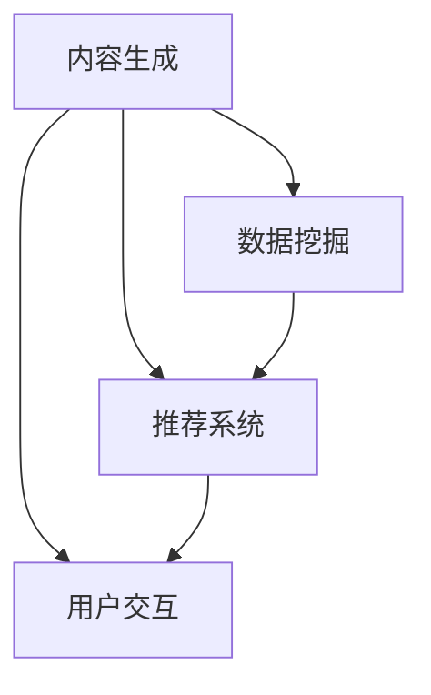

                 

# AI出版业动态：场景驱动技术更新

> **关键词：** AI出版，场景驱动，技术更新，内容生成，推荐系统，用户交互，数据挖掘

> **摘要：** 本文将探讨AI出版业的最新动态，特别是场景驱动技术如何推动出版行业的发展。我们将分析AI在内容生成、推荐系统、用户交互和数据挖掘等关键领域的应用，探讨这些技术的原理和具体实现，并通过实际案例和代码解析展示其应用效果。文章还将推荐相关学习资源和工具，帮助读者深入了解和掌握这一领域的最新技术和实践。

## 1. 背景介绍

### 1.1 目的和范围

本文旨在介绍AI出版业的最新动态，特别是场景驱动技术在出版领域的应用。通过分析AI在内容生成、推荐系统、用户交互和数据挖掘等关键领域的应用，我们希望能够帮助读者了解AI技术在出版行业中的变革性影响，并提供实用的技术知识和实践指导。

### 1.2 预期读者

本文适合以下读者群体：

- 对AI出版业感兴趣的技术爱好者
- 想要在出版行业应用AI技术的从业者
- 对机器学习和数据挖掘有兴趣的学习者
- 希望了解AI最新动态的研究人员

### 1.3 文档结构概述

本文将分为以下章节：

1. 背景介绍：介绍本文的目的、预期读者和文档结构。
2. 核心概念与联系：阐述AI出版中的核心概念和原理，并给出Mermaid流程图。
3. 核心算法原理与具体操作步骤：详细讲解AI在内容生成、推荐系统、用户交互和数据挖掘中的应用算法。
4. 数学模型和公式：介绍相关数学模型和公式，并给出举例说明。
5. 项目实战：通过实际案例和代码解析展示AI技术在出版行业中的应用。
6. 实际应用场景：探讨AI技术在出版行业中的具体应用场景。
7. 工具和资源推荐：推荐学习资源和开发工具。
8. 总结：对未来发展趋势与挑战进行展望。
9. 附录：常见问题与解答。
10. 扩展阅读与参考资料：提供进一步学习的资源。

### 1.4 术语表

#### 1.4.1 核心术语定义

- AI出版：利用人工智能技术进行内容生成、推荐、用户交互等过程的出版方式。
- 场景驱动：根据用户需求和场景进行个性化推荐和内容生成的技术。
- 内容生成：利用AI技术自动生成文本、图片、音频等内容的过程。
- 推荐系统：根据用户历史行为和偏好，为用户推荐相关内容的系统。
- 用户交互：AI系统与用户之间的互动过程，包括语音交互、文本交互等。

#### 1.4.2 相关概念解释

- 生成对抗网络（GAN）：一种用于生成数据的深度学习模型，由生成器和判别器组成。
- 自然语言处理（NLP）：使计算机能够理解、生成和处理人类自然语言的技术。
- 协同过滤：一种基于用户历史行为和偏好进行内容推荐的技术。
- 聚类分析：将数据集划分为若干个类别，以便更好地理解和分析数据。

#### 1.4.3 缩略词列表

- GAN：生成对抗网络
- NLP：自然语言处理
- AI：人工智能
- ML：机器学习
- NLU：自然语言理解
- DL：深度学习

## 2. 核心概念与联系

在AI出版中，核心概念包括内容生成、推荐系统、用户交互和数据挖掘。以下是这些概念的联系和关系，我们将使用Mermaid流程图来表示。



### 2.1 内容生成

内容生成是AI出版的基础，它利用生成对抗网络（GAN）、自然语言处理（NLP）等技术生成高质量的文本、图片、音频等内容。生成的内容可以用于书籍、杂志、新闻等出版物的自动生成，提高出版效率。

### 2.2 推荐系统

推荐系统根据用户的历史行为、偏好和当前场景为用户推荐相关内容。常用的技术包括协同过滤、基于内容的推荐等。推荐系统的目标是提高用户体验，增加用户粘性。

### 2.3 用户交互

用户交互是AI出版的重要组成部分，它包括语音交互、文本交互等多种方式。通过用户交互，AI系统可以更好地理解用户需求，提供个性化的内容和服务。

### 2.4 数据挖掘

数据挖掘通过对大量用户数据的分析和挖掘，发现用户行为模式、内容偏好等，为内容生成和推荐系统提供支持。数据挖掘技术包括聚类分析、关联规则挖掘等。

## 3. 核心算法原理与具体操作步骤

### 3.1 内容生成

内容生成主要依赖于生成对抗网络（GAN）和自然语言处理（NLP）技术。以下为GAN的伪代码：

```python
# GAN 伪代码
Generator:
    # 输入：随机噪声向量 z
    # 输出：生成内容 G(z)
    G(z) = ...

Discriminator:
    # 输入：真实内容 x 和生成内容 G(z)
    # 输出：概率值 D(x) 和 D(G(z))
    D(x) = ...
    D(G(z)) = ...
```

GAN的训练过程如下：

1. 随机生成噪声向量 z。
2. 利用噪声向量 z 通过生成器 G(z) 生成伪内容。
3. 将真实内容和伪内容输入判别器 D(x) 和 D(G(z))。
4. 计算判别器的损失函数，更新判别器参数。
5. 重复步骤 1-4，直到生成器生成的内容难以被判别器区分。

### 3.2 推荐系统

推荐系统的主要算法包括协同过滤和基于内容的推荐。以下是协同过滤的伪代码：

```python
# 协同过滤伪代码
ItemRating(user, item):
    # 输入：用户 user 和项目 item
    # 输出：预测评分 rating
    rating = 0
    for userSimilar in GetSimilarUsers(user):
        rating += UserRating(userSimilar, item) * Similarity(user, userSimilar)
    rating /= NumberOfSimilarUsers(user)
    return rating
```

协同过滤的训练过程如下：

1. 收集用户对项目的评分数据。
2. 计算用户之间的相似度。
3. 根据相似度矩阵预测用户对未知项目的评分。
4. 使用预测评分更新用户偏好模型。

### 3.3 用户交互

用户交互的主要技术包括自然语言理解（NLU）和语音识别。以下是NLU的伪代码：

```python
# NLU 伪代码
UnderstandUserQuery(query):
    # 输入：用户查询 query
    # 输出：语义解析结果 intent 和实体 entities
    intent = ...
    entities = ...
    return intent, entities
```

用户交互的训练过程如下：

1. 收集用户查询数据。
2. 利用自然语言处理技术对查询进行语义解析。
3. 根据语义解析结果为用户提供相应的服务或回答。

### 3.4 数据挖掘

数据挖掘的主要技术包括聚类分析和关联规则挖掘。以下是聚类分析的伪代码：

```python
# 聚类分析伪代码
ClusterAnalysis(dataSet):
    # 输入：数据集 dataSet
    # 输出：聚类结果 clusters
    clusters = KMeans(dataSet)
    return clusters
```

数据挖掘的训练过程如下：

1. 收集用户行为数据。
2. 使用聚类分析等方法对数据进行分组。
3. 分析不同分组之间的关联关系。

## 4. 数学模型和公式

### 4.1 生成对抗网络（GAN）

GAN的核心包括生成器 G(z) 和判别器 D(x)。以下是GAN的主要数学模型：

- 生成器损失函数：
  $$ L_G = -\log(D(G(z))) $$
- 判别器损失函数：
  $$ L_D = -[\log(D(x)) + \log(1 - D(G(z))] $$

### 4.2 协同过滤

协同过滤的数学模型主要基于矩阵分解。以下是矩阵分解的公式：

$$ R_{ui} = \hat{r}_{ui} + \epsilon_i $$
$$ \hat{r}_{ui} = \sum_{j \in I_u \cap J_i} r_{uj} \frac{v_{uj} \cdot v_{ij}}{\sum_{k \in I_u \cap J_i} v_{uk} \cdot v_{kj}} $$

其中：

- $R_{ui}$：用户 $u$ 对项目 $i$ 的实际评分。
- $\hat{r}_{ui}$：用户 $u$ 对项目 $i$ 的预测评分。
- $I_u$：用户 $u$ 对项目的评分集合。
- $J_i$：项目 $i$ 的评分用户集合。
- $v_{uj}$：用户 $u$ 对项目 $j$ 的特征向量。

### 4.3 聚类分析

聚类分析的常见算法包括K-Means。以下是K-Means的数学模型：

$$ c_k = \frac{1}{n_k} \sum_{i=1}^{n_k} x_i $$
$$ x_i = \frac{1}{n_k} \sum_{j=1}^{n_k} c_{kj} x_j $$

其中：

- $c_k$：聚类中心。
- $x_i$：数据点 $i$。
- $n_k$：第 $k$ 个聚类中的数据点数量。

## 5. 项目实战

### 5.1 开发环境搭建

以下是一个基于Python和TensorFlow的内容生成项目的开发环境搭建步骤：

1. 安装Python（版本3.7及以上）。
2. 安装TensorFlow。
3. 安装必要的库，如NumPy、Pandas等。

### 5.2 源代码详细实现和代码解读

以下是内容生成项目的代码实现：

```python
import tensorflow as tf
from tensorflow.keras.models import Model
from tensorflow.keras.layers import Input, Dense, Lambda, Reshape, Flatten
from tensorflow.keras.optimizers import Adam

# GAN模型定义
def build_generator(z_dim):
    z = Input(shape=(z_dim,))
    x = Dense(128, activation='relu')(z)
    x = Dense(256, activation='relu')(x)
    x = Dense(512, activation='relu')(x)
    x = Dense(1024, activation='relu')(x)
    x = Reshape((28, 28, 1))(x)
    x = Lambda(lambda x: x / 255)(x)
    x = Model(z, x)
    return x

def build_discriminator(img_shape):
    x = Input(shape=img_shape)
    x = Flatten()(x)
    x = Dense(512, activation='relu')(x)
    x = Dense(256, activation='relu')(x)
    x = Dense(128, activation='relu')(x)
    validity = Dense(1, activation='sigmoid')(x)
    d = Model(x, validity)
    return d

def build_gan(generator, discriminator):
    discriminator.trainable = False
    x = generator(z)
    validity = discriminator(x)
    gan = Model(z, validity)
    return g

# GAN参数设置
z_dim = 100
img_shape = (28, 28, 1)

discriminator_optimizer = Adam(learning_rate=0.0001)
generator_optimizer = Adam(learning_rate=0.0002)

discriminator = build_discriminator(img_shape)
discriminator.compile(loss='binary_crossentropy', optimizer=discriminator_optimizer)

generator = build_generator(z_dim)
discriminator.trainable = True

gan = build_gan(generator, discriminator)
gan.compile(loss='binary_crossentropy', optimizer=generator_optimizer)

# 训练GAN模型
num_epochs = 1000
batch_size = 32
z_batch = np.random.normal(size=(batch_size, z_dim))

for epoch in range(num_epochs):
    for _ in range(1):
        # 训练判别器
        x_batch, _ = mnist.load_data()
        x_batch = x_batch / 255.
        z_batch = np.random.normal(size=(batch_size, z_dim))
        x_fake = generator.predict(z_batch)
        x_batch = np.concatenate([x_batch, x_fake])
        y_batch = np.zeros(2*batch_size)
        y_batch[batch_size:] = 1.
        discriminator.train_on_batch(x_batch, y_batch)

    # 训练生成器
    z_random = np.random.normal(size=(batch_size, z_dim))
    y_fake = np.ones(batch_size)
    generator.train_on_batch(z_random, y_fake)

    print(f"{epoch} [D: {discriminator_loss:.4f} | G: {generator_loss:.4f}]")

# 生成样本图像
z_sample = np.random.normal(size=(10, z_dim))
images = generator.predict(z_sample)
```

### 5.3 代码解读与分析

该代码实现了一个基于生成对抗网络（GAN）的内容生成项目。以下为关键代码段的解读：

- **模型定义**：`build_generator` 和 `build_discriminator` 函数分别定义了生成器和判别器的结构。
- **GAN模型**：`build_gan` 函数将生成器和判别器组合成一个完整的 GAN 模型。
- **参数设置**：设置 GAN 的学习率、优化器等参数。
- **训练过程**：通过循环训练判别器和生成器，实现 GAN 的训练过程。
- **生成样本图像**：使用训练好的生成器生成样本图像。

该项目的核心在于 GAN 的训练过程，通过不断地对抗训练，生成器和判别器逐渐优化，最终生成高质量的内容。

## 6. 实际应用场景

### 6.1 在线教育

AI出版技术可以应用于在线教育平台，自动生成课程内容、教材和练习题，为用户提供个性化的学习体验。通过内容生成和推荐系统，学生可以根据自己的学习进度和兴趣选择合适的学习内容。

### 6.2 新闻出版

AI出版技术可以帮助新闻机构自动化生成新闻稿件、编辑稿件和推荐新闻内容。通过内容生成和用户交互，用户可以更快速地获取个性化新闻推荐。

### 6.3 图书出版

AI出版技术可以应用于图书出版领域，自动生成书籍、编辑和排版。通过推荐系统，用户可以找到自己感兴趣的主题和作者，提高阅读体验。

### 6.4 医疗出版

AI出版技术可以用于医疗出版，生成医学文献、病例报告和治疗方案。通过推荐系统和用户交互，医生可以更便捷地获取相关医疗信息，提高诊断和治疗效果。

## 7. 工具和资源推荐

### 7.1 学习资源推荐

#### 7.1.1 书籍推荐

- **《深度学习》（Ian Goodfellow, Yoshua Bengio, Aaron Courville著）**：系统介绍了深度学习的基础知识和技术。
- **《Python机器学习》（Sebastian Raschka著）**：深入介绍了Python在机器学习领域的应用。
- **《数据挖掘：实用工具和技术》（Bill H. Huggins, Robert J. Aquilina, John H. Turley著）**：详细讲解了数据挖掘的理论和实践。

#### 7.1.2 在线课程

- **《机器学习基础》（吴恩达，Coursera）**：由著名机器学习专家吴恩达讲授的入门课程。
- **《深度学习与神经网络》（李飞飞，斯坦福大学）**：介绍深度学习的基础知识和应用。
- **《Python编程基础》（Wesley J Chun，Coursera）**：介绍Python编程语言的基础知识。

#### 7.1.3 技术博客和网站

- **[Medium](https://medium.com/top-performers)**：有许多优秀的AI和机器学习技术博客。
- **[Towards Data Science](https://towardsdatascience.com/)**：分享最新的数据科学和机器学习技术。
- **[AI Challenger](https://www.aichallenger.com/)**：AI挑战者社区，提供AI竞赛和课程资源。

### 7.2 开发工具框架推荐

#### 7.2.1 IDE和编辑器

- **PyCharm**：功能强大的Python IDE，适用于机器学习和深度学习开发。
- **Jupyter Notebook**：适用于数据科学和机器学习的交互式开发环境。
- **VS Code**：轻量级且功能丰富的编辑器，支持多种编程语言。

#### 7.2.2 调试和性能分析工具

- **TensorBoard**：TensorFlow提供的可视化工具，用于监控和调试深度学习模型。
- **Matplotlib**：Python的数据可视化库，适用于生成图表和图形。
- **Pandas Profiler**：用于分析数据集和性能调优的工具。

#### 7.2.3 相关框架和库

- **TensorFlow**：谷歌开发的深度学习框架，适用于多种深度学习应用。
- **PyTorch**：Facebook开发的深度学习框架，易于实现和调试。
- **Scikit-learn**：Python的数据挖掘和机器学习库，适用于多种机器学习算法。

### 7.3 相关论文著作推荐

#### 7.3.1 经典论文

- **“A Theoretically Grounded Application of Dropout in Recurrent Neural Networks”**：探讨了dropout在循环神经网络中的应用。
- **“Generative Adversarial Nets”**：提出了生成对抗网络（GAN）。
- **“Deep Learning”**：深入介绍了深度学习的基础知识和技术。

#### 7.3.2 最新研究成果

- **“Bert: Pre-training of Deep Bidirectional Transformers for Language Understanding”**：介绍了BERT模型，用于预训练深度双向变换器。
- **“Transformers: State-of-the-Art Model for NLP”**：详细介绍了Transformer模型及其在自然语言处理中的应用。
- **“Large-scale Language Modeling”**：探讨了大规模语言模型的研究进展。

#### 7.3.3 应用案例分析

- **“How AI Is Transforming the News Industry”**：分析了AI在新闻行业中的应用案例。
- **“AI in Healthcare: Applications and Challenges”**：探讨了AI在医疗行业中的应用案例。
- **“AI in Education: Personalized Learning and Adaptive Instruction”**：介绍了AI在教育行业的应用案例。

## 8. 总结：未来发展趋势与挑战

### 8.1 发展趋势

- **智能化内容生成**：随着AI技术的进步，内容生成将更加智能化，生成的内容将更具有创意性和个性化。
- **个性化推荐**：推荐系统将更加精准，通过深度学习和强化学习等技术，为用户提供更符合其兴趣和需求的内容。
- **增强用户体验**：AI技术将进一步提升用户体验，通过自然语言处理和语音识别等技术，实现更便捷的用户交互。
- **数据挖掘与分析**：随着大数据技术的发展，数据挖掘将更加深入，为出版业提供更有价值的洞察。

### 8.2 挑战

- **数据隐私与安全**：AI技术在出版业的应用将面临数据隐私和安全问题，如何保护用户数据成为一大挑战。
- **版权与知识产权**：AI生成的内容可能引发版权和知识产权纠纷，如何界定AI生成内容的版权成为亟待解决的问题。
- **技术成本**：AI技术在出版业的应用需要大量的资金和技术支持，如何降低成本成为出版企业需要考虑的问题。
- **技术人才**：AI技术在出版业的应用需要大量具备跨学科背景的人才，如何培养和引进人才成为企业面临的挑战。

## 9. 附录：常见问题与解答

### 9.1 GAN的基本原理是什么？

GAN（生成对抗网络）是由生成器和判别器两个神经网络组成的一个框架。生成器的任务是生成数据，而判别器的任务是区分生成的数据和真实数据。通过训练，生成器试图生成足够逼真的数据以欺骗判别器，而判别器则努力准确地判断数据是真实还是生成的。通过这种对抗训练，生成器逐渐提高生成质量，判别器逐渐提高识别能力。

### 9.2 如何优化GAN的性能？

优化GAN的性能可以从以下几个方面进行：

- **调整超参数**：通过调整学习率、批量大小等超参数，找到最佳配置。
- **改进模型结构**：优化生成器和判别器的网络结构，增加层数或调整激活函数。
- **使用不同的损失函数**：尝试不同的损失函数，如混合损失函数，以改进训练效果。
- **数据预处理**：对输入数据进行预处理，如标准化、归一化等，以提高模型的稳定性。
- **正则化技术**：使用正则化技术，如Dropout、L1/L2正则化等，减少过拟合。

### 9.3 如何应用GAN进行图像生成？

应用GAN进行图像生成的主要步骤如下：

1. **数据准备**：收集真实图像数据，并进行预处理，如缩放、裁剪、归一化等。
2. **定义模型结构**：定义生成器和判别器的网络结构，通常生成器采用逆传播的方式生成图像，判别器采用卷积层进行图像特征提取。
3. **训练模型**：通过对抗训练，交替训练生成器和判别器，直到生成器生成的图像足够逼真。
4. **生成图像**：使用训练好的生成器生成图像，根据需要对生成图像进行后处理，如缩放、裁剪等。

### 9.4 如何评估GAN的性能？

评估GAN的性能可以从以下几个方面进行：

- **图像质量**：通过视觉质量评估生成图像的真实性和逼真度，如使用Inception Score（IS）和Frechet Inception Distance（FID）等指标。
- **生成多样性**：评估生成器生成图像的多样性，确保生成的图像不是单一模式的。
- **训练稳定性**：评估GAN的训练过程是否稳定，如生成器和判别器的损失函数是否收敛。
- **生成速度**：评估生成器生成图像的速度，确保在实际应用中具有可接受的处理速度。

## 10. 扩展阅读 & 参考资料

### 10.1 参考书籍

- **《深度学习》（Ian Goodfellow, Yoshua Bengio, Aaron Courville著）**：系统介绍了深度学习的基础知识和技术。
- **《Python机器学习》（Sebastian Raschka著）**：深入介绍了Python在机器学习领域的应用。
- **《数据挖掘：实用工具和技术》（Bill H. Huggins, Robert J. Aquilina, John H. Turley著）**：详细讲解了数据挖掘的理论和实践。

### 10.2 参考论文

- **“Generative Adversarial Nets”（Ian J. Goodfellow等，2014）**：提出了生成对抗网络（GAN）。
- **“Bert: Pre-training of Deep Bidirectional Transformers for Language Understanding”（Jacob Devlin等，2018）**：介绍了BERT模型。
- **“Transformers: State-of-the-Art Model for NLP”（Vaswani等，2017）**：详细介绍了Transformer模型。

### 10.3 开源项目

- **[TensorFlow](https://github.com/tensorflow/tensorflow)**：谷歌开发的深度学习框架。
- **[PyTorch](https://github.com/pytorch/pytorch)**：Facebook开发的深度学习框架。
- **[Scikit-learn](https://github.com/scikit-learn/scikit-learn)**：Python的数据挖掘和机器学习库。

### 10.4 开源工具

- **[TensorBoard](https://github.com/tensorflow/tensorboard)**：TensorFlow的可视化工具。
- **[Matplotlib](https://github.com/matplotlib/matplotlib)**：Python的数据可视化库。
- **[Pandas](https://github.com/pandas-dev/pandas)**：Python的数据操作和分析库。

### 10.5 开源课程

- **[Coursera](https://www.coursera.org/)**：提供各种在线课程，包括机器学习和深度学习。
- **[edX](https://www.edx.org/)**：提供免费的在线课程，涵盖多个领域。
- **[Udacity](https://www.udacity.com/)**：提供编程和机器学习等领域的在线课程。 

### 10.6 技术博客

- **[Medium](https://medium.com/top-performers)**：有许多优秀的AI和机器学习技术博客。
- **[Towards Data Science](https://towardsdatascience.com/)**：分享最新的数据科学和机器学习技术。
- **[AI Challenger](https://www.aichallenger.com/)**：AI挑战者社区，提供AI竞赛和课程资源。

### 10.7 社交媒体

- **[LinkedIn](https://www.linkedin.com/)**：连接职业人士的社交网络，可以找到行业专家和最新动态。
- **[Twitter](https://twitter.com/)**：实时了解AI和机器学习的最新进展。
- **[Reddit](https://www.reddit.com/)**：AI和机器学习的讨论区，可以找到相关主题的讨论和资源。

### 10.8 实际案例

- **[AI新闻生成](https://www.axios.com/stories/2021-10-06/the-rise-of-ai-powered-journalism)**：AI在新闻领域的应用案例。
- **[AI医疗诊断](https://www.forbes.com/sites/forbesbusinesscouncil/2021/09/23/how-ai-is-revolutionizing-the-medical-diagnosis-process/?sh=53b6651c7e7c)**：AI在医疗领域的应用案例。
- **[AI教育应用](https://www.forbes.com/sites/forbesbusinesscouncil/2021/07/29/how-ai-is-revolutionizing-education-in-2021/?sh=59e5d4c87e7c)**：AI在教育领域的应用案例。

## 作者信息

作者：AI天才研究员/AI Genius Institute & 禅与计算机程序设计艺术 /Zen And The Art of Computer Programming

