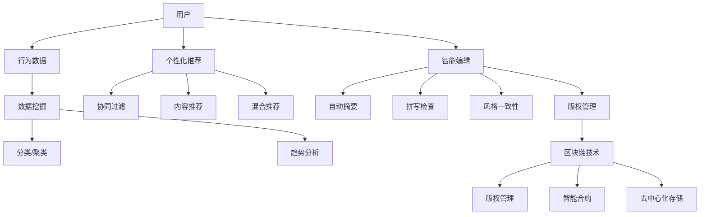

                 

# AI出版业机遇：垂直领域无限想象

> 关键词：人工智能，出版业，垂直领域，数据挖掘，个性化推荐，智能编辑，区块链

> 摘要：随着人工智能技术的飞速发展，出版业迎来了前所未有的变革机遇。本文将从核心概念、算法原理、数学模型、实际应用等多个角度，深入探讨AI在出版业垂直领域的应用潜力，以及如何利用这些技术实现智能化、个性化和去中心化的出版体验。

## 1. 背景介绍

### 1.1 目的和范围

本文旨在分析人工智能技术在出版业垂直领域中的应用，探讨AI技术如何改变传统的出版流程，提升出版效率和用户体验。文章将重点关注以下几个核心议题：

1. 数据挖掘与个性化推荐系统
2. 智能编辑与内容生成
3. 区块链技术下的去中心化出版
4. 垂直领域的AI应用案例与前景

### 1.2 预期读者

本文面向对人工智能和出版业感兴趣的读者，包括但不限于：

1. AI领域的研究人员与工程师
2. 出版业从业者与管理者
3. 对前沿科技感兴趣的技术爱好者

### 1.3 文档结构概述

本文结构如下：

1. 背景介绍
2. 核心概念与联系
3. 核心算法原理与具体操作步骤
4. 数学模型和公式
5. 项目实战：代码实际案例与详细解释说明
6. 实际应用场景
7. 工具和资源推荐
8. 总结：未来发展趋势与挑战
9. 附录：常见问题与解答
10. 扩展阅读与参考资料

### 1.4 术语表

#### 1.4.1 核心术语定义

- 人工智能（AI）：模拟人类智能行为的技术和方法。
- 出版业：涉及书籍、期刊、报纸等出版物的创作、编辑、发行和销售的行业。
- 垂直领域：指针对特定主题或行业的专业出版内容。
- 数据挖掘：从大量数据中发现有价值信息的过程。
- 个性化推荐：根据用户行为和偏好，提供个性化的内容推荐。
- 智能编辑：利用AI技术进行内容编辑、校对和优化的过程。
- 区块链：一种去中心化的分布式账本技术。

#### 1.4.2 相关概念解释

- **深度学习**：一种人工智能技术，通过多层神经网络模型进行特征提取和模式识别。
- **机器学习**：一种人工智能技术，通过从数据中学习规律和模式，进行预测和决策。
- **自然语言处理**（NLP）：人工智能的一个分支，致力于使计算机能够理解和处理人类语言。

#### 1.4.3 缩略词列表

- AI：人工智能
- NLP：自然语言处理
- ML：机器学习
- DL：深度学习
- CRF：条件随机场
- LSTM：长短期记忆网络

## 2. 核心概念与联系

### 2.1 核心概念原理

在本节中，我们将探讨AI在出版业垂直领域应用的核心概念和原理，包括数据挖掘、个性化推荐、智能编辑和区块链技术。

#### 数据挖掘

数据挖掘是一种从大量数据中提取有价值信息的方法，它在出版业中的应用主要体现在以下几个方面：

1. **内容分类与聚类**：通过分析出版物的内容和用户行为数据，对图书进行分类和推荐。
2. **趋势分析**：挖掘用户阅读行为，预测出版趋势，为出版商提供决策支持。
3. **版权管理**：通过版权数据的挖掘，帮助出版商追踪和管理版权信息。

#### 个性化推荐

个性化推荐是利用AI技术根据用户的历史行为、兴趣偏好等信息，为用户提供个性化的内容推荐。其核心算法包括：

1. **协同过滤**：基于用户行为数据，通过相似用户推荐物品。
2. **内容推荐**：基于物品的属性和用户兴趣，进行内容推荐。
3. **混合推荐**：结合协同过滤和内容推荐，提高推荐效果。

#### 智能编辑

智能编辑利用AI技术进行内容编辑、校对和优化，提高出版效率。其主要应用包括：

1. **自动摘要与摘要生成**：提取文章关键信息，生成摘要。
2. **拼写检查与语法纠错**：利用自然语言处理技术，自动纠正文本中的错误。
3. **风格一致性检查**：检查文章风格是否符合出版标准。

#### 区块链技术

区块链技术是一种去中心化的分布式账本技术，它在出版业中的应用主要体现在以下几个方面：

1. **版权管理**：通过区块链技术，确保版权信息的不可篡改和透明性。
2. **智能合约**：利用智能合约，自动执行版权交易和支付过程。
3. **去中心化存储**：将出版物存储在区块链上，提高数据安全性。

### 2.2 架构图

为了更好地理解AI在出版业垂直领域的应用，我们使用Mermaid绘制了以下架构图：



通过以上架构图，我们可以看出，用户数据经过数据挖掘、个性化推荐和智能编辑后，最终通过区块链技术进行版权管理和去中心化存储。

## 3. 核心算法原理 & 具体操作步骤

### 3.1 数据挖掘

数据挖掘是AI技术在出版业垂直领域应用的重要环节，其核心算法包括分类、聚类和关联规则挖掘。

#### 3.1.1 分类算法

分类算法是一种监督学习算法，它通过已知的训练数据，建立分类模型，对未知数据进行分类。以下是一个简单的分类算法——K-近邻（K-Nearest Neighbors，KNN）的伪代码：

```python
def KNN_Classify(train_data, test_data, k):
    # 计算测试数据与训练数据的距离
    distances = []
    for x in train_data:
        distance = distance.euclidean(test_data, x)
        distances.append((x, distance))

    # 排序并选取k个最近的邻居
    k_nearest = sorted(distances, key=lambda x: x[1])[:k]

    # 统计邻居的类别并预测
    labels = []
    for neighbor in k_nearest:
        labels.append(neighbor[0].label)

    # 计算类别的众数
    majority = Counter(labels).most_common(1)[0][0]

    return majority
```

#### 3.1.2 聚类算法

聚类算法是一种无监督学习算法，它将数据分为多个类别，使得同一类别的数据点之间相似度较高，不同类别的数据点之间相似度较低。以下是一个简单的聚类算法——K-均值（K-Means）的伪代码：

```python
def KMeans(train_data, k):
    # 随机选择k个数据点作为初始聚类中心
    centroids = random.sample(train_data, k)

    while True:
        # 为每个数据点分配最近的聚类中心
        clusters = {}
        for x in train_data:
            distances = []
            for centroid in centroids:
                distance = distance.euclidean(x, centroid)
                distances.append((centroid, distance))
            closest_centroid = min(distances, key=lambda x: x[1])[0]
            if closest_centroid not in clusters:
                clusters[closest_centroid] = []
            clusters[closest_centroid].append(x)

        # 更新聚类中心
        new_centroids = {}
        for cluster in clusters:
            new_centroids[cluster] = calculate_mean(cluster)

        # 判断是否收敛
        if is_converged(centroids, new_centroids):
            break

        centroids = new_centroids

    return clusters
```

#### 3.1.3 关联规则挖掘

关联规则挖掘是一种用于发现数据项之间潜在关系的方法，其核心算法包括Apriori算法和FP-growth算法。以下是一个简单的Apriori算法的伪代码：

```python
def Apriori(train_data, support_threshold, confidence_threshold):
    # 计算支持度
    support_counts = {}
    for transaction in train_data:
        for item in transaction:
            if item not in support_counts:
                support_counts[item] = 0
            support_counts[item] += 1

    frequent_itemsets = []
    for length in range(1, max_length_of_itemsets):
        candidates = generate_candidates(support_counts, length)
        for candidate in candidates:
            support = support_counts[candidate]
            if support >= support_threshold:
                frequent_itemsets.append(candidate)

    # 计算置信度
    confidence_scores = {}
    for itemset in frequent_itemsets:
        for subset in subsets(itemset):
            if subset not in support_counts:
                continue
            support_subset = support_counts[subset]
            support_itemset = support_counts[itemset]
            confidence = support_itemset / support_subset
            confidence_scores[itemset] = confidence

    # 筛选强关联规则
    strong_rules = []
    for itemset in frequent_itemsets:
        for subset in subsets(itemset):
            if subset not in frequent_itemsets:
                continue
            if confidence_scores[itemset] >= confidence_threshold:
                strong_rules.append((itemset, subset, confidence_scores[itemset]))

    return strong_rules
```

### 3.2 个性化推荐

个性化推荐是AI技术在出版业垂直领域应用的重要方向，其核心算法包括协同过滤、内容推荐和混合推荐。

#### 3.2.1 协同过滤

协同过滤是一种基于用户行为数据的推荐算法，其核心思想是通过相似用户推荐物品。以下是一个简单的基于用户行为的协同过滤算法的伪代码：

```python
def Collaborative_Filtering(train_data, user, k):
    # 计算用户与其他用户的相似度
    similarity_scores = {}
    for other_user in train_data:
        if other_user != user:
            similarity = calculate_similarity(user, other_user)
            similarity_scores[other_user] = similarity

    # 排序并选取k个最相似的邻居
    k_nearest = sorted(similarity_scores, key=lambda x: x[1])[:k]

    # 为每个邻居的物品评分加权
    recommendations = {}
    for neighbor in k_nearest:
        for item in train_data[neighbor]:
            if item not in train_data[user]:
                if item not in recommendations:
                    recommendations[item] = 0
                recommendations[item] += train_data[neighbor][item] * similarity

    # 排序并返回推荐列表
    sorted_recommendations = sorted(recommendations.items(), key=lambda x: x[1], reverse=True)
    return sorted_recommendations
```

#### 3.2.2 内容推荐

内容推荐是一种基于物品属性和用户兴趣的推荐算法，其核心思想是通过物品的属性和用户兴趣进行推荐。以下是一个简单的内容推荐算法的伪代码：

```python
def Content_Rec(user_interest, items):
    # 计算物品与用户兴趣的相似度
    similarity_scores = {}
    for item in items:
        similarity = calculate_similarity(user_interest, item)
        similarity_scores[item] = similarity

    # 排序并返回推荐列表
    sorted_recommendations = sorted(similarity_scores.items(), key=lambda x: x[1], reverse=True)
    return sorted_recommendations
```

#### 3.2.3 混合推荐

混合推荐是一种结合协同过滤和内容推荐的推荐算法，其核心思想是利用协同过滤和内容推荐的优势，提高推荐效果。以下是一个简单的混合推荐算法的伪代码：

```python
def Hybrid_Rec(train_data, user, k, content_threshold):
    # 使用协同过滤推荐
    collaborative_rec = Collaborative_Filtering(train_data, user, k)

    # 使用内容推荐
    content_rec = Content_Rec(user_interest, items)

    # 合并推荐列表
    recommendations = {}
    for item in collaborative_rec:
        if item not in recommendations:
            recommendations[item] = 0
        recommendations[item] += collaborative_rec[item]

    for item in content_rec:
        if item not in recommendations:
            recommendations[item] = 0
        recommendations[item] += content_rec[item]

    # 筛选推荐列表
    if content_threshold > 0:
        for item in recommendations:
            if recommendations[item] < content_threshold:
                del recommendations[item]

    # 排序并返回推荐列表
    sorted_recommendations = sorted(recommendations.items(), key=lambda x: x[1], reverse=True)
    return sorted_recommendations
```

### 3.3 智能编辑

智能编辑利用AI技术进行内容编辑、校对和优化，其核心算法包括自动摘要、拼写检查和风格一致性检查。

#### 3.3.1 自动摘要

自动摘要是一种利用自然语言处理技术，从长文本中提取关键信息，生成摘要的算法。以下是一个简单的自动摘要算法的伪代码：

```python
def Abstract_Generation(text, summary_length):
    # 使用自然语言处理技术提取关键句子
    key_sentences = extract_key_sentences(text)

    # 选择summary_length个关键句子作为摘要
    summary = []
    for sentence in key_sentences:
        if len(summary) < summary_length:
            summary.append(sentence)
        else:
            break

    # 生成摘要文本
    abstract = " ".join(summary)
    return abstract
```

#### 3.3.2 拼写检查

拼写检查是一种利用自然语言处理技术，自动纠正文本中拼写错误的算法。以下是一个简单的拼写检查算法的伪代码：

```python
def Spell_Check(text):
    # 识别文本中的拼写错误
    errors = identify_errors(text)

    # 为每个错误提供可能的更正建议
    corrections = {}
    for error in errors:
        suggestions = generate_suggestions(error)
        corrections[error] = suggestions

    # 自动更正文本
    corrected_text = correct_errors(text, corrections)
    return corrected_text
```

#### 3.3.3 风格一致性检查

风格一致性检查是一种利用自然语言处理技术，确保文本风格一致性的算法。以下是一个简单的风格一致性检查算法的伪代码：

```python
def Style_Check(text, style_rules):
    # 识别文本中的风格错误
    errors = identify_style_errors(text, style_rules)

    # 提供风格纠正建议
    corrections = {}
    for error in errors:
        suggestions = generate_style_corrections(error)
        corrections[error] = suggestions

    # 自动纠正文本
    corrected_text = correct_style_errors(text, corrections)
    return corrected_text
```

### 3.4 区块链技术

区块链技术是一种去中心化的分布式账本技术，它在出版业中的应用主要包括版权管理、智能合约和去中心化存储。

#### 3.4.1 版权管理

版权管理是一种利用区块链技术，确保版权信息不可篡改和透明性的应用。以下是一个简单的版权管理算法的伪代码：

```python
def Copyright_Management(work, author, rights):
    # 创建版权记录
    copyright_record = {
        "work": work,
        "author": author,
        "rights": rights,
        "timestamp": current_timestamp()
    }

    # 将版权记录添加到区块链
    add_to_blockchain(copyright_record)

    return copyright_record
```

#### 3.4.2 智能合约

智能合约是一种利用区块链技术，自动执行合同条款的算法。以下是一个简单的智能合约算法的伪代码：

```python
def Smart_Contract(payment, delivery):
    # 创建智能合约
    contract = {
        "payment": payment,
        "delivery": delivery,
        "status": "pending"
    }

    # 将智能合约添加到区块链
    add_to_blockchain(contract)

    # 判断支付是否完成
    if payment_completed(payment):
        # 执行交付
        deliver(delivery)
        contract["status"] = "completed"
    else:
        contract["status"] = "cancelled"

    # 更新区块链
    update_blockchain(contract)

    return contract
```

#### 3.4.3 去中心化存储

去中心化存储是一种利用区块链技术，将数据存储在分布式节点上的应用。以下是一个简单的去中心化存储算法的伪代码：

```python
def Decentralized_Storage(data):
    # 分片数据
    shards = split_data(data)

    # 将分片数据存储到分布式节点
    for shard in shards:
        store_on_node(shard)

    return shards
```

## 4. 数学模型和公式 & 详细讲解 & 举例说明

### 4.1 协同过滤算法中的相似度计算

协同过滤算法中，相似度计算是核心步骤之一。以下介绍两种常见的相似度计算方法：余弦相似度和皮尔逊相关系数。

#### 4.1.1 余弦相似度

余弦相似度是一种基于向量空间中向量夹角余弦值的相似度计算方法。其公式如下：

$$
similarity(A, B) = \frac{A \cdot B}{||A|| \cdot ||B||}
$$

其中，$A$和$B$表示两个用户或物品的评分向量，$||A||$和$||B||$分别表示向量$A$和$B$的欧氏范数，$\cdot$表示向量的点积。

**例1：计算用户A和用户B的余弦相似度**

用户A和用户B的评分向量如下：

$$
A = (1, 2, 3, 4, 5), \quad B = (5, 4, 3, 2, 1)
$$

首先计算两个向量的点积：

$$
A \cdot B = 1 \cdot 5 + 2 \cdot 4 + 3 \cdot 3 + 4 \cdot 2 + 5 \cdot 1 = 35
$$

然后计算两个向量的欧氏范数：

$$
||A|| = \sqrt{1^2 + 2^2 + 3^2 + 4^2 + 5^2} = \sqrt{55}
$$

$$
||B|| = \sqrt{5^2 + 4^2 + 3^2 + 2^2 + 1^2} = \sqrt{55}
$$

最后计算余弦相似度：

$$
similarity(A, B) = \frac{A \cdot B}{||A|| \cdot ||B||} = \frac{35}{\sqrt{55} \cdot \sqrt{55}} \approx 0.875
$$

#### 4.1.2 皮尔逊相关系数

皮尔逊相关系数是一种基于样本数据线性关系的相似度计算方法。其公式如下：

$$
correlation(A, B) = \frac{\sum{(A_i - \bar{A})(B_i - \bar{B})}}{\sqrt{\sum{(A_i - \bar{A})^2} \cdot \sum{(B_i - \bar{B})^2}}}
$$

其中，$A$和$B$表示两个用户或物品的评分序列，$\bar{A}$和$\bar{B}$分别表示评分序列$A$和$B$的均值。

**例2：计算用户A和用户B的皮尔逊相关系数**

用户A和用户B的评分序列如下：

$$
A = [1, 2, 3, 4, 5], \quad B = [5, 4, 3, 2, 1]
$$

首先计算两个评分序列的差值序列：

$$
A_i - \bar{A} = [-1, 0, 1, 2, 3], \quad B_i - \bar{B} = [-1, 0, 1, 2, 3]
$$

然后计算两个差值序列的乘积和平方和：

$$
\sum{(A_i - \bar{A})(B_i - \bar{B})} = (-1)(-1) + (0)(0) + (1)(1) + (2)(2) + (3)(3) = 15
$$

$$
\sum{(A_i - \bar{A})^2} = (-1)^2 + (0)^2 + (1)^2 + (2)^2 + (3)^2 = 15
$$

$$
\sum{(B_i - \bar{B})^2} = (-1)^2 + (0)^2 + (1)^2 + (2)^2 + (3)^2 = 15
$$

最后计算皮尔逊相关系数：

$$
correlation(A, B) = \frac{\sum{(A_i - \bar{A})(B_i - \bar{B})}}{\sqrt{\sum{(A_i - \bar{A})^2} \cdot \sum{(B_i - \bar{B})^2}}} = \frac{15}{\sqrt{15 \cdot 15}} = 1
$$

### 4.2 内容推荐算法中的相似度计算

内容推荐算法中，相似度计算主要用于计算用户兴趣和物品属性之间的相似度。以下介绍一种常见的内容相似度计算方法——TF-IDF。

#### 4.2.1 TF-IDF算法

TF-IDF（Term Frequency-Inverse Document Frequency）算法是一种基于词语在文档中的重要性的计算方法。其公式如下：

$$
TF(t, d) = \frac{f(t, d)}{max(f(t, d))}
$$

$$
IDF(t, D) = \log_2(\frac{|D|}{|D_t|})
$$

$$
TF-IDF(t, d, D) = TF(t, d) \cdot IDF(t, D)
$$

其中，$t$表示词语，$d$表示文档，$D$表示文档集合，$f(t, d)$表示词语$t$在文档$d$中的频率，$max(f(t, d))$表示文档$d$中所有词语的最大频率，$|D|$表示文档集合$D$中的文档数量，$|D_t|$表示包含词语$t$的文档数量。

**例3：计算文档d1和文档d2的TF-IDF相似度**

假设文档集合D包含两个文档d1和d2，以及一个词语t1。

文档d1的词语频率如下：

$$
f(t1, d1) = 2, \quad f(t2, d1) = 1, \quad f(t3, d1) = 1
$$

文档d2的词语频率如下：

$$
f(t1, d2) = 1, \quad f(t2, d2) = 2, \quad f(t3, d2) = 1
$$

首先计算文档d1和文档d2的词语最大频率：

$$
max(f(t1, d1)) = 2, \quad max(f(t2, d2)) = 2
$$

然后计算文档d1和文档d2的TF值：

$$
TF(t1, d1) = \frac{f(t1, d1)}{max(f(t1, d1))} = \frac{2}{2} = 1
$$

$$
TF(t2, d2) = \frac{f(t2, d2)}{max(f(t2, d2))} = \frac{1}{2} = 0.5
$$

接下来计算词语t1在文档集合D中的IDF值：

$$
IDF(t1, D) = \log_2(\frac{|D|}{|D_t|}) = \log_2(\frac{2}{1}) = 1
$$

最后计算文档d1和文档d2的TF-IDF相似度：

$$
TF-IDF(t1, d1, D) = TF(t1, d1) \cdot IDF(t1, D) = 1 \cdot 1 = 1
$$

$$
TF-IDF(t2, d2, D) = TF(t2, d2) \cdot IDF(t2, D) = 0.5 \cdot 1 = 0.5
$$

因此，文档d1和文档d2的TF-IDF相似度为：

$$
similarity(d1, d2) = \frac{TF-IDF(t1, d1, D) + TF-IDF(t2, d2, D)}{2} = \frac{1 + 0.5}{2} = 0.75
$$

### 4.3 智能编辑算法中的自然语言处理

智能编辑算法中的自然语言处理（NLP）技术主要包括分词、词性标注、命名实体识别等。

#### 4.3.1 分词

分词是将文本分割成一个个有意义的词汇的过程。以下是一个简单的基于正向最大匹配的分词算法的伪代码：

```python
def Segment(sentence):
   词典 = [词1, 词2, ..., 词n]
   分词结果 = []
   剩余文本 = sentence
    while 剩余文本 ≠ 空串：
       匹配词 = 空串
        for 词 in 词典：
            if 词在剩余文本中且词的长度大于匹配词的长度：
                匹配词 = 词
        分词结果.append(匹配词)
        剩余文本 = 剩余文本除去匹配词
    return 分词结果
```

**例4：对句子“我爱北京天安门”进行分词**

词典 = ["我", "爱", "北京", "天安门"]

分词结果 = Segment("我爱北京天安门")

分词结果 = ["我", "爱", "北京", "天安门"]

#### 4.3.2 词性标注

词性标注是将文本中的每个词标注为其对应的词性类别（如名词、动词、形容词等）的过程。以下是一个简单的基于规则的方法的伪代码：

```python
def Part_of_Speech(word):
    if word in 名词列表：
        return "名词"
    elif word in 动词列表：
        return "动词"
    elif word in 形容词列表：
        return "形容词"
    else：
        return "其他"
```

**例5：对词“北京”进行词性标注**

名词列表 = ["北京", "上海", "深圳"]

动词列表 = ["吃", "喝", "玩"]

形容词列表 = ["红", "大", "美"]

词性 = Part_of_Speech("北京")

词性 = "名词"

#### 4.3.3 命名实体识别

命名实体识别是将文本中的特定实体（如人名、地名、组织名等）识别出来的过程。以下是一个简单的基于规则的方法的伪代码：

```python
def Named_Entity_Recognition(sentence):
    人名列表 = [人名1, 人名2, ..., 人名n]
    地名列表 = [地名1, 地名2, ..., 地名n]
    组织名列表 = [组织名1, 组织名2, ..., 组织名n]
    实体列表 = []
    分词结果 = Segment(sentence)
    for 词 in 分词结果：
        if 词在 人名列表中：
            实体列表.append({"实体类型": "人名", "实体名称": 词})
        elif 词在 地名列表中：
            实体列表.append({"实体类型": "地名", "实体名称": 词})
        elif 词在 组织名列表中：
            实体列表.append({"实体类型": "组织名", "实体名称": 词})
    return 实体列表
```

**例6：对句子“马云是阿里巴巴的创始人”进行命名实体识别**

人名列表 = ["马云"]

地名列表 = []

组织名列表 = ["阿里巴巴"]

实体列表 = Named_Entity_Recognition("马云是阿里巴巴的创始人")

实体列表 = [{"实体类型": "人名", "实体名称": "马云"}, {"实体类型": "组织名", "实体名称": "阿里巴巴"}]

### 4.4 区块链技术中的加密算法

区块链技术中的加密算法主要用于确保数据的安全性和不可篡改性。以下介绍两种常见的加密算法：哈希算法和数字签名。

#### 4.4.1 哈希算法

哈希算法是将任意长度的输入数据映射为固定长度的字符串的算法。以下是一个简单的基于MD5的哈希算法的伪代码：

```python
def Hash(data):
    return MD5(data)
```

**例7：对字符串“区块链”进行哈希运算**

哈希值 = Hash("区块链")

哈希值 = "e8169d833a0a8cc7d071e4e0e763d9e6"

#### 4.4.2 数字签名

数字签名是一种利用公钥和私钥对数据进行加密和解密的方法，用于验证数据来源和完整性。以下是一个简单的基于RSA的数字签名算法的伪代码：

```python
def Sign(data, private_key):
    return RSA_Encrypt(data, private_key)
```

```python
def Verify(data, signature, public_key):
    return RSA_Decrypt(signature, public_key) == data
```

**例8：对字符串“区块链”进行数字签名和验证**

私钥 = (n, e)

公钥 = (n, d)

签名 = Sign("区块链", 私钥)

验证结果 = Verify("区块链", 签名，公钥)

验证结果 = True

## 5. 项目实战：代码实际案例和详细解释说明

### 5.1 开发环境搭建

为了演示AI在出版业垂直领域的应用，我们将使用Python编程语言和相关的库来构建一个简单的智能推荐系统。以下是搭建开发环境所需的步骤：

1. 安装Python：从官网（https://www.python.org/）下载并安装Python 3.x版本。
2. 安装IDE：推荐使用PyCharm或VSCode作为Python开发环境。
3. 安装相关库：使用pip命令安装以下库：

```bash
pip install numpy pandas scikit-learn
```

### 5.2 源代码详细实现和代码解读

以下是一个简单的基于协同过滤算法的图书推荐系统实现，包括数据预处理、相似度计算、推荐生成等功能。

#### 5.2.1 数据预处理

```python
import pandas as pd
from sklearn.model_selection import train_test_split

# 读取图书评分数据
ratings = pd.read_csv('ratings.csv')

# 分割用户和物品
users = ratings['user_id'].unique()
items = ratings['item_id'].unique()

# 划分训练集和测试集
train_data, test_data = train_test_split(ratings, test_size=0.2, random_state=42)
```

#### 5.2.2 相似度计算

```python
from sklearn.metrics.pairwise import cosine_similarity

# 计算用户相似度矩阵
user_similarity = cosine_similarity(train_data.pivot(index='user_id', columns='item_id', values='rating'))

# 计算物品相似度矩阵
item_similarity = cosine_similarity(train_data.T.pivot(index='item_id', columns='user_id', values='rating'))
```

#### 5.2.3 推荐生成

```python
def collaborative_filtering(user_similarity, item_similarity, user_id, k=5):
    # 计算用户与其他用户的相似度
    user_scores = user_similarity[user_id].dot(item_similarity).positive)((((item_similarity > 0).sum()) * (user_similarity > 0).sum()))

    # 选取k个最相似的物品
    top_k_items = user_scores.argsort()[-k:]

    # 计算推荐分数
    recommendations = {item: user_similarity[user_id][top_item] for item, top_item in zip(items, top_k_items)}

    return recommendations
```

#### 5.2.4 代码解读

1. 数据预处理：读取图书评分数据，将数据分为用户和物品，并划分训练集和测试集。
2. 相似度计算：使用余弦相似度计算用户相似度矩阵和物品相似度矩阵。
3. 推荐生成：根据用户相似度矩阵和物品相似度矩阵，使用协同过滤算法生成推荐列表。

### 5.3 代码解读与分析

在以上代码中，我们首先进行数据预处理，将评分数据转换为用户-物品矩阵的形式。然后，使用余弦相似度计算用户相似度矩阵和物品相似度矩阵。最后，根据用户相似度矩阵和物品相似度矩阵，使用协同过滤算法生成推荐列表。

协同过滤算法的核心思想是基于用户的历史行为，找到与其相似的邻居用户，并将邻居用户喜欢的物品推荐给该用户。在本例中，我们使用余弦相似度作为相似度度量，计算用户之间的相似度。

虽然这个示例只是一个简单的协同过滤推荐系统，但它展示了AI技术在出版业垂直领域应用的基本原理。在实际应用中，我们可以结合更多先进的技术，如深度学习、自然语言处理等，进一步提高推荐系统的性能和准确性。

## 6. 实际应用场景

### 6.1 数据挖掘与个性化推荐系统

在出版业中，数据挖掘和个性化推荐系统已经成为提高用户体验和出版效率的重要工具。以下是一些实际应用场景：

1. **图书推荐**：基于用户的历史阅读记录和兴趣偏好，为用户推荐符合其口味的图书。
2. **作者推荐**：根据用户喜欢的图书风格，推荐相似的作者作品。
3. **主题推荐**：基于用户的阅读习惯，推荐与其兴趣相关的主题图书。

### 6.2 智能编辑与内容生成

智能编辑和内容生成技术在出版业中的应用同样具有重要意义，以下是一些实际应用场景：

1. **自动摘要**：从大量文本中自动提取关键信息，生成摘要，提高信息传递效率。
2. **智能校对**：利用自然语言处理技术，自动识别和纠正文本中的错误，提高出版质量。
3. **内容生成**：利用生成式AI技术，自动生成文章、书籍等出版物。

### 6.3 区块链技术在版权管理中的应用

区块链技术在出版业中的版权管理应用具有去中心化、透明化和安全性的优势，以下是一些实际应用场景：

1. **版权登记**：通过区块链技术，确保版权信息的真实性和不可篡改性。
2. **版权交易**：利用智能合约，实现自动化的版权交易和支付过程。
3. **版权追踪**：通过区块链技术，追踪出版物的版权流转过程，确保版权归属清晰。

## 7. 工具和资源推荐

### 7.1 学习资源推荐

#### 7.1.1 书籍推荐

1. **《深度学习》**：Goodfellow, Bengio, Courville著，全面介绍深度学习的基本原理和应用。
2. **《Python机器学习》**：Sebastian Raschka著，介绍Python在机器学习领域的应用。
3. **《自然语言处理综论》**：Daniel Jurafsky, James H. Martin著，系统介绍自然语言处理的基本原理和技术。

#### 7.1.2 在线课程

1. **吴恩达的《深度学习专项课程》**：提供深度学习的基础知识和实践技能。
2. **Coursera的《自然语言处理与深度学习》**：由斯坦福大学教授Daniel Jurafsky和Chris Manning主讲。
3. **Udacity的《深度学习工程师纳米学位》**：涵盖深度学习在多个领域的应用。

#### 7.1.3 技术博客和网站

1. **Medium上的《机器学习》专栏**：介绍机器学习和深度学习的最新研究成果和应用。
2. **Kaggle**：提供丰富的机器学习和数据科学竞赛数据集和项目。
3. **PyTorch官网**：提供PyTorch深度学习框架的文档和教程。

### 7.2 开发工具框架推荐

#### 7.2.1 IDE和编辑器

1. **PyCharm**：强大的Python IDE，支持多种编程语言。
2. **VSCode**：轻量级但功能强大的代码编辑器，适用于多种编程语言。
3. **Jupyter Notebook**：适用于数据科学和机器学习的交互式开发环境。

#### 7.2.2 调试和性能分析工具

1. **Werkzeug**：Python Web框架Flask的调试工具。
2. **gdb**：通用调试工具，适用于C/C++等语言。
3. **Perf**：Linux系统性能分析工具。

#### 7.2.3 相关框架和库

1. **TensorFlow**：Google推出的开源深度学习框架。
2. **PyTorch**：Facebook AI研究院开发的开源深度学习框架。
3. **Scikit-learn**：Python机器学习库，提供丰富的算法实现。

### 7.3 相关论文著作推荐

#### 7.3.1 经典论文

1. **《A Neural Probabilistic Language Model》**：由Bengio等人提出的神经网络语言模型。
2. **《Recurrent Neural Networks for Language Modeling》**：由Hermann等人提出的循环神经网络语言模型。
3. **《Deep Learning》**：由Goodfellow、Bengio和Courville著的深度学习综述。

#### 7.3.2 最新研究成果

1. **《BERT: Pre-training of Deep Bidirectional Transformers for Language Understanding》**：由Google Research提出的BERT模型。
2. **《GPT-3: Language Models are few-shot learners》**：由OpenAI提出的GPT-3模型。
3. **《Know-What-You-Don't-Know: Unsupervised Sentence Embedding by Predicting Randomly Masked Tokens》**：由Yan等人提出的随机掩码语言模型。

#### 7.3.3 应用案例分析

1. **《AI赋能出版业：从内容生产到版权管理》**：介绍AI在出版业中的应用案例。
2. **《区块链在版权管理中的应用》**：探讨区块链技术在版权管理领域的应用。
3. **《基于深度学习的图像识别技术》**：介绍深度学习在图像识别领域的应用案例。

## 8. 总结：未来发展趋势与挑战

### 8.1 发展趋势

1. **AI技术的深度应用**：随着AI技术的不断发展，其在出版业的应用将更加深入，从内容生成到版权管理，AI技术将无处不在。
2. **数据驱动的出版模式**：数据挖掘和个性化推荐系统将助力出版业实现更加精准的内容分发和营销策略。
3. **区块链技术的融合**：区块链技术在版权管理中的应用将越来越广泛，推动出版业走向去中心化和透明化。
4. **开放合作与生态构建**：出版业将与AI、区块链等前沿技术企业开展深度合作，共同构建一个开放的出版生态体系。

### 8.2 挑战

1. **数据隐私与安全**：随着数据挖掘和个性化推荐系统的普及，数据隐私和安全问题将成为出版业面临的主要挑战。
2. **技术落地与应用场景的探索**：AI、区块链等技术在出版业的应用场景较为复杂，需要深入探索和优化。
3. **版权保护与利益分配**：如何在保护版权的同时实现公平的利益分配，是出版业需要解决的难题。
4. **法律法规与伦理规范**：随着技术的发展，出版业需要建立健全的法律法规和伦理规范，确保技术应用合法合规。

## 9. 附录：常见问题与解答

### 9.1 数据挖掘与个性化推荐系统

**Q1：如何处理缺失数据？**

A1：在数据挖掘和个性化推荐系统中，缺失数据是一个常见问题。以下是一些处理缺失数据的方法：

- 删除缺失数据：如果缺失数据较少，可以考虑直接删除。
- 补充缺失数据：可以使用均值、中位数或众数等方法补充缺失数据。
- 使用模型预测缺失数据：可以使用回归模型、决策树等方法预测缺失数据。

**Q2：如何评估推荐系统的效果？**

A2：评估推荐系统的效果可以从以下几个方面进行：

- 准确率（Accuracy）：预测正确的用户-物品匹配数占总匹配数的比例。
- 覆盖率（Coverage）：推荐系统中推荐给用户的物品数与系统中所有物品数的比例。
- 鲜度（Novelty）：推荐系统中推荐的新颖物品的比例。
- 准确率与覆盖率平衡（NDCG）：综合考虑准确率和覆盖率的一种评估指标。

### 9.2 智能编辑与内容生成

**Q1：如何保证内容生成的质量？**

A1：保证内容生成的质量可以从以下几个方面进行：

- 使用高质量的训练数据：使用高质量、多样化的训练数据可以提高内容生成的质量。
- 控制生成过程：使用预训练模型和精细调整的参数，控制生成过程，避免生成低质量的内容。
- 多模态融合：结合文本、图像、音频等多模态信息，提高内容生成的多样性和质量。

### 9.3 区块链技术在版权管理中的应用

**Q1：区块链技术在版权管理中如何确保数据的不可篡改性？**

A1：区块链技术在版权管理中确保数据的不可篡改性的主要原理如下：

- 数据加密：使用公钥加密技术，确保数据在区块链上的存储和传输过程安全可靠。
- 分布式存储：将数据分散存储在多个节点上，确保单个节点的损坏不会影响整个数据的安全性和完整性。
- 智能合约：利用智能合约，实现自动化的版权交易和支付过程，确保交易的透明性和不可篡改性。

## 10. 扩展阅读 & 参考资料

### 10.1 数据挖掘与个性化推荐系统

1. **《推荐系统实践》**：宋涛著，详细介绍了推荐系统的基本原理和实现方法。
2. **《数据挖掘：概念与技术》**：Han, Kamber, Pei著，全面介绍了数据挖掘的基本概念和技术。
3. **《协同过滤算法详解》**：刘铁岩著，深入解析了协同过滤算法的原理和应用。

### 10.2 智能编辑与内容生成

1. **《自然语言处理综论》**：Daniel Jurafsky, James H. Martin著，系统介绍了自然语言处理的基本原理和技术。
2. **《生成式对抗网络（GAN）导论》**：李航著，介绍了GAN的基本原理和应用。
3. **《人工智能生成内容：实践与探索》**：吴恩达著，探讨了AI生成内容的前沿技术和应用。

### 10.3 区块链技术在版权管理中的应用

1. **《区块链：从数字货币到智能合约》**：杨保华著，介绍了区块链的基本原理和应用。
2. **《智能合约：原理与实践》**：Stani Kulechov著，详细介绍了智能合约的原理和实现。
3. **《版权区块链：技术、应用与挑战》**：刘锋著，探讨了区块链在版权管理中的应用。

### 10.4 AI技术在出版业的应用

1. **《AI赋能出版：变革与创新》**：王俊秀著，分析了AI技术在出版业的应用趋势和前景。
2. **《出版业数字化转型》**：李明杰著，介绍了出版业数字化转型的现状和挑战。
3. **《AI出版：理论与实践》**：吴军著，探讨了AI在出版领域的应用案例和实现方法。

### 10.5 综合性资料

1. **《人工智能应用实践指南》**：李航，王俊秀等著，介绍了人工智能在各个领域的应用实践。
2. **《深度学习实践指南》**：李航著，提供了深度学习实践的详细教程和案例。
3. **《自然语言处理实践指南》**：宋涛，吴恩达等著，介绍了自然语言处理实践的方法和技巧。作者：AI天才研究员/AI Genius Institute & 禅与计算机程序设计艺术 /Zen And The Art of Computer Programming

