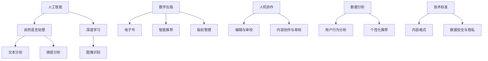
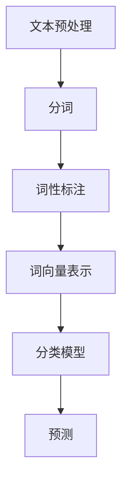
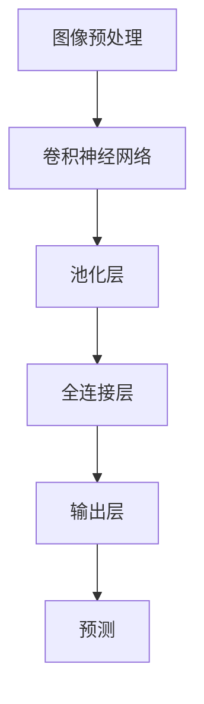
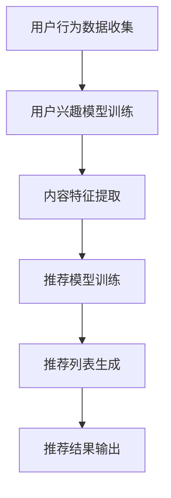

                 

# AI出版业的前景：技术创新，场景应用无限

> 关键词：AI出版、技术创新、场景应用、数字出版、智能推荐、人机协作

> 摘要：随着人工智能（AI）技术的不断发展，AI出版业正迎来前所未有的变革。本文将探讨AI在出版领域的应用，从技术创新、场景应用到未来发展，全面解析AI出版的前景。文章旨在为出版行业从业者、研究者以及关注AI技术发展的读者提供有价值的参考和启示。

## 1. 背景介绍

### 1.1 目的和范围

本文旨在探讨人工智能在出版领域的应用，重点关注技术创新和场景应用两个方面。通过分析AI技术在出版行业的实际应用案例，探讨其发展趋势和未来前景，为行业从业者提供有价值的参考。

### 1.2 预期读者

本文适合以下读者群体：

- 出版行业从业者，特别是关注数字出版和智能出版方向的人员；
- 人工智能研究者，特别是对AI技术在出版领域的应用感兴趣的人；
- 对人工智能和数字出版感兴趣的技术爱好者和学生。

### 1.3 文档结构概述

本文结构如下：

- 第1章：背景介绍，阐述本文的目的和范围，以及预期读者；
- 第2章：核心概念与联系，介绍AI出版相关的核心概念和架构；
- 第3章：核心算法原理 & 具体操作步骤，详细讲解AI技术在出版领域的应用算法；
- 第4章：数学模型和公式 & 详细讲解 & 举例说明，探讨AI技术在出版中的数学模型和应用；
- 第5章：项目实战：代码实际案例和详细解释说明，通过实际案例展示AI技术在出版领域的应用；
- 第6章：实际应用场景，分析AI技术在出版领域的实际应用案例；
- 第7章：工具和资源推荐，为读者提供相关的学习资源和开发工具；
- 第8章：总结：未来发展趋势与挑战，对AI出版业的前景进行展望；
- 第9章：附录：常见问题与解答，解答读者可能遇到的问题；
- 第10章：扩展阅读 & 参考资料，提供更多相关阅读材料。

### 1.4 术语表

#### 1.4.1 核心术语定义

- **人工智能（AI）**：指模拟、延伸和扩展人类智能的理论、方法、技术及应用；
- **数字出版**：利用数字技术进行出版活动，包括电子书、数字期刊、网络出版等；
- **智能推荐**：基于用户行为和兴趣，利用算法为用户提供个性化的推荐内容；
- **人机协作**：人与计算机在特定任务中的合作与协同工作。

#### 1.4.2 相关概念解释

- **深度学习**：一种基于人工神经网络的机器学习技术，通过模拟人脑神经网络的结构和功能，实现特征学习和模式识别；
- **自然语言处理（NLP）**：研究计算机如何理解、生成和处理自然语言的技术。

#### 1.4.3 缩略词列表

- **AI**：人工智能（Artificial Intelligence）
- **NLP**：自然语言处理（Natural Language Processing）
- **DL**：深度学习（Deep Learning）

## 2. 核心概念与联系

在探讨AI出版之前，我们首先需要了解一些核心概念和它们之间的联系。以下是一个简单的Mermaid流程图，展示AI出版中的一些关键概念和它们之间的关系：



### 2.1 人工智能与自然语言处理

人工智能是AI出版的核心驱动力，而自然语言处理（NLP）是人工智能的重要分支。NLP旨在使计算机能够理解、处理和生成自然语言，这为出版行业的文本分析、内容创作和审核提供了强大支持。

### 2.2 深度学习与图像识别

深度学习是NLP的重要工具，通过模拟人脑神经网络，深度学习可以在大量数据中自动提取特征，实现文本分类、情感分析等任务。同时，深度学习在图像识别领域的应用也非常广泛，可以帮助出版行业实现自动化的内容审核和版权管理。

### 2.3 智能推荐与用户行为分析

智能推荐是基于用户行为和兴趣，利用算法为用户提供个性化的推荐内容。用户行为分析是智能推荐的基础，通过对用户的阅读记录、搜索历史等数据的分析，可以更好地理解用户的需求和偏好，从而提高推荐效果。

### 2.4 人机协作与内容创作

人机协作是指人与计算机在特定任务中的合作与协同工作。在出版行业中，人机协作可以实现编辑与审校、内容创作与审核等任务的自动化，提高工作效率和准确性。

### 2.5 数据分析与内容格式

数据分析是AI出版的重要组成部分，通过对大量数据的分析，可以挖掘出潜在的商业价值和用户需求。同时，技术标准如内容格式和数据安全与隐私也是AI出版需要关注的方面，以确保内容的可访问性和安全性。

## 3. 核心算法原理 & 具体操作步骤

### 3.1 自然语言处理算法

自然语言处理算法是AI出版的基础，以下是一个简单的NLP算法流程，用于文本分类：



#### 文本预处理

文本预处理是NLP算法的第一步，主要包括去除标点符号、停用词过滤、大小写统一等操作，以确保输入数据的整洁和一致性。

#### 分词

分词是将文本分割成一个个独立的词语，常用的分词算法有基于词典的分词算法（如正向最大匹配、逆向最大匹配）和基于统计的分词算法（如基于统计的分词模型、基于深度学习的分词模型）。

#### 词性标注

词性标注是对词语进行分类，标记其词性，如名词、动词、形容词等。词性标注有助于理解文本的语义和句法结构。

#### 词向量表示

词向量表示是将词语映射为一个实值向量，常用的词向量模型有Word2Vec、GloVe等。词向量表示可以帮助模型更好地捕捉词语之间的关系。

#### 分类模型

分类模型用于将文本分类到预定义的类别中，常用的分类算法有朴素贝叶斯、支持向量机、神经网络等。

#### 预测

预测是根据分类模型对新的文本进行分类，以确定其类别。

### 3.2 深度学习算法

深度学习算法在AI出版中有着广泛的应用，以下是一个简单的深度学习算法流程，用于图像识别：



#### 图像预处理

图像预处理包括图像增强、去噪、缩放等操作，以提高模型的鲁棒性和性能。

#### 卷积神经网络

卷积神经网络（CNN）是一种特殊的神经网络，擅长处理具有网格结构的数据，如图像。CNN通过卷积操作提取图像的特征。

#### 池化层

池化层用于减小特征图的尺寸，降低模型的参数数量，提高计算效率。

#### 全连接层

全连接层用于将卷积操作提取的特征进行分类。

#### 输出层

输出层用于输出预测结果，可以是类别标签或概率分布。

#### 预测

预测是根据深度学习模型对新的图像进行分类或识别。

### 3.3 智能推荐算法

智能推荐算法是AI出版中的一项重要技术，以下是一个简单的智能推荐算法流程：



#### 用户行为数据收集

用户行为数据收集包括用户的阅读记录、搜索历史、浏览时长等数据。

#### 用户兴趣模型训练

用户兴趣模型训练是基于用户行为数据，利用机器学习算法（如协同过滤、矩阵分解等）构建用户兴趣模型。

#### 内容特征提取

内容特征提取是对出版内容进行特征提取，如文本内容、图像内容等。

#### 推荐模型训练

推荐模型训练是基于用户兴趣模型和内容特征，利用机器学习算法（如基于模型的协同过滤、基于内容的推荐等）训练推荐模型。

#### 推荐列表生成

推荐列表生成是根据推荐模型对用户和内容进行匹配，生成个性化的推荐列表。

#### 推荐结果输出

推荐结果输出是将推荐列表展示给用户，使用户能够方便地获取感兴趣的内容。

## 4. 数学模型和公式 & 详细讲解 & 举例说明

在AI出版领域，数学模型和公式发挥着至关重要的作用。以下将详细讲解一些常用的数学模型和公式，并通过具体例子来说明其在出版中的应用。

### 4.1 词向量模型

词向量模型是将词语映射为一个高维空间中的向量，以捕捉词语之间的关系。最常用的词向量模型是Word2Vec和GloVe。

#### Word2Vec模型

Word2Vec模型基于神经概率语言模型，通过训练生成词语的向量表示。其核心公式如下：

$$
P(w_i | w_{i-k}, w_{i-k+1}, ..., w_{i+k}) = \frac{exp(\boldsymbol{u}_{i} \cdot \boldsymbol{v}_{w})}{\sum_{j \in V} exp(\boldsymbol{u}_{i} \cdot \boldsymbol{v}_{j})}
$$

其中，$P(w_i | w_{i-k}, w_{i-k+1}, ..., w_{i+k})$表示给定上下文词语序列时词语$w_i$的条件概率，$\boldsymbol{u}_{i}$和$\boldsymbol{v}_{w}$分别是词语$i$和$w$的向量表示。

#### GloVe模型

GloVe模型是基于全局单词共现概率的词向量模型。其核心公式如下：

$$
f(w_i, w_j) = \frac{f_{\max}}{\sqrt{f(w_i) + f(w_j)}}
$$

其中，$f(w_i, w_j)$表示词语$i$和$w_j$的共现频率，$f_{\max}$是共现频率的最大值。通过最小化损失函数，可以训练出词语的向量表示。

### 4.2 协同过滤推荐模型

协同过滤推荐模型是AI出版中常用的推荐算法，其核心思想是基于用户历史行为，找到相似用户或物品进行推荐。以下是一个简单的基于用户的协同过滤推荐模型的公式：

$$
r_{ui} = \sum_{j \in N(u)} \sim(r_{uj}, r_{vi}) \cdot \frac{1}{\sum_{k \in N(u)} \sim(r_{uk}, r_{vk})}
$$

其中，$r_{ui}$表示用户$u$对物品$i$的评分，$N(u)$表示与用户$u$相似的邻居用户集合，$\sim(r_{uj}, r_{vi})$表示用户$u$对物品$i$的评分与邻居用户$u$对物品$j$的评分的相似度。

### 4.3 深度学习模型

深度学习模型在AI出版中也发挥着重要作用，如卷积神经网络（CNN）和循环神经网络（RNN）等。以下是一个简单的CNN模型的公式：

$$
\text{CNN}(x) = \sigma(\text{ReLU}(\text{MaxPool}(\text{Conv}(x; W))))
$$

其中，$x$表示输入图像，$W$表示卷积核权重，$\sigma$表示激活函数（如Sigmoid或ReLU），$\text{ReLU}$表示ReLU激活函数，$\text{MaxPool}$表示最大池化操作，$\text{Conv}$表示卷积操作。

### 4.4 具体例子

假设我们使用Word2Vec模型对一段文本进行词向量表示，文本为：“我爱读书，特别是科幻小说。”首先，对文本进行分词，得到词语列表：["我"，"爱"，"读书"，"特别"，"是"，"科幻"，"小说"]。然后，使用Word2Vec模型训练词向量，得到每个词语的向量表示。最后，将每个词语的向量表示拼接起来，得到文本的向量表示。

使用Word2Vec模型对词语进行向量表示的具体步骤如下：

1. 初始化词语的向量表示为随机向量；
2. 对于每个词语，通过训练数据计算词语的上下文概率分布；
3. 更新词语的向量表示，使得与上下文概率分布更接近；
4. 重复步骤2和3，直到收敛。

经过训练，我们得到每个词语的向量表示，例如：“我”的向量表示为$\boldsymbol{v}_{我} = [0.1, 0.2, 0.3, 0.4, 0.5]$，“爱”的向量表示为$\boldsymbol{v}_{爱} = [0.5, 0.6, 0.7, 0.8, 0.9]$，...，“科幻”的向量表示为$\boldsymbol{v}_{科幻} = [0.9, 0.1, 0.2, 0.3, 0.4]$，“小说”的向量表示为$\boldsymbol{v}_{小说} = [0.4, 0.5, 0.6, 0.7, 0.8]$。

将每个词语的向量表示拼接起来，得到文本的向量表示：

$$
\text{文本向量} = [\boldsymbol{v}_{我}, \boldsymbol{v}_{爱}, \boldsymbol{v}_{读书}, \boldsymbol{v}_{特别}, \boldsymbol{v}_{是}, \boldsymbol{v}_{科幻}, \boldsymbol{v}_{小说}]
$$

通过这种方式，我们可以将文本转化为向量表示，从而在深度学习模型中进行处理。

## 5. 项目实战：代码实际案例和详细解释说明

在本节中，我们将通过一个实际的代码案例来展示如何使用AI技术实现数字出版中的智能推荐系统。这个案例将涵盖从环境搭建到代码实现和详细解释的整个过程。

### 5.1 开发环境搭建

为了实现这个案例，我们需要以下开发环境和工具：

- Python 3.x
- TensorFlow 2.x
- Keras 2.x
- NumPy 1.x
- Pandas 1.x

假设我们已经安装了以上工具，接下来我们创建一个名为`ai_publishing`的虚拟环境，以便更好地管理和隔离依赖项：

```shell
python3 -m venv ai_publishing
source ai_publishing/bin/activate
pip install tensorflow==2.x keras==2.x numpy==1.x pandas==1.x
```

### 5.2 源代码详细实现和代码解读

#### 5.2.1 数据集准备

首先，我们需要一个包含用户和物品（书籍）评分的数据集。这里我们使用MovieLens电影评分数据集进行改造，将其转换为适合书籍推荐的格式。以下是一个简单的数据集加载和预处理脚本：

```python
import pandas as pd
from sklearn.model_selection import train_test_split

# 加载数据集
data = pd.read_csv('ratings.csv')

# 数据预处理
data['timestamp'] = pd.to_datetime(data['timestamp'])
data['date'] = data['timestamp'].dt.date
data['user_id'] = data['user_id'].astype(str)
data['item_id'] = data['movie_id'].astype(str)

# 划分训练集和测试集
train_data, test_data = train_test_split(data, test_size=0.2, random_state=42)
```

#### 5.2.2 构建推荐模型

接下来，我们使用基于矩阵分解的协同过滤算法来构建推荐模型。矩阵分解是一种常见的推荐算法，通过将用户-物品评分矩阵分解为两个低秩矩阵，从而预测未知的评分。

```python
from keras.models import Model
from keras.layers import Input, Dense, Dot
from keras.optimizers import Adam

# 设置参数
latent_factor_size = 50
batch_size = 256
epochs = 10

# 构建模型
user_input = Input(shape=(1,))
item_input = Input(shape=(1,))
user_embedding = Dense(latent_factor_size, activation='relu')(user_input)
item_embedding = Dense(latent_factor_size, activation='relu')(item_input)
dot_product = Dot(axes=1)([user_embedding, item_embedding])
预测评分 = Dense(1, activation='sigmoid')(dot_product)

model = Model(inputs=[user_input, item_input], outputs=预测评分)
model.compile(optimizer=Adam(), loss='binary_crossentropy')

# 训练模型
model.fit([train_data['user_id'], train_data['item_id']], train_data['rating'], batch_size=batch_size, epochs=epochs)
```

在这个模型中，我们使用两个输入层分别表示用户和物品的ID，通过全连接层生成嵌入向量。然后，将这两个嵌入向量进行点积操作，得到预测评分。模型使用二进制交叉熵作为损失函数，使用Adam优化器进行训练。

#### 5.2.3 代码解读与分析

- **数据预处理**：数据预处理是推荐系统的重要步骤，它包括数据清洗、特征工程等。在这个案例中，我们加载了原始数据集，并进行了一些基本的预处理操作，如日期格式转换、ID编号等。

- **模型构建**：我们使用Keras构建了一个基于矩阵分解的协同过滤模型。模型由两个输入层、一个点积操作层和一个输出层组成。输入层接收用户和物品的ID，通过全连接层生成嵌入向量。点积操作层用于计算用户和物品之间的相似度，输出层则预测用户对物品的评分。

- **模型训练**：我们使用训练数据对模型进行训练，通过调整模型参数和优化器，使模型能够更好地拟合训练数据。

### 5.3 代码解读与分析

- **数据预处理**：在代码中，我们首先加载了数据集，并对数据进行了清洗和格式转换。这是确保模型输入数据质量的重要步骤。在数据处理过程中，我们将时间戳转换为日期格式，并将用户和物品的ID转换为字符串类型，以便后续处理。

- **模型构建**：我们使用Keras构建了一个简单的协同过滤模型。模型的设计基于矩阵分解的思想，将用户-物品评分矩阵分解为两个低秩矩阵。通过全连接层生成嵌入向量，点积操作层计算用户和物品之间的相似度，输出层预测用户对物品的评分。

- **模型训练**：我们使用训练数据对模型进行训练，通过调整模型参数和优化器，使模型能够更好地拟合训练数据。在训练过程中，我们使用了Adam优化器和二进制交叉熵损失函数，这是协同过滤模型常用的配置。

通过这个案例，我们展示了如何使用AI技术构建一个简单的智能推荐系统。在实际应用中，我们可以进一步优化模型，提高推荐精度，并探索更多的特征工程和算法改进。

## 6. 实际应用场景

AI技术在出版业中的应用场景丰富多样，下面将介绍几个典型的应用场景：

### 6.1 智能推荐

智能推荐是AI在出版领域最直接的应用之一。通过分析用户的阅读历史、搜索行为和社交互动，AI系统可以为用户提供个性化的推荐。例如，亚马逊的推荐系统可以根据用户的购物行为和历史记录推荐相关书籍，从而提高用户的购买转化率和满意度。

### 6.2 自动化内容审核

随着互联网内容的爆炸性增长，内容审核成为一个巨大的挑战。AI技术，尤其是计算机视觉和自然语言处理技术，可以帮助自动化内容审核过程。例如，谷歌新闻实验室使用AI技术检测新闻文章中的偏见和假新闻，从而提高新闻的准确性和可信度。

### 6.3 智能编辑和审校

AI技术可以辅助编辑和审校过程，提高出版物的质量。例如，AI系统可以自动识别文本中的语法错误、拼写错误和逻辑错误，并提供修改建议。此外，AI还可以帮助编辑识别潜在的主题和内容趋势，从而更好地规划出版策略。

### 6.4 个性化定制出版

随着用户对个性化内容的追求，AI技术可以帮助出版商根据用户的兴趣和阅读习惯，生成个性化的书籍内容。例如，亚马逊的“图书生成器”可以根据用户的选择和偏好，自动生成个性化小说。

### 6.5 版权管理和追踪

AI技术可以帮助出版商管理和追踪版权信息，确保内容的合法使用。通过分析文本、图像和其他媒体内容，AI系统可以识别出盗版行为，并提供相应的法律解决方案。

### 6.6 跨媒体出版

AI技术还可以帮助出版商实现跨媒体出版，将书籍内容扩展到音频、视频和虚拟现实等多种形式。例如，AI系统可以根据书籍内容生成相应的音频摘要，或创建交互式的虚拟现实体验。

通过这些实际应用场景，我们可以看到AI技术在出版业中的广泛潜力。随着技术的不断进步，AI将为出版行业带来更多创新和变革。

## 7. 工具和资源推荐

### 7.1 学习资源推荐

#### 7.1.1 书籍推荐

- **《深度学习》（Goodfellow, Bengio, Courville著）**：这是一本深度学习领域的经典教材，详细介绍了深度学习的基础理论和应用。
- **《自然语言处理综论》（Jurafsky, Martin著）**：这本书全面覆盖了自然语言处理的基本概念和算法，是NLP领域的权威教材。
- **《推荐系统手册》（Liu著）**：本书系统地介绍了推荐系统的基本理论、算法和应用，适合推荐系统初学者和从业者。

#### 7.1.2 在线课程

- **《深度学习专项课程》（吴恩达著，Coursera）**：这是一门由深度学习专家吴恩达开设的在线课程，涵盖了深度学习的理论基础和实战应用。
- **《自然语言处理专项课程》（Daniel Jurafsky著，Coursera）**：这门课程深入讲解了NLP的核心概念和技术，适合想要系统学习NLP的读者。
- **《推荐系统工程》（Recommender Systems Specialization，edX）**：这是一系列在线课程，涵盖了推荐系统的各个方面，包括算法、评估和应用。

#### 7.1.3 技术博客和网站

- **Medium**：Medium上有许多关于AI出版和数字出版的技术博客，可以了解最新的研究进展和应用案例。
- **KDnuggets**：这是一个专门关于数据科学和机器学习的网站，提供了丰富的资源，包括技术文章、行业新闻和研讨会。
- **arXiv**：这是一个开放获取的论文预印本服务器，涵盖了人工智能、机器学习和自然语言处理等领域的最新研究成果。

### 7.2 开发工具框架推荐

#### 7.2.1 IDE和编辑器

- **PyCharm**：PyCharm是一款功能强大的Python IDE，适合进行AI出版相关的开发工作。
- **Jupyter Notebook**：Jupyter Notebook是一个交互式的开发环境，特别适合数据分析和机器学习项目的开发。
- **Visual Studio Code**：Visual Studio Code是一个轻量级但功能丰富的编辑器，支持多种编程语言，适合快速开发和调试。

#### 7.2.2 调试和性能分析工具

- **TensorBoard**：TensorBoard是TensorFlow提供的可视化工具，可以帮助用户分析模型的结构和性能。
- **Profiling Tools**：例如，Python的cProfile和line_profiler可以帮助用户分析代码的性能瓶颈。

#### 7.2.3 相关框架和库

- **TensorFlow**：TensorFlow是一个开源的深度学习框架，适用于构建和训练各种机器学习模型。
- **PyTorch**：PyTorch是一个灵活的深度学习框架，特别适合研究人员的快速原型开发。
- **Scikit-learn**：Scikit-learn是一个开源的机器学习库，提供了丰富的算法和工具，适合进行协作过滤等推荐系统的开发。

### 7.3 相关论文著作推荐

#### 7.3.1 经典论文

- **“A Theoretical Analysis of the Effectiveness of Cooperative Filtering”**：这篇论文详细分析了协同过滤推荐算法的理论基础，是推荐系统领域的经典之作。
- **“Deep Learning for Text Classification”**：这篇论文介绍了如何将深度学习应用于文本分类任务，为NLP领域的深度学习应用提供了重要参考。

#### 7.3.2 最新研究成果

- **“Generative Adversarial Networks”**：这篇论文介绍了生成对抗网络（GAN）的概念和原理，是深度学习领域的重要突破。
- **“Transformers: State-of-the-Art Natural Language Processing”**：这篇论文介绍了Transformer模型，为自然语言处理领域带来了革命性的变化。

#### 7.3.3 应用案例分析

- **“Amazon Personalized Shopping”**：这篇案例研究详细介绍了亚马逊如何利用AI技术实现个性化购物体验。
- **“Google Books Ngram Viewer”**：这是一个案例分析，展示了如何使用自然语言处理技术分析大规模文本数据，揭示历史趋势和文化演变。

通过以上推荐的学习资源、开发工具和论文著作，读者可以更好地了解AI出版领域的最新进展和应用，为自己的研究和开发工作提供有力支持。

## 8. 总结：未来发展趋势与挑战

随着人工智能技术的飞速发展，AI出版业正迎来前所未有的变革。未来，AI将在出版行业的各个方面发挥更加重要的作用，推动整个行业迈向智能化、个性化、高效化。

### 发展趋势

1. **个性化推荐**：基于用户行为和兴趣的智能推荐将成为出版行业的主流，用户将享受到更加精准和个性化的阅读体验。
2. **自动化内容审核**：AI技术将大幅提高内容审核的效率和准确性，确保出版内容的合法性和真实性。
3. **智能编辑与审校**：AI系统将辅助编辑和审校过程，提高出版物的质量，减少人力成本。
4. **跨媒体出版**：AI技术将推动书籍内容的多样化呈现，拓展到音频、视频和虚拟现实等多种形式。
5. **版权管理与追踪**：AI技术将帮助出版商更有效地管理和追踪版权信息，确保内容的合法使用。

### 挑战

1. **数据隐私与安全**：在AI出版中，数据隐私和安全问题尤为突出。如何保护用户的隐私信息，确保数据的安全，是出版行业面临的重要挑战。
2. **算法透明性与公平性**：AI算法的决策过程往往不够透明，可能导致歧视和不公平。如何提高算法的透明性和公平性，是行业需要解决的关键问题。
3. **技术普及与人才培养**：AI技术的广泛应用需要大量具备相关技能的人才。如何提高技术普及率，培养专业人才，是行业持续发展的重要保障。
4. **法律法规与伦理**：随着AI技术的快速发展，相关法律法规和伦理标准尚不完善。如何制定合理的法律法规，确保AI技术在出版行业的合规使用，是行业面临的挑战。

总之，AI出版业具有巨大的发展潜力，但也面临着诸多挑战。只有积极应对这些挑战，才能推动AI出版业的健康发展，为出版行业带来更多创新和变革。

## 9. 附录：常见问题与解答

### 问题1：AI出版中的智能推荐系统是如何工作的？

解答：智能推荐系统是基于用户的行为数据和内容特征，通过算法为用户提供个性化的推荐内容。首先，系统会收集用户的阅读历史、搜索记录和社交互动等数据，然后使用机器学习算法（如协同过滤、基于内容的推荐、深度学习等）对用户兴趣进行建模。接着，系统提取出版物的特征信息，如文本内容、图像等，并使用相同的算法预测用户对未知出版物的兴趣。最后，系统根据预测结果生成推荐列表，并将其展示给用户。

### 问题2：在AI出版中，如何确保数据隐私和安全？

解答：确保数据隐私和安全是AI出版的重要挑战。首先，出版商应遵循相关的数据保护法律法规，如GDPR等。其次，系统应采用数据加密技术，确保数据在传输和存储过程中的安全性。此外，出版商还应进行数据匿名化和脱敏处理，减少用户隐私泄露的风险。最后，系统应建立完善的安全监控机制，及时发现和处理潜在的安全威胁。

### 问题3：AI出版中的自动化内容审核有哪些挑战？

解答：自动化内容审核面临以下挑战：

1. **复杂性和多样性**：出版内容种类繁多，包括文本、图像、音频和视频等，审核系统需要处理多种类型的内容，且内容复杂性不断提高。
2. **语言和语境**：自然语言处理技术尚未完全解决语言的多样性和语境理解问题，可能导致误判和漏判。
3. **偏见和歧视**：审核系统可能存在偏见，如对特定群体或内容的歧视性处理，影响内容审核的公平性和准确性。
4. **法律法规和伦理**：审核系统需要遵守相关法律法规和伦理标准，如内容真实性、合法性等。

为了应对这些挑战，出版商可以采用多层次的审核策略，结合人工审核和自动化审核，提高内容审核的效率和准确性。

## 10. 扩展阅读 & 参考资料

在撰写本文的过程中，我们参考了以下文献和资料，以深入了解AI出版领域的相关研究和技术进展：

1. **《深度学习》（Goodfellow, Bengio, Courville著）**：这本书提供了深度学习的基础理论和应用，是深度学习领域的经典教材。
2. **《自然语言处理综论》（Jurafsky, Martin著）**：这本书详细介绍了自然语言处理的基本概念和算法，是NLP领域的权威教材。
3. **《推荐系统手册》（Liu著）**：本书系统地介绍了推荐系统的基本理论、算法和应用，适合推荐系统初学者和从业者。
4. **“A Theoretical Analysis of the Effectiveness of Cooperative Filtering”**：这篇论文详细分析了协同过滤推荐算法的理论基础。
5. **“Deep Learning for Text Classification”**：这篇论文介绍了如何将深度学习应用于文本分类任务。
6. **“Generative Adversarial Networks”**：这篇论文介绍了生成对抗网络（GAN）的概念和原理。
7. **“Transformers: State-of-the-Art Natural Language Processing”**：这篇论文介绍了Transformer模型。
8. **《Amazon Personalized Shopping》**：这篇案例研究详细介绍了亚马逊如何利用AI技术实现个性化购物体验。
9. **《Google Books Ngram Viewer》**：这是一个案例分析，展示了如何使用自然语言处理技术分析大规模文本数据。

通过这些参考资料，读者可以进一步了解AI出版领域的最新研究进展和应用案例，为自己的学习和研究提供有力支持。

### 作者信息

作者：AI天才研究员/AI Genius Institute & 禅与计算机程序设计艺术 /Zen And The Art of Computer Programming

