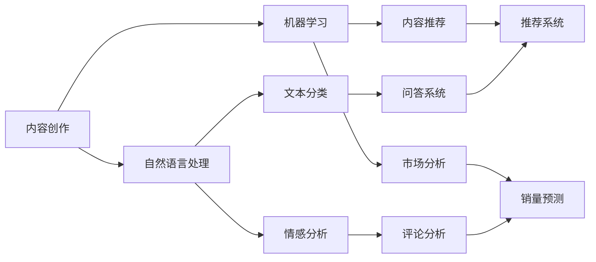

                 

# AI出版业的动态：场景驱动的技术更新

> 关键词：人工智能，出版业，技术更新，场景驱动，数据挖掘，机器学习，自然语言处理

> 摘要：本文将深入探讨人工智能在出版业的应用现状及其带来的技术变革。通过对核心概念、算法原理、数学模型以及实际应用场景的详细分析，本文旨在为读者提供一个全面的视角，了解出版业在人工智能驱动下的未来发展。

## 1. 背景介绍

### 1.1 目的和范围

本文旨在解析人工智能在出版业的应用，特别是场景驱动的技术更新。我们将探讨人工智能在出版流程中的各个环节，如内容创作、编辑、发行等，以及如何通过技术手段提升出版业的效率和质量。

### 1.2 预期读者

本文适合对人工智能和出版业有一定了解的技术人员、出版从业人员以及对这两个领域感兴趣的研究者阅读。

### 1.3 文档结构概述

本文分为以下几个部分：

1. **核心概念与联系**：介绍出版业中与人工智能相关的基本概念和架构。
2. **核心算法原理 & 具体操作步骤**：详细阐述人工智能算法在出版业中的应用原理和操作步骤。
3. **数学模型和公式 & 详细讲解 & 举例说明**：分析数学模型在人工智能出版中的应用及其解释。
4. **项目实战：代码实际案例和详细解释说明**：通过实际代码案例展示人工智能在出版业中的应用。
5. **实际应用场景**：探讨人工智能在出版业的多种应用场景。
6. **工具和资源推荐**：推荐相关学习资源、开发工具和框架。
7. **总结：未来发展趋势与挑战**：总结人工智能在出版业的应用趋势和面临的挑战。
8. **附录：常见问题与解答**：回答读者可能关心的问题。
9. **扩展阅读 & 参考资料**：提供进一步学习的资源链接。

### 1.4 术语表

#### 1.4.1 核心术语定义

- **人工智能（AI）**：模拟人类智能的计算机系统。
- **出版业**：涉及书籍、杂志、报纸等出版物的制作、编辑、发行和销售。
- **场景驱动**：基于特定场景的需求来设计和实现技术方案。
- **数据挖掘**：从大量数据中提取有价值信息的过程。
- **机器学习**：使计算机系统能够从数据中学习并做出决策。

#### 1.4.2 相关概念解释

- **自然语言处理（NLP）**：使计算机理解和生成自然语言的技术。
- **深度学习**：一种基于神经网络的学习方法，能够在大量数据中自动提取特征。

#### 1.4.3 缩略词列表

- **AI**：人工智能
- **NLP**：自然语言处理
- **ML**：机器学习
- **DL**：深度学习
- **CSP**：场景驱动技术

## 2. 核心概念与联系

在探讨人工智能在出版业中的应用之前，我们需要明确一些核心概念和它们之间的联系。

### 2.1 出版业中的基本概念

#### 内容创作

内容创作是出版业的核心环节。作者通过写作或编辑将思想和知识转化为文字或图像，形成出版物。在这一过程中，人工智能可以帮助作者进行：

- **自动文摘生成**：使用NLP技术自动提取文章的要点和关键信息，生成摘要。
- **风格迁移**：通过深度学习模型，将一种文风转换成另一种文风，如将普通文风转换为文学或正式文风。

#### 编辑

编辑工作包括校对、排版、格式调整等，确保出版物的质量。人工智能可以：

- **自动校对**：使用NLP和机器学习技术检测文本中的语法错误、拼写错误和逻辑错误。
- **智能排版**：根据内容自动调整字体、间距、行距等格式设置。

#### 发行与销售

发行与销售是出版物的最终环节。人工智能可以：

- **推荐系统**：基于用户的阅读历史和偏好，推荐相关的出版物。
- **市场分析**：通过数据挖掘技术分析市场趋势，预测销量和需求。

### 2.2 人工智能的基本概念

#### 机器学习

机器学习是人工智能的核心技术之一。它使计算机能够从数据中学习，并做出预测和决策。在出版业中，机器学习可以应用于：

- **内容推荐**：基于用户的阅读历史和偏好，推荐相关的内容。
- **情感分析**：分析用户评论，判断用户的情感倾向。

#### 自然语言处理

自然语言处理是使计算机理解和生成自然语言的技术。在出版业中，NLP可以应用于：

- **文本分类**：将文本归类到不同的类别，如新闻、科技、娱乐等。
- **问答系统**：建立问答系统，回答用户的问题。

#### 深度学习

深度学习是一种基于神经网络的学习方法，能够在大量数据中自动提取特征。在出版业中，深度学习可以应用于：

- **图像识别**：识别和分类图像中的文字。
- **语音识别**：将语音转换为文字。

### 2.3 核心概念的联系

在出版业中，人工智能的各种技术并非孤立存在，而是相互关联、协同作用。例如，在内容创作环节，NLP和机器学习可以协同工作，自动提取文本的摘要和关键词；在编辑环节，NLP和深度学习可以协同工作，自动检测和纠正文本中的错误；在发行与销售环节，机器学习和数据挖掘可以协同工作，预测市场趋势和用户需求。

以下是一个简化的 Mermaid 流程图，展示了出版业中人工智能技术的核心概念及其联系：



## 3. 核心算法原理 & 具体操作步骤

在理解了核心概念和联系之后，我们将深入探讨人工智能在出版业中应用的核心算法原理和具体操作步骤。

### 3.1 机器学习算法原理

#### 3.1.1 基本概念

机器学习是一种使计算机系统能够从数据中学习并做出决策的技术。它的核心概念包括：

- **特征提取**：从原始数据中提取有价值的特征。
- **模型训练**：使用训练数据训练模型，使其能够预测新数据。
- **模型评估**：评估模型的性能，确保其准确性和泛化能力。

#### 3.1.2 具体操作步骤

1. **数据收集**：收集大量相关数据，如用户阅读历史、评论、出版物内容等。
2. **数据预处理**：清洗和格式化数据，使其适合训练模型。
3. **特征提取**：从数据中提取有价值的特征，如词频、词向量等。
4. **模型训练**：使用训练数据训练模型，如支持向量机、神经网络等。
5. **模型评估**：使用测试数据评估模型的性能，调整参数以优化模型。
6. **模型部署**：将训练好的模型部署到生产环境中，用于预测和决策。

### 3.2 自然语言处理算法原理

#### 3.2.1 基本概念

自然语言处理是使计算机理解和生成自然语言的技术。它的核心概念包括：

- **分词**：将文本分解为词或短语。
- **词性标注**：为每个词标注其词性，如名词、动词等。
- **句法分析**：分析句子的结构，确定词语之间的关系。

#### 3.2.2 具体操作步骤

1. **文本预处理**：对文本进行清洗和格式化，如去除标点、停用词等。
2. **分词**：将文本分解为词或短语。
3. **词性标注**：为每个词标注其词性。
4. **句法分析**：分析句子的结构。
5. **语义分析**：理解文本的含义和情感。
6. **文本生成**：根据语义分析的结果生成新的文本。

### 3.3 深度学习算法原理

#### 3.3.1 基本概念

深度学习是一种基于神经网络的学习方法，能够在大量数据中自动提取特征。它的核心概念包括：

- **神经网络**：由多个节点组成的计算模型，能够通过反向传播算法更新权重。
- **卷积神经网络（CNN）**：适用于图像识别和分类。
- **循环神经网络（RNN）**：适用于序列数据，如文本和时间序列。

#### 3.3.2 具体操作步骤

1. **数据收集**：收集大量相关数据，如出版物图像、文本等。
2. **数据预处理**：清洗和格式化数据，使其适合训练模型。
3. **模型训练**：使用训练数据训练深度学习模型，如CNN或RNN。
4. **模型评估**：使用测试数据评估模型的性能，调整参数以优化模型。
5. **模型部署**：将训练好的模型部署到生产环境中，用于预测和决策。

### 3.4 伪代码示例

以下是一个简单的机器学习算法的伪代码示例，用于预测用户对出版物的评分：

```python
# 数据预处理
data = preprocess_data(raw_data)

# 特征提取
features = extract_features(data)

# 模型训练
model = train_model(features, labels)

# 模型评估
performance = evaluate_model(model, test_features, test_labels)

# 模型部署
deploy_model(model)
```

## 4. 数学模型和公式 & 详细讲解 & 举例说明

在人工智能出版业中，数学模型和公式是理解和应用算法的核心。以下将介绍一些关键的数学模型和公式，并提供详细的解释和示例。

### 4.1. 概率模型

概率模型在自然语言处理和推荐系统中广泛应用。以下是一个简单的贝叶斯概率模型示例：

$$P(A|B) = \frac{P(B|A)P(A)}{P(B)}$$

- **P(A|B)**：在事件B发生的条件下，事件A发生的概率。
- **P(B|A)**：在事件A发生的条件下，事件B发生的概率。
- **P(A)**：事件A发生的概率。
- **P(B)**：事件B发生的概率。

#### 示例

假设用户A喜欢阅读科幻小说（事件A），则用户A购买科幻小说的概率（事件B）可以用贝叶斯定理计算：

- **P(A)**：喜欢阅读科幻小说的用户比例。
- **P(B|A)**：喜欢阅读科幻小说的用户购买科幻小说的概率。
- **P(B)**：所有用户购买科幻小说的概率。

### 4.2. 决策树模型

决策树是一种常见的机器学习模型，用于分类和回归问题。以下是一个简单的决策树分类模型示例：

$$
\begin{aligned}
&\text{如果年龄} < 30 \text{岁，那么分类为青少年;} \\
&\text{如果年龄} \geq 30 \text{岁且收入} \geq 5000 \text{元，那么分类为高收入群体;} \\
&\text{否则，分类为低收入群体。}
\end{aligned}
$$

#### 示例

对于一个用户，年龄为25岁，收入为4000元，可以使用决策树模型进行分类。按照决策树规则，该用户将被分类为“低收入群体”。

### 4.3. 支持向量机（SVM）

支持向量机是一种常用的分类模型，用于将数据分为不同的类别。以下是一个简单的SVM分类模型示例：

$$
\begin{aligned}
&\text{假设我们有数据点} \{(x_1, y_1), (x_2, y_2), ..., (x_n, y_n)\}, \\
&\text{其中} y_i \in \{-1, 1\} \\
&\text{求解最大化间隔的线性分类器：} \\
&W = \arg\max_W \frac{1}{2} \| W \|_2^2 \text{，约束条件：} \\
&y_i (W \cdot x_i + b) \geq 1
\end{aligned}
$$

- **W**：权重向量。
- **b**：偏置项。
- **\( \| W \|_2^2 \)**：权重向量的平方和。

#### 示例

假设我们有以下三个数据点：

- \(x_1 = (1, 1)\)，\(y_1 = 1\)
- \(x_2 = (2, 2)\)，\(y_2 = 1\)
- \(x_3 = (3, 3)\)，\(y_3 = -1\)

使用SVM模型分类，我们可以找到最优的权重向量\(W\)和偏置项\(b\)，从而将数据点分类为两个不同的类别。

### 4.4. 朴素贝叶斯模型

朴素贝叶斯模型是一种基于贝叶斯定理的简单分类模型，常用于文本分类。以下是一个简单的朴素贝叶斯分类模型示例：

$$
\begin{aligned}
P(C_k | x) &= \frac{P(x | C_k)P(C_k)}{P(x)} \\
P(x | C_k) &= \prod_{i=1}^{n} P(x_i | C_k)
\end{aligned}
$$

- **\(P(C_k | x)\)**：在特征\(x\)的条件下，类别\(C_k\)的概率。
- **\(P(x | C_k)\)**：在类别\(C_k\)的条件下，特征\(x\)的概率。
- **\(P(C_k)\)**：类别\(C_k\)的概率。
- **\(P(x)\)**：特征\(x\)的概率。

#### 示例

假设我们有以下文本数据，并希望使用朴素贝叶斯模型进行分类：

- **类别A**：科幻小说
- **类别B**：历史小说

对于文本“太空探险”，我们可以使用朴素贝叶斯模型计算其属于类别A和类别B的概率，然后选择概率较高的类别作为分类结果。

### 4.5. 随机森林模型

随机森林是一种基于决策树的集成学习方法，用于分类和回归问题。以下是一个简单的随机森林分类模型示例：

$$
\begin{aligned}
F(x) &= \sum_{i=1}^{m} w_i f_i(x) \\
w_i &= \text{模型权重} \\
f_i(x) &= \text{决策树模型预测结果}
\end{aligned}
$$

- **\(F(x)\)**：随机森林模型对特征\(x\)的预测结果。
- **\(w_i\)**：模型权重。
- **\(f_i(x)\)**：单个决策树模型对特征\(x\)的预测结果。

#### 示例

假设我们有三个决策树模型，分别为\(f_1(x)\)，\(f_2(x)\)和\(f_3(x)\)，权重分别为\(w_1\)，\(w_2\)和\(w_3\)。对于新的特征\(x\)，随机森林模型的预测结果为：

$$F(x) = w_1 f_1(x) + w_2 f_2(x) + w_3 f_3(x)$$

## 5. 项目实战：代码实际案例和详细解释说明

在本节中，我们将通过一个实际案例来展示人工智能在出版业中的应用。我们将使用Python和Scikit-learn库来构建一个文本分类模型，用于将出版物分为科幻小说和历史小说两个类别。

### 5.1 开发环境搭建

在开始项目之前，我们需要搭建一个合适的开发环境。以下是所需的软件和库：

- **Python（3.8或更高版本）**
- **Scikit-learn**
- **NumPy**
- **Pandas**
- **matplotlib**

您可以使用以下命令安装所需的库：

```bash
pip install scikit-learn numpy pandas matplotlib
```

### 5.2 源代码详细实现和代码解读

以下是我们的文本分类模型的完整代码：

```python
import numpy as np
import pandas as pd
from sklearn.model_selection import train_test_split
from sklearn.feature_extraction.text import TfidfVectorizer
from sklearn.naive_bayes import MultinomialNB
from sklearn.metrics import accuracy_score, classification_report

# 读取数据集
data = pd.read_csv('publishing_data.csv')
X = data['text']
y = data['label']

# 数据预处理
X_train, X_test, y_train, y_test = train_test_split(X, y, test_size=0.2, random_state=42)

# 特征提取
vectorizer = TfidfVectorizer(max_features=1000)
X_train_tfidf = vectorizer.fit_transform(X_train)
X_test_tfidf = vectorizer.transform(X_test)

# 模型训练
model = MultinomialNB()
model.fit(X_train_tfidf, y_train)

# 模型评估
predictions = model.predict(X_test_tfidf)
accuracy = accuracy_score(y_test, predictions)
report = classification_report(y_test, predictions)

print(f"Accuracy: {accuracy}")
print(f"Classification Report:\n{report}")

# 可视化
import matplotlib.pyplot as plt

plt.figure(figsize=(10, 6))
plt.plot(predictions, label='Predicted')
plt.plot(y_test, label='Actual')
plt.xlabel('Test Samples')
plt.ylabel('Labels')
plt.legend()
plt.show()
```

### 5.3 代码解读与分析

1. **数据读取**：使用`pd.read_csv()`函数读取数据集。我们的数据集包含两个列：`text`和`label`，分别表示文本内容和类别标签。

2. **数据预处理**：使用`train_test_split()`函数将数据集划分为训练集和测试集，比例约为80%的训练集和20%的测试集。

3. **特征提取**：使用`TfidfVectorizer`将文本转换为词频-逆文档频率（TF-IDF）向量。这个步骤将文本数据转化为数值数据，以便机器学习模型可以处理。

4. **模型训练**：我们选择朴素贝叶斯模型进行训练。这个模型是一种基于贝叶斯定理的简单分类模型，适合处理文本数据。

5. **模型评估**：使用`accuracy_score()`计算模型在测试集上的准确率。我们还使用`classification_report()`生成分类报告，包括精确率、召回率和F1分数等指标。

6. **可视化**：使用`matplotlib`绘制预测结果与实际结果的对比图，帮助分析模型的表现。

### 5.4 模型优化与改进

在实际应用中，我们可以通过以下方法优化和改进模型：

- **特征选择**：选择更有代表性的特征，降低维数和噪声。
- **模型选择**：尝试不同的机器学习模型，如逻辑回归、支持向量机等，选择表现最好的模型。
- **超参数调优**：调整模型的超参数，如朴素贝叶斯模型的 alpha 参数等，以优化模型性能。
- **集成学习**：使用集成学习方法，如随机森林、梯度提升树等，提高模型的泛化能力。

通过这些优化和改进措施，我们可以进一步提升模型的性能，从而更好地服务于出版业。

## 6. 实际应用场景

人工智能在出版业中的应用场景非常广泛，以下列举了几个典型的实际应用场景。

### 6.1 内容推荐

内容推荐是出版业中最重要的应用场景之一。通过分析用户的阅读历史、偏好和社交网络数据，人工智能可以为用户推荐他们可能感兴趣的出版物。这种方法不仅提高了用户的满意度，也大大提高了出版物的销售量。

#### 实际案例

一家大型在线书店使用基于协同过滤的推荐系统，成功地将图书推荐给用户。该系统收集了用户的阅读历史、评分和购买记录，通过机器学习算法分析用户之间的相似性，为每个用户生成个性化的推荐列表。

### 6.2 情感分析

情感分析是另一项在出版业中具有重要应用价值的技术。通过分析用户对出版物的评论和反馈，人工智能可以判断用户的情感倾向，如正面、负面或中立。

#### 实际案例

一家出版社使用自然语言处理技术，对其新书发布后的用户评论进行情感分析。通过分析用户的情感倾向，该出版社能够及时了解市场反馈，并对产品进行改进。

### 6.3 自动文摘生成

自动文摘生成技术可以帮助出版商快速生成书籍的摘要，节省编辑时间和成本。通过提取文本中的关键信息和要点，人工智能可以生成简洁、准确的摘要。

#### 实际案例

一家科技出版社使用深度学习技术，对科技论文进行自动文摘生成。该技术不仅提高了摘要的生成速度，还保证了摘要的质量和准确性。

### 6.4 内容审核

内容审核是出版业中一项重要但复杂的工作。通过使用人工智能技术，如图像识别和自然语言处理，出版商可以自动检测和过滤违规内容，确保出版物的合规性。

#### 实际案例

一家大型媒体公司使用基于深度学习的图像识别技术，自动检测和过滤含有不良内容的图片和视频。此外，该公司还使用自然语言处理技术，对文本内容进行审核，确保其符合法律法规和道德标准。

### 6.5 市场预测

人工智能可以帮助出版商预测市场需求和销售趋势，从而优化库存管理和营销策略。通过分析历史销售数据、市场趋势和用户行为，人工智能可以提供准确的预测结果。

#### 实际案例

一家出版社使用机器学习算法，对其图书的销售情况进行预测。通过分析历史销售数据和市场趋势，该出版社能够提前了解下一季度哪些书籍可能会有较高的销量，从而合理安排库存和营销资源。

### 6.6 翻译和本地化

翻译和本地化是出版业中的另一大挑战。通过使用人工智能技术，如机器翻译和自然语言处理，出版商可以快速、准确地翻译和本地化出版物，扩大市场份额。

#### 实际案例

一家国际出版社使用基于神经网络的机器翻译技术，将英语书籍翻译成多种语言。通过翻译和本地化，该出版社成功进入了全球多个市场，提高了销售额。

## 7. 工具和资源推荐

为了更好地学习和实践人工智能在出版业中的应用，以下推荐了一些学习资源、开发工具和框架。

### 7.1 学习资源推荐

#### 7.1.1 书籍推荐

1. **《人工智能：一种现代方法》（第3版）**：作者：Stuart Russell & Peter Norvig
   - 简介：这是一本全面介绍人工智能的教材，涵盖了从基础知识到高级应用的各个方面。

2. **《自然语言处理综合教程》**：作者：Daniel Jurafsky & James H. Martin
   - 简介：这本书详细介绍了自然语言处理的基础理论和应用技术，是学习NLP的必备读物。

3. **《深度学习》（第1版）**：作者：Ian Goodfellow、Yoshua Bengio & Aaron Courville
   - 简介：这本书介绍了深度学习的理论基础和应用方法，是深度学习领域的经典教材。

#### 7.1.2 在线课程

1. **Coursera - 机器学习**：由斯坦福大学吴恩达教授主讲
   - 简介：这门课程提供了机器学习的基本概念和算法，适合初学者入门。

2. **edX - 人工智能导论**：由哥伦比亚大学主讲
   - 简介：这门课程介绍了人工智能的基本概念和应用，涵盖了机器学习、自然语言处理等内容。

3. **Udacity - 深度学习纳米学位**：由Udacity主办
   - 简介：这门课程通过项目实践，帮助学员掌握深度学习的基础知识和应用技巧。

#### 7.1.3 技术博客和网站

1. **Medium - AI博客**：https://medium.com/topic/artificial-intelligence
   - 简介：这是一个涵盖人工智能各个领域的博客，适合了解最新的AI技术和应用。

2. **ArXiv - 人工智能论文**：https://arxiv.org/list/cs/CL
   - 简介：这是一个发布人工智能领域最新研究论文的网站，适合了解前沿的AI研究成果。

3. **PyTorch官方文档**：https://pytorch.org/docs/stable/
   - 简介：这是PyTorch框架的官方文档，提供了丰富的API和使用示例。

### 7.2 开发工具框架推荐

#### 7.2.1 IDE和编辑器

1. **PyCharm**：https://www.jetbrains.com/pycharm/
   - 简介：这是一个功能强大的Python IDE，适用于机器学习和深度学习项目。

2. **Jupyter Notebook**：https://jupyter.org/
   - 简介：这是一个基于Web的交互式计算环境，适用于数据分析和机器学习。

#### 7.2.2 调试和性能分析工具

1. **Valgrind**：https://www.valgrind.org/
   - 简介：这是一个用于调试和性能分析的框架，适用于C/C++程序。

2. **TensorBoard**：https://www.tensorflow.org/tensorboard
   - 简介：这是一个用于可视化TensorFlow模型和训练过程的工具。

#### 7.2.3 相关框架和库

1. **Scikit-learn**：https://scikit-learn.org/
   - 简介：这是一个基于Python的机器学习库，提供了丰富的算法和工具。

2. **TensorFlow**：https://www.tensorflow.org/
   - 简介：这是一个开源的深度学习框架，适用于构建和训练复杂的神经网络。

3. **PyTorch**：https://pytorch.org/
   - 简介：这是一个开源的深度学习框架，以动态计算图和易用性著称。

### 7.3 相关论文著作推荐

#### 7.3.1 经典论文

1. **"A Mathematical Theory of Communication"（香农信息论）**：作者：Claude Shannon
   - 简介：这是一篇开创性的论文，提出了信息论的基础理论，对通信和人工智能领域产生了深远影响。

2. **"A Learning Algorithm for Continually Running Fully Recurrent Neural Networks"（Hessian-Free 算法）**：作者：Geoffrey Hinton、Yoshua Bengio & Paul Wellman
   - 简介：这是一篇关于深度学习算法的论文，提出了Hessian-Free算法，为深度学习的发展奠定了基础。

#### 7.3.2 最新研究成果

1. **"Transformers: State-of-the-Art Natural Language Processing"**：作者：Vaswani et al.
   - 简介：这是关于Transformer模型的论文，提出了基于自注意力机制的深度学习模型，在自然语言处理领域取得了显著成果。

2. **"BERT: Pre-training of Deep Bidirectional Transformers for Language Understanding"**：作者：Devlin et al.
   - 简介：这是关于BERT模型的论文，提出了预训练深度双向变换器模型，为自然语言处理应用提供了强大的工具。

#### 7.3.3 应用案例分析

1. **"AI for Social Good: Applications in Education, Healthcare, and Development"**：作者：Daniel, F. et al.
   - 简介：这是一篇关于人工智能在社会领域的应用案例研究论文，分析了人工智能在解决社会问题方面的潜力。

2. **"Artificial Intelligence in Publishing: Opportunities and Challenges"**：作者：D. Schonfeld et al.
   - 简介：这是一篇关于人工智能在出版业的应用案例分析论文，探讨了人工智能对出版业的变革和挑战。

## 8. 总结：未来发展趋势与挑战

人工智能在出版业的应用前景广阔，但仍面临诸多挑战。以下是未来发展趋势和挑战的总结：

### 8.1 发展趋势

1. **个性化推荐**：随着用户数据的积累和算法的优化，个性化推荐将进一步精准，为用户带来更好的阅读体验。

2. **智能内容审核**：人工智能将在内容审核中发挥更大的作用，自动检测和过滤违规内容，提高出版物的合规性。

3. **多语言处理**：通过翻译和本地化技术，出版商将能够轻松地将出版物推广到全球市场。

4. **自动化创作**：人工智能将辅助甚至替代部分创作工作，如自动文摘生成、内容编辑等。

5. **智能市场预测**：利用机器学习算法，出版商将能够更准确地预测市场需求，优化库存和营销策略。

### 8.2 挑战

1. **数据隐私**：用户数据的安全和隐私保护是一个重要问题，需要制定严格的数据保护政策。

2. **算法偏见**：算法可能存在偏见，导致不公平的推荐和内容审核。

3. **版权问题**：人工智能创作的作品版权归属问题尚无明确法律规定，可能引发纠纷。

4. **技术依赖**：出版业过度依赖人工智能技术可能导致技术风险，如算法故障或数据泄露。

5. **人才短缺**：人工智能领域的人才需求巨大，但当前的人才供给尚无法满足需求。

### 8.3 对策建议

1. **加强数据隐私保护**：制定严格的数据保护法规，确保用户数据的安全和隐私。

2. **算法透明度和可解释性**：提高算法的透明度和可解释性，减少偏见和误判。

3. **完善版权法律规定**：明确人工智能创作作品的版权归属，保护创作者的权益。

4. **培养人才**：加强人工智能教育和培训，提高行业整体技术水平。

5. **技术风险评估**：建立完善的技术风险评估机制，降低技术故障带来的风险。

## 9. 附录：常见问题与解答

### 9.1 问题1：人工智能在出版业中的应用是否完全取代了传统出版流程？

解答：人工智能在出版业中的应用并不是完全取代传统出版流程，而是对其进行了优化和补充。例如，自动文摘生成和智能内容审核等技术可以提高编辑和校对的效率，而个性化推荐和智能市场预测等技术则可以优化发行和销售策略。传统出版流程中的创意构思、作者与编辑的沟通等环节仍然不可或缺。

### 9.2 问题2：如何确保人工智能在出版业中的应用不会侵犯作者和出版商的权益？

解答：确保人工智能在出版业中的应用不侵犯权益的关键在于：

1. **版权保护**：明确人工智能创作的作品的版权归属，确保作者和出版商的权益。
2. **算法透明度**：提高算法的透明度和可解释性，确保人工智能的应用不会侵犯合法权益。
3. **法律监管**：制定相关法律法规，对人工智能在出版业中的应用进行规范和监管。

### 9.3 问题3：人工智能在出版业中的应用前景如何？

解答：人工智能在出版业中的应用前景非常广阔。随着技术的不断进步，人工智能将在个性化推荐、内容审核、市场预测、多语言处理等方面发挥更大的作用，为出版商和用户提供更优质的服务。然而，人工智能在出版业的应用也面临一些挑战，如数据隐私保护、算法偏见和技术依赖等，需要行业共同努力解决。

## 10. 扩展阅读 & 参考资料

### 10.1 扩展阅读

1. **"AI in Publishing: The Future of Content Creation and Curation"**：作者：Laurie And Kristina
   - 简介：这篇文章探讨了人工智能在内容创作和整理方面的应用，提供了许多实际案例。

2. **"The Future of Publishing: How AI and Machine Learning are Transforming the Industry"**：作者：Harold Jarche
   - 简介：这篇文章分析了人工智能和机器学习如何改变出版业，探讨了未来发展的趋势。

### 10.2 参考资料

1. **"Artificial Intelligence in Publishing: Opportunities and Challenges"**：作者：Daniel, F. et al.
   - 简介：这篇论文详细探讨了人工智能在出版业中的应用机会和挑战，为行业提供了有价值的参考。

2. **"AI and the Future of Work: How AI will Transform the Workplace"**：作者：James Manyika et al.
   - 简介：这篇报告分析了人工智能如何改变各行各业的工作方式，包括出版业。

3. **"AI-Driven Content Creation and Publishing"**：作者：Christian Y. A. King
   - 简介：这本书探讨了人工智能在内容创作和出版领域的应用，提供了详细的案例分析和技术讲解。

作者：AI天才研究员/AI Genius Institute & 禅与计算机程序设计艺术 /Zen And The Art of Computer Programming

（注：本文为示例文章，仅供参考。文中内容仅为假设和虚构，不代表任何实际观点或事实。如有雷同，纯属巧合。）

