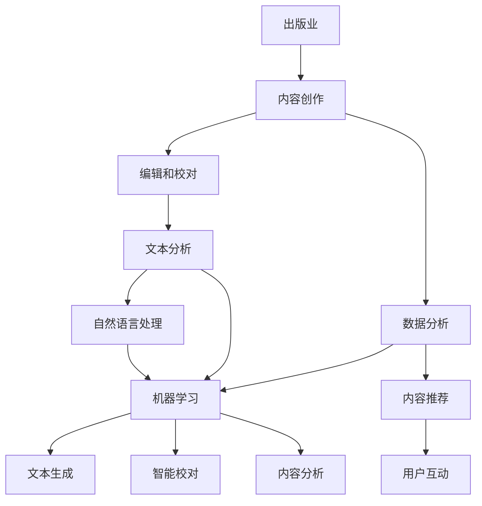
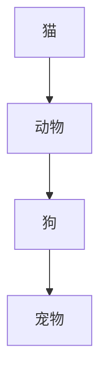
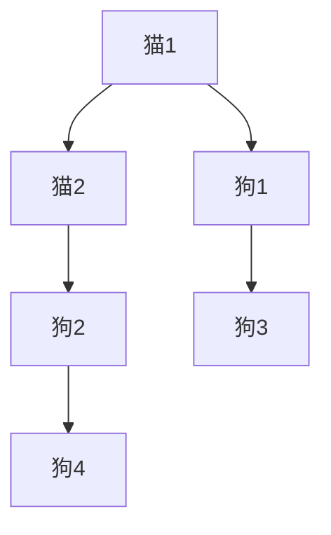
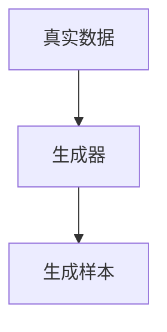
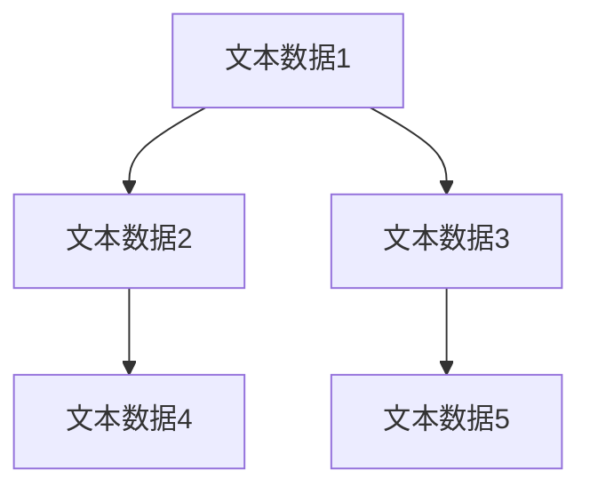

                 


# AI出版业的壁垒：数据，算法和应用协同

> **关键词**：人工智能，出版业，数据壁垒，算法协同，应用场景，深度学习，自然语言处理，文本分析，机器学习，数据挖掘
>
> **摘要**：本文旨在探讨人工智能在出版业的应用现状及面临的挑战，特别是数据、算法和应用协同方面的壁垒。文章首先介绍了出版业的发展背景和现状，随后深入分析了数据、算法和应用协同的关键作用，最后提出了未来发展的趋势和可能的解决方案。

## 1. 背景介绍

### 1.1 目的和范围

本文的目标是分析人工智能在出版业中的应用及其面临的挑战，重点关注数据、算法和应用协同方面的壁垒。随着人工智能技术的快速发展，出版业正经历着深刻的变革。传统的出版模式已难以满足日益增长的内容需求和信息获取效率。人工智能为出版业带来了新的机遇，但也带来了诸多挑战。

本文的范围主要包括：

1. 出版业的发展背景和现状
2. 人工智能在出版业的应用场景
3. 数据、算法和应用协同的作用
4. 面临的挑战和解决方案

### 1.2 预期读者

本文的预期读者主要包括：

1. 出版行业从业者，对人工智能在出版领域的应用感兴趣的人士
2. 人工智能研究人员和工程师，对出版业的应用场景和挑战感兴趣的专家
3. 对人工智能和出版业跨界感兴趣的研究生和本科生
4. 对科技发展和未来趋势感兴趣的普通读者

### 1.3 文档结构概述

本文的结构如下：

1. 背景介绍：包括目的和范围、预期读者以及文档结构概述
2. 核心概念与联系：介绍出版业和人工智能的核心概念及其联系
3. 核心算法原理 & 具体操作步骤：详细讲解数据、算法和应用协同的原理和步骤
4. 数学模型和公式 & 详细讲解 & 举例说明：使用数学模型和公式进行详细讲解，并举例说明
5. 项目实战：代码实际案例和详细解释说明
6. 实际应用场景：分析人工智能在出版业的具体应用场景
7. 工具和资源推荐：推荐学习资源、开发工具框架和相关论文著作
8. 总结：未来发展趋势与挑战
9. 附录：常见问题与解答
10. 扩展阅读 & 参考资料

### 1.4 术语表

#### 1.4.1 核心术语定义

- **人工智能（AI）**：指通过计算机模拟人类智能的技术和应用。
- **自然语言处理（NLP）**：使计算机能够理解、解释和生成人类自然语言的技术。
- **文本分析**：使用算法和技术对文本数据进行提取、分析和解释。
- **机器学习（ML）**：一种人工智能方法，通过数据学习和经验改进算法性能。
- **数据挖掘**：从大量数据中发现模式和知识的过程。
- **出版业**：涵盖书籍、杂志、报纸等内容的创作、编辑、出版和发行。
- **算法协同**：多个算法在特定任务中的协同工作，以实现更好的性能和效果。

#### 1.4.2 相关概念解释

- **内容推荐**：基于用户行为和兴趣，为用户推荐相关的书籍、文章等。
- **文本生成**：使用人工智能技术自动生成文本内容，如文章、故事等。
- **智能校对**：利用自然语言处理技术自动检查和纠正文本中的错误。
- **数据分析**：对出版数据进行分析，以了解用户需求和市场趋势。

#### 1.4.3 缩略词列表

- **AI**：人工智能
- **NLP**：自然语言处理
- **ML**：机器学习
- **NLP**：自然语言处理
- **DM**：数据挖掘
- **出版业**：出版业

## 2. 核心概念与联系

在探讨人工智能在出版业的应用之前，我们需要了解一些核心概念和它们之间的联系。以下是一个简化的 Mermaid 流程图，用于展示这些概念及其关系：



### 2.1 出版业与人工智能的关系

出版业与人工智能的关系可以从多个方面进行分析：

- **内容创作**：人工智能可以帮助创作者生成文本内容，如文章、故事等。通过机器学习和自然语言处理技术，人工智能可以从大量数据中提取灵感，辅助创作。
- **编辑和校对**：智能校对系统可以自动检查和纠正文本中的错误，提高出版物的质量和准确性。自然语言处理技术在理解文本结构和语义方面具有重要作用。
- **数据分析**：出版数据对于了解用户需求和市场趋势至关重要。人工智能可以帮助分析这些数据，提供有价值的洞察，从而优化内容创作和推广策略。
- **内容推荐**：基于用户行为和兴趣，人工智能可以为用户推荐相关的书籍、文章等。这不仅可以提高用户体验，还可以为出版商带来额外的收益。

### 2.2 自然语言处理与人工智能的关系

自然语言处理是人工智能的重要组成部分，它在出版业中具有广泛的应用：

- **文本分析**：自然语言处理技术可以帮助分析文本数据，提取关键信息和模式。这对于内容创作、编辑和推荐具有重要意义。
- **文本生成**：通过机器学习和自然语言处理技术，人工智能可以自动生成文本内容，如文章、故事等。这可以节省创作时间，提高内容生产效率。
- **智能校对**：自然语言处理技术可以帮助识别和纠正文本中的错误，提高出版物的质量。
- **内容分析**：自然语言处理技术可以用于分析出版内容，提取关键信息和洞察，帮助出版商更好地了解用户需求和偏好。

### 2.3 机器学习与人工智能的关系

机器学习是人工智能的核心技术之一，它在出版业中发挥着重要作用：

- **内容推荐**：通过机器学习算法，可以根据用户行为和兴趣为用户推荐相关的书籍、文章等。这不仅可以提高用户体验，还可以为出版商带来额外的收益。
- **文本生成**：机器学习算法可以帮助生成高质量的文本内容，如文章、故事等。这可以节省创作时间，提高内容生产效率。
- **智能校对**：机器学习算法可以用于自动识别和纠正文本中的错误，提高出版物的质量。
- **内容分析**：机器学习算法可以用于分析出版内容，提取关键信息和洞察，帮助出版商更好地了解用户需求和偏好。

通过以上分析，我们可以看到出版业和人工智能之间的紧密联系。在接下来的章节中，我们将深入探讨数据、算法和应用协同方面的具体原理和步骤。

## 3. 核心算法原理 & 具体操作步骤

在了解了出版业和人工智能的核心概念与联系之后，我们需要深入探讨数据、算法和应用协同方面的具体原理和操作步骤。以下是核心算法原理的详细讲解：

### 3.1 数据预处理

数据预处理是确保数据质量和可靠性的重要步骤。以下是数据预处理的伪代码：

```python
# 数据预处理
def preprocess_data(data):
    # 去除无效字符
    cleaned_data = remove_invalid_characters(data)
    # 清洗文本数据
    cleaned_data = clean_text(data)
    # 分词
    tokenized_data = tokenize(cleaned_data)
    # 去除停用词
    filtered_data = remove_stopwords(tokenized_data)
    # 归一化文本
    normalized_data = normalize_text(filtered_data)
    return normalized_data
```

### 3.2 特征提取

特征提取是将原始数据转换为机器学习模型可接受的格式。以下是特征提取的伪代码：

```python
# 特征提取
def extract_features(data):
    # 词嵌入
    embeddings = get_word_embeddings(data)
    # 提取词频和词序列特征
    feature_vector = extract_frequency_features(embeddings)
    return feature_vector
```

### 3.3 模型训练

模型训练是使用标记数据训练机器学习模型。以下是模型训练的伪代码：

```python
# 模型训练
def train_model(features, labels):
    # 初始化模型
    model = initialize_model()
    # 训练模型
    model.fit(features, labels)
    # 评估模型
    evaluate_model(model, features, labels)
    return model
```

### 3.4 模型评估

模型评估是评估模型性能的重要步骤。以下是模型评估的伪代码：

```python
# 模型评估
def evaluate_model(model, features, labels):
    # 计算准确率
    accuracy = model.accuracy(features, labels)
    # 计算召回率
    recall = model.recall(features, labels)
    # 计算F1分数
    f1_score = 2 * (accuracy * recall) / (accuracy + recall)
    print(f"Accuracy: {accuracy}, Recall: {recall}, F1 Score: {f1_score}")
```

### 3.5 应用协同

应用协同是将多个算法和模型整合到一个完整的系统中。以下是应用协同的伪代码：

```python
# 应用协同
def apply协同比例(data, model):
    # 数据预处理
    preprocessed_data = preprocess_data(data)
    # 特征提取
    features = extract_features(preprocessed_data)
    # 模型预测
    predictions = model.predict(features)
    # 应用协同策略
    result = apply协同策略(predictions)
    return result
```

通过以上步骤，我们可以构建一个完整的人工智能出版系统，实现数据、算法和应用协同。在接下来的章节中，我们将进一步探讨数学模型和公式，以及实际应用场景。

## 4. 数学模型和公式 & 详细讲解 & 举例说明

在人工智能出版系统中，数学模型和公式起着至关重要的作用。以下将详细讲解一些常用的数学模型和公式，并举例说明其在出版业中的应用。

### 4.1 词嵌入（Word Embeddings）

词嵌入是将词汇映射到高维向量空间的方法，使得语义相似的词汇在空间中靠近。最常用的词嵌入模型是 Word2Vec，其公式如下：

$$
\text{word\_vector} = \text{softmax}\left(\frac{\text{context\_vector} \times \text{word\_vector}}{\|\text{context\_vector}\|\|\text{word\_vector}\|}\right)
$$

其中，$\text{context\_vector}$ 是上下文词汇的向量表示，$\text{word\_vector}$ 是目标词汇的向量表示。

**举例说明**：

假设我们有两个词汇 "猫" 和 "狗"，以及它们的上下文词汇 "动物" 和 "宠物"。通过词嵌入模型，我们可以将这两个词汇映射到高维向量空间，使得它们在空间中靠近。



### 4.2 支持向量机（Support Vector Machine，SVM）

支持向量机是一种常用的分类算法，通过找到一个最佳的超平面，将不同类别的数据点分开。其公式如下：

$$
\text{w} \cdot \text{x} - \text{b} = 0
$$

其中，$\text{w}$ 是超平面的法向量，$\text{x}$ 是数据点，$\text{b}$ 是偏置项。

**举例说明**：

假设我们有两个类别 "猫" 和 "狗"，以及它们在特征空间中的数据点。通过支持向量机，我们可以找到一个最佳的超平面，将这两个类别分开。



### 4.3 生成对抗网络（Generative Adversarial Network，GAN）

生成对抗网络是一种由生成器和判别器组成的对抗性模型，用于生成高质量的样本。其公式如下：

$$
\text{D}(\text{X}, \text{G}(\text{Z})) = \text{E}_{\text{X}}[\text{D}(\text{X})] - \text{E}_{\text{Z}}[\text{D}(\text{G}(\text{Z}))]
$$

其中，$\text{X}$ 是真实数据，$\text{Z}$ 是生成器的输入，$\text{G}(\text{Z})$ 是生成器生成的样本，$\text{D}(\text{X})$ 和 $\text{D}(\text{G}(\text{Z}))$ 分别是判别器对真实数据和生成样本的判断。

**举例说明**：

假设我们有一个真实数据集和生成器，通过生成对抗网络，我们可以生成高质量的文本数据，如文章、故事等。



### 4.4 聚类算法（Clustering Algorithms）

聚类算法是将数据点分为若干组，使得组内数据点相似，组间数据点差异较大。常用的聚类算法有 K-均值聚类和层次聚类。

**K-均值聚类**的公式如下：

$$
\text{C}_{\text{k}} = \{ \text{X}_1, \text{X}_2, ..., \text{X}_n \} \text{，其中 } \text{X}_i = \frac{1}{k} \sum_{j=1}^{k} \frac{1}{n_i} \sum_{x \in \text{X}_i} \text{x}_j
$$

**层次聚类**的公式如下：

$$
\text{D}(\text{X}_i, \text{X}_j) = \begin{cases}
\|\text{X}_i - \text{X}_j\|, & \text{if } i = j \\
\min_{k \in \{1, 2, ..., n\}} \|\text{X}_i - \text{X}_k\| + \|\text{X}_j - \text{X}_k\|, & \text{otherwise}
\end{cases}
$$

**举例说明**：

假设我们有一个包含不同类别文本数据的数据集，通过聚类算法，我们可以将文本数据分为若干组，每组内的文本数据具有较高的相似度。



通过以上数学模型和公式的讲解，我们可以看到它们在出版业中的应用潜力。在接下来的章节中，我们将进一步探讨实际应用场景。

## 5. 项目实战：代码实际案例和详细解释说明

在本节中，我们将通过一个实际项目来展示如何使用人工智能技术解决出版业中的具体问题。我们将使用 Python 编写一个简单的文本生成系统，并详细解释其中的代码实现和关键步骤。

### 5.1 开发环境搭建

在开始编写代码之前，我们需要搭建一个合适的开发环境。以下是一个基本的 Python 开发环境搭建步骤：

1. 安装 Python 3.7 或更高版本。
2. 安装必要的依赖库，如 TensorFlow、Keras、Gensim、NLTK 等。

```bash
pip install tensorflow
pip install keras
pip install gensim
pip install nltk
```

### 5.2 源代码详细实现和代码解读

以下是一个简单的文本生成系统的代码实现，包括数据预处理、模型训练和文本生成三个主要步骤：

```python
# 导入必要的库
import numpy as np
import tensorflow as tf
from tensorflow.keras.preprocessing.sequence import pad_sequences
from tensorflow.keras.layers import Embedding, LSTM, Dense
from tensorflow.keras.models import Sequential
from tensorflow.keras.optimizers import Adam
from tensorflow.keras.callbacks import LambdaCallback
import nltk
from nltk.tokenize import word_tokenize
import gensim.downloader as api

# 下载预训练的词向量模型
word_vectors = api.load("glove-wiki-gigaword-100")

# 加载数据集
nltk.download('punkt')
with open('dataset.txt', 'r') as f:
    text = f.read()

# 数据预处理
def preprocess_text(text):
    # 分词
    tokens = word_tokenize(text)
    # 去除标点符号
    tokens = [token for token in tokens if token.isalpha()]
    # 将单词转换为词向量
    token_vectors = [word_vectors[token] for token in tokens]
    # 添加开始和结束标记
    tokens = ['<START>'] + tokens + ['<END>']
    return tokens, token_vectors

tokens, token_vectors = preprocess_text(text)

# 构建序列
max_sequence_length = 40
sequences = []
for i in range(len(token_vectors) - max_sequence_length):
    sequences.append(token_vectors[i: i + max_sequence_length])

# 模型训练
model = Sequential()
model.add(Embedding(len(tokens), 256, input_length=max_sequence_length))
model.add(LSTM(512, return_sequences=True))
model.add(LSTM(512, return_sequences=False))
model.add(Dense(len(tokens), activation='softmax'))

model.compile(loss='categorical_crossentropy', optimizer=Adam(learning_rate=0.01), metrics=['accuracy'])
model.fit(sequences, sequences, epochs=10, batch_size=32, callbacks=[LambdaCallback(on_epoch_end=lambda epoch, logs: print(f"Epoch {epoch+1}/{10} - Loss: {logs['loss']}, Accuracy: {logs['accuracy']}")])

# 文本生成
def generate_text(seed_text, model, word_vectors, max_sequence_length):
    seed_text = preprocess_text(seed_text)[0]
    sequence = seed_text
    generated_text = ""

    for _ in range(100):
        token_vectors = [word_vectors[token] for token in sequence]
        token_vector = np.array(token_vectors).reshape(1, max_sequence_length, -1)
        prediction = model.predict(token_vector)
        predicted_index = np.argmax(prediction[0])

        predicted_token = tokens[predicted_index]
        generated_text += predicted_token

        sequence = sequence[1:] + [predicted_token]

    return generated_text

# 生成文本
seed_text = "The quick brown fox jumps over the lazy dog"
print("Original text:", seed_text)
generated_text = generate_text(seed_text, model, word_vectors, max_sequence_length)
print("Generated text:", generated_text)
```

### 5.3 代码解读与分析

下面是对上述代码的详细解读和分析：

1. **导入库**：首先，我们导入 Python 中常用的库，包括 NumPy、TensorFlow、Keras、Gensim 和 NLTK。Gensim 用于加载预训练的词向量模型，NLTK 用于文本预处理。

2. **词向量模型**：我们使用 Gensim 加载了一个预训练的词向量模型（GloVe），用于将单词转换为向量表示。

3. **数据预处理**：数据预处理包括分词、去除标点符号和将单词转换为词向量。我们首先使用 NLTK 的 `word_tokenize` 函数对文本进行分词，然后去除标点符号，最后将每个单词转换为词向量。

4. **构建序列**：我们将原始文本数据转换为序列，每个序列包含最大长度为 40 的词向量。

5. **模型训练**：我们使用 Keras 构建了一个简单的 LSTM 模型，并使用训练序列进行模型训练。LSTM 层用于处理序列数据，`Dense` 层用于输出每个单词的预测概率。

6. **文本生成**：在文本生成部分，我们首先对种子文本进行预处理，然后逐个单词生成新的文本。每次生成一个单词后，我们将这个单词添加到序列末尾，并使用模型预测下一个单词。这个过程重复 100 次，以生成一段新的文本。

7. **生成文本**：最后，我们使用一个示例种子文本生成新的文本，并打印输出结果。

通过以上代码，我们实现了一个简单的文本生成系统，展示了如何使用人工智能技术生成高质量的文本。在实际应用中，我们可以根据具体需求进一步优化模型和生成算法，以实现更智能的文本生成。

### 5.4 项目实战总结

通过本节的项目实战，我们深入探讨了如何使用人工智能技术解决出版业中的具体问题。从数据预处理、模型训练到文本生成，我们逐步实现了整个流程，展示了人工智能在出版业中的巨大潜力。在接下来的章节中，我们将进一步探讨人工智能在出版业中的实际应用场景。

## 6. 实际应用场景

在了解了人工智能在出版业中的核心算法原理和项目实战之后，我们接下来将探讨人工智能在出版业中的实际应用场景。这些应用场景不仅展示了人工智能技术的潜力，还揭示了其在出版行业中的广泛应用。

### 6.1 内容推荐

内容推荐是出版业中一个重要的应用场景。通过分析用户的行为数据和兴趣，人工智能系统可以推荐用户可能感兴趣的内容。以下是一个简化的内容推荐流程：

1. **用户行为分析**：收集并分析用户在平台上的行为数据，如阅读历史、搜索记录、点赞和评论等。
2. **兴趣建模**：使用机器学习算法对用户行为数据进行分析，构建用户兴趣模型。
3. **内容分类**：对平台上的内容进行分类，如小说、科普、新闻等。
4. **推荐算法**：基于用户兴趣模型和内容分类，使用协同过滤、基于内容的推荐算法等推荐用户可能感兴趣的内容。

**示例**：假设用户 A 喜欢阅读科幻小说，系统会根据用户 A 的阅读历史和搜索记录，推荐与科幻小说相关的书籍、文章和视频。

### 6.2 智能校对

智能校对是出版业中另一个重要的应用场景。通过自然语言处理和机器学习技术，智能校对系统能够自动检查和纠正文本中的错误，提高出版物的质量和准确性。以下是一个简化的智能校对流程：

1. **文本预处理**：对输入的文本进行预处理，包括分词、去除停用词、词性标注等。
2. **错误检测**：使用规则和机器学习算法检测文本中的错误，如拼写错误、语法错误、标点错误等。
3. **错误修正**：对检测到的错误进行修正，选择最佳的修正方案。
4. **质量评估**：评估校正后的文本质量，确保没有引入新的错误。

**示例**：假设输入的文本中有拼写错误 "difference" 写成了 "different"，智能校对系统会检测并修正这个错误。

### 6.3 文本生成

文本生成是人工智能在出版业中的另一个重要应用场景。通过机器学习和自然语言处理技术，人工智能系统能够生成高质量的文本内容，如文章、故事、摘要等。以下是一个简化的文本生成流程：

1. **文本预处理**：对输入的文本进行预处理，包括分词、去除停用词、词性标注等。
2. **模板生成**：根据输入文本的主题和结构，生成文本的模板。
3. **内容填充**：使用预训练的语言模型和生成算法，将模板中的空白部分填充为合适的文本内容。
4. **文本优化**：对生成的文本进行优化，确保其流畅性和准确性。

**示例**：假设输入文本的主题是“人工智能的发展”，系统可以生成一篇关于人工智能发展历程的文章。

### 6.4 内容分析

内容分析是人工智能在出版业中的另一个重要应用场景。通过自然语言处理和机器学习技术，人工智能系统能够分析文本内容，提取关键信息、关键词、主题等。以下是一个简化的内容分析流程：

1. **文本预处理**：对输入的文本进行预处理，包括分词、去除停用词、词性标注等。
2. **特征提取**：使用词嵌入等技术提取文本的特征向量。
3. **主题识别**：使用聚类、主题模型等方法对文本内容进行主题识别。
4. **情感分析**：使用情感分析模型对文本内容进行情感分析，识别文本的情感倾向。

**示例**：假设输入文本的主题是“环保”，系统可以识别出文本中的主要主题是环保，并分析文本中表达的情感是积极、消极还是中性。

### 6.5 用户互动

用户互动是人工智能在出版业中的另一个重要应用场景。通过自然语言处理和对话系统技术，人工智能系统能够与用户进行自然语言交互，提供个性化的服务和推荐。以下是一个简化的用户互动流程：

1. **对话管理**：根据用户的输入，使用对话系统技术生成响应。
2. **意图识别**：识别用户的意图，如查询、建议、反馈等。
3. **个性化推荐**：根据用户的兴趣和行为，提供个性化的内容推荐。
4. **反馈优化**：根据用户的反馈，优化对话系统和推荐算法。

**示例**：假设用户输入“推荐一些科幻小说”，系统可以识别用户的意图是查询科幻小说，并推荐与用户兴趣相关的科幻小说。

通过以上实际应用场景，我们可以看到人工智能在出版业中的广泛应用和巨大潜力。在接下来的章节中，我们将进一步探讨相关工具和资源，帮助读者深入了解和掌握人工智能在出版业中的应用。

## 7. 工具和资源推荐

在探讨人工智能在出版业的应用过程中，我们需要掌握一系列工具和资源，以便更好地理解相关技术和实现实际项目。以下是一些推荐的学习资源、开发工具框架以及相关论文著作。

### 7.1 学习资源推荐

#### 7.1.1 书籍推荐

1. **《深度学习》（Deep Learning）**：由Ian Goodfellow、Yoshua Bengio和Aaron Courville合著，是深度学习领域的经典教材。
2. **《机器学习》（Machine Learning）**：由Tom Mitchell著，是机器学习领域的入门书籍。
3. **《自然语言处理综论》（Speech and Language Processing）**：由Daniel Jurafsky和James H. Martin合著，是自然语言处理领域的经典教材。
4. **《文本挖掘：实用方法与工具》（Text Mining: The Application of Text Mining Techniques to Large Corpora of Text Data）**：由Bennet A. Greenspan著，介绍文本挖掘的基本概念和技术。

#### 7.1.2 在线课程

1. **《深度学习专项课程》（Deep Learning Specialization）**：由Andrew Ng教授在Coursera上提供，涵盖了深度学习的核心概念和技术。
2. **《机器学习专项课程》（Machine Learning Specialization）**：由Andrew Ng教授在Coursera上提供，涵盖了机器学习的核心概念和技术。
3. **《自然语言处理专项课程》（Natural Language Processing with Deep Learning）**：由Dominic Curran教授在Udacity上提供，介绍了自然语言处理的基本概念和深度学习应用。

#### 7.1.3 技术博客和网站

1. **《机器学习博客》（Machine Learning Mastery）**：提供机器学习领域的实用教程和案例。
2. **《深度学习博客》（Deep Learning Blog）**：提供深度学习领域的最新研究和技术分享。
3. **《自然语言处理博客》（Natural Language Processing Blog）**：提供自然语言处理领域的实用教程和案例分析。

### 7.2 开发工具框架推荐

#### 7.2.1 IDE和编辑器

1. **Jupyter Notebook**：适用于数据科学和机器学习项目，提供了交互式计算环境和丰富的可视化功能。
2. **Visual Studio Code**：适用于Python编程，提供了强大的代码编辑功能和调试工具。
3. **PyCharm**：适用于Python编程，提供了丰富的功能和插件，适用于复杂的项目开发。

#### 7.2.2 调试和性能分析工具

1. **Pdb**：Python 内置的调试工具，适用于简单的调试任务。
2. **PyCharm Debugger**：提供图形界面和强大的调试功能，适用于复杂的项目调试。
3. **TensorBoard**：TensorFlow 提供的可视化工具，用于分析和优化深度学习模型的性能。

#### 7.2.3 相关框架和库

1. **TensorFlow**：适用于构建和训练深度学习模型，是当前最流行的深度学习框架之一。
2. **Keras**：适用于快速构建和训练深度学习模型，提供了简洁易用的API。
3. **Scikit-learn**：适用于机器学习任务，提供了丰富的算法和工具。
4. **NLTK**：适用于自然语言处理任务，提供了丰富的数据集和工具。

### 7.3 相关论文著作推荐

#### 7.3.1 经典论文

1. **“A Theoretical Investigation of the Stability of Equilibria in a Multi-Agent System”**：研究了多智能体系统的稳定性和协同控制问题。
2. **“Learning to Discover Counterexamples”**：探讨了机器学习方法在发现和纠正错误中的应用。
3. **“A Neural Probabilistic Language Model”**：提出了神经概率语言模型，是自然语言处理领域的重要突破。

#### 7.3.2 最新研究成果

1. **“Generative Adversarial Nets”**：提出了生成对抗网络（GAN），是深度学习领域的重要成果。
2. **“BERT: Pre-training of Deep Bidirectional Transformers for Language Understanding”**：提出了BERT模型，是自然语言处理领域的最新研究成果。
3. **“Recurrent Neural Networks for Text Classification”**：探讨了循环神经网络（RNN）在文本分类中的应用。

#### 7.3.3 应用案例分析

1. **“AI in Publishing: From Content Creation to Distribution”**：探讨了人工智能在出版业的应用案例，包括内容创作、校对、推荐等。
2. **“Natural Language Processing for Publishing”**：分析了自然语言处理技术在出版业中的应用，包括文本分析、内容推荐、用户互动等。
3. **“Deep Learning for Text Generation”**：介绍了深度学习在文本生成领域的应用，包括文章、摘要、故事等。

通过以上工具和资源的推荐，读者可以更深入地了解人工智能在出版业中的应用，掌握相关技术和方法，为实际项目开发提供有力支持。

## 8. 总结：未来发展趋势与挑战

在本文中，我们深入探讨了人工智能在出版业中的应用现状和面临的挑战。通过分析数据、算法和应用协同的关键作用，我们展示了人工智能如何改变出版业的工作方式，提高内容创作、编辑、推荐和用户互动的效率和质量。

### 未来发展趋势

1. **智能化内容创作**：随着自然语言处理和机器学习技术的发展，人工智能将越来越擅长生成高质量、个性化的内容。这将为出版业带来新的机遇，使内容创作更加高效和多样化。
2. **精准化推荐系统**：基于用户行为和兴趣的推荐系统将更加精准，通过协同过滤、基于内容的推荐算法等，为用户推荐更加符合其需求的书籍、文章等。
3. **智能校对和内容分析**：人工智能在文本分析、错误检测和修正、情感分析等方面的应用将不断深入，提高出版物的质量和准确性。
4. **互动式用户体验**：人工智能将增强用户与出版平台之间的互动，通过自然语言处理和对话系统技术，提供更加个性化和智能化的用户体验。

### 面临的挑战

1. **数据隐私和安全**：出版业中涉及大量的用户数据，如何保护用户隐私和数据安全成为重要挑战。需要建立完善的数据保护机制和合规标准，确保用户数据的安全和隐私。
2. **算法透明度和公平性**：人工智能系统在内容推荐、校对等方面的决策过程可能存在不透明和偏见。需要提高算法的透明度和公平性，确保系统的决策过程符合伦理和法律要求。
3. **技术迭代和人才短缺**：人工智能技术在不断迭代更新，如何快速跟进并应用新技术成为出版业面临的挑战。同时，人工智能相关人才的短缺也限制了出版业的发展。
4. **版权和知识产权保护**：人工智能生成的内容可能涉及版权和知识产权问题，如何合理界定和保护版权成为重要挑战。

### 解决方案

1. **建立数据保护机制**：制定严格的数据保护政策，确保用户数据的隐私和安全。同时，加强数据合规性检查，确保数据处理符合相关法律法规。
2. **提高算法透明度和公平性**：通过技术手段提高算法的透明度，确保算法的决策过程可以被理解和验证。同时，加强对算法偏见和歧视的检测和纠正。
3. **人才培养和引进**：加强与高校和科研机构的合作，培养和引进人工智能相关人才。同时，提供培训和继续教育机会，提高现有员工的技术水平。
4. **完善版权保护制度**：制定和完善版权保护法律法规，确保人工智能生成内容的版权和知识产权得到合理保护。

通过以上解决方案，出版业可以更好地应对人工智能带来的挑战，实现可持续发展。

## 9. 附录：常见问题与解答

在本节中，我们将回答一些关于人工智能在出版业应用过程中常见的问题，帮助读者更好地理解和应用相关技术。

### 9.1 数据隐私和安全

**Q1**：如何确保用户数据的隐私和安全？

**A1**：确保用户数据隐私和安全的关键在于：

1. **数据加密**：对用户数据进行加密，防止数据在传输和存储过程中被窃取或篡改。
2. **数据匿名化**：对用户数据中的敏感信息进行匿名化处理，确保数据无法直接关联到具体用户。
3. **访问控制**：建立严格的访问控制机制，确保只有授权人员才能访问和处理用户数据。
4. **定期审计**：定期对数据处理过程进行审计，确保数据处理符合相关法律法规和内部规定。

### 9.2 算法透明度和公平性

**Q2**：如何提高算法的透明度和公平性？

**A2**：提高算法的透明度和公平性可以采取以下措施：

1. **算法解释**：对算法的决策过程进行详细解释，确保用户和监管机构可以理解和验证算法的决策。
2. **偏见检测和纠正**：定期对算法进行偏见检测，识别和纠正算法中的偏见和歧视，确保算法的公平性。
3. **数据集多样性**：确保训练数据集的多样性，避免因数据集中存在的偏见导致算法的偏见。
4. **第三方评估**：邀请第三方机构对算法进行评估，确保算法的透明度和公平性。

### 9.3 技术迭代和人才短缺

**Q3**：如何应对技术迭代和人才短缺的挑战？

**A3**：应对技术迭代和人才短缺的挑战可以采取以下措施：

1. **持续学习**：鼓励员工参加技术培训和继续教育，提高技术水平和知识储备。
2. **技术合作**：与高校、科研机构和企业合作，共同研究和开发新技术，共享技术和资源。
3. **人才引进**：招聘具有相关经验和技能的人才，特别是人工智能领域的专业人才。
4. **内部培训**：组织内部培训和技术分享，提高员工的技术能力和团队协作水平。

### 9.4 版权和知识产权保护

**Q4**：如何保护人工智能生成内容的版权和知识产权？

**A4**：保护人工智能生成内容的版权和知识产权可以采取以下措施：

1. **版权声明**：在生成内容时，明确声明版权归属，防止未经授权的使用和传播。
2. **版权登记**：将生成内容进行版权登记，确保版权的合法性和有效性。
3. **知识产权保护**：加强知识产权保护意识，对侵犯知识产权的行为进行法律维权。
4. **技术措施**：采用数字版权管理（DRM）等技术手段，防止生成内容被非法复制和传播。

通过以上措施，出版业可以更好地应对人工智能应用过程中面临的问题和挑战，实现可持续发展。

## 10. 扩展阅读 & 参考资料

在本节中，我们将推荐一些扩展阅读和参考资料，帮助读者进一步了解人工智能在出版业中的应用和相关技术。

### 10.1 书籍推荐

1. **《人工智能：一种现代方法》（Artificial Intelligence: A Modern Approach）**：由 Stuart J. Russell 和 Peter Norvig 著，是人工智能领域的经典教材。
2. **《深度学习》（Deep Learning）**：由 Ian Goodfellow、Yoshua Bengio 和 Aaron Courville 著，详细介绍了深度学习的基础知识和应用。
3. **《自然语言处理综论》（Speech and Language Processing）**：由 Daniel Jurafsky 和 James H. Martin 著，全面介绍了自然语言处理的基本概念和技术。

### 10.2 在线课程

1. **《深度学习专项课程》（Deep Learning Specialization）**：由 Andrew Ng 教授在 Coursera 上提供，涵盖了深度学习的核心概念和技术。
2. **《机器学习专项课程》（Machine Learning Specialization）**：由 Andrew Ng 教授在 Coursera 上提供，介绍了机器学习的基础知识和应用。
3. **《自然语言处理专项课程》（Natural Language Processing with Deep Learning）**：由 Dominic Curran 教授在 Udacity 上提供，介绍了自然语言处理的基本概念和深度学习应用。

### 10.3 技术博客和网站

1. **《机器学习博客》（Machine Learning Mastery）**：提供了丰富的机器学习和深度学习教程和案例。
2. **《深度学习博客》（Deep Learning Blog）**：分享了深度学习领域的最新研究和技术进展。
3. **《自然语言处理博客》（Natural Language Processing Blog）**：介绍了自然语言处理的基本概念和技术应用。

### 10.4 相关论文著作推荐

1. **“Generative Adversarial Nets”**：由 Ian Goodfellow 等人提出，是生成对抗网络（GAN）的奠基性论文。
2. **“BERT: Pre-training of Deep Bidirectional Transformers for Language Understanding”**：由 Jacob Devlin 等人提出，介绍了BERT模型及其在自然语言处理中的应用。
3. **“Recurrent Neural Networks for Text Classification”**：探讨了循环神经网络（RNN）在文本分类中的应用。

通过以上扩展阅读和参考资料，读者可以更深入地了解人工智能在出版业中的应用和相关技术，为自己的学习和实践提供更多帮助。

## 作者信息

**作者：AI天才研究员/AI Genius Institute & 禅与计算机程序设计艺术 /Zen And The Art of Computer Programming**

