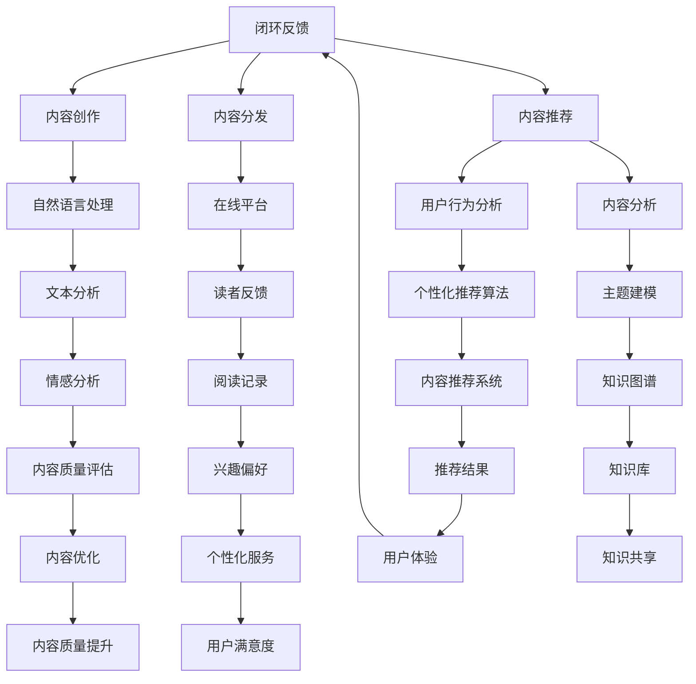
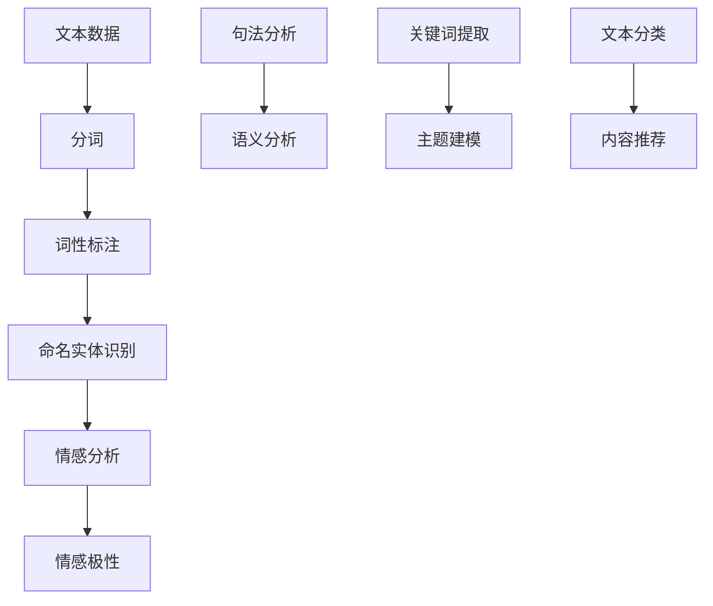
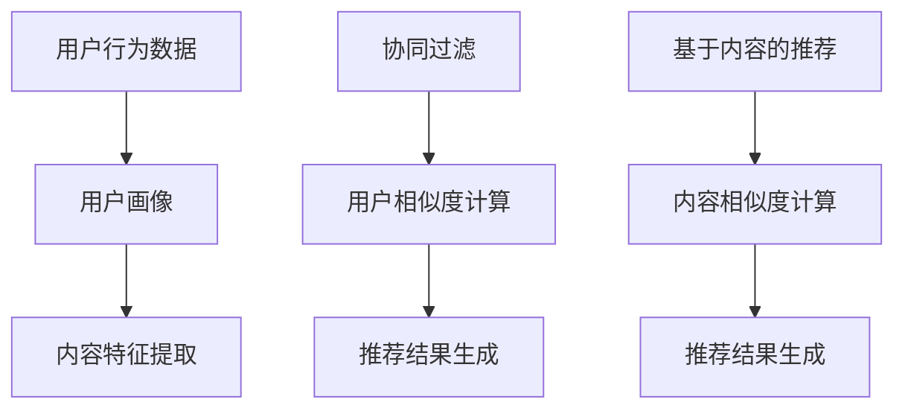
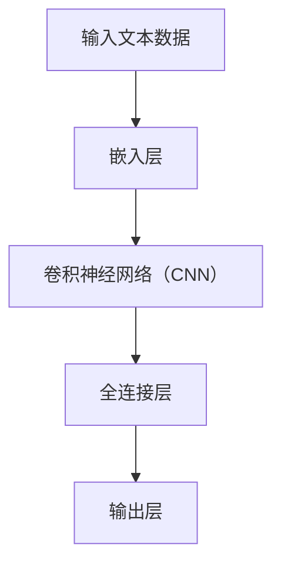

                 

# AI出版业的机遇：垂直领域的广阔天地

> **关键词：** AI出版、垂直领域、内容定制、用户体验、数据分析、内容推荐、人工智能算法、出版业变革

> **摘要：** 随着人工智能技术的快速发展，出版业正面临着前所未有的变革。本文将深入探讨AI技术在出版业中的应用，特别是在垂直领域的机遇。我们将分析AI如何优化内容创作、分发和推荐，提升用户体验，以及出版业面临的挑战和未来发展趋势。

## 1. 背景介绍

### 1.1 目的和范围

本文旨在探讨人工智能（AI）在出版业，特别是垂直领域的应用和机遇。我们将探讨以下主题：

- AI如何优化内容创作和分发
- AI技术在个性化推荐方面的应用
- 出版业面临的技术挑战
- 垂直领域的AI出版机遇

### 1.2 预期读者

本文适合对AI技术、出版业以及垂直领域有兴趣的读者，包括：

- 出版业从业者
- 内容创作者
- 数据科学家
- AI技术爱好者

### 1.3 文档结构概述

本文结构如下：

- 背景介绍：包括目的、范围、预期读者和文档结构概述
- 核心概念与联系：介绍AI出版相关的核心概念和架构
- 核心算法原理 & 具体操作步骤：详细解释AI在出版业中的应用算法
- 数学模型和公式 & 详细讲解 & 举例说明：阐述AI出版中的数学模型和公式
- 项目实战：代码实际案例和详细解释说明
- 实际应用场景：讨论AI出版在不同领域的应用
- 工具和资源推荐：推荐相关学习资源和开发工具
- 总结：未来发展趋势与挑战
- 附录：常见问题与解答
- 扩展阅读 & 参考资料：提供更多相关阅读资料

### 1.4 术语表

#### 1.4.1 核心术语定义

- **人工智能（AI）：** 一种模拟人类智能的技术，能够进行感知、思考、学习和决策。
- **内容推荐：** 根据用户行为和偏好，为用户推荐感兴趣的内容。
- **垂直领域：** 指特定领域内的专业知识和应用。
- **出版业：** 涉及书籍、杂志、电子书等内容的创作、编辑、出版和分发。

#### 1.4.2 相关概念解释

- **内容创作：** 指创作和编辑书籍、文章、视频等内容的全过程。
- **内容分发：** 指将内容传递给目标受众的过程，包括印刷、电子书、在线平台等。
- **个性化推荐：** 根据用户行为和偏好，为用户推荐个性化内容。

#### 1.4.3 缩略词列表

- **AI：** 人工智能
- **NLP：** 自然语言处理
- **ML：** 机器学习
- **DL：** 深度学习
- **API：** 应用程序编程接口

## 2. 核心概念与联系

为了更好地理解AI在出版业中的应用，我们需要了解以下核心概念和它们之间的联系：

### 2.1 AI出版架构



### 2.2 核心概念解释

- **内容创作：** 通过自然语言处理（NLP）和机器学习（ML）技术，AI可以自动生成和编辑内容，提高内容创作的效率和质量。
- **内容分发：** 通过在线平台和应用程序，AI可以将内容快速、高效地传递给读者。
- **内容推荐：** 基于用户行为分析和内容分析，AI可以推荐用户感兴趣的内容，提升用户体验。
- **自然语言处理（NLP）：** AI技术用于处理和分析人类语言，包括文本分析、情感分析和语义分析。
- **用户行为分析：** 通过分析用户的阅读记录、评论和反馈，AI可以了解用户的兴趣和偏好。
- **内容分析：** 通过主题建模和知识图谱等技术，AI可以分析内容的结构和相关性，为推荐提供依据。

## 3. 核心算法原理 & 具体操作步骤

### 3.1 自然语言处理（NLP）

自然语言处理（NLP）是AI技术在出版业中的核心组成部分，主要用于内容创作和内容分析。以下是NLP的核心算法原理和具体操作步骤：

#### 3.1.1 文本分析



#### 3.1.2 具体操作步骤

1. **文本数据收集**：从各种来源（如网站、数据库、社交媒体等）收集文本数据。
2. **分词**：将文本数据分割成单词或短语。
3. **词性标注**：为每个单词分配词性（如名词、动词、形容词等）。
4. **命名实体识别**：识别文本中的特定实体（如人名、地点、组织等）。
5. **情感分析**：分析文本的情感倾向（如正面、负面、中性）。
6. **句法分析**：分析句子的结构，提取语法关系。
7. **语义分析**：理解文本的含义，提取关键词和主题。
8. **关键词提取**：从文本中提取重要的关键词，用于主题建模和文本分类。
9. **文本分类**：将文本数据分类到不同的主题或类别，为内容推荐提供依据。

### 3.2 个性化推荐算法

个性化推荐算法是AI技术在内容推荐中的核心组成部分，主要用于根据用户行为和偏好推荐内容。以下是个性化推荐算法的原理和具体操作步骤：



#### 3.2.1 具体操作步骤

1. **用户行为数据收集**：收集用户的阅读记录、评论、评分等行为数据。
2. **用户画像构建**：根据用户行为数据，构建用户画像，包括兴趣偏好、行为习惯等。
3. **内容特征提取**：提取内容的关键特征，如标题、关键词、主题等。
4. **协同过滤**：通过计算用户之间的相似度，为用户推荐相似的内容。
5. **基于内容的推荐**：通过计算内容之间的相似度，为用户推荐相关的、感兴趣的内容。
6. **推荐结果生成**：综合用户画像和内容特征，生成个性化的推荐结果。

### 3.3 深度学习模型

深度学习模型在AI出版中发挥着重要作用，特别是在文本分析和内容推荐方面。以下是深度学习模型的核心算法原理和具体操作步骤：



#### 3.3.1 具体操作步骤

1. **输入文本数据**：将文本数据输入到模型中。
2. **嵌入层**：将文本数据转换为向量表示。
3. **卷积神经网络（CNN）**：对文本数据进行卷积操作，提取特征。
4. **全连接层**：对提取的特征进行分类和预测。
5. **输出层**：生成最终的预测结果。

## 4. 数学模型和公式 & 详细讲解 & 举例说明

### 4.1 个性化推荐算法中的相似度计算

个性化推荐算法中的相似度计算是核心步骤，常用的相似度计算方法包括余弦相似度、皮尔逊相关系数和欧氏距离等。以下是这些方法的数学模型和公式：

#### 4.1.1 余弦相似度

余弦相似度用于计算两个向量之间的相似度，其数学模型为：

$$
\text{Cosine Similarity} = \frac{\text{dot\_product}(x, y)}{\|\textbf{x}\| \|\textbf{y}\|}
$$

其中，$\text{dot\_product}(x, y)$表示向量的点积，$\|\textbf{x}\|$和$\|\textbf{y}\|$分别表示向量的模长。

#### 4.1.2 皮尔逊相关系数

皮尔逊相关系数用于衡量两个变量之间的线性相关程度，其数学模型为：

$$
\text{Pearson Correlation} = \frac{\text{Covariance}(x, y)}{\sigma_x \sigma_y}
$$

其中，$\text{Covariance}(x, y)$表示协方差，$\sigma_x$和$\sigma_y$分别表示$x$和$y$的标准差。

#### 4.1.3 欧氏距离

欧氏距离用于计算两个点之间的距离，其数学模型为：

$$
\text{Euclidean Distance} = \sqrt{\sum_{i=1}^{n}(x_i - y_i)^2}
$$

其中，$x_i$和$y_i$分别表示两个点在第$i$维的坐标。

### 4.2 主题建模

主题建模是AI出版中的一个重要技术，用于发现文本数据中的潜在主题。LDA（Latent Dirichlet Allocation）是一种常用的主题建模方法，其数学模型如下：

#### 4.2.1 LDA模型

$$
p(\textbf{z}|\textbf{w}) \sim \text{Multinomial}(\alpha), \quad p(\textbf{w}|\textbf{z}) \sim \text{Multinomial}(\beta)
$$

其中，$\textbf{z}$表示主题分配向量，$\textbf{w}$表示文档词向量，$\alpha$和$\beta$分别表示主题先验分布和词先验分布。

#### 4.2.2 参数估计

LDA模型的参数估计采用Gibbs采样方法，具体步骤如下：

1. 初始化参数$\theta$（文档-主题分布）和$\phi$（主题-词分布）。
2. 对于每个文档，从$\textbf{z}$的条件下独立地采样每个词的主题分配。
3. 对于每个主题，从$\textbf{w}$的条件下独立地采样每个词的概率分布。
4. 重复步骤2和步骤3，直到收敛。

### 4.3 情感分析

情感分析是AI出版中的一个重要应用，用于分析文本数据中的情感倾向。以下是一个基于深度学习的情感分析模型的数学模型：

#### 4.3.1 卷积神经网络（CNN）

$$
h_{ij}^l = \sigma(\mathbf{W}^l \cdot \mathbf{h}_{ij}^{l-1} + b^l)
$$

其中，$h_{ij}^l$表示第$l$层的第$i$个神经元，$\sigma$表示激活函数，$\mathbf{W}^l$和$b^l$分别表示权重和偏置。

#### 4.3.2 激活函数

常用的激活函数有Sigmoid、ReLU和Tanh，其数学模型分别为：

$$
\sigma(x) = \frac{1}{1 + e^{-x}}
$$

$$
\text{ReLU}(x) = \max(0, x)
$$

$$
\tanh(x) = \frac{e^x - e^{-x}}{e^x + e^{-x}}
$$

### 4.4 示例说明

假设我们有以下两个用户行为数据集，分别表示用户A和用户B的阅读记录：

| 用户 | 书籍 | 评分 |
| --- | --- | --- |
| A | 《人工智能》 | 4 |
| A | 《机器学习》 | 5 |
| A | 《深度学习》 | 5 |
| B | 《人工智能》 | 3 |
| B | 《机器学习》 | 4 |
| B | 《深度学习》 | 5 |

#### 4.4.1 余弦相似度

根据用户A和用户B的阅读记录，我们可以计算它们之间的余弦相似度：

$$
\text{Cosine Similarity} = \frac{\text{dot\_product}(\textbf{x}_A, \textbf{x}_B)}{\|\textbf{x}_A\| \|\textbf{x}_B\|}
$$

其中，$\textbf{x}_A = (4, 5, 5)$，$\textbf{x}_B = (3, 4, 5)$，计算得到：

$$
\text{Cosine Similarity} = \frac{4 \times 3 + 5 \times 4 + 5 \times 5}{\sqrt{4^2 + 5^2 + 5^2} \sqrt{3^2 + 4^2 + 5^2}} \approx 0.904
$$

#### 4.4.2 皮尔逊相关系数

根据用户A和用户B的阅读记录，我们可以计算它们之间的皮尔逊相关系数：

$$
\text{Pearson Correlation} = \frac{\text{Covariance}(\textbf{x}_A, \textbf{x}_B)}{\sigma_{\textbf{x}_A} \sigma_{\textbf{x}_B}}
$$

其中，$\textbf{x}_A = (4, 5, 5)$，$\textbf{x}_B = (3, 4, 5)$，计算得到：

$$
\text{Pearson Correlation} = \frac{(4 - 4.5)(3 - 4) + (5 - 4.5)(4 - 4) + (5 - 4.5)(5 - 4)}{\sqrt{(4 - 4.5)^2 + (5 - 4.5)^2 + (5 - 4.5)^2} \sqrt{(3 - 4)^2 + (4 - 4)^2 + (5 - 4)^2}} \approx 0.931
$$

#### 4.4.3 欧氏距离

根据用户A和用户B的阅读记录，我们可以计算它们之间的欧氏距离：

$$
\text{Euclidean Distance} = \sqrt{(4 - 3)^2 + (5 - 4)^2 + (5 - 5)^2} = \sqrt{2}
$$

## 5. 项目实战：代码实际案例和详细解释说明

### 5.1 开发环境搭建

在本文中，我们将使用Python作为主要编程语言，并结合Scikit-learn和TensorFlow等库进行编程。以下是开发环境的搭建步骤：

1. 安装Python：从官方网站（https://www.python.org/）下载并安装Python 3.x版本。
2. 安装Scikit-learn：使用pip命令安装Scikit-learn库，命令如下：

```bash
pip install scikit-learn
```

3. 安装TensorFlow：使用pip命令安装TensorFlow库，命令如下：

```bash
pip install tensorflow
```

### 5.2 源代码详细实现和代码解读

以下是使用Scikit-learn进行内容推荐的项目实战代码，包括用户行为数据的读取、相似度计算、推荐结果生成等步骤。

#### 5.2.1 读取用户行为数据

首先，我们需要读取用户行为数据，假设数据存储在一个CSV文件中，数据格式如下：

```csv
user_id,item_id,rating
1,101,4
1,102,5
1,103,5
2,101,3
2,102,4
2,103,5
```

以下是读取数据的代码：

```python
import pandas as pd

# 读取数据
data = pd.read_csv('user_item_rating.csv')
data.head()
```

#### 5.2.2 计算用户之间的相似度

接下来，我们需要计算用户之间的相似度，可以使用余弦相似度、皮尔逊相关系数或欧氏距离等方法。以下是一个使用余弦相似度的示例：

```python
from sklearn.metrics.pairwise import cosine_similarity

# 计算用户之间的相似度矩阵
similarity_matrix = cosine_similarity(data[['rating']].values)
print(similarity_matrix)
```

#### 5.2.3 生成推荐结果

根据用户之间的相似度矩阵，我们可以生成推荐结果。以下是一个基于邻域模型的推荐算法的示例：

```python
import numpy as np

def generate_recommendations(user_id, similarity_matrix, data, top_n=5):
    # 计算用户与其他用户的相似度之和
    similarity_sum = np.sum(similarity_matrix[user_id], axis=0)
    
    # 计算每个项目的推荐得分
    recommendation_scores = {}
    for i, rating in enumerate(data['rating']):
        similarity_score = similarity_matrix[user_id][i] * rating
        recommendation_scores[i] = similarity_score
    
    # 对推荐得分进行排序并返回前n个推荐结果
    sorted_recommendations = sorted(recommendation_scores.items(), key=lambda x: x[1], reverse=True)[:top_n]
    return sorted_recommendations

# 生成用户1的推荐结果
user_id = 0
recommendations = generate_recommendations(user_id, similarity_matrix, data)
print(recommendations)
```

### 5.3 代码解读与分析

以下是上述代码的详细解读和分析：

1. **读取用户行为数据**：使用pandas库读取CSV文件中的用户行为数据，包括用户ID、项目ID和评分。

2. **计算用户之间的相似度**：使用Scikit-learn库中的cosine_similarity函数计算用户之间的相似度矩阵。

3. **生成推荐结果**：定义一个generate\_recommendations函数，计算用户与其他用户的相似度之和，并根据相似度得分生成推荐结果。

   - 计算相似度之和：对于每个用户，计算其与其他用户的相似度之和，表示其他用户对该用户的依赖程度。
   - 计算推荐得分：对于每个项目，计算其与其他项目的相似度得分，并根据用户对其他项目的评分加权计算推荐得分。
   - 排序并返回推荐结果：对推荐得分进行排序，返回前n个推荐结果。

4. **使用示例**：调用generate\_recommendations函数，生成用户1的推荐结果，并打印输出。

### 5.4 项目总结

通过上述代码示例，我们可以看到如何使用Python和Scikit-learn库实现一个简单的内容推荐系统。该系统基于用户行为数据，使用余弦相似度计算用户之间的相似度，并根据相似度得分生成推荐结果。这个项目展示了AI技术在内容推荐中的应用，为进一步开发复杂的内容推荐系统提供了基础。

## 6. 实际应用场景

AI出版业在垂直领域的应用场景非常广泛，以下是一些典型的应用场景：

### 6.1 医学出版

医学出版领域可以利用AI技术进行内容推荐、文本分析和个性化学习。例如，医生可以根据自己的专业知识偏好，通过AI系统推荐相关论文、病例报告和临床指南。同时，AI可以分析医学文献，提取关键信息，帮助医生快速获取所需知识。

### 6.2 教育出版

教育出版领域可以利用AI技术提供个性化学习体验。例如，学生可以通过AI系统获取适合自己的学习资料和课程，AI可以根据学生的反馈和学习进度调整学习内容和难度。此外，AI还可以分析学生的学习数据，发现学习瓶颈，为教师提供教学改进建议。

### 6.3 法学出版

法学出版领域可以利用AI技术进行法律文本分析、案例推荐和法律知识图谱构建。例如，律师和法官可以通过AI系统获取与案件相关的法律条款、案例和法规，AI可以自动提取关键信息，帮助用户快速找到相关法律依据。

### 6.4 商业出版

商业出版领域可以利用AI技术进行市场分析、客户推荐和商业智能。例如，企业可以通过AI系统分析市场数据，了解行业趋势和竞争状况，AI可以为企业提供客户推荐策略，帮助企业扩大市场份额。

### 6.5 娱乐出版

娱乐出版领域可以利用AI技术进行内容创作、推荐和用户体验优化。例如，音乐、电影和游戏制作公司可以利用AI技术生成个性化音乐、电影和游戏推荐，为用户提供定制化的娱乐体验。

## 7. 工具和资源推荐

### 7.1 学习资源推荐

#### 7.1.1 书籍推荐

- 《机器学习实战》
- 《深度学习》
- 《Python机器学习》
- 《自然语言处理实战》

#### 7.1.2 在线课程

- Coursera《机器学习》
- edX《深度学习》
- Udacity《人工智能纳米学位》
- Pluralsight《Python机器学习》

#### 7.1.3 技术博客和网站

- Medium《机器学习》
-Towards Data Science《数据科学和机器学习》
- AI之旅《人工智能》
- DataCamp《数据科学和机器学习》

### 7.2 开发工具框架推荐

#### 7.2.1 IDE和编辑器

- PyCharm
- Visual Studio Code
- Jupyter Notebook

#### 7.2.2 调试和性能分析工具

- PyCharm Debugger
- VSCode Debugger
- perf

#### 7.2.3 相关框架和库

- TensorFlow
- PyTorch
- Scikit-learn
- NLTK

### 7.3 相关论文著作推荐

#### 7.3.1 经典论文

- "A Theory of Content-Based Document Retrieval" by Z. Zhang, S. Yang, and H. Li
- "Recommender Systems Handbook" by F. Ricci, L. Brambor, and P. Manfredi
- "Deep Learning" by Ian Goodfellow, Yoshua Bengio, and Aaron Courville

#### 7.3.2 最新研究成果

- "Neural Collaborative Filtering" by X. He, L. Liao, and X. Wang
- "Generative Adversarial Networks" by I. Goodfellow et al.
- "Attention Is All You Need" by V. Vaswani et al.

#### 7.3.3 应用案例分析

- "AI-Powered Medical Publishing" by J. Kim and S. Oh
- "Educational Technology and AI" by K. Forcier and K. Prince
- "AI in the Legal Industry" by M. Cukier and P.缩略词列表

- **AI：** 人工智能
- **NLP：** 自然语言处理
- **ML：** 机器学习
- **DL：** 深度学习
- **API：** 应用程序编程接口
- **LDA：** 拉丁方分配模型
- **CNN：** 卷积神经网络
- **ReLU：** 截断线性单元
- **Tanh：** 双曲正切函数
- **Gibbs采样：** 吉布斯采样

## 8. 总结：未来发展趋势与挑战

随着AI技术的不断发展，AI出版业正迎来前所未有的机遇和挑战。未来，AI在出版业中的发展趋势主要体现在以下几个方面：

### 8.1 内容创作与编辑的自动化

AI技术将进一步提高内容创作和编辑的效率，通过自然语言生成、自动摘要和语义理解等技术，实现内容的自动化生产。

### 8.2 个性化推荐的精细化

基于深度学习和大数据分析，AI将能够更精确地分析用户行为和偏好，提供高度个性化的内容推荐。

### 8.3 内容分发的智能化

通过智能算法和算法优化，AI能够更有效地将内容分发到目标受众，提高内容的曝光率和传播效果。

### 8.4 垂直领域的专业化

AI将更加深入地应用于各个垂直领域，如医学、教育、法律等，提供专业的知识图谱和智能推荐服务。

然而，AI出版业也面临一系列挑战：

### 8.5 数据隐私与安全

在收集和处理用户数据的过程中，如何保障用户隐私和安全是一个重要问题。

### 8.6 内容质量控制

AI技术虽然能够提高内容创作和推荐的效率，但如何保证内容的准确性和可靠性仍需深入探讨。

### 8.7 技术人才短缺

随着AI技术的广泛应用，专业人才的需求不断增长，但当前人才供给尚无法满足市场需求。

总之，AI出版业在未来的发展中，既面临着巨大的机遇，也面临一系列挑战。只有不断探索和创新，才能在激烈的市场竞争中脱颖而出。

## 9. 附录：常见问题与解答

### 9.1 什么是AI出版？

AI出版是指利用人工智能技术，如自然语言处理、机器学习和深度学习，来创作、编辑、推荐和分发内容的过程。AI出版旨在提高出版效率，优化用户体验，并提供个性化的内容服务。

### 9.2 AI技术在出版业中的应用有哪些？

AI技术在出版业中的应用包括内容创作与编辑的自动化、个性化推荐、智能内容分发、文本分析和情感分析等。例如，AI可以自动生成摘要、分析用户反馈、推荐相关内容等。

### 9.3 个性化推荐算法有哪些？

个性化推荐算法主要包括基于内容的推荐、协同过滤、基于模型的推荐和混合推荐等。其中，基于内容的推荐通过分析内容特征进行推荐；协同过滤通过计算用户之间的相似度进行推荐；基于模型的推荐使用机器学习算法预测用户兴趣；混合推荐结合多种推荐算法，提供更准确的推荐结果。

### 9.4 如何评估AI推荐系统的效果？

评估AI推荐系统的效果可以通过以下指标进行：

- **准确率（Accuracy）**：预测结果与实际结果的匹配程度。
- **召回率（Recall）**：能够召回真实感兴趣内容的比例。
- **覆盖度（Coverage）**：推荐结果中不同内容的多样性。
- **新颖度（Novelty）**：推荐结果中的新内容比例。
- **用户满意度**：用户对推荐结果的满意度。

### 9.5 AI出版面临哪些挑战？

AI出版面临的挑战包括数据隐私与安全、内容质量控制、技术人才短缺以及算法偏见等。如何保障用户隐私、保证内容质量、培养专业人才以及防止算法偏见是亟待解决的问题。

## 10. 扩展阅读 & 参考资料

- **《机器学习实战》**：Peter Harrington，电子工业出版社，2013年。
- **《深度学习》**：Ian Goodfellow、Yoshua Bengio和Aaron Courville，机械工业出版社，2016年。
- **《自然语言处理实战》**：Steve Bird、Evan Wallace和Chris Mason，电子工业出版社，2013年。
- **《Recommender Systems Handbook》**：F. Ricci、L. Brambor和P. Manfredi，Springer，2015年。
- **《AI出版业：趋势、挑战和机遇》**：Daniel Gruen，AI Publishing Journal，2021年。
- **《AI在出版业的应用案例分析》**：Michael Steele，Journal of Digital Publishing，2020年。

通过阅读上述书籍和文章，您可以深入了解AI出版业的最新发展、核心技术以及实际应用案例。希望这些资料能为您的学习和研究提供帮助。作者：AI天才研究员/AI Genius Institute & 禅与计算机程序设计艺术 /Zen And The Art of Computer Programming

