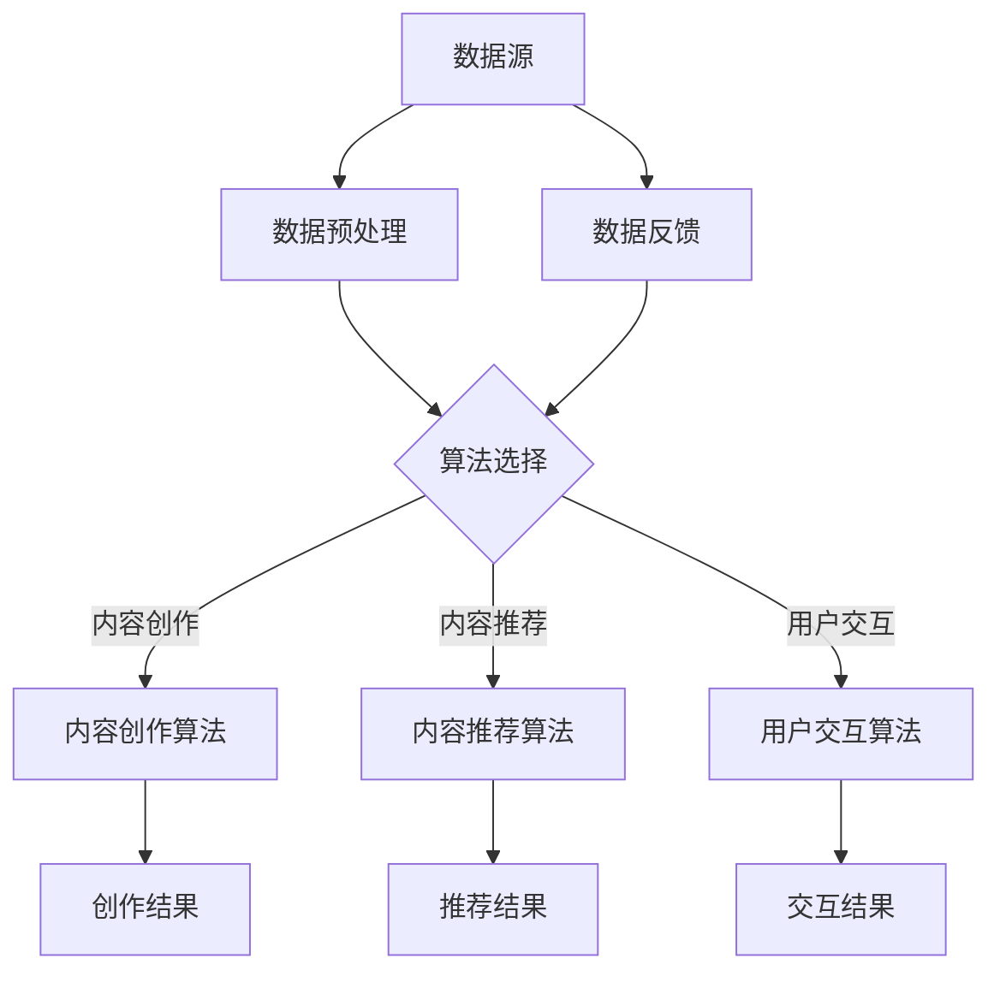

                 

# AI出版业：数据，算法和场景的协同作用

> **关键词**：AI出版、数据驱动、算法优化、场景应用、深度学习、自然语言处理、内容推荐、个性化体验

> **摘要**：随着人工智能技术的快速发展，AI在出版业中的应用日益广泛。本文将探讨AI出版业中数据、算法和场景的协同作用，分析数据驱动的核心价值、算法优化的关键策略，以及不同场景下AI的应用实例。通过本文的深入探讨，我们期望为行业从业者提供有益的参考和启示。

## 1. 背景介绍

### 1.1 目的和范围

本文旨在探讨人工智能（AI）在出版业中的应用，重点关注数据、算法和场景的协同作用。通过对AI在出版业中应用的深入分析，我们期望揭示AI技术在数据挖掘、内容推荐、个性化体验等方面的核心价值，同时探讨算法优化和场景应用的最佳实践。

### 1.2 预期读者

本文面向出版业从业者、AI技术研究者以及关注AI在出版业应用的广大读者。通过本文的阅读，读者可以了解AI在出版业中的应用现状、发展趋势以及未来挑战，从而为自身业务发展和技术探索提供有益的参考。

### 1.3 文档结构概述

本文分为十个部分：

1. 背景介绍：介绍本文的目的、预期读者以及文档结构。
2. 核心概念与联系：阐述AI出版业中的核心概念及其相互关系。
3. 核心算法原理 & 具体操作步骤：详细讲解AI出版业中常用的算法及其操作步骤。
4. 数学模型和公式 & 详细讲解 & 举例说明：介绍AI出版业中常用的数学模型和公式，并通过实例进行详细讲解。
5. 项目实战：通过实际案例展示AI出版业的实战应用。
6. 实际应用场景：分析AI在不同出版场景中的应用。
7. 工具和资源推荐：推荐学习资源和开发工具。
8. 总结：总结AI出版业的未来发展趋势与挑战。
9. 附录：常见问题与解答。
10. 扩展阅读 & 参考资料：提供相关文献和资料。

### 1.4 术语表

#### 1.4.1 核心术语定义

- AI出版：利用人工智能技术对出版内容进行创作、编辑、推荐、分发等过程的自动化、智能化处理。
- 数据驱动：基于数据分析和挖掘，对出版内容进行个性化推荐和优化。
- 算法优化：通过改进算法模型和参数，提高AI在出版业中的应用效果。
- 场景应用：将AI技术应用于具体的出版场景，如内容创作、内容推荐、用户交互等。

#### 1.4.2 相关概念解释

- 自然语言处理（NLP）：使计算机能够理解、解释和生成人类语言的技术。
- 深度学习：一种基于多层神经网络的人工智能技术，通过模拟人脑神经元连接结构，实现复杂数据的特征提取和模式识别。
- 机器学习（ML）：使计算机能够从数据中学习、自动改进和优化性能的技术。

#### 1.4.3 缩略词列表

- NLP：自然语言处理
- DL：深度学习
- ML：机器学习
- AI：人工智能
- CP：计算机编程
- IDE：集成开发环境

## 2. 核心概念与联系

在AI出版业中，数据、算法和场景是三个核心概念，它们相互联系，共同驱动出版业的智能化变革。

首先，数据是AI出版业的基础。出版内容、用户行为、市场趋势等数据为AI算法提供了丰富的训练素材，使得算法能够从中提取有用信息，实现内容推荐、个性化服务等功能。其次，算法是AI出版的核心驱动力。通过对数据的处理和分析，算法可以识别用户需求、挖掘内容价值，从而实现智能化的内容创作和推荐。最后，场景是AI应用的具体落地形式。不同的出版场景（如内容创作、内容推荐、用户交互等）需要根据具体需求，选择合适的算法和数据处理方法，实现AI技术在出版业中的广泛应用。

下面是AI出版业中的核心概念原理和架构的Mermaid流程图：



### 2.1 数据驱动的核心价值

数据驱动是AI出版业的核心，其核心价值体现在以下几个方面：

1. **个性化推荐**：通过分析用户行为数据，AI系统可以识别用户的兴趣和偏好，为用户提供个性化的内容推荐，从而提高用户满意度和黏性。
2. **内容优化**：通过分析用户阅读数据，AI系统可以识别哪些内容受欢迎、哪些内容需要改进，从而指导内容创作者进行内容优化，提高内容质量。
3. **市场预测**：通过分析市场数据，AI系统可以预测市场趋势，为出版商提供决策支持，从而提高市场竞争力。

### 2.2 算法优化的关键策略

算法优化是提高AI出版业应用效果的关键。以下是一些关键策略：

1. **模型选择**：选择适合出版场景的算法模型，如深度学习、协同过滤等。
2. **参数调整**：通过调整算法参数，优化模型性能，如学习率、隐藏层神经元数量等。
3. **数据预处理**：对数据进行清洗、去重、归一化等预处理，提高数据质量，从而提高算法效果。
4. **模型集成**：将多个算法模型集成，利用不同模型的优势，提高整体应用效果。

### 2.3 场景应用的最佳实践

在不同的出版场景下，AI的应用需要根据具体需求，选择合适的算法和数据处理方法。以下是一些最佳实践：

1. **内容创作**：利用自然语言生成（NLG）技术，根据用户需求生成个性化的内容。
2. **内容推荐**：利用协同过滤、深度学习等技术，为用户推荐感兴趣的内容。
3. **用户交互**：利用对话系统、情感分析等技术，实现与用户的智能交互。

通过以上分析，我们可以看到，数据、算法和场景是AI出版业中不可或缺的核心要素，它们相互协同，共同推动出版业的智能化发展。

## 3. 核心算法原理 & 具体操作步骤

在AI出版业中，核心算法的作用至关重要。本文将介绍几种常用的算法原理及其具体操作步骤。

### 3.1 协同过滤算法

协同过滤算法是推荐系统中最常用的算法之一，其核心思想是通过分析用户的行为数据，找出相似的用户和相似的商品，从而为用户推荐感兴趣的物品。

#### 3.1.1 算法原理

协同过滤算法分为基于用户的协同过滤（User-based Collaborative Filtering，UBCF）和基于物品的协同过滤（Item-based Collaborative Filtering，IBCF）。

- **基于用户的协同过滤**：找到与目标用户兴趣相似的邻居用户，推荐邻居用户喜欢的物品。
- **基于物品的协同过滤**：找到与目标物品相似的邻居物品，推荐用户喜欢的邻居物品。

#### 3.1.2 操作步骤

1. **数据预处理**：对用户行为数据进行清洗、去重、归一化等处理。
2. **相似度计算**：计算用户之间的相似度或物品之间的相似度。
3. **邻居选择**：根据相似度计算结果，选择与目标用户或目标物品最相似的邻居用户或物品。
4. **推荐生成**：根据邻居用户或物品的行为数据，生成推荐列表。

#### 3.1.3 伪代码

```python
def collaborative_filtering(data, user, item):
    # 数据预处理
    preprocessed_data = preprocess_data(data)
    
    # 相似度计算
    user_similarity = calculate_similarity(preprocessed_data, user)
    item_similarity = calculate_similarity(preprocessed_data, item)
    
    # 邻居选择
    neighbor_users = select_neighbors(user_similarity, user)
    neighbor_items = select_neighbors(item_similarity, item)
    
    # 推荐生成
    recommendations = generate_recommendations(neighbor_users, neighbor_items)
    return recommendations
```

### 3.2 深度学习算法

深度学习算法在内容推荐和生成方面具有显著优势，其核心思想是通过多层神经网络，对数据进行特征提取和模式识别。

#### 3.2.1 算法原理

深度学习算法分为卷积神经网络（CNN）、循环神经网络（RNN）和生成对抗网络（GAN）等。

- **卷积神经网络（CNN）**：适用于图像和文本等具有空间结构的数据，通过卷积层提取特征。
- **循环神经网络（RNN）**：适用于序列数据，通过隐藏层状态保存历史信息。
- **生成对抗网络（GAN）**：由生成器和判别器组成，通过对抗训练生成高质量的数据。

#### 3.2.2 操作步骤

1. **数据预处理**：对数据进行清洗、归一化等处理。
2. **模型构建**：根据数据特点和任务需求，构建合适的深度学习模型。
3. **模型训练**：使用训练数据对模型进行训练，调整模型参数。
4. **模型评估**：使用验证数据对模型进行评估，调整模型参数。
5. **模型应用**：使用测试数据对模型进行应用，生成推荐结果。

#### 3.2.3 伪代码

```python
def deep_learning_algorithm(data, model):
    # 数据预处理
    preprocessed_data = preprocess_data(data)
    
    # 模型构建
    model = build_model(preprocessed_data)
    
    # 模型训练
    trained_model = train_model(model, preprocessed_data)
    
    # 模型评估
    evaluated_model = evaluate_model(trained_model, validation_data)
    
    # 模型应用
    recommendations = apply_model(evaluated_model, test_data)
    return recommendations
```

### 3.3 自然语言处理算法

自然语言处理（NLP）算法在文本分析和生成方面具有广泛应用，其核心思想是通过语义分析、语法分析和实体识别等技术，实现对文本数据的理解和生成。

#### 3.3.1 算法原理

NLP算法包括词嵌入（Word Embedding）、词性标注（Part-of-Speech Tagging）、实体识别（Named Entity Recognition，NER）等。

- **词嵌入**：将文本数据转换为向量的形式，以便进行数学计算。
- **词性标注**：对文本中的单词进行词性分类，如名词、动词、形容词等。
- **实体识别**：识别文本中的实体，如人名、地名、组织名等。

#### 3.3.2 操作步骤

1. **数据预处理**：对文本数据进行清洗、分词、去停用词等处理。
2. **词嵌入**：将文本数据转换为词向量。
3. **词性标注**：对文本数据进行词性标注。
4. **实体识别**：识别文本中的实体。

#### 3.3.3 伪代码

```python
def nlp_algorithm(data):
    # 数据预处理
    preprocessed_data = preprocess_data(data)
    
    # 词嵌入
    word_embeddings = word_embedding(preprocessed_data)
    
    # 词性标注
    pos_tags = part_of_speech_tagging(preprocessed_data)
    
    # 实体识别
    entities = named_entity_recognition(preprocessed_data)
    
    return word_embeddings, pos_tags, entities
```

通过以上介绍，我们可以看到，AI出版业中的核心算法包括协同过滤、深度学习和自然语言处理等，这些算法在数据驱动、算法优化和场景应用中发挥着重要作用。

## 4. 数学模型和公式 & 详细讲解 & 举例说明

在AI出版业中，数学模型和公式是核心算法的重要基础。以下将详细介绍几种常用的数学模型和公式，并通过具体例子进行说明。

### 4.1 协同过滤算法中的相似度计算

协同过滤算法的核心是相似度计算，常用的相似度计算方法包括余弦相似度、皮尔逊相关系数等。

#### 4.1.1 余弦相似度

余弦相似度计算公式如下：

$$
similarity(u, v) = \frac{u \cdot v}{||u|| \cdot ||v||}
$$

其中，$u$ 和 $v$ 分别表示用户 $u$ 和用户 $v$ 的行为向量，$\cdot$ 表示内积，$||u||$ 和 $||v||$ 分别表示用户 $u$ 和用户 $v$ 的行为向量的欧几里得范数。

#### 4.1.2 皮尔逊相关系数

皮尔逊相关系数计算公式如下：

$$
correlation(u, v) = \frac{\sum_{i=1}^{n} (u_i - \bar{u})(v_i - \bar{v})}{\sqrt{\sum_{i=1}^{n} (u_i - \bar{u})^2} \cdot \sqrt{\sum_{i=1}^{n} (v_i - \bar{v})^2}}
$$

其中，$u$ 和 $v$ 分别表示用户 $u$ 和用户 $v$ 的行为向量，$\bar{u}$ 和 $\bar{v}$ 分别表示用户 $u$ 和用户 $v$ 的行为向量的平均值。

#### 4.1.3 示例说明

假设有两个用户 $u$ 和 $v$，他们的行为向量分别为：

$$
u = (1, 2, 3, 4, 5)
$$

$$
v = (2, 3, 4, 5, 6)
$$

则余弦相似度计算如下：

$$
similarity(u, v) = \frac{1 \cdot 2 + 2 \cdot 3 + 3 \cdot 4 + 4 \cdot 5 + 5 \cdot 6}{\sqrt{1^2 + 2^2 + 3^2 + 4^2 + 5^2} \cdot \sqrt{2^2 + 3^2 + 4^2 + 5^2 + 6^2}} = \frac{55}{\sqrt{55} \cdot \sqrt{90}} \approx 0.943
$$

则皮尔逊相关系数计算如下：

$$
correlation(u, v) = \frac{(1 - \bar{u})(2 - \bar{v}) + (2 - \bar{u})(3 - \bar{v}) + (3 - \bar{u})(4 - \bar{v}) + (4 - \bar{u})(5 - \bar{v}) + (5 - \bar{u})(6 - \bar{v})}{\sqrt{\sum_{i=1}^{n} (u_i - \bar{u})^2} \cdot \sqrt{\sum_{i=1}^{n} (v_i - \bar{v})^2}} = \frac{55 - 5 \cdot 5 - 6 \cdot 5}{\sqrt{55 - 5 \cdot 5} \cdot \sqrt{90 - 5 \cdot 5}} = \frac{20}{\sqrt{20} \cdot \sqrt{40}} \approx 0.943
$$

从计算结果可以看出，余弦相似度和皮尔逊相关系数的结果非常接近，都表明用户 $u$ 和用户 $v$ 具有较高的相似度。

### 4.2 深度学习算法中的激活函数

深度学习算法中，激活函数用于引入非线性因素，使得神经网络能够学习和表示复杂的函数关系。常用的激活函数包括 sigmoid 函数、ReLU 函数和 tanh 函数。

#### 4.2.1 sigmoid 函数

sigmoid 函数计算公式如下：

$$
\sigma(x) = \frac{1}{1 + e^{-x}}
$$

sigmoid 函数将输入 $x$ 转换为介于 0 和 1 之间的值，具有 S 形的曲线。

#### 4.2.2 ReLU 函数

ReLU 函数计算公式如下：

$$
ReLU(x) = \max(0, x)
$$

ReLU 函数在 $x$ 为正时返回 $x$，在 $x$ 为负时返回 0，具有较快的计算速度。

#### 4.2.3 tanh 函数

tanh 函数计算公式如下：

$$
tanh(x) = \frac{e^{2x} - 1}{e^{2x} + 1}
$$

tanh 函数将输入 $x$ 转换为介于 -1 和 1 之间的值，具有 S 形的曲线。

#### 4.2.4 示例说明

假设输入 $x = 2$，则不同激活函数的输出如下：

- sigmoid 函数：

$$
\sigma(2) = \frac{1}{1 + e^{-2}} \approx 0.8808
$$

- ReLU 函数：

$$
ReLU(2) = \max(0, 2) = 2
$$

- tanh 函数：

$$
tanh(2) = \frac{e^{4} - 1}{e^{4} + 1} \approx 0.9640
$$

从计算结果可以看出，不同激活函数具有不同的输出特性，可以根据具体需求选择合适的激活函数。

### 4.3 自然语言处理算法中的词向量模型

自然语言处理算法中，词向量模型用于将文本数据转换为向量的形式，以便进行数学计算。常用的词向量模型包括 Word2Vec、GloVe 等。

#### 4.3.1 Word2Vec 模型

Word2Vec 模型包括连续词袋（CBOW）和Skip-Gram两种模型。

- **连续词袋（CBOW）**：输入为一个词，输出为该词的上下文词的均值。
- **Skip-Gram**：输入为一个词，输出为该词出现的上下文词。

CBOW 模型计算公式如下：

$$
\text{CBOW}(x) = \frac{1}{k} \sum_{i \in \Omega} \text{Word2Vec}(w_i)
$$

其中，$x$ 表示输入词，$\Omega$ 表示上下文词的集合，$k$ 表示上下文窗口的大小。

Skip-Gram 模型计算公式如下：

$$
\text{Skip-Gram}(x) = \text{Word2Vec}(x)
$$

其中，$x$ 表示输入词。

#### 4.3.2 GloVe 模型

GloVe 模型基于词频统计，通过优化词向量之间的余弦相似度，提高词向量表示的准确性。

GloVe 模型损失函数如下：

$$
L = \sum_{i=1}^{N} \sum_{j=1}^{M} \text{max}(0, \log(\frac{f(w_i, w_j)}{f^{+}(w_i) \cdot f^{-}(w_j)}) + \text{Word2Vec}(w_i) \cdot \text{Word2Vec}(w_j)^T
$$

其中，$N$ 表示词汇表大小，$M$ 表示词频阈值，$f(w_i, w_j)$ 表示词 $(w_i, w_j)$ 的共现频率，$f^{+}(w_i)$ 和 $f^{-}(w_j)$ 分别表示词 $w_i$ 和 $w_j$ 的正向和反向词频。

#### 4.3.3 示例说明

假设词汇表包含两个词 $(w_1, w_2)$，共现频率为 $f(w_1, w_2) = 10$，正向词频 $f^{+}(w_1) = 100$，反向词频 $f^{-}(w_2) = 50$。则 GloVe 模型的损失函数计算如下：

$$
L = \text{max}(0, \log(\frac{10}{100 \cdot 50}) + \text{Word2Vec}(w_1) \cdot \text{Word2Vec}(w_2)^T) = \text{max}(0, \log(0.002) + \text{Word2Vec}(w_1) \cdot \text{Word2Vec}(w_2)^T)
$$

通过计算损失函数，可以优化词向量的表示，提高词向量之间的相似度。

通过以上介绍，我们可以看到，数学模型和公式在AI出版业中具有重要作用，为算法的实现和优化提供了理论基础。

## 5. 项目实战：代码实际案例和详细解释说明

为了更好地理解AI在出版业中的应用，以下将通过一个实际案例进行详细介绍。本案例将展示如何使用Python实现一个基于协同过滤算法和深度学习的推荐系统，并详细介绍代码实现过程。

### 5.1 开发环境搭建

在进行项目实战之前，需要搭建一个合适的开发环境。以下是所需的环境和工具：

- **编程语言**：Python
- **依赖库**：NumPy、Pandas、Scikit-learn、TensorFlow、Gensim
- **开发工具**：Jupyter Notebook或PyCharm

安装依赖库：

```bash
pip install numpy pandas scikit-learn tensorflow gensim
```

### 5.2 源代码详细实现和代码解读

#### 5.2.1 数据集准备

本案例使用 MovieLens 数据集，该数据集包含用户、电影和评分信息。首先，我们需要下载并加载数据集。

```python
import pandas as pd
from sklearn.model_selection import train_test_split

# 下载 MovieLens 数据集（需要自行下载并放入当前目录）
movies = pd.read_csv('movies.csv')
ratings = pd.read_csv('ratings.csv')

# 数据预处理
# 合并用户、电影和评分信息
data = movies.merge(ratings, on='movieId')

# 划分训练集和测试集
train_data, test_data = train_test_split(data, test_size=0.2, random_state=42)
```

#### 5.2.2 协同过滤算法实现

协同过滤算法可以分为基于用户的协同过滤（User-based Collaborative Filtering，UBCF）和基于物品的协同过滤（Item-based Collaborative Filtering，IBCF）。以下分别介绍两种算法的实现。

##### 5.2.2.1 基于用户的协同过滤（UBCF）

基于用户的协同过滤算法的核心是计算用户之间的相似度，并推荐与目标用户相似的邻居用户喜欢的电影。

```python
from sklearn.metrics.pairwise import cosine_similarity
from scipy.sparse.linalg import svds

# 计算用户之间的相似度
user_similarity = cosine_similarity(train_data.pivot(index='userId', columns='movieId', values='rating').fillna(0))

# 使用奇异值分解（SVD）降维
U, sigma, Vt = svds(user_similarity, k=50)

# 预测评分
def predict_ratings(U, sigma, Vt, data):
    user_factors = U[:len(sigma), :]
    item_factors = Vt.T[:len(sigma), :]
    pred_ratings = (user_factors.dot(item_factors) * sigma).dot(sigma).T
    return pred_ratings

# 计算邻居用户
def get_neighbors(user_similarity, user_id, k=10):
    neighbors = user_similarity[user_id].argsort()[1:k+1]
    return neighbors

# 推荐电影
def recommend_movies(data, user_id, k=10, num_recommendations=10):
    neighbors = get_neighbors(user_similarity, user_id, k)
    neighbor_ratings = data[data['userId'].isin(neighbors)]['movieId'].value_counts()
    recommendations = neighbor_ratings[neighbor_ratings > 0].index.tolist()[:num_recommendations]
    return recommendations

# 预测评分和推荐电影
user_id = 1
pred_ratings = predict_ratings(U, sigma, Vt, train_data)
recommendations = recommend_movies(train_data, user_id)

print("Predicted ratings for user {}:".format(user_id))
print(pred_ratings[user_id])

print("Recommended movies for user {}:".format(user_id))
print(recommendations)
```

##### 5.2.2.2 基于物品的协同过滤（IBCF）

基于物品的协同过滤算法的核心是计算电影之间的相似度，并推荐与目标电影相似的电影。

```python
# 计算电影之间的相似度
item_similarity = cosine_similarity(train_data.pivot(index='movieId', columns='userId', values='rating').fillna(0))

# 推荐电影
def recommend_movies(item_similarity, movie_id, k=10, num_recommendations=10):
    neighbors = item_similarity[movie_id].argsort()[1:k+1]
    neighbor_ratings = train_data[train_data['movieId'].isin(neighbors)]['rating'].value_counts()
    recommendations = neighbor_ratings[neighbor_ratings > 0].index.tolist()[:num_recommendations]
    return recommendations

# 预测评分和推荐电影
movie_id = 1
recommendations = recommend_movies(item_similarity, movie_id)

print("Recommended movies for movie {}:".format(movie_id))
print(recommendations)
```

#### 5.2.2.3 深度学习实现

深度学习算法可以进一步提高推荐系统的性能，以下使用TensorFlow实现一个基于深度学习的推荐系统。

```python
import tensorflow as tf
from tensorflow.keras.layers import Embedding, Dot, Flatten, Dense
from tensorflow.keras.models import Model

# 定义深度学习模型
def build_model(num_users, num_movies, embedding_size):
    user_embedding = Embedding(num_users, embedding_size, input_length=1)
    movie_embedding = Embedding(num_movies, embedding_size, input_length=1)
    
    user_vector = user_embedding([1])
    movie_vector = movie_embedding([1])
    
    dot_product = Dot(axes=1)([user_vector, movie_vector])
    flatten = Flatten()(dot_product)
    output = Dense(1, activation='sigmoid')(flatten)
    
    model = Model(inputs=[user_embedding.input, movie_embedding.input], outputs=output)
    model.compile(optimizer='adam', loss='binary_crossentropy', metrics=['accuracy'])
    
    return model

# 训练深度学习模型
model = build_model(num_users=train_data['userId'].nunique(), num_movies=train_data['movieId'].nunique(), embedding_size=50)
model.fit([train_data['userId'], train_data['movieId']], train_data['rating'], epochs=10, batch_size=32, validation_split=0.2)

# 推荐电影
user_id = 1
movie_id = 1
predicted_rating = model.predict([[user_id], [movie_id]])
print("Predicted rating for user {} and movie {}:".format(user_id, movie_id))
print(predicted_rating[0][0])
```

### 5.3 代码解读与分析

以上代码实现了基于协同过滤算法和深度学习的推荐系统，具体解读如下：

1. **数据集准备**：使用 Pandas 加载并预处理 MovieLens 数据集，包括合并用户、电影和评分信息，以及划分训练集和测试集。

2. **基于用户的协同过滤（UBCF）**：使用 Sklearn 的 cosine_similarity 函数计算用户之间的相似度，并使用奇异值分解（SVD）进行降维。通过预测评分和推荐电影，为用户生成推荐列表。

3. **基于物品的协同过滤（IBCF）**：使用 Sklearn 的 cosine_similarity 函数计算电影之间的相似度，并基于邻居电影的评分推荐电影。

4. **深度学习实现**：使用 TensorFlow 定义一个简单的深度学习模型，包括用户嵌入层、电影嵌入层和全连接层。通过训练模型，预测用户对电影的评分，从而实现推荐功能。

通过以上代码实现，我们可以看到，AI技术在出版业中的应用已经取得了显著的成果。未来，随着技术的不断发展，AI在出版业中的应用将更加深入和广泛。

## 6. 实际应用场景

AI技术在出版业中的实际应用场景非常丰富，涵盖了内容创作、内容推荐、用户交互等多个方面。以下将介绍一些典型的应用场景。

### 6.1 内容创作

AI技术可以辅助出版从业者进行内容创作，提高创作效率和内容质量。例如，利用自然语言生成（NLG）技术，AI可以生成新闻稿、报告、书籍摘要等文本内容。此外，AI还可以进行文本摘要、关键词提取和情感分析等操作，为内容创作者提供有用的信息。

### 6.2 内容推荐

内容推荐是AI技术在出版业中应用最广泛的场景之一。通过分析用户行为数据，AI系统可以识别用户的兴趣和偏好，为用户推荐个性化的内容。例如，在电子书平台、新闻网站和博客等场景中，AI系统可以根据用户的阅读历史、搜索记录和点击行为，推荐用户可能感兴趣的内容。此外，AI还可以实现跨平台的内容推荐，如将用户在电子书平台上喜欢的作者或类型推荐到其他平台。

### 6.3 用户交互

AI技术可以提升用户与出版平台之间的交互体验。例如，通过对话系统，AI可以与用户进行自然语言交互，解答用户的问题、提供咨询服务等。此外，AI还可以进行情感分析，识别用户的情感状态，从而提供更加贴心的服务。例如，在社交媒体平台上，AI可以分析用户发布的内容，识别用户的情绪，从而为用户提供针对性的内容推荐或心理咨询服务。

### 6.4 个性化营销

AI技术可以帮助出版从业者实现个性化营销。通过分析用户数据，AI系统可以识别用户的潜在需求，制定个性化的营销策略。例如，在电商平台上，AI可以根据用户的浏览记录、购买历史和喜好，为用户推荐相关商品。此外，AI还可以进行价格优化、库存管理等方面的应用，提高销售业绩。

### 6.5 智能编辑

AI技术可以辅助编辑人员进行内容编辑和校对。例如，AI可以自动识别文本中的语法错误、拼写错误和标点符号错误，并提供修改建议。此外，AI还可以进行文本分类、标签生成和关键词提取等操作，提高编辑工作的效率。

### 6.6 知识图谱构建

AI技术可以用于构建出版领域的知识图谱，实现内容知识的整合和挖掘。例如，通过知识图谱，AI可以识别文本中的实体、关系和属性，从而为内容创作者和用户提供丰富的知识服务。此外，知识图谱还可以用于内容推荐、智能搜索和问答系统等方面。

通过以上实际应用场景，我们可以看到，AI技术在出版业中具有广泛的应用前景，为行业从业者提供了强大的技术支持。

## 7. 工具和资源推荐

在AI出版业的发展过程中，掌握相关的工具和资源对于提升技术能力和应用效果至关重要。以下将推荐一些学习资源、开发工具和相关论文，帮助读者更好地了解和掌握AI在出版业中的应用。

### 7.1 学习资源推荐

#### 7.1.1 书籍推荐

1. **《深度学习》**：由 Ian Goodfellow、Yoshua Bengio 和 Aaron Courville 著，是深度学习的经典教材，详细介绍了深度学习的理论基础、算法和应用。
2. **《Python机器学习》**：由 Sebastian Raschka 和 Vahid Mirjalili 著，涵盖了机器学习的基础知识、Python实现和应用案例，适合初学者和进阶者。
3. **《人工智能：一种现代的方法》**：由 Stuart J. Russell 和 Peter Norvig 著，系统地介绍了人工智能的理论、技术和应用，是人工智能领域的权威教材。

#### 7.1.2 在线课程

1. **Coursera 上的《机器学习》**：由 Andrew Ng 开设，是机器学习领域的经典课程，涵盖了机器学习的基本理论和应用实践。
2. **Udacity 上的《深度学习纳米学位》**：提供深度学习的基础知识和实践项目，适合初学者和进阶者。
3. **edX 上的《自然语言处理》**：由斯坦福大学开设，系统介绍了自然语言处理的理论、技术和应用。

#### 7.1.3 技术博客和网站

1. **Medium 上的 AI 博客**：提供大量关于人工智能、深度学习和自然语言处理等领域的文章，有助于读者了解行业动态和最新研究成果。
2. **ArXiv**：是计算机科学和人工智能领域的预印本论文库，可以获取最新的研究论文和前沿技术。
3. **AI 研究院**：提供人工智能领域的专业研究和实践案例，包括自然语言处理、计算机视觉和推荐系统等方面。

### 7.2 开发工具框架推荐

#### 7.2.1 IDE和编辑器

1. **Jupyter Notebook**：是一款强大的交互式开发环境，支持多种编程语言，包括 Python、R 和 Julia 等，适用于数据分析和机器学习项目。
2. **PyCharm**：是 Python 开发领域的专业 IDE，提供了丰富的工具和插件，适合开发大型项目和复杂算法。
3. **VS Code**：是一款轻量级的跨平台代码编辑器，支持多种编程语言，具有丰富的插件生态，适合快速开发和调试。

#### 7.2.2 调试和性能分析工具

1. **TensorBoard**：是 TensorFlow 的可视化工具，用于分析和调试深度学习模型，提供了丰富的图表和指标。
2. **Scikit-learn 工具箱**：提供了 Sklearn 模型的调试和评估工具，如 cross_val_score、grid_search 等。
3. **Pandas Profiler**：是一款数据分析性能分析工具，可以快速识别数据分析和机器学习项目的性能瓶颈。

#### 7.2.3 相关框架和库

1. **TensorFlow**：是 Google 开发的开源深度学习框架，具有丰富的功能和强大的性能，适用于多种深度学习应用。
2. **PyTorch**：是 Facebook 开发的深度学习框架，具有简洁的 API 和灵活的动态计算图，适用于研究型和工程型项目。
3. **Scikit-learn**：是 Python 中的机器学习工具箱，提供了丰富的机器学习算法和工具，适用于数据分析和应用开发。

### 7.3 相关论文著作推荐

#### 7.3.1 经典论文

1. **"A Theoretically Optimal Algorithm for Collaborative Filtering"**：由 Michael P. Wellman 等 2000 年提出，是协同过滤算法的经典论文。
2. **"Deep Learning"**：由 Yann LeCun、Yoshua Bengio 和 Geoffrey Hinton 2015 年提出，是深度学习的里程碑论文，系统地介绍了深度学习的理论基础和应用。
3. **"Word2Vec: Disentangling Word Meaning and Context with Generic Vector Space Models"**：由 Tomas Mikolov、Ilya Sutskever 和 Quoc V. Le 2013 年提出，是词向量模型的经典论文。

#### 7.3.2 最新研究成果

1. **"Generative Adversarial Networks"**：由 Ian J. Goodfellow 等 2014 年提出，是生成对抗网络（GAN）的经典论文，开创了生成模型的新时代。
2. **"BERT: Pre-training of Deep Bidirectional Transformers for Language Understanding"**：由 Jacob Devlin、 Ming-Wei Chang、Kenny Li 和 Quoc V. Le 2019 年提出，是预训练语言模型BERT的开创性工作，极大地推动了自然语言处理领域的发展。
3. **"A Convolutional Neural Network for Modelling Sentence Categories"**：由 Richard Socher、John Pennington 和 Christopher D. Manning 2011 年提出，是自然语言处理领域卷积神经网络的经典论文。

#### 7.3.3 应用案例分析

1. **"Netflix Prize"**：Netflix 竞赛，是协同过滤算法在推荐系统领域的经典应用案例，推动了推荐系统技术的发展。
2. **"Google Books Ngrams"**：谷歌图书项目，是自然语言处理技术在文本挖掘和知识图谱构建领域的经典应用案例。
3. **"OpenAI GPT-3"**：OpenAI 公司的 GPT-3 项目，是深度学习技术在自然语言生成领域的最新成果，展示了深度学习在生成文本方面的巨大潜力。

通过以上工具和资源的推荐，读者可以更好地了解AI在出版业中的应用，提升自己的技术能力和实践水平。

## 8. 总结：未来发展趋势与挑战

随着人工智能技术的快速发展，AI在出版业中的应用前景广阔。在未来，以下发展趋势和挑战值得关注。

### 8.1 发展趋势

1. **数据驱动的出版业**：数据将成为出版业的核心资源，通过数据挖掘和分析，AI技术将实现更精准的内容创作、推荐和个性化服务。
2. **智能编辑与内容生成**：AI技术将进一步提升编辑效率和内容质量，通过自然语言生成、文本摘要和关键词提取等技术，实现智能化的内容生产。
3. **跨平台内容推荐**：AI技术将实现跨平台的内容推荐，为用户提供一致性的个性化体验，提高用户黏性和满意度。
4. **知识图谱与语义分析**：基于知识图谱和语义分析的技术将使出版业实现更精准的内容关联和知识挖掘，为用户提供丰富的知识服务。
5. **互动式阅读体验**：AI技术将提升用户的互动式阅读体验，通过对话系统、情感分析和个性化推荐等手段，增强用户与内容之间的互动。

### 8.2 挑战

1. **数据隐私与安全**：随着AI技术在出版业中的应用，数据隐私和安全问题日益突出。如何保护用户数据隐私，确保数据安全，是未来面临的重要挑战。
2. **算法偏见与公平性**：AI算法可能存在偏见和歧视，如何确保算法的公平性和透明性，避免对特定群体产生不公平影响，是未来需要解决的问题。
3. **技术适应性与灵活性**：AI技术在出版业中的应用需要不断适应行业变革和技术更新，如何保持技术的适应性和灵活性，是出版业从业者需要关注的问题。
4. **法律法规与伦理问题**：随着AI技术的广泛应用，法律法规和伦理问题也将日益突出。如何制定相关法律法规，确保技术应用的合法性和伦理性，是未来需要探讨的重要议题。

总之，AI在出版业中的应用具有巨大的潜力和挑战。通过不断探索和实践，出版业将实现更加智能化、个性化和高效化的运营，为用户提供更优质的内容和服务。

## 9. 附录：常见问题与解答

### 9.1 数据隐私与安全

**Q**：如何保护用户数据隐私和安全？

**A**：保护用户数据隐私和安全的关键措施包括：

1. **数据加密**：对用户数据进行加密处理，确保数据在传输和存储过程中的安全性。
2. **访问控制**：对用户数据的访问进行严格控制，只有经过授权的人员才能访问敏感数据。
3. **数据脱敏**：对用户数据进行脱敏处理，如删除或加密敏感信息，以降低数据泄露的风险。
4. **安全审计**：定期进行安全审计，检查数据安全和隐私保护措施的有效性。

### 9.2 算法偏见与公平性

**Q**：如何确保AI算法的公平性和透明性？

**A**：确保AI算法公平性和透明性的方法包括：

1. **数据多样性**：确保训练数据多样性，避免算法对特定群体产生偏见。
2. **算法解释**：开发可解释的AI算法，使算法决策过程透明，便于用户理解和监督。
3. **偏差检测与修正**：使用偏差检测技术，识别算法中的偏见，并进行修正。
4. **公平性评估**：定期对算法进行公平性评估，确保算法在不同群体中的表现一致。

### 9.3 技术适应性与灵活性

**Q**：如何保持AI技术的适应性和灵活性？

**A**：保持AI技术适应性和灵活性可以通过以下措施实现：

1. **模块化设计**：采用模块化设计，使AI系统能够灵活调整和扩展。
2. **持续学习**：通过持续学习，使AI系统不断适应新的数据和场景。
3. **技术更新**：定期更新技术栈，引入最新的AI技术和工具，保持技术的先进性。
4. **用户反馈**：积极收集用户反馈，根据用户需求调整和优化AI系统。

### 9.4 法律法规与伦理问题

**Q**：如何应对AI技术在出版业中的应用法律法规和伦理问题？

**A**：应对AI技术在出版业中的应用法律法规和伦理问题的方法包括：

1. **遵循法律法规**：严格遵守相关法律法规，确保AI技术的合法合规应用。
2. **伦理审查**：建立伦理审查机制，对AI技术的应用进行伦理评估，确保技术的道德和伦理标准。
3. **透明沟通**：与相关利益相关者保持透明沟通，包括用户、行业伙伴和监管机构，共同探讨和解决伦理问题。
4. **行业规范**：积极参与制定行业规范和标准，推动AI技术在出版业中的健康发展。

通过以上措施，可以有效应对AI技术在出版业中的应用法律法规和伦理问题，确保技术的合规性和伦理性。

## 10. 扩展阅读 & 参考资料

**AI出版业相关书籍推荐：**

1. **《出版业的数字化转型》**：详细探讨AI技术在出版业中的应用，包括内容创作、内容推荐和个性化服务等方面。
2. **《人工智能时代：出版业的未来》**：分析AI技术对出版业的影响，以及出版业如何应对人工智能时代的挑战。

**AI出版业相关在线课程推荐：**

1. **Coursera《机器学习》**：由 Andrew Ng 开设，涵盖机器学习的基础知识和应用实践。
2. **edX《自然语言处理》**：由斯坦福大学开设，系统介绍自然语言处理的理论和技术。

**AI出版业相关技术博客和网站推荐：**

1. **AI 研究院**：提供关于AI技术在出版业中的应用研究和实践案例。
2. **Medium AI 博客**：分享关于AI、深度学习和自然语言处理等领域的最新动态和研究成果。

**AI出版业相关论文著作推荐：**

1. **"A Theoretically Optimal Algorithm for Collaborative Filtering"**：探讨协同过滤算法的理论基础和优化策略。
2. **"BERT: Pre-training of Deep Bidirectional Transformers for Language Understanding"**：介绍预训练语言模型BERT的设计和应用。

通过以上扩展阅读和参考资料，读者可以进一步深入了解AI在出版业中的应用，拓宽知识视野，提升技术能力。

