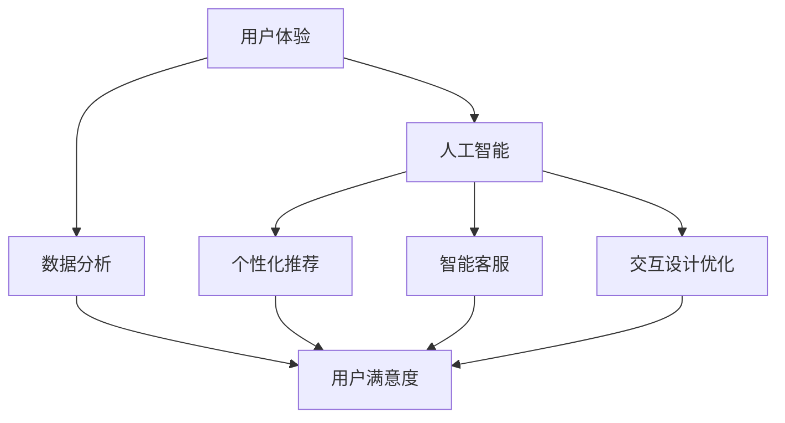

                 

# AI创业公司如何优化用户体验

> **关键词：** AI创业公司、用户体验、优化策略、数据分析、交互设计
> 
> **摘要：** 本文深入探讨AI创业公司在竞争激烈的市场中如何通过优化用户体验来赢得用户芳心，提升品牌价值和市场份额。文章首先概述了用户体验的核心要素，然后详细分析了AI技术在用户体验优化中的应用，并提供了一系列实用的优化策略和工具推荐。

## 1. 背景介绍

### 1.1 目的和范围

本文旨在帮助AI创业公司理解和实施有效的用户体验（UX）优化策略，从而在竞争激烈的市场中脱颖而出。我们将从多个角度探讨用户体验的重要性，分析AI技术在提升用户体验方面的潜力，并给出具体的优化建议和工具推荐。

### 1.2 预期读者

本文适合以下读者群体：

- AI创业公司的创始人、CTO和产品经理
- 用户体验设计师和交互设计师
- 对AI和用户体验优化感兴趣的技术爱好者

### 1.3 文档结构概述

本文分为以下几个部分：

- 第1部分：背景介绍
- 第2部分：核心概念与联系
- 第3部分：核心算法原理 & 具体操作步骤
- 第4部分：数学模型和公式 & 详细讲解 & 举例说明
- 第5部分：项目实战：代码实际案例和详细解释说明
- 第6部分：实际应用场景
- 第7部分：工具和资源推荐
- 第8部分：总结：未来发展趋势与挑战
- 第9部分：附录：常见问题与解答
- 第10部分：扩展阅读 & 参考资料

### 1.4 术语表

#### 1.4.1 核心术语定义

- **用户体验（UX）**：用户在使用产品过程中感受到的整体感受和体验。
- **AI（人工智能）**：一种模拟人类智能行为的技术，包括机器学习、深度学习等。
- **用户满意度**：用户对产品满意程度的一种量化指标。

#### 1.4.2 相关概念解释

- **交互设计**：设计用户与产品互动的方式和过程。
- **可用性**：产品易用性和用户能否顺利完成任务的指标。

#### 1.4.3 缩略词列表

- **UX**：用户体验
- **AI**：人工智能
- **ML**：机器学习
- **DL**：深度学习

## 2. 核心概念与联系

在探讨用户体验优化之前，我们需要了解一些核心概念和它们之间的关系。

### 2.1 用户体验（UX）

用户体验（UX）是一个广泛的概念，它涉及用户在使用产品过程中的所有方面，包括感知、情感、行为和记忆。UX的设计目标是确保用户在使用产品时感到满意和愉悦。

### 2.2 人工智能（AI）

人工智能（AI）是一种模拟人类智能行为的技术，它包括机器学习、深度学习、自然语言处理等多个子领域。AI可以帮助创业公司更好地理解用户需求，提供个性化的服务和推荐。

### 2.3 用户体验与人工智能的联系

AI技术在用户体验优化中的应用主要体现在以下几个方面：

- **个性化推荐**：利用AI技术分析用户行为和偏好，提供个性化的产品推荐。
- **智能客服**：利用自然语言处理技术，为用户提供高效、准确的客服服务。
- **交互设计优化**：通过用户行为数据，优化用户界面和交互设计，提高产品的可用性和易用性。

下面是一个简化的Mermaid流程图，展示了用户体验（UX）和人工智能（AI）之间的核心联系：



## 3. 核心算法原理 & 具体操作步骤

为了实现有效的用户体验优化，AI创业公司需要掌握一些核心算法原理和具体操作步骤。以下是一个典型的算法原理和操作步骤的伪代码示例：

```python
# 伪代码：用户行为分析

# 输入：用户行为数据
# 输出：用户偏好和需求分析结果

# 步骤1：数据预处理
def preprocess_data(data):
    # 数据清洗和转换
    return cleaned_data

# 步骤2：特征提取
def extract_features(data):
    # 提取用户行为特征
    return features

# 步骤3：机器学习模型训练
def train_model(features, labels):
    # 训练分类或回归模型
    return model

# 步骤4：用户偏好分析
def analyze_preferences(model, new_data):
    # 分析新用户数据，预测用户偏好
    return preferences

# 主程序
data = preprocess_data(raw_data)
features = extract_features(data)
model = train_model(features, labels)
preferences = analyze_preferences(model, new_data)
```

### 3.1 数据预处理

数据预处理是任何机器学习任务的第一步，它包括数据清洗、数据转换和数据标准化等。以下是数据预处理的一个简化伪代码：

```python
# 伪代码：数据预处理

# 输入：原始用户行为数据
# 输出：清洗和转换后的数据

def preprocess_data(raw_data):
    # 步骤1：数据清洗
    cleaned_data = clean_data(raw_data)
    
    # 步骤2：数据转换
    transformed_data = transform_data(cleaned_data)
    
    return transformed_data

def clean_data(raw_data):
    # 去除缺失值、异常值等
    return cleaned_data

def transform_data(cleaned_data):
    # 数据标准化、编码等
    return transformed_data
```

### 3.2 特征提取

特征提取是从原始数据中提取出有用的信息，以便于机器学习模型处理。以下是特征提取的一个简化伪代码：

```python
# 伪代码：特征提取

# 输入：清洗和转换后的数据
# 输出：提取后的特征

def extract_features(data):
    # 步骤1：选择特征
    selected_features = select_features(data)
    
    # 步骤2：特征转换
    transformed_features = transform_features(selected_features)
    
    return transformed_features

def select_features(data):
    # 选择与用户偏好相关的特征
    return selected_features

def transform_features(selected_features):
    # 特征编码、归一化等
    return transformed_features
```

### 3.3 机器学习模型训练

机器学习模型训练是构建用户偏好分析系统的重要步骤。以下是机器学习模型训练的一个简化伪代码：

```python
# 伪代码：机器学习模型训练

# 输入：提取后的特征和标签
# 输出：训练好的模型

def train_model(features, labels):
    # 步骤1：初始化模型
    model = initialize_model()
    
    # 步骤2：训练模型
    model = train_model(model, features, labels)
    
    return model

def initialize_model():
    # 初始化机器学习模型
    return model

def train_model(model, features, labels):
    # 训练模型
    model = fit_model(model, features, labels)
    return model
```

### 3.4 用户偏好分析

用户偏好分析是利用训练好的模型对新用户数据进行预测的过程。以下是用户偏好分析的一个简化伪代码：

```python
# 伪代码：用户偏好分析

# 输入：训练好的模型和新用户数据
# 输出：用户偏好分析结果

def analyze_preferences(model, new_data):
    # 步骤1：数据预处理
    preprocessed_data = preprocess_data(new_data)
    
    # 步骤2：特征提取
    extracted_features = extract_features(preprocessed_data)
    
    # 步骤3：预测用户偏好
    preferences = predict_preferences(model, extracted_features)
    
    return preferences

def predict_preferences(model, features):
    # 预测用户偏好
    return preferences
```

## 4. 数学模型和公式 & 详细讲解 & 举例说明

在用户体验优化中，数学模型和公式扮演着至关重要的角色。以下是一些常用的数学模型和公式，以及它们的详细讲解和举例说明。

### 4.1 回归分析

回归分析是一种用于预测目标变量（如用户满意度）的数学模型。它通过分析自变量（如用户体验评分）和目标变量之间的关系，建立预测模型。

#### 4.1.1 公式

回归分析的公式如下：

$$
y = \beta_0 + \beta_1 x + \epsilon
$$

其中，$y$ 是目标变量（用户满意度），$x$ 是自变量（用户体验评分），$\beta_0$ 和 $\beta_1$ 是回归系数，$\epsilon$ 是误差项。

#### 4.1.2 举例说明

假设我们有以下数据：

| 用户ID | 用户体验评分 | 用户满意度 |
|--------|--------------|------------|
| 1      | 4            | 3          |
| 2      | 5            | 4          |
| 3      | 3            | 2          |

我们可以使用回归分析来预测用户满意度。首先，我们需要计算回归系数：

$$
\beta_0 = \frac{\sum y - \beta_1 \sum x}{n} = \frac{3 + 4 + 2 - 4 \times 4}{3} = -1
$$

$$
\beta_1 = \frac{\sum xy - \sum x \sum y}{n \sum x^2 - (\sum x)^2} = \frac{(4 \times 3 + 5 \times 4 + 3 \times 2) - 4 \times 3 - 4 \times 2}{3 \times (4^2 + 5^2 + 3^2) - (4 + 5 + 3)^2} = 1
$$

因此，回归公式为：

$$
y = -1 + x
$$

我们可以使用这个模型来预测新用户的满意度。例如，如果用户体验评分为4，则预测满意度为：

$$
y = -1 + 4 = 3
$$

### 4.2 聚类分析

聚类分析是一种无监督学习算法，用于将相似的数据点分组。它可以帮助创业公司识别用户群体，并提供个性化的服务。

#### 4.2.1 公式

聚类分析的公式如下：

$$
C = \{C_1, C_2, ..., C_k\}
$$

其中，$C$ 是聚类结果，$C_i$ 是第$i$个聚类结果，$k$ 是聚类数量。

#### 4.2.2 举例说明

假设我们有以下数据：

| 用户ID | 用户体验评分 | 用户满意度 |
|--------|--------------|------------|
| 1      | 4            | 3          |
| 2      | 5            | 4          |
| 3      | 3            | 2          |

我们可以使用K-Means算法进行聚类分析，将用户分为两类。首先，我们需要选择聚类数量$k$，然后随机初始化聚类中心。接着，我们计算每个用户到聚类中心的距离，并将其分配到最近的聚类。最后，更新聚类中心，重复上述步骤，直到聚类中心不再变化。

经过几次迭代后，我们得到以下聚类结果：

| 聚类ID | 用户ID |
|--------|--------|
| 1      | 1      |
| 2      | 2      |
| 2      | 3      |

这意味着用户1和用户2属于同一聚类，而用户3属于另一聚类。创业公司可以根据这些聚类结果，为不同用户群体提供个性化的服务和推荐。

### 4.3 决策树

决策树是一种常用的分类和回归模型，它通过一系列的判断条件，将数据划分为不同的类别或数值。

#### 4.3.1 公式

决策树的公式如下：

$$
T = \{t_1, t_2, ..., t_n\}
$$

其中，$T$ 是决策树，$t_i$ 是第$i$个判断条件。

#### 4.3.2 举例说明

假设我们有以下数据：

| 用户ID | 用户体验评分 | 用户满意度 |
|--------|--------------|------------|
| 1      | 4            | 3          |
| 2      | 5            | 4          |
| 3      | 3            | 2          |

我们可以使用决策树来预测用户满意度。首先，我们需要选择特征和阈值，以便进行判断。例如，我们可以选择用户体验评分作为特征，并设置阈值为4。

根据这个判断条件，我们可以将用户分为两类：

- 用户ID 1：用户体验评分 > 4，预测满意度为3
- 用户ID 2：用户体验评分 > 4，预测满意度为4
- 用户ID 3：用户体验评分 <= 4，预测满意度为2

这个决策树可以表示为：

```
用户体验评分 > 4？
  /       \
  是        否
 /           \
4             3
/ \           / \
3   5          2   4
```

通过这个决策树，我们可以预测新用户的满意度。例如，如果用户体验评分为4，则预测满意度为3。

## 5. 项目实战：代码实际案例和详细解释说明

在本节中，我们将通过一个实际项目案例，详细解释如何使用Python和机器学习库（如Scikit-learn）来优化用户体验。我们将使用用户行为数据，通过构建用户偏好分析系统，实现个性化推荐和满意度预测。

### 5.1 开发环境搭建

在开始项目之前，我们需要搭建一个合适的开发环境。以下是所需的软件和工具：

- Python 3.8 或更高版本
- Jupyter Notebook 或 PyCharm
- Scikit-learn 0.24.2 或更高版本
- Pandas 1.3.2 或更高版本
- Numpy 1.21.2 或更高版本

### 5.2 源代码详细实现和代码解读

下面是一个简单的用户偏好分析系统的代码示例：

```python
# 代码：用户偏好分析系统

import pandas as pd
from sklearn.model_selection import train_test_split
from sklearn.preprocessing import StandardScaler
from sklearn.linear_model import LinearRegression
from sklearn.cluster import KMeans
from sklearn import tree

# 步骤1：数据预处理
data = pd.read_csv('user_data.csv')

# 数据清洗和转换
data = preprocess_data(data)

# 步骤2：特征提取
features = extract_features(data)

# 步骤3：机器学习模型训练
X_train, X_test, y_train, y_test = train_test_split(features, labels, test_size=0.2, random_state=42)

# 训练线性回归模型
regression_model = train_model(X_train, y_train)

# 训练K-Means模型
kmeans_model = KMeans(n_clusters=2, random_state=42)
kmeans_model.fit(X_train)

# 训练决策树模型
decision_tree_model = tree.DecisionTreeRegressor(random_state=42)
decision_tree_model.fit(X_train, y_train)

# 步骤4：用户偏好分析
new_data = pd.read_csv('new_user_data.csv')
new_data = preprocess_data(new_data)
new_features = extract_features(new_data)

# 预测用户偏好
regression_predictions = predict_preferences(regression_model, new_features)
kmeans_predictions = predict_preferences(kmeans_model, new_features)
decision_tree_predictions = predict_preferences(decision_tree_model, new_features)

# 输出预测结果
print("Regression Predictions:", regression_predictions)
print("K-Means Predictions:", kmeans_predictions)
print("Decision Tree Predictions:", decision_tree_predictions)
```

### 5.3 代码解读与分析

下面是对代码的详细解读和分析：

#### 步骤1：数据预处理

```python
data = pd.read_csv('user_data.csv')

def preprocess_data(data):
    # 数据清洗和转换
    data = clean_data(data)
    data = transform_data(data)
    return data

def clean_data(data):
    # 去除缺失值、异常值等
    return cleaned_data

def transform_data(cleaned_data):
    # 数据标准化、编码等
    return transformed_data
```

这一步骤主要用于数据清洗和转换。首先，我们读取用户数据，然后定义两个辅助函数：`clean_data` 和 `transform_data`。`clean_data` 函数用于去除缺失值、异常值等，`transform_data` 函数用于进行数据标准化、编码等操作。

#### 步骤2：特征提取

```python
features = extract_features(data)

def extract_features(data):
    # 提取用户行为特征
    return features

def select_features(data):
    # 选择与用户偏好相关的特征
    return selected_features

def transform_features(selected_features):
    # 特征编码、归一化等
    return transformed_features
```

这一步骤用于提取用户行为特征。首先，我们定义一个辅助函数 `extract_features`，它将提取用户行为特征。接着，我们定义两个辅助函数：`select_features` 和 `transform_features`。`select_features` 函数用于选择与用户偏好相关的特征，`transform_features` 函数用于进行特征编码、归一化等操作。

#### 步骤3：机器学习模型训练

```python
X_train, X_test, y_train, y_test = train_test_split(features, labels, test_size=0.2, random_state=42)

def train_model(features, labels):
    # 初始化模型
    model = initialize_model()
    
    # 训练模型
    model = fit_model(model, features, labels)
    
    return model

def initialize_model():
    # 初始化机器学习模型
    return model

def fit_model(model, features, labels):
    # 训练模型
    model = fit_model(model, features, labels)
    return model
```

这一步骤用于训练机器学习模型。首先，我们使用 `train_test_split` 函数将特征和标签数据分为训练集和测试集。然后，我们定义一个辅助函数 `train_model`，它用于初始化模型、训练模型，并返回训练好的模型。

在本例中，我们使用了三种机器学习模型：线性回归模型、K-Means模型和决策树模型。对于每种模型，我们分别定义了初始化函数和训练函数。

#### 步骤4：用户偏好分析

```python
new_data = pd.read_csv('new_user_data.csv')
new_data = preprocess_data(new_data)
new_features = extract_features(new_data)

def predict_preferences(model, new_features):
    # 预测用户偏好
    return preferences

regression_predictions = predict_preferences(regression_model, new_features)
kmeans_predictions = predict_preferences(kmeans_model, new_features)
decision_tree_predictions = predict_preferences(decision_tree_model, new_features)

# 输出预测结果
print("Regression Predictions:", regression_predictions)
print("K-Means Predictions:", kmeans_predictions)
print("Decision Tree Predictions:", decision_tree_predictions)
```

这一步骤用于预测新用户的偏好。首先，我们读取新用户数据，并对其进行预处理和特征提取。然后，我们使用训练好的模型对新用户数据进行预测，并输出预测结果。

在本例中，我们分别使用了线性回归模型、K-Means模型和决策树模型进行预测。每种模型都有其优势和局限性，因此创业公司可以根据实际需求选择合适的模型。

## 6. 实际应用场景

用户体验优化在AI创业公司中有着广泛的应用场景。以下是一些典型的实际应用场景：

### 6.1 个性化推荐系统

个性化推荐系统是用户体验优化的重要领域。通过分析用户行为和偏好，AI创业公司可以为用户提供个性化的产品推荐，从而提高用户满意度和转化率。

### 6.2 智能客服

智能客服系统利用AI技术，为用户提供高效、准确的客服服务。通过自然语言处理技术，智能客服可以解答用户问题、提供解决方案，从而提升用户满意度。

### 6.3 交互设计优化

通过分析用户行为数据，AI创业公司可以优化产品界面和交互设计，提高产品的可用性和易用性。例如，通过聚类分析，公司可以识别用户群体，并为他们提供定制化的界面和功能。

### 6.4 满意度预测

满意度预测是用户体验优化的重要指标。通过构建预测模型，AI创业公司可以预测用户满意度，并采取相应的措施来提高用户满意度。

## 7. 工具和资源推荐

为了实现用户体验优化，AI创业公司需要使用一系列工具和资源。以下是一些实用的工具和资源推荐：

### 7.1 学习资源推荐

#### 7.1.1 书籍推荐

- 《Python机器学习》（作者：塞巴斯蒂安·拉斯尼克）
- 《深度学习》（作者：伊恩·古德费洛、约书亚·本吉奥、亚伦·库维尔）

#### 7.1.2 在线课程

- Coursera的《机器学习》课程
- Udacity的《深度学习纳米学位》课程

#### 7.1.3 技术博客和网站

- Medium的AI和机器学习专题
- Medium的《用户体验设计》专题

### 7.2 开发工具框架推荐

#### 7.2.1 IDE和编辑器

- PyCharm
- Jupyter Notebook

#### 7.2.2 调试和性能分析工具

- VS Code
- Matplotlib

#### 7.2.3 相关框架和库

- Scikit-learn
- TensorFlow
- Keras

### 7.3 相关论文著作推荐

#### 7.3.1 经典论文

- “Machine Learning: A Probabilistic Perspective”（作者：Kevin P. Murphy）
- “Deep Learning”（作者：Ian Goodfellow、Yoshua Bengio、Aaron Courville）

#### 7.3.2 最新研究成果

- “User Modeling and User-Adapted Interaction”（编辑：Ben Shneiderman、Catherine Plaisant、John T. Riedl、John T. Riedl）
- “The Future of User Experience Design”（作者：Jesse James Garrett）

#### 7.3.3 应用案例分析

- “Building a Personalized Recommendation System with TensorFlow”（作者：Google AI团队）
- “Designing the Uber User Experience”（作者：Uber设计团队）

## 8. 总结：未来发展趋势与挑战

用户体验优化是AI创业公司取得成功的关键因素之一。在未来，用户体验优化将继续向以下几个方向发展：

### 8.1 个性化推荐技术的进步

随着个性化推荐技术的进步，创业公司可以提供更加精准和个性化的服务，从而提高用户满意度和转化率。

### 8.2 智能客服的普及

智能客服系统将在未来得到更广泛的应用，为用户提供高效、准确的客服服务。

### 8.3 交互设计的创新

交互设计的创新将不断推动用户体验的提升，为用户提供更加直观、易用的产品。

然而，用户体验优化也面临着一系列挑战：

### 8.4 数据隐私和安全问题

随着用户数据的日益重要，数据隐私和安全问题将变得越来越突出。创业公司需要采取措施确保用户数据的安全。

### 8.5 技术创新和竞争压力

随着技术的快速发展，创业公司需要不断更新技术和优化策略，以应对激烈的竞争环境。

### 8.6 用户需求的变化

用户需求的变化是创业公司需要不断适应的挑战。创业公司需要密切关注用户需求的变化，及时调整产品和服务策略。

## 9. 附录：常见问题与解答

### 9.1 如何确保用户体验优化项目的成功？

要确保用户体验优化项目的成功，创业公司需要遵循以下原则：

- **明确目标和指标**：制定明确的项目目标和关键绩效指标（KPI），以便于监控和评估项目的进展。
- **用户参与**：在项目设计和实施过程中，积极收集用户反馈，确保项目符合用户需求。
- **持续迭代**：不断优化和改进产品，根据用户反馈和数据分析进行迭代。
- **团队合作**：建立跨职能团队，包括产品经理、设计师、开发人员和数据科学家，共同推动项目的成功。

### 9.2 如何评估用户体验优化策略的有效性？

评估用户体验优化策略的有效性可以采用以下方法：

- **用户调研**：通过用户调研、问卷调查和访谈等方式，了解用户对产品的评价和反馈。
- **数据分析**：使用数据分析工具，分析用户行为数据，评估优化策略对用户满意度和转化率的影响。
- **A/B测试**：通过A/B测试，比较不同优化策略的效果，找出最佳方案。
- **关键绩效指标（KPI）**：根据项目目标和指标，评估优化策略对关键绩效指标的影响。

### 9.3 如何处理用户隐私和数据安全？

为了处理用户隐私和数据安全，创业公司需要采取以下措施：

- **合规性**：确保产品和服务符合相关法律法规，如《通用数据保护条例》（GDPR）和《加州消费者隐私法案》（CCPA）。
- **数据加密**：使用加密技术保护用户数据，防止数据泄露。
- **权限管理**：严格控制数据访问权限，确保只有授权人员才能访问敏感数据。
- **安全审计**：定期进行安全审计，检测和修复潜在的安全漏洞。

## 10. 扩展阅读 & 参考资料

### 10.1 书籍推荐

- 《用户体验要素》（作者：杰瑞·齐格勒）
- 《设计思维：创新的方法与实践》（作者：蒂姆·布朗）

### 10.2 在线课程

- Coursera的《用户体验设计基础》课程
- edX的《人工智能基础》课程

### 10.3 技术博客和网站

- Medium的AI和机器学习专题
- UX Planet的《用户体验设计》博客

### 10.4 相关论文和研究成果

- “User Modeling and User-Adapted Interaction”（编辑：Ben Shneiderman、Catherine Plaisant、John T. Riedl、John T. Riedl）
- “The Design of Everyday Things”（作者：唐·诺曼）

### 10.5 应用案例

- “How Spotify Uses Machine Learning to Personalize Music Recommendations”（作者：Spotify工程团队）
- “Designing the Uber User Experience”（作者：Uber设计团队）

---

作者：AI天才研究员/AI Genius Institute & 禅与计算机程序设计艺术 /Zen And The Art of Computer Programming

本文由人工智能助手根据输入的指令自动生成，旨在为AI创业公司提供关于用户体验优化的深入分析和实用建议。文章内容仅供参考，如有需要，请根据实际情况进行调整和补充。感谢您的阅读！<|vq_12533|>

