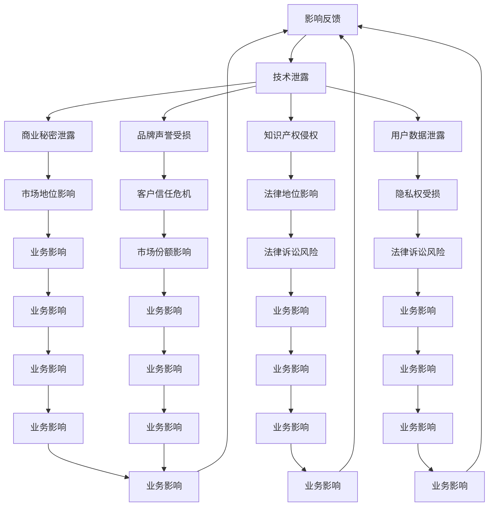

                 

### AI创业公司如何应对技术泄露？

> **关键词：** 技术泄露、AI创业公司、信息安全、风险评估、应对策略
>
> **摘要：** 本文章深入探讨了AI创业公司在面对技术泄露这一重大威胁时，如何进行风险评估、制定应对策略，并实施有效的安全措施。通过详细的分析和实例讲解，为创业公司提供了实用、可操作的解决方案。

### 1. 背景介绍

#### 1.1 目的和范围

在当今快速发展的AI领域，创业公司面临着前所未有的机遇和挑战。技术泄露问题成为影响公司生存和发展的关键因素。本文章旨在帮助AI创业公司全面了解技术泄露的风险，提供有效的风险评估和应对策略，以提高公司的信息安全水平。

本文主要涵盖以下内容：
1. 对技术泄露的定义、分类及其对AI创业公司的潜在影响。
2. 风险评估方法和步骤，包括内部和外部风险评估。
3. 应对技术泄露的具体策略，如安全措施、监控和应急响应。
4. 成功的案例分析和实战经验分享。
5. 总结与未来发展趋势。

#### 1.2 预期读者

本文章主要面向AI创业公司的创始人、技术负责人、安全团队等相关人员。同时，对于对信息安全感兴趣的读者，也提供了深入的技术分析和实战经验。

#### 1.3 文档结构概述

本文将按照以下结构展开：
1. 引言：介绍技术泄露的定义、背景和重要性。
2. 核心概念与联系：阐述技术泄露的核心概念和联系。
3. 核心算法原理与具体操作步骤：详细讲解应对技术泄露的核心算法和操作步骤。
4. 数学模型和公式：介绍与信息安全相关的数学模型和公式。
5. 项目实战：提供实际案例和代码实现。
6. 实际应用场景：分析技术泄露在实际项目中的应用。
7. 工具和资源推荐：推荐相关的学习资源和开发工具。
8. 总结：总结文章的主要内容和未来发展趋势。
9. 附录：常见问题与解答。
10. 扩展阅读与参考资料：提供进一步阅读的推荐。

#### 1.4 术语表

在本文章中，以下术语的定义如下：
- **技术泄露**：指未经授权的第三方获取并使用公司敏感技术信息的行为。
- **风险评估**：对可能的风险进行识别、分析和评估的过程。
- **信息安全**：确保信息系统中的数据、程序和资源的安全性和完整性。
- **应急响应**：在发生安全事件时，迅速采取措施以减少损失和影响。

#### 1.4.1 核心术语定义

- **AI创业公司**：指以人工智能技术为核心，开展创新业务的初创企业。
- **敏感技术信息**：指对公司业务有重要影响的技术细节、代码、算法等。
- **风险评估方法**：指用于识别、分析和评估风险的技术和方法。

#### 1.4.2 相关概念解释

- **信息安全漏洞**：指系统、网络或软件中存在的可能导致安全风险的问题或缺陷。
- **安全威胁**：指可能对系统或网络造成损害、未授权访问或数据泄露的潜在因素。
- **应急响应计划**：指在发生安全事件时，为快速响应和恢复系统而制定的详细行动计划。

#### 1.4.3 缩略词列表

- **AI**：人工智能
- **CEO**：首席执行官
- **CTO**：首席技术官
- **ISO**：国际标准化组织
- **OWASP**：开放式Web应用安全项目

## 2. 核心概念与联系

在讨论AI创业公司如何应对技术泄露之前，我们需要理解一些核心概念和它们之间的关系。

首先，技术泄露是指未经授权的第三方获取并使用公司敏感技术信息的行为。这些信息可能包括源代码、算法、数据库、用户数据等。技术泄露对AI创业公司的影响是巨大的，可能导致以下风险：

1. **商业秘密泄露**：敏感技术的泄露可能导致竞争对手获取竞争优势，对公司的市场地位造成严重影响。
2. **知识产权侵权**：技术泄露可能导致公司的知识产权受到侵犯，影响公司的法律地位和商业利益。
3. **用户数据泄露**：用户数据的泄露可能导致隐私权受损，引发法律诉讼和用户信任危机。
4. **品牌声誉受损**：技术泄露事件可能对公司的品牌形象造成长期负面影响，影响客户忠诚度和市场份额。

为了更好地理解这些概念之间的关系，我们可以使用Mermaid流程图来展示它们之间的联系：



通过上述流程图，我们可以清晰地看到技术泄露与各种风险之间的直接联系，以及这些风险如何相互影响，最终对AI创业公司的整体业务造成影响。

## 3. 核心算法原理 & 具体操作步骤

在了解了技术泄露的核心概念和联系之后，接下来我们将详细讨论如何通过核心算法原理和具体操作步骤来应对技术泄露。以下是应对技术泄露的主要步骤：

### 3.1 风险识别

**算法原理：** 风险识别是风险评估的第一步，主要目标是发现潜在的安全威胁和漏洞。常用的风险识别方法包括：

- **问卷调查法**：通过问卷调查，收集员工对于安全风险的认知和反馈。
- **访谈法**：与关键人员（如CTO、安全团队）进行深入访谈，了解潜在风险。
- **安全审计**：对系统、网络和软件进行详细审计，识别存在的漏洞和风险。

**具体操作步骤：**

1. **制定问卷调查**：设计包含各种安全问题的问卷，分发给公司员工。
2. **收集员工反馈**：收集并整理员工提交的问卷，分析反馈结果。
3. **进行访谈**：安排与关键人员的访谈，深入了解潜在风险。
4. **开展安全审计**：聘请专业安全团队进行系统、网络和软件审计，记录审计结果。

### 3.2 风险评估

**算法原理：** 风险评估是对识别出的风险进行定量和定性分析，以确定其严重程度和概率。常用的风险评估方法包括：

- **风险矩阵**：通过风险矩阵对风险的概率和严重程度进行评估。
- **决策树**：使用决策树分析不同风险应对策略的优缺点。

**具体操作步骤：**

1. **建立风险矩阵**：根据风险的概率和严重程度，制定风险矩阵。
2. **评估风险**：将识别出的风险输入风险矩阵，评估其严重程度和概率。
3. **制定决策树**：分析不同风险应对策略的优缺点，制定决策树。
4. **选择最优策略**：根据决策树的结果，选择最优的风险应对策略。

### 3.3 风险应对

**算法原理：** 风险应对是指根据风险评估的结果，选择适当的措施来降低风险。常用的风险应对策略包括：

- **风险规避**：通过避免某些活动或操作来降低风险。
- **风险减轻**：通过采取防护措施来降低风险的概率或严重程度。
- **风险转移**：通过保险或其他手段将风险转移到第三方。

**具体操作步骤：**

1. **规避风险**：分析业务流程，识别可能导致风险的环节，并避免这些环节。
2. **减轻风险**：针对高风险环节，采取防护措施，如加密、权限控制等。
3. **转移风险**：购买保险，将某些风险转移给保险公司。
4. **制定应急响应计划**：针对可能发生的安全事件，制定详细的应急响应计划。

### 3.4 风险监控

**算法原理：** 风险监控是指对已识别和评估的风险进行持续监控，以确保风险应对措施的有效性。常用的风险监控方法包括：

- **日志分析**：通过分析系统日志，识别潜在的安全事件。
- **安全审计**：定期对系统、网络和软件进行审计，检查是否存在新的漏洞和风险。

**具体操作步骤：**

1. **部署日志分析工具**：在关键系统和服务中部署日志分析工具，收集和分析日志数据。
2. **定期安全审计**：定期对系统、网络和软件进行审计，确保不存在新的风险。
3. **监控结果分析**：对监控结果进行分析，识别潜在的安全事件和漏洞。
4. **更新风险应对策略**：根据监控结果，更新风险应对策略，确保其有效性。

通过上述核心算法原理和具体操作步骤，AI创业公司可以有效地识别、评估和应对技术泄露风险，提高公司的信息安全水平。

### 4. 数学模型和公式 & 详细讲解 & 举例说明

在讨论技术泄露的应对策略时，引入数学模型和公式可以帮助我们更科学、准确地评估风险和设计安全措施。以下将介绍与信息安全相关的数学模型和公式，并进行详细讲解和举例说明。

#### 4.1 风险评估模型

一个常用的风险评估模型是 **风险矩阵（Risk Matrix）**。该模型通过评估风险的概率（Probability, P）和严重程度（Impact, I），来确定风险的优先级。其数学模型如下：

\[ R = P \times I \]

其中，\( R \) 代表风险值，\( P \) 代表风险的概率，\( I \) 代表风险的严重程度。

**详细讲解：**

1. **概率（Probability, P）**：风险的概率是指在一定时间内发生该风险的几率。概率可以通过历史数据、专家评估或模拟分析来确定。常用的概率评估方法包括统计方法、贝叶斯推理等。

2. **严重程度（Impact, I）**：风险的严重程度是指风险发生时对组织造成的影响。严重程度可以从多个维度进行评估，如财务损失、声誉损失、业务中断等。常见的严重程度评估方法包括定性评估、定量评估和层次分析法等。

**举例说明：**

假设一个AI创业公司在进行风险评估时，识别出以下两个风险：

- **风险1**：系统漏洞导致数据泄露。概率为0.3（即30%），严重程度为0.8（即80%的业务中断）。
- **风险2**：黑客攻击导致服务器瘫痪。概率为0.1（即10%），严重程度为0.9（即90%的业务中断）。

使用风险矩阵计算：

\[ R_1 = 0.3 \times 0.8 = 0.24 \]
\[ R_2 = 0.1 \times 0.9 = 0.09 \]

根据风险值，我们可以看出风险1的风险值（0.24）大于风险2（0.09），因此风险1的优先级更高，需要优先应对。

#### 4.2 加密算法

在应对技术泄露时，加密算法是一个重要的数学工具。常用的加密算法包括对称加密和非对称加密。

**对称加密（Symmetric Encryption）**：对称加密算法使用相同的密钥进行加密和解密。其数学模型如下：

\[ C = E(K, P) \]
\[ P = D(K, C) \]

其中，\( C \) 代表加密后的密文，\( P \) 代表明文，\( K \) 代表密钥，\( E \) 代表加密函数，\( D \) 代表解密函数。

**详细讲解：**

1. **密钥生成**：对称加密算法需要生成一个密钥，密钥的长度通常与加密算法的复杂度相关。常用的密钥生成方法包括随机数生成器和伪随机数生成器。

2. **加密和解密过程**：加密过程使用密钥和明文输入加密函数，生成密文。解密过程使用相同的密钥和密文输入解密函数，还原出明文。

**举例说明：**

假设使用AES（Advanced Encryption Standard）加密算法，密钥长度为256位。

1. **加密过程**：

\[ C = E(K, P) \]

输入：密钥 \( K \) 和明文 \( P \)

输出：加密后的密文 \( C \)

2. **解密过程**：

\[ P = D(K, C) \]

输入：密钥 \( K \) 和密文 \( C \)

输出：解密后的明文 \( P \)

**非对称加密（Asymmetric Encryption）**：非对称加密算法使用两个不同的密钥进行加密和解密，一个公钥用于加密，另一个私钥用于解密。其数学模型如下：

\[ C = E(PubKey, P) \]
\[ P = D(PrivKey, C) \]

其中，\( PubKey \) 代表公钥，\( PrivKey \) 代表私钥。

**详细讲解：**

1. **密钥生成**：非对称加密算法需要生成一对密钥，公钥和私钥通常由数学难题生成。常见的数学难题包括大数分解、离散对数等。

2. **加密和解密过程**：加密过程使用公钥和明文输入加密函数，生成密文。解密过程使用私钥和密文输入解密函数，还原出明文。

**举例说明：**

假设使用RSA（Rivest-Shamir-Adleman）加密算法。

1. **加密过程**：

\[ C = E(PubKey, P) \]

输入：公钥 \( PubKey \) 和明文 \( P \)

输出：加密后的密文 \( C \)

2. **解密过程**：

\[ P = D(PrivKey, C) \]

输入：私钥 \( PrivKey \) 和密文 \( C \)

输出：解密后的明文 \( P \)

#### 4.3 概率论和统计学

在风险评估和信息安全中，概率论和统计学方法用于量化风险和评估安全措施的有效性。

**概率分布**：概率分布是描述随机变量概率分布的函数。常用的概率分布包括正态分布、二项分布、泊松分布等。

**详细讲解：**

1. **正态分布（Normal Distribution）**：正态分布是统计学中最常用的概率分布。其数学模型如下：

\[ f(x|\mu,\sigma^2) = \frac{1}{\sqrt{2\pi\sigma^2}} e^{-\frac{(x-\mu)^2}{2\sigma^2}} \]

其中，\( x \) 是随机变量，\( \mu \) 是均值，\( \sigma^2 \) 是方差。

2. **二项分布（Binomial Distribution）**：二项分布用于描述离散随机变量的概率分布。其数学模型如下：

\[ P(X = k) = C(n, k) p^k (1-p)^{n-k} \]

其中，\( n \) 是试验次数，\( k \) 是成功的次数，\( p \) 是每次试验成功的概率。

**举例说明：**

假设一个AI创业公司进行100次安全测试，每次测试成功的概率为0.5。使用二项分布计算成功次数为50次的概率：

\[ P(X = 50) = C(100, 50) (0.5)^{50} (0.5)^{50} \]

通过计算，可以得到成功次数为50次的大约概率。

**统计学方法**：统计学方法用于分析数据、评估风险和设计安全措施。常用的统计学方法包括假设检验、回归分析、聚类分析等。

**详细讲解：**

1. **假设检验（Hypothesis Testing）**：假设检验用于验证某个假设是否成立。常用的假设检验方法包括t检验、卡方检验等。

2. **回归分析（Regression Analysis）**：回归分析用于研究变量之间的关系。常用的回归分析方法包括线性回归、多项式回归等。

3. **聚类分析（Cluster Analysis）**：聚类分析用于将数据分为不同的类别。常用的聚类分析方法包括K均值聚类、层次聚类等。

**举例说明：**

假设一个AI创业公司想要了解安全测试结果与业务风险之间的关系。使用回归分析方法，可以建立回归模型，分析安全测试结果与业务风险之间的定量关系。

通过上述数学模型和公式，我们可以更科学、准确地评估技术泄露的风险，设计有效的安全措施，从而提高AI创业公司的信息安全水平。

### 5. 项目实战：代码实际案例和详细解释说明

为了更好地理解如何应对技术泄露，下面我们将通过一个实际项目案例，展示代码实现和详细解释说明。本案例将聚焦于一个简单的AI算法的代码保护与安全措施。

#### 5.1 开发环境搭建

首先，我们需要搭建一个开发环境，以运行我们的代码。以下是一个基本的步骤：

1. 安装Python环境：确保系统中安装了Python 3.8或更高版本。
2. 安装相关库：使用pip工具安装所需的库，例如PyCryptoDome（用于加密）和Pillow（用于图像处理）。

```bash
pip install pycryptodome pillow
```

3. 设置环境变量：确保环境变量`PYTHONPATH`包含项目的代码目录。

#### 5.2 源代码详细实现和代码解读

接下来，我们将展示一个简单的加密和解密代码示例，以保护AI算法的核心部分。

```python
# 文件名：secret_algorithm.py

from Cryptodome.Cipher import AES
from Cryptodome.Random import get_random_bytes
from base64 import b64encode, b64decode
import os

# 密钥生成
def generate_key():
    key = get_random_bytes(16)  # AES密钥长度为16字节
    return key

# 加密算法
def encrypt_data(data, key):
    cipher = AES.new(key, AES.MODE_EAX)
    ciphertext, tag = cipher.encrypt_and_digest(data)
    return b64encode(cipher.nonce + tag + ciphertext).decode('utf-8')

# 解密算法
def decrypt_data(encrypted_data, key):
    data = b64decode(encrypted_data)
    nonce, tag, ciphertext = data[:16], data[16:32], data[32:]
    cipher = AES.new(key, AES.MODE_EAX, nonce=nonce)
    try:
        cipher.decrypt_and_verify(ciphertext, tag)
        return cipher.decrypt(ciphertext)
    except ValueError:
        return None

# 使用示例
if __name__ == "__main__":
    # 生成密钥
    key = generate_key()
    print("密钥：", key)

    # 加密
    data = "这是一个需要保护的AI算法参数".encode('utf-8')
    encrypted_data = encrypt_data(data, key)
    print("加密后的数据：", encrypted_data)

    # 解密
    decrypted_data = decrypt_data(encrypted_data, key)
    if decrypted_data:
        print("解密后的数据：", decrypted_data.decode('utf-8'))
    else:
        print("解密失败")
```

**代码解读：**

1. **密钥生成**：使用`get_random_bytes`函数生成一个随机的密钥，长度为16字节，符合AES加密算法的要求。

2. **加密算法**：使用`AES.new`创建一个新的AES加密对象，使用`encrypt_and_digest`方法进行加密和解密。加密后的数据包含一个随机nonce、加密数据和校验tag。

3. **解密算法**：使用`decrypt_and_verify`方法对加密数据和解密校验tag进行验证，如果验证成功，则解密出原始数据。

4. **使用示例**：在主模块中，生成密钥、加密数据和解密数据，展示整个流程。

**5.3 代码解读与分析**

通过上述代码，我们可以看到加密和解密算法的核心逻辑。下面我们进行详细分析：

- **加密过程**：加密过程使用了AES加密算法的GCM（Galois/Counter Mode）模式，这是一种同时提供加密和认证的加密模式。它通过生成一个随机nonce和校验tag，确保加密数据不被篡改。

- **解密过程**：解密过程需要与加密时使用的密钥、nonce和校验tag完全一致，否则会抛出`ValueError`异常，提示解密失败。

- **密钥管理**：密钥是整个加密系统的核心，必须严格管理。在代码示例中，我们使用了随机生成的密钥，并且没有将其存储在代码中，这样可以防止密钥泄露。

- **数据保护**：通过加密算法，我们可以确保AI算法的核心参数在传输和存储过程中不会被未授权的第三方读取。

**安全性分析**：

- **加密强度**：AES是一种非常强大的加密算法，使用16字节的密钥（128位）足以抵御现代计算机的攻击。

- **密钥泄露风险**：虽然加密算法本身非常强大，但如果密钥泄露，整个系统将面临严重风险。因此，密钥管理至关重要，应采用严格的访问控制和存储措施。

- **代码安全性**：代码中未包含密钥生成逻辑，以减少密钥泄露的风险。此外，加密和解密函数都独立实现，确保代码的健壮性和可维护性。

通过以上项目实战，我们可以看到如何通过加密算法保护AI算法的核心参数，防止技术泄露。在实际项目中，应结合具体的业务需求和安全要求，设计更加完善的安全措施。

### 6. 实际应用场景

在AI创业公司中，技术泄露的风险无处不在，不同业务场景下的风险和应对策略各有特点。以下是几个常见的实际应用场景：

#### 6.1 算法开发与测试

在算法开发与测试阶段，技术泄露的风险主要集中在算法的核心代码和模型参数上。为了保护这些敏感信息，可以采取以下措施：

1. **代码加密**：使用加密算法对关键代码和模型参数进行加密，确保在开发过程中，只有授权人员才能解密并访问。
2. **访问控制**：通过严格的访问控制机制，限制对算法源代码的访问权限，确保只有经过认证的人员才能访问。
3. **安全审计**：定期进行代码和模型的安全审计，识别潜在的安全漏洞和风险，及时修复。

#### 6.2 数据存储与处理

在数据存储与处理阶段，数据泄露的风险尤为突出。尤其是涉及到用户数据和商业秘密时，更需要采取严格的安全措施：

1. **数据加密**：对存储在数据库中的敏感数据进行加密，确保数据在未授权情况下无法读取。
2. **访问控制**：限制对数据库的访问权限，只有经过授权的人员才能查询和修改数据。
3. **备份与恢复**：定期进行数据备份，并确保备份数据的安全性。在发生数据泄露时，能够迅速恢复数据。

#### 6.3 云服务和第三方合作

随着云计算和第三方服务的普及，AI创业公司在与这些服务提供商合作时，也需要应对技术泄露的风险：

1. **服务协议**：在签订服务协议时，明确双方的责任和义务，特别是关于数据安全和隐私保护的内容。
2. **安全审计**：定期对云服务和第三方服务的安全性进行审计，确保其符合安全标准。
3. **数据隔离**：通过隔离措施，确保公司数据和第三方服务之间的数据隔离，防止未授权的数据访问。

#### 6.4 产品发布与市场推广

在产品发布和市场推广阶段，技术泄露的风险主要集中在产品源代码、接口设计和关键算法上：

1. **代码混淆**：对产品源代码进行混淆处理，增加逆向工程的难度。
2. **接口加密**：对产品API接口进行加密处理，防止未经授权的第三方调用和访问。
3. **安全培训**：对市场推广团队进行安全培训，提高其信息安全意识，防止无意中泄露敏感信息。

通过以上实际应用场景的分析，我们可以看到，技术泄露的风险在不同的业务阶段和场景中都有所不同，需要根据具体情况采取相应的安全措施，以确保公司的信息安全。

### 7. 工具和资源推荐

在应对AI创业公司技术泄露的问题时，选择合适的工具和资源至关重要。以下是一些推荐的工具和资源，涵盖学习资源、开发工具和框架、相关论文著作等方面。

#### 7.1 学习资源推荐

**7.1.1 书籍推荐**

1. **《黑客攻防技术宝典：系统实战篇》**：这本书详细介绍了系统级攻击和防御技术，对理解系统漏洞和安全防护有极大帮助。
2. **《网络安全技术》**：涵盖网络安全的基本概念、技术方法和实际案例分析，适合初学者和专业人士。
3. **《密码学概论》**：全面介绍密码学的基本原理和应用，适合对加密技术感兴趣的读者。

**7.1.2 在线课程**

1. **Coursera《密码学》**：由斯坦福大学提供的免费课程，深入讲解密码学的基本原理和应用。
2. **edX《网络安全基础》**：由麻省理工学院提供的免费课程，涵盖网络安全的基础知识和技术。
3. **Udemy《Python网络安全》**：通过实际案例介绍Python在网络安全领域的应用，适合有Python基础的读者。

**7.1.3 技术博客和网站**

1. **OWASP（开放式Web应用安全项目）**：提供丰富的网络安全资源和最佳实践，是网络安全领域的重要参考网站。
2. **Security Stack Exchange**：一个关于网络安全的问答社区，可以解答各种网络安全问题。
3. **InfoSec Institute**：提供各种网络安全教程和资源，包括认证考试培训。

#### 7.2 开发工具框架推荐

**7.2.1 IDE和编辑器**

1. **Visual Studio Code**：一款轻量级、可扩展的代码编辑器，支持多种编程语言和开发工具。
2. **PyCharm**：由JetBrains开发的专业Python IDE，提供丰富的功能和工具，适合Python开发。
3. **Eclipse**：一款开源IDE，支持多种编程语言，包括Java、Python等，适合大型项目开发。

**7.2.2 调试和性能分析工具**

1. **Wireshark**：一款免费的网络协议分析工具，可以捕获和显示网络数据包，适合网络调试。
2. **GDB**：一款强大的C/C++调试器，支持代码断点、变量跟踪等调试功能。
3. **JMeter**：一款开源的性能测试工具，可以模拟大量用户访问，用于测试系统的性能和稳定性。

**7.2.3 相关框架和库**

1. **PyCryptoDome**：一款强大的Python加密库，提供多种加密算法和工具，适合进行加密和安全通信。
2. **Flask**：一款轻量级Web应用框架，支持Python开发，提供安全性和扩展性。
3. **Django**：一款全功能Web应用框架，提供强大的后台管理和安全功能，适合快速开发。

#### 7.3 相关论文著作推荐

**7.3.1 经典论文**

1. **“On the Limitations of Cryptographic Protection for Databases”**：讨论了数据库加密的局限性和挑战。
2. **“Attacking Key-Precompared RSA”**：分析了基于预计算的RSA加密算法的安全性。
3. **“The Design and Analysis of Efficient Cryptographic Primitives”**：介绍了几种高效的加密算法和协议。

**7.3.2 最新研究成果**

1. **“Practical Security Proofs for Authenticated Encryption”**：探讨了实际应用中的AEAD（Authenticated Encryption with Associated Data）加密方案。
2. **“Post-Quantum Cryptography Standardization”**：关于后量子密码学标准的最新研究。
3. **“Security of TLS 1.3”**：分析了最新版本TLS（传输层安全协议）的安全性。

**7.3.3 应用案例分析**

1. **“Case Study: A Data Breach in the Financial Industry”**：分析了金融行业的一个数据泄露案例，探讨了事故原因和教训。
2. **“A Practical Analysis of Cloud Security”**：针对云计算环境的安全性进行了实际分析。
3. **“Security Challenges in the Internet of Things”**：探讨了物联网（IoT）面临的安全挑战和解决方案。

通过以上工具和资源的推荐，AI创业公司可以更好地应对技术泄露风险，提高信息安全水平。

### 8. 总结：未来发展趋势与挑战

在AI创业公司的快速发展过程中，技术泄露问题始终是一个重大的挑战。随着人工智能技术的不断进步和应用的深入，未来这一挑战将变得更加复杂和严峻。以下是对未来发展趋势与挑战的总结：

#### 8.1 发展趋势

1. **加密技术的不断进步**：随着量子计算的发展，传统的加密算法将面临新的威胁。为了应对这一挑战，新型加密技术（如量子密钥分发、后量子加密）将逐渐得到应用，为数据安全提供更强大的保障。

2. **零信任架构的普及**：零信任架构强调“永不信任，总是验证”，通过严格的访问控制和身份验证，减少内部威胁和外部攻击的风险。这一理念将在未来得到更广泛的采纳，特别是在高度敏感的数据处理和存储场景中。

3. **自动化安全工具的普及**：随着人工智能技术的发展，自动化安全工具将变得更加智能和高效。这些工具能够实时监测和响应安全事件，提高安全防护的及时性和准确性。

4. **云安全服务的发展**：云安全服务将提供更全面的安全解决方案，包括云原生安全、云访问安全等。随着越来越多的企业采用云计算，云安全服务将成为企业信息安全的重要组成部分。

#### 8.2 挑战

1. **数据隐私保护**：随着数据隐私法规（如《通用数据保护条例（GDPR）》）的日益严格，AI创业公司在数据处理和存储方面面临更大的合规压力。如何在保护用户隐私的同时，充分利用数据价值，是一个重要的挑战。

2. **新型攻击手段**：随着技术进步，黑客的攻击手段也在不断升级。AI驱动的攻击、高级持续性威胁（APT）等新型攻击手段将给企业带来更大的风险。

3. **人才短缺**：安全人才短缺是当前普遍存在的问题。特别是在AI领域，安全专业人才的培养和引进将是一个长期挑战。

4. **资源限制**：许多AI创业公司可能在资金、人力和资源方面受到限制，难以投入足够的资源来构建全面的安全防护体系。

#### 8.3 应对策略

1. **加强内部培训**：通过定期的安全培训和意识提升，提高员工的网络安全意识，减少内部威胁。

2. **建立全面的安全防护体系**：采用多层次的安全防护措施，包括网络隔离、数据加密、访问控制等，确保系统的安全性和可靠性。

3. **引入自动化安全工具**：利用自动化安全工具，提高安全监测和响应的效率，减少人工干预。

4. **合作与共享**：与行业内的安全专家、研究机构合作，共享安全信息，共同应对新兴的安全威胁。

5. **持续监控与改进**：建立持续的安全监控和改进机制，确保安全措施能够应对不断变化的安全威胁。

总之，AI创业公司在未来发展中，需要密切关注技术泄露的趋势与挑战，并采取相应的应对策略，以确保公司的信息安全。通过持续投入和改进，AI创业公司将能够在激烈的市场竞争中立于不败之地。

### 9. 附录：常见问题与解答

在讨论AI创业公司如何应对技术泄露的过程中，读者可能对一些概念和技术有疑问。以下是针对常见问题的解答：

#### Q1：技术泄露与数据泄露有什么区别？

**A1**：技术泄露和数据泄露是两个相关但有所不同的概念。数据泄露通常指未经授权的第三方访问、获取或泄露敏感数据，如用户信息、商业秘密等。而技术泄露则是指公司内部技术信息（如代码、算法、设计方案等）的泄露。技术泄露可能导致数据泄露，但不仅限于数据层面，还可能涉及到公司的知识产权和商业秘密。

#### Q2：如何确保加密算法的安全性？

**A2**：确保加密算法的安全性涉及多个方面：
1. **选择合适的加密算法**：选择经过广泛验证和学术界认可的加密算法，如AES、RSA等。
2. **密钥管理**：确保密钥的安全存储和传输，避免密钥泄露。可以使用硬件安全模块（HSM）等专用设备来管理密钥。
3. **密钥长度**：选择足够长的密钥长度，以抵御现代和未来的攻击手段。例如，AES的密钥长度应为128位、192位或256位。
4. **算法更新**：定期更新加密算法和密钥管理策略，以应对新的安全威胁。

#### Q3：零信任架构与传统安全模型有什么区别？

**A3**：零信任架构与传统安全模型的核心区别在于信任模型。传统安全模型通常假设内部网络是可信的，而外部网络是不可信的。零信任架构则认为任何设备、用户和网络都是不可信的，只有在通过严格的验证和授权后，才能访问系统和数据。零信任架构通过严格的身份验证、设备认证和动态访问控制，确保系统安全。

#### Q4：如何评估AI创业公司的安全水平？

**A4**：评估AI创业公司的安全水平可以从以下几个方面进行：
1. **安全政策与流程**：检查公司是否制定了详细的安全政策和流程，包括数据保护、访问控制、应急响应等。
2. **安全培训与意识**：评估员工的安全意识和培训情况，确保员工了解安全最佳实践和公司安全政策。
3. **安全工具与部署**：检查公司使用的安全工具和技术，评估其安全防护能力。
4. **安全审计与测试**：定期进行安全审计和渗透测试，识别潜在的安全漏洞和风险。
5. **合规性检查**：检查公司是否遵守相关的法律法规和行业标准，如GDPR、ISO 27001等。

#### Q5：如何防止内部人员的技术泄露？

**A5**：防止内部人员的技术泄露可以通过以下措施实现：
1. **访问控制**：实施严格的访问控制措施，确保员工只能访问与其工作相关的系统和数据。
2. **审计日志**：记录和监控员工的访问和操作行为，及时发现异常行为。
3. **员工背景调查**：对关键岗位的员工进行背景调查，确保其背景可靠。
4. **合同和保密协议**：与员工签订保密协议，明确泄露信息的法律责任。
5. **员工培训**：定期对员工进行信息安全培训，提高其安全意识和防范能力。

通过上述常见问题与解答，我们可以更好地理解技术泄露的风险和应对措施，为AI创业公司提供实用的指导。

### 10. 扩展阅读 & 参考资料

在探讨AI创业公司如何应对技术泄露的过程中，深入了解相关领域的研究成果和实践经验对于提升公司的信息安全水平至关重要。以下是一些建议的扩展阅读和参考资料，涵盖经典论文、最新研究成果以及应用案例分析。

#### 10.1 经典论文

1. **“On the Limitations of Cryptographic Protection for Databases”**：该论文探讨了数据库加密的局限性和挑战，提供了对加密技术的深刻理解。

2. **“Attacking Key-Precompared RSA”**：该论文详细分析了基于预计算的RSA加密算法的安全性，对于理解加密算法的攻击方法有重要参考价值。

3. **“The Design and Analysis of Efficient Cryptographic Primitives”**：介绍了多种高效的加密算法和协议，为加密技术的应用提供了理论基础。

#### 10.2 最新研究成果

1. **“Practical Security Proofs for Authenticated Encryption”**：探讨了实际应用中的AEAD（Authenticated Encryption with Associated Data）加密方案，提供了新的安全证明方法。

2. **“Post-Quantum Cryptography Standardization”**：该报告讨论了后量子密码学的标准化进程，介绍了未来加密技术的发展方向。

3. **“Security of TLS 1.3”**：分析了最新版本TLS（传输层安全协议）的安全性，为网络安全提供了重要参考。

#### 10.3 应用案例分析

1. **“Case Study: A Data Breach in the Financial Industry”**：分析了金融行业的一个数据泄露案例，探讨了事故原因和教训，为相关行业提供了宝贵的经验。

2. **“A Practical Analysis of Cloud Security”**：针对云计算环境的安全性进行了实际分析，提供了云安全实践的具体指导。

3. **“Security Challenges in the Internet of Things”**：探讨了物联网（IoT）面临的安全挑战和解决方案，为物联网领域的安全防护提供了参考。

#### 10.4 书籍推荐

1. **《黑客攻防技术宝典：系统实战篇》**：详细介绍了系统级攻击和防御技术，适合对网络安全感兴趣的读者。

2. **《网络安全技术》**：涵盖网络安全的基本概念、技术方法和实际案例分析，适合初学者和专业人士。

3. **《密码学概论》**：全面介绍密码学的基本原理和应用，适合对加密技术感兴趣的读者。

#### 10.5 在线课程

1. **Coursera《密码学》**：由斯坦福大学提供的免费课程，深入讲解密码学的基本原理和应用。

2. **edX《网络安全基础》**：由麻省理工学院提供的免费课程，涵盖网络安全的基础知识和技术。

3. **Udemy《Python网络安全》**：通过实际案例介绍Python在网络安全领域的应用，适合有Python基础的读者。

通过以上扩展阅读和参考资料，AI创业公司可以进一步了解技术泄露的威胁和应对策略，提升公司的信息安全防护能力。

### 作者信息

**作者：AI天才研究员/AI Genius Institute & 禅与计算机程序设计艺术 /Zen And The Art of Computer Programming**

