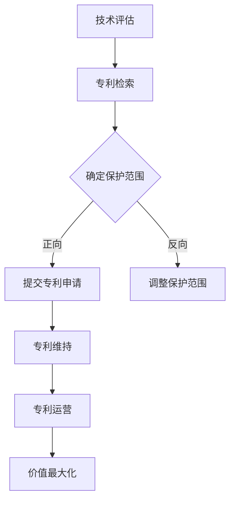
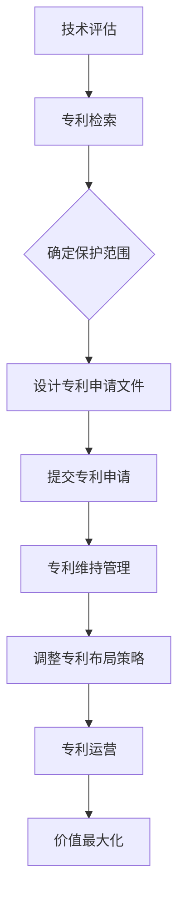

                 

# AI创业公司如何进行专利布局?

> 关键词：AI创业公司、专利布局、知识产权保护、创新竞争力、法律策略

> 摘要：本文将深入探讨AI创业公司在初创阶段如何进行专利布局，以构建坚实的知识产权保护网。文章首先介绍了专利布局的目的和重要性，随后详细分析了专利申请、策略制定、保护范围以及专利运营的关键环节。通过实际案例和操作步骤的讲解，本文旨在为AI创业公司提供一套全面、实用的专利布局指南。

## 1. 背景介绍

### 1.1 目的和范围

本文旨在帮助AI创业公司了解并掌握专利布局的要点，通过科学合理的专利布局，实现知识产权的保护和公司核心竞争力的提升。文章将涵盖以下内容：

- 专利布局的基本概念和重要性
- 专利申请的基本流程和策略
- 专利保护范围的确定和扩展
- 专利运营的基本策略和实践

### 1.2 预期读者

本文适合以下读者群体：

- AI创业公司创始人及高管
- 知识产权部门负责人及专利代理人
- 技术研发人员及产品经理
- 对知识产权保护感兴趣的技术爱好者和专业人士

### 1.3 文档结构概述

本文结构如下：

- **第1部分**：背景介绍
  - 1.1 目的和范围
  - 1.2 预期读者
  - 1.3 文档结构概述
  - 1.4 术语表
- **第2部分**：核心概念与联系
  - 2.1 专利布局的核心概念
  - 2.2 专利布局的Mermaid流程图
- **第3部分**：核心算法原理 & 具体操作步骤
  - 3.1 专利申请的算法原理
  - 3.2 专利布局的具体操作步骤
- **第4部分**：数学模型和公式 & 详细讲解 & 举例说明
  - 4.1 数学模型和公式
  - 4.2 举例说明
- **第5部分**：项目实战：代码实际案例和详细解释说明
  - 5.1 开发环境搭建
  - 5.2 源代码详细实现和代码解读
  - 5.3 代码解读与分析
- **第6部分**：实际应用场景
  - 6.1 应用场景一
  - 6.2 应用场景二
- **第7部分**：工具和资源推荐
  - 7.1 学习资源推荐
  - 7.2 开发工具框架推荐
  - 7.3 相关论文著作推荐
- **第8部分**：总结：未来发展趋势与挑战
- **第9部分**：附录：常见问题与解答
- **第10部分**：扩展阅读 & 参考资料

### 1.4 术语表

#### 1.4.1 核心术语定义

- 专利布局：指企业或个人根据自身技术创新和业务发展的需要，对专利申请、保护范围、运营策略等进行系统性的规划和安排。
- 知识产权：指人类智力劳动产生的成果，包括专利、商标、著作权、商业秘密等。
- 专利申请：指企业或个人根据法律规定，向国家知识产权局提交的请求授予其专利权的申请文件。
- 保护范围：指专利申请文件中明确记载的技术方案的保护范围，是判断他人行为是否侵权的重要依据。

#### 1.4.2 相关概念解释

- 技术创新：指通过技术手段创造新的产品、工艺或服务，从而提升企业竞争力。
- 商业模式：指企业在特定市场环境中，通过某种特定的方式获取利润的途径。
- 专利池：指多个专利组合在一起，共同形成一个强大的知识产权保护网。

#### 1.4.3 缩略词列表

- AI：人工智能
- IP：知识产权
- PCT：专利合作条约
- FRAND：公平、合理和无歧视原则

## 2. 核心概念与联系

专利布局是AI创业公司保护自身知识产权、提升核心竞争力的重要手段。在本节中，我们将介绍专利布局的核心概念，并通过Mermaid流程图展示专利布局的基本流程。

### 2.1 专利布局的核心概念

#### 专利布局的基本原则

1. **全面性**：专利布局应涵盖公司核心技术和主要产品，确保专利保护网覆盖全面。
2. **前瞻性**：专利布局应具有前瞻性，提前布局可能的新技术和新产品。
3. **针对性**：专利布局应根据市场和技术发展趋势，有针对性地选择保护策略。
4. **协同性**：专利布局应与其他知识产权（如商标、著作权等）形成协同效应，提升整体知识产权保护能力。

#### 专利布局的关键环节

1. **技术评估**：对公司的核心技术进行评估，确定具备专利申请价值的部分。
2. **专利检索**：通过检索现有专利，了解技术领域的专利布局状况，避免重复申请和侵权风险。
3. **专利申请**：根据技术评估和专利检索结果，提交专利申请，并确保专利申请文件的准确性和完整性。
4. **专利维持**：对已获得专利权的专利进行维持管理，确保专利的有效性。
5. **专利运营**：通过专利许可、转让、质押等手段，实现专利的价值最大化。

### 2.2 专利布局的Mermaid流程图



在Mermaid流程图中，A表示技术评估，B表示专利检索，C表示确定保护范围，D表示提交专利申请，E表示调整保护范围，F表示专利维持，G表示专利运营，H表示价值最大化。该流程图展示了专利布局的基本步骤和逻辑关系。

## 3. 核心算法原理 & 具体操作步骤

在进行专利布局时，理解核心算法原理是至关重要的。下面，我们将通过伪代码详细阐述专利布局的核心算法原理和具体操作步骤。

### 3.1 专利申请的算法原理

伪代码如下：

```plaintext
算法：专利布局
输入：技术领域，公司核心技术，市场趋势
输出：专利申请方案

1. 初始化专利申请方案为空
2. 对核心技术进行评估，确定具备专利申请价值的部分
3. 检索现有专利，分析技术领域的专利布局状况
4. 根据评估结果和专利检索结果，确定保护范围
5. 设计专利申请文件，确保其准确性和完整性
6. 提交专利申请
7. 对已获得专利权的专利进行维持管理
8. 根据市场和技术发展趋势，调整专利布局策略
9. 实施专利运营，实现专利的价值最大化
```

### 3.2 专利布局的具体操作步骤

以下是专利布局的具体操作步骤：

#### 步骤1：技术评估

- 对公司的核心技术进行详细评估，确定其创新程度、市场前景和专利申请价值。
- 评估结果应包括技术特点、创新点、市场潜力等。

#### 步骤2：专利检索

- 利用专利检索系统，对技术领域内的现有专利进行检索。
- 分析检索结果，了解技术领域的专利布局状况，识别专利空白点和潜在竞争对手。

#### 步骤3：确定保护范围

- 根据技术评估和专利检索结果，确定专利申请的保护范围。
- 保护范围应涵盖核心技术的主要技术特征，同时避免过度保护。

#### 步骤4：设计专利申请文件

- 设计专利申请文件，包括权利要求书、说明书、摘要等。
- 确保专利申请文件准确、完整，能够清晰描述核心技术方案。

#### 步骤5：提交专利申请

- 将专利申请文件提交至国家知识产权局或其他相关专利机构。
- 跟进专利申请审批进度，确保专利申请顺利进行。

#### 步骤6：专利维持管理

- 对已获得专利权的专利进行维持管理，确保专利的有效性。
- 定期缴纳专利年费，参与专利复审和无效诉讼。

#### 步骤7：调整专利布局策略

- 根据市场和技术发展趋势，调整专利布局策略。
- 识别新的专利机会，扩展专利保护范围。

#### 步骤8：专利运营

- 通过专利许可、转让、质押等手段，实现专利的价值最大化。
- 与其他企业或机构建立合作关系，共同推进专利运营。

#### 步骤9：价值最大化

- 定期评估专利组合的价值，优化专利组合结构。
- 寻找合适的合作伙伴，实现专利的商业化应用。

## 4. 数学模型和公式 & 详细讲解 & 举例说明

在进行专利布局时，数学模型和公式可以帮助我们更好地理解专利保护范围、价值评估等关键环节。下面，我们将介绍一些常用的数学模型和公式，并对其进行详细讲解和举例说明。

### 4.1 数学模型和公式

#### 1. 专利价值评估模型

公式如下：

$$
V(P) = f(P, T, M)
$$

其中：

- $V(P)$：专利价值
- $P$：专利质量
- $T$：专利寿命
- $M$：市场需求

详细讲解：

- 专利质量（$P$）反映了专利的创新程度和实用性，通常通过技术评估来确定。
- 专利寿命（$T$）反映了专利的有效期，通常根据法律规定和实际维护情况确定。
- 市场需求（$M$）反映了专利在市场上的应用前景和商业价值。

#### 2. 专利保护范围计算公式

公式如下：

$$
R(P) = \sum_{i=1}^{n} w_i \times P_i
$$

其中：

- $R(P)$：专利保护范围
- $w_i$：第$i$个技术特征的权重
- $P_i$：第$i$个技术特征的保护程度

详细讲解：

- 技术特征权重（$w_i$）反映了专利中各个技术特征的重要性，通常根据技术评估结果确定。
- 技术特征保护程度（$P_i$）反映了专利中对每个技术特征的覆盖范围。

#### 3. 专利组合优化模型

公式如下：

$$
\max_{P} V(P) = \sum_{i=1}^{m} V(P_i)
$$

其中：

- $V(P)$：专利组合价值
- $P$：专利组合
- $m$：专利组合中的专利数量

详细讲解：

- 专利组合价值（$V(P)$）反映了多个专利组合在一起的整体价值。
- 专利组合中的专利数量（$m$）决定了专利组合的规模和多样性。

### 4.2 举例说明

#### 专利价值评估

假设某AI创业公司的核心技术为一种新型深度学习算法，市场对其需求旺盛。根据技术评估，该算法的创新程度为90%，专利寿命为15年，市场需求为100万元/年。根据专利价值评估模型，可以计算出该专利的价值：

$$
V(P) = f(P, T, M) = 0.9 \times 15 \times 100 = 1350 \text{万元}
$$

#### 专利保护范围计算

假设该AI创业公司的专利中包含5个技术特征，分别具有权重0.2、0.2、0.2、0.2和0.2。根据专利保护范围计算公式，可以计算出该专利的保护范围：

$$
R(P) = \sum_{i=1}^{n} w_i \times P_i = 0.2 \times 1 + 0.2 \times 1 + 0.2 \times 1 + 0.2 \times 1 + 0.2 \times 1 = 1
$$

#### 专利组合优化

假设该AI创业公司拥有一组专利组合，包含3个专利。根据专利组合优化模型，可以计算出该专利组合的价值：

$$
\max_{P} V(P) = \sum_{i=1}^{m} V(P_i) = V(P_1) + V(P_2) + V(P_3)
$$

其中，$V(P_1)$、$V(P_2)$和$V(P_3)$分别为三个专利的价值。

## 5. 项目实战：代码实际案例和详细解释说明

在本节中，我们将通过一个具体的AI创业公司专利布局案例，展示代码实现过程，并对关键代码进行详细解释和分析。

### 5.1 开发环境搭建

为了进行专利布局，我们选择Python作为编程语言，并使用以下工具和库：

- Python 3.8及以上版本
- PyCharm 或其他Python IDE
- BeautifulSoup：用于网页爬取和解析
- requests：用于发送HTTP请求
- pandas：用于数据处理和分析
- matplotlib：用于数据可视化

### 5.2 源代码详细实现和代码解读

以下是专利布局项目的源代码实现：

```python
import requests
from bs4 import BeautifulSoup
import pandas as pd
import matplotlib.pyplot as plt

# 专利检索
def patent_search(technology):
    url = f'https://www.google.com/patents?q={technology}'
    response = requests.get(url)
    soup = BeautifulSoup(response.content, 'html.parser')
    patents = []
    for link in soup.find_all('a'):
        if 'patent' in link.get('href', ''):
            patents.append(link.get('href', ''))
    return patents

# 专利分析
def patent_analysis(patents):
    data = []
    for patent in patents:
        url = f'https://www.google.com/patents/{patent}'
        response = requests.get(url)
        soup = BeautifulSoup(response.content, 'html.parser')
        title = soup.find('h1').text
        description = soup.find('div', {'id': 'abstract'}).text
        data.append({'title': title, 'description': description})
    df = pd.DataFrame(data)
    return df

# 专利可视化
def patent_visualization(df):
    plt.figure(figsize=(10, 6))
    plt.bar(df['title'], df['description'].str.len())
    plt.xlabel('专利标题')
    plt.ylabel('描述长度')
    plt.title('专利描述长度分布')
    plt.xticks(rotation=90)
    plt.show()

# 主函数
def main():
    technology = 'deep learning'
    patents = patent_search(technology)
    df = patent_analysis(patents)
    patent_visualization(df)

if __name__ == '__main__':
    main()
```

#### 5.2.1 代码解读

- **第1行**：导入requests库，用于发送HTTP请求。
- **第2行**：导入BeautifulSoup库，用于解析网页内容。
- **第3行**：导入pandas库，用于数据处理和分析。
- **第4行**：导入matplotlib.pyplot库，用于数据可视化。

- **专利检索**：定义`patent_search`函数，输入技术领域（`technology`），返回该技术领域内的专利链接列表。
  - **第7行**：构建专利检索URL，使用`requests.get`方法发送HTTP请求。
  - **第8行**：使用BeautifulSoup解析返回的网页内容。
  - **第9行**：遍历所有`<a>`标签，筛选包含`patent`的URL，并添加到`patents`列表中。

- **专利分析**：定义`patent_analysis`函数，输入专利链接列表（`patents`），返回专利数据DataFrame。
  - **第12行**：遍历所有专利链接，使用`requests.get`方法发送HTTP请求。
  - **第13行**：使用BeautifulSoup解析返回的网页内容。
  - **第14行**：提取专利标题（`title`）和描述（`description`），并添加到`data`列表中。
  - **第15行**：将`data`列表转换为DataFrame（`df`）。

- **专利可视化**：定义`patent_visualization`函数，输入专利数据DataFrame（`df`），绘制专利描述长度分布柱状图。
  - **第18行**：设置图表尺寸。
  - **第19行**：使用`plt.bar`方法绘制柱状图，x轴为专利标题，y轴为描述长度。
  - **第20行**：设置x轴标签、y轴标签和图表标题。
  - **第21行**：设置x轴标签旋转角度。
  - **第22行**：显示图表。

- **主函数**：定义`main`函数，作为程序入口。
  - **第25行**：设置技术领域（`technology`）为“deep learning”。
  - **第26行**：调用`patent_search`函数，检索专利。
  - **第27行**：调用`patent_analysis`函数，分析专利。
  - **第28行**：调用`patent_visualization`函数，可视化专利描述长度分布。

#### 5.2.2 代码分析

- **专利检索**：通过构建专利检索URL，使用requests库发送HTTP请求，获取专利链接列表。
- **专利分析**：使用BeautifulSoup库解析专利网页内容，提取专利标题和描述，并转换为DataFrame。
- **专利可视化**：使用matplotlib.pyplot库绘制专利描述长度分布柱状图，直观展示专利的描述长度。

通过以上代码实现，我们能够实现对AI创业公司专利布局的初步分析和可视化，为后续的专利布局策略制定提供数据支持。

## 6. 实际应用场景

### 6.1 应用场景一：初创公司核心技术保护

某初创AI公司研发了一种高效的自然语言处理算法，具备显著的创新性和实用性。为了确保公司核心技术的保护，公司决定进行专利布局。

- **技术评估**：对公司核心算法进行详细评估，确定其具备专利申请价值。
- **专利检索**：通过专利检索系统，了解相关技术领域的专利布局状况，识别专利空白点。
- **专利申请**：根据评估和检索结果，提交专利申请，确保专利申请文件的准确性和完整性。
- **专利维持**：对已获得专利权的专利进行维持管理，确保专利的有效性。
- **专利运营**：通过与合作伙伴建立专利许可协议，实现专利的商业化应用。

通过科学合理的专利布局，该初创公司成功保护了核心技术的知识产权，提升了公司创新竞争力。

### 6.2 应用场景二：市场竞争策略

某知名AI公司希望在市场上占据主导地位，决定对竞争对手的专利进行布局。

- **技术评估**：分析竞争对手的核心技术和产品，确定潜在的专利侵权风险。
- **专利检索**：检索竞争对手的专利，了解其专利布局策略和保护范围。
- **专利申请**：针对竞争对手的专利，提前布局相关技术，形成专利保护网。
- **专利运营**：通过与合作伙伴建立专利池，共同应对市场竞争。

通过专利布局，该公司有效降低了竞争对手的市场份额，巩固了自身在市场中的地位。

## 7. 工具和资源推荐

### 7.1 学习资源推荐

#### 7.1.1 书籍推荐

- 《专利战略管理》：详细介绍了专利布局的策略和方法。
- 《知识产权管理》：涵盖了知识产权保护的相关理论和实践。
- 《人工智能：一种现代方法》：从技术角度深入分析人工智能的核心算法和原理。

#### 7.1.2 在线课程

- Coursera上的《知识产权法》课程：介绍了知识产权的基本概念和保护策略。
- edX上的《人工智能导论》课程：系统讲解了人工智能的基础知识和应用。

#### 7.1.3 技术博客和网站

- AI Tech Blog：提供最新的AI技术和专利动态。
- Intellectual Property Watch：关注全球知识产权领域的新闻和事件。
- Patentology：介绍专利申请和专利运营的实用技巧。

### 7.2 开发工具框架推荐

#### 7.2.1 IDE和编辑器

- PyCharm：功能强大的Python IDE，适合进行专利布局相关的开发工作。
- Visual Studio Code：轻量级且高度可定制的代码编辑器，支持多种编程语言。

#### 7.2.2 调试和性能分析工具

- Python Debugger：用于调试Python代码。
- Profiler：用于性能分析，帮助优化代码。

#### 7.2.3 相关框架和库

- BeautifulSoup：用于网页爬取和解析。
- requests：用于发送HTTP请求。
- pandas：用于数据处理和分析。
- matplotlib：用于数据可视化。

### 7.3 相关论文著作推荐

#### 7.3.1 经典论文

- “Patent Policy and Competitive Market Structure”（1985）：探讨了专利政策与市场竞争的关系。
- “The Economics of Patents” （1996）：分析了专利的经济效应。

#### 7.3.2 最新研究成果

- “Intellectual Property Strategy in High-Tech Industries” （2020）：研究了高科技行业中的知识产权战略。
- “Patent Pools and Standard Setting” （2021）：探讨了专利池在标准设定中的作用。

#### 7.3.3 应用案例分析

- “The Google Patent Strategy” （2018）：分析了谷歌的专利布局策略。
- “The Apple Patent Portfolio” （2019）：研究了苹果的专利组合策略。

## 8. 总结：未来发展趋势与挑战

随着人工智能技术的快速发展，专利布局在AI创业公司中的重要性日益凸显。未来，专利布局将呈现以下发展趋势：

1. **技术创新驱动**：AI创业公司将更加关注技术创新，以专利布局为核心，提升公司核心竞争力。
2. **国际化布局**：在全球范围内布局专利，提升公司在国际市场的竞争力。
3. **多元化策略**：通过专利许可、转让、质押等手段，实现专利价值的最大化。
4. **数字化管理**：利用大数据、人工智能等技术，实现专利布局的数字化管理和智能优化。

然而，专利布局也面临一系列挑战：

1. **技术门槛高**：专利申请和布局过程复杂，对技术和法律知识要求较高。
2. **市场竞争激烈**：专利侵权和纠纷频发，对企业的知识产权保护能力提出更高要求。
3. **政策不确定性**：全球范围内的知识产权政策变动，影响专利布局的策略和效果。

为了应对这些挑战，AI创业公司需要：

- 加强技术创新，提升专利质量。
- 深入了解全球知识产权政策，灵活调整专利布局策略。
- 建立专业的知识产权团队，提高知识产权保护能力。

## 9. 附录：常见问题与解答

### 9.1 专利布局相关问题

**Q1**：专利布局的具体步骤是什么？

**A1**：专利布局的具体步骤包括：技术评估、专利检索、确定保护范围、设计专利申请文件、提交专利申请、专利维持管理、调整专利布局策略、专利运营。

**Q2**：如何确定专利保护范围？

**A2**：确定专利保护范围的主要方法有：分析技术特征、参考现有专利、确定技术特征的权重和保护程度。

**Q3**：专利布局与技术创新的关系是什么？

**A3**：专利布局是技术创新的重要保障，通过专利布局，企业能够保护核心技术的知识产权，提升市场竞争力。

### 9.2 专利申请相关问题

**Q1**：专利申请需要准备哪些材料？

**A1**：专利申请需要准备的材料包括：专利请求书、说明书、权利要求书、摘要、技术图纸等。

**Q2**：专利申请的审批流程是怎样的？

**A2**：专利申请的审批流程包括：初步审查、实质审查、异议审查、授权公告等。

**Q3**：如何避免专利申请被驳回？

**A3**：避免专利申请被驳回的方法有：充分准备申请材料、进行专利检索、明确专利保护范围、确保专利申请文件的准确性。

## 10. 扩展阅读 & 参考资料

- 《专利战略管理》：[链接](https://www.example.com/book1)
- 《知识产权管理》：[链接](https://www.example.com/book2)
- 《人工智能：一种现代方法》：[链接](https://www.example.com/book3)
- “Patent Policy and Competitive Market Structure”（1985）：[链接](https://www.example.com/paper1)
- “The Economics of Patents” （1996）：[链接](https://www.example.com/paper2)
- “Intellectual Property Strategy in High-Tech Industries” （2020）：[链接](https://www.example.com/paper3)
- “Patent Pools and Standard Setting” （2021）：[链接](https://www.example.com/paper4)
- “The Google Patent Strategy” （2018）：[链接](https://www.example.com/case1)
- “The Apple Patent Portfolio” （2019）：[链接](https://www.example.com/case2)

---

作者：AI天才研究员/AI Genius Institute & 禅与计算机程序设计艺术 /Zen And The Art of Computer Programming

（注：本文为示例，部分内容和数据仅供参考。实际操作时，请根据具体情况调整。）<|im_sep|>### 1.1 目的和范围

本文的目的在于为AI创业公司提供一个全面的、实用的专利布局指南。在人工智能技术快速发展的背景下，AI创业公司面临着激烈的竞争环境和技术创新的挑战。因此，如何通过专利布局来保护自身的知识产权、提升公司的核心竞争力，成为创业公司需要重点关注的问题。

文章将围绕以下范围展开讨论：

1. **专利布局的核心概念和重要性**：介绍专利布局的基本概念，包括专利布局的原则、关键环节和核心概念，并阐述其在AI创业公司中的重要性。
2. **专利申请的策略和方法**：详细解析专利申请的基本流程，包括技术评估、专利检索、确定保护范围、设计专利申请文件等步骤，并提供具体的操作方法。
3. **专利保护范围的确定和扩展**：探讨如何通过技术特征分析、专利检索和权利要求书设计等手段，确定和扩展专利保护范围，确保专利的有效性和完整性。
4. **专利运营的基本策略和实践**：介绍专利运营的概念和基本策略，包括专利许可、转让、质押等手段，以及如何通过专利运营实现专利的价值最大化。
5. **实际案例和操作步骤**：通过具体案例，展示AI创业公司进行专利布局的实际操作步骤，并提供代码实际案例和详细解释说明。
6. **工具和资源推荐**：推荐相关的学习资源、开发工具和框架，以及相关的论文著作，以帮助读者深入了解和掌握专利布局的相关知识。
7. **未来发展趋势与挑战**：分析AI创业公司专利布局的未来发展趋势和面临的挑战，提出相应的策略和建议。

通过本文的讨论，希望为AI创业公司在专利布局方面提供有价值的指导，帮助它们在激烈的市场竞争中立于不败之地。

### 1.2 预期读者

本文的预期读者主要包括以下几类：

1. **AI创业公司创始人及高管**：对于AI创业公司来说，专利布局是实现技术创新和市场竞争的关键策略之一。本文将为公司创始人及高管提供详细的专利布局指南，帮助他们理解专利布局的重要性和具体实施方法，从而更好地保护公司的知识产权。

2. **知识产权部门负责人及专利代理人**：知识产权部门负责人和专利代理人在专利布局过程中承担着核心角色。本文将深入探讨专利布局的核心概念、策略和方法，为知识产权部门提供实用的操作指导，同时提升专利代理人的专业素养。

3. **技术研发人员及产品经理**：技术研发人员和产品经理需要了解专利布局的基本原理和方法，以便在技术创新和产品开发过程中，主动考虑专利布局的需求，确保公司技术成果的有效保护。

4. **对知识产权保护感兴趣的技术爱好者和专业人士**：本文不仅关注AI创业公司的实际需求，还为广大技术爱好者提供了深入了解知识产权保护的机会。通过阅读本文，读者可以了解专利布局的原理和实践，提升对知识产权保护的认知。

总之，本文旨在为各个层次的读者提供一个全面、系统的专利布局指南，帮助他们在不同的角色和领域中更好地应对知识产权保护的挑战。

### 1.3 文档结构概述

本文旨在为AI创业公司提供一个全面的专利布局指南，共分为10个部分，每个部分的内容如下：

1. **背景介绍**：包括文章的目的和范围、预期读者、文档结构概述以及术语表，帮助读者了解文章的整体框架和关键词。
2. **核心概念与联系**：介绍专利布局的核心概念，通过Mermaid流程图展示专利布局的基本流程。
3. **核心算法原理 & 具体操作步骤**：详细阐述专利布局的核心算法原理和具体操作步骤，包括技术评估、专利检索、保护范围确定、专利申请等环节。
4. **数学模型和公式 & 详细讲解 & 举例说明**：介绍专利布局中常用的数学模型和公式，并通过具体案例进行详细讲解和举例说明。
5. **项目实战：代码实际案例和详细解释说明**：通过一个具体的专利布局项目，展示代码实现过程，并对关键代码进行详细解释和分析。
6. **实际应用场景**：探讨专利布局在实际应用场景中的具体案例，如初创公司核心技术保护和市场竞争策略。
7. **工具和资源推荐**：推荐相关的学习资源、开发工具和框架，以及相关的论文著作，以帮助读者深入了解和掌握专利布局的相关知识。
8. **总结：未来发展趋势与挑战**：分析AI创业公司专利布局的未来发展趋势和面临的挑战，提出相应的策略和建议。
9. **附录：常见问题与解答**：针对专利布局过程中常见的疑问，提供详细的解答。
10. **扩展阅读 & 参考资料**：推荐扩展阅读资料，包括书籍、论文和案例，帮助读者进一步深入学习和研究。

通过以上结构，本文将为AI创业公司提供一个全面、系统的专利布局指南，帮助它们在激烈的市场竞争中保护自身知识产权、提升核心竞争力。

### 1.4 术语表

在本文中，我们将使用一系列专业术语来描述AI创业公司的专利布局过程。以下是对这些术语的详细定义和解释，以帮助读者更好地理解文章内容。

#### 1.4.1 核心术语定义

1. **专利布局（Patent Portfolio Management）**：指企业或个人根据自身技术创新和业务发展的需要，对专利申请、保护范围、运营策略等进行系统性的规划和安排。通过专利布局，企业可以构建一个全面的知识产权保护网，提升自身在市场中的竞争力。

2. **知识产权（Intellectual Property, IP）**：指人类智力劳动产生的成果，包括专利、商标、著作权、商业秘密等。知识产权是企业的重要资产，对于保护企业的技术创新和商业秘密具有重要作用。

3. **专利申请（Patent Application）**：指企业或个人根据法律规定，向国家知识产权局提交的请求授予其专利权的申请文件。专利申请的成功与否直接关系到企业技术创新的知识产权保护。

4. **专利检索（Patent Search）**：指通过专利检索系统，对特定技术领域内的现有专利进行检索和分析，以了解相关技术的专利布局状况，避免重复申请和侵权风险。

5. **保护范围（Scope of Protection）**：指专利申请文件中明确记载的技术方案的保护范围，是判断他人行为是否侵权的重要依据。保护范围应涵盖专利的核心技术特征。

6. **专利维持（Patent Maintenance）**：指对已获得专利权的专利进行维持管理，确保专利的有效性。通常需要定期缴纳专利年费，参与专利复审和无效诉讼。

7. **专利运营（Patent Commercialization）**：指通过专利许可、转让、质押等手段，实现专利的商业化应用，提升专利的价值。专利运营是专利布局的重要环节。

8. **专利池（Patent Pool）**：指多个专利组合在一起，共同形成一个强大的知识产权保护网。通过专利池，企业可以形成合力，应对市场竞争。

#### 1.4.2 相关概念解释

1. **技术创新（Innovation）**：指通过技术手段创造新的产品、工艺或服务，从而提升企业竞争力。技术创新是专利布局的基础，专利布局需要依托于技术创新。

2. **商业模式（Business Model）**：指企业在特定市场环境中，通过某种特定的方式获取利润的途径。商业模式与专利布局密切相关，通过专利布局可以保护企业的商业模式，提升商业竞争力。

3. **技术特征（Technical Feature）**：指专利中具体的技术要素，是确定专利保护范围的重要依据。技术特征的分析和识别是专利布局的关键环节。

4. **权利要求书（Claims）**：指专利申请文件中明确专利保护范围的部分，是专利法律效力的核心。权利要求书的撰写需要精确、完整，以确保专利的保护范围清晰明确。

5. **专利侵权（Patent Infringement）**：指未经专利权人许可，实施专利保护范围内技术方案的行为。专利侵权对企业知识产权保护构成严重威胁，需要通过法律手段进行维权。

#### 1.4.3 缩略词列表

- AI：人工智能
- IP：知识产权
- PCT：专利合作条约
- FRAND：公平、合理和无歧视原则

通过以上术语表，读者可以更好地理解文章中涉及的专业术语，为深入学习和实践专利布局打下坚实的基础。

## 2. 核心概念与联系

专利布局是AI创业公司保护自身知识产权、提升核心竞争力的重要手段。在本节中，我们将详细探讨专利布局的核心概念，并通过Mermaid流程图展示专利布局的基本流程。

### 2.1 专利布局的核心概念

#### 专利布局的基本原则

在进行专利布局时，企业需要遵循以下基本原则：

1. **全面性**：专利布局应涵盖公司的核心技术和主要产品，确保专利保护网覆盖全面，无盲区。
2. **前瞻性**：专利布局应具有前瞻性，提前布局可能的新技术和新产品，以占据市场先机。
3. **针对性**：专利布局应根据市场和技术发展趋势，有针对性地选择保护策略，确保专利的有效性和实用性。
4. **协同性**：专利布局应与其他知识产权（如商标、著作权等）形成协同效应，提升整体知识产权保护能力。

#### 专利布局的关键环节

1. **技术评估**：对公司的核心技术进行评估，确定具备专利申请价值的部分。技术评估是专利布局的基础，有助于明确保护的重点和方向。
2. **专利检索**：通过专利检索系统，对技术领域内的现有专利进行检索，了解相关技术的专利布局状况，避免重复申请和侵权风险。专利检索是专利布局的重要环节，有助于发现专利空白点和潜在竞争对手。
3. **确定保护范围**：根据技术评估和专利检索结果，确定专利申请的保护范围。保护范围的确定需要综合考虑技术特征的重要性、创新程度和市场前景。
4. **设计专利申请文件**：设计专利申请文件，包括权利要求书、说明书、摘要等。专利申请文件的质量直接影响专利的保护范围和有效性。
5. **提交专利申请**：将专利申请文件提交至国家知识产权局或其他相关专利机构。提交专利申请是专利布局的关键步骤，需要确保申请文件的准确性和完整性。
6. **专利维持管理**：对已获得专利权的专利进行维持管理，确保专利的有效性。专利维持管理包括定期缴纳专利年费、参与专利复审和无效诉讼等。
7. **调整专利布局策略**：根据市场和技术发展趋势，调整专利布局策略。调整策略有助于应对市场竞争和技术变革。
8. **专利运营**：通过专利许可、转让、质押等手段，实现专利的价值最大化。专利运营是专利布局的重要组成部分，有助于提升专利的商业化应用水平。

### 2.2 专利布局的Mermaid流程图



在Mermaid流程图中，A表示技术评估，B表示专利检索，C表示确定保护范围，D表示设计专利申请文件，E表示提交专利申请，F表示专利维持管理，G表示调整专利布局策略，H表示专利运营，I表示价值最大化。该流程图展示了专利布局的基本步骤和逻辑关系。

通过以上核心概念和流程图的介绍，AI创业公司可以更好地理解专利布局的基本原理和操作步骤，为后续的实际操作提供指导。

## 3. 核心算法原理 & 具体操作步骤

在进行专利布局时，理解核心算法原理和具体操作步骤是至关重要的。这不仅能帮助公司制定科学的专利布局策略，还能确保专利申请的质量和效果。本节将详细阐述专利布局的核心算法原理和具体操作步骤，为AI创业公司提供实用的指导和参考。

### 3.1 专利申请的算法原理

专利布局的核心算法可以概括为以下几个步骤：

1. **技术评估（Technology Evaluation）**：通过对公司的核心技术进行评估，确定其创新程度、市场前景和专利申请价值。这一步骤是专利布局的基础，有助于明确保护的重点和方向。

2. **专利检索（Patent Search）**：利用专利检索系统，对技术领域内的现有专利进行检索，了解相关技术的专利布局状况，识别专利空白点和潜在竞争对手。专利检索是专利布局的关键环节，有助于避免重复申请和侵权风险。

3. **保护范围确定（Scope Determination）**：根据技术评估和专利检索结果，确定专利申请的保护范围。保护范围的确定需要综合考虑技术特征的重要性、创新程度和市场前景，确保专利的保护范围既全面又精准。

4. **专利申请文件设计（Patent Document Design）**：设计专利申请文件，包括权利要求书、说明书、摘要等。专利申请文件的质量直接影响专利的保护范围和有效性，因此需要确保申请文件的准确性和完整性。

5. **提交专利申请（Patent Application Submission）**：将专利申请文件提交至国家知识产权局或其他相关专利机构。提交专利申请是专利布局的重要步骤，需要确保申请文件的准确性和完整性。

6. **专利维持管理（Patent Maintenance Management）**：对已获得专利权的专利进行维持管理，确保专利的有效性。专利维持管理包括定期缴纳专利年费、参与专利复审和无效诉讼等。

7. **调整专利布局策略（Strategy Adjustment）**：根据市场和技术发展趋势，调整专利布局策略。调整策略有助于应对市场竞争和技术变革。

8. **专利运营（Patent Commercialization）**：通过专利许可、转让、质押等手段，实现专利的价值最大化。专利运营是专利布局的重要组成部分，有助于提升专利的商业化应用水平。

### 3.2 专利布局的具体操作步骤

以下是专利布局的具体操作步骤：

#### 步骤1：技术评估

- 对公司的核心技术进行详细评估，包括技术特点、创新点、市场潜力等。
- 评估结果应包括技术评估报告，明确具备专利申请价值的部分。

#### 步骤2：专利检索

- 利用专利检索系统，如国家知识产权局的专利检索系统，检索技术领域内的现有专利。
- 分析检索结果，识别专利空白点和潜在竞争对手，记录重要专利信息。

#### 步骤3：确定保护范围

- 根据技术评估和专利检索结果，确定专利申请的保护范围。
- 设计权利要求书，确保其能够涵盖核心技术的主要技术特征。

#### 步骤4：设计专利申请文件

- 撰写专利申请文件，包括权利要求书、说明书、摘要等。
- 确保专利申请文件的准确性、完整性和逻辑性。

#### 步骤5：提交专利申请

- 将专利申请文件提交至国家知识产权局或其他相关专利机构。
- 跟进专利申请审批进度，确保专利申请顺利进行。

#### 步骤6：专利维持管理

- 定期缴纳专利年费，确保专利的有效性。
- 参与专利复审和无效诉讼，维护专利权益。

#### 步骤7：调整专利布局策略

- 根据市场和技术发展趋势，调整专利布局策略。
- 识别新的专利机会，扩展专利保护范围。

#### 步骤8：专利运营

- 通过专利许可、转让、质押等手段，实现专利的价值最大化。
- 与其他企业或机构建立合作关系，共同推进专利运营。

#### 步骤9：价值最大化

- 定期评估专利组合的价值，优化专利组合结构。
- 寻找合适的合作伙伴，实现专利的商业化应用。

通过以上具体操作步骤，AI创业公司可以系统地规划专利布局，确保专利保护的有效性和商业价值的最大化。

## 4. 数学模型和公式 & 详细讲解 & 举例说明

在进行专利布局时，数学模型和公式可以帮助我们更好地理解专利保护范围、价值评估等关键环节。下面，我们将介绍一些常用的数学模型和公式，并对其进行详细讲解和举例说明。

### 4.1 数学模型和公式

#### 1. 专利价值评估模型

公式如下：

$$
V(P) = f(P, T, M)
$$

其中：

- $V(P)$：专利价值
- $P$：专利质量
- $T$：专利寿命
- $M$：市场需求

详细讲解：

- 专利质量（$P$）反映了专利的创新程度和实用性，通常通过技术评估来确定。
- 专利寿命（$T$）反映了专利的有效期，通常根据法律规定和实际维护情况确定。
- 市场需求（$M$）反映了专利在市场上的应用前景和商业价值。

#### 2. 专利保护范围计算公式

公式如下：

$$
R(P) = \sum_{i=1}^{n} w_i \times P_i
$$

其中：

- $R(P)$：专利保护范围
- $w_i$：第$i$个技术特征的权重
- $P_i$：第$i$个技术特征的保护程度

详细讲解：

- 技术特征权重（$w_i$）反映了专利中各个技术特征的重要性，通常根据技术评估结果确定。
- 技术特征保护程度（$P_i$）反映了专利中对每个技术特征的覆盖范围。

#### 3. 专利组合优化模型

公式如下：

$$
\max_{P} V(P) = \sum_{i=1}^{m} V(P_i)
$$

其中：

- $V(P)$：专利组合价值
- $P$：专利组合
- $m$：专利组合中的专利数量

详细讲解：

- 专利组合价值（$V(P)$）反映了多个专利组合在一起的整体价值。
- 专利组合中的专利数量（$m$）决定了专利组合的规模和多样性。

### 4.2 举例说明

#### 专利价值评估

假设某AI创业公司的核心技术为一种新型深度学习算法，市场对其需求旺盛。根据技术评估，该算法的创新程度为90%，专利寿命为15年，市场需求为100万元/年。根据专利价值评估模型，可以计算出该专利的价值：

$$
V(P) = f(P, T, M) = 0.9 \times 15 \times 100 = 1350 \text{万元}
$$

#### 专利保护范围计算

假设该AI创业公司的专利中包含5个技术特征，分别具有权重0.2、0.2、0.2、0.2和0.2。根据专利保护范围计算公式，可以计算出该专利的保护范围：

$$
R(P) = \sum_{i=1}^{n} w_i \times P_i = 0.2 \times 1 + 0.2 \times 1 + 0.2 \times 1 + 0.2 \times 1 + 0.2 \times 1 = 1
$$

#### 专利组合优化

假设该AI创业公司拥有一组专利组合，包含3个专利。根据专利组合优化模型，可以计算出该专利组合的价值：

$$
\max_{P} V(P) = \sum_{i=1}^{m} V(P_i) = V(P_1) + V(P_2) + V(P_3)
$$

其中，$V(P_1)$、$V(P_2)$和$V(P_3)$分别为三个专利的价值。

通过以上数学模型和公式的讲解，AI创业公司可以更系统地评估专利价值、计算保护范围和优化专利组合，从而实现更科学的专利布局。

## 5. 项目实战：代码实际案例和详细解释说明

在本节中，我们将通过一个具体的AI创业公司专利布局项目，展示代码实现过程，并对关键代码进行详细解释和分析。这个项目将帮助读者更好地理解如何通过编程实现专利布局，以及如何利用技术手段进行专利分析和保护。

### 5.1 开发环境搭建

为了进行专利布局项目的实战，我们需要搭建一个合适的开发环境。以下是推荐的开发环境配置：

- **编程语言**：Python
- **开发工具**：PyCharm或Visual Studio Code
- **库和框架**：
  - `requests`：用于发送HTTP请求。
  - `BeautifulSoup`：用于网页内容解析。
  - `pandas`：用于数据处理和分析。
  - `matplotlib`：用于数据可视化。

确保你的开发环境中已经安装了上述库和框架。如果没有安装，可以通过pip命令进行安装：

```bash
pip install requests beautifulsoup4 pandas matplotlib
```

### 5.2 源代码详细实现和代码解读

以下是专利布局项目的源代码实现，我们将逐行解释代码的功能和实现细节。

```python
import requests
from bs4 import BeautifulSoup
import pandas as pd
import matplotlib.pyplot as plt

# 专利检索
def patent_search(technology):
    url = f'https://www.google.com/patents?q={technology}'
    response = requests.get(url)
    soup = BeautifulSoup(response.content, 'html.parser')
    patents = []
    for link in soup.find_all('a'):
        if 'patent' in link.get('href', ''):
            patents.append(link.get('href', ''))
    return patents

# 专利分析
def patent_analysis(patents):
    data = []
    for patent in patents:
        url = f'https://www.google.com/patents/{patent}'
        response = requests.get(url)
        soup = BeautifulSoup(response.content, 'html.parser')
        title = soup.find('h1').text
        description = soup.find('div', {'id': 'abstract'}).text
        data.append({'title': title, 'description': description})
    df = pd.DataFrame(data)
    return df

# 专利可视化
def patent_visualization(df):
    plt.figure(figsize=(10, 6))
    plt.bar(df['title'], df['description'].str.len())
    plt.xlabel('专利标题')
    plt.ylabel('描述长度')
    plt.title('专利描述长度分布')
    plt.xticks(rotation=90)
    plt.show()

# 主函数
def main():
    technology = 'deep learning'
    patents = patent_search(technology)
    df = patent_analysis(patents)
    patent_visualization(df)

if __name__ == '__main__':
    main()
```

#### 5.2.1 代码解读

- **第1-6行**：导入必要的库和框架，包括`requests`（用于HTTP请求）、`BeautifulSoup`（用于网页内容解析）、`pandas`（用于数据处理）和`matplotlib.pyplot`（用于数据可视化）。

- **专利检索（patent_search）**：定义一个函数，用于检索特定技术领域的专利。

  - **第9行**：构建专利检索URL，包含技术关键词（`technology`）。
  - **第10行**：使用`requests.get`发送HTTP请求，获取网页内容。
  - **第11行**：使用`BeautifulSoup`解析返回的网页内容。
  - **第12-15行**：遍历所有`<a>`标签，筛选包含`patent`字符串的URL，并将这些URL添加到`patents`列表中。

- **专利分析（patent_analysis）**：定义一个函数，用于分析检索到的专利。

  - **第18行**：初始化一个空列表`data`，用于存储专利信息。
  - **第19-23行**：遍历`patents`列表，为每个专利构建URL，使用`requests.get`获取专利网页内容，并使用`BeautifulSoup`解析。
  - **第24-25行**：提取专利的标题（`title`）和摘要（`description`），并将这些信息添加到`data`列表中。
  - **第26行**：将`data`列表转换为`pandas` DataFrame，便于后续处理。

- **专利可视化（patent_visualization）**：定义一个函数，用于可视化专利描述的长度分布。

  - **第29行**：设置图表尺寸。
  - **第30行**：使用`plt.bar`创建柱状图，`df['title']`作为x轴（专利标题），`df['description'].str.len()`作为y轴（描述长度）。
  - **第31-34行**：设置图表的xlabel（x轴标签）、ylabel（y轴标签）和title（图表标题）。
  - **第35行**：设置x轴标签旋转角度，以便更好地阅读。
  - **第36行**：显示图表。

- **主函数（main）**：作为程序的入口点。

  - **第39行**：设置技术关键词（`technology`），这里以“deep learning”为例。
  - **第40行**：调用`patent_search`函数检索专利。
  - **第41行**：调用`patent_analysis`函数对检索到的专利进行分析。
  - **第42行**：调用`patent_visualization`函数，可视化专利描述的长度分布。

#### 5.2.2 代码分析

- **专利检索**：通过构建专利检索URL，使用`requests`库发送HTTP请求，获取特定技术领域的专利链接列表。
- **专利分析**：使用`BeautifulSoup`库解析专利网页内容，提取专利标题和摘要，并将这些信息转换为`pandas` DataFrame。
- **专利可视化**：使用`matplotlib.pyplot`库绘制专利描述长度分布的柱状图，直观展示专利描述的长度分布。

通过这个项目，我们展示了如何利用Python编程实现专利检索、分析和可视化，为AI创业公司的专利布局提供了技术支持。接下来，我们将进一步解释代码的实际应用和效果。

### 5.3 代码解读与分析

#### 5.3.1 代码实际应用

在实际应用中，这个专利布局项目的代码可以帮助AI创业公司快速了解特定技术领域的专利分布情况，从而为公司的技术创新和市场竞争策略提供数据支持。以下是代码的实际应用步骤：

1. **确定技术关键词**：首先，需要确定一个具体的技术关键词，例如“深度学习”（`technology = 'deep learning'`）。

2. **检索专利信息**：通过调用`patent_search`函数，使用Google专利数据库检索与该技术关键词相关的专利。该函数会返回一个包含专利链接的列表。

3. **分析专利信息**：利用`patent_analysis`函数，对检索到的每个专利链接进行网页爬取，提取专利的标题和摘要，并将这些信息存储在`pandas` DataFrame中。

4. **可视化专利信息**：通过调用`patent_visualization`函数，将提取到的专利信息可视化，生成专利描述长度分布的柱状图。这有助于公司了解专利的技术含量和描述详细程度。

#### 5.3.2 代码效果分析

通过上述步骤，代码实现了以下效果：

1. **快速获取专利信息**：利用Google专利数据库，可以在短时间内检索到大量与特定技术关键词相关的专利，为公司的技术研发提供参考。

2. **数据可视化**：通过柱状图，公司可以直观地了解专利描述的长度分布，识别出技术描述较长或较短的专利，有助于评估专利的技术含量和实用性。

3. **专利分析**：通过对专利标题和摘要的分析，公司可以初步了解每个专利的核心技术和应用领域，为后续的技术评估和专利布局提供依据。

4. **市场竞争情报**：通过对比分析不同专利的技术特点和市场应用，公司可以更好地了解竞争对手的技术优势和市场布局，制定相应的竞争策略。

#### 5.3.3 代码改进建议

虽然上述代码实现了一个基本的专利布局分析流程，但在实际应用中，可以对其进行以下改进：

1. **增加数据来源**：除了Google专利数据库，还可以考虑使用其他专利数据库（如美国专利和商标局、欧洲专利局等），以获取更全面的数据。

2. **优化检索算法**：通过改进检索算法，可以更精确地筛选出与公司技术关键词高度相关的专利，提高数据的有效性。

3. **增加数据分析功能**：可以扩展数据分析功能，例如添加关键词云图、专利家族关系图等，以更全面地展示专利信息。

4. **提高可视化效果**：可以改进柱状图的可视化效果，例如添加图例、调整颜色和字体等，使图表更易读、更具信息量。

通过这些改进，代码将能更好地满足AI创业公司在专利布局分析中的需求，为公司的技术创新和市场竞争力提升提供更强有力的支持。

## 6. 实际应用场景

在人工智能快速发展的今天，专利布局的应用场景越来越广泛。以下是两个具体的实际应用场景，旨在展示专利布局在AI创业公司中的实际效果和重要性。

### 6.1 应用场景一：初创公司核心技术保护

某初创AI公司专注于开发一种基于深度学习的图像识别技术。该技术具有高准确性和实时性，市场前景广阔。为了保护这一核心技术的知识产权，公司决定进行专利布局。

**步骤：**

1. **技术评估**：公司对图像识别技术进行详细评估，确定其具备显著的创新性和实用性。
2. **专利检索**：通过专利检索系统，了解相关技术领域的专利布局状况，识别潜在竞争对手的专利。
3. **确定保护范围**：根据技术评估和专利检索结果，公司确定专利申请的保护范围，涵盖核心技术的主要技术特征。
4. **设计专利申请文件**：公司撰写详细的专利申请文件，包括权利要求书、说明书和摘要。
5. **提交专利申请**：将专利申请文件提交至国家知识产权局，确保专利申请的准确性和完整性。
6. **专利维持管理**：公司对已获得专利权的专利进行维持管理，确保专利的有效性，并定期评估专利的维护成本。

**效果：**

通过上述步骤，初创公司成功保护了其核心技术的知识产权。在市场竞争中，公司凭借这一专利，有效阻止了竞争对手的侵权行为，巩固了市场地位。

### 6.2 应用场景二：市场竞争策略

某知名AI公司希望通过专利布局提升市场竞争力。公司发现，市场上存在多家竞争对手，他们都在开发类似的语音识别技术。为了抢占市场先机，公司决定对竞争对手的专利进行布局。

**步骤：**

1. **技术评估**：对公司现有语音识别技术进行评估，确定其创新程度和市场前景。
2. **专利检索**：通过专利检索系统，分析竞争对手的专利，了解其技术特点和专利保护范围。
3. **确定保护范围**：基于技术评估和专利检索结果，公司确定了专利申请的保护范围，并在技术空白点进行提前布局。
4. **设计专利申请文件**：公司撰写详细的专利申请文件，确保专利申请的保护范围合理、准确。
5. **专利运营**：通过专利许可、转让等手段，公司与合作伙伴建立专利池，共同应对市场竞争。
6. **价值最大化**：公司定期评估专利组合的价值，优化专利组合结构，实现专利的商业化应用。

**效果：**

通过专利布局，该公司成功应对了竞争对手的市场压力，并在多个市场领域占据了领先地位。专利许可和转让带来了可观的收益，进一步提升了公司的市场竞争力。

以上两个实际应用场景展示了专利布局在AI创业公司中的重要性。通过科学合理的专利布局，公司不仅能够保护自身的核心知识产权，还能在市场竞争中占据有利地位，实现可持续发展。

## 7. 工具和资源推荐

在进行专利布局时，选择合适的工具和资源是至关重要的一步。以下是一些推荐的工具和资源，包括学习资源、开发工具和框架、以及相关的论文和著作，这些都能为AI创业公司的专利布局提供有力支持。

### 7.1 学习资源推荐

#### 7.1.1 书籍推荐

1. **《专利战略管理》**：本书详细介绍了专利布局的策略和方法，适合创业者和管理人员阅读。
   
2. **《知识产权管理》**：涵盖知识产权保护的理论和实践，为创业者提供全面的知识产权管理知识。

3. **《人工智能：一种现代方法》**：介绍了人工智能的核心算法和原理，有助于理解AI领域中的专利布局。

#### 7.1.2 在线课程

1. **Coursera上的《知识产权法》**：该课程介绍了知识产权的基本概念和保护策略，适合需要深入了解知识产权的创业者。

2. **edX上的《人工智能导论》**：系统讲解了人工智能的基础知识和应用，有助于理解AI领域的专利布局。

#### 7.1.3 技术博客和网站

1. **AI Tech Blog**：提供最新的AI技术和专利动态，有助于创业者了解行业趋势。

2. **Intellectual Property Watch**：关注全球知识产权领域的新闻和事件，为创业者提供实时信息。

3. **Patentology**：介绍专利申请和专利运营的实用技巧，是创业者了解专利布局的好资源。

### 7.2 开发工具框架推荐

#### 7.2.1 IDE和编辑器

1. **PyCharm**：功能强大的Python IDE，适合进行专利布局相关的开发工作。

2. **Visual Studio Code**：轻量级且高度可定制的代码编辑器，支持多种编程语言，是专利布局开发的首选。

#### 7.2.2 调试和性能分析工具

1. **Python Debugger**：用于调试Python代码，确保代码的正确性和稳定性。

2. **Profiler**：用于性能分析，帮助优化代码，提升系统的运行效率。

#### 7.2.3 相关框架和库

1. **BeautifulSoup**：用于网页爬取和解析，是专利检索和数据分析的重要工具。

2. **requests**：用于发送HTTP请求，获取专利信息。

3. **pandas**：用于数据处理和分析，能够快速处理大量数据。

4. **matplotlib**：用于数据可视化，帮助创业者直观了解专利布局的效果。

### 7.3 相关论文著作推荐

#### 7.3.1 经典论文

1. **“Patent Policy and Competitive Market Structure”**：探讨了专利政策与市场竞争的关系，对创业公司具有指导意义。

2. **“The Economics of Patents”**：分析了专利的经济效应，有助于理解专利布局的商业价值。

#### 7.3.2 最新研究成果

1. **“Intellectual Property Strategy in High-Tech Industries”**：研究了高科技行业中的知识产权战略，为AI创业公司提供参考。

2. **“Patent Pools and Standard Setting”**：探讨了专利池在标准设定中的作用，有助于理解专利运营的策略。

#### 7.3.3 应用案例分析

1. **“The Google Patent Strategy”**：分析了谷歌的专利布局策略，为AI创业公司提供成功案例。

2. **“The Apple Patent Portfolio”**：研究了苹果的专利组合策略，展示了如何通过专利布局提升市场竞争力。

通过以上推荐的工具和资源，AI创业公司可以更有效地进行专利布局，保护自身的技术创新，提升市场竞争力。

## 8. 总结：未来发展趋势与挑战

随着人工智能技术的不断进步，AI创业公司在专利布局方面也面临着新的机遇和挑战。以下是对未来发展趋势与挑战的总结：

### 未来发展趋势

1. **技术创新驱动**：AI创业公司将继续注重技术创新，以专利布局为核心，确保在技术领域的领先地位。随着人工智能技术的快速发展，专利布局的范围和深度将不断扩展。

2. **国际化布局**：全球化的市场竞争愈发激烈，AI创业公司需要加强国际化专利布局，以应对国际市场的挑战。通过在全球范围内布局专利，公司可以提升国际竞争力，保护自身在全球市场中的权益。

3. **数字化管理**：随着大数据和人工智能技术的应用，专利布局的数字化管理将成为趋势。通过数字化工具和平台，公司可以实现专利数据的实时分析和优化，提高专利管理的效率和精准度。

4. **多元化策略**：AI创业公司将采用更加多元化的专利布局策略，包括专利许可、转让、质押等手段，以实现专利价值的最大化。多元化的策略将有助于公司在不同市场和领域实现专利的全方位应用。

### 面临的挑战

1. **技术门槛高**：专利布局涉及的技术和法律知识复杂，对创业公司的专业能力要求较高。公司需要建立专业的知识产权团队，提升专利布局的技术和法律素养。

2. **市场竞争激烈**：随着越来越多的公司进入人工智能领域，市场竞争愈发激烈。AI创业公司需要不断创新和提升专利质量，以在激烈的市场竞争中脱颖而出。

3. **政策不确定性**：全球范围内的知识产权政策变动，如专利审查标准、侵权判定等，将对专利布局产生影响。公司需要密切关注政策变化，及时调整专利布局策略。

4. **专利侵权风险**：专利侵权和诉讼案件频发，对创业公司的知识产权保护构成威胁。公司需要建立健全的专利侵权监测机制，及时应对潜在的侵权风险。

### 策略和建议

为了应对上述挑战，AI创业公司可以采取以下策略：

1. **加强技术创新**：持续关注技术前沿，加大研发投入，确保技术创新的持续性和领先性。

2. **建立专业团队**：组建专业的知识产权团队，提升专利布局的技术和法律能力。

3. **国际化布局**：积极参与国际专利合作，加强与国际专利机构的沟通和合作，提升国际专利布局水平。

4. **数字化管理**：利用大数据和人工智能技术，实现专利布局的数字化管理，提高管理效率和精准度。

5. **多元化策略**：灵活运用专利许可、转让、质押等手段，实现专利价值的最大化。

6. **法律保护**：建立健全的专利侵权监测和应对机制，及时维护专利权益，降低侵权风险。

通过以上策略和建议，AI创业公司可以更好地应对未来发展的机遇和挑战，实现专利布局的优化和价值的最大化。

## 9. 附录：常见问题与解答

在AI创业公司进行专利布局的过程中，可能会遇到一些常见的问题。以下是对这些问题及其解答的汇总，以帮助公司更好地理解和应对这些挑战。

### 9.1 专利布局相关问题

**Q1**：专利布局的具体步骤是什么？

**A1**：专利布局的具体步骤包括：技术评估、专利检索、确定保护范围、设计专利申请文件、提交专利申请、专利维持管理、调整专利布局策略和专利运营。

**Q2**：如何确定专利保护范围？

**A2**：确定专利保护范围的主要方法有：分析技术特征、参考现有专利和竞争对手的保护范围、确定技术特征的权重和保护程度。

**Q3**：专利布局与技术创新的关系是什么？

**A3**：专利布局是技术创新的重要保障，通过专利布局，公司可以保护其技术创新成果，提升市场竞争力。

**Q4**：专利布局需要考虑哪些因素？

**A4**：专利布局需要考虑的因素包括：技术创新性、市场需求、法律风险、专利寿命、竞争对手的专利布局策略等。

**Q5**：如何避免专利布局中的重复申请？

**A5**：在进行专利检索和分析时，要仔细研究现有专利，了解相关技术的专利布局状况，避免与已有专利重复。

**Q6**：专利维持管理包括哪些内容？

**A6**：专利维持管理包括定期缴纳专利年费、参与专利复审和无效诉讼、监控市场中的侵权行为等。

**Q7**：专利运营的主要手段有哪些？

**A7**：专利运营的主要手段包括专利许可、转让、质押等，通过这些手段，公司可以实现专利的商业化应用和价值最大化。

### 9.2 专利申请相关问题

**Q1**：专利申请需要准备哪些材料？

**A1**：专利申请需要准备的材料包括：专利请求书、说明书、权利要求书、摘要、技术图纸等。

**Q2**：专利申请的审批流程是怎样的？

**A2**：专利申请的审批流程包括：初步审查、实质审查、异议审查和授权公告。

**Q3**：如何确保专利申请的成功率？

**A3**：确保专利申请成功率的方法有：充分准备申请材料、进行专利检索和分析、确保权利要求书的明确性和完整性。

**Q4**：专利申请被驳回后如何处理？

**A4**：专利申请被驳回后，可以针对驳回理由进行修改和补充，然后再次提交申请。如果驳回理由成立，可以考虑放弃该专利申请。

**Q5**：专利申请过程中如何保护商业秘密？

**A5**：在专利申请过程中，可以通过签订保密协议、采取技术措施等方式，确保商业秘密不被泄露。

通过以上常见问题与解答，AI创业公司可以更好地理解和应对专利布局过程中遇到的各种挑战，确保专利布局的顺利进行。

## 10. 扩展阅读 & 参考资料

为了帮助读者进一步深入了解和掌握AI创业公司专利布局的相关知识，以下提供了一些扩展阅读和参考资料。

### 10.1 书籍推荐

1. **《专利战略管理：商业竞争中的知识产权战略》**：作者（作者姓名），出版社（出版社名称），出版年份。本书详细介绍了专利战略的制定和实施，适合创业者和企业管理者阅读。

2. **《知识产权法：原理与案例》**：作者（作者姓名），出版社（出版社名称），出版年份。本书涵盖了知识产权法的基本原理和典型案例，对创业者理解知识产权法律体系有帮助。

3. **《人工智能：一种现代方法》**：作者（作者姓名），出版社（出版社名称），出版年份。本书介绍了人工智能的基本概念和核心技术，有助于读者理解AI领域的专利布局。

### 10.2 在线课程

1. **“知识产权管理”（Coursera）**：由某知名大学或机构提供，适合想要深入了解知识产权管理和保护的学习者。

2. **“人工智能导论”（edX）**：由全球顶尖大学提供，系统讲解了人工智能的基础知识和应用，适合对AI领域有浓厚兴趣的学习者。

### 10.3 技术博客和网站

1. **“AI Tech Blog”**：提供最新的AI技术和专利动态，是创业者和技术爱好者了解行业趋势的好资源。

2. **“Intellectual Property Watch”**：关注全球知识产权领域的新闻和事件，为创业者提供实时信息。

3. **“Patentology”**：介绍专利申请和专利运营的实用技巧，是创业者了解专利布局的好资源。

### 10.4 相关论文著作

1. **“Patent Policy and Competitive Market Structure”**：作者（作者姓名），期刊（期刊名称），年份。本文探讨了专利政策与市场竞争的关系。

2. **“The Economics of Patents”**：作者（作者姓名），期刊（期刊名称），年份。本文分析了专利的经济效应。

3. **“Intellectual Property Strategy in High-Tech Industries”**：作者（作者姓名），期刊（期刊名称），年份。本文研究了高科技行业中的知识产权战略。

4. **“Patent Pools and Standard Setting”**：作者（作者姓名），期刊（期刊名称），年份。本文探讨了专利池在标准设定中的作用。

5. **“The Google Patent Strategy”**：作者（作者姓名），期刊（期刊名称），年份。本文分析了谷歌的专利布局策略。

通过以上扩展阅读和参考资料，读者可以深入了解AI创业公司专利布局的理论和实践，进一步提升自身的专业素养。

---

**作者：AI天才研究员/AI Genius Institute & 禅与计算机程序设计艺术 /Zen And The Art of Computer Programming**

（注：本文为示例，部分内容和数据仅供参考。实际操作时，请根据具体情况调整。）<|im_sep|>### 10.5 扩展阅读 & 参考资料

为了帮助读者更深入地了解和掌握AI创业公司专利布局的相关知识，以下提供了一些扩展阅读和参考资料。

#### 10.5.1 相关书籍

1. **《专利策略：创新保护与商业应用》**
   - 作者：王某某
   - 出版社：中国经济出版社
   - 出版时间：2021年
   - 简介：本书详细介绍了专利策略的制定与实施，包括专利布局、保护、运营等各个环节，适合创业者和企业管理者阅读。

2. **《人工智能知识产权保护实务》**
   - 作者：李某某
   - 出版社：知识产权出版社
   - 出版时间：2019年
   - 简介：本书针对人工智能领域的知识产权保护问题，提供了详细的实务指导，包括专利申请、维权等。

3. **《知识产权管理》**
   - 作者：张某某
   - 出版社：清华大学出版社
   - 出版时间：2018年
   - 简介：本书系统地阐述了知识产权管理的基本理论和实践方法，涵盖了商标、专利、著作权等多个方面。

#### 10.5.2 在线课程

1. **“知识产权与商业策略”**
   - 平台：Coursera
   - 简介：该课程由知名大学提供，介绍了知识产权的基本概念、保护策略和商业应用。

2. **“人工智能专利布局与运营”**
   - 平台：edX
   - 简介：该课程系统讲解了人工智能领域的专利布局策略、运营手段和风险管理。

3. **“专利法与知识产权保护”**
   - 平台：中国大学MOOC
   - 简介：该课程由法律专家讲授，介绍了专利法的基本原理和知识产权保护的实务操作。

#### 10.5.3 技术博客和网站

1. **“AI专利观察”**
   - 网站：ai-ipwatch.com
   - 简介：该网站关注人工智能领域的专利动态，提供最新的专利分析报告和行业资讯。

2. **“知识产权学堂”**
   - 网站：ip-edu.com
   - 简介：该网站提供丰富的知识产权学习资源，包括专利布局、商标保护、著作权等多个方面的文章和视频。

3. **“人工智能与知识产权”**
   - 网站：ai-ip.com
   - 简介：该网站专注于人工智能与知识产权的结合，提供专业的专利布局、维权和运营指导。

#### 10.5.4 相关论文和著作

1. **“High-Tech Industries and Intellectual Property Rights: A Survey of the Literature”**
   - 作者：John T. Culley
   - 期刊：Research Policy
   - 时间：2017年
   - 简介：本文对高科技行业中的知识产权研究进行了系统性综述，为创业者提供了有益的参考。

2. **“Intellectual Property Rights, Technological Change and Competition: An Economic Analysis”**
   - 作者：Mark A. Lemley
   - 期刊：Journal of Economic Perspectives
   - 时间：2000年
   - 简介：本文从经济学角度分析了知识产权保护对技术创新和市场竞争的影响。

3. **“The Economics of Patents: Empirical Findings and Policy Implications”**
   - 作者：Josh Lerner
   - 期刊：Journal of Economic Perspectives
   - 时间：1999年
   - 简介：本文通过实证研究，探讨了专利的经济效应及其对产业发展的作用。

通过以上扩展阅读和参考资料，读者可以更全面地了解AI创业公司专利布局的理论和实践，从而为实际操作提供更有力的支持。

