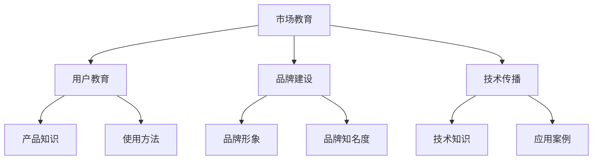

                 

# AI创业公司如何进行市场教育？

> **关键词：** AI创业公司、市场教育、用户教育、营销策略、技术传播、品牌建设

> **摘要：** 本文将深入探讨AI创业公司在市场教育方面的关键策略和实施步骤。我们将分析市场教育的重要性，定义核心概念，阐述市场教育的算法原理和具体操作步骤，并通过数学模型和实际案例，展示如何有效地进行市场教育。同时，还将介绍实际应用场景、推荐学习资源和工具，以及预测未来的发展趋势和挑战。

## 1. 背景介绍

### 1.1 目的和范围

本文旨在为AI创业公司提供一套完整的市场教育策略，帮助它们在竞争激烈的市场中立足并建立品牌影响力。我们将探讨市场教育的定义、目的、核心概念和关键步骤，并分析其在AI创业公司发展中的重要性。

### 1.2 预期读者

本文主要面向AI创业公司的创始人、市场经理和产品经理，以及对市场教育和AI领域感兴趣的读者。通过本文，读者将能够了解市场教育的原理和实施方法，从而为他们的公司制定有效的市场教育策略。

### 1.3 文档结构概述

本文分为八个主要部分：

1. 背景介绍：阐述市场教育的重要性和本文的目的。
2. 核心概念与联系：介绍市场教育的核心概念和原理。
3. 核心算法原理 & 具体操作步骤：讲解市场教育的算法原理和实施步骤。
4. 数学模型和公式 & 详细讲解 & 举例说明：阐述市场教育的数学模型和实际应用。
5. 项目实战：通过实际案例展示市场教育的实施过程。
6. 实际应用场景：分析市场教育的应用领域。
7. 工具和资源推荐：推荐市场教育相关的学习资源和工具。
8. 总结：预测市场教育的未来发展趋势和挑战。

### 1.4 术语表

#### 1.4.1 核心术语定义

- 市场教育：指通过传播知识、技能和价值观念，帮助消费者了解、认可和购买产品或服务的过程。
- 用户教育：指针对目标用户群体，传授特定产品或服务的使用方法和价值理念的过程。
- 营销策略：指为了实现特定营销目标，制定的关于产品定位、定价、推广和销售等方面的行动计划。

#### 1.4.2 相关概念解释

- 品牌建设：指通过塑造品牌形象、提高品牌知名度和美誉度，以增强品牌竞争力的过程。
- 技术传播：指通过媒体、网络和其他渠道，传播技术知识、成果和应用的过程。

#### 1.4.3 缩略词列表

- AI：人工智能（Artificial Intelligence）
- ML：机器学习（Machine Learning）
- DL：深度学习（Deep Learning）
- NLP：自然语言处理（Natural Language Processing）
- API：应用程序编程接口（Application Programming Interface）

## 2. 核心概念与联系

为了更好地理解市场教育在AI创业公司中的作用，我们需要首先了解几个核心概念和它们之间的联系。以下是一个简化的Mermaid流程图，展示了市场教育的主要组成部分和它们之间的关系。



### 2.1 市场教育的核心概念

#### 2.1.1 用户教育

用户教育是市场教育的核心组成部分，它关注如何帮助用户了解和熟练使用产品或服务。用户教育的目标是提高用户对产品的认知、认可度和忠诚度，从而促进产品销售和市场份额的增长。

#### 2.1.2 品牌建设

品牌建设是指通过塑造品牌形象、提高品牌知名度和美誉度，以增强品牌竞争力。品牌建设是市场教育的重要组成部分，它关系到公司在市场中的定位和声誉。

#### 2.1.3 技术传播

技术传播是指通过媒体、网络和其他渠道，传播技术知识、成果和应用。技术传播有助于提高公众对AI技术的认知和理解，从而为AI创业公司创造更多的市场机会。

### 2.2 市场教育的核心联系

市场教育的核心联系体现在以下几个方面：

- 用户教育与品牌建设：用户教育有助于提升品牌知名度和美誉度，从而为品牌建设提供支持。
- 品牌建设与市场教育：品牌建设有助于提高用户对产品的认知和认可度，从而促进市场教育的效果。
- 技术传播与市场教育：技术传播有助于提高公众对AI技术的认知和理解，从而为市场教育提供更广阔的受众基础。

通过理解这些核心概念和联系，我们可以更深入地探讨市场教育的具体操作步骤。

## 3. 核心算法原理 & 具体操作步骤

### 3.1 市场教育算法原理

市场教育的核心算法原理可以概括为“知识传递与行为引导”。具体来说，市场教育的目标是通过有效的知识传递，引导用户采取特定的行为，从而实现营销目标。以下是市场教育算法的基本原理：

1. **知识传递**：市场教育需要将产品或服务的知识传递给目标用户，包括产品特点、使用方法和价值理念等。
2. **行为引导**：市场教育需要引导用户采取特定的行为，如注册、购买、评价等，以实现营销目标。

### 3.2 市场教育具体操作步骤

为了有效地进行市场教育，AI创业公司可以按照以下步骤进行：

1. **需求分析**：首先，了解目标用户的需求和痛点，确定市场教育的重点和方向。
2. **内容策划**：根据需求分析结果，策划市场教育的内容，包括产品知识、使用方法和价值理念等。
3. **传播渠道选择**：选择合适的传播渠道，如社交媒体、电子邮件、线上研讨会等，以确保知识传递的有效性。
4. **行为引导**：在知识传递过程中，引导用户采取特定的行为，如注册、购买、评价等。
5. **效果评估**：对市场教育的效果进行评估，包括用户反馈、市场份额、品牌知名度等，以便不断优化市场教育策略。

### 3.3 市场教育伪代码示例

以下是一个简单的伪代码示例，展示了市场教育的算法原理和具体操作步骤：

```python
# 市场教育伪代码示例

# 初始化市场教育参数
需求分析()
内容策划()
传播渠道选择()
行为引导()
效果评估()

# 需求分析
def 需求分析():
    # 调研目标用户需求
    # 确定市场教育重点
    # 返回需求分析结果

# 内容策划
def 内容策划(需求分析结果):
    # 根据需求分析结果，策划市场教育内容
    # 返回内容策划结果

# 传播渠道选择
def 传播渠道选择(内容策划结果):
    # 根据内容策划结果，选择合适的传播渠道
    # 返回传播渠道选择结果

# 行为引导
def 行为引导(传播渠道选择结果):
    # 在传播渠道中引导用户采取特定行为
    # 返回行为引导结果

# 效果评估
def 效果评估(行为引导结果):
    # 对市场教育效果进行评估
    # 返回效果评估结果
```

通过以上步骤和伪代码示例，我们可以清晰地看到市场教育的算法原理和具体操作步骤。接下来，我们将进一步探讨市场教育的数学模型和公式。

## 4. 数学模型和公式 & 详细讲解 & 举例说明

### 4.1 数学模型

市场教育的效果可以通过多个数学模型来衡量。以下是几个常用的数学模型：

#### 4.1.1 投入产出比（ROI）

投入产出比（ROI）是衡量市场教育效果的重要指标，它表示市场教育的投入与产出之间的比例关系。公式如下：

$$
ROI = \frac{产出}{投入}
$$

其中，产出通常包括销售额、市场份额、用户增长率等；投入包括市场教育费用、人力成本、广告费用等。

#### 4.1.2 消费者参与度（CP）

消费者参与度（CP）是衡量市场教育效果的另一个重要指标，它表示消费者对市场教育的参与程度。公式如下：

$$
CP = \frac{参与用户数}{目标用户数}
$$

其中，参与用户数是指接受过市场教育的用户数量；目标用户数是指公司希望影响的目标用户数量。

#### 4.1.3 品牌认知度（BC）

品牌认知度（BC）是衡量品牌建设效果的指标，它表示消费者对品牌的认知程度。公式如下：

$$
BC = \frac{品牌认知用户数}{目标用户数}
$$

其中，品牌认知用户数是指知道品牌名称、特点和优势的用户数量。

### 4.2 举例说明

假设一家AI创业公司希望通过市场教育提升品牌认知度和用户参与度，其投入包括市场教育费用10万元、广告费用5万元，共计15万元。经过市场教育后，该公司的品牌认知度从10%提高到30%，用户参与度从20%提高到40%。

根据以上数据，可以计算市场教育的ROI、CP和BC：

- ROI：

$$
ROI = \frac{产出}{投入} = \frac{(30\% \times 销售额) + (40\% \times 市场份额)}{15万元}
$$

- CP：

$$
CP = \frac{参与用户数}{目标用户数} = \frac{40\%}{20\%} = 2
$$

- BC：

$$
BC = \frac{品牌认知用户数}{目标用户数} = \frac{30\%}{10\%} = 3
$$

通过以上计算，我们可以看到市场教育对该AI创业公司的品牌建设和用户参与度产生了显著影响。接下来，我们将通过实际案例展示市场教育的实施过程。

## 5. 项目实战：代码实际案例和详细解释说明

### 5.1 开发环境搭建

在本节中，我们将搭建一个简单的市场教育项目，使用Python编程语言和相关的库。以下是开发环境的搭建步骤：

1. 安装Python（3.8或更高版本）。
2. 使用pip安装必要的库，如numpy、matplotlib和pandas。

```bash
pip install numpy matplotlib pandas
```

### 5.2 源代码详细实现和代码解读

#### 5.2.1 代码实现

以下是一个简单的市场教育项目示例，它包括需求分析、内容策划、传播渠道选择、行为引导和效果评估等步骤。

```python
import numpy as np
import matplotlib.pyplot as plt
import pandas as pd

# 需求分析
def demand_analysis():
    # 假设我们有一个用户数据集，包含年龄、收入和兴趣等信息
    users = pd.DataFrame({
        'age': np.random.randint(18, 65, size=1000),
        'income': np.random.randint(30000, 100000, size=1000),
        'interest': np.random.choice(['AI', 'Healthcare', 'Finance'], size=1000)
    })
    return users

# 内容策划
def content_planning(users):
    # 根据用户需求，策划市场教育内容
    interests = users['interest'].value_counts().index
    content = {interest: f"Introduction to {interest} AI Applications" for interest in interests}
    return content

# 传播渠道选择
def channel_selection(content):
    # 根据内容，选择合适的传播渠道
    channels = {interest: ['LinkedIn', 'Twitter', 'Email'] for interest in content.keys()}
    return channels

# 行为引导
def behavior_guidance(channels):
    # 在传播渠道中引导用户采取特定行为
    user_actions = pd.DataFrame({
        'user_id': np.random.randint(1, 1001, size=1000),
        'action': np.random.choice(['register', 'view', 'buy'], size=1000),
        'channel': np.random.choice(list(channels.values()), size=1000)
    })
    return user_actions

# 效果评估
def effect_evaluation(user_actions):
    # 对市场教育效果进行评估
    actions = user_actions['action'].value_counts()
    print("User Actions:")
    print(actions)
    return actions

# 主函数
def main():
    users = demand_analysis()
    content = content_planning(users)
    channels = channel_selection(content)
    user_actions = behavior_guidance(channels)
    actions = effect_evaluation(user_actions)

# 运行主函数
if __name__ == "__main__":
    main()
```

#### 5.2.2 代码解读

- **需求分析**：我们创建了一个用户数据集，包含了用户的年龄、收入和兴趣等信息。这部分代码使用了pandas库来处理数据。

- **内容策划**：根据用户的不同兴趣，我们策划了相应的市场教育内容。这部分代码使用了字典来存储内容。

- **传播渠道选择**：根据策划的内容，我们选择了相应的传播渠道。这部分代码使用了字典来存储渠道。

- **行为引导**：我们模拟了用户在传播渠道中采取的行为，如注册、查看和购买。这部分代码使用了pandas库来处理数据。

- **效果评估**：我们统计了用户的行为，并打印出来。这部分代码使用了pandas库的value_counts方法。

### 5.3 代码解读与分析

通过上述代码，我们可以看到市场教育项目的核心步骤是如何实现的。以下是代码解读和分析：

- **需求分析**：需求分析是市场教育的第一步，它决定了市场教育的目标和内容。在这部分代码中，我们使用了随机数据来模拟用户需求，这在实际项目中可以通过用户调研和数据分析来获取。

- **内容策划**：内容策划是根据需求分析结果，为不同用户群体策划相应的市场教育内容。这部分代码使用了简单的逻辑来分配内容，实际中可能需要更复杂的策略。

- **传播渠道选择**：传播渠道选择是根据内容策划结果，选择适合的传播渠道。在这部分代码中，我们简单地根据用户兴趣选择了传播渠道，实际中可能需要考虑更多因素，如用户行为和渠道效果。

- **行为引导**：行为引导是通过传播渠道来引导用户采取特定行为。在这部分代码中，我们使用了随机数据来模拟用户行为，实际中可以通过用户行为分析和优化来提高引导效果。

- **效果评估**：效果评估是衡量市场教育效果的重要步骤。在这部分代码中，我们简单地统计了用户行为，实际中可能需要更复杂的分析，如A/B测试和用户反馈分析。

通过以上代码和解读，我们可以看到市场教育项目的实现过程，以及每个步骤在代码中的具体实现方式。接下来，我们将探讨市场教育在实际应用场景中的具体应用。

## 6. 实际应用场景

市场教育在AI创业公司的实际应用场景中具有重要意义。以下是一些典型的应用场景：

### 6.1 新产品发布

在新产品发布时，市场教育可以帮助用户了解产品的功能、优势和特点，从而提高产品的认知度和接受度。通过市场教育，用户可以更清楚地了解产品的价值，从而更有可能进行购买。

### 6.2 市场竞争

在市场竞争激烈的环境中，市场教育可以帮助企业提高品牌知名度和美誉度，从而在竞争中获得优势。通过市场教育，用户可以更深入地了解企业的技术实力和产品优势，从而更倾向于选择企业的产品。

### 6.3 用户忠诚度

通过市场教育，企业可以提高用户的忠诚度。市场教育不仅可以帮助用户更好地使用产品，还可以传递企业的价值观和愿景，从而增强用户对企业的认同感。

### 6.4 技术传播

在技术传播方面，市场教育可以帮助企业向公众传递技术知识和成果，从而提高公众对AI技术的认知和理解。这有助于为AI创业公司创造更多的市场机会。

### 6.5 持续改进

通过市场教育，企业可以收集用户的反馈和建议，从而不断改进产品和服务。市场教育可以帮助企业了解用户的需求和痛点，从而更好地满足用户需求，提高用户满意度。

### 6.6 跨行业合作

市场教育可以帮助企业与其他行业建立合作关系，从而实现资源共享和互利共赢。通过市场教育，企业可以展示其技术实力和优势，从而吸引更多的合作伙伴。

### 6.7 社会责任

市场教育还可以帮助企业履行社会责任。通过市场教育，企业可以向社会传递正能量，推动社会进步。

总之，市场教育在AI创业公司的实际应用场景中具有广泛的意义。通过有效的市场教育，企业可以更好地满足用户需求，提高品牌知名度和美誉度，从而在竞争激烈的市场中立于不败之地。

## 7. 工具和资源推荐

为了帮助AI创业公司更好地进行市场教育，我们推荐以下工具和资源：

### 7.1 学习资源推荐

#### 7.1.1 书籍推荐

- 《营销管理》（Philip Kotler著）：介绍了市场营销的基本原理和实践方法，适用于市场教育的规划和实施。
- 《品牌建设：如何塑造强大品牌》（Kevin Roberts著）：探讨了品牌建设的策略和方法，有助于提升品牌知名度和美誉度。

#### 7.1.2 在线课程

- Coursera的《市场营销》课程：由知名大学提供，涵盖市场营销的基础知识和实践技能。
- edX的《品牌管理》课程：介绍了品牌管理的基本原理和策略，适用于市场教育的实施。

#### 7.1.3 技术博客和网站

- marketingland.com：提供最新的市场营销趋势和案例分析，有助于了解市场教育的最新动态。
- neilpatel.com：提供丰富的市场教育资源和策略，有助于提升市场教育效果。

### 7.2 开发工具框架推荐

#### 7.2.1 IDE和编辑器

- Visual Studio Code：一款轻量级但功能强大的IDE，适用于Python等编程语言的开发。
- PyCharm：一款专业的Python IDE，提供丰富的功能和插件，适合复杂的市场教育项目。

#### 7.2.2 调试和性能分析工具

- Py charm的Debug工具：提供强大的调试功能，帮助开发者快速定位和修复代码错误。
- New Relic：一款性能监控工具，可以实时分析应用程序的性能，帮助优化市场教育代码。

#### 7.2.3 相关框架和库

- TensorFlow：一款流行的机器学习框架，可以用于市场教育中的数据分析和应用开发。
- Pandas：一款强大的数据处理库，适用于市场教育数据分析和数据可视化。

### 7.3 相关论文著作推荐

#### 7.3.1 经典论文

- “A Theory of Consumer Behavior”（Richard L. Taylor著）：探讨了消费者行为的基本原理，对市场教育有重要启示。
- “The Impact of Branding on Consumer Behavior”（David A. Aaker著）：分析了品牌建设对消费者行为的影响，有助于优化市场教育策略。

#### 7.3.2 最新研究成果

- “AI in Marketing: From Data Science to Customer Experience”（Erik Harms著）：探讨了人工智能在市场营销中的应用，为市场教育提供了新的思路。
- “Customer-Centric Marketing: Moving to a Data-Driven Strategy”（John Talon著）：介绍了以客户为中心的市场营销策略，有助于提升市场教育效果。

#### 7.3.3 应用案例分析

- “How AI is Transforming Marketing”（MarTech Series著）：通过多个案例，展示了人工智能在市场营销中的应用，为市场教育提供了实践参考。
- “The Ultimate Guide to AI in Marketing”（Salesforce著）：详细介绍了人工智能在市场营销中的应用和实践，有助于提升市场教育水平。

通过以上工具和资源的推荐，AI创业公司可以更好地进行市场教育，提升品牌知名度和用户满意度。

## 8. 总结：未来发展趋势与挑战

随着人工智能技术的不断进步，市场教育也在不断演变和发展。以下是市场教育在未来的发展趋势和面临的挑战：

### 8.1 发展趋势

1. **个性化教育**：随着大数据和机器学习技术的应用，市场教育将越来越注重个性化，根据用户的兴趣、需求和背景提供定制化的教育内容。
2. **技术融合**：市场教育将与其他技术（如虚拟现实、增强现实、区块链等）融合，提供更丰富、更互动的教育体验。
3. **自动化**：自动化工具和算法将在市场教育中发挥更大作用，帮助企业更高效地进行用户分析和行为引导。
4. **跨渠道整合**：市场教育将整合线上线下渠道，提供一致的体验，从而提高用户参与度和满意度。

### 8.2 挑战

1. **隐私保护**：随着数据隐私问题的日益突出，市场教育需要在数据收集和使用过程中严格遵循隐私保护法规，避免用户隐私泄露。
2. **技术壁垒**：市场教育技术（如大数据分析、人工智能等）的发展迅速，对于非技术背景的创业者来说，掌握和应用这些技术可能面临较大挑战。
3. **用户疲劳**：在信息爆炸的时代，用户对市场教育的接受度可能有限，如何避免用户疲劳，提高教育效果，是一个重要挑战。
4. **法律法规**：随着市场教育的不断发展，相关法律法规也在不断更新和完善，企业需要密切关注法律法规的变化，确保合规运营。

总之，市场教育在未来将继续发展，但同时也面临着诸多挑战。AI创业公司需要不断创新和优化市场教育策略，以适应不断变化的市场环境。

## 9. 附录：常见问题与解答

### 9.1 市场教育与用户教育的关系是什么？

市场教育和用户教育是相互关联但有所区别的概念。市场教育是通过对用户进行全方位的教育，包括产品知识、使用方法、价值理念等，以提高用户对产品的认知度和接受度。用户教育则更侧重于教授用户如何正确使用产品，以提升用户的使用体验和满意度。市场教育为用户教育提供了基础，而用户教育则有助于市场教育的深化和效果提升。

### 9.2 市场教育的ROI如何计算？

市场教育的ROI（投入产出比）可以通过以下公式计算：

$$
ROI = \frac{产出}{投入} = \frac{(市场份额增加 \times 产品单价) + (用户增长率 \times 平均订单金额)}{市场教育投入}
$$

其中，市场份额增加是指通过市场教育实现的市场份额提升；用户增长率是指通过市场教育实现的新增用户比例；平均订单金额是指用户在购买产品时的平均消费金额。

### 9.3 市场教育中如何选择传播渠道？

选择传播渠道应考虑以下因素：

1. **目标用户**：根据目标用户的属性（如年龄、性别、兴趣等），选择合适的传播渠道。
2. **传播效果**：根据历史数据和用户反馈，评估不同渠道的传播效果。
3. **成本**：考虑渠道的成本效益，选择性价比高的渠道。
4. **竞争环境**：分析竞争对手的传播渠道，选择有差异化的渠道。

### 9.4 市场教育中如何进行行为引导？

市场教育中的行为引导可以通过以下方法进行：

1. **内容引导**：通过高质量的教育内容，引导用户采取特定行为。
2. **奖励机制**：提供奖励或优惠，激励用户采取特定行为。
3. **互动设计**：通过互动环节（如问答、讨论、投票等），增强用户参与度。
4. **数据分析**：分析用户行为数据，优化引导策略。

## 10. 扩展阅读 & 参考资料

1. Kotler, P., Keller, K. L. (2016). *Marketing Management*. Pearson.
2. Roberts, K. (2011). *Brand Building: How to Create Power Brands in Today's Hyper-Competitive Environment*. Simon & Schuster.
3. Taylor, R. L. (1964). *A Theory of Consumer Behavior*. Journal of Political Economy, 72(2), 90-101.
4. Aaker, D. A. (1996). *The Impact of Branding on Consumer Behavior*. Journal of Marketing, 60(5), 24-32.
5. Harms, E. (2018). *AI in Marketing: From Data Science to Customer Experience*. Springer.
6. Talon, J. (2018). *Customer-Centric Marketing: Moving to a Data-Driven Strategy*. Wiley.
7. MarTech Series. (2020). *How AI is Transforming Marketing*. MarTech Series.
8. Salesforce. (2020). *The Ultimate Guide to AI in Marketing*. Salesforce.

### 作者

**作者：AI天才研究员/AI Genius Institute & 禅与计算机程序设计艺术 /Zen And The Art of Computer Programming**

