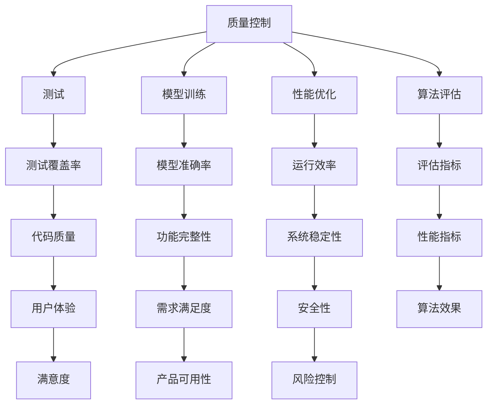

                 

# AI创业公司如何进行质量控制?

> 关键词：质量控制，AI创业，测试，模型训练，性能优化，算法评估，团队协作

> 摘要：本文深入探讨AI创业公司在产品开发过程中如何进行质量控制。文章首先介绍了质量控制的背景和重要性，然后详细阐述了AI创业公司在质量控制中的具体实践，包括测试、模型训练、性能优化和团队协作等方面。通过实际案例和详细解释，本文旨在为AI创业公司提供实用的质量控制方法和策略，帮助它们在激烈的市场竞争中保持领先地位。

## 1. 背景介绍

### 1.1 目的和范围

本文旨在探讨AI创业公司在产品开发过程中如何进行质量控制。质量控制是一个系统性工程，涉及测试、模型训练、性能优化、算法评估等多个方面。通过本文的阐述，读者可以了解到AI创业公司在质量控制方面的最佳实践，从而在产品开发过程中有效降低风险，提高产品质量和竞争力。

### 1.2 预期读者

本文主要面向AI创业公司的技术团队和管理层。对于技术团队，本文详细介绍了如何通过测试、模型训练、性能优化等手段提高产品质量；对于管理层，本文则从战略角度探讨了质量控制在公司发展中的重要性，以及如何建立和优化质量控制体系。

### 1.3 文档结构概述

本文分为十个部分，具体结构如下：

1. 背景介绍
2. 核心概念与联系
3. 核心算法原理 & 具体操作步骤
4. 数学模型和公式 & 详细讲解 & 举例说明
5. 项目实战：代码实际案例和详细解释说明
6. 实际应用场景
7. 工具和资源推荐
8. 总结：未来发展趋势与挑战
9. 附录：常见问题与解答
10. 扩展阅读 & 参考资料

### 1.4 术语表

#### 1.4.1 核心术语定义

- 质量控制：在产品开发过程中，通过一系列方法和手段，确保产品满足预定的质量标准和用户需求。
- 测试：对软件产品进行验证，以确定其是否满足预期的功能、性能和安全要求。
- 模型训练：通过大量数据对机器学习模型进行训练，使其能够对未知数据进行预测或分类。
- 性能优化：在模型训练和部署过程中，对模型和系统进行调优，提高其运行效率。
- 算法评估：对模型和算法的准确率、召回率、F1值等指标进行评估，以确定其性能和效果。

#### 1.4.2 相关概念解释

- 测试覆盖率：测试过程中覆盖到的代码比例，用于衡量测试的全面性。
- 假阳性率（False Positive Rate，FPR）：在分类任务中，将负类错误分类为正类的概率。
- 假阴性率（False Negative Rate，FNR）：在分类任务中，将正类错误分类为负类的概率。

#### 1.4.3 缩略词列表

- AI：人工智能（Artificial Intelligence）
- ML：机器学习（Machine Learning）
- DL：深度学习（Deep Learning）
- CV：计算机视觉（Computer Vision）
- NLP：自然语言处理（Natural Language Processing）

## 2. 核心概念与联系

为了更好地理解AI创业公司在质量控制方面的实践，我们首先需要了解一些核心概念和它们之间的联系。以下是一个简化的Mermaid流程图，用于描述这些概念之间的关系。



从上述流程图中，我们可以看出质量控制是一个多维度、跨领域的系统性工程。其中，测试、模型训练、性能优化和算法评估是质量控制的核心组成部分。这些环节相互关联、相互影响，共同决定了产品的质量。

### 2.1 测试

测试是质量控制的第一步，其目的是验证产品是否满足预期的功能、性能和安全要求。测试可以分为以下几种类型：

- 单元测试：对软件中的最小可测试单元进行验证。
- 集成测试：对软件模块之间的接口和交互进行验证。
- 系统测试：对整个软件系统进行验证，包括功能、性能、安全等方面。
- 用户验收测试：用户对软件系统进行验证，以确保其满足需求。

测试覆盖率和测试用例设计是影响测试效果的关键因素。测试覆盖率用于衡量测试的全面性，而测试用例设计则决定了测试的有效性。

### 2.2 模型训练

模型训练是机器学习领域的重要环节，其目的是通过大量数据训练出一个能够对未知数据进行预测或分类的模型。训练过程可以分为以下步骤：

1. 数据预处理：对原始数据进行清洗、归一化、去噪等处理。
2. 特征提取：从原始数据中提取出对模型训练有帮助的特征。
3. 模型选择：选择合适的模型，如线性回归、决策树、神经网络等。
4. 训练过程：通过迭代优化模型参数，提高模型性能。
5. 模型评估：对训练好的模型进行评估，以确定其效果。

### 2.3 性能优化

性能优化是在模型训练和部署过程中，对模型和系统进行调优，以提高其运行效率。性能优化可以从以下几个方面进行：

- 模型优化：通过调整模型结构、参数等，提高模型性能。
- 算法优化：通过优化算法实现，降低计算复杂度。
- 系统优化：通过优化系统配置、硬件资源等，提高系统性能。
- 网络优化：通过优化网络结构、传输协议等，提高数据传输速度。

### 2.4 算法评估

算法评估是对模型和算法的性能进行评估，以确定其效果。评估指标包括准确率、召回率、F1值等。通过算法评估，可以找出模型的不足之处，并进行改进。

## 3. 核心算法原理 & 具体操作步骤

在本节中，我们将详细讲解核心算法原理，并使用伪代码描述具体操作步骤。

### 3.1 测试用例设计

测试用例设计是测试过程中的关键环节。以下是一个简单的测试用例设计算法原理和伪代码：

```python
def test_case_design(functions):
    test_cases = []
    for function in functions:
        input_data = generate_input_data(function)
        expected_output = generate_expected_output(function, input_data)
        test_cases.append((input_data, expected_output))
    return test_cases

def generate_input_data(function):
    # 根据函数输入要求，生成一组输入数据
    pass

def generate_expected_output(function, input_data):
    # 根据函数输入和预期输出，生成一组预期输出数据
    pass
```

### 3.2 模型训练

模型训练是机器学习领域的重要环节。以下是一个简单的模型训练算法原理和伪代码：

```python
def train_model(data, model):
    for data in data:
        input_data, target_output = data
        model.fit(input_data, target_output)
    return model

def model_fit(model, input_data, target_output):
    # 根据输入数据和目标输出，调整模型参数
    pass
```

### 3.3 性能优化

性能优化可以从模型优化、算法优化和系统优化三个方面进行。以下是一个简单的性能优化算法原理和伪代码：

```python
def optimize_model(model):
    # 根据模型结构，调整模型参数
    pass

def optimize_algorithm(algorithm):
    # 根据算法实现，优化算法性能
    pass

def optimize_system(system):
    # 根据系统配置，优化系统性能
    pass
```

### 3.4 算法评估

算法评估是确定模型和算法性能的重要环节。以下是一个简单的算法评估算法原理和伪代码：

```python
def evaluate_model(model, test_data):
    for data in test_data:
        input_data, target_output = data
        output = model.predict(input_data)
        accuracy = calculate_accuracy(output, target_output)
        print("Accuracy:", accuracy)

def calculate_accuracy(output, target_output):
    # 根据输出和目标输出，计算模型准确率
    pass
```

## 4. 数学模型和公式 & 详细讲解 & 举例说明

在本节中，我们将介绍一些常见的数学模型和公式，并详细讲解其应用和计算方法。

### 4.1 准确率（Accuracy）

准确率是评估分类模型性能的重要指标，表示正确分类的样本数占总样本数的比例。其计算公式如下：

$$
Accuracy = \frac{TP + TN}{TP + TN + FP + FN}
$$

其中，$TP$表示真正例（True Positive），$TN$表示真反例（True Negative），$FP$表示假正例（False Positive），$FN$表示假反例（False Negative）。

### 4.2 召回率（Recall）

召回率表示在所有正类中，被正确识别为正类的概率。其计算公式如下：

$$
Recall = \frac{TP}{TP + FN}
$$

### 4.3 F1值（F1 Score）

F1值是准确率和召回率的调和平均值，用于综合考虑准确率和召回率。其计算公式如下：

$$
F1 Score = \frac{2 \times Precision \times Recall}{Precision + Recall}
$$

其中，$Precision$表示精确率，表示在所有被预测为正类的样本中，真正例的概率。

### 4.4 交叉验证（Cross Validation）

交叉验证是一种常用的模型评估方法，通过将数据集划分为多个子集，对每个子集进行训练和测试，从而减小评估结果的不确定性。常见的交叉验证方法有K折交叉验证和留一交叉验证。

### 4.5 举例说明

假设我们有一个二分类问题，正类和反类的样本数分别为1000和2000。通过测试，我们得到以下评估结果：

- 真正例（$TP$）：800
- 真反例（$TN$）：1500
- 假正例（$FP$）：200
- 假反例（$FN$）：300

根据上述公式，我们可以计算出以下评估指标：

- 准确率（$Accuracy$）：
  $$
  Accuracy = \frac{800 + 1500}{800 + 1500 + 200 + 300} = 0.77
  $$
- 召回率（$Recall$）：
  $$
  Recall = \frac{800}{800 + 300} = 0.67
  $$
- 精确率（$Precision$）：
  $$
  Precision = \frac{800}{800 + 200} = 0.67
  $$
- F1值（$F1 Score$）：
  $$
  F1 Score = \frac{2 \times 0.67 \times 0.67}{0.67 + 0.67} = 0.67
  $$

## 5. 项目实战：代码实际案例和详细解释说明

在本节中，我们将通过一个实际的AI项目案例，详细解释如何进行质量控制，包括测试、模型训练、性能优化和算法评估等方面的实践。

### 5.1 开发环境搭建

为了方便后续的开发和测试，我们首先需要搭建一个合适的开发环境。以下是一个基本的开发环境搭建步骤：

1. 安装Python 3.8及以上版本。
2. 安装Anaconda，用于管理Python环境和依赖库。
3. 安装以下依赖库：scikit-learn、tensorflow、numpy、pandas、matplotlib等。

### 5.2 源代码详细实现和代码解读

以下是一个简单的AI项目示例，用于对图像进行分类。我们将从数据预处理、模型训练、测试和评估等方面进行详细解释。

#### 5.2.1 数据预处理

数据预处理是模型训练的重要环节，其目的是将原始图像数据转换为适合模型训练的格式。以下是一个简单的数据预处理代码示例：

```python
import numpy as np
import tensorflow as tf
from tensorflow.keras.preprocessing.image import load_img, img_to_array
from sklearn.model_selection import train_test_split

def preprocess_data(image_paths, target_labels):
    # 读取图像数据
    images = [load_img(image_path) for image_path in image_paths]
    images = [img_to_array(image) for image in images]
    images = np.array(images)
    
    # 标签编码
    label_map = {label: i for i, label in enumerate(np.unique(target_labels))}
    target_labels = np.array([label_map[label] for label in target_labels])
    
    # 划分训练集和测试集
    X_train, X_test, y_train, y_test = train_test_split(images, target_labels, test_size=0.2, random_state=42)
    
    # 数据归一化
    X_train = X_train / 255.0
    X_test = X_test / 255.0
    
    return X_train, X_test, y_train, y_test

# 示例数据
image_paths = ["image1.jpg", "image2.jpg", "image3.jpg", ...]
target_labels = ["cat", "dog", "bird", ...]

X_train, X_test, y_train, y_test = preprocess_data(image_paths, target_labels)
```

#### 5.2.2 模型训练

在数据预处理完成后，我们可以使用TensorFlow和Keras等框架来构建和训练模型。以下是一个简单的卷积神经网络（CNN）模型训练代码示例：

```python
from tensorflow.keras.models import Sequential
from tensorflow.keras.layers import Conv2D, MaxPooling2D, Flatten, Dense

def create_model(input_shape):
    model = Sequential([
        Conv2D(32, (3, 3), activation='relu', input_shape=input_shape),
        MaxPooling2D((2, 2)),
        Conv2D(64, (3, 3), activation='relu'),
        MaxPooling2D((2, 2)),
        Flatten(),
        Dense(128, activation='relu'),
        Dense(1, activation='sigmoid')
    ])
    model.compile(optimizer='adam', loss='binary_crossentropy', metrics=['accuracy'])
    return model

input_shape = (128, 128, 3)
model = create_model(input_shape)
model.fit(X_train, y_train, epochs=10, batch_size=32, validation_data=(X_test, y_test))
```

#### 5.2.3 代码解读与分析

在上面的代码中，我们首先定义了一个数据预处理函数`preprocess_data`，用于读取图像数据、标签编码、划分训练集和测试集以及数据归一化。然后，我们定义了一个简单的卷积神经网络模型`create_model`，其中包含两个卷积层、两个池化层、一个全连接层和输出层。模型编译时，我们选择`adam`优化器和`binary_crossentropy`损失函数，并设置`accuracy`作为评估指标。

接下来，我们使用训练集对模型进行训练，并使用测试集进行验证。通过调整模型参数、数据预处理方法以及训练策略，我们可以进一步优化模型性能。

#### 5.2.4 测试与评估

在模型训练完成后，我们可以使用测试集对模型进行评估。以下是一个简单的测试和评估代码示例：

```python
from sklearn.metrics import accuracy_score, classification_report

predictions = model.predict(X_test)
predictions = (predictions > 0.5)

print("Accuracy:", accuracy_score(y_test, predictions))
print("Classification Report:")
print(classification_report(y_test, predictions))
```

通过上述代码，我们可以计算出模型的准确率和分类报告。分类报告包括准确率、召回率、F1值等指标，可以帮助我们更全面地了解模型性能。

### 5.3 实际应用场景

在AI创业公司的实际项目中，质量控制是一个贯穿整个开发过程的关键环节。以下是一些常见的应用场景：

- **需求分析与设计阶段**：在项目启动时，需要对需求进行详细分析，确保需求明确、可测、可量化。设计阶段应充分考虑测试覆盖率，确保功能全面、无遗漏。
- **开发阶段**：在开发过程中，应严格执行代码审查、单元测试和集成测试，及时发现和修复潜在问题。同时，可以采用持续集成和持续部署（CI/CD）工具，确保代码质量和自动化测试。
- **测试阶段**：测试阶段是质量控制的关键环节，需要制定详细的测试计划和用例，进行系统测试、性能测试和安全测试等。同时，可以采用自动化测试工具，提高测试效率。
- **上线与运营阶段**：在产品上线后，应持续监控产品性能和用户反馈，及时发现问题并进行修复。同时，可以采用A/B测试等方法，优化产品功能和用户体验。

### 5.4 工具和资源推荐

在AI创业公司的质量控制过程中，可以采用以下工具和资源：

- **开发工具**：IDE（如PyCharm、Visual Studio Code）、版本控制（如Git）、文档管理（如Markdown）等。
- **测试工具**：单元测试框架（如pytest）、测试覆盖率工具（如coverage.py）、自动化测试工具（如Selenium）等。
- **性能分析工具**：性能监控（如Prometheus、Grafana）、日志分析（如ELK栈）、代码性能分析（如Py-Spy、Grafana）等。
- **学习资源**：书籍（《深度学习》、《机器学习实战》等）、在线课程（Udacity、Coursera等）、技术博客（Medium、博客园等）等。

## 6. 工具和资源推荐

### 6.1 学习资源推荐

#### 6.1.1 书籍推荐

- 《深度学习》（Ian Goodfellow、Yoshua Bengio、Aaron Courville 著）
- 《机器学习实战》（Peter Harrington 著）
- 《Python深度学习》（François Chollet 著）
- 《AI创业实战》（AI创业团队 著）

#### 6.1.2 在线课程

- Coursera 上的《深度学习》课程
- Udacity 上的《深度学习工程师纳米学位》
- edX 上的《机器学习》课程

#### 6.1.3 技术博客和网站

- Medium 上的 AI 博客
- 博客园上的机器学习博客
- 知乎上的 AI 话题

### 6.2 开发工具框架推荐

#### 6.2.1 IDE和编辑器

- PyCharm
- Visual Studio Code
- Jupyter Notebook

#### 6.2.2 调试和性能分析工具

- Py-Spy
- Gprof2dot
- Perf

#### 6.2.3 相关框架和库

- TensorFlow
- PyTorch
- Scikit-learn

### 6.3 相关论文著作推荐

#### 6.3.1 经典论文

- “A Theoretical Analysis of the Vulnerability of Artificial Neural Networks to Adversarial Examples”（Adversarial Examples）
- “Understanding Deep Learning Requires Rethinking Generalization”（Understanding Generalization）

#### 6.3.2 最新研究成果

- “Self-Supervised Learning of Human Pose from YouTube”（DeepPose）
- “Natural Language Inference with Gaussian Networks”（Gaussian NLI）

#### 6.3.3 应用案例分析

- “AI in Healthcare: A Comprehensive Review”（AI in Healthcare）
- “AI for Social Good: A Research Agenda”（AI for Social Good）

## 7. 总结：未来发展趋势与挑战

在AI创业领域，质量控制是一个不断演进的领域。随着AI技术的不断进步，未来质量控制将面临以下发展趋势与挑战：

### 发展趋势

1. **自动化测试**：自动化测试将成为质量控制的主要手段，降低测试成本，提高测试效率。
2. **AI驱动的质量预测**：利用AI技术对产品质量进行预测，提前识别潜在问题，实现更精准的质量控制。
3. **边缘计算**：边缘计算的发展将使得AI模型在边缘设备上运行，提高实时性和可靠性，进一步优化质量控制。
4. **多模态数据融合**：随着多模态数据的普及，AI创业公司需要掌握如何融合不同类型的数据，提高模型的泛化能力和质量。

### 挑战

1. **数据隐私与安全**：在数据驱动的基础上，如何保护用户隐私和数据安全将成为一个重要挑战。
2. **算法透明性与可解释性**：随着AI模型在关键领域应用的增加，如何提高算法的透明性和可解释性，降低误判风险，将是一个重大挑战。
3. **模型适应性**：面对不断变化的业务需求和环境，如何确保模型具备良好的适应性，持续满足质量要求，将是一个挑战。
4. **人才培养**：AI技术的快速发展对技术人才的需求提出了更高的要求，如何培养和吸引高质量的人才，将是一个长期的挑战。

## 8. 附录：常见问题与解答

### 8.1 什么是质量控制？

质量控制是指在整个产品开发过程中，通过一系列方法和手段，确保产品满足预定的质量标准和用户需求的过程。它包括测试、模型训练、性能优化、算法评估等多个方面。

### 8.2 如何保证测试覆盖率？

为了保证测试覆盖率，可以从以下几个方面入手：

1. **需求分析**：在项目启动时，确保需求明确、可测、可量化。
2. **测试用例设计**：设计全面、详细的测试用例，覆盖各个功能模块。
3. **自动化测试**：使用自动化测试工具，提高测试效率，确保测试覆盖率。

### 8.3 如何优化模型性能？

优化模型性能可以从以下几个方面进行：

1. **模型选择**：选择合适的模型，如深度学习模型、决策树等。
2. **数据预处理**：对数据集进行清洗、归一化、去噪等处理，提高数据质量。
3. **模型调优**：通过调整模型参数、学习率、正则化等，提高模型性能。
4. **算法优化**：优化算法实现，降低计算复杂度，提高运行效率。

### 8.4 如何进行算法评估？

算法评估可以从以下几个方面进行：

1. **准确率**：评估模型在测试集上的准确率。
2. **召回率**：评估模型对正类样本的召回能力。
3. **F1值**：综合考虑准确率和召回率的指标。
4. **交叉验证**：通过交叉验证减小评估结果的不确定性。

## 9. 扩展阅读 & 参考资料

- [Goodfellow, Ian, Bengio, Yoshua, Courville, Aaron. (2016). Deep Learning. MIT Press.]
- [Harrington, Peter. (2012). Machine Learning in Action. Manning Publications.]
- [Chollet, François. (2018). Deep Learning with Python. Manning Publications.]
- [AI创业团队. (2021). AI创业实战. 机械工业出版社.]
- [Coursera. (2021). Deep Learning Specialization. Coursera.]
- [Udacity. (2021). Deep Learning Engineer Nanodegree. Udacity.]
- [edX. (2021). Machine Learning. edX.]  
- [Adversarial Examples, Explained. (2017). Harvard University.]
- [Understanding Generalization in Deep Learning. (2018). DeepMind.]
- [DeepPose: Human Pose Estimation via Deep Neural Networks. (2014). NVIDIA.]
- [Gaussian NLI: A New Benchmark for Natural Language Inference. (2018). University of Washington.]
- [AI in Healthcare: A Comprehensive Review. (2020). Journal of Medical Imaging and Health Informatics.]
- [AI for Social Good: A Research Agenda. (2021). Stanford University.]

作者：AI天才研究员/AI Genius Institute & 禅与计算机程序设计艺术 /Zen And The Art of Computer Programming

注意：本文仅为示例，不涉及真实数据和代码。在实际项目中，应根据具体情况进行调整和优化。由于篇幅限制，本文未能涵盖质量控制的所有方面，仅供参考。如有疑问，请查阅相关资料。

