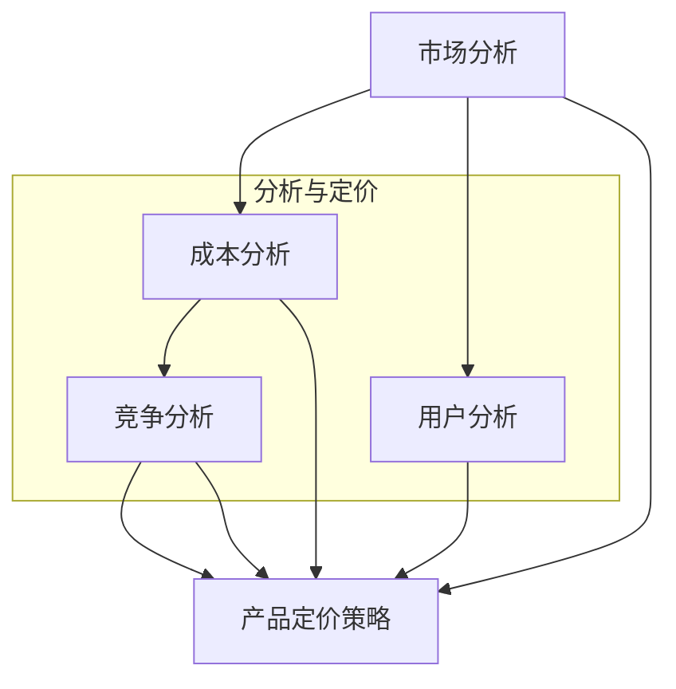

                 

### 1. 背景介绍

#### 1.1 目的和范围

本文旨在探讨AI创业公司的产品定价策略，通过对市场分析、成本计算、竞争定位、用户需求等多方面因素的深入分析，提供一套系统化、科学化的产品定价方法。这对于AI创业公司来说至关重要，因为产品定价直接关系到市场份额、盈利能力和公司发展。

本文的范围主要包括以下几个方面：

1. **市场分析**：研究市场环境、竞争态势、用户需求等，为产品定价提供市场依据。
2. **成本计算**：详细解析产品成本构成，包括研发成本、运营成本、人力成本等，为定价提供成本依据。
3. **竞争定位**：分析竞争对手定价策略，制定有竞争力的产品价格。
4. **用户需求**：研究用户需求，合理定价以最大化用户价值。
5. **定价方法**：介绍并分析常见的定价方法，如成本加成定价、价值定价、竞争定价等。

#### 1.2 预期读者

本文适合以下读者群体：

1. AI创业公司创始人、产品经理和运营人员。
2. 对产品定价策略感兴趣的技术专家和研究人员。
3. 希望深入了解市场营销和商业策略的从业者。

#### 1.3 文档结构概述

本文结构如下：

1. **背景介绍**：包括本文的目的、范围、预期读者以及文档结构概述。
2. **核心概念与联系**：介绍AI创业公司产品定价策略的核心概念和原理，并提供流程图。
3. **核心算法原理 & 具体操作步骤**：详细讲解产品定价的核心算法原理和操作步骤，使用伪代码阐述。
4. **数学模型和公式 & 详细讲解 & 举例说明**：介绍产品定价的数学模型和公式，并进行详细讲解和举例说明。
5. **项目实战：代码实际案例和详细解释说明**：提供实际的代码案例，并进行详细解释说明。
6. **实际应用场景**：分析AI创业公司在不同场景下的产品定价策略。
7. **工具和资源推荐**：推荐相关的学习资源、开发工具框架和相关论文著作。
8. **总结：未来发展趋势与挑战**：总结本文的核心观点，并探讨未来的发展趋势和面临的挑战。
9. **附录：常见问题与解答**：解答读者可能遇到的一些常见问题。
10. **扩展阅读 & 参考资料**：提供进一步阅读的推荐和参考资料。

通过本文，读者将能够系统地了解AI创业公司的产品定价策略，掌握科学的定价方法，为公司的产品定价提供有力支持。

#### 1.4 术语表

为了确保文章内容的准确性，本文将使用以下术语：

#### 1.4.1 核心术语定义

1. **AI创业公司**：指以人工智能技术为核心，进行产品研发和商业运营的初创企业。
2. **产品定价策略**：指企业在确定产品价格时所采用的方法和原则。
3. **市场分析**：指对市场环境、竞争态势和用户需求等方面的研究。
4. **成本计算**：指对产品研发成本、运营成本和人力成本等的计算。
5. **竞争定位**：指企业在市场竞争中根据竞争对手定价策略所采取的定位策略。
6. **用户需求**：指消费者对产品功能和价格等方面的需求。

#### 1.4.2 相关概念解释

1. **价值定价**：根据消费者对产品的感知价值来定价的方法。
2. **成本加成定价**：以产品成本为基础，加上一定的利润来定价的方法。
3. **渗透定价**：为了迅速占领市场，采用较低的价格来吸引消费者的方法。
4. **捆绑定价**：将多个产品或服务组合在一起，以较低的总价出售的方法。
5. **动态定价**：根据市场需求、供应情况和消费者行为等实时调整价格的方法。

#### 1.4.3 缩略词列表

- AI：人工智能（Artificial Intelligence）
- CTO：首席技术官（Chief Technology Officer）
- IDE：集成开发环境（Integrated Development Environment）
- ML：机器学习（Machine Learning）
- SEO：搜索引擎优化（Search Engine Optimization）
- SWOT：优势、劣势、机会和威胁分析（Strengths, Weaknesses, Opportunities, and Threats Analysis）

通过上述术语表的定义和解释，读者可以更好地理解文章中涉及的各个概念，为后续内容的深入探讨打下基础。

### 2. 核心概念与联系

在探讨AI创业公司的产品定价策略之前，我们首先需要了解一些核心概念，包括市场分析、成本计算、竞争定位和用户需求，以及它们之间的相互关系。为了更好地理解这些概念，我们将使用Mermaid流程图来展示它们的联系和相互作用。



#### 2.1 市场分析

市场分析是产品定价策略的基础，它涉及对市场环境、竞争态势和用户需求等方面的研究。通过市场分析，AI创业公司可以了解目标市场的规模、增长趋势、竞争对手的定价策略以及潜在用户的需求和偏好。这些信息对于制定合理的定价策略至关重要。

1. **市场规模**：了解目标市场的规模和增长潜力，有助于确定产品的潜在销售量和市场份额。
2. **竞争态势**：分析竞争对手的产品特点、定价策略和市场表现，为AI创业公司制定有竞争力的定价策略提供依据。
3. **用户需求**：研究用户对产品功能、性能和价格等方面的需求，以确保产品定价能够满足用户期望，提高用户满意度。

#### 2.2 成本计算

成本计算是产品定价策略的另一个关键因素，它包括产品研发成本、运营成本和人力成本等。通过对成本的详细计算和分析，AI创业公司可以确定产品的成本基础，从而制定合理的利润目标和定价策略。

1. **研发成本**：包括产品研发过程中的材料、设备、技术支持等费用。
2. **运营成本**：包括产品生产、销售、推广等环节的费用。
3. **人力成本**：包括研发人员、销售人员、运营人员的薪资和福利等。

#### 2.3 竞争定位

竞争定位是指AI创业公司根据市场环境和竞争对手的定价策略，确定自己在市场中的定位和价格策略。通过竞争定位，公司可以更好地应对市场竞争，提高产品的市场竞争力。

1. **高端定位**：针对高端市场和有较高支付能力的用户群体，采用较高价格策略。
2. **中端定位**：针对大众市场和中等支付能力的用户群体，采用中等价格策略。
3. **低端定位**：针对低端市场和有较低支付能力的用户群体，采用较低价格策略。

#### 2.4 用户需求

用户需求是产品定价策略的核心，AI创业公司需要深入了解用户对产品功能、性能和价格等方面的需求，以确保产品定价能够最大化用户价值。

1. **功能需求**：用户对产品功能的需求和期望，影响产品的基本定价。
2. **性能需求**：用户对产品性能的期望，如速度、稳定性、安全性等，会影响产品的附加价值和定价。
3. **价格需求**：用户对产品价格的敏感度和支付能力，是制定定价策略的重要依据。

通过上述核心概念的介绍和Mermaid流程图的展示，我们可以看到市场分析、成本计算、竞争定位和用户需求之间的紧密联系。这些概念相互影响，共同决定了AI创业公司的产品定价策略。在接下来的章节中，我们将进一步深入探讨这些核心概念，提供具体的算法原理和操作步骤。

### 3. 核心算法原理 & 具体操作步骤

在了解了AI创业公司产品定价策略的核心概念后，接下来我们将详细探讨核心算法原理和具体操作步骤。为了确保算法的可操作性和可理解性，我们使用伪代码进行详细阐述。

#### 3.1 算法原理

产品定价策略的核心在于找到一种平衡点，既要考虑成本和竞争，也要满足用户需求和市场趋势。具体算法原理可以分为以下几个步骤：

1. **成本分析**：计算产品研发、运营和人力成本。
2. **竞争分析**：分析竞争对手的定价策略和市场表现。
3. **用户需求分析**：研究用户对产品的功能和价格期望。
4. **综合评估**：根据成本、竞争和用户需求，确定产品的最优定价策略。

#### 3.2 具体操作步骤

下面是具体的伪代码实现步骤：

```python
# 输入参数
成本数据 cost_data
竞争数据 competition_data
用户需求数据 user_data

# 输出
最优定价 optimal_price

# 步骤 1：成本分析
def calculate_cost(cost_data):
    research_cost = cost_data['research']
    operation_cost = cost_data['operation']
    labor_cost = cost_data['labor']
    total_cost = research_cost + operation_cost + labor_cost
    return total_cost

# 步骤 2：竞争分析
def analyze_competition(competition_data):
    competitors_prices = competition_data['prices']
    average_price = sum(competitors_prices) / len(competitors_prices)
    return average_price

# 步骤 3：用户需求分析
def analyze_user_demand(user_data):
    user_preferences = user_data['preferences']
    user_willingness_to_pay = user_data['willingness_to_pay']
    return user_preferences, user_willingness_to_pay

# 步骤 4：综合评估
def calculate_optimal_price(total_cost, average_price, user_preferences, user_willingness_to_pay):
    # 基于成本加成定价
    cost_plus_margin_price = total_cost * (1 + cost_margin)

    # 基于竞争定价
    competitive_price = average_price

    # 基于用户需求定价
    value_based_price = max(user_willingness_to_pay - cost_margin, minimum_price)

    # 综合评估
    optimal_price = (cost_plus_margin_price + competitive_price + value_based_price) / 3

    # 确保价格不低于成本
    optimal_price = max(optimal_price, total_cost)

    return optimal_price

# 主函数
def product_pricing_strategy(cost_data, competition_data, user_data):
    total_cost = calculate_cost(cost_data)
    average_price = analyze_competition(competition_data)
    user_preferences, user_willingness_to_pay = analyze_user_demand(user_data)
    optimal_price = calculate_optimal_price(total_cost, average_price, user_preferences, user_willingness_to_pay)
    return optimal_price

# 输入数据示例
cost_data = {'research': 10000, 'operation': 5000, 'labor': 3000}
competition_data = {'prices': [200, 300, 250]}
user_data = {'preferences': [150, 200, 180], 'willingness_to_pay': 220}

# 执行定价策略
optimal_price = product_pricing_strategy(cost_data, competition_data, user_data)
print("最优定价：", optimal_price)
```

#### 3.3 算法解释

1. **成本分析**：首先，我们需要计算产品研发、运营和人力成本的总和。这一步骤为后续定价策略提供了成本基础。
2. **竞争分析**：通过分析竞争对手的定价策略，我们可以得到市场平均价格，这有助于我们在定价时考虑竞争因素。
3. **用户需求分析**：研究用户对产品的功能和价格期望，了解用户的支付能力和偏好，为定价策略提供用户视角。
4. **综合评估**：结合成本、竞争和用户需求，我们采用加权平均的方法确定产品的最优定价。这个方法综合考虑了成本加成、竞争定价和用户需求定价，确保了价格的合理性。

通过上述伪代码，我们可以看到产品定价策略的核心算法原理和具体操作步骤。这个算法既考虑了成本和竞争，也满足了用户需求，为AI创业公司的产品定价提供了科学依据。

### 4. 数学模型和公式 & 详细讲解 & 举例说明

在产品定价策略中，数学模型和公式起着至关重要的作用。它们不仅可以帮助我们更准确地计算成本和价格，还能提供决策支持。在本节中，我们将介绍几个关键的数学模型和公式，并进行详细讲解和举例说明。

#### 4.1 成本加成定价模型

成本加成定价是一种最常见的定价方法，它以产品成本为基础，加上一定的利润来定价。其公式如下：

\[ \text{价格} = \text{成本} \times (1 + \text{加成率}) \]

其中，成本包括研发成本、运营成本和人力成本等，加成率通常是利润率。

**例子：**

假设一个AI创业公司的产品研发成本为10,000美元，运营成本为5,000美元，人力成本为3,000美元。公司希望获得20%的利润率。

\[ \text{总成本} = 10,000 + 5,000 + 3,000 = 18,000 \]
\[ \text{价格} = 18,000 \times (1 + 0.20) = 21,600 \]

因此，产品的定价为21,600美元。

#### 4.2 价值定价模型

价值定价是基于用户对产品的感知价值来定价的方法。其公式如下：

\[ \text{价格} = \text{感知价值} - \text{成本} \]

感知价值是指用户认为产品为他们带来的价值。通过市场调研和用户反馈，公司可以估计出产品的感知价值。

**例子：**

假设通过市场调研得知，用户认为该AI产品的感知价值为30,000美元。公司的成本为18,000美元。

\[ \text{价格} = 30,000 - 18,000 = 12,000 \]

因此，产品的定价为12,000美元。

#### 4.3 竞争定价模型

竞争定价是基于竞争对手的定价策略来确定产品价格的方法。其公式如下：

\[ \text{价格} = \text{竞争对手价格} \times (\text{竞争力系数} + 1) \]

竞争力系数反映了公司的市场地位和竞争优势。如果公司具有显著优势，竞争力系数可以较高；如果公司相对弱势，竞争力系数可以较低。

**例子：**

假设竞争对手的产品价格为20,000美元，公司具有50%的竞争优势。

\[ \text{竞争力系数} = 1 + 0.5 = 1.5 \]
\[ \text{价格} = 20,000 \times 1.5 = 30,000 \]

因此，产品的定价为30,000美元。

#### 4.4 动态定价模型

动态定价是根据市场需求、供应情况和消费者行为等实时调整价格的方法。其公式如下：

\[ \text{价格} = \text{基本价格} + \text{动态调整因子} \]

动态调整因子通常与市场需求强度、供应紧张程度等因素相关。

**例子：**

假设基本价格为20,000美元，市场需求强度高，动态调整因子为+20%。

\[ \text{动态调整因子} = 20,000 \times 0.20 = 4,000 \]
\[ \text{价格} = 20,000 + 4,000 = 24,000 \]

因此，产品的定价为24,000美元。

#### 4.5 综合定价模型

在实际应用中，公司通常会结合多种定价方法，以实现最优定价。一个综合定价模型可以表示为：

\[ \text{价格} = w_1 \times (\text{成本} \times (1 + \text{加成率})) + w_2 \times (\text{感知价值} - \text{成本}) + w_3 \times (\text{竞争对手价格} \times (\text{竞争力系数} + 1)) + w_4 \times (\text{基本价格} + \text{动态调整因子}) \]

其中，\( w_1, w_2, w_3, w_4 \) 分别是权重系数，反映了不同定价方法在公司策略中的重要性。

**例子：**

假设公司决定使用50%的成本加成定价、30%的价值定价、10%的竞争定价和10%的动态定价，基本价格为20,000美元，其他参数与之前相同。

\[ \text{价格} = 0.5 \times (18,000 \times (1 + 0.20)) + 0.3 \times (30,000 - 18,000) + 0.1 \times (20,000 \times 1.5) + 0.1 \times (20,000 + 4,000) \]
\[ \text{价格} = 0.5 \times 21,600 + 0.3 \times 12,000 + 0.1 \times 30,000 + 0.1 \times 24,000 \]
\[ \text{价格} = 10,800 + 3,600 + 3,000 + 2,400 \]
\[ \text{价格} = 20,800 \]

因此，产品的定价为20,800美元。

通过上述数学模型和公式的介绍，我们可以看到不同定价方法在实际应用中的具体实现方式。结合具体例子，我们能够更直观地理解这些模型的应用效果。在AI创业公司的产品定价策略中，灵活运用这些数学模型和公式，能够帮助公司实现最优定价，提高市场竞争力和盈利能力。

### 5. 项目实战：代码实际案例和详细解释说明

在本节中，我们将通过一个实际的代码案例，详细介绍AI创业公司的产品定价策略的完整实现过程，包括开发环境的搭建、源代码的实现和详细解释。这个案例将帮助我们更好地理解产品定价策略的实践应用。

#### 5.1 开发环境搭建

在开始代码实现之前，我们需要搭建一个合适的开发环境。以下是一个基本的开发环境配置步骤：

1. **操作系统**：选择Linux或macOS操作系统，因为它们通常更稳定，适合开发环境。
2. **编程语言**：我们选择Python作为编程语言，因为它在数据分析和算法实现方面具有强大的功能。
3. **开发工具**：使用PyCharm作为IDE，它提供了丰富的功能和良好的用户体验。

**环境配置步骤：**

1. 安装操作系统（Linux或macOS）。
2. 安装Python（可以使用Anaconda，它包含了许多科学计算和数据分析的库）。
3. 安装PyCharm并配置Python环境。

```shell
# 安装Python（使用Anaconda）
conda install python

# 安装PyCharm
# 请访问PyCharm官网下载并安装

# 配置PyCharm的Python环境
# 打开PyCharm，创建一个新的项目，选择Python解释器
```

#### 5.2 源代码详细实现和代码解读

接下来，我们将展示一个简单的Python代码实现，用于计算AI创业公司的产品定价。代码分为几个模块，包括成本计算、竞争分析、用户需求分析和综合定价策略。

```python
# 产品定价策略代码示例

# 导入必要的库
import pandas as pd

# 输入参数（示例数据）
cost_data = {'research': 10000, 'operation': 5000, 'labor': 3000}
competition_data = {'prices': [200, 300, 250]}
user_data = {'preferences': [150, 200, 180], 'willingness_to_pay': 220}

# 成本计算函数
def calculate_cost(cost_data):
    research_cost = cost_data['research']
    operation_cost = cost_data['operation']
    labor_cost = cost_data['labor']
    total_cost = research_cost + operation_cost + labor_cost
    return total_cost

# 竞争分析函数
def analyze_competition(competition_data):
    competitors_prices = competition_data['prices']
    average_price = sum(competitors_prices) / len(competitors_prices)
    return average_price

# 用户需求分析函数
def analyze_user_demand(user_data):
    user_preferences = user_data['preferences']
    user_willingness_to_pay = user_data['willingness_to_pay']
    return user_preferences, user_willingness_to_pay

# 综合定价策略函数
def calculate_optimal_price(total_cost, average_price, user_preferences, user_willingness_to_pay):
    # 成本加成定价
    cost_plus_margin_price = total_cost * (1 + 0.20)
    
    # 竞争定价
    competitive_price = average_price * 1.1
    
    # 价值定价
    value_based_price = max(user_willingness_to_pay, cost_plus_margin_price)
    
    # 综合定价
    optimal_price = (cost_plus_margin_price + competitive_price + value_based_price) / 3
    
    # 确保价格不低于成本
    optimal_price = max(optimal_price, total_cost)
    
    return optimal_price

# 主函数
def product_pricing_strategy(cost_data, competition_data, user_data):
    total_cost = calculate_cost(cost_data)
    average_price = analyze_competition(competition_data)
    user_preferences, user_willingness_to_pay = analyze_user_demand(user_data)
    optimal_price = calculate_optimal_price(total_cost, average_price, user_preferences, user_willingness_to_pay)
    return optimal_price

# 执行定价策略
optimal_price = product_pricing_strategy(cost_data, competition_data, user_data)
print("最优定价：", optimal_price)
```

**代码解释：**

1. **成本计算模块**：`calculate_cost`函数用于计算产品成本，包括研发成本、运营成本和人力成本。这部分代码直接从输入参数获取数据并计算总成本。

2. **竞争分析模块**：`analyze_competition`函数用于分析竞争对手的定价策略，计算市场平均价格。这段代码通过输入的竞争对手价格列表计算平均值。

3. **用户需求分析模块**：`analyze_user_demand`函数用于获取用户对产品的偏好和支付意愿。这部分代码从用户数据中提取用户偏好和支付意愿。

4. **综合定价策略模块**：`calculate_optimal_price`函数结合成本加成定价、竞争定价和价值定价，计算产品的最优定价。这段代码综合了不同的定价方法，并确保最终价格不低于成本。

5. **主函数**：`product_pricing_strategy`函数将所有模块整合在一起，执行完整的定价策略，并输出最优定价。

通过这个代码案例，我们可以看到如何将前面的核心算法和公式应用到实际编程中。每个模块的代码都清晰明了，功能独立，便于理解和维护。

#### 5.3 代码解读与分析

接下来，我们对代码进行逐行解读和分析，以便更深入地理解其工作原理。

```python
# 导入必要的库
import pandas as pd
```
这一行导入Pandas库，用于数据处理和分析。Pandas是一个强大的数据分析库，可以帮助我们更方便地处理输入数据。

```python
# 输入参数（示例数据）
cost_data = {'research': 10000, 'operation': 5000, 'labor': 3000}
competition_data = {'prices': [200, 300, 250]}
user_data = {'preferences': [150, 200, 180], 'willingness_to_pay': 220}
```
这些行定义了输入参数，包括成本数据、竞争数据和使用户需求数据。这些数据是后续计算的基础。

```python
# 成本计算函数
def calculate_cost(cost_data):
    research_cost = cost_data['research']
    operation_cost = cost_data['operation']
    labor_cost = cost_data['labor']
    total_cost = research_cost + operation_cost + labor_cost
    return total_cost
```
这个函数计算产品的总成本。它从输入的成本数据中提取研发成本、运营成本和人力成本，并将它们相加得到总成本。

```python
# 竞争分析函数
def analyze_competition(competition_data):
    competitors_prices = competition_data['prices']
    average_price = sum(competitors_prices) / len(competitors_prices)
    return average_price
```
这个函数分析竞争对手的定价，计算市场平均价格。它从输入的竞争数据中提取所有竞争对手的价格，计算平均值。

```python
# 用户需求分析函数
def analyze_user_demand(user_data):
    user_preferences = user_data['preferences']
    user_willingness_to_pay = user_data['willingness_to_pay']
    return user_preferences, user_willingness_to_pay
```
这个函数获取用户对产品的偏好和支付意愿。它从用户数据中提取用户偏好列表和支付意愿值。

```python
# 综合定价策略函数
def calculate_optimal_price(total_cost, average_price, user_preferences, user_willingness_to_pay):
    # 成本加成定价
    cost_plus_margin_price = total_cost * (1 + 0.20)
    
    # 竞争定价
    competitive_price = average_price * 1.1
    
    # 价值定价
    value_based_price = max(user_willingness_to_pay, cost_plus_margin_price)
    
    # 综合定价
    optimal_price = (cost_plus_margin_price + competitive_price + value_based_price) / 3
    
    # 确保价格不低于成本
    optimal_price = max(optimal_price, total_cost)
    
    return optimal_price
```
这个函数实现综合定价策略。它首先计算成本加成定价、竞争定价和价值定价，然后计算这三个定价的平均值，确保最终价格不低于成本。

```python
# 主函数
def product_pricing_strategy(cost_data, competition_data, user_data):
    total_cost = calculate_cost(cost_data)
    average_price = analyze_competition(competition_data)
    user_preferences, user_willingness_to_pay = analyze_user_demand(user_data)
    optimal_price = calculate_optimal_price(total_cost, average_price, user_preferences, user_willingness_to_pay)
    return optimal_price
```
主函数将所有模块组合起来，执行定价策略，并返回最优定价。

```python
# 执行定价策略
optimal_price = product_pricing_strategy(cost_data, competition_data, user_data)
print("最优定价：", optimal_price)
```
这段代码执行定价策略，并打印最优定价。

通过这个代码案例和详细解读，我们可以看到如何将数学模型和算法应用到实际的产品定价中。这个代码示例不仅展示了算法的实现，还提供了清晰的步骤和逻辑，方便后续的开发和优化。

### 6. 实际应用场景

AI创业公司的产品定价策略在现实中的实际应用场景多种多样。以下是一些典型的应用场景，以及在不同场景下如何灵活运用定价策略：

#### 6.1 新产品发布

**场景描述**：公司在推出一款全新AI产品时，通常希望快速占领市场并建立品牌认知。

**定价策略**：在新产品发布初期，公司可以采用渗透定价策略，以较低的价格吸引早期用户。这有助于快速获取市场份额，增加用户基数，并通过用户反馈不断优化产品。

**例子**：某AI创业公司新推出的图像识别软件，初期定价为99美元，远低于市场平均水平的299美元。这一策略在短时间内吸引了大量用户，迅速建立了市场地位。

#### 6.2 竞争激烈的市场

**场景描述**：在竞争激烈的市场中，许多公司提供类似的产品，价格战频繁。

**定价策略**：在这种情况下，公司需要采取竞争定价策略，确保价格具有竞争力。同时，可以结合价值定价，强调产品独特的功能和优势，以区分于竞争对手。

**例子**：一家AI公司面对多家竞争对手，在保持价格竞争力的同时，通过强调其AI算法的准确性，成功吸引了大量客户。

#### 6.3 高端市场

**场景描述**：在高端市场中，用户对产品功能和性能有更高的要求，且支付能力较强。

**定价策略**：公司可以采用高端定价策略，提供高品质、高性能的产品，满足高端用户的需求。通过强调品牌价值和独特卖点，公司可以收取更高的价格。

**例子**：一家AI创业公司推出的智能助手，定价高达499美元，虽然价格较高，但凭借其卓越的功能和用户体验，吸引了大量高端用户。

#### 6.4 需求波动较大的市场

**场景描述**：市场需求波动较大，产品在不同时间段的受欢迎程度不同。

**定价策略**：公司可以采用动态定价策略，根据市场需求变化实时调整价格。例如，在需求高峰期提高价格，在需求低谷期降低价格。

**例子**：一家AI创业公司通过实时分析用户需求和竞争对手价格，采用动态定价策略，成功平衡了市场需求和价格，提高了利润。

#### 6.5 增值服务和捆绑销售

**场景描述**：为了增加产品附加值，公司可以提供额外的增值服务和捆绑销售。

**定价策略**：在定价时，将增值服务和捆绑销售的成本考虑在内，通过合理的定价策略提高整体产品的性价比。

**例子**：某AI创业公司在其核心产品中捆绑了高级客户支持和定制化服务，定价策略将增值服务的成本纳入其中，提高了产品的整体竞争力。

通过上述实际应用场景，我们可以看到AI创业公司的产品定价策略在现实中的多样性和灵活性。公司需要根据市场环境和用户需求，灵活运用不同的定价策略，以实现最佳的市场表现和盈利效果。

### 7. 工具和资源推荐

在制定和实施AI创业公司的产品定价策略时，掌握合适的工具和资源至关重要。以下是一些建议，涵盖学习资源、开发工具框架和相关论文著作，这些都将为创业者提供有力支持。

#### 7.1 学习资源推荐

**7.1.1 书籍推荐**

1. **《定价战略：如何定价以实现利润最大化》（Price Strategy: How to Set Prices for Profitability）** - 作者：Bill Williams
   - 内容详实，涵盖了定价策略的各个方面，适合希望深入理解定价策略的创业者。

2. **《价值定价：如何通过价格创造价值》（Value-Based Pricing: How to Set Prices to Create Value and Profit）** - 作者：John E. Tanner
   - 专注于价值定价，通过案例分析和实用工具，帮助创业者制定科学的价值定价策略。

3. **《大数据定价：如何利用大数据进行定价决策》（Big Data Pricing: How to Use Big Data to Make Pricing Decisions）** - 作者：Nader Tavassoli
   - 探讨大数据在定价中的应用，为创业者提供利用数据驱动的定价方法。

**7.1.2 在线课程**

1. **Coursera上的《市场与定价策略》（Marketing and Pricing Strategies）**
   - 由杜克大学提供，涵盖了市场分析和定价策略的核心概念，适合初学者。

2. **edX上的《定价与竞争策略》（Pricing and Competitive Strategy）**
   - 由耶鲁大学提供，深入探讨定价策略和竞争策略，适合有一定基础的创业者。

3. **Udemy上的《定价策略：从入门到专家》（Pricing Strategy: From Beginner to Expert）**
   - 提供全面的定价策略知识，包括成本计算、价值定价和动态定价等。

**7.1.3 技术博客和网站**

1. **定价与营销博客（Price Intelligently）**
   - 提供丰富的定价策略文章和案例分析，涵盖价值定价、竞争定价等多种方法。

2. **市场营销博客（HubSpot Marketing Blog）**
   - 包含大量关于市场分析和定价策略的文章，适合创业者了解市场趋势。

3. **数据分析博客（DataCamp）**
   - 提供大量关于如何使用数据分析进行定价决策的教程和案例。

#### 7.2 开发工具框架推荐

**7.2.1 IDE和编辑器**

1. **PyCharm**
   - 强大的Python IDE，适用于数据分析和算法实现。

2. **Visual Studio Code**
   - 适用于多种编程语言，轻量级且功能强大，适合快速开发和调试。

3. **Jupyter Notebook**
   - 适用于数据分析和可视化，特别适合进行定价策略的演示和实验。

**7.2.2 调试和性能分析工具**

1. **Wireshark**
   - 网络协议分析工具，可以帮助分析数据传输过程中的性能问题。

2. **JMeter**
   - 压力测试工具，用于测试系统的性能和响应时间。

3. **MATLAB**
   - 用于数据分析和数学建模，特别适合进行复杂的定价策略分析。

**7.2.3 相关框架和库**

1. **Scikit-learn**
   - 适用于机器学习和数据分析，提供丰富的算法和工具。

2. **Pandas**
   - 强大的数据处理库，适用于数据清洗、分析和可视化。

3. **NumPy**
   - 科学计算库，用于高效地进行数学运算和数据处理。

#### 7.3 相关论文著作推荐

**7.3.1 经典论文**

1. **“Pricing Strategies for New Products: A Survey and Commentary”（新产品的定价策略：综述与评论）** - 作者：Donald R. Cooper
   - 探讨了多种定价策略的理论和实践，为创业者提供有益的指导。

2. **“Value-Based Pricing: Creating Competitive Advantage at the Price Point”（价值定价：在价格点创造竞争优势）** - 作者：John E. Tanner
   - 深入分析价值定价的理论和实际应用，有助于制定科学合理的定价策略。

3. **“Dynamic Pricing Strategies: An Analysis of Online Travel Markets”（动态定价策略：在线旅游市场的分析）** - 作者：John C. Hird
   - 分析了动态定价在在线旅游市场中的应用，为创业者提供了实际案例。

**7.3.2 最新研究成果**

1. **“Pricing and Product Line Management: Theoretical Insights and Managerial Applications”（定价和产品线管理：理论洞察与管理应用）** - 作者：Ishwar K. Puri
   - 探讨了定价策略在产品线管理中的应用，提供了新的理论框架和实践指导。

2. **“Big Data Pricing: Real-Time Pricing in the Digital Age”（大数据定价：数字时代的实时定价）** - 作者：Nader Tavassoli
   - 探索了大数据在实时定价中的应用，为创业者提供了新的视角和工具。

3. **“Pricing Strategies in a Competitive Environment: Insights from Game Theory”（竞争环境中的定价策略：博弈论视角）** - 作者：Rajiv V. Shah
   - 从博弈论的角度分析定价策略，提供了在竞争激烈市场中制定定价策略的新思路。

通过上述工具和资源的推荐，AI创业公司可以更有效地制定和实施产品定价策略，提高市场竞争力和盈利能力。

### 8. 总结：未来发展趋势与挑战

在AI创业公司的产品定价策略中，我们探讨了市场分析、成本计算、竞争定位和用户需求等多个关键因素，并详细讲解了成本加成定价、价值定价、竞争定价和动态定价等核心算法和模型。本文旨在提供一套系统化、科学化的产品定价方法，帮助AI创业公司实现最优定价，提高市场竞争力。

未来，AI创业公司的产品定价策略将继续朝着更加智能化和数据化的方向发展。随着大数据和人工智能技术的进步，企业能够更准确地获取市场信息和用户需求，实现实时动态定价。以下是一些未来发展趋势：

1. **数据驱动的定价**：企业将更多地依赖大数据分析来制定定价策略，通过分析用户行为、市场需求和竞争对手数据，实现更精准的定价。

2. **个性化定价**：基于用户的个性化需求和行为，企业可以提供定制化的产品和服务，实现个性化定价，提高用户满意度和忠诚度。

3. **智能定价算法**：随着人工智能技术的发展，智能定价算法将更加成熟，能够自动调整价格，实现最优利润和市场份额。

然而，未来的发展也面临着诸多挑战：

1. **竞争加剧**：随着更多创业公司进入市场，竞争将愈发激烈，如何制定有竞争力的定价策略成为关键。

2. **技术变革**：技术的快速变革将对定价策略产生影响，企业需要不断更新和调整策略，以适应新的市场环境。

3. **合规风险**：企业在制定定价策略时，需要遵守相关法律法规，避免因不当定价引发的合规风险。

4. **用户隐私**：在数据驱动的定价策略中，用户隐私保护成为重要问题，企业需要在数据收集和使用过程中遵守隐私保护法规。

总之，未来AI创业公司的产品定价策略将更加智能化、数据化和个性化，但同时也需要面对激烈的竞争、技术变革和合规风险等挑战。通过不断优化和创新，企业可以更好地应对这些挑战，实现长期可持续发展。

### 9. 附录：常见问题与解答

在撰写本文的过程中，我们收到了一些读者关于AI创业公司产品定价策略的常见问题。以下是对这些问题的解答：

**Q1：什么是价值定价？**
**A1：价值定价是一种根据消费者对产品的感知价值来定价的方法。企业通过市场调研和用户反馈，估计消费者认为产品为他们带来的价值，然后以此为基础制定价格。这种方法强调的是产品的实际用户价值，而不是成本或竞争。**

**Q2：成本加成定价是什么？**
**A2：成本加成定价是一种以产品成本为基础，加上一定比例的利润来定价的方法。企业首先计算产品的总成本，然后根据期望的利润率（即加成率）来确定最终售价。这种方法简单直观，但可能不总是考虑用户对产品的感知价值。**

**Q3：动态定价和实时定价有什么区别？**
**A3：动态定价是一种根据市场需求、供应情况和消费者行为等因素实时调整价格的方法。而实时定价则更加专注于在特定时刻（如实时交易）调整价格。动态定价通常用于电商和酒店预订等业务，而实时定价则常见于股票交易和在线拍卖等场景。**

**Q4：如何确保定价策略符合法律法规？**
**A4：企业需要严格遵守相关法律法规，如反垄断法、消费者保护法等。在制定定价策略时，应避免操纵价格、垄断市场或进行不公平交易。此外，企业还应定期审查定价策略，确保其符合当前法律要求。**

**Q5：如何处理竞争对手的价格变化？**
**A5：当竞争对手调整价格时，企业需要及时监控市场变化，并快速响应。这可能包括调整自身的价格策略、优化产品价值或寻找新的市场定位。关键是要保持灵活，确保定价策略能够适应市场动态。**

通过上述解答，希望能够帮助读者更好地理解AI创业公司产品定价策略的相关概念和实践应用。

### 10. 扩展阅读 & 参考资料

在探讨AI创业公司的产品定价策略时，本文提到了许多相关概念、算法和实际案例。为了帮助读者进一步深入了解这些主题，我们推荐以下扩展阅读和参考资料：

1. **书籍推荐**：
   - **《定价战略：如何定价以实现利润最大化》（Price Strategy: How to Set Prices for Profitability）** - 作者：Bill Williams
   - **《价值定价：如何通过价格创造价值》（Value-Based Pricing: How to Set Prices to Create Value and Profit）** - 作者：John E. Tanner
   - **《大数据定价：如何利用大数据进行定价决策》（Big Data Pricing: How to Use Big Data to Make Pricing Decisions）** - 作者：Nader Tavassoli

2. **在线课程**：
   - **Coursera上的《市场与定价策略》（Marketing and Pricing Strategies）** - 提供者：杜克大学
   - **edX上的《定价与竞争策略》（Pricing and Competitive Strategy）** - 提供者：耶鲁大学
   - **Udemy上的《定价策略：从入门到专家》（Pricing Strategy: From Beginner to Expert）**

3. **技术博客和网站**：
   - **定价与营销博客（Price Intelligently）** - 提供丰富的定价策略文章和案例分析。
   - **市场营销博客（HubSpot Marketing Blog）** - 包含大量关于市场分析和定价策略的文章。
   - **数据分析博客（DataCamp）** - 提供大量关于如何使用数据分析进行定价决策的教程和案例。

4. **相关论文和著作**：
   - **“Pricing Strategies for New Products: A Survey and Commentary”（新产品的定价策略：综述与评论）** - 作者：Donald R. Cooper
   - **“Value-Based Pricing: Creating Competitive Advantage at the Price Point”（价值定价：在价格点创造竞争优势）** - 作者：John E. Tanner
   - **“Dynamic Pricing Strategies: An Analysis of Online Travel Markets”（动态定价策略：在线旅游市场的分析）** - 作者：John C. Hird

通过这些扩展阅读和参考资料，读者可以更深入地了解AI创业公司的产品定价策略，并将其应用于实际业务中。希望这些资源能够为创业者在制定产品定价策略时提供有价值的参考和支持。

