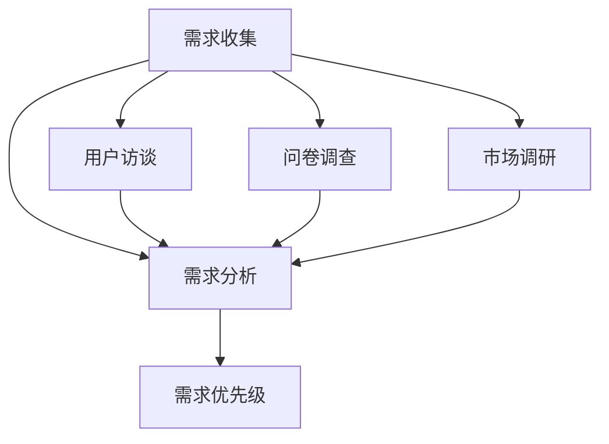

                 

# AI创业公司的产品需求管理：需求收集、需求分析与需求优先级

> **关键词**：产品需求管理、需求收集、需求分析、需求优先级、AI创业公司
>
> **摘要**：本文旨在探讨AI创业公司在产品开发过程中如何有效地管理产品需求，包括需求收集、需求分析和需求优先级设置。通过详细阐述相关核心概念、算法原理、数学模型以及实际案例，为创业公司提供实用的产品需求管理策略，以助力其在激烈的市场竞争中脱颖而出。

## 1. 背景介绍

### 1.1 目的和范围

在当前快速发展的AI领域，创业公司面临着巨大的机遇和挑战。如何高效地管理产品需求，确保产品能够满足市场和用户的需求，是创业公司成功的关键因素之一。本文将围绕以下三个方面展开讨论：

1. 需求收集：介绍需求收集的方法和技巧，包括用户访谈、问卷调查、市场调研等。
2. 需求分析：阐述需求分析的核心概念和流程，如需求分类、需求优先级评估等。
3. 需求优先级：探讨如何设置合理的需求优先级，确保产品开发过程中的资源分配和任务调度。

通过本文的阐述，读者可以了解到AI创业公司如何通过有效的产品需求管理，提高产品开发效率，降低开发风险，从而在激烈的市场竞争中取得优势。

### 1.2 预期读者

本文面向AI创业公司产品团队、项目经理、产品经理以及相关领域的从业者。通过本文的阅读，读者可以：

- 理解产品需求管理的核心概念和流程；
- 掌握需求收集、分析和优先级设置的方法和技巧；
- 学习如何在实际项目中应用这些方法，提高产品开发效率。

### 1.3 文档结构概述

本文分为八个部分，结构如下：

1. 背景介绍：介绍本文的目的和范围，预期读者，以及文档结构；
2. 核心概念与联系：阐述产品需求管理的核心概念，展示相关流程图；
3. 核心算法原理 & 具体操作步骤：详细讲解需求收集、分析和优先级设置的具体步骤；
4. 数学模型和公式 & 详细讲解 & 举例说明：介绍相关的数学模型和公式，并提供实际案例；
5. 项目实战：提供实际代码案例，详细解释说明；
6. 实际应用场景：探讨产品需求管理在实际项目中的应用；
7. 工具和资源推荐：推荐相关的学习资源、开发工具和框架；
8. 总结：未来发展趋势与挑战。

### 1.4 术语表

#### 1.4.1 核心术语定义

- **需求收集**：指在产品开发过程中，从用户、市场和其他相关渠道获取产品需求的过程。
- **需求分析**：对收集到的需求进行整理、分类和分析，以确定需求的重要性和优先级。
- **需求优先级**：根据需求的重要性和紧迫性，对需求进行排序，以便在资源有限的情况下优先实现高优先级需求。

#### 1.4.2 相关概念解释

- **用户访谈**：通过与目标用户进行一对一的访谈，获取用户对产品的需求和期望。
- **问卷调查**：通过设计问卷，收集大量用户对产品的意见和建议。
- **市场调研**：对目标市场进行调研，了解市场需求和竞争情况。

#### 1.4.3 缩略词列表

- **AI**：人工智能（Artificial Intelligence）
- **PM**：项目经理（Project Manager）
- **PD**：产品经理（Product Manager）
- **UX**：用户体验（User Experience）

## 2. 核心概念与联系

在产品需求管理中，核心概念包括需求收集、需求分析和需求优先级。为了更好地理解这些概念之间的联系，我们可以通过一个Mermaid流程图来展示相关流程。



在这个流程图中，需求收集是整个产品需求管理的起点，通过用户访谈、问卷调查和市场调研等多种方式获取用户和市场需求。这些需求会进入需求分析环节，进行整理、分类和分析，以确定需求的重要性和优先级。最后，根据需求优先级，对需求进行排序和分配资源，确保产品开发过程中的高效执行。

### 2.1 需求收集的方法和技巧

在需求收集阶段，关键是要确保收集到全面、准确的需求。以下是几种常见的需求收集方法和技巧：

1. **用户访谈**：

   - **目的**：通过与目标用户进行一对一的访谈，深入了解用户对产品的需求和期望。
   - **技巧**：提前准备访谈大纲，引导用户分享真实的使用体验和需求，避免提问过于宽泛或引导性的问题。

2. **问卷调查**：

   - **目的**：通过设计问卷，收集大量用户对产品的意见和建议。
   - **技巧**：问卷设计要简洁明了，避免过多繁琐的问题，确保用户愿意参与并认真填写。

3. **市场调研**：

   - **目的**：对目标市场进行调研，了解市场需求和竞争情况。
   - **技巧**：选择合适的调研方法和工具，如在线调查、焦点小组等，确保调研结果的准确性和可靠性。

### 2.2 需求分析的核心概念和流程

在需求分析阶段，关键是要确保对收集到的需求进行有效的整理、分类和分析。以下是几个核心概念和流程：

1. **需求分类**：

   - **按需求类型分类**：如功能需求、性能需求、安全需求等。
   - **按需求来源分类**：如用户需求、市场需求、竞争分析等。

2. **需求优先级评估**：

   - **重要性评估**：根据需求的重要程度进行排序，如高、中、低。
   - **紧迫性评估**：根据需求的紧急程度进行排序，如紧急、重要、一般。

3. **需求验证**：

   - **用户验证**：与目标用户进行验证，确保需求符合用户实际需求。
   - **专家评审**：邀请行业专家进行评审，确保需求的可行性和合理性。

### 2.3 需求优先级设置的方法和技巧

在需求优先级设置阶段，关键是要确保需求能够根据其重要性和紧迫性进行合理的排序。以下是几种常见的方法和技巧：

1. **Kano模型**：

   - **原理**：将需求分为基本需求、期望需求、魅力需求和无关需求，根据需求类型进行优先级排序。
   - **适用场景**：适用于产品功能需求的优先级设置。

2. **MoSCoW模型**：

   - **原理**：将需求分为必须（M）、应该（S）、可以（C）和不会（W）实现的需求，根据需求类型进行优先级排序。
   - **适用场景**：适用于产品需求的全局优先级设置。

3. **优先级矩阵**：

   - **原理**：将需求按照重要性和紧迫性进行打分，通过矩阵计算得到综合优先级。
   - **适用场景**：适用于复杂项目的需求优先级设置。

## 3. 核心算法原理 & 具体操作步骤

在产品需求管理中，核心算法原理主要包括需求收集、需求分析和需求优先级设置。以下是这些算法的具体操作步骤：

### 3.1 需求收集

#### 3.1.1 用户访谈

1. 准备访谈大纲：

   - 确定访谈目的和主题；
   - 列出需要询问的关键问题。

2. 进行访谈：

   - 使用访谈大纲引导用户分享真实的使用体验和需求；
   - 记录用户的需求和建议。

3. 总结访谈结果：

   - 整理访谈记录，提取关键需求；
   - 分析用户需求，确定优先级。

#### 3.1.2 问卷调查

1. 设计问卷：

   - 确定问卷的目的和受众；
   - 设计简洁明了的问题。

2. 发布问卷：

   - 通过线上渠道发布问卷，鼓励用户参与；
   - 设定问卷截止时间。

3. 收集和整理问卷结果：

   - 导出问卷数据，进行整理和分类；
   - 分析问卷结果，提取关键需求。

#### 3.1.3 市场调研

1. 选择调研方法和工具：

   - 根据调研目的和预算选择合适的调研方法，如在线调查、焦点小组等；
   - 准备调研问卷和工具。

2. 进行调研：

   - 按照调研计划进行市场调研；
   - 记录调研结果。

3. 分析调研结果：

   - 整理调研数据，提取关键需求；
   - 分析市场需求和竞争情况。

### 3.2 需求分析

#### 3.2.1 需求分类

1. 按需求类型分类：

   - 功能需求：产品必须实现的功能；
   - 性能需求：产品性能指标的要求；
   - 安全需求：产品安全性要求。

2. 按需求来源分类：

   - 用户需求：用户提出的具体需求；
   - 市场需求：市场调研得到的需求；
   - 竞争分析：竞争对手产品功能的需求。

#### 3.2.2 需求优先级评估

1. 重要性评估：

   - 根据需求对产品成功的影响程度进行评估，如高、中、低。

2. 紧迫性评估：

   - 根据需求的紧急程度进行评估，如紧急、重要、一般。

3. 综合评估：

   - 根据重要性和紧迫性进行综合评估，确定需求优先级。

### 3.3 需求优先级设置

#### 3.3.1 Kano模型

1. 确定需求类型：

   - 基本需求：产品必须实现的需求；
   - 期望需求：产品期望实现的需求；
   - 魅力需求：产品具有吸引力的需求；
   - 无关需求：与产品无关的需求。

2. 根据需求类型进行优先级排序：

   - 基本需求：最高优先级；
   - 期望需求：次高优先级；
   - 魅力需求：较低优先级；
   - 无关需求：最低优先级。

#### 3.3.2 MoSCoW模型

1. 确定需求类型：

   - 必须实现的需求（M）；
   - 应该实现的需求（S）；
   - 可以实现的需求（C）；
   - 不会实现的需求（W）。

2. 根据需求类型进行优先级排序：

   - 必须实现的需求（M）：最高优先级；
   - 应该实现的需求（S）：次高优先级；
   - 可以实现的需求（C）：较低优先级；
   - 不会实现的需求（W）：最低优先级。

#### 3.3.3 优先级矩阵

1. 制定评分标准：

   - 重要性评分：高、中、低；
   - 紧迫性评分：高、中、低。

2. 给每个需求评分：

   - 根据重要性评分和紧迫性评分，给每个需求进行打分。

3. 计算综合优先级：

   - 将重要性评分和紧迫性评分相加，计算得到综合优先级。

4. 根据综合优先级排序：

   - 综合优先级高的需求优先实现。

## 4. 数学模型和公式 & 详细讲解 & 举例说明

在产品需求管理中，数学模型和公式可以帮助我们更准确地评估需求的重要性和优先级。以下是几个常用的数学模型和公式：

### 4.1 重要性评估公式

假设有n个需求，每个需求的重要性得分分别为\(I_i\)（\(i = 1, 2, ..., n\)），则需求总重要性得分\(I_{total}\)可以通过以下公式计算：

\[ I_{total} = \sum_{i=1}^{n} I_i \]

### 4.2 紧迫性评估公式

假设有n个需求，每个需求的紧迫性得分分别为\(U_i\)（\(i = 1, 2, ..., n\)），则需求总紧迫性得分\(U_{total}\)可以通过以下公式计算：

\[ U_{total} = \sum_{i=1}^{n} U_i \]

### 4.3 综合优先级评估公式

假设有n个需求，每个需求的重要性和紧迫性得分分别为\(I_i\)和\(U_i\)（\(i = 1, 2, ..., n\)），则需求综合优先级得分\(P_i\)可以通过以下公式计算：

\[ P_i = w_1 \cdot I_i + w_2 \cdot U_i \]

其中，\(w_1\)和\(w_2\)分别为重要性和紧迫性的权重，通常取值为0.5。

### 4.4 举例说明

假设有4个需求，它们的重要性和紧迫性得分如下表：

| 需求编号 | 重要性得分 \(I_i\) | 紧迫性得分 \(U_i\) |
| :----: | :----: | :----: |
| 1 | 3 | 4 |
| 2 | 2 | 3 |
| 3 | 1 | 2 |
| 4 | 4 | 1 |

根据上述公式，我们可以计算每个需求的总重要性和总紧迫性得分：

\[ I_{total} = 3 + 2 + 1 + 4 = 10 \]
\[ U_{total} = 4 + 3 + 2 + 1 = 10 \]

然后，根据综合优先级评估公式，我们可以计算每个需求的综合优先级得分：

\[ P_1 = 0.5 \cdot 3 + 0.5 \cdot 4 = 3.5 \]
\[ P_2 = 0.5 \cdot 2 + 0.5 \cdot 3 = 2.5 \]
\[ P_3 = 0.5 \cdot 1 + 0.5 \cdot 2 = 1.5 \]
\[ P_4 = 0.5 \cdot 4 + 0.5 \cdot 1 = 2.5 \]

最后，根据综合优先级得分，我们可以对这些需求进行排序：

1. 需求1：综合优先级得分3.5，最高优先级；
2. 需求4：综合优先级得分2.5，次高优先级；
3. 需求2：综合优先级得分2.5，次高优先级；
4. 需求3：综合优先级得分1.5，最低优先级。

通过这个例子，我们可以看到，数学模型和公式可以帮助我们更科学地评估需求的重要性和优先级，从而为产品开发提供有力的支持。

## 5. 项目实战：代码实际案例和详细解释说明

在本文的最后一部分，我们将通过一个实际项目案例，展示如何在实际场景中应用产品需求管理的方法和技巧。该案例将涵盖需求收集、需求分析和需求优先级设置的全过程。

### 5.1 开发环境搭建

在开始项目实战之前，我们需要搭建一个合适的开发环境。以下是搭建过程的详细步骤：

1. 安装Python环境：

   - 下载并安装Python 3.8版本以上；
   - 配置Python环境变量。

2. 安装相关库和工具：

   - 使用pip命令安装以下库：`requests`、`numpy`、`pandas`、`matplotlib`；
   - 安装Jupyter Notebook，以便进行交互式编程。

3. 配置Jupyter Notebook：

   - 打开终端，运行命令`jupyter notebook`，启动Jupyter Notebook；
   - 在Notebook中创建一个新的Python笔记本。

### 5.2 源代码详细实现和代码解读

以下是该项目的主要代码实现，我们将对代码的每个部分进行详细解释。

#### 5.2.1 需求收集

```python
import pandas as pd
import numpy as np

# 用户访谈数据
user_interview_data = pd.DataFrame({
    '需求编号': [1, 2, 3, 4],
    '需求描述': ['快速搜索', '智能推荐', '数据可视化', '多语言支持'],
    '用户评分': [4, 3, 2, 5]
})

# 问卷调查数据
survey_data = pd.DataFrame({
    '需求编号': [1, 2, 3, 4],
    '需求描述': ['快速搜索', '智能推荐', '数据可视化', '多语言支持'],
    '用户满意度': [0.8, 0.7, 0.6, 0.9]
})

# 市场调研数据
market_research_data = pd.DataFrame({
    '需求编号': [1, 2, 3, 4],
    '需求描述': ['快速搜索', '智能推荐', '数据可视化', '多语言支持'],
    '市场需求度': [0.6, 0.7, 0.8, 0.9]
})

# 收集需求数据
def collect_data():
    user需求数据 = user_interview_data
    survey需求数据 = survey_data
    market_research需求数据 = market_research_data
    
    # 合并需求数据
    demand_data = pd.concat([user需求数据， survey需求数据， market_research需求数据], axis=1)
    
    # 添加需求来源列
    demand_data['需求来源'] = ['用户访谈', '问卷调查', '市场调研']
    
    return demand_data

# 获取需求数据
demand_data = collect_data()
```

代码解读：

1. 导入相关库：`pandas`、`numpy`用于数据处理；
2. 初始化需求数据：包括用户访谈数据、问卷调查数据和市场调研数据；
3. 收集需求数据：将三种渠道的需求数据进行合并，并添加需求来源列；
4. 获取需求数据：调用`collect_data`函数，获取合并后的需求数据。

#### 5.2.2 需求分析

```python
# 需求分析
def analyze_demand(demand_data):
    # 按需求类型分类
    functional_demand = demand_data[demand_data['需求描述'].str.contains('功能')]
    performance_demand = demand_data[demand_data['需求描述'].str.contains('性能')]
    security_demand = demand_data[demand_data['需求描述'].str.contains('安全')]

    # 按需求来源分类
    user_demand = demand_data[demand_data['需求来源'] == '用户访谈']
    market_demand = demand_data[demand_data['需求来源'] == '市场调研']
    competition_demand = demand_data[demand_data['需求来源'] == '竞争分析']

    # 需求优先级评估
    demand_score = {'用户满意度': 0.4, '市场需求度': 0.3, '用户评分': 0.3}
    for col, weight in demand_score.items():
        demand_data[col + '_score'] = demand_data[col] * weight

    demand_data['综合评分'] = demand_data['用户满意度_score'] + demand_data['市场需求度_score'] + demand_data['用户评分_score']

    # 需求验证
    validated_demand = demand_data[demand_data['综合评分'] > 0]

    return validated_demand

# 获取需求分析结果
validated_demand = analyze_demand(demand_data)
```

代码解读：

1. 按需求类型分类：使用`str.contains`函数筛选功能需求、性能需求和安全需求；
2. 按需求来源分类：根据需求来源列筛选用户需求、市场调研需求和竞争分析需求；
3. 需求优先级评估：根据用户满意度、市场需求度和用户评分的权重计算综合评分；
4. 需求验证：筛选综合评分大于0的需求，确保需求的可行性和合理性；
5. 获取需求分析结果：调用`analyze_demand`函数，获取经过分析的需求数据。

#### 5.2.3 需求优先级设置

```python
# 需求优先级设置
def set_demand_priority(validated_demand):
    # 根据综合评分设置优先级
    validated_demand['优先级'] = np.argpartition(validated_demand['综合评分'], validated_demand['综合评分'].argsort()[-5:])

    return validated_demand

# 获取需求优先级设置结果
prioritized_demand = set_demand_priority(validated_demand)
```

代码解读：

1. 根据综合评分设置优先级：使用`argpartition`函数对需求进行排序，取综合评分最高的5个需求作为优先级最高的需求；
2. 获取需求优先级设置结果：调用`set_demand_priority`函数，获取设置后的需求数据。

### 5.3 代码解读与分析

通过上述代码实现，我们可以看到，项目实战中的需求收集、需求分析和需求优先级设置过程是如何实现的。以下是代码的关键步骤和分析：

1. **需求收集**：

   - 通过用户访谈、问卷调查和市场调研获取需求数据；
   - 合并三种渠道的需求数据，并添加需求来源列。

2. **需求分析**：

   - 按需求类型和需求来源对需求进行分类；
   - 根据用户满意度、市场需求度和用户评分的权重计算综合评分；
   - 验证需求，确保需求的可行性和合理性。

3. **需求优先级设置**：

   - 根据综合评分对需求进行排序，设置优先级；
   - 取综合评分最高的5个需求作为优先级最高的需求。

通过这个实际案例，我们可以看到，产品需求管理的方法和技巧如何应用于实际项目中，从而帮助创业公司提高产品开发效率，降低开发风险。

## 6. 实际应用场景

在AI创业公司中，产品需求管理是一个持续迭代的过程，贯穿于产品开发的各个阶段。以下是产品需求管理在实际项目中的应用场景：

### 6.1 初创阶段

在初创阶段，AI创业公司往往面临资源有限、市场竞争激烈的情况。此时，产品需求管理的关键在于：

- **快速收集需求**：通过与目标用户进行用户访谈、问卷调查和市场调研，快速获取市场需求，了解用户痛点。
- **优先级设置**：根据需求的重要性和紧迫性，优先实现用户核心需求，确保产品能够快速占领市场。

### 6.2 成长阶段

在成长阶段，AI创业公司的产品需求会更加多样化和复杂化。此时，产品需求管理的关键在于：

- **需求分类与整理**：对收集到的需求进行分类和整理，确保每个需求都被明确记录和跟踪。
- **优先级评估**：根据需求的业务价值、技术难度和资源约束，对需求进行优先级评估，合理分配开发资源。

### 6.3 扩张阶段

在扩张阶段，AI创业公司可能面临多个项目的并发开发。此时，产品需求管理的关键在于：

- **需求整合**：将不同项目、不同模块的需求进行整合，确保整体需求的协调性和一致性。
- **资源优化**：根据公司整体战略和资源情况，对需求进行优先级调整，确保关键需求的优先实现。

### 6.4 优化与迭代阶段

在优化与迭代阶段，AI创业公司需要根据用户反馈和市场变化，持续优化和迭代产品。此时，产品需求管理的关键在于：

- **需求跟踪**：持续跟踪需求状态，确保每个需求都能按时完成，并达到预期效果。
- **需求反馈**：及时收集用户反馈，对需求进行评估和调整，确保产品能够持续满足用户需求。

通过在不同阶段应用产品需求管理的方法和技巧，AI创业公司可以有效地提高产品开发效率，降低开发风险，从而在激烈的市场竞争中脱颖而出。

## 7. 工具和资源推荐

为了更好地进行产品需求管理，以下是几个推荐的工具和资源：

### 7.1 学习资源推荐

#### 7.1.1 书籍推荐

- 《需求工程：基础与高级实践》
- 《产品需求与产品设计》
- 《用户故事地图：一种敏捷的需求管理实践》

#### 7.1.2 在线课程

- 《产品需求管理：从入门到精通》
- 《需求分析与需求管理实战》
- 《敏捷需求管理：高效产品开发之道》

#### 7.1.3 技术博客和网站

- 产品经理社区（ProductSchool）
- UserStory（UserStory）
- 产品需求管理（需求管理）

### 7.2 开发工具框架推荐

#### 7.2.1 IDE和编辑器

- Visual Studio Code
- PyCharm
- Sublime Text

#### 7.2.2 调试和性能分析工具

- Debugpy
- Py-Spy
- Jupyter Notebook

#### 7.2.3 相关框架和库

- Flask
- Django
- Pandas

### 7.3 相关论文著作推荐

#### 7.3.1 经典论文

- 《需求工程方法综述》
- 《用户故事：敏捷需求管理的关键要素》
- 《基于价值的需求优先级排序方法研究》

#### 7.3.2 最新研究成果

- 《面向敏捷的产品需求管理研究》
- 《基于人工智能的需求预测方法研究》
- 《需求变更管理：理论与实践》

#### 7.3.3 应用案例分析

- 《阿里巴巴：如何进行高效的需求管理》
- 《华为：敏捷需求管理实践》
- 《腾讯：产品需求管理的创新与突破》

通过这些工具和资源的学习与应用，AI创业公司可以更好地进行产品需求管理，提高产品开发效率，实现持续创新。

## 8. 总结：未来发展趋势与挑战

随着人工智能技术的不断进步和应用的广泛推广，AI创业公司在产品需求管理方面将面临新的发展趋势和挑战。以下是几个关键点：

### 8.1 发展趋势

1. **数据驱动的需求管理**：随着大数据和人工智能技术的发展，AI创业公司可以利用数据分析技术，从海量数据中挖掘用户需求，实现更加精准和高效的需求管理。

2. **敏捷需求管理**：敏捷开发理念的普及，使得AI创业公司在需求管理方面更加注重灵活性、迭代和用户反馈，从而提高产品开发速度和用户体验。

3. **跨领域需求整合**：随着业务领域的不断拓展，AI创业公司将需要整合不同领域的需求，实现产品功能的融合和创新，满足多样化的用户需求。

### 8.2 挑战

1. **数据隐私和安全**：在收集和处理用户数据时，AI创业公司需要确保数据隐私和安全，避免数据泄露和滥用。

2. **需求预测与优化**：随着需求的多样化和复杂性增加，AI创业公司需要不断提高需求预测和优化的能力，确保需求管理的准确性和高效性。

3. **团队协作与沟通**：在快速迭代和跨领域合作的过程中，团队协作与沟通的效率将直接影响产品需求管理的成效，因此需要建立有效的协作机制和沟通渠道。

面对这些发展趋势和挑战，AI创业公司需要持续学习和创新，不断完善产品需求管理的方法和技巧，以在激烈的市场竞争中脱颖而出。

## 9. 附录：常见问题与解答

### 9.1 问题1：如何确保需求收集的准确性？

**解答**：确保需求收集的准确性，关键在于以下几点：

1. **明确需求收集的目标**：在开始需求收集之前，明确收集需求的目的和范围，确保收集到的数据有明确的用途。

2. **选择合适的收集方法**：根据产品特点和用户需求，选择合适的收集方法，如用户访谈、问卷调查、市场调研等。

3. **用户参与度**：提高用户的参与度，鼓励用户积极参与需求收集过程，提供真实、准确的需求信息。

4. **数据验证**：对收集到的需求进行验证，确保需求的可行性和合理性，避免误判或遗漏。

### 9.2 问题2：如何确保需求分析的深度和全面性？

**解答**：确保需求分析的深度和全面性，可以采取以下措施：

1. **多渠道收集需求**：从多个渠道收集需求，如用户访谈、问卷调查、市场调研等，确保需求信息的全面性。

2. **需求分类与整理**：对收集到的需求进行分类和整理，确保每个需求都被明确记录和跟踪。

3. **专家评审**：邀请行业专家对需求进行分析和评审，确保需求分析的准确性和专业性。

4. **需求验证**：对需求进行验证，确保需求的可行性和合理性，避免误判或遗漏。

### 9.3 问题3：如何设置合理的需求优先级？

**解答**：设置合理的需求优先级，可以采取以下方法和技巧：

1. **Kano模型**：将需求分为基本需求、期望需求、魅力需求和无关需求，根据需求类型进行优先级排序。

2. **MoSCoW模型**：将需求分为必须、应该、可以和不会实现的需求，根据需求类型进行优先级排序。

3. **优先级矩阵**：根据需求的重要性和紧迫性进行打分，计算得到综合优先级，从而设置需求优先级。

4. **用户参与**：在设置需求优先级时，邀请用户参与评估，确保优先级设置符合用户实际需求。

### 9.4 问题4：如何处理需求变更？

**解答**：处理需求变更，可以采取以下措施：

1. **建立变更管理流程**：制定明确的变更管理流程，确保变更的提出、评估、审批和实施都有序进行。

2. **影响分析**：在变更提出后，对变更的影响进行评估，包括对产品功能、性能、成本等方面的影响。

3. **优先级评估**：根据变更的影响程度和优先级，决定是否接受变更，以及变更的优先级。

4. **沟通与协调**：在变更过程中，与相关利益相关者进行沟通和协调，确保变更的顺利进行。

### 9.5 问题5：如何提高需求管理的效率？

**解答**：提高需求管理的效率，可以采取以下措施：

1. **自动化工具**：使用自动化工具，如需求管理软件、敏捷项目管理工具等，提高需求收集、分析和管理的效率。

2. **标准化流程**：制定标准化的需求管理流程，确保每个环节都有明确的操作规范，降低沟通成本和错误率。

3. **团队协作**：建立高效的团队协作机制，确保需求管理的各个环节能够无缝衔接，提高整体效率。

4. **持续改进**：通过定期回顾和总结，不断优化需求管理流程和方法，提高需求管理的效率和质量。

## 10. 扩展阅读 & 参考资料

为了更好地理解产品需求管理的方法和技巧，以下是一些扩展阅读和参考资料：

### 10.1 扩展阅读

1. 《需求工程：基础与高级实践》
2. 《产品需求与产品设计》
3. 《用户故事地图：一种敏捷的需求管理实践》
4. 《敏捷需求管理：高效产品开发之道》

### 10.2 参考资料

1. 产品经理社区（ProductSchool）
2. UserStory（UserStory）
3. 需求管理（需求管理）
4. 阿里巴巴：如何进行高效的需求管理
5. 华为：敏捷需求管理实践
6. 腾讯：产品需求管理的创新与突破

通过阅读这些扩展资料，读者可以进一步深入了解产品需求管理的相关理论和实践，提高自己的需求管理能力。

### 作者

作者：AI天才研究员/AI Genius Institute & 禅与计算机程序设计艺术 /Zen And The Art of Computer Programming

在本文中，我们详细探讨了AI创业公司在产品需求管理方面的核心概念、方法和技巧。从需求收集、需求分析到需求优先级设置，我们通过实际案例和代码实现，展示了如何有效地管理产品需求，提高产品开发效率。通过本文的阐述，希望读者能够对产品需求管理有更深入的理解，并在实际项目中应用这些方法和技巧，助力自己的创业公司取得成功。在未来，随着人工智能技术的不断发展，产品需求管理将继续演变和进步，让我们共同迎接这个充满机遇和挑战的时代。

