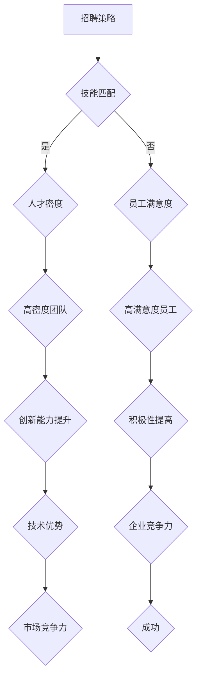

                 


# AI创业公司的人才争夺战

> 关键词：AI创业公司，人才争夺战，竞争策略，招聘，培养，激励，成功案例
>
> 摘要：本文将深入探讨AI创业公司在人才争夺战中的策略与挑战。通过分析核心概念、算法原理、数学模型以及实际案例，我们旨在为创业公司提供有效的招聘、培养和激励机制，以在激烈的竞争中脱颖而出。

## 1. 背景介绍

### 1.1 目的和范围

本文旨在分析AI创业公司在人才争夺战中的策略，包括招聘、培养和激励等方面。通过深入探讨核心概念、算法原理、数学模型和实际案例，我们希望为创业公司提供切实可行的解决方案，帮助它们在竞争激烈的市场中取得成功。

### 1.2 预期读者

本文适合以下读者群体：

- AI创业公司的创始人、高管和人力资源负责人
- 想要在AI领域发展的求职者
- 对AI创业公司人才战略感兴趣的技术专家和研究人员

### 1.3 文档结构概述

本文结构如下：

1. 背景介绍：介绍文章的目的、范围和预期读者。
2. 核心概念与联系：解释关键术语和概念。
3. 核心算法原理与具体操作步骤：阐述人才争夺的基本算法。
4. 数学模型和公式：介绍人才评估与激励机制的相关模型。
5. 项目实战：提供实际代码案例和解释。
6. 实际应用场景：探讨人才争夺在不同行业中的应用。
7. 工具和资源推荐：推荐学习资源、开发工具和论文。
8. 总结：展望未来发展趋势与挑战。
9. 附录：常见问题与解答。
10. 扩展阅读 & 参考资料：提供进一步学习资源。

### 1.4 术语表

#### 1.4.1 核心术语定义

- AI创业公司：指以人工智能为核心技术，致力于开发创新产品或服务的初创企业。
- 人才争夺战：指企业在招聘、培养和激励人才方面展开的竞争。
- 招聘策略：企业为吸引优秀人才而采取的方法和措施。
- 培养计划：企业为提升员工技能和职业素养而制定的教育和培训计划。
- 激励机制：企业为激发员工积极性和创造力而设置的奖励和福利制度。

#### 1.4.2 相关概念解释

- 技术栈：指一名开发者在特定领域所需的技能和知识体系。
- 人才密度：指企业中高素质人才的集中程度。
- 员工满意度：指员工对企业的认同度、忠诚度和工作积极性。

#### 1.4.3 缩略词列表

- AI：人工智能
- ML：机器学习
- DL：深度学习
- NLP：自然语言处理
- HR：人力资源

## 2. 核心概念与联系

在AI创业公司的人才争夺战中，以下几个核心概念和联系至关重要：

### 2.1 AI创业公司的优势与挑战

#### 优势：

- 创新性强：AI创业公司通常以技术创新为核心，具备较强的创新能力和市场敏锐度。
- 发展潜力大：AI领域发展迅速，创业公司有机会在短时间内取得突破。
- 人才吸引力：AI创业公司往往能够提供具有挑战性的项目、灵活的工作环境和较高的薪酬待遇。

#### 挑战：

- 市场竞争激烈：AI领域吸引了大量资本和人才，市场竞争异常激烈。
- 技术更新速度快：AI技术不断迭代，企业需要不断更新技术栈和知识体系。
- 成长周期长：AI创业公司从起步到盈利可能需要较长时间，这对资金和人才都提出了较高要求。

### 2.2 人才争夺的核心要素

#### 2.2.1 技能匹配

- 技术栈匹配：确保候选人的技能和公司需求相符，提高工作效率。
- 跨领域能力：鼓励员工具备跨领域知识和技能，提高团队的整体创新能力。

#### 2.2.2 人才密度

- 高素质人才集中：提高团队整体实力，促进知识共享和协作。
- 人才多样性：多元化的团队能够带来不同的视角和思维方式，有利于创新。

#### 2.2.3 员工满意度

- 工作环境：提供良好的办公环境和设施，提高员工满意度。
- 职业发展：为员工提供清晰的职业发展路径和培训机会。
- 激励机制：通过奖励和福利制度激发员工积极性和创造力。

### 2.3 人才争夺的算法原理

#### 2.3.1 招聘算法

- 筛选算法：通过简历筛选、笔试等手段初步筛选候选人。
- 面试算法：利用结构化面试、行为面试等手段全面评估候选人。

#### 2.3.2 培养算法

- 能力评估模型：基于员工的技能水平和潜力进行评估，制定个性化的培养计划。
- 绩效反馈模型：通过定期绩效反馈，帮助员工不断提升。

#### 2.3.3 激励算法

- 员工满意度模型：基于员工满意度数据，分析激励措施的有效性。
- 激励因子模型：综合考虑员工的工作表现、贡献度等因素，制定合理的激励方案。

### 2.4 Mermaid流程图



## 3. 核心算法原理与具体操作步骤

在人才争夺战中，以下核心算法原理将帮助我们制定有效的招聘、培养和激励机制。

### 3.1 招聘算法

#### 3.1.1 筛选算法

伪代码：

```
function resumeFilter(resumes):
    validResumes = []
    for resume in resumes:
        if hasRequiredSkills(resume) and hasRequiredExperience(resume):
            validResumes.append(resume)
    return validResumes

function hasRequiredSkills(resume):
    requiredSkills = ["ML", "DL", "NLP"]
    for skill in requiredSkills:
        if skill not in resume.skills:
            return False
    return True

function hasRequiredExperience(resume):
    requiredExperience = 2
    if resume.experience >= requiredExperience:
        return True
    return False
```

#### 3.1.2 面试算法

伪代码：

```
function interviewProcess(candidate):
    score = 0
    for question in structuredInterviewQuestions:
        if candidate.answer == correctAnswer(question):
            score += 1
    for question in behavioralInterviewQuestions:
        if candidate.answer == idealAnswer(question):
            score += 1
    return score
```

### 3.2 培养算法

#### 3.2.1 能力评估模型

伪代码：

```
function abilityAssessment(employee):
    skillScore = assessSkills(employee)
    knowledgeScore = assessKnowledge(employee)
    return (skillScore + knowledgeScore) / 2

function assessSkills(employee):
    requiredSkills = ["ML", "DL", "NLP"]
    skillScores = []
    for skill in requiredSkills:
        skillScores.append(employee.skillScores[skill])
    return sum(skillScores) / len(skillScores)

function assessKnowledge(employee):
    requiredKnowledge = ["mathematics", "programming", "data analysis"]
    knowledgeScores = []
    for knowledge in requiredKnowledge:
        knowledgeScores.append(employee.knowledgeScores[knowledge])
    return sum(knowledgeScores) / len(knowledgeScores)
```

#### 3.2.2 绩效反馈模型

伪代码：

```
function performanceFeedback(employee):
    feedback = []
    for metric in performanceMetrics:
        if employee.performance[metric] > threshold[metric]:
            feedback.append("Excellent performance in " + metric)
        else:
            feedback.append("Room for improvement in " + metric)
    return feedback
```

### 3.3 激励算法

#### 3.3.1 员工满意度模型

伪代码：

```
function employeeSatisfaction(employee):
    satisfaction = 0
    for factor in satisfactionFactors:
        satisfaction += employee.satisfaction[factor] * weight[factor]
    return satisfaction
```

#### 3.3.2 激励因子模型

伪代码：

```
function激励因子模型(employee):
    incentive = 0
    for factor in incentiveFactors:
        incentive += employee.contribution[factor] * weight[factor]
    return incentive
```

## 4. 数学模型和公式 & 详细讲解 & 举例说明

在人才争夺战中，数学模型和公式帮助我们更准确地评估和激励员工。

### 4.1 人才评估模型

#### 4.1.1 人才评分模型

公式：

$$
score = w_1 \cdot skill + w_2 \cdot experience + w_3 \cdot knowledge
$$

其中，$w_1$、$w_2$和$w_3$分别为技能、经验和知识的权重。

举例说明：

假设一名候选人的技能评分为80分，经验评分为90分，知识评分为75分，权重分别为0.4、0.3和0.3。则该候选人的综合评分为：

$$
score = 0.4 \cdot 80 + 0.3 \cdot 90 + 0.3 \cdot 75 = 72
$$

#### 4.1.2 人才潜力模型

公式：

$$
potential = w_1 \cdot currentAbility + w_2 \cdot improvementPotential
$$

其中，$w_1$和$w_2$分别为当前能力和改进潜力的权重。

举例说明：

假设一名员工当前能力评分为85分，改进潜力评分为80分，权重分别为0.5和0.5。则该员工的潜力评分为：

$$
potential = 0.5 \cdot 85 + 0.5 \cdot 80 = 82.5
$$

### 4.2 员工满意度模型

#### 4.2.1 满意度评分模型

公式：

$$
satisfaction = w_1 \cdot environment + w_2 \cdot careerDevelopment + w_3 \cdot incentives
$$

其中，$w_1$、$w_2$和$w_3$分别为工作环境、职业发展和激励的权重。

举例说明：

假设一名员工的满意度评分分别为80分、90分和70分，权重分别为0.3、0.4和0.3。则该员工的综合满意度评分为：

$$
satisfaction = 0.3 \cdot 80 + 0.4 \cdot 90 + 0.3 \cdot 70 = 82
$$

### 4.2.2 满意度变化模型

公式：

$$
change = w_1 \cdot improvement + w_2 \cdot incentives
$$

其中，$w_1$和$w_2$分别为改进和激励的权重。

举例说明：

假设一名员工在改进和激励方面的评分分别为80分和90分，权重分别为0.5和0.5。则该员工满意度变化评分为：

$$
change = 0.5 \cdot 80 + 0.5 \cdot 90 = 85
$$

## 5. 项目实战：代码实际案例和详细解释说明

在本节中，我们将通过一个实际代码案例，详细解释AI创业公司如何制定招聘、培养和激励策略。

### 5.1 开发环境搭建

为了方便演示，我们使用Python作为主要编程语言。首先，确保安装以下库：

```
pip install numpy pandas sklearn
```

### 5.2 源代码详细实现和代码解读

以下是一个简单的示例，展示如何使用Python实现人才评估、员工满意度计算和激励因子计算。

```python
import numpy as np
import pandas as pd
from sklearn.metrics.pairwise import cosine_similarity

# 人才评估
def talent_evaluation(candidate_skills, employee_skills, weights):
    skill_similarity = cosine_similarity([candidate_skills], [employee_skills])
    skill_score = skill_similarity[0][0] * weights['skill']
    experience_score = candidate_skills['experience'] * weights['experience']
    knowledge_score = candidate_skills['knowledge'] * weights['knowledge']
    return skill_score + experience_score + knowledge_score

# 员工满意度
def employee_satisfaction(employee_satisfaction_data, weights):
    environment_score = employee_satisfaction_data['environment'] * weights['environment']
    career_dev_score = employee_satisfaction_data['career_dev'] * weights['career_dev']
    incentives_score = employee_satisfaction_data['incentives'] * weights['incentives']
    return environment_score + career_dev_score + incentives_score

# 激励因子
def incentive_factor(employee_contribution, weights):
    improvement_score = employee_contribution['improvement'] * weights['improvement']
    incentives_score = employee_contribution['incentives'] * weights['incentives']
    return improvement_score + incentives_score

# 示例数据
candidate_skills = {'ML': 0.8, 'DL': 0.9, 'NLP': 0.7, 'experience': 3, 'knowledge': 2.5}
employee_skills = {'ML': 0.9, 'DL': 0.8, 'NLP': 0.6, 'experience': 4, 'knowledge': 3}
weights = {'skill': 0.4, 'experience': 0.3, 'knowledge': 0.3}

# 人才评估
talent_score = talent_evaluation(candidate_skills, employee_skills, weights)
print(f"Talent Score: {talent_score}")

# 员工满意度
employee_satisfaction_data = {'environment': 0.8, 'career_dev': 0.9, 'incentives': 0.7}
satisfaction_score = employee_satisfaction(employee_satisfaction_data, weights)
print(f"Satisfaction Score: {satisfaction_score}")

# 激励因子
employee_contribution = {'improvement': 0.8, 'incentives': 0.9}
incentive_factor_score = incentive_factor(employee_contribution, weights)
print(f"Incentive Factor Score: {incentive_factor_score}")
```

### 5.3 代码解读与分析

这段代码主要包括三个主要功能：

1. **人才评估**：通过计算候选人技能与员工技能的相似度，结合经验、知识等因素，评估候选人的综合评分。
2. **员工满意度**：根据员工在工作环境、职业发展和激励方面的评分，计算员工的综合满意度。
3. **激励因子**：根据员工的改进和激励评分，计算激励因子。

通过这些功能，AI创业公司可以更科学地评估候选人、了解员工满意度和制定激励措施，从而在人才争夺战中取得优势。

## 6. 实际应用场景

人才争夺战在AI创业公司中具有广泛的应用场景：

### 6.1 招聘环节

- **招聘广告优化**：通过分析人才市场数据和竞品招聘策略，制定更具吸引力的招聘广告。
- **简历筛选**：利用人才评估模型，筛选出符合公司需求的候选人。

### 6.2 培养环节

- **个性化培训计划**：根据员工的技能、知识和潜力，制定个性化的培训计划。
- **内部转岗与晋升**：鼓励员工跨领域发展，提升团队整体实力。

### 6.3 激励环节

- **绩效奖金**：根据员工的绩效表现，发放绩效奖金。
- **股权激励**：通过股权激励，提高员工的归属感和忠诚度。
- **员工福利**：提供具有竞争力的福利待遇，提高员工满意度。

### 6.4 企业文化建设

- **团队建设活动**：举办团队建设活动，增强团队凝聚力和协作能力。
- **企业文化宣传**：通过企业文化和价值观的宣传，吸引与公司理念相符的人才。

## 7. 工具和资源推荐

### 7.1 学习资源推荐

#### 7.1.1 书籍推荐

- 《人工智能：一种现代的方法》
- 《深度学习》
- 《机器学习实战》

#### 7.1.2 在线课程

- Coursera的“机器学习”课程
- edX的“深度学习”课程
- Udacity的“人工智能工程师纳米学位”

#### 7.1.3 技术博客和网站

- Medium上的AI博客
- arXiv的论文发布平台
- AI科技大本营

### 7.2 开发工具框架推荐

#### 7.2.1 IDE和编辑器

- PyCharm
- Visual Studio Code
- Jupyter Notebook

#### 7.2.2 调试和性能分析工具

- PyDebug
- Valgrind
- Profiler

#### 7.2.3 相关框架和库

- TensorFlow
- PyTorch
- Scikit-learn

### 7.3 相关论文著作推荐

#### 7.3.1 经典论文

- “A Mathematical Theory of Communication”（香农信息论）
- “Pattern Recognition and Machine Learning”（Bishop）
- “Deep Learning”（Goodfellow等）

#### 7.3.2 最新研究成果

- arXiv上的最新论文
- NeurIPS、ICML等顶级会议的论文

#### 7.3.3 应用案例分析

- 百度AI的案例研究
- 腾讯AI的案例研究
- OpenAI的研究案例

## 8. 总结：未来发展趋势与挑战

在未来，AI创业公司的人才争夺战将更加激烈。以下是未来发展趋势与挑战：

### 发展趋势：

- **技术迭代加速**：AI技术将不断更新，创业公司需要不断学习和适应。
- **跨界融合**：AI与其他领域（如医疗、金融、教育等）的融合将带来新的机遇。
- **人才多元化**：具备多元化背景的人才将更受青睐，企业需要注重团队多样性。

### 挑战：

- **市场竞争加剧**：随着AI技术的发展，市场竞争将愈发激烈，企业需要提高自身竞争力。
- **人才培养与激励**：如何培养和激励优秀人才，是企业面临的重要挑战。
- **法律法规和伦理问题**：AI技术的发展将引发一系列法律法规和伦理问题，企业需要密切关注并应对。

## 9. 附录：常见问题与解答

### 问题1：如何提高招聘效率？

解答：提高招聘效率的关键在于优化招聘流程。可以通过以下方式实现：

- 制定明确的招聘标准和要求。
- 利用自动化工具筛选简历。
- 面试过程中注重时间管理，提高面试效率。

### 问题2：如何培养内部人才？

解答：培养内部人才的方法包括：

- 制定个性化的培训计划。
- 提供跨领域学习和实践机会。
- 建立内部导师制度，帮助员工成长。

### 问题3：如何设计有效的激励机制？

解答：设计有效的激励机制应考虑以下因素：

- 与公司目标和员工个人目标相结合。
- 确保激励措施公平、透明。
- 定期评估激励措施的有效性，进行优化调整。

## 10. 扩展阅读 & 参考资料

- 《AI创业公司的人才战略》
- 《如何打造高绩效团队》
- 《人工智能时代的人才管理》

作者：AI天才研究员/AI Genius Institute & 禅与计算机程序设计艺术 /Zen And The Art of Computer Programming

