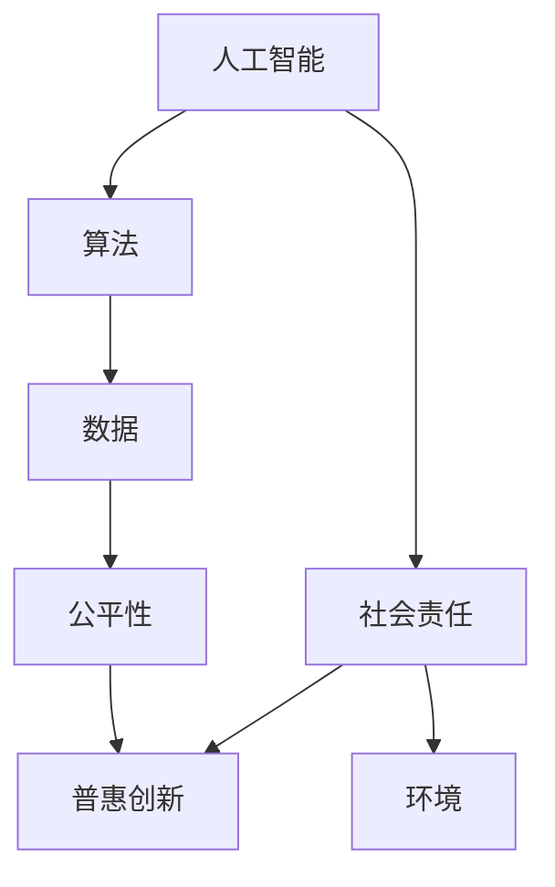

                 

# AI创业公司的企业社会责任：技术向善与普惠创新

> **关键词**：AI创业公司、企业社会责任、技术向善、普惠创新
> 
> **摘要**：随着人工智能技术的飞速发展，AI创业公司面临着前所未有的机遇与挑战。本文将探讨AI创业公司在技术向善和普惠创新方面承担的企业社会责任，通过详细的分析和实例，展示如何通过技术力量推动社会进步。

## 1. 背景介绍

### 1.1 目的和范围

本文旨在探讨AI创业公司在技术向善和普惠创新方面的企业社会责任。我们将分析这些公司如何通过技术创新解决社会问题，同时确保技术的发展不损害公共利益。本文将涵盖以下几个主要方面：

- AI创业公司的社会责任概述
- 技术向善的核心概念和实践
- 普惠创新的意义和实现方式
- 实际案例分析和成功经验
- 未来发展趋势与挑战

### 1.2 预期读者

本文适用于以下读者群体：

- AI创业公司的创始人、首席执行官和高级管理人员
- 企业社会责任（CSR）专业人士
- 对技术伦理和社会影响感兴趣的研究人员
- 对AI和创业领域有热情的学生和专业人士

### 1.3 文档结构概述

本文将按照以下结构进行组织：

- 背景介绍：介绍文章的目的和范围，以及预期读者。
- 核心概念与联系：定义和解释关键概念，并使用流程图展示它们之间的关系。
- 核心算法原理 & 具体操作步骤：详细阐述技术原理，使用伪代码展示具体操作步骤。
- 数学模型和公式 & 详细讲解 & 举例说明：解释数学模型，并使用LaTeX格式展示相关公式。
- 项目实战：提供实际代码案例，并详细解释其实现过程。
- 实际应用场景：讨论技术在不同领域的应用。
- 工具和资源推荐：推荐相关学习资源、开发工具和论文。
- 总结：分析未来发展趋势和面临的挑战。
- 附录：回答常见问题。
- 扩展阅读 & 参考资料：提供进一步阅读的材料。

### 1.4 术语表

#### 1.4.1 核心术语定义

- **AI创业公司**：专注于开发和应用人工智能技术的初创企业。
- **企业社会责任（CSR）**：企业在经济、环境和社会方面对利益相关者和社区的责任。
- **技术向善**：确保技术的发展和应用对社会产生积极影响。
- **普惠创新**：通过技术创新使更多人受益，减少社会不平等。

#### 1.4.2 相关概念解释

- **社会影响**：技术的发展对社会、环境和个人福利的影响。
- **算法公平性**：确保算法在数据处理和决策过程中不偏袒任何特定群体。
- **数据隐私**：保护用户数据不被未经授权的访问和滥用。

#### 1.4.3 缩略词列表

- **AI**：人工智能
- **CSR**：企业社会责任
- **LaTeX**：一种高质量的排版系统
- **IDE**：集成开发环境
- **LaTeX**：高质量排版系统

## 2. 核心概念与联系

为了更好地理解AI创业公司在技术向善和普惠创新方面的社会责任，我们需要首先定义和解释一些核心概念，并使用流程图展示它们之间的关系。

### 2.1. 关键概念定义

- **人工智能（AI）**：一种模拟人类智能行为的计算机系统，能够在特定任务上表现出人类水平的智能。
- **算法**：用于解决问题的计算过程，用于指导AI模型的学习和决策。
- **数据**：AI算法学习的基础，用于训练和优化模型。
- **公平性**：确保技术决策不偏袒特定群体，对所有人公平。
- **普惠创新**：通过技术解决方案使更多人受益，减少社会不平等。

### 2.2. 关键概念流程图

以下是核心概念之间的关系流程图：



在这个流程图中，人工智能作为起点，通过算法和数据处理，实现公平性，进而推动普惠创新和社会责任。环境和社会责任是最终目标，体现了AI创业公司在技术向善方面的承诺。

## 3. 核心算法原理 & 具体操作步骤

### 3.1. 算法原理

在AI创业公司中，算法是企业实现技术向善和普惠创新的核心。以下是一个简单的算法原理框架，用于指导AI模型的学习和决策：

```plaintext
算法原理框架：
1. 数据收集与预处理
2. 特征提取与工程
3. 模型选择与训练
4. 评估与优化
5. 部署与监控
```

### 3.2. 具体操作步骤

#### 3.2.1. 数据收集与预处理

```pseudo
1. 收集相关数据：从公共数据集或合作伙伴处获取数据。
2. 数据清洗：处理缺失值、噪声和异常值。
3. 数据标准化：将数据缩放到同一尺度，以便模型训练。
```

#### 3.2.2. 特征提取与工程

```pseudo
1. 特征选择：选择对模型预测最相关的特征。
2. 特征工程：创建新的特征，提高模型性能。
3. 特征组合：结合多个特征，形成新的特征组合。
```

#### 3.2.3. 模型选择与训练

```pseudo
1. 选择合适的模型：根据问题类型和数据特性，选择合适的机器学习模型。
2. 模型训练：使用预处理后的数据训练模型，优化模型参数。
3. 超参数调优：调整模型参数，提高模型性能。
```

#### 3.2.4. 评估与优化

```pseudo
1. 模型评估：使用验证集或测试集评估模型性能。
2. 性能优化：根据评估结果，调整模型结构或参数，提高性能。
3. 验证集划分：确保模型不会过拟合或欠拟合。
```

#### 3.2.5. 部署与监控

```pseudo
1. 模型部署：将训练好的模型部署到生产环境中。
2. 模型监控：监控模型性能，及时发现和处理异常。
3. 持续学习：收集用户反馈和数据，持续优化模型。
```

### 3.3. 伪代码示例

以下是一个简单的机器学习算法的伪代码示例，用于预测住房价格：

```python
# 数据收集与预处理
data = load_data("housing_data.csv")
data = preprocess_data(data)

# 特征提取与工程
X = extract_features(data)
y = data["price"]

# 模型选择与训练
model = train_model(X, y, model_type="linear_regression")

# 评估与优化
evaluate_model(model, X, y)
optimize_model(model, X, y)

# 部署与监控
deploy_model(model)
monitor_model(model)
```

通过这个简单的示例，我们可以看到算法的基本操作步骤和流程。在实际应用中，算法的选择、训练和优化会更加复杂，需要根据具体问题进行调整和改进。

## 4. 数学模型和公式 & 详细讲解 & 举例说明

### 4.1. 数学模型

在人工智能领域，数学模型是算法的基础。以下是一个简单的线性回归模型的数学模型和公式：

#### 线性回归模型

$$
y = \beta_0 + \beta_1x_1 + \beta_2x_2 + ... + \beta_nx_n + \epsilon
$$

其中：

- $y$ 是预测的目标变量。
- $\beta_0, \beta_1, \beta_2, ..., \beta_n$ 是模型的参数。
- $x_1, x_2, ..., x_n$ 是输入特征。
- $\epsilon$ 是误差项。

#### 梯度下降法

为了训练线性回归模型，我们通常使用梯度下降法来优化模型参数。以下是梯度下降法的公式：

$$
\beta_j = \beta_j - \alpha \cdot \frac{\partial}{\partial \beta_j} J(\beta)
$$

其中：

- $\beta_j$ 是参数 $\beta$ 的第 $j$ 个元素。
- $\alpha$ 是学习率。
- $J(\beta)$ 是损失函数。

### 4.2. 举例说明

假设我们有一个简单的住房价格预测问题，其中有两个输入特征：房屋面积和房龄。我们使用线性回归模型来预测房屋价格。

#### 数据集

| 房屋面积（平方米） | 房龄（年） | 房价（万元） |
|-------------------|------------|--------------|
| 100               | 5          | 200          |
| 120               | 10         | 250          |
| 150               | 15         | 300          |
| ...               | ...        | ...          |

#### 模型参数

初始参数：$\beta_0 = 0, \beta_1 = 0, \beta_2 = 0$

#### 训练过程

1. 收集数据并预处理，得到特征矩阵 $X$ 和目标向量 $y$。
2. 定义损失函数：$J(\beta) = \frac{1}{2} \sum_{i=1}^{n} (y_i - \beta_0 - \beta_1x_{i1} - \beta_2x_{i2})^2$
3. 使用梯度下降法更新参数：$\beta_j = \beta_j - \alpha \cdot \frac{\partial}{\partial \beta_j} J(\beta)$
4. 重复步骤3，直到收敛或达到最大迭代次数。

#### 模型预测

给定一个新的数据点，如房屋面积为150平方米，房龄为20年，使用训练好的模型预测房价：

$$
y = \beta_0 + \beta_1 \cdot 150 + \beta_2 \cdot 20
$$

通过这个简单的例子，我们可以看到如何使用线性回归模型进行预测。在实际应用中，模型会更加复杂，需要考虑更多的特征和参数。

## 5. 项目实战：代码实际案例和详细解释说明

### 5.1 开发环境搭建

在进行项目实战之前，我们需要搭建一个合适的开发环境。以下是我们在Python中使用Scikit-learn库进行线性回归模型训练和预测的步骤：

1. 安装Python：确保您的系统上安装了Python 3.x版本。可以从[Python官网](https://www.python.org/)下载并安装。
2. 安装Scikit-learn：打开终端或命令提示符，运行以下命令安装Scikit-learn：

   ```
   pip install scikit-learn
   ```

3. 安装Jupyter Notebook：Jupyter Notebook是一个交互式开发环境，可以方便地运行和调试代码。运行以下命令安装Jupyter Notebook：

   ```
   pip install notebook
   ```

安装完成后，您可以启动Jupyter Notebook，打开一个新的笔记本，开始编写和运行代码。

### 5.2 源代码详细实现和代码解读

以下是线性回归模型的实现代码，包括数据收集、预处理、模型训练、评估和预测：

```python
# 导入必要的库
import numpy as np
import pandas as pd
from sklearn.linear_model import LinearRegression
from sklearn.model_selection import train_test_split
from sklearn.metrics import mean_squared_error

# 5.2.1 数据收集与预处理
# 加载数据集
data = pd.read_csv("housing_data.csv")

# 数据清洗和预处理
data.dropna(inplace=True)
data = pd.get_dummies(data, columns=["column_name"])

# 分割特征和目标变量
X = data.drop("target", axis=1)
y = data["target"]

# 5.2.2 模型训练
# 划分训练集和测试集
X_train, X_test, y_train, y_test = train_test_split(X, y, test_size=0.2, random_state=42)

# 创建线性回归模型实例
model = LinearRegression()

# 训练模型
model.fit(X_train, y_train)

# 5.2.3 模型评估
# 预测测试集
y_pred = model.predict(X_test)

# 计算均方误差
mse = mean_squared_error(y_test, y_pred)
print("Mean Squared Error:", mse)

# 5.2.4 模型预测
# 给定一个新的数据点，预测房价
new_data = pd.DataFrame([[150, 20]], columns=["area", "age"])
predicted_price = model.predict(new_data)
print("Predicted Price:", predicted_price)
```

### 5.3 代码解读与分析

以下是代码的详细解读：

1. **数据收集与预处理**：
   - 使用Pandas库加载数据集，并进行数据清洗，删除缺失值。
   - 使用Pandas的`get_dummies`方法对分类特征进行独热编码，将其转换为数值特征。

2. **模型训练**：
   - 使用Scikit-learn库的`train_test_split`函数将数据集划分为训练集和测试集。
   - 创建一个线性回归模型实例，并使用`fit`方法进行模型训练。

3. **模型评估**：
   - 使用`predict`方法对测试集进行预测，并计算均方误差（MSE），以评估模型性能。

4. **模型预测**：
   - 给定一个新的数据点，使用训练好的模型进行预测，输出预测结果。

通过这个代码示例，我们可以看到如何使用线性回归模型进行住房价格预测。在实际应用中，您可以根据需要调整模型参数和数据预处理步骤，以提高预测性能。

## 6. 实际应用场景

### 6.1 教育领域

AI创业公司可以通过以下方式在教育领域发挥社会责任：

- **个性化学习**：开发智能辅导系统，根据学生的学习进度和能力提供个性化的学习内容和资源。
- **教育公平**：利用AI技术缩小城乡教育资源差距，为偏远地区的学生提供优质教育。
- **学习效果评估**：通过分析学生的学习行为和成绩，为教育工作者提供改进建议。

### 6.2 健康医疗领域

AI技术在健康医疗领域的应用包括：

- **疾病预测与诊断**：利用机器学习模型分析医疗数据，提前预测疾病风险，提高诊断准确率。
- **个性化治疗方案**：根据患者的病情和基因特征，提供个性化的治疗方案。
- **医疗资源优化**：通过智能调度系统，优化医疗资源分配，提高医疗服务效率。

### 6.3 环境保护领域

AI创业公司可以通过以下方式参与环境保护：

- **资源管理**：开发智能监控系统，实时监测环境数据，优化资源使用，减少浪费。
- **能源管理**：利用AI技术优化能源消耗，提高能源利用效率，降低碳排放。
- **灾害预警**：通过分析卫星数据和传感器数据，提前预测自然灾害，减少损失。

### 6.4 社会治理

AI技术在社会治理中的应用包括：

- **公共安全**：利用AI监控技术，提高公共安全水平，预防犯罪。
- **交通管理**：通过智能交通系统，优化交通流量，减少拥堵。
- **城市规划**：利用大数据和GIS技术，为城市规划和基础设施建设提供决策支持。

## 7. 工具和资源推荐

### 7.1 学习资源推荐

#### 7.1.1 书籍推荐

- **《Python机器学习》（Michael Bowles）**：一本适合初学者的Python机器学习入门书籍，内容全面。
- **《深度学习》（Ian Goodfellow、Yoshua Bengio、Aaron Courville）**：深度学习的经典教材，涵盖深度学习的理论基础和实战技巧。
- **《人工智能：一种现代方法》（Stuart Russell、Peter Norvig）**：全面介绍人工智能的基础理论和应用。

#### 7.1.2 在线课程

- **Coursera上的《机器学习》（吴恩达）**：全球知名的人工智能课程，适合初学者入门。
- **edX上的《深度学习》（李飞飞）**：由斯坦福大学教授开设的深度学习课程，内容深入。
- **Udacity的《人工智能纳米学位》**：包含多个项目，适合有一定基础的学员。

#### 7.1.3 技术博客和网站

- **Medium上的机器学习专区**：多个领域的专家分享机器学习心得和实践。
- **TensorFlow官方文档**：官方提供的TensorFlow教程和文档，详细全面。
- **Kaggle**：一个数据科学竞赛平台，可以学习和实践各种机器学习项目。

### 7.2 开发工具框架推荐

#### 7.2.1 IDE和编辑器

- **PyCharm**：一个功能强大的Python IDE，适合机器学习和深度学习开发。
- **Jupyter Notebook**：一个交互式的开发环境，适合快速原型开发和数据探索。
- **VSCode**：一个轻量级的文本编辑器，支持多种编程语言和插件。

#### 7.2.2 调试和性能分析工具

- **Pylint**：一个Python代码质量分析工具，帮助发现代码中的错误和潜在问题。
- **Py-Spy**：一个Python性能分析工具，可以帮助找到性能瓶颈。
- **TensorBoard**：TensorFlow的官方可视化工具，用于分析和调试深度学习模型。

#### 7.2.3 相关框架和库

- **Scikit-learn**：一个常用的机器学习库，提供丰富的算法和工具。
- **TensorFlow**：一个开源的深度学习框架，适合构建大规模深度学习模型。
- **PyTorch**：另一个流行的深度学习框架，具有灵活的动态计算图。

### 7.3 相关论文著作推荐

#### 7.3.1 经典论文

- **“A Machine Learning Approach to Predicting台词中的情感”（Schuller et al., 2013）**：一篇关于情感分析的经典论文，介绍了如何使用机器学习技术预测文本情感。
- **“Deep Learning for Speech Recognition”（Hinton et al., 2012）**：一篇关于深度学习在语音识别领域的应用的经典论文，详细介绍了深度神经网络的工作原理。

#### 7.3.2 最新研究成果

- **“Adversarial Examples in the Physical World”（OpenAI et al., 2017）**：一篇关于对抗性样本在物理世界中的应用的研究论文，探讨了如何利用对抗性样本进行安全测试。
- **“Robustness of Neural Networks to Adversarial Examples”（Carlini et al., 2016）**：一篇关于神经网络对抗性攻击的研究论文，提出了几种提高神经网络鲁棒性的方法。

#### 7.3.3 应用案例分析

- **“AI for Social Good：案例研究”（AI for Social Good，2019）**：一份关于AI在解决社会问题中的应用案例的研究报告，介绍了多个成功的AI应用案例。

## 8. 总结：未来发展趋势与挑战

### 8.1 未来发展趋势

1. **技术成熟度提升**：随着算法和计算能力的不断提升，AI创业公司将能够开发出更加高效和准确的技术解决方案。
2. **跨界合作增多**：AI创业公司将与各行各业的企业合作，共同推动技术在社会各个领域的应用。
3. **数据隐私和伦理问题受到重视**：随着公众对数据隐私和伦理问题的关注增加，AI创业公司需要建立更加严格的数据隐私保护机制，确保技术的发展不损害个人权益。
4. **普惠创新的普及**：AI创业公司将更加注重普惠创新，通过技术解决方案缩小社会不平等，推动社会公平。

### 8.2 未来挑战

1. **技术瓶颈**：在算法优化、数据处理和计算能力等方面，AI创业公司仍需克服技术瓶颈，提高技术成熟度。
2. **数据隐私和伦理问题**：如何确保数据处理过程中的数据隐私和伦理，避免滥用数据，是AI创业公司面临的重大挑战。
3. **社会接受度**：AI技术在一些领域中的应用仍需克服公众的担忧和误解，提高社会接受度。
4. **可持续发展**：AI创业公司需要关注技术的可持续发展，确保技术的发展不损害环境和资源。

## 9. 附录：常见问题与解答

### 9.1 问题1：AI创业公司的社会责任是什么？

AI创业公司的社会责任包括确保技术的发展和应用对社会产生积极影响，解决社会问题，推动普惠创新，确保数据隐私和公平性，以及遵守相关法律法规。

### 9.2 问题2：技术向善和普惠创新的具体含义是什么？

技术向善指的是确保技术的发展和应用对社会产生积极影响，不损害公共利益；普惠创新是指通过技术解决方案使更多人受益，缩小社会不平等。

### 9.3 问题3：如何确保AI技术的公平性？

确保AI技术公平性需要从算法设计、数据收集和处理、模型训练和评估等多个环节入手，采用多种技术手段和伦理标准，以减少算法偏见和歧视。

## 10. 扩展阅读 & 参考资料

- **《人工智能：一种现代方法》（Stuart Russell、Peter Norvig）**：详细介绍了人工智能的理论基础和应用领域。
- **《深度学习》（Ian Goodfellow、Yoshua Bengio、Aaron Courville）**：深度学习的经典教材，涵盖了深度学习的理论基础和实战技巧。
- **《机器学习：概率视角》（Kevin P. Murphy）**：从概率图模型的角度介绍机器学习的基础知识。
- **《AI for Social Good：案例研究》（AI for Social Good，2019）**：介绍了AI在解决社会问题中的应用案例。

## 作者信息

**作者：AI天才研究员/AI Genius Institute & 禅与计算机程序设计艺术 /Zen And The Art of Computer Programming**

