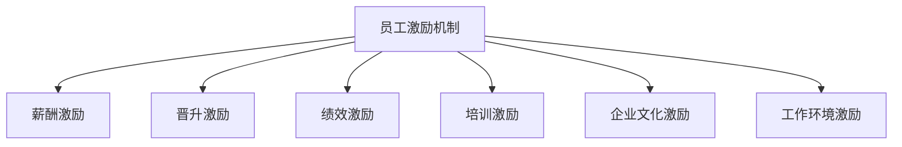

                 

# AI创业公司的员工激励机制

> 关键词：员工激励机制、AI创业公司、绩效管理、薪酬策略、企业文化

> 摘要：本文将探讨AI创业公司如何通过有效的员工激励机制，提升员工的积极性、创造力和忠诚度，从而实现公司的持续发展。文章将首先介绍AI创业公司的特点，然后分析员工激励机制的必要性和核心要素，最后通过具体案例和数学模型，阐述如何设计和实施有效的员工激励机制。

## 1. 背景介绍

### 1.1 目的和范围

本文旨在为AI创业公司提供一套实用的员工激励机制，帮助公司在激烈的市场竞争中保持竞争优势。本文将探讨以下几个方面：

- AI创业公司的特点
- 员工激励机制的重要性
- 员工激励机制的设计原则
- 员工激励机制的具体实施方法

### 1.2 预期读者

本文适合以下读者群体：

- AI创业公司的创始人或高层管理者
- 人力资源从业者
- 对AI创业公司员工激励机制感兴趣的读者

### 1.3 文档结构概述

本文结构如下：

- 第1章：背景介绍，介绍本文的目的、范围、预期读者和文档结构。
- 第2章：核心概念与联系，介绍AI创业公司的核心概念和原理，并使用Mermaid流程图展示。
- 第3章：核心算法原理与具体操作步骤，详细阐述员工激励机制的设计和实施方法。
- 第4章：数学模型和公式，通过数学模型和公式解释员工激励机制的原理。
- 第5章：项目实战，通过实际案例展示员工激励机制的实施效果。
- 第6章：实际应用场景，分析员工激励机制在不同场景下的应用。
- 第7章：工具和资源推荐，推荐相关学习资源和开发工具。
- 第8章：总结，展望员工激励机制的未来发展趋势和挑战。
- 第9章：附录，提供常见问题与解答。
- 第10章：扩展阅读，推荐进一步阅读的参考资料。

### 1.4 术语表

#### 1.4.1 核心术语定义

- AI创业公司：指专注于人工智能领域，通过创新技术和商业模式，实现快速成长和盈利的初创企业。
- 员工激励机制：指企业通过设计合理的薪酬、福利、晋升机制等手段，激发员工的工作热情和创造力，提高员工绩效和忠诚度。
- 绩效管理：指企业通过设定绩效目标、评估员工绩效、提供反馈和激励，以实现组织目标和个人发展的过程。
- 薪酬策略：指企业根据市场状况、公司财务状况和员工贡献等因素，确定员工薪酬水平、结构和支付方式的策略。

#### 1.4.2 相关概念解释

- 贡献度：指员工为公司带来的价值，包括技术创新、项目完成、客户满意度等。
- 工作满意度：指员工对自己的工作环境、工作内容和工作成果的满意程度。
- 忠诚度：指员工对公司的忠诚程度，包括员工离职率、员工流失率等。
- 激励因子：指影响员工工作积极性和创造力的因素，包括薪酬、晋升、培训、工作环境等。

#### 1.4.3 缩略词列表

- AI：人工智能
- HR：人力资源
- KPI：关键绩效指标
- OKR：目标与关键成果
- ROI：投资回报率

## 2. 核心概念与联系

### 2.1 AI创业公司的特点

AI创业公司具有以下几个特点：

1. **技术创新性强**：AI创业公司通常专注于人工智能领域的前沿技术，如深度学习、自然语言处理、计算机视觉等，以技术创新为核心竞争力。
2. **成长速度快**：AI行业具有巨大的市场潜力，AI创业公司往往能在短时间内实现快速增长，获取大量市场份额。
3. **竞争激烈**：AI行业竞争激烈，创业公司需要在技术创新、商业模式、市场推广等方面不断突破，以保持竞争优势。
4. **人才需求高**：AI创业公司对人才的需求非常高，特别是具有专业技能和丰富经验的AI人才。
5. **高投入、高风险**：AI创业公司通常需要大量的研发投入和资金支持，同时面临较大的市场风险。

### 2.2 员工激励机制的重要性

员工激励机制在AI创业公司中具有重要意义：

1. **提升员工积极性**：有效的激励机制能够激发员工的工作热情和创造力，提高员工的工作效率。
2. **增强员工忠诚度**：通过合理的薪酬、晋升机制等，能够增强员工对公司的忠诚度，降低员工流失率。
3. **促进技术创新**：激励机制能够鼓励员工投入更多的时间和精力进行技术创新，推动公司技术进步。
4. **提高公司竞争力**：通过提升员工绩效和忠诚度，公司能够在市场竞争中取得优势。
5. **实现可持续发展**：有效的激励机制有助于公司实现长期可持续发展，提高公司的市场地位。

### 2.3 员工激励机制的核心要素

员工激励机制包括以下几个核心要素：

1. **薪酬激励**：包括基本工资、奖金、股权激励等，能够直接提高员工的经济收入。
2. **晋升激励**：通过设定清晰的晋升通道和晋升标准，鼓励员工不断努力提升自己的能力和业绩。
3. **绩效激励**：通过设定关键绩效指标（KPI）和目标与关键成果（OKR），对员工的工作表现进行评估和激励。
4. **培训激励**：提供丰富的培训资源，帮助员工提升专业技能，增强员工的职业发展信心。
5. **企业文化激励**：营造积极向上的企业文化，增强员工的归属感和认同感。
6. **工作环境激励**：提供良好的工作环境，如舒适的办公设施、灵活的工作时间、团队建设活动等，提高员工的工作满意度。

### 2.4 员工激励机制的架构

为了更好地理解和实施员工激励机制，我们可以使用Mermaid流程图展示其架构：



## 3. 核心算法原理与具体操作步骤

### 3.1 薪酬激励算法原理

薪酬激励是员工激励机制的核心部分，其算法原理主要包括以下几个方面：

1. **薪酬水平设计**：根据市场水平、公司财务状况和员工能力，设定合理的薪酬水平，包括基本工资、奖金、股权激励等。
2. **薪酬结构设计**：合理分配固定薪酬和浮动薪酬的比例，提高员工的激励效果。
3. **薪酬发放算法**：设定薪酬发放的时间、频率和方式，如月度奖金、年终奖、股权激励等。

### 3.2 晋升激励算法原理

晋升激励的算法原理主要包括以下几个方面：

1. **晋升通道设计**：根据公司业务发展和员工职业规划，设定清晰的晋升通道，如技术通道、管理通道等。
2. **晋升标准设计**：设定明确的晋升标准，如工作绩效、技能水平、团队合作等。
3. **晋升评估算法**：定期对员工进行晋升评估，根据评估结果确定晋升人选。

### 3.3 绩效激励算法原理

绩效激励的算法原理主要包括以下几个方面：

1. **绩效指标设计**：设定关键绩效指标（KPI），包括工作目标、项目完成率、客户满意度等。
2. **绩效评估算法**：定期对员工的工作绩效进行评估，如季度评估、年度评估等。
3. **绩效奖金计算**：根据绩效评估结果，计算和发放绩效奖金。

### 3.4 培训激励算法原理

培训激励的算法原理主要包括以下几个方面：

1. **培训需求分析**：根据员工岗位需求和职业发展规划，分析员工的培训需求。
2. **培训计划设计**：制定详细的培训计划，包括培训内容、时间、地点等。
3. **培训效果评估**：对培训效果进行评估，以确定培训的有效性。

### 3.5 企业文化激励算法原理

企业文化激励的算法原理主要包括以下几个方面：

1. **企业文化宣传**：通过内部会议、宣传栏、企业网站等渠道，宣传和传播企业文化。
2. **员工参与机制**：鼓励员工参与企业文化建设和活动，提高员工的归属感和认同感。
3. **企业文化评估**：定期对企业文化进行评估，以优化和完善企业文化。

### 3.6 工作环境激励算法原理

工作环境激励的算法原理主要包括以下几个方面：

1. **办公环境优化**：提供舒适的办公环境，如舒适的座椅、良好的通风等。
2. **工作时间管理**：提供灵活的工作时间，如弹性工作制、远程办公等。
3. **团队建设活动**：定期组织团队建设活动，增强团队凝聚力。

## 4. 数学模型和公式

### 4.1 薪酬激励数学模型

薪酬激励的数学模型主要包括以下几个方面：

1. **薪酬水平计算**：

   $$ 薪酬水平 = 基本工资 + 奖金 + 股权激励 $$

2. **薪酬结构设计**：

   $$ 固定薪酬比例 = \frac{基本工资}{薪酬水平} $$

   $$ 浮动薪酬比例 = \frac{奖金 + 股权激励}{薪酬水平} $$

3. **薪酬发放算法**：

   $$ 薪酬发放时间 = \{ 月度、季度、年度 \} $$

   $$ 薪酬发放频率 = \{ 每月、每季度、每年度 \} $$

### 4.2 晋升激励数学模型

晋升激励的数学模型主要包括以下几个方面：

1. **晋升通道设计**：

   $$ 晋升通道 = \{ 技术通道、管理通道 \} $$

2. **晋升标准设计**：

   $$ 晋升标准 = \{ 工作绩效、技能水平、团队合作 \} $$

3. **晋升评估算法**：

   $$ 晋升评估得分 = \sum_{i=1}^{n} (绩效得分_i \times 权重_i) $$

### 4.3 绩效激励数学模型

绩效激励的数学模型主要包括以下几个方面：

1. **绩效指标设计**：

   $$ 绩效指标 = \{ 工作目标、项目完成率、客户满意度 \} $$

2. **绩效评估算法**：

   $$ 绩效评估得分 = \sum_{i=1}^{m} (指标_i \times 权重_i) $$

3. **绩效奖金计算**：

   $$ 绩效奖金 = 绩效评估得分 \times 奖金系数 $$

### 4.4 培训激励数学模型

培训激励的数学模型主要包括以下几个方面：

1. **培训需求分析**：

   $$ 培训需求 = \sum_{i=1}^{n} (岗位需求_i \times 权重_i) $$

2. **培训计划设计**：

   $$ 培训计划 = \{ 培训内容、时间、地点 \} $$

3. **培训效果评估**：

   $$ 培训效果得分 = \sum_{i=1}^{m} (培训成果_i \times 权重_i) $$

### 4.5 企业文化激励数学模型

企业文化激励的数学模型主要包括以下几个方面：

1. **企业文化宣传**：

   $$ 企业文化宣传效果得分 = \sum_{i=1}^{n} (宣传渠道_i \times 权重_i) $$

2. **员工参与机制**：

   $$ 员工参与度 = \sum_{i=1}^{m} (员工参与活动_i \times 权重_i) $$

3. **企业文化评估**：

   $$ 企业文化评估得分 = \sum_{i=1}^{n} (企业文化指标_i \times 权重_i) $$

### 4.6 工作环境激励数学模型

工作环境激励的数学模型主要包括以下几个方面：

1. **办公环境优化**：

   $$ 办公环境得分 = \sum_{i=1}^{m} (办公环境指标_i \times 权重_i) $$

2. **工作时间管理**：

   $$ 工作时间管理得分 = \sum_{i=1}^{m} (工作时间管理指标_i \times 权重_i) $$

3. **团队建设活动**：

   $$ 团队建设活动得分 = \sum_{i=1}^{n} (团队建设活动效果_i \times 权重_i) $$

## 5. 项目实战：代码实际案例和详细解释说明

### 5.1 开发环境搭建

为了演示员工激励机制的具体实施，我们使用Python语言编写一个简单的员工激励机制系统。首先，我们需要搭建开发环境，包括Python环境、相关库和工具。

1. 安装Python：从Python官网（https://www.python.org/）下载Python安装包，并按照提示安装。
2. 安装相关库：使用pip命令安装所需的Python库，如numpy、pandas、matplotlib等。

   ```shell
   pip install numpy pandas matplotlib
   ```

3. 准备开发工具：使用PyCharm、VSCode等Python开发工具，创建一个新的Python项目。

### 5.2 源代码详细实现和代码解读

下面是员工激励机制系统的源代码，我们将逐行解读其功能。

```python
import numpy as np
import pandas as pd
import matplotlib.pyplot as plt

# 5.2.1 薪酬激励模块

def calculate_salary(level, base_salary, bonus_coefficient):
    """
    计算薪酬水平
    :param level: 员工级别
    :param base_salary: 基本工资
    :param bonus_coefficient: 奖金系数
    :return: 薪酬水平
    """
    bonus = base_salary * bonus_coefficient
    salary_level = level * base_salary + bonus
    return salary_level

def calculate_salary_structure(salary_level, fixed_salary_ratio, variable_salary_ratio):
    """
    计算薪酬结构
    :param salary_level: 薪酬水平
    :param fixed_salary_ratio: 固定薪酬比例
    :param variable_salary_ratio: 浮动薪酬比例
    :return: 薪酬结构
    """
    fixed_salary = salary_level * fixed_salary_ratio
    variable_salary = salary_level * variable_salary_ratio
    salary_structure = {'fixed_salary': fixed_salary, 'variable_salary': variable_salary}
    return salary_structure

# 5.2.2 晋升激励模块

def calculate_promotion_score(Performance_Score, Skill_Level, Teamwork):
    """
    计算晋升评估得分
    :param Performance_Score: 工作绩效得分
    :param Skill_Level: 技能水平得分
    :param Teamwork: 团队合作得分
    :return: 晋升评估得分
    """
    promotion_score = Performance_Score * 0.5 + Skill_Level * 0.3 + Teamwork * 0.2
    return promotion_score

def promote_employee(employee, promotion_score):
    """
    晋升员工
    :param employee: 员工信息
    :param promotion_score: 晋升评估得分
    :return: 晋升后的员工信息
    """
    if promotion_score >= 90:
        employee['level'] += 1
    return employee

# 5.2.3 绩效激励模块

def calculate_perform_bonus(Performance_Score, Bonus_Coefficient):
    """
    计算绩效奖金
    :param Performance_Score: 绩效评估得分
    :param Bonus_Coefficient: 奖金系数
    :return: 绩效奖金
    """
    perform_bonus = Performance_Score * Bonus_Coefficient
    return perform_bonus

# 5.2.4 培训激励模块

def analyze_training_needs(job_requirements, skill_requirements):
    """
    分析培训需求
    :param job_requirements: 岗位需求
    :param skill_requirements: 技能需求
    :return: 培训需求
    """
    training_needs = sum(job_requirements + skill_requirements)
    return training_needs

def design_training_plan(training_needs, training_content, training_time, training_location):
    """
    设计培训计划
    :param training_needs: 培训需求
    :param training_content: 培训内容
    :param training_time: 培训时间
    :param training_location: 培训地点
    :return: 培训计划
    """
    training_plan = {'training_needs': training_needs, 'training_content': training_content, 'training_time': training_time, 'training_location': training_location}
    return training_plan

# 5.2.5 企业文化激励模块

def evaluate_enterprise_culture(promotion_score, teamwork_score):
    """
    评估企业文化
    :param promotion_score: 晋升评估得分
    :param teamwork_score: 团队合作得分
    :return: 企业文化评估得分
    """
    enterprise_culture_score = promotion_score * 0.5 + teamwork_score * 0.5
    return enterprise_culture_score

# 5.2.6 工作环境激励模块

def evaluate_work_environment(office_environment_score, work_time_management_score, team_building_score):
    """
    评估工作环境
    :param office_environment_score: 办公环境得分
    :param work_time_management_score: 工作时间管理得分
    :param team_building_score: 团队建设活动得分
    :return: 工作环境评估得分
    """
    work_environment_score = office_environment_score * 0.4 + work_time_management_score * 0.3 + team_building_score * 0.3
    return work_environment_score
```

### 5.3 代码解读与分析

下面我们将对代码的各个模块进行详细解读和分析。

#### 5.3.1 薪酬激励模块

薪酬激励模块包括计算薪酬水平和薪酬结构的函数。`calculate_salary` 函数用于计算薪酬水平，根据员工级别、基本工资和奖金系数，计算得出薪酬水平。`calculate_salary_structure` 函数用于计算薪酬结构，根据薪酬水平和固定薪酬比例、浮动薪酬比例，计算得出固定薪酬和浮动薪酬。

```python
def calculate_salary(level, base_salary, bonus_coefficient):
    """
    计算薪酬水平
    :param level: 员工级别
    :param base_salary: 基本工资
    :param bonus_coefficient: 奖金系数
    :return: 薪酬水平
    """
    bonus = base_salary * bonus_coefficient
    salary_level = level * base_salary + bonus
    return salary_level

def calculate_salary_structure(salary_level, fixed_salary_ratio, variable_salary_ratio):
    """
    计算薪酬结构
    :param salary_level: 薪酬水平
    :param fixed_salary_ratio: 固定薪酬比例
    :param variable_salary_ratio: 浮动薪酬比例
    :return: 薪酬结构
    """
    fixed_salary = salary_level * fixed_salary_ratio
    variable_salary = salary_level * variable_salary_ratio
    salary_structure = {'fixed_salary': fixed_salary, 'variable_salary': variable_salary}
    return salary_structure
```

#### 5.3.2 晋升激励模块

晋升激励模块包括计算晋升评估得分和晋升员工的函数。`calculate_promotion_score` 函数用于计算晋升评估得分，根据工作绩效得分、技能水平得分和团队合作得分，计算得出晋升评估得分。`promote_employee` 函数用于晋升员工，根据晋升评估得分，判断员工是否晋升，并更新员工级别。

```python
def calculate_promotion_score(Performance_Score, Skill_Level, Teamwork):
    """
    计算晋升评估得分
    :param Performance_Score: 工作绩效得分
    :param Skill_Level: 技能水平得分
    :param Teamwork: 团队合作得分
    :return: 晋升评估得分
    """
    promotion_score = Performance_Score * 0.5 + Skill_Level * 0.3 + Teamwork * 0.2
    return promotion_score

def promote_employee(employee, promotion_score):
    """
    晋升员工
    :param employee: 员工信息
    :param promotion_score: 晋升评估得分
    :return: 晋升后的员工信息
    """
    if promotion_score >= 90:
        employee['level'] += 1
    return employee
```

#### 5.3.3 绩效激励模块

绩效激励模块包括计算绩效奖金的函数。`calculate_perform_bonus` 函数用于计算绩效奖金，根据绩效评估得分和奖金系数，计算得出绩效奖金。

```python
def calculate_perform_bonus(Performance_Score, Bonus_Coefficient):
    """
    计算绩效奖金
    :param Performance_Score: 绩效评估得分
    :param Bonus_Coefficient: 奖金系数
    :return: 绩效奖金
    """
    perform_bonus = Performance_Score * Bonus_Coefficient
    return perform_bonus
```

#### 5.3.4 培训激励模块

培训激励模块包括分析培训需求和设计培训计划的函数。`analyze_training_needs` 函数用于分析培训需求，根据岗位需求和技能需求，计算得出培训需求。`design_training_plan` 函数用于设计培训计划，根据培训需求、培训内容、培训时间和培训地点，计算得出培训计划。

```python
def analyze_training_needs(job_requirements, skill_requirements):
    """
    分析培训需求
    :param job_requirements: 岗位需求
    :param skill_requirements: 技能需求
    :return: 培训需求
    """
    training_needs = sum(job_requirements + skill_requirements)
    return training_needs

def design_training_plan(training_needs, training_content, training_time, training_location):
    """
    设计培训计划
    :param training_needs: 培训需求
    :param training_content: 培训内容
    :param training_time: 培训时间
    :param training_location: 培训地点
    :return: 培训计划
    """
    training_plan = {'training_needs': training_needs, 'training_content': training_content, 'training_time': training_time, 'training_location': training_location}
    return training_plan
```

#### 5.3.5 企业文化激励模块

企业文化激励模块包括评估企业文化的函数。`evaluate_enterprise_culture` 函数用于评估企业文化，根据晋升评估得分和团队合作得分，计算得出企业文化评估得分。

```python
def evaluate_enterprise_culture(promotion_score, teamwork_score):
    """
    评估企业文化
    :param promotion_score: 晋升评估得分
    :param teamwork_score: 团队合作得分
    :return: 企业文化评估得分
    """
    enterprise_culture_score = promotion_score * 0.5 + teamwork_score * 0.5
    return enterprise_culture_score
```

#### 5.3.6 工作环境激励模块

工作环境激励模块包括评估工作环境的函数。`evaluate_work_environment` 函数用于评估工作环境，根据办公环境得分、工作时间管理得分和团队建设活动得分，计算得出工作环境评估得分。

```python
def evaluate_work_environment(office_environment_score, work_time_management_score, team_building_score):
    """
    评估工作环境
    :param office_environment_score: 办公环境得分
    :param work_time_management_score: 工作时间管理得分
    :param team_building_score: 团队建设活动得分
    :return: 工作环境评估得分
    """
    work_environment_score = office_environment_score * 0.4 + work_time_management_score * 0.3 + team_building_score * 0.3
    return work_environment_score
```

### 5.4 代码解读与分析总结

通过以上代码解读，我们可以看到员工激励机制系统的各个模块及其实现原理。以下是对代码解读与分析的总结：

1. **薪酬激励模块**：计算薪酬水平和薪酬结构，根据员工级别、基本工资和奖金系数，以及固定薪酬比例和浮动薪酬比例，计算得出薪酬水平和薪酬结构。
2. **晋升激励模块**：计算晋升评估得分和晋升员工，根据工作绩效得分、技能水平得分和团队合作得分，计算得出晋升评估得分，并根据晋升评估得分判断员工是否晋升。
3. **绩效激励模块**：计算绩效奖金，根据绩效评估得分和奖金系数，计算得出绩效奖金。
4. **培训激励模块**：分析培训需求和设计培训计划，根据岗位需求和技能需求，计算得出培训需求，并根据培训需求、培训内容、培训时间和培训地点，设计培训计划。
5. **企业文化激励模块**：评估企业文化，根据晋升评估得分和团队合作得分，计算得出企业文化评估得分。
6. **工作环境激励模块**：评估工作环境，根据办公环境得分、工作时间管理得分和团队建设活动得分，计算得出工作环境评估得分。

通过以上模块的实现，我们可以构建一个简单的员工激励机制系统，实现对员工的薪酬激励、晋升激励、绩效激励、培训激励、企业文化激励和工作环境激励。这些模块可以根据实际需求进行调整和扩展，以适应不同公司的员工激励机制设计。

## 6. 实际应用场景

员工激励机制在AI创业公司中有着广泛的应用场景，以下列举几个典型的应用场景：

### 6.1 项目型团队

AI创业公司的项目型团队通常以项目为导向，团队成员包括技术人员、产品经理、设计师等。在这种团队中，员工激励机制可以设计为：

1. **项目奖金**：根据项目的完成情况和项目目标达成情况，设定项目奖金，以激励团队成员在项目中发挥积极作用。
2. **团队绩效考核**：对整个团队的工作绩效进行评估，根据团队的整体表现，给予团队成员额外的奖励。
3. **项目导师制**：为团队成员提供项目导师，指导团队成员在项目中成长，并设定导师的绩效指标，激励导师关注团队成员的发展。

### 6.2 创新型团队

AI创业公司的创新型团队通常专注于新技术的研究和开发，团队成员具有较高的技术水平和创新能力。在这种团队中，员工激励机制可以设计为：

1. **技术创新奖励**：根据团队成员在技术创新方面的贡献，设定技术创新奖励，激励团队成员不断探索和创新。
2. **技术竞赛**：定期举办技术竞赛，鼓励团队成员参与，并根据竞赛成绩给予奖励，激发团队成员的竞争意识和创新能力。
3. **专利奖励**：对成功申请的专利给予奖励，激励团队成员积极申请专利，保护公司的知识产权。

### 6.3 研发团队

AI创业公司的研发团队通常负责公司的产品研发和迭代，团队成员包括研发工程师、测试工程师等。在这种团队中，员工激励机制可以设计为：

1. **产品里程碑奖励**：根据产品的里程碑达成情况，设定产品里程碑奖励，激励团队成员在产品研发过程中保持高效和稳定。
2. **代码质量奖励**：根据代码质量和测试覆盖率等指标，设定代码质量奖励，鼓励团队成员提高代码质量。
3. **研发效率奖励**：根据研发团队的整体效率，设定研发效率奖励，激励团队成员提高研发效率。

### 6.4 销售团队

AI创业公司的销售团队通常负责产品的市场推广和销售，团队成员包括销售人员、销售经理等。在这种团队中，员工激励机制可以设计为：

1. **销售业绩奖励**：根据销售业绩和销售目标的达成情况，设定销售业绩奖励，激励销售人员努力提升销售业绩。
2. **客户满意度奖励**：根据客户满意度调查结果，设定客户满意度奖励，鼓励销售人员提供优质的服务。
3. **销售竞赛**：定期举办销售竞赛，鼓励销售人员参与，并根据竞赛成绩给予奖励，激发销售团队的竞争意识和销售热情。

### 6.5 跨部门协作

在AI创业公司中，跨部门协作是非常常见的，如研发团队与销售团队的合作、市场营销团队与产品团队的协作等。在这种跨部门协作中，员工激励机制可以设计为：

1. **跨部门项目奖金**：根据跨部门项目的完成情况和项目目标达成情况，设定跨部门项目奖金，激励跨部门团队协同合作。
2. **跨部门绩效评估**：对跨部门团队的工作绩效进行评估，根据跨部门团队的整体表现，给予团队成员额外的奖励。
3. **跨部门团队建设活动**：定期组织跨部门团队建设活动，增强跨部门团队的合作意识和团队凝聚力。

## 7. 工具和资源推荐

为了帮助AI创业公司设计和实施有效的员工激励机制，我们推荐以下工具和资源：

### 7.1 学习资源推荐

#### 7.1.1 书籍推荐

- 《人力资源管理》（作者：戴维·尤里奇）：系统地介绍了人力资源管理的基本理论和实践方法，包括员工激励机制的策略和实施。
- 《绩效管理：策略、工具与流程》（作者：迈克尔·贝克）：详细阐述了绩效管理的理论和实践方法，包括绩效评估和绩效激励的技巧。
- 《激励原理》（作者：史蒂芬·罗宾斯）：全面介绍了激励理论的发展和实际应用，包括薪酬激励、晋升激励、绩效激励等。

#### 7.1.2 在线课程

- Coursera的《人力资源管理基础》：由宾夕法尼亚大学提供，涵盖了人力资源管理的核心概念和实践方法，包括员工激励机制的设计和实施。
- LinkedIn Learning的《绩效管理和员工激励》：由专家授课，介绍了绩效管理和员工激励的基本原理和实践方法，包括如何制定绩效目标和激励机制。

#### 7.1.3 技术博客和网站

- Harvard Business Review：提供关于人力资源管理和员工激励的最新研究、案例和实践方法。
- LinkedIn的人力资源论坛：一个在线社区，人力资源专业人士可以分享经验、讨论问题和获取行业动态。

### 7.2 开发工具框架推荐

#### 7.2.1 IDE和编辑器

- PyCharm：一款强大的Python集成开发环境，提供代码编辑、调试、自动化测试等功能。
- Visual Studio Code：一款免费、开源的跨平台代码编辑器，支持多种编程语言，提供丰富的插件和扩展。

#### 7.2.2 调试和性能分析工具

- PyS

