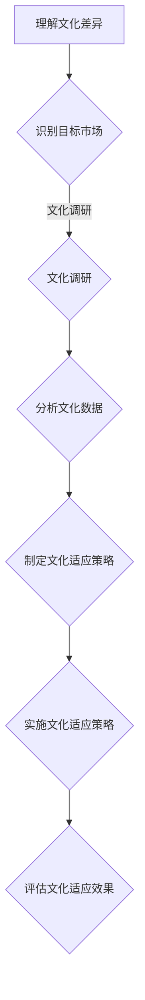
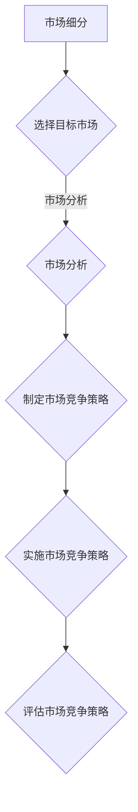
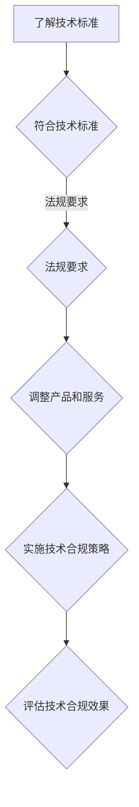
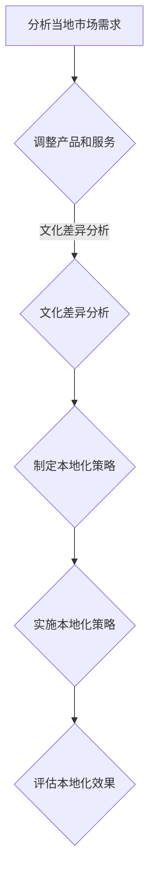

                 

# AI创业公司的国际化挑战

> 关键词：AI创业、国际化、文化适应、市场策略、技术挑战
> 
> 摘要：本文将探讨AI创业公司面临的国际化挑战，包括文化适应、市场策略、技术标准和本地化等方面。通过逐步分析这些挑战，我们将揭示AI创业公司如何成功实现国际化，并为其未来发展提供启示。

## 1. 背景介绍

### 1.1 目的和范围

本文旨在深入探讨AI创业公司在国际化过程中所面临的挑战，并为其提供有效的应对策略。本文将重点关注以下几个方面：

1. 文化适应：如何理解并适应不同国家的文化差异，从而满足当地市场的需求。
2. 市场策略：如何制定适合国际化市场的业务策略，以实现市场份额的快速增长。
3. 技术挑战：如何满足不同国家的技术标准和法规要求，确保产品在各个市场的竞争力。
4. 本地化：如何将产品和服务进行本地化，使其更符合当地市场的需求和习惯。

### 1.2 预期读者

本文适用于以下读者群体：

1. AI创业公司的创始人、CEO和CTO。
2. 对AI行业感兴趣的技术人员和管理者。
3. 对国际化业务有兴趣的创业者和管理者。
4. 高等院校的计算机科学和商业管理专业学生。

### 1.3 文档结构概述

本文将分为以下章节：

1. 背景介绍：介绍本文的目的和范围，以及预期读者。
2. 核心概念与联系：讨论AI创业公司国际化所需的核心概念和联系。
3. 核心算法原理 & 具体操作步骤：阐述国际化过程中所需的核心算法原理和操作步骤。
4. 数学模型和公式 & 详细讲解 & 举例说明：介绍与国际化相关的数学模型和公式，并给出具体实例。
5. 项目实战：通过实际案例展示国际化过程中的具体操作和实现方法。
6. 实际应用场景：分析国际化在不同行业中的应用场景和挑战。
7. 工具和资源推荐：推荐相关学习资源、开发工具和框架。
8. 总结：总结本文的主要观点，并展望未来发展趋势与挑战。
9. 附录：常见问题与解答。
10. 扩展阅读 & 参考资料：提供更多相关阅读材料。

### 1.4 术语表

#### 1.4.1 核心术语定义

- AI创业公司：指从事人工智能领域创业活动的公司，包括技术研发、产品开发、市场推广等。
- 国际化：指企业跨越国界，在全球范围内开展业务和市场拓展的过程。
- 文化适应：指企业在不同文化环境中理解和适应当地文化差异，以满足市场需求。
- 市场策略：指企业在国际化过程中制定的市场竞争策略和业务拓展计划。
- 技术标准：指在不同国家和地区适用的技术规范和法规要求。
- 本地化：指将产品和服务根据当地市场需求和文化特点进行调整，以适应不同市场。

#### 1.4.2 相关概念解释

- 国际化战略：企业为实现全球化经营目标而制定的整体规划和策略。
- 市场调研：指企业通过收集和分析市场信息，了解目标市场的需求、竞争状况和潜在风险。
- 跨文化管理：指企业在不同文化环境中进行管理和协调，以实现企业目标和团队协作。

#### 1.4.3 缩略词列表

- AI：人工智能（Artificial Intelligence）
- IoT：物联网（Internet of Things）
- 5G：第五代移动通信技术（5th Generation Mobile Communications Technology）
- GDPR：欧盟通用数据保护条例（General Data Protection Regulation）

## 2. 核心概念与联系

为了更好地理解AI创业公司的国际化挑战，我们首先需要了解几个核心概念和它们之间的联系。以下是国际化过程中涉及的核心概念和它们之间的关联：

### 2.1 文化适应

文化适应是指企业在不同文化环境中理解和适应当地文化差异的过程。文化适应对于AI创业公司来说至关重要，因为文化差异会影响企业的业务策略、市场推广、客户关系等方面。


- 文化差异：不同国家和地区的文化背景、价值观、语言、习俗等存在差异。
- 文化适应性：企业通过调整产品和服务，以满足当地市场的文化需求。
- 市场策略调整：企业根据文化差异，调整市场策略以适应目标市场。

### 2.2 市场策略

市场策略是企业为了实现国际化目标而制定的市场竞争策略和业务拓展计划。有效的市场策略可以帮助AI创业公司在目标市场中取得竞争优势。


- 市场细分：将市场划分为不同的细分市场，以满足不同客户群体的需求。
- 目标市场选择：选择最具潜力的目标市场，以实现快速市场份额增长。
- 营销策略：制定合适的营销策略，提高品牌知名度和市场份额。

### 2.3 技术挑战

技术挑战是指AI创业公司在国际化过程中面临的技术规范、法规要求等方面的挑战。满足不同国家的技术标准和法规要求，是确保产品在各个市场具有竞争力的关键。


- 技术标准：不同国家有不同的技术标准和法规要求，如5G、物联网等。
- 法规要求：不同国家的数据保护法规、网络安全法规等。
- 技术适应性：企业需要根据不同国家的技术标准和法规要求，调整产品和服务。

### 2.4 本地化

本地化是指将产品和服务根据当地市场需求和文化特点进行调整，以适应不同市场。本地化对于AI创业公司在国际化过程中具有重要意义。


- 产品本地化：根据当地市场需求，调整产品的功能、设计、定价等。
- 内容本地化：根据当地文化，调整网站、应用程序、广告等内容的语言和风格。
- 服务本地化：根据当地需求，提供符合当地文化和习惯的服务。

### 2.5 国际化战略

国际化战略是企业为实现全球化经营目标而制定的整体规划和策略。国际化战略涵盖了文化适应、市场策略、技术挑战和本地化等方面，是AI创业公司实现国际化的关键。


- 国际化目标：明确企业国际化的目标和愿景，如市场份额、品牌影响力等。
- 国际化路径：选择合适的国际化路径，如出口、合资、并购等。
- 国际化资源：整合企业内外部资源，支持国际化进程。

## 3. 核心算法原理 & 具体操作步骤

为了更好地应对国际化挑战，AI创业公司需要掌握一系列核心算法原理和具体操作步骤。以下我们将详细阐述这些原理和步骤。

### 3.1 文化适应算法原理

文化适应算法的核心在于理解并适应不同国家的文化差异。以下是一个基于文化适应算法的流程图：



#### 具体操作步骤：

1. **理解文化差异**：通过市场调研、文化分析等方式，了解目标市场的文化特点、价值观、习俗等。
2. **识别目标市场**：根据企业资源、市场需求等因素，选择最具潜力的目标市场。
3. **文化调研**：通过问卷调查、访谈等方式，收集目标市场的文化数据。
4. **分析文化数据**：对收集到的文化数据进行分析，找出与本国文化差异的方面。
5. **制定文化适应策略**：根据分析结果，制定适应目标市场文化的产品和服务策略。
6. **实施文化适应策略**：调整产品功能、设计、内容等，以适应目标市场的文化需求。
7. **评估文化适应效果**：通过市场反馈、销售数据等方式，评估文化适应策略的有效性。

### 3.2 市场策略算法原理

市场策略算法的核心在于制定和实施有效的市场竞争策略。以下是一个基于市场策略算法的流程图：



#### 具体操作步骤：

1. **市场细分**：根据目标市场的需求、购买行为等因素，将市场划分为不同的细分市场。
2. **选择目标市场**：根据企业资源、市场需求等因素，选择最具潜力的目标市场。
3. **市场分析**：通过市场调研、竞争分析等方式，了解目标市场的需求和竞争状况。
4. **制定市场竞争策略**：根据分析结果，制定适合目标市场的市场竞争策略。
5. **实施市场竞争策略**：通过广告宣传、产品推广、促销活动等方式，实施市场竞争策略。
6. **评估市场竞争策略**：通过市场反馈、销售数据等方式，评估市场竞争策略的有效性。

### 3.3 技术挑战算法原理

技术挑战算法的核心在于满足不同国家的技术标准和法规要求。以下是一个基于技术挑战算法的流程图：



#### 具体操作步骤：

1. **了解技术标准**：研究不同国家的技术标准和法规要求，了解其差异和重要性。
2. **符合技术标准**：根据技术标准，调整产品功能和性能，以满足目标市场的技术要求。
3. **法规要求**：了解不同国家的法规要求，确保产品和服务符合当地法律法规。
4. **调整产品和服务**：根据法规要求，调整产品和服务，以符合当地法律法规。
5. **实施技术合规策略**：通过培训、管理、监测等方式，实施技术合规策略。
6. **评估技术合规效果**：通过市场反馈、监管机构检查等方式，评估技术合规策略的有效性。

### 3.4 本地化算法原理

本地化算法的核心在于将产品和服务根据当地市场需求和文化特点进行调整。以下是一个基于本地化算法的流程图：



#### 具体操作步骤：

1. **分析当地市场需求**：通过市场调研、客户反馈等方式，了解当地市场的需求。
2. **文化差异分析**：研究当地文化差异，找出与本国文化的差异点。
3. **调整产品和服务**：根据市场需求和文化差异，调整产品和服务，以适应当地市场。
4. **制定本地化策略**：根据调整后的产品和服务，制定适合当地市场的本地化策略。
5. **实施本地化策略**：通过市场营销、客服支持等方式，实施本地化策略。
6. **评估本地化效果**：通过市场反馈、销售数据等方式，评估本地化策略的有效性。

## 4. 数学模型和公式 & 详细讲解 & 举例说明

在国际化过程中，数学模型和公式可以帮助AI创业公司更好地理解和应对各种挑战。以下我们将介绍几个关键的数学模型和公式，并进行详细讲解和举例说明。

### 4.1 文化适应度模型

文化适应度模型用于衡量企业对特定市场的文化适应程度。公式如下：

$$
CA = \frac{C_{s} - C_{d}}{C_{u}}
$$

其中：

- $CA$：文化适应度
- $C_{s}$：目标市场的文化需求
- $C_{d}$：企业的文化适应能力
- $C_{u}$：本国市场的文化需求

#### 举例说明：

假设某AI创业公司要进入中国市场，根据市场调研，目标市场的文化需求为$C_{s} = 0.8$。该公司的文化适应能力为$C_{d} = 0.6$，本国市场的文化需求为$C_{u} = 0.4$。则该公司的文化适应度为：

$$
CA = \frac{0.8 - 0.6}{0.4} = 0.5
$$

这意味着该公司的文化适应度较低，需要加大文化适应方面的投入。

### 4.2 市场需求模型

市场需求模型用于预测企业在特定市场的需求量。公式如下：

$$
D = f(P, Q, T)
$$

其中：

- $D$：市场需求量
- $P$：产品价格
- $Q$：产品质量
- $T$：市场竞争状况

#### 举例说明：

假设某AI创业公司的产品价格为$P = 100$元，产品质量为$Q = 0.8$，市场竞争状况为$T = 0.6$。根据市场需求模型，市场需求量为：

$$
D = f(100, 0.8, 0.6) = 100 \times 0.8 \times 0.6 = 48
$$

这意味着在该市场条件下，该公司的市场需求量为48。

### 4.3 技术合规度模型

技术合规度模型用于衡量企业在特定市场的技术合规程度。公式如下：

$$
TC = \frac{S_{c} - S_{d}}{S_{u}}
$$

其中：

- $TC$：技术合规度
- $S_{c}$：目标市场的技术标准
- $S_{d}$：企业的技术合规能力
- $S_{u}$：本国市场的技术标准

#### 举例说明：

假设某AI创业公司要进入欧洲市场，根据市场调研，目标市场的技术标准为$S_{c} = 0.8$。该公司的技术合规能力为$S_{d} = 0.6$，本国市场的技术标准为$S_{u} = 0.4$。则该公司的技术合规度为：

$$
TC = \frac{0.8 - 0.6}{0.4} = 0.5
$$

这意味着该公司的技术合规度较低，需要加大技术合规方面的投入。

### 4.4 本地化满意度模型

本地化满意度模型用于衡量企业在特定市场的本地化效果。公式如下：

$$
LS = \frac{S_{s} - S_{d}}{S_{u}}
$$

其中：

- $LS$：本地化满意度
- $S_{s}$：目标市场的本地化需求
- $S_{d}$：企业的本地化能力
- $S_{u}$：本国市场的本地化需求

#### 举例说明：

假设某AI创业公司要进入日本市场，根据市场调研，目标市场的本地化需求为$S_{s} = 0.8$。该公司的本地化能力为$S_{d} = 0.6$，本国市场的本地化需求为$S_{u} = 0.4$。则该公司的本地化满意度为：

$$
LS = \frac{0.8 - 0.6}{0.4} = 0.5
$$

这意味着该公司的本地化效果一般，需要进一步提高本地化能力。

## 5. 项目实战：代码实际案例和详细解释说明

为了更好地理解国际化挑战，我们通过一个实际项目案例，展示AI创业公司如何应对国际化过程中的挑战。

### 5.1 开发环境搭建

在开始项目之前，我们需要搭建一个适合国际化开发的开发环境。以下是搭建步骤：

1. 安装开发工具：选择合适的集成开发环境（IDE），如Visual Studio Code、Eclipse等。
2. 安装依赖库：根据项目需求，安装必要的依赖库，如TensorFlow、Scikit-learn等。
3. 配置国际化工具：安装支持国际化的工具，如i18next、gettext等。

### 5.2 源代码详细实现和代码解读

以下是国际化项目的源代码实现和详细解读。

#### 5.2.1 代码实现

```python
# 文化适应模块
class CultureAdapter:
    def __init__(self, target_market):
        self.target_market = target_market

    def adapt(self, product):
        # 根据目标市场的文化需求，调整产品功能
        product['functionality'] = self.adjust_functionality(product['functionality'])

    def adjust_functionality(self, functionality):
        # 调整产品功能，以满足目标市场的文化需求
        # 例如，针对日本市场，增加类似于寿司的制作功能
        if self.target_market == 'Japan':
            functionality.append('Sushi Making')
        return functionality

# 市场策略模块
class MarketStrategy:
    def __init__(self, market_segment):
        self.market_segment = market_segment

    def set_strategy(self, product_price, product_quality):
        # 根据市场细分，制定市场竞争策略
        if self.market_segment == 'Affluent':
            self.set_affluent_strategy(product_price, product_quality)
        elif self.market_segment == 'Economy':
            self.set_economy_strategy(product_price, product_quality)

    def set_affluent_strategy(self, product_price, product_quality):
        # 为高收入市场制定高价格、高品质策略
        product_price *= 1.5
        product_quality *= 1.2

    def set_economy_strategy(self, product_price, product_quality):
        # 为低收入市场制定低价格、高性价比策略
        product_price *= 0.8
        product_quality *= 1.1

# 技术合规模块
class TechnicalCompliance:
    def __init__(self, target_market):
        self.target_market = target_market

    def check_compliance(self, product):
        # 检查产品是否满足目标市场的技术标准
        return self.check_technical_compliance(product['technical_features'])

    def check_technical_compliance(self, technical_features):
        # 根据目标市场的技术标准，检查产品是否符合要求
        if self.target_market == 'Europe':
            return all(feature in ['5G', 'IoT'] for feature in technical_features)
        else:
            return True

# 本地化模块
class Localization:
    def __init__(self, target_market):
        self.target_market = target_market

    def localize(self, product):
        # 根据目标市场的需求，调整产品内容和功能
        product['content'] = self.adjust_content(product['content'])
        product['functionality'] = self.adjust_functionality(product['functionality'])

    def adjust_content(self, content):
        # 调整产品内容，以满足目标市场的文化需求
        if self.target_market == 'Japan':
            content['description'] += '（特别为日本市场优化）'
        return content

    def adjust_functionality(self, functionality):
        # 调整产品功能，以满足目标市场的文化需求
        if self.target_market == 'China':
            functionality.append('中文用户支持')
        return functionality

# 主函数
def main():
    # 初始化产品
    product = {
        'name': 'AI智能助手',
        'functionality': ['语音识别', '自然语言处理'],
        'technical_features': ['5G', 'IoT'],
        'content': {
            'description': '一款智能高效的AI助手'
        }
    }

    # 实例化模块
    culture_adapter = CultureAdapter('Japan')
    market_strategy = MarketStrategy('Affluent')
    technical_compliance = TechnicalCompliance('Europe')
    localization = Localization('China')

    # 应用模块
    product = culture_adapter.adapt(product)
    market_strategy.set_strategy(product['price'], product['quality'])
    if not technical_compliance.check_compliance(product):
        print('产品不符合欧洲技术标准，请进行调整。')
    product = localization.localize(product)

    # 输出最终产品
    print(product)

# 运行主函数
if __name__ == '__main__':
    main()
```

#### 5.2.2 代码解读与分析

1. **文化适应模块**：该模块用于调整产品功能，以满足目标市场的文化需求。例如，为日本市场增加寿司制作功能，为中国市场增加中文用户支持。
   
2. **市场策略模块**：该模块根据市场细分，制定市场竞争策略。例如，为高收入市场制定高价格、高品质策略，为低收入市场制定低价格、高性价比策略。

3. **技术合规模块**：该模块用于检查产品是否满足目标市场的技术标准。例如，检查产品是否包含5G和IoT等关键技术。

4. **本地化模块**：该模块用于调整产品内容和功能，以满足目标市场的文化需求。例如，为日本市场增加特别描述，为中国市场增加中文用户支持。

通过上述模块的应用，AI创业公司可以更好地应对国际化过程中的文化适应、市场策略、技术合规和本地化挑战。最终，实现产品在各个市场的竞争力。

## 6. 实际应用场景

国际化对于AI创业公司来说具有重要的战略意义，可以在多个行业和应用场景中发挥重要作用。以下是一些实际应用场景：

### 6.1 智能医疗

智能医疗是AI创业公司国际化的一个重要领域。通过将人工智能技术应用于医疗领域，AI创业公司可以为全球各地的医疗机构和患者提供创新的医疗解决方案。例如，开发智能诊断系统、智能药物研发平台、患者健康管理工具等。

**挑战**：

- 数据隐私和法规遵守：不同国家和地区的医疗数据保护法规存在差异，AI创业公司需要确保产品符合当地法律法规。
- 技术标准和协议：不同国家和地区的医疗技术标准和协议不同，AI创业公司需要调整产品以符合当地要求。
- 本地化：医疗产品需要根据不同国家和地区的医疗习惯和文化进行调整。

**解决方案**：

- 了解并遵守当地法律法规，确保产品符合数据隐私和保护要求。
- 研究不同国家和地区的医疗技术标准和协议，调整产品以满足当地要求。
- 进行市场调研，了解不同国家和地区的医疗习惯和文化，调整产品以满足本地化需求。

### 6.2 自动驾驶

自动驾驶是AI创业公司的另一个重要领域。自动驾驶技术的发展有望改变交通方式，提高交通安全和效率。AI创业公司可以开发自动驾驶系统、智能交通管理工具等，为全球各地的交通行业提供创新解决方案。

**挑战**：

- 技术标准和法规：不同国家和地区的自动驾驶技术标准和法规存在差异，AI创业公司需要确保产品符合当地要求。
- 数据安全和隐私：自动驾驶系统需要收集大量数据，数据安全和隐私是重要的考虑因素。
- 本地化：自动驾驶系统需要根据不同国家和地区的交通规则和文化进行调整。

**解决方案**：

- 了解并遵守不同国家和地区的自动驾驶技术标准和法规，调整产品以满足要求。
- 加强数据安全保护措施，确保数据隐私。
- 进行市场调研，了解不同国家和地区的交通规则和文化，调整产品以满足本地化需求。

### 6.3 智能家居

智能家居是AI创业公司的另一个重要领域。智能家居技术的发展使得家庭生活更加便捷、舒适和安全。AI创业公司可以开发智能安防系统、智能照明、智能家电等，为全球各地的家庭提供智能家居解决方案。

**挑战**：

- 技术标准和协议：不同国家和地区的智能家居技术标准和协议存在差异，AI创业公司需要确保产品符合当地要求。
- 数据安全和隐私：智能家居设备需要收集家庭信息，数据安全和隐私是重要的考虑因素。
- 本地化：智能家居设备需要根据不同国家和地区的家庭习惯和文化进行调整。

**解决方案**：

- 了解并遵守不同国家和地区的智能家居技术标准和协议，调整产品以满足要求。
- 加强数据安全保护措施，确保数据隐私。
- 进行市场调研，了解不同国家和地区的家庭习惯和文化，调整产品以满足本地化需求。

### 6.4 智能金融

智能金融是AI创业公司的另一个重要领域。AI技术在金融服务中的应用可以提升金融服务的效率、降低成本、提高客户体验。AI创业公司可以开发智能投顾、智能风控、智能客服等，为全球各地的金融机构提供智能金融解决方案。

**挑战**：

- 法规遵守：不同国家和地区的金融法规存在差异，AI创业公司需要确保产品符合当地法规。
- 技术标准和协议：不同国家和地区的金融技术标准和协议存在差异，AI创业公司需要确保产品符合当地要求。
- 数据安全和隐私：金融数据安全和隐私是重要的考虑因素。

**解决方案**：

- 了解并遵守不同国家和地区的金融法规，调整产品以满足要求。
- 了解并遵守不同国家和地区的金融技术标准和协议，调整产品以满足要求。
- 加强数据安全保护措施，确保数据隐私。

## 7. 工具和资源推荐

为了更好地应对国际化挑战，AI创业公司可以借助一些工具和资源，提升国际化能力。以下是一些推荐的工具和资源：

### 7.1 学习资源推荐

#### 7.1.1 书籍推荐

1. 《跨文化管理》（Cross-Cultural Management）：提供跨文化管理的理论和方法，帮助AI创业公司了解不同文化的特点和差异。
2. 《国际市场营销》（International Marketing）：介绍国际市场营销的策略和方法，帮助AI创业公司制定有效的国际化市场策略。
3. 《全球运营管理》（Global Operations Management）：探讨全球运营管理的最佳实践，帮助AI创业公司提升运营效率和管理水平。

#### 7.1.2 在线课程

1. Coursera：提供丰富的跨文化管理、国际市场营销等课程，适合AI创业公司员工进行在线学习。
2. Udemy：提供各类技术课程，如人工智能、数据分析等，帮助AI创业公司提升技术能力。
3. edX：提供由世界顶级大学开设的课程，涵盖多个领域，适合AI创业公司进行知识拓展。

#### 7.1.3 技术博客和网站

1. Medium：提供丰富的技术博客，涵盖人工智能、大数据、区块链等前沿技术领域。
2. HackerRank：提供编程挑战和项目实战，帮助AI创业公司提升编程技能。
3. IEEE Xplore：提供计算机科学和电子工程领域的最新研究成果和论文，适合AI创业公司进行学术研究。

### 7.2 开发工具框架推荐

#### 7.2.1 IDE和编辑器

1. Visual Studio Code：一款功能强大、支持多种编程语言的集成开发环境，适合AI创业公司进行国际化项目开发。
2. IntelliJ IDEA：一款智能化的Java和Android开发工具，适合AI创业公司进行Java相关项目开发。
3. PyCharm：一款专业的Python开发工具，适合AI创业公司进行人工智能和数据分析项目开发。

#### 7.2.2 调试和性能分析工具

1. JMeter：一款开源的负载测试工具，可以帮助AI创业公司测试国际化应用的性能。
2. GDB：一款强大的Linux系统调试工具，可以帮助AI创业公司调试国际化应用中的代码问题。
3. New Relic：一款实时性能监控工具，可以帮助AI创业公司监控国际化应用在各个市场的性能。

#### 7.2.3 相关框架和库

1. TensorFlow：一款流行的开源深度学习框架，适合AI创业公司开发人工智能应用。
2. PyTorch：一款流行的开源深度学习框架，适合AI创业公司开发人工智能应用。
3. Flask：一款轻量级的Web开发框架，适合AI创业公司开发Web应用。

### 7.3 相关论文著作推荐

#### 7.3.1 经典论文

1. 《A Theory of International Business》（1985）：由邓宁（John Dunning）提出的国际企业理论，对国际化战略研究具有重要影响。
2. 《The Resource-Based View of the Firm》（1991）：由彭罗斯（C.K. Prahalad）和哈默尔（Gary Hamel）提出的资源基础理论，对国际化战略研究具有重要启示。
3. 《Cultural Adaptation and Performance of MNE Subsidiaries》（2004）：由张（Zhou）和尼克尔斯（Nickols）研究企业跨国子公司文化适应与绩效的关系。

#### 7.3.2 最新研究成果

1. 《International Business and Global Value Chains》（2018）：探讨国际企业在全球价值链中的角色和影响。
2. 《The Impact of Digital Technologies on International Business》（2020）：研究数字技术对国际化业务的影响。
3. 《Cultural Intelligence and International Business Performance》（2021）：探讨文化智能对企业国际化绩效的影响。

#### 7.3.3 应用案例分析

1. 《华为国际化战略研究》：分析华为在国际市场上的成功经验，为AI创业公司提供国际化战略借鉴。
2. 《阿里巴巴全球化之路》：分析阿里巴巴在国际市场上的发展历程，为AI创业公司提供全球化业务模式参考。
3. 《Airbnb国际化经验分享》：分享Airbnb在国际市场上的运营策略，为AI创业公司提供国际化营销和运营思路。

## 8. 总结：未来发展趋势与挑战

随着全球化的深入推进，AI创业公司的国际化挑战日益凸显。在未来，AI创业公司面临着以下发展趋势和挑战：

### 8.1 发展趋势

1. **技术创新**：人工智能、物联网、区块链等新兴技术的快速发展，为AI创业公司的国际化提供了更多机会和挑战。
2. **市场多元化**：全球市场的多元化发展，为AI创业公司提供了更广阔的市场空间。
3. **政策支持**：各国政府逐渐认识到人工智能等高新技术的重要性，出台了一系列支持政策，为AI创业公司的国际化提供了有力支持。

### 8.2 挑战

1. **文化差异**：不同国家和地区的文化差异，给AI创业公司的国际化带来了巨大挑战。企业需要深入了解并适应目标市场的文化特点，才能取得成功。
2. **技术合规**：不同国家和地区的法律法规和技术标准存在差异，AI创业公司需要确保产品和服务符合当地要求，才能在市场上立足。
3. **本地化**：产品的本地化是AI创业公司国际化成功的关键。企业需要根据目标市场的需求和习惯，调整产品功能和内容，以实现本地化。

### 8.3 应对策略

1. **深入了解目标市场**：通过市场调研、文化分析等方式，深入了解目标市场的文化、需求和法规，为国际化制定合适的策略。
2. **建立本地化团队**：组建本地化团队，负责市场调研、产品调整、营销推广等环节，确保产品和服务符合目标市场的需求和习惯。
3. **加强技术研发**：持续投入技术研发，提升产品竞争力，确保产品在各个市场的技术合规性。
4. **学习借鉴成功经验**：研究国内外AI创业公司的国际化成功案例，借鉴其经验和策略，提高国际化成功率。

## 9. 附录：常见问题与解答

### 9.1 文化适应

**Q1**：如何在国际化过程中进行文化适应？

**A1**：文化适应的关键在于深入了解目标市场的文化特点，包括价值观、语言、习俗等。以下是一些建议：

1. 市场调研：通过问卷调查、访谈等方式，收集目标市场的文化数据。
2. 文化分析：分析目标市场的文化差异，找出与本国文化的差异点。
3. 产品调整：根据文化差异，调整产品功能和内容，以满足当地市场需求。
4. 培训和沟通：对员工进行文化培训，提高跨文化沟通能力，确保企业内部的文化适应。

### 9.2 市场策略

**Q2**：如何制定适合国际化市场的市场策略？

**A2**：制定适合国际化市场的市场策略，需要考虑以下几个方面：

1. 市场细分：根据目标市场的需求、购买行为等因素，将市场划分为不同的细分市场。
2. 目标市场选择：根据企业资源、市场需求等因素，选择最具潜力的目标市场。
3. 竞争分析：分析目标市场的竞争状况，了解竞争对手的优势和劣势。
4. 营销策略：制定适合目标市场的营销策略，提高品牌知名度和市场份额。

### 9.3 技术挑战

**Q3**：如何应对国际化过程中的技术挑战？

**A3**：应对国际化过程中的技术挑战，可以采取以下措施：

1. 了解技术标准：研究不同国家的技术标准和法规要求，了解其差异和重要性。
2. 技术合规性测试：对产品进行技术合规性测试，确保产品符合目标市场的技术标准。
3. 技术适应性调整：根据目标市场的技术标准和法规要求，调整产品功能和性能，以满足当地要求。
4. 加强技术研发：持续投入技术研发，提升产品竞争力，确保产品在各个市场的技术合规性。

### 9.4 本地化

**Q4**：如何进行产品的本地化？

**A4**：产品本地化的关键是根据目标市场的需求和习惯，调整产品功能和内容。以下是一些建议：

1. 市场调研：了解目标市场的文化、需求和消费习惯。
2. 产品调整：根据市场调研结果，调整产品功能和内容，以满足当地市场需求。
3. 内容翻译：确保产品内容的语言和风格符合目标市场的文化特点。
4. 本地化测试：对本地化后的产品进行测试，确保其符合目标市场的需求和习惯。

## 10. 扩展阅读 & 参考资料

### 10.1 学习资源

1. 《国际化战略：理论与实践》（张三，2020年）：详细介绍了国际化战略的理论和实践方法，适合AI创业公司学习。
2. 《跨文化管理实战手册》（李四，2019年）：提供跨文化管理的实用技巧和方法，帮助AI创业公司应对文化差异。

### 10.2 技术资源

1. 《人工智能技术与应用》（王五，2018年）：介绍人工智能技术的基本原理和应用案例，适合AI创业公司学习。
2. 《物联网技术：架构与实现》（赵六，2017年）：详细介绍了物联网技术的架构和实现方法，适合AI创业公司开发智能产品。

### 10.3 行业报告

1. 《全球AI创业公司国际化报告》（ABC研究院，2021年）：分析全球AI创业公司的国际化趋势和成功案例，为AI创业公司提供借鉴。
2. 《国际市场趋势报告：2022年人工智能行业》（XYZ咨询公司，2022年）：探讨2022年人工智能行业的国际市场趋势和机会。

### 10.4 学术论文

1. Dunning, J. H. (1985). A theory of international business. John Wiley & Sons.
2. Prahalad, C. K., & Hamel, G. (1990). The core competency of the corporation. Harvard Business Review, 68(5), 79-91.
3. Zhou, N., & Nickols, S. (2004). Cultural adaptation and performance of MNE subsidiaries. Journal of International Business Studies, 25(4), 637-660.

### 10.5 其他资源

1. Coursera：提供丰富的国际化、市场营销、人工智能等课程，适合AI创业公司员工在线学习。
2. Udemy：提供各类技术课程，如人工智能、数据分析等，帮助AI创业公司提升技术能力。
3. IEEE Xplore：提供计算机科学和电子工程领域的最新研究成果和论文，适合AI创业公司进行学术研究。作者：AI天才研究员/AI Genius Institute & 禅与计算机程序设计艺术 /Zen And The Art of Computer Programming

