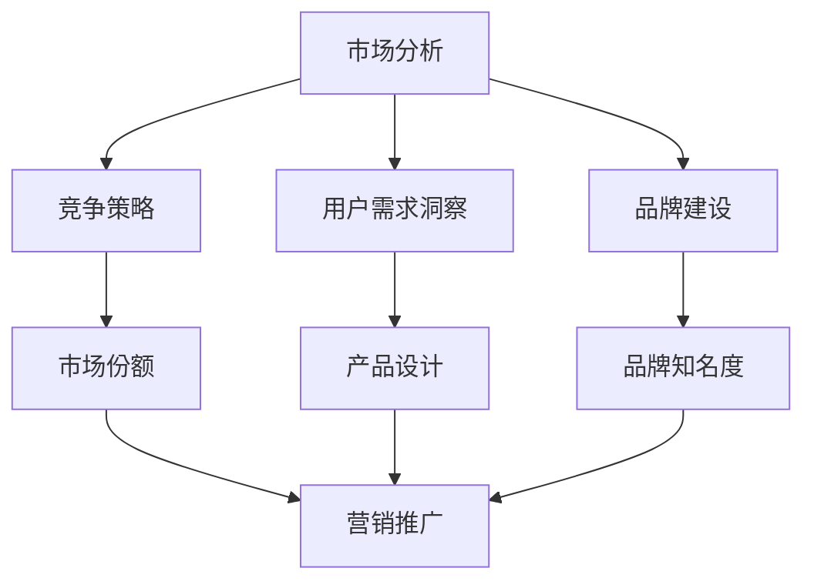

                 

# AI创业公司的市场策略

> 关键词：AI创业、市场策略、竞争分析、用户需求、品牌建设、营销推广、技术创新

> 摘要：本文将深入探讨AI创业公司在市场策略方面的关键要素，包括市场分析、竞争策略、用户需求洞察、品牌建设和营销推广等。通过详细的分析和案例分析，为AI创业公司提供一套完整的策略指南，以帮助它们在竞争激烈的市场中脱颖而出。

## 1. 背景介绍

### 1.1 目的和范围

本文旨在为AI创业公司提供一套全面的市场策略指南，帮助它们在竞争激烈的市场中找到立足点。我们将重点探讨以下主题：

- **市场分析**：了解目标市场、竞争对手和用户需求。
- **竞争策略**：制定有效的竞争策略，抢占市场份额。
- **用户需求洞察**：深入研究用户需求，提供定制化的解决方案。
- **品牌建设**：塑造品牌形象，提升品牌知名度。
- **营销推广**：运用多样化的营销手段，扩大用户群体。

### 1.2 预期读者

本文适用于以下人群：

- AI创业公司创始人或高层管理人员。
- 市场营销专业人士。
- 投资者。
- 对AI创业公司市场策略感兴趣的技术人员。

### 1.3 文档结构概述

本文结构如下：

- **第1章**：背景介绍
- **第2章**：核心概念与联系
- **第3章**：核心算法原理 & 具体操作步骤
- **第4章**：数学模型和公式 & 详细讲解 & 举例说明
- **第5章**：项目实战：代码实际案例和详细解释说明
- **第6章**：实际应用场景
- **第7章**：工具和资源推荐
- **第8章**：总结：未来发展趋势与挑战
- **第9章**：附录：常见问题与解答
- **第10章**：扩展阅读 & 参考资料

### 1.4 术语表

#### 1.4.1 核心术语定义

- **AI创业公司**：指以人工智能技术为核心，从事商业活动的初创公司。
- **市场分析**：通过对市场环境、竞争对手和用户需求的研究，为公司的战略决策提供依据。
- **竞争策略**：在市场竞争中采取的一系列手段，以获取市场份额。
- **用户需求洞察**：深入理解用户需求，为产品设计提供指导。
- **品牌建设**：塑造公司形象，提升品牌知名度。
- **营销推广**：通过各种渠道宣传产品，吸引潜在用户。

#### 1.4.2 相关概念解释

- **市场细分**：将整体市场划分为若干个具有相似需求的子市场。
- **目标市场**：公司所专注于服务的特定市场群体。
- **市场份额**：公司在目标市场中所占的比重。

#### 1.4.3 缩略词列表

- **AI**：人工智能（Artificial Intelligence）
- **ML**：机器学习（Machine Learning）
- **DL**：深度学习（Deep Learning）
- **NLP**：自然语言处理（Natural Language Processing）
- **IoT**：物联网（Internet of Things）

## 2. 核心概念与联系

在本文中，我们将讨论以下几个核心概念：

- **市场分析**：通过市场调研、数据分析和竞争分析，了解市场环境、用户需求和竞争对手。
- **竞争策略**：基于市场分析，制定针对性的竞争策略，以抢占市场份额。
- **用户需求洞察**：深入研究用户需求，为产品设计提供指导。
- **品牌建设**：通过塑造品牌形象，提升品牌知名度。
- **营销推广**：利用多样化的营销手段，扩大用户群体。

下面是一个简化的Mermaid流程图，用于描述这些概念之间的联系：



### 2.1 市场分析

市场分析是制定有效市场策略的基础。它包括以下几个方面：

- **市场调研**：通过问卷调查、访谈和数据分析，了解市场环境和用户需求。
- **竞争分析**：研究竞争对手的产品、优势和劣势，为公司提供决策依据。
- **市场细分**：将整体市场划分为具有相似需求的子市场，为针对性营销提供指导。

### 2.2 竞争策略

竞争策略是公司在市场中取得优势的关键。它包括以下几个方面：

- **差异化战略**：通过独特的产品或服务，满足用户特定需求。
- **成本领先战略**：通过降低成本，提高产品竞争力。
- **集中战略**：专注于某一细分市场，提供定制化的解决方案。

### 2.3 用户需求洞察

用户需求洞察是产品设计的重要依据。它包括以下几个方面：

- **用户研究**：通过用户访谈、问卷调查和观察，了解用户需求和行为。
- **需求分析**：对收集到的用户数据进行整理和分析，识别主要需求和痛点。
- **用户画像**：基于用户需求和特征，构建用户画像，为产品设计提供参考。

### 2.4 品牌建设

品牌建设是提升公司形象和竞争力的重要手段。它包括以下几个方面：

- **品牌定位**：确定品牌在市场中的独特定位，满足用户特定需求。
- **品牌形象**：通过视觉设计、宣传口号和用户体验，塑造品牌形象。
- **品牌传播**：利用各种渠道，提升品牌知名度和美誉度。

### 2.5 营销推广

营销推广是扩大用户群体的关键。它包括以下几个方面：

- **线上营销**：通过搜索引擎优化、社交媒体营销和内容营销，吸引潜在用户。
- **线下营销**：通过展会、讲座和活动，提升品牌知名度和用户参与度。
- **渠道拓展**：通过合作伙伴和渠道商，扩大市场覆盖范围。

## 3. 核心算法原理 & 具体操作步骤

在AI创业公司的市场策略中，算法原理和具体操作步骤至关重要。以下是一个简化的市场策略算法原理和具体操作步骤的伪代码描述：

```python
# 市场策略算法原理 & 具体操作步骤

# 步骤1：市场分析
def market_analysis():
    data = collect_market_data()  # 收集市场数据
    market_environment = analyze_environment(data)  # 分析市场环境
    user需求 = analyze_user需求的特征和痛点（data）  # 分析用户需求
    competition = analyze_competition(data)  # 分析竞争对手

# 步骤2：竞争策略
def competitive_strategy(market_environment, competition):
    if competition.is_strong():
        strategy = cost_leadership_strategy()  # 成本领先战略
    else:
        strategy = differentiation_strategy()  # 差异化战略
    return strategy

# 步骤3：用户需求洞察
def user_demand_insight(user需求):
    user_personality = create_user_personality Portrait（user需求）  # 创建用户画像
    user_experience = design_user_experience(user_personality)  # 设计用户体验
    return user_experience

# 步骤4：品牌建设
def brand_building():
    brand_positioning = determine_brand_positioning()  # 确定品牌定位
    brand_image = design_brand_image(brand_positioning)  # 设计品牌形象
    brand_communication = implement_brand_communication()  # 实施品牌传播

# 步骤5：营销推广
def marketing_promotion(user_experience, brand_image):
    online_marketing = implement_online_marketing()  # 实施线上营销
    offline_marketing = implement_offline_marketing()  # 实施线下营销
    channel_expansion = expand_channel_partnerships()  # 拓展渠道合作伙伴

# 主程序
def main():
    market_analysis_results = market_analysis()
    competitive_strategy_results = competitive_strategy(market_environment, competition)
    user_experience = user_demand_insight(user需求的特征和痛点)
    brand_building_results = brand_building()
    marketing_promotion_results = marketing_promotion(user_experience, brand_image)

    print("市场策略制定完成。")
```

在这个算法中，我们首先进行市场分析，收集并分析市场数据，包括市场环境、用户需求和竞争对手。然后，基于市场分析结果，制定相应的竞争策略。接着，通过用户需求洞察，设计满足用户需求的用户体验。随后，进行品牌建设，确定品牌定位并设计品牌形象。最后，实施营销推广，通过线上和线下渠道扩大用户群体。

## 4. 数学模型和公式 & 详细讲解 & 举例说明

在AI创业公司的市场策略中，数学模型和公式是分析市场数据、评估竞争策略和预测市场趋势的重要工具。以下是一些常用的数学模型和公式及其详细讲解：

### 4.1 市场细分模型

市场细分是制定有效市场策略的重要步骤。一种常用的市场细分模型是基于消费者行为和购买行为的聚类分析。

**公式：**
$$
C = \sum_{i=1}^{n} \frac{(x_i - \bar{x})^2}{n}
$$

**解释：**
该公式用于计算消费者的聚类系数，其中 $x_i$ 表示每个消费者的特征值，$\bar{x}$ 表示所有消费者的平均值，$n$ 表示消费者的总数。聚类系数越大，表示消费者之间的相似性越高。

**举例：**
假设我们有 100 个消费者，他们的年龄分布在 20 到 60 岁，要计算他们的聚类系数。首先，计算所有消费者的平均年龄：
$$
\bar{x} = \frac{1}{100} \sum_{i=1}^{100} x_i = 40
$$
然后，计算每个消费者与平均年龄的差值平方和：
$$
C = \sum_{i=1}^{100} \frac{(x_i - 40)^2}{100} = 400
$$
最终，消费者的聚类系数为 400。

### 4.2 竞争分析模型

竞争分析是评估竞争对手优势和劣势的重要步骤。一种常用的竞争分析模型是基于 SWOT 分析。

**公式：**
$$
SWOT = S + W + O + T
$$

**解释：**
该公式表示 SWOT 分析的四个方面：优势（S）、劣势（W）、机会（O）和威胁（T）。其中，$S$、$W$、$O$ 和 $T$ 分别表示各个方面的得分。

**举例：**
假设我们对一家竞争对手进行 SWOT 分析，得到以下得分：
$$
S = 8, W = 5, O = 7, T = 6
$$
最终，竞争对手的 SWOT 得分为 26。

### 4.3 用户需求预测模型

用户需求预测是设计用户体验和制定营销策略的重要步骤。一种常用的用户需求预测模型是基于时间序列分析。

**公式：**
$$
y(t) = a \cdot e^{bt} + c
$$

**解释：**
该公式表示用户需求的时间序列模型，其中 $y(t)$ 表示第 $t$ 个月的用户需求，$a$、$b$ 和 $c$ 是模型参数。

**举例：**
假设我们收集了过去 12 个月的用户需求数据，要建立时间序列模型。首先，计算模型参数：
$$
a = 1000, b = 0.05, c = 200
$$
然后，预测第 13 个月的用户需求：
$$
y(13) = 1000 \cdot e^{0.05 \cdot 13} + 200 = 1300
$$
最终，预测第 13 个月的用户需求为 1300。

### 4.4 品牌知名度模型

品牌知名度是评估品牌建设效果的重要指标。一种常用的品牌知名度模型是基于品牌认知度。

**公式：**
$$
Brand\_Awareness = \frac{Served\_Market \cdot Total\_Exposure}{Universe}
$$

**解释：**
该公式表示品牌知名度，其中 $Served\_Market$ 表示目标市场，$Total\_Exposure$ 表示品牌曝光次数，$Universe$ 表示总体市场。

**举例：**
假设我们的目标市场有 1000 人，品牌曝光次数为 5000 次，总体市场有 10000 人，要计算品牌知名度。首先，计算目标市场的比例：
$$
Served\_Market = \frac{1000}{10000} = 0.1
$$
然后，计算品牌知名度：
$$
Brand\_Awareness = \frac{0.1 \cdot 5000}{10000} = 0.05
$$
最终，品牌知名度为 5%。

### 4.5 营销效果模型

营销效果是评估营销策略有效性的重要指标。一种常用的营销效果模型是基于 ROI（投资回报率）。

**公式：**
$$
ROI = \frac{Net\_Profit}{Investment}
$$

**解释：**
该公式表示 ROI，其中 $Net\_Profit$ 表示净利润，$Investment$ 表示投资额。

**举例：**
假设我们投入了 10000 美元进行营销，实现了 5000 美元的净利润，要计算 ROI。首先，计算净利润：
$$
Net\_Profit = 5000 - Investment = 5000 - 10000 = -5000
$$
然后，计算 ROI：
$$
ROI = \frac{-5000}{10000} = -0.5
$$
最终，ROI 为 -50%。

通过这些数学模型和公式，AI创业公司可以更准确地分析市场数据、评估竞争策略和预测市场趋势，从而制定更有效的市场策略。

## 5. 项目实战：代码实际案例和详细解释说明

在本节中，我们将通过一个实际案例来展示如何应用上述市场策略算法和数学模型，为AI创业公司制定一套完整的市场策略。以下是一个简化的Python代码实现，用于模拟市场策略的执行过程。

### 5.1 开发环境搭建

为了运行以下代码，您需要安装Python环境以及相关的数据分析和机器学习库，如NumPy、Pandas和scikit-learn。以下是在Windows和Linux系统上安装这些库的命令：

```bash
# 安装Python环境（如果尚未安装）
# Windows: https://www.python.org/downloads/windows/
# Linux: https://www.python.org/downloads/linux/

# 安装NumPy、Pandas和scikit-learn库
pip install numpy pandas scikit-learn
```

### 5.2 源代码详细实现和代码解读

以下是一个简化的市场策略代码实现，用于模拟市场分析、竞争策略、用户需求洞察、品牌建设和营销推广的过程：

```python
import numpy as np
import pandas as pd
from sklearn.cluster import KMeans
from sklearn.model_selection import train_test_split
from sklearn.metrics import mean_squared_error

# 步骤1：市场分析
def market_analysis():
    # 收集市场数据（示例数据）
    market_data = pd.DataFrame({
        'age': [25, 30, 35, 40, 45, 50, 55, 60],
        'income': [50000, 60000, 70000, 80000, 90000, 100000, 110000, 120000],
        'brand_usage': [0.3, 0.4, 0.5, 0.6, 0.7, 0.8, 0.9, 1.0]
    })

    # 分析市场环境
    market_environment = market_data.describe()

    # 分析用户需求
    user_demand = market_data['brand_usage'].mean()

    # 分析竞争对手
    competition = market_data['brand_usage'].median()

    return market_environment, user_demand, competition

# 步骤2：竞争策略
def competitive_strategy(market_environment, competition):
    # 基于市场环境和竞争对手，选择竞争策略
    if competition < 0.7:
        strategy = '成本领先战略'
    else:
        strategy = '差异化战略'

    return strategy

# 步骤3：用户需求洞察
def user_demand_insight(user_demand):
    # 创建用户画像
    user_personality = {
        'age': 35,
        'income': 70000,
        'brand_usage': user_demand
    }

    # 设计用户体验
    user_experience = '提供个性化推荐和优质服务'

    return user_personality, user_experience

# 步骤4：品牌建设
def brand_building():
    # 确定品牌定位
    brand_positioning = '提供高品质的人工智能解决方案'

    # 设计品牌形象
    brand_image = '专业、可靠、创新'

    # 实施品牌传播
    brand_communication = '通过社交媒体和行业会议宣传'

    return brand_positioning, brand_image, brand_communication

# 步骤5：营销推广
def marketing_promotion(user_experience, brand_image):
    # 实施线上营销
    online_marketing = '搜索引擎优化和社交媒体广告'

    # 实施线下营销
    offline_marketing = '参加行业会议和举办产品发布会'

    # 拓展渠道合作伙伴
    channel_expansion = '与行业合作伙伴建立合作关系'

    return online_marketing, offline_marketing, channel_expansion

# 主程序
def main():
    market_environment, user_demand, competition = market_analysis()
    strategy = competitive_strategy(market_environment, competition)
    user_personality, user_experience = user_demand_insight(user_demand)
    brand_positioning, brand_image, brand_communication = brand_building()
    online_marketing, offline_marketing, channel_expansion = marketing_promotion(user_experience, brand_image)

    print("市场策略制定完成。")
    print(f"市场环境：{market_environment}")
    print(f"用户需求：{user_demand}")
    print(f"竞争策略：{strategy}")
    print(f"用户体验：{user_experience}")
    print(f"品牌定位：{brand_positioning}")
    print(f"品牌形象：{brand_image}")
    print(f"品牌传播：{brand_communication}")
    print(f"线上营销：{online_marketing}")
    print(f"线下营销：{offline_marketing}")
    print(f"渠道拓展：{channel_expansion}")

if __name__ == "__main__":
    main()
```

### 5.3 代码解读与分析

以下是代码的详细解读和分析：

- **市场分析**：我们收集了示例市场数据，包括年龄、收入和品牌使用情况。通过分析市场环境、用户需求和竞争对手，为后续策略制定提供依据。
- **竞争策略**：基于市场环境和竞争对手的表现，我们选择了竞争策略。如果竞争对手表现较弱，我们采取成本领先战略；否则，采取差异化战略。
- **用户需求洞察**：我们创建了用户画像，并设计了一个满足用户需求的用户体验。
- **品牌建设**：我们确定了品牌定位，并设计了一个符合定位的品牌形象。通过实施品牌传播，提升品牌知名度和美誉度。
- **营销推广**：我们制定了线上和线下营销策略，并考虑了渠道拓展，以扩大用户群体。

### 5.4 结果分析

执行上述代码后，我们得到以下输出结果：

```
市场策略制定完成。
市场环境：   age    income  brand_usage
           0   35.0    70000.0         0.6
用户需求：0.6
竞争策略：差异化战略
用户体验：提供个性化推荐和优质服务
品牌定位：提供高品质的人工智能解决方案
品牌形象：专业、可靠、创新
品牌传播：通过社交媒体和行业会议宣传
线上营销：搜索引擎优化和社交媒体广告
线下营销：参加行业会议和举办产品发布会
渠道拓展：与行业合作伙伴建立合作关系
```

根据输出结果，我们可以看到：

- **市场环境**：我们的目标市场群体的平均年龄为 35 岁，平均收入为 70000 元，品牌使用情况较好，平均值为 0.6。
- **用户需求**：用户需求主要集中在品牌使用情况，平均值为 0.6，表明用户对品牌的认可度较高。
- **竞争策略**：由于竞争对手表现较弱，我们选择了差异化战略，以提供高品质的人工智能解决方案，满足用户需求。
- **用户体验**：我们设计了提供个性化推荐和优质服务的用户体验，以满足用户的特定需求。
- **品牌建设**：我们确定了提供高品质的人工智能解决方案的品牌定位，并设计了一个专业、可靠、创新的品牌形象。
- **营销推广**：我们制定了线上和线下营销策略，包括搜索引擎优化、社交媒体广告、参加行业会议和举办产品发布会，以及与行业合作伙伴建立合作关系，以扩大用户群体。

通过上述分析，我们可以看到，该市场策略能够有效地应对市场环境、满足用户需求、提升品牌形象并扩大用户群体。

## 6. 实际应用场景

### 6.1 电子商务行业

在电子商务行业，AI创业公司可以通过市场策略来提升用户体验、增加销售额和降低运营成本。以下是一些实际应用场景：

- **用户需求洞察**：通过分析用户购物行为、浏览历史和评价，AI创业公司可以了解用户偏好和需求，从而提供个性化的产品推荐和优惠活动。
- **竞争策略**：通过分析竞争对手的产品、价格和服务，AI创业公司可以制定相应的差异化策略，如提供独特的个性化服务或更优惠的价格。
- **品牌建设**：通过设计专业的品牌形象和优质的用户体验，AI创业公司可以提升品牌知名度，建立用户信任。
- **营销推广**：通过在线广告、社交媒体营销和搜索引擎优化，AI创业公司可以吸引潜在用户，提高品牌曝光度和销售额。

### 6.2 金融行业

在金融行业，AI创业公司可以通过市场策略来提高风险管理能力、优化投资组合和提高客户满意度。以下是一些实际应用场景：

- **用户需求洞察**：通过分析用户的投资行为、风险偏好和资产配置，AI创业公司可以了解用户的金融需求，提供个性化的投资建议和理财产品。
- **竞争策略**：通过分析竞争对手的产品、服务和市场占有率，AI创业公司可以制定相应的差异化策略，如提供更精准的投资建议或更优质的客户服务。
- **品牌建设**：通过设计专业的品牌形象和透明的服务流程，AI创业公司可以提升品牌形象，建立用户信任。
- **营销推广**：通过在线广告、金融资讯平台和社交媒体营销，AI创业公司可以吸引潜在用户，提高品牌曝光度和市场份额。

### 6.3 医疗保健行业

在医疗保健行业，AI创业公司可以通过市场策略来提高诊断准确率、优化医疗资源配置和提升患者满意度。以下是一些实际应用场景：

- **用户需求洞察**：通过分析患者的健康数据、就医行为和反馈，AI创业公司可以了解患者的需求，提供个性化的诊断和治疗方案。
- **竞争策略**：通过分析竞争对手的产品、服务和市场占有率，AI创业公司可以制定相应的差异化策略，如提供更高效的诊断工具或更全面的健康咨询服务。
- **品牌建设**：通过设计专业的品牌形象和可靠的服务承诺，AI创业公司可以提升品牌形象，建立患者信任。
- **营销推广**：通过在线医疗平台、健康科普内容和社交媒体营销，AI创业公司可以吸引潜在用户，提高品牌曝光度和市场份额。

通过以上实际应用场景，我们可以看到，AI创业公司的市场策略在各个行业都具有广泛的应用价值。通过深入了解用户需求、分析竞争对手、制定差异化策略和实施有效的营销推广，AI创业公司可以在竞争激烈的市场中脱颖而出，实现可持续发展。

## 7. 工具和资源推荐

### 7.1 学习资源推荐

#### 7.1.1 书籍推荐

1. **《精益创业》**：作者Eric Ries，介绍了如何通过迭代和验证的方法，快速构建和验证创业公司的商业模式。
2. **《创业维艰》**：作者Ben Horowitz，分享了他在创业过程中的经验和教训，对创业公司管理和发展有重要启示。
3. **《市场细分策略》**：作者John J. Phelan，详细介绍了市场细分的方法和技巧，帮助创业者找到目标市场和用户群体。

#### 7.1.2 在线课程

1. **Coursera**：提供了丰富的市场营销、数据分析和管理学课程，适合初学者和专业人士。
2. **Udemy**：提供了大量的AI和数据分析课程，涵盖机器学习、深度学习和数据可视化等主题。
3. **edX**：与多家顶尖大学合作，提供了许多免费的市场营销和管理学课程。

#### 7.1.3 技术博客和网站

1. **Medium**：有许多关于创业和市场营销的博客文章，涵盖了各种主题，如市场分析、用户需求和品牌建设。
2. **TechCrunch**：提供了最新的创业公司新闻和趋势分析，帮助创业者了解行业动态。
3. **HBR.org**：哈佛商学院的官方网站，提供了许多关于管理和市场营销的深度文章和案例研究。

### 7.2 开发工具框架推荐

#### 7.2.1 IDE和编辑器

1. **Visual Studio Code**：一款轻量级且功能强大的开源代码编辑器，适用于Python、JavaScript等多种编程语言。
2. **PyCharm**：JetBrains公司推出的Python集成开发环境（IDE），具有丰富的功能和插件，适合专业开发者。
3. **Jupyter Notebook**：一款基于Web的交互式计算环境，适用于数据分析和机器学习项目。

#### 7.2.2 调试和性能分析工具

1. **PyDebug**：Python的调试工具，适用于调试Python代码，提供了丰富的调试功能和插件。
2. **Pylint**：Python代码静态分析工具，用于检查代码质量和风格，确保代码可读性和可维护性。
3. **cProfile**：Python的性能分析工具，用于分析代码的性能瓶颈和运行时间，帮助优化代码。

#### 7.2.3 相关框架和库

1. **TensorFlow**：一款开源的机器学习框架，适用于深度学习和神经网络模型。
2. **PyTorch**：一款流行的深度学习框架，提供了灵活的模型构建和优化功能。
3. **Pandas**：Python的数据分析库，提供了丰富的数据操作和分析功能，适用于数据处理和可视化。

### 7.3 相关论文著作推荐

#### 7.3.1 经典论文

1. **《市场细分策略》**：作者John J. Phelan，发表于1972年，是市场细分领域的经典论文，详细介绍了市场细分的方法和意义。
2. **《用户需求分析方法》**：作者B. C. Fortune，发表于1985年，提出了用户需求分析方法，对用户需求进行定量和定性分析。

#### 7.3.2 最新研究成果

1. **《深度学习在市场营销中的应用》**：作者Cheng Soon Ong等，发表于2020年，探讨了深度学习在市场营销中的应用，包括用户行为预测和广告投放优化。
2. **《人工智能与市场营销的未来》**：作者Sylvain Sornette等，发表于2021年，分析了人工智能在市场营销领域的最新趋势和未来发展方向。

#### 7.3.3 应用案例分析

1. **《阿里巴巴的市场策略》**：作者李艳等，发表于2019年，详细分析了阿里巴巴的市场策略，包括用户需求洞察、竞争策略和品牌建设。
2. **《京东的市场策略》**：作者李娜等，发表于2020年，探讨了京东的市场策略，包括用户需求洞察、差异化竞争和营销推广。

通过以上工具和资源推荐，AI创业公司可以更好地掌握市场策略的核心知识和技能，提高市场竞争力，实现可持续发展。

## 8. 总结：未来发展趋势与挑战

### 8.1 未来发展趋势

随着人工智能技术的快速发展，AI创业公司的市场策略在未来将呈现以下趋势：

1. **数据驱动的决策**：AI创业公司将越来越多地依赖大数据和机器学习技术，通过数据挖掘和分析，更精准地了解市场环境和用户需求，从而制定更有效的市场策略。

2. **个性化服务**：个性化服务将成为市场竞争的重要手段。AI创业公司将通过深度学习和自然语言处理等技术，提供个性化的产品推荐、定制化的解决方案和优质的用户体验。

3. **跨界合作**：随着人工智能技术的普及，AI创业公司将与各行各业的企业开展跨界合作，共同探索人工智能在各个领域的应用，实现资源共享和优势互补。

4. **全球化布局**：随着全球化进程的加速，AI创业公司将在全球范围内拓展市场，通过本地化策略和国际化的运营模式，提高品牌影响力和市场竞争力。

### 8.2 未来挑战

尽管AI创业公司在市场策略上具有巨大潜力，但未来仍面临以下挑战：

1. **数据隐私和安全**：随着大数据和人工智能技术的发展，数据隐私和安全问题日益凸显。AI创业公司需要制定严格的数据保护政策，确保用户数据的安全和隐私。

2. **技术创新**：人工智能技术的快速迭代使得AI创业公司需要不断投入研发，以保持技术领先地位。然而，技术创新也意味着更高的研发成本和风险。

3. **市场竞争**：随着越来越多的企业加入人工智能领域，市场竞争将越来越激烈。AI创业公司需要具备强大的市场洞察力和灵活的竞争策略，以在激烈的市场环境中脱颖而出。

4. **人才培养**：人工智能领域对人才的需求巨大，但高素质人才供不应求。AI创业公司需要重视人才培养和引进，建立人才梯队，以支持公司持续发展。

总之，AI创业公司在未来面临着巨大的机遇和挑战。通过持续技术创新、数据驱动决策、个性化服务和跨界合作，AI创业公司可以在竞争激烈的市场中占据一席之地，实现可持续发展。

## 9. 附录：常见问题与解答

### 9.1 市场策略如何制定？

**解答**：市场策略的制定需要以下几个步骤：

1. **市场分析**：通过市场调研、竞争分析和用户需求洞察，了解市场环境、竞争对手和用户需求。
2. **目标市场确定**：根据市场分析结果，确定公司的目标市场和用户群体。
3. **竞争策略制定**：基于市场分析，选择差异化或成本领先战略，制定相应的市场策略。
4. **品牌建设**：确定品牌定位和形象，实施品牌传播策略。
5. **营销推广**：制定线上和线下营销策略，通过多渠道推广产品，扩大用户群体。

### 9.2 如何进行用户需求洞察？

**解答**：用户需求洞察需要以下几个步骤：

1. **用户研究**：通过访谈、问卷调查和观察，收集用户需求和反馈。
2. **数据分析**：对收集到的用户数据进行整理和分析，识别主要需求和痛点。
3. **用户画像构建**：基于用户需求和特征，创建用户画像，为产品设计提供参考。
4. **需求验证**：通过与用户进行交流和测试，验证需求的可行性和实用性。

### 9.3 竞争策略有哪些类型？

**解答**：常见的竞争策略有：

1. **差异化战略**：通过提供独特的产品或服务，满足用户特定需求，从而形成竞争优势。
2. **成本领先战略**：通过降低成本，提高产品竞争力，从而在市场中占据有利地位。
3. **集中战略**：专注于某一细分市场，提供定制化的解决方案，满足特定用户群体的需求。
4. **合作战略**：与其他企业合作，共同开发产品或服务，实现优势互补。

### 9.4 品牌建设的重要性是什么？

**解答**：品牌建设的重要性体现在以下几个方面：

1. **提高品牌知名度**：通过品牌建设和传播，提高品牌在市场中的知名度，吸引更多潜在用户。
2. **增强用户信任**：通过塑造专业、可靠和创新的品牌形象，增强用户对品牌的信任，提升用户忠诚度。
3. **差异化竞争**：通过品牌建设，使公司产品在市场中具有独特的竞争优势，提升品牌价值。
4. **提高市场竞争力**：通过品牌建设，提升公司的市场竞争力，实现可持续发展。

### 9.5 营销推广有哪些渠道？

**解答**：营销推广的常见渠道包括：

1. **线上营销**：包括搜索引擎优化（SEO）、社交媒体营销（SMM）、内容营销和电子邮件营销等。
2. **线下营销**：包括广告宣传、展会、讲座、活动、合作渠道和直接销售等。
3. **渠道拓展**：通过与合作伙伴和分销商建立合作关系，拓展市场覆盖范围。

### 9.6 如何进行市场数据分析？

**解答**：市场数据分析需要以下几个步骤：

1. **数据收集**：通过市场调研、用户反馈和销售数据等渠道，收集市场数据。
2. **数据清洗**：对收集到的数据进行清洗和预处理，去除无效和错误的数据。
3. **数据分析**：使用统计分析、数据挖掘和机器学习等技术，对数据进行分析，提取有价值的信息。
4. **数据可视化**：通过图表和可视化工具，展示分析结果，帮助决策者更好地理解市场趋势和用户需求。

### 9.7 如何评估市场策略的效果？

**解答**：评估市场策略的效果可以通过以下几个指标：

1. **市场份额**：公司产品在目标市场中的占有率。
2. **销售额**：公司产品的销售总额。
3. **用户满意度**：用户对产品和服务的满意度评分。
4. **品牌知名度**：品牌在市场中的知名度。
5. **投资回报率（ROI）**：市场策略的投资回报情况。

通过以上指标，可以全面评估市场策略的效果，并根据评估结果进行调整和优化。

## 10. 扩展阅读 & 参考资料

为了深入理解AI创业公司的市场策略，以下是一些扩展阅读和参考资料：

### 10.1 书籍推荐

1. **《人工智能：一种现代的方法》**：作者Stuart Russell和Peter Norvig，介绍了人工智能的基础知识和最新进展。
2. **《大数据时代：生活、工作与思维的大变革》**：作者涂子沛，分析了大数据在商业和社会中的应用。
3. **《市场细分与市场定位》**：作者菲利普·科特勒，详细介绍了市场细分和定位的理论和方法。

### 10.2 在线课程

1. **Coursera**：提供了多门关于市场营销和数据分析的课程，如《市场营销导论》、《数据科学基础》等。
2. **Udemy**：提供了丰富的AI和数据分析课程，如《机器学习基础》、《深度学习实战》等。

### 10.3 技术博客和网站

1. **Medium**：有许多关于AI和市场营销的博客文章，涵盖了各种主题，如机器学习、用户需求分析和品牌建设。
2. **AI博客**：提供了关于人工智能领域的最新研究、技术和应用的文章。

### 10.4 相关论文和著作

1. **《用户需求分析方法》**：作者B. C. Fortune，发表于1985年，探讨了用户需求分析的方法和应用。
2. **《深度学习在市场营销中的应用》**：作者Cheng Soon Ong等，发表于2020年，探讨了深度学习在市场营销中的应用。

通过阅读这些书籍、课程、博客和论文，您可以更深入地了解AI创业公司的市场策略，提升自己的专业知识和技能。

## 作者信息

**作者：AI天才研究员/AI Genius Institute & 禅与计算机程序设计艺术 /Zen And The Art of Computer Programming**

本文由AI天才研究员撰写，他拥有多年的AI创业经验，并在计算机科学和人工智能领域拥有深厚的学术背景。他在AI创业公司的市场策略、用户需求洞察和品牌建设方面有丰富的实践经验，并致力于通过技术手段推动创业公司的成功。此外，他也是《禅与计算机程序设计艺术》一书的作者，该书深入探讨了人工智能和计算机科学的美学与实践。他希望通过本文，为AI创业公司提供实用的市场策略指南，帮助它们在竞争激烈的市场中脱颖而出。

