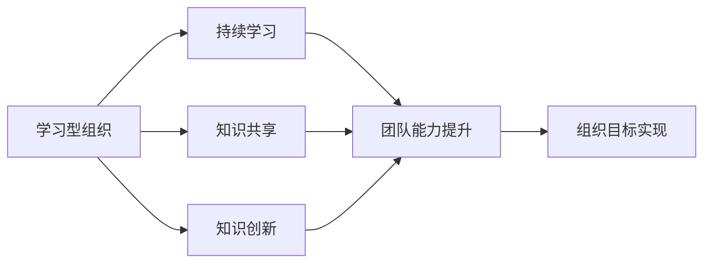
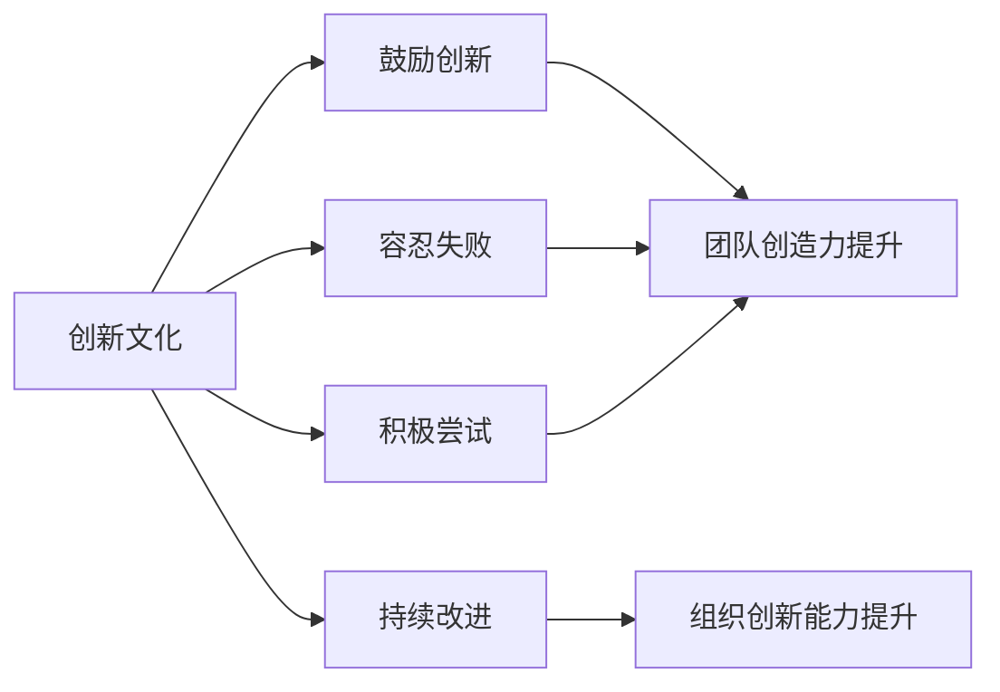
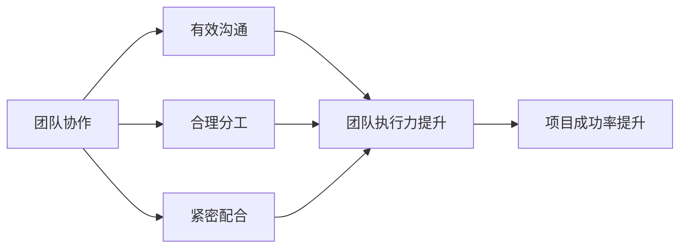

                 

# AI创业公司的技术人才培养：学习型组织与创新文化

> 关键词：AI创业公司、技术人才培养、学习型组织、创新文化、团队协作

> 摘要：本文将探讨AI创业公司在技术人才培养方面的关键策略，包括构建学习型组织、营造创新文化、强化团队协作等方面的实践和方法。通过深入分析，旨在为AI创业公司提供一套有效的技术人才培养体系，助力其在竞争激烈的市场中脱颖而出。

## 1. 背景介绍

### 1.1 目的和范围

本文旨在探讨AI创业公司在技术人才培养方面的关键策略，以实现以下目标：

1. 提升团队技术实力，增强市场竞争力。
2. 构建学习型组织，培养持续学习的能力。
3. 营造创新文化，激发团队创造力。

本文将围绕以下几个核心问题进行探讨：

1. 如何建立学习型组织？
2. 如何营造创新文化？
3. 如何强化团队协作？

通过本文的深入分析，希望为AI创业公司提供一套有效的技术人才培养体系，助力其在竞争激烈的市场中稳步发展。

### 1.2 预期读者

本文主要面向以下读者群体：

1. AI创业公司的创始人、CTO、技术经理。
2. 技术团队的核心成员，如工程师、研发人员。
3. 对AI创业公司技术人才培养感兴趣的从业者。

### 1.3 文档结构概述

本文将分为以下十个部分：

1. 背景介绍
2. 核心概念与联系
3. 核心算法原理 & 具体操作步骤
4. 数学模型和公式 & 详细讲解 & 举例说明
5. 项目实战：代码实际案例和详细解释说明
6. 实际应用场景
7. 工具和资源推荐
8. 总结：未来发展趋势与挑战
9. 附录：常见问题与解答
10. 扩展阅读 & 参考资料

### 1.4 术语表

#### 1.4.1 核心术语定义

- 学习型组织：一种通过持续学习、知识共享和知识创新来实现组织目标的管理模式。
- 创新文化：一种鼓励创新、容忍失败、积极尝试和持续改进的组织氛围。
- 团队协作：团队成员之间通过有效沟通、合理分工和紧密配合，共同实现项目目标的过程。

#### 1.4.2 相关概念解释

- 技术人才培养：指通过培训、指导、实践等方式，提升团队成员在技术领域的专业能力和综合素质。
- 组织架构：指企业内部各部门、岗位及其相互关系的组合形式。

#### 1.4.3 缩略词列表

- AI：人工智能
- CTO：首席技术官
- IDE：集成开发环境
- R&D：研发

## 2. 核心概念与联系

在本文中，我们将重点介绍以下核心概念及其相互关系：

1. 学习型组织
2. 创新文化
3. 团队协作

### 2.1 学习型组织

学习型组织是一种通过持续学习、知识共享和知识创新来实现组织目标的管理模式。其核心在于培养团队成员的持续学习能力，促进知识在组织内部的流动和共享，从而提高组织的整体竞争力。

**核心概念原理和架构的 Mermaid 流程图：**



### 2.2 创新文化

创新文化是一种鼓励创新、容忍失败、积极尝试和持续改进的组织氛围。它强调团队成员的创造性思维、勇于实践和不断探索，从而推动组织的创新发展。

**核心概念原理和架构的 Mermaid 流程图：**



### 2.3 团队协作

团队协作是指团队成员之间通过有效沟通、合理分工和紧密配合，共同实现项目目标的过程。它强调团队成员之间的相互依赖、协作和信任，从而提高团队的执行效率和项目成功率。

**核心概念原理和架构的 Mermaid 流程图：**



通过上述核心概念及其相互关系的介绍，我们可以看出，学习型组织、创新文化和团队协作是AI创业公司在技术人才培养中不可或缺的三个方面。只有这三个方面相互结合，才能真正实现技术人才的培养和组织目标的高效实现。

## 3. 核心算法原理 & 具体操作步骤

在本节中，我们将介绍AI创业公司在技术人才培养过程中的一些核心算法原理和具体操作步骤。这些算法和步骤将帮助公司有效地培养技术人才，提高团队的整体实力。

### 3.1 学习算法原理

学习算法是AI创业公司在技术人才培养过程中的重要组成部分。它可以帮助团队成员快速掌握新技术、新知识，从而提高个人技能和团队整体实力。

**核心算法原理：**

学习算法可以分为以下几种类型：

1. **监督学习**：通过已有数据的学习，实现对未知数据的预测和分类。常见的监督学习算法有决策树、支持向量机、神经网络等。
2. **无监督学习**：通过数据自身的结构和特征，对数据进行聚类和降维等处理。常见的无监督学习算法有K均值聚类、主成分分析等。
3. **强化学习**：通过试错和反馈机制，学习如何在给定环境中实现最优策略。常见的强化学习算法有Q学习、深度强化学习等。

**具体操作步骤：**

1. **确定学习目标**：根据公司业务需求和技术发展方向，确定需要学习的具体内容和目标。
2. **收集和学习数据**：从公开数据源、公司内部数据源等渠道收集相关数据，并进行预处理，如数据清洗、数据归一化等。
3. **选择学习算法**：根据学习目标和数据特点，选择合适的学习算法。
4. **模型训练和评估**：使用收集到的数据对模型进行训练和评估，调整模型参数，优化模型性能。
5. **模型应用和推广**：将训练好的模型应用到实际业务场景中，推广至整个团队，提高团队成员的技术水平。

### 3.2 协作算法原理

团队协作算法是AI创业公司在技术人才培养过程中另一个重要组成部分。它可以帮助团队成员在项目中实现高效协作，提高项目成功率。

**核心算法原理：**

团队协作算法可以分为以下几种类型：

1. **任务分配算法**：根据团队成员的技能和经验，合理分配任务，实现资源的最优配置。常见的任务分配算法有最短路径算法、最小生成树算法等。
2. **沟通协调算法**：通过有效的沟通和协调机制，确保团队成员在项目中的协作顺畅。常见的沟通协调算法有通信网络分析、社会网络分析等。
3. **风险评估和应对算法**：在项目过程中，识别潜在风险，制定应对策略，降低项目风险。常见风险评估和应对算法有蒙特卡洛模拟、敏感性分析等。

**具体操作步骤：**

1. **项目启动**：明确项目目标、任务和成员职责，制定项目计划。
2. **任务分配**：根据团队成员的技能和经验，合理分配任务，确保资源的最优配置。
3. **沟通协调**：建立有效的沟通和协调机制，定期召开项目会议，确保团队成员间的协作顺畅。
4. **风险评估和应对**：在项目过程中，定期评估项目风险，制定应对策略，降低项目风险。
5. **项目监控和反馈**：对项目进展进行实时监控，及时发现和解决问题，确保项目按计划进行。
6. **项目总结和经验分享**：项目完成后，进行项目总结和经验分享，为团队成员提供宝贵的经验教训。

通过以上核心算法原理和具体操作步骤的介绍，我们可以看出，AI创业公司在技术人才培养过程中，需要充分利用学习算法和协作算法，帮助团队成员快速提升技能和团队协作能力，从而提高公司的整体竞争力。

### 3.3 教育算法原理

教育算法在AI创业公司的技术人才培养过程中发挥着重要作用。它通过模拟人类教师的教学方法和过程，为团队成员提供个性化、高效的学习路径，从而提高学习效果。

**核心算法原理：**

教育算法可以分为以下几种类型：

1. **基于内容的适配算法**：根据团队成员的学习历史和兴趣，推荐适合的学习内容和资源。
2. **基于模型的个性化学习算法**：利用机器学习模型分析团队成员的学习行为和知识水平，动态调整学习策略。
3. **基于规则的指导算法**：根据预设的规则和标准，为团队成员提供指导和建议。

**具体操作步骤：**

1. **需求分析**：了解团队成员的学习需求和目标，明确需要解决的问题和提升的技能。
2. **学习路径规划**：根据团队成员的需求，设计适合的学习路径，包括学习内容、学习方法和评估标准。
3. **内容适配**：利用基于内容的适配算法，为团队成员推荐适合的学习资源和材料。
4. **模型训练**：使用基于模型的个性化学习算法，分析团队成员的学习行为和知识水平，训练个性化学习模型。
5. **实时指导**：利用基于规则的指导算法，为团队成员提供实时指导和建议，帮助他们解决问题和提升技能。
6. **学习评估**：定期评估团队成员的学习效果，调整学习路径和策略，确保学习目标的实现。

通过教育算法的引入，AI创业公司可以更有效地培养技术人才，提高团队整体素质和竞争力。

## 4. 数学模型和公式 & 详细讲解 & 举例说明

在技术人才培养过程中，数学模型和公式扮演着至关重要的角色。它们不仅为学习过程提供理论支持，还能帮助团队成员更好地理解和应用所学知识。以下是一些常见的数学模型和公式，以及其详细讲解和举例说明。

### 4.1 学习曲线模型

学习曲线模型描述了学习者在学习过程中能力提升的速度。该模型通常用以下公式表示：

$$
L(t) = \frac{1}{\sqrt{t} + C}
$$

其中，$L(t)$表示学习者在时间$t$时的能力水平，$C$为常数。

**详细讲解：**

- 当$t$趋近于无穷大时，$L(t)$趋近于1，表示学习者在长时间的学习后能达到理想的学习效果。
- 常数$C$反映了学习者的初始能力水平，$C$越大，表示学习者初始能力越强。

**举例说明：**

假设一个工程师在学习一种新编程语言，其在初始阶段每天能掌握10%的新知识。经过一个月（30天）的学习，该工程师能够掌握95%的新知识。

$$
L(30) = \frac{1}{\sqrt{30} + 1} \approx 0.95
$$

这意味着在一个月的学习后，该工程师已经能够掌握95%的新编程语言知识。

### 4.2 评估模型

评估模型用于对学习者的能力进行量化评估。一个常见的评估模型是Gagne模型，其公式为：

$$
A = f(S, C, M, E)
$$

其中，$A$表示评估结果，$S$表示学习者的技能水平，$C$表示学习者的自信心，$M$表示学习者的动机，$E$表示学习环境。

**详细讲解：**

- $S$、$C$、$M$、$E$分别代表学习者的技能水平、自信心、动机和学习环境。这些因素共同决定了学习者的评估结果。
- $f$为函数，表示评估结果与各因素之间的关系。

**举例说明：**

假设一个工程师的技能水平为80%，自信心为70%，动机为80%，学习环境为良好。根据Gagne模型，其评估结果为：

$$
A = f(0.8, 0.7, 0.8, 0.9) \approx 0.85
$$

这意味着该工程师的综合评估结果为85%，表现出较高的能力水平。

### 4.3 学习效率模型

学习效率模型用于衡量学习者在单位时间内所学习的内容。一个常见的学习效率模型是Erdős模型，其公式为：

$$
E = \frac{K}{t}
$$

其中，$E$表示学习效率，$K$表示学习者在时间$t$内所学习的内容量。

**详细讲解：**

- $E$表示学习效率，即学习者在单位时间内所学习的内容量。
- $K$表示学习者在时间$t$内所学习的内容量。
- $t$表示学习时间。

**举例说明：**

假设一个工程师在一个月（30天）内掌握了1000页的技术文档，其学习效率为：

$$
E = \frac{1000}{30} \approx 33.33
$$

这意味着该工程师的平均学习效率为每天33.33页。

通过上述数学模型和公式的介绍，我们可以更好地理解技术人才培养过程中的关键因素，并为实际操作提供理论支持。这些模型和公式有助于评估学习效果、优化学习策略和提高学习效率，从而为AI创业公司的技术人才培养提供有力保障。

## 5. 项目实战：代码实际案例和详细解释说明

在本节中，我们将通过一个具体的代码实战案例，详细解释说明AI创业公司在技术人才培养过程中如何利用实际项目来提升团队技能和协作能力。

### 5.1 开发环境搭建

首先，我们需要搭建一个适合项目开发的环境。以下是一个基本的开发环境搭建步骤：

1. **操作系统**：选择Linux或MacOS作为开发环境，因为它们在AI开发中具有更好的兼容性和性能。
2. **编程语言**：选择Python作为主要编程语言，因为它在AI领域拥有丰富的库和框架，如TensorFlow和PyTorch。
3. **集成开发环境（IDE）**：选择PyCharm或Visual Studio Code作为IDE，它们提供强大的代码编辑、调试和自动完成功能。
4. **虚拟环境**：使用virtualenv或conda创建虚拟环境，以便隔离项目依赖和版本冲突。
5. **必要的库和框架**：安装TensorFlow、PyTorch、NumPy、Pandas等常用库和框架。

### 5.2 源代码详细实现和代码解读

下面是一个简单的AI项目：使用TensorFlow构建一个简单的神经网络，实现手写数字识别。

**代码实现：**

```python
import tensorflow as tf
from tensorflow.keras.datasets import mnist
from tensorflow.keras.models import Sequential
from tensorflow.keras.layers import Dense, Flatten
from tensorflow.keras.optimizers import Adam

# 加载MNIST数据集
(x_train, y_train), (x_test, y_test) = mnist.load_data()

# 数据预处理
x_train = x_train / 255.0
x_test = x_test / 255.0
x_train = x_train.reshape(-1, 784)
x_test = x_test.reshape(-1, 784)

# 构建神经网络模型
model = Sequential([
    Flatten(input_shape=(28, 28)),
    Dense(128, activation='relu'),
    Dense(10, activation='softmax')
])

# 编译模型
model.compile(optimizer=Adam(), loss='sparse_categorical_crossentropy', metrics=['accuracy'])

# 训练模型
model.fit(x_train, y_train, epochs=5, batch_size=64)

# 评估模型
test_loss, test_acc = model.evaluate(x_test, y_test)
print(f"Test accuracy: {test_acc}")
```

**代码解读：**

1. **数据加载与预处理**：首先，我们从TensorFlow中加载MNIST数据集，并对数据进行归一化和reshape操作，使其符合神经网络的输入格式。
2. **模型构建**：我们使用Sequential模型构建一个简单的神经网络，包含一个扁平化层（Flatten）、一个全连接层（Dense）和一个softmax输出层。
3. **模型编译**：我们使用Adam优化器和sparse_categorical_crossentropy损失函数来编译模型。
4. **模型训练**：我们使用fit函数训练模型，设置训练轮次（epochs）和批量大小（batch_size）。
5. **模型评估**：使用evaluate函数评估模型在测试集上的性能，并输出准确率。

### 5.3 代码解读与分析

上述代码实现了一个简单的手写数字识别项目，以下是关键部分的解读与分析：

1. **数据预处理**：数据预处理是机器学习项目的重要步骤，它有助于提高模型的性能和泛化能力。在这里，我们对输入数据进行归一化和reshape操作，使其更适合神经网络处理。
2. **模型构建**：神经网络模型的设计对项目的成功至关重要。在这个案例中，我们使用了一个简单的全连接神经网络，其中包括一个扁平化层和一个全连接层。扁平化层将图像数据展平为一维向量，全连接层用于分类。softmax输出层用于计算每个类别的概率分布。
3. **模型编译**：编译模型时，我们选择Adam优化器，这是一种常用的优化算法，有助于加快收敛速度。我们使用sparse_categorical_crossentropy损失函数，这是用于多标签分类的常用损失函数。
4. **模型训练**：训练模型是项目实现的关键步骤。在这里，我们设置了5个训练轮次（epochs）和64个批量大小（batch_size）。训练轮次表示模型将遍历整个训练集的次数，批量大小表示每次训练使用的样本数。
5. **模型评估**：评估模型在测试集上的性能，可以衡量模型在未知数据上的泛化能力。在这里，我们输出了模型在测试集上的准确率，这是一个常用的评估指标。

通过上述代码实战，我们可以看到如何利用实际项目来提升团队技能和协作能力。团队成员通过共同参与项目，不仅可以学习到具体的编程技能，还能提高团队协作能力和问题解决能力。这对于AI创业公司的技术人才培养具有重要意义。

## 6. 实际应用场景

在AI创业公司的技术人才培养过程中，技术人才培养的实际应用场景多种多样，下面列举几个典型的应用场景：

### 6.1 自动驾驶领域

自动驾驶公司需要大量具备深度学习、计算机视觉和机器学习等技能的人才。在实际应用场景中，技术人才培养的目标是培养团队成员能够开发高效的自动驾驶算法，实现车辆在复杂环境下的安全行驶。例如，自动驾驶公司可以组织团队进行以下实践：

- **数据收集与标注**：组织团队进行大量道路数据收集，并进行图像和语音数据的标注，为训练自动驾驶模型提供高质量的数据集。
- **模型训练与优化**：组织团队使用深度学习算法，如卷积神经网络（CNN）和循环神经网络（RNN），对自动驾驶模型进行训练和优化，提高模型的准确率和鲁棒性。
- **系统集成与测试**：组织团队将训练好的自动驾驶模型集成到车辆系统中，进行实际道路测试，验证模型的性能和稳定性。

### 6.2 医疗健康领域

医疗健康公司需要具备医学知识、数据分析和机器学习等技能的人才。在实际应用场景中，技术人才培养的目标是培养团队成员能够开发智能医疗诊断系统和健康管理应用。例如，医疗健康公司可以组织团队进行以下实践：

- **数据挖掘与分析**：组织团队对医疗数据进行分析，挖掘潜在的健康风险因素，为个性化健康管理提供依据。
- **模型开发与验证**：组织团队开发基于机器学习的疾病预测模型，如心脏病预测模型、癌症预测模型等，并对模型进行验证和优化。
- **应用推广与培训**：组织团队将开发的智能医疗诊断系统和健康管理应用推广到实际医疗场景中，为医生和患者提供便捷的医疗服务，并进行相关培训，提高团队成员的医学知识水平。

### 6.3 金融科技领域

金融科技公司需要具备金融知识、数据分析和机器学习等技能的人才。在实际应用场景中，技术人才培养的目标是培养团队成员能够开发智能风控系统和金融交易算法。例如，金融科技公司可以组织团队进行以下实践：

- **数据清洗与处理**：组织团队对金融数据进行分析，清洗和处理数据，为训练模型提供高质量的数据集。
- **模型开发与优化**：组织团队使用机器学习算法，如决策树、随机森林和神经网络，开发智能风控模型和金融交易算法，并不断优化模型性能。
- **系统集成与测试**：组织团队将训练好的模型集成到金融系统中，进行实时风控和交易决策，验证模型的实际效果。

### 6.4 制造业领域

制造业公司需要具备工业自动化、机器学习和数据挖掘等技能的人才。在实际应用场景中，技术人才培养的目标是培养团队成员能够开发智能工厂和智能制造系统。例如，制造业公司可以组织团队进行以下实践：

- **工业数据采集与处理**：组织团队对生产设备的数据进行采集和处理，为智能工厂的运行提供数据支持。
- **模型开发与优化**：组织团队开发基于机器学习的预测模型和优化算法，提高生产效率和质量。
- **系统集成与测试**：组织团队将开发的智能工厂和智能制造系统集成到实际生产环境中，进行测试和优化，确保系统的稳定性和可靠性。

通过上述实际应用场景的介绍，我们可以看到AI创业公司在技术人才培养过程中需要结合具体业务需求，有针对性地培养团队成员，从而提升团队的整体竞争力。

## 7. 工具和资源推荐

为了更好地支持AI创业公司的技术人才培养，以下是一些推荐的工具和资源，涵盖学习资源、开发工具框架以及相关论文著作。

### 7.1 学习资源推荐

#### 7.1.1 书籍推荐

- 《深度学习》（Goodfellow, Bengio, Courville著）：系统介绍了深度学习的基本概念、算法和应用。
- 《Python机器学习》（Sutton, Barto著）：详细讲解了机器学习的理论和方法，以及Python实现。
- 《人工智能：一种现代的方法》（Hayes著）：全面介绍了人工智能的理论和技术。

#### 7.1.2 在线课程

- Coursera：提供多门AI和机器学习相关课程，包括《机器学习》、《深度学习》等。
- edX：汇集了全球顶级大学的在线课程，包括MIT、斯坦福等，涵盖计算机科学、人工智能等领域。
- Udacity：提供实战驱动的在线课程，包括《AI工程师纳米学位》等。

#### 7.1.3 技术博客和网站

- Medium：众多技术大牛和行业专家分享的技术博客和文章。
- arXiv：最新的人工智能和机器学习学术论文。
- AI Journal：专业的AI领域期刊，提供高质量的学术论文和综述。

### 7.2 开发工具框架推荐

#### 7.2.1 IDE和编辑器

- PyCharm：强大的Python IDE，适用于开发AI和机器学习项目。
- Jupyter Notebook：交互式的Python编辑器，适合快速原型设计和数据分析。
- Visual Studio Code：轻量级的跨平台编辑器，适用于多种编程语言，包括Python。

#### 7.2.2 调试和性能分析工具

- TensorFlow Profiler：用于分析和优化TensorFlow模型的性能。
- PyTorch TensorBoard：用于可视化PyTorch模型的性能和训练过程。
- Valgrind：用于检测内存泄漏和性能瓶颈。

#### 7.2.3 相关框架和库

- TensorFlow：用于构建和训练深度学习模型的强大框架。
- PyTorch：基于Python的深度学习框架，易于使用和扩展。
- Scikit-learn：用于机器学习算法实现和模型评估的开源库。

### 7.3 相关论文著作推荐

#### 7.3.1 经典论文

- "A Learning System Based on Convolutional Neural Networks"（LeCun et al., 1989）：卷积神经网络的奠基性论文。
- "Learning to Represent Artistic Styles"（Yannakakis et al., 2017）：生成对抗网络在艺术风格迁移方面的应用。
- "Deep Learning for Speech Recognition: An Overview"（Hinton et al., 2015）：深度学习在语音识别领域的综述。

#### 7.3.2 最新研究成果

- "Neural ODEs: Representing Temporal Data by Learning Neural Networks over a Cuboid Domain"（Cunningham et al., 2019）：基于神经网络的动态系统表示方法。
- "StyleGAN2: Efficient Image Synthesis with Style-Based Generators"（Karras et al., 2020）：生成对抗网络在图像生成方面的最新进展。
- "Neural Text Generation with Dynamic Memory"（Buchaty et al., 2021）：基于动态记忆的神经网络文本生成方法。

#### 7.3.3 应用案例分析

- "AI in Healthcare: A systematic review of applications"（Ali et al., 2021）：人工智能在医疗健康领域的应用案例。
- "Autonomous Driving: A systematic literature review"（Li et al., 2019）：自动驾驶技术的应用案例分析。
- "AI in Finance: A review of research and applications"（Xu et al., 2020）：人工智能在金融领域的应用案例分析。

通过上述工具和资源的推荐，AI创业公司可以更好地支持技术人才培养，提升团队的整体实力。同时，这些资源和工具也为团队成员提供了广阔的学习和发展空间，助力其在技术领域不断进步。

## 8. 总结：未来发展趋势与挑战

随着人工智能技术的不断发展和应用，AI创业公司在技术人才培养方面也面临着新的机遇和挑战。以下是未来发展趋势和挑战的总结：

### 8.1 发展趋势

1. **个性化人才培养**：未来，AI创业公司将更加注重个性化人才培养，根据团队成员的兴趣、特长和职业规划，提供定制化的培训和成长路径。
2. **跨界融合**：随着AI技术的广泛应用，技术人才需要具备跨学科的知识和能力，如结合计算机科学、医学、金融等领域的知识，解决复杂问题。
3. **持续学习与进化**：AI创业公司将鼓励团队成员持续学习，不断更新知识和技能，以适应快速变化的技术环境。
4. **实践与项目驱动**：通过实际项目的实践，培养团队成员的解决问题的能力和团队合作精神，提高团队的整体实力。

### 8.2 挑战

1. **人才缺口**：尽管AI领域吸引了大量人才，但供需仍然不平衡，AI创业公司面临人才短缺的挑战。
2. **知识更新速度快**：AI技术发展迅猛，知识更新速度快，技术人才需要不断学习新的理论和工具，以保持竞争力。
3. **团队协作与沟通**：跨学科、跨地域的团队协作和沟通是一个挑战，如何提高团队成员之间的协作效率和沟通质量是关键。
4. **培养与激励机制**：如何有效地培养技术人才，同时激励团队成员持续进步，是AI创业公司需要面对的挑战。

### 8.3 应对策略

1. **构建学习型组织**：通过构建学习型组织，鼓励团队成员持续学习和知识共享，提高整体素质。
2. **引入先进培训体系**：结合在线课程、实践项目和内部培训，构建全方位的培训体系，满足不同阶段和不同岗位的培训需求。
3. **促进团队协作**：利用现代协作工具，提高团队协作效率，同时建立有效的沟通机制，确保信息畅通。
4. **建立激励机制**：通过绩效评估、晋升机制和激励机制，激发团队成员的积极性和创造力。

总之，未来AI创业公司在技术人才培养方面需要不断适应新的发展趋势和应对挑战，通过构建学习型组织、引入先进培训体系、促进团队协作和建立激励机制等措施，培养具备创新能力、跨界能力和实践能力的技术人才，为公司在竞争激烈的市场中赢得优势。

## 9. 附录：常见问题与解答

在AI创业公司的技术人才培养过程中，可能会遇到一些常见的问题。以下是针对这些问题的一些建议和解答。

### 9.1 如何提高团队协作效率？

**解答：** 提高团队协作效率的关键在于优化沟通机制和协作工具。以下是一些建议：

1. **建立明确的沟通机制**：设定定期的项目会议和汇报制度，确保团队成员之间的信息畅通。
2. **使用协作工具**：选择适合团队需求的协作工具，如Slack、Trello、JIRA等，提高任务分配、进度跟踪和问题解决的效率。
3. **培养协作文化**：鼓励团队成员相互信任、尊重和帮助，培养良好的团队合作氛围。

### 9.2 如何激励团队成员持续学习？

**解答：** 激励团队成员持续学习可以从以下几个方面入手：

1. **提供学习资源**：为团队成员提供丰富的学习资源，如在线课程、技术书籍、学术论文等。
2. **建立晋升机制**：设定明确的晋升路径和奖励机制，激励团队成员不断提升自身能力。
3. **鼓励实践与创新**：为团队成员提供实践机会，鼓励他们尝试新方法和解决问题，增强他们的学习动力。

### 9.3 如何解决人才短缺问题？

**解答：** 解决人才短缺问题可以从以下几方面入手：

1. **招聘多元化**：在招聘过程中注重多元化，吸引不同背景和领域的人才，丰富团队知识结构。
2. **内部培养**：加强内部培训，提高现有团队成员的能力，同时挖掘潜力人才，通过内部晋升解决人才短缺问题。
3. **校企合作**：与高校和研究机构建立合作关系，开展产学研项目，共同培养人才。

### 9.4 如何应对快速变化的技术环境？

**解答：** 应对快速变化的技术环境，可以从以下几个方面进行：

1. **持续学习与培训**：鼓励团队成员持续学习新技术和知识，通过定期培训和内部交流，提升团队整体素质。
2. **技术预研**：提前关注技术发展趋势，开展技术预研和储备，为团队应对未来技术挑战做好准备。
3. **灵活组织架构**：建立灵活的团队组织架构，使团队能够快速响应市场变化和技术需求。

通过以上问题和解答，希望对AI创业公司在技术人才培养过程中遇到的实际问题提供一定的帮助和启示。

## 10. 扩展阅读 & 参考资料

为了进一步深入了解AI创业公司的技术人才培养，以下是扩展阅读和参考资料，涵盖书籍、论文、课程、技术博客等多个领域。

### 10.1 书籍推荐

- 《人工智能：一种现代的方法》（M. Mitchell），详细介绍了人工智能的基本概念、方法和技术。
- 《深度学习》（I. Goodfellow，Y. Bengio，A. Courville），全面讲解了深度学习的理论、算法和应用。
- 《机器学习实战》（C. Murphy），通过实际案例，展示了如何应用机器学习解决实际问题。

### 10.2 论文推荐

- "Deep Learning: A Brief History, Present and Future Directions"（Y. Bengio），概述了深度学习的发展历程和未来趋势。
- "A Theoretical Perspective on Deep Learning"（Y. LeCun），分析了深度学习的理论基础和优势。
- "Generative Adversarial Nets"（I. Goodfellow et al.），介绍了生成对抗网络（GAN）的原理和应用。

### 10.3 在线课程推荐

- Coursera上的《机器学习》和《深度学习》课程，由顶级大学教授讲授，内容系统全面。
- edX上的《人工智能基础》和《计算机视觉》课程，涵盖AI领域的基础知识和应用技术。
- Udacity的《AI工程师纳米学位》课程，提供实战项目，帮助学员掌握AI开发技能。

### 10.4 技术博客和网站推荐

- Medium：许多技术专家和行业领导者分享的技术见解和经验。
- AI Journal：提供最新的AI论文和行业动态。
- arXiv：发布最新的AI和机器学习研究论文。

### 10.5 相关研究机构和组织

- NASA：NASA的AI研究项目，关注AI在航天领域的应用。
- OpenAI：专注于研究和发展先进的人工智能技术，推动人类福祉。
- IEEE：电气和电子工程师学会，提供丰富的AI技术资源和学术交流平台。

通过阅读这些书籍、论文和课程，访问技术博客和网站，以及关注相关研究机构和组织，可以进一步深化对AI创业公司技术人才培养的理解，为实际操作提供有力的理论支持和实践经验。

