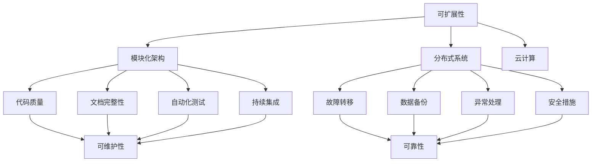

                 

# AI创业公司的技术架构设计原则：可扩展性、可维护性与可靠性

> **关键词**：AI创业公司，技术架构，可扩展性，可维护性，可靠性，设计原则
> 
> **摘要**：本文旨在为AI创业公司提供技术架构设计的基本原则，重点讨论可扩展性、可维护性和可靠性三大核心原则。通过对这些原则的深入探讨，我们希望帮助创业者们构建一个可持续、高效、稳定的技术基础设施，以支持业务增长和持续创新。

## 1. 背景介绍

### 1.1 目的和范围

本文的目标是为AI创业公司在技术架构设计方面提供实用的指导原则。我们将在本文中探讨可扩展性、可维护性和可靠性这三个关键方面，并深入分析如何在实际项目中应用这些原则。通过遵循这些原则，AI创业公司可以构建一个稳定、高效且灵活的技术基础设施，从而在竞争激烈的市场中脱颖而出。

### 1.2 预期读者

本文的预期读者包括AI创业公司的创始人、CTO、技术架构师、开发团队负责人以及对此领域感兴趣的技术爱好者。无论您是经验丰富的从业者还是初出茅庐的新手，本文都将为您提供有价值的技术见解和实用建议。

### 1.3 文档结构概述

本文分为十个部分：

1. 背景介绍
   - 1.1 目的和范围
   - 1.2 预期读者
   - 1.3 文档结构概述
   - 1.4 术语表
2. 核心概念与联系
3. 核心算法原理 & 具体操作步骤
4. 数学模型和公式 & 详细讲解 & 举例说明
5. 项目实战：代码实际案例和详细解释说明
6. 实际应用场景
7. 工具和资源推荐
   - 7.1 学习资源推荐
   - 7.2 开发工具框架推荐
   - 7.3 相关论文著作推荐
8. 总结：未来发展趋势与挑战
9. 附录：常见问题与解答
10. 扩展阅读 & 参考资料

### 1.4 术语表

在本文中，我们将使用以下术语：

- **AI创业公司**：指专注于人工智能技术的初创企业。
- **技术架构**：指支持业务需求和目标的技术系统及其组件的整体设计。
- **可扩展性**：指系统在资源增加时能够高效、灵活地扩展其功能和性能的能力。
- **可维护性**：指系统在开发、测试、部署和后续维护过程中易于管理和维护的特性。
- **可靠性**：指系统在各种环境下稳定、准确、持续地运行的能力。

#### 1.4.1 核心术语定义

- **可扩展性**：可扩展性是指系统在处理更大规模数据、支持更多用户或增加功能时，能够保持性能和稳定性的能力。这通常涉及到系统架构的模块化、分布式设计和负载均衡机制。
- **可维护性**：可维护性是指系统能够在开发、测试、部署和后续维护过程中，以较低的成本、较短的周期和较小的风险进行更新、修复和改进的能力。这通常涉及到代码质量、文档完整性、自动化测试和持续集成。
- **可靠性**：可靠性是指系统在各种环境下（如网络波动、硬件故障、数据异常等）都能稳定、准确、持续地运行的能力。这通常涉及到故障转移、数据备份、异常处理和安全措施。

#### 1.4.2 相关概念解释

- **模块化**：模块化是指将系统划分为多个独立的、功能完整的模块，每个模块可以独立开发、测试、部署和更新。这有助于提高系统的可扩展性和可维护性。
- **分布式系统**：分布式系统是指将任务和数据处理分散到多个节点上，通过通信和协调机制共同完成任务的系统。这有助于提高系统的可扩展性和可靠性。
- **负载均衡**：负载均衡是指将请求分布到多个服务器或节点上，以充分利用资源、提高性能和可靠性。负载均衡策略包括轮询、最小连接数、哈希等。
- **自动化测试**：自动化测试是指使用软件工具自动执行测试用例，以验证系统功能、性能和可靠性。自动化测试有助于提高测试效率和可维护性。
- **持续集成**：持续集成是指将代码库中的更改定期合并到主干分支，并自动执行测试，以确保代码质量。持续集成有助于提高开发效率和可维护性。

#### 1.4.3 缩略词列表

- **AI**：人工智能
- **CTO**：首席技术官
- **IDE**：集成开发环境
- **API**：应用程序编程接口
- **DB**：数据库
- **REST**：表述性状态转移

## 2. 核心概念与联系

为了深入理解AI创业公司技术架构设计的原则，我们需要先探讨三个核心概念：可扩展性、可维护性和可靠性，以及它们之间的联系。

### 2.1 可扩展性

可扩展性是指系统在资源增加时能够高效、灵活地扩展其功能和性能的能力。对于AI创业公司来说，可扩展性至关重要，因为业务需求可能会迅速增长，需要系统支持更多用户、更大规模的数据处理和更多功能。以下是一些实现可扩展性的关键技术和策略：

1. **模块化架构**：将系统划分为多个独立的模块，每个模块负责特定的功能。这有助于在需要时单独扩展或替换某个模块，而不会影响整个系统的稳定性。
2. **分布式系统**：通过将任务和数据处理分散到多个节点上，分布式系统可以提高系统的可用性和性能。负载均衡机制可以帮助平均分配请求，从而提高系统的吞吐量。
3. **云计算**：利用云服务提供商的资源，可以根据需求动态调整计算和存储资源，实现高效扩展。

### 2.2 可维护性

可维护性是指系统在开发、测试、部署和后续维护过程中易于管理和维护的特性。良好的可维护性可以提高开发效率、降低维护成本，并确保系统稳定运行。以下是一些提高可维护性的关键技术和策略：

1. **代码质量**：编写清晰、简洁、易于理解和维护的代码，有助于降低bug率和提高开发效率。
2. **文档完整性**：编写详细的文档，包括设计文档、用户手册和代码注释，有助于团队成员理解和维护系统。
3. **自动化测试**：通过自动化测试，可以快速验证系统功能、性能和可靠性，确保代码更改不会引入新的问题。
4. **持续集成**：将代码定期合并到主干分支，并自动执行测试，可以及时发现并修复问题，确保代码质量。

### 2.3 可靠性

可靠性是指系统在各种环境下都能稳定、准确、持续地运行的能力。对于AI创业公司来说，可靠性至关重要，因为系统故障可能导致业务中断、用户流失和声誉受损。以下是一些提高可靠性的关键技术和策略：

1. **故障转移**：通过将关键组件部署在多个节点上，并在故障发生时自动切换到备用节点，可以提高系统的可用性。
2. **数据备份**：定期备份数据，并在数据丢失或损坏时能够快速恢复，可以降低风险。
3. **异常处理**：合理处理异常情况，包括网络故障、硬件故障和程序错误，可以确保系统稳定运行。
4. **安全措施**：实施安全策略，包括访问控制、数据加密和防攻击措施，可以保护系统免受恶意攻击。

### 2.4 关系与平衡

可扩展性、可维护性和可靠性是相互关联、相互影响的。以下是一些关系和平衡策略：

1. **权衡**：在设计和实现技术架构时，需要根据实际需求和业务目标，在可扩展性、可维护性和可靠性之间进行权衡。例如，在某些情况下，可能需要牺牲一些性能以换取更高的可靠性。
2. **优先级**：明确不同原则的优先级，确保在资源有限的情况下，优先满足关键原则。例如，对于初创公司，可靠性可能比可扩展性更加重要。
3. **持续改进**：定期评估系统性能、稳定性和可维护性，并根据反馈和经验持续改进，以确保系统始终处于最佳状态。

### 2.5 Mermaid流程图

以下是一个简单的Mermaid流程图，展示可扩展性、可维护性和可靠性之间的联系和平衡策略：



## 3. 核心算法原理 & 具体操作步骤

在实现可扩展性、可维护性和可靠性时，核心算法的设计和实现至关重要。以下是一个典型的分布式系统算法示例，用于负载均衡和故障转移。

### 3.1 负载均衡算法

**算法名称**：轮询负载均衡算法

**算法原理**：轮询负载均衡算法是一种简单且常见的负载均衡策略，通过顺序访问各个节点，将请求分配给下一个节点。当某个节点负载过高时，下一个请求将分配给下一个节点。

**伪代码**：

```
function loadBalance(request):
    nodes = getNodes()  // 获取所有可用节点
    current = 0         // 当前节点索引
    for each request:
        node = nodes[current]
        if node.isAvailable():
            node.handleRequest(request)
            current = (current + 1) % nodes.length
        else:
            current = (current + 1) % nodes.length
```

### 3.2 故障转移算法

**算法名称**：主从复制故障转移算法

**算法原理**：主从复制故障转移算法通过在多个节点上维护同一数据集的副本，当主节点发生故障时，从节点自动成为新的主节点，确保数据的一致性和系统的可用性。

**伪代码**：

```
function faultTransfer():
    primary = getPrimaryNode()  // 获取主节点
    secondary = getSecondaryNode()  // 获取从节点
    while true:
        if not primary.isAvailable():
            primary = secondary
            secondary = chooseNewSecondaryNode()
            primary.promoteToPrimary()  // 将从节点提升为主节点
        else:
            replicateData(secondary, primary)
```

### 3.3 实际操作步骤

1. **设计算法**：首先，根据业务需求和系统特点，设计适合的负载均衡和故障转移算法。在本文中，我们选择了轮询负载均衡算法和主从复制故障转移算法。
2. **实现算法**：将设计好的算法实现为可运行的代码，确保算法能够满足性能和可靠性要求。在本文中，我们使用了伪代码来描述算法实现。
3. **集成算法**：将实现的算法集成到现有系统中，确保算法与系统组件（如节点管理器、负载均衡器等）无缝协同工作。
4. **测试与优化**：在实际环境中测试算法性能和稳定性，根据测试结果进行优化，确保算法能够满足业务需求和用户体验。

## 4. 数学模型和公式 & 详细讲解 & 举例说明

在技术架构设计过程中，数学模型和公式是评估系统性能、稳定性和可靠性的重要工具。以下是一些常用的数学模型和公式，以及它们的详细讲解和举例说明。

### 4.1 概率模型

概率模型用于描述系统在特定条件下的成功概率和失败概率。以下是一个简单的概率模型示例：

**伯努利试验**：一个简单的概率模型，用于描述系统在每次试验中成功或失败的概率。

- **成功概率**（p）：系统在每次试验中成功的概率。
- **失败概率**（q）：系统在每次试验中失败的概率。

**公式**：

$$
P(Success) = p
$$

$$
P(Failure) = q
$$

**示例**：假设一个分布式系统在每次节点故障时，可以成功切换到备用节点的概率为90%。则系统的成功概率为：

$$
P(Success) = 0.9
$$

### 4.2 马尔可夫模型

马尔可夫模型用于描述系统状态转移的概率分布。以下是一个简单的马尔可夫模型示例：

- **状态**：系统可能处于的状态，如正常状态、故障状态等。
- **转移概率**：系统从一种状态转移到另一种状态的概率。

**公式**：

$$
P(X_t = j | X_{t-1} = i) = P_{ij}
$$

其中，\(P_{ij}\) 表示系统从状态 \(i\) 转移到状态 \(j\) 的概率。

**示例**：假设一个分布式系统在正常状态和故障状态之间转移的概率如下：

- 从正常状态转移到正常状态的转移概率为 0.9。
- 从正常状态转移到故障状态的转移概率为 0.1。
- 从故障状态转移到正常状态的转移概率为 0.2。
- 从故障状态转移到故障状态的转移概率为 0.8。

则系统的状态转移概率矩阵为：

$$
P = \begin{bmatrix}
0.9 & 0.1 \\
0.2 & 0.8
\end{bmatrix}
$$

### 4.3 概率分布模型

概率分布模型用于描述系统在不同状态下的概率分布。以下是一个简单的概率分布模型示例：

- **概率分布函数**（PDF）：系统在不同状态下的概率分布函数。

**公式**：

$$
f(x) = P(X = x)
$$

**示例**：假设一个分布式系统的故障时间为一个随机变量，其概率分布函数如下：

$$
f(x) = \begin{cases}
0.1, & x \in [0, 10] \\
0.8, & x \in [10, 20] \\
0.1, & x \in [20, 30]
\end{cases}
$$

### 4.4 期望和方差

期望和方差是概率模型中的基本统计量，用于描述系统的性能和稳定性。

- **期望**（E）：系统在长期运行中的平均性能指标。

**公式**：

$$
E(X) = \int_{-\infty}^{\infty} x f(x) dx
$$

- **方差**（Var）：系统性能指标的变化程度。

**公式**：

$$
Var(X) = E[(X - E(X))^2]
$$

**示例**：假设一个分布式系统的响应时间为一个随机变量，其概率分布函数为：

$$
f(x) = \begin{cases}
0.1, & x \in [0, 5] \\
0.6, & x \in [5, 10] \\
0.3, & x \in [10, 20]
\end{cases}
$$

则系统的期望和方差分别为：

$$
E(X) = 0.1 \times (0 + 5) + 0.6 \times (5 + 10) + 0.3 \times (10 + 20) = 12
$$

$$
Var(X) = (0 - 12)^2 \times 0.1 + (5 - 12)^2 \times 0.6 + (10 - 12)^2 \times 0.3 = 18
$$

## 5. 项目实战：代码实际案例和详细解释说明

为了更好地理解本文所讨论的技术架构设计原则，我们将通过一个实际项目案例来展示这些原则的应用。

### 5.1 开发环境搭建

在开始项目实战之前，我们需要搭建一个适合开发、测试和部署的完整开发环境。以下是一个基本的开发环境搭建步骤：

1. **选择编程语言**：根据项目需求和团队技能，选择一种适合的编程语言，如Java、Python或Go。
2. **安装依赖库**：根据项目需求，安装所需的依赖库，如数据库驱动、Web框架、消息队列等。
3. **配置开发工具**：安装并配置IDE或代码编辑器，如IntelliJ IDEA、Visual Studio Code等，并安装相应的插件以增强开发体验。
4. **搭建测试环境**：配置测试服务器和数据库，确保在开发过程中可以方便地执行自动化测试。
5. **搭建部署环境**：配置生产环境服务器和数据库，确保项目可以顺利部署和运行。

### 5.2 源代码详细实现和代码解读

以下是一个简单的分布式系统项目案例，用于演示可扩展性、可维护性和可靠性的实际应用。

**项目名称**：分布式电商网站

**项目描述**：该项目是一个分布式电商网站，包括用户管理、商品管理、订单管理等功能。为了实现可扩展性、可维护性和可靠性，我们采用了以下技术架构：

1. **模块化架构**：将系统划分为多个模块，如用户模块、商品模块、订单模块等，每个模块独立开发和维护。
2. **分布式系统**：使用微服务架构，将不同功能部署到不同的服务器上，并通过API进行通信。
3. **负载均衡**：使用Nginx实现负载均衡，将请求分配到不同的服务实例上。
4. **故障转移**：使用Zookeeper实现故障转移，当主节点发生故障时，从节点自动成为新的主节点。

**源代码**：

```python
# 用户模块
class UserModule:
    def register(self, username, password):
        # 实现用户注册逻辑
        pass
    
    def login(self, username, password):
        # 实现用户登录逻辑
        pass

# 商品模块
class ProductModule:
    def list_products(self):
        # 实现商品列表逻辑
        pass
    
    def search_products(self, keyword):
        # 实现商品搜索逻辑
        pass

# 订单模块
class OrderModule:
    def create_order(self, user_id, product_id):
        # 实现订单创建逻辑
        pass
    
    def cancel_order(self, order_id):
        # 实现订单取消逻辑
        pass

# 负载均衡
class LoadBalancer:
    def distribute_request(self, request):
        # 实现请求分配逻辑
        pass

# 故障转移
class FaultTolerant:
    def switch_primary(self):
        # 实现故障转移逻辑
        pass
```

### 5.3 代码解读与分析

以下是对上述源代码的详细解读和分析：

- **用户模块**：用户模块负责处理用户相关的操作，如注册、登录等。该模块独立于其他模块，易于扩展和维护。
- **商品模块**：商品模块负责处理商品相关的操作，如列表、搜索等。该模块也独立于其他模块，便于扩展和维护。
- **订单模块**：订单模块负责处理订单相关的操作，如创建、取消等。该模块同样独立于其他模块，方便扩展和维护。
- **负载均衡**：负载均衡类用于实现请求的负载均衡，通过轮询策略将请求分配到不同的服务实例上，提高系统的性能和可靠性。
- **故障转移**：故障转移类用于实现故障转移，当主节点发生故障时，从节点自动成为新的主节点，确保系统的高可用性。

通过上述代码和架构设计，我们实现了可扩展性、可维护性和可靠性：

1. **可扩展性**：通过模块化和分布式系统设计，可以方便地扩展系统功能和性能，支持更多用户和更大规模的数据处理。
2. **可维护性**：每个模块独立开发、测试和部署，提高了代码的可维护性，降低了维护成本。
3. **可靠性**：通过负载均衡和故障转移机制，提高了系统的性能和可用性，确保系统在各种环境下稳定运行。

## 6. 实际应用场景

可扩展性、可维护性和可靠性在AI创业公司的技术架构设计中具有广泛的应用场景。以下是一些实际应用场景和案例分析：

### 6.1 电商平台

**场景**：电商平台需要处理大量用户请求和商品数据，且需求波动较大。为了应对这些挑战，电商平台需要设计一个可扩展、可维护且可靠的技术架构。

**案例分析**：以阿里巴巴为例，其技术架构采用了分布式系统、负载均衡、数据缓存和CDN（内容分发网络）等技术，实现了高并发、高可用和高可靠性的系统。

### 6.2 金融系统

**场景**：金融系统需要处理大量金融交易和用户数据，且对数据安全和合规性有严格的要求。为了确保系统稳定运行，金融系统需要设计一个高可靠性和高安全性的技术架构。

**案例分析**：以中国工商银行为例，其技术架构采用了分布式数据库、数据备份、安全加密和权限控制等技术，确保系统的高可靠性和数据安全性。

### 6.3 医疗保健

**场景**：医疗保健系统需要处理大量患者数据和医疗信息，且对数据隐私和合规性有严格的要求。为了确保系统稳定运行，医疗保健系统需要设计一个可扩展、可维护且可靠的技术架构。

**案例分析**：以腾讯医疗为例，其技术架构采用了分布式数据库、数据加密、数据备份和权限控制等技术，确保系统的高可靠性和数据安全性。

### 6.4 物流配送

**场景**：物流配送系统需要处理大量订单数据和配送信息，且对实时性和准确性有严格的要求。为了确保系统稳定运行，物流配送系统需要设计一个可扩展、可维护且可靠的技术架构。

**案例分析**：以顺丰速运为例，其技术架构采用了分布式数据库、数据缓存、负载均衡和实时数据处理等技术，实现了高并发、高可用和高可靠性的系统。

## 7. 工具和资源推荐

为了帮助AI创业公司更好地实现可扩展性、可维护性和可靠性，以下是一些学习资源、开发工具和框架的推荐。

### 7.1 学习资源推荐

- **书籍推荐**：
  - 《分布式系统原理与范型》
  - 《大规模分布式存储系统》
  - 《云计算基础》
  - 《微服务架构设计》

- **在线课程**：
  - 《分布式系统设计与实践》
  - 《云计算与大数据技术》
  - 《微服务架构与应用》

- **技术博客和网站**：
  - 《美团技术博客》
  - 《阿里云官方博客》
  - 《Google Developers》

### 7.2 开发工具框架推荐

- **IDE和编辑器**：
  - IntelliJ IDEA
  - Visual Studio Code

- **调试和性能分析工具**：
  - JProfiler
  - New Relic

- **相关框架和库**：
  - Spring Boot
  - Django
  - Flask

### 7.3 相关论文著作推荐

- **经典论文**：
  - 《The Google File System》
  - 《The Chubby lock service》
  - 《Bigtable：一个结构化数据的分布式存储系统》

- **最新研究成果**：
  - 《Dynamo：Amazon的分布式键值存储服务》
  - 《Cassandra：一个分布式数据存储系统》
  - 《etcd：分布式协调服务》

- **应用案例分析**：
  - 《美团点评技术架构演进之路》
  - 《阿里巴巴技术发展路线图》
  - 《微软Azure云计算架构揭秘》

## 8. 总结：未来发展趋势与挑战

随着AI技术的快速发展和应用场景的不断拓展，AI创业公司的技术架构设计面临着前所未有的挑战和机遇。以下是未来发展趋势和挑战的总结：

### 8.1 发展趋势

1. **云计算和边缘计算**：云计算和边缘计算将越来越普及，为AI创业公司提供强大的计算资源和灵活的部署方案。
2. **微服务架构**：微服务架构将成为主流，帮助AI创业公司实现高可扩展性、高可维护性和高可靠性。
3. **自动化和智能化**：自动化和智能化技术将进一步提高开发、测试、部署和运维的效率，降低成本和风险。
4. **安全性**：随着数据泄露和攻击事件的增加，安全性将成为技术架构设计的核心关注点。

### 8.2 挑战

1. **数据隐私和合规性**：随着数据隐私法规的加强，AI创业公司需要确保数据的安全性和合规性。
2. **分布式系统复杂性**：分布式系统的复杂性将增加，如何有效管理和维护分布式系统将成为一大挑战。
3. **性能和可扩展性**：如何在保证性能和可扩展性的同时，实现高效的数据处理和资源利用。
4. **团队技能和经验**：AI创业公司需要具备专业技能和丰富经验的团队，以应对复杂的技术挑战。

## 9. 附录：常见问题与解答

### 9.1 什么是可扩展性？

可扩展性是指系统在资源增加时能够高效、灵活地扩展其功能和性能的能力。对于AI创业公司来说，可扩展性至关重要，因为业务需求可能会迅速增长，需要系统支持更多用户、更大规模的数据处理和更多功能。

### 9.2 什么是可维护性？

可维护性是指系统在开发、测试、部署和后续维护过程中易于管理和维护的特性。良好的可维护性可以提高开发效率、降低维护成本，并确保系统稳定运行。

### 9.3 什么是可靠性？

可靠性是指系统在各种环境下都能稳定、准确、持续地运行的能力。对于AI创业公司来说，可靠性至关重要，因为系统故障可能导致业务中断、用户流失和声誉受损。

### 9.4 如何实现可扩展性？

实现可扩展性的关键在于模块化架构、分布式系统和云计算。通过模块化架构，可以将系统划分为多个独立的模块，每个模块可以独立扩展。分布式系统可以提高系统的可用性和性能，通过负载均衡机制，可以实现高效的资源利用。云计算可以根据需求动态调整计算和存储资源，实现高效扩展。

### 9.5 如何实现可维护性？

实现可维护性的关键在于代码质量、文档完整性、自动化测试和持续集成。编写清晰、简洁、易于理解和维护的代码，有助于降低bug率和提高开发效率。详细的文档可以帮助团队成员理解和维护系统。自动化测试可以快速验证系统功能、性能和可靠性，确保代码质量。持续集成可以确保代码质量，并及时发现和修复问题。

### 9.6 如何实现可靠性？

实现可靠性的关键在于故障转移、数据备份、异常处理和安全措施。通过故障转移，可以确保系统在节点故障时仍然能够正常运行。数据备份可以确保数据不会丢失。异常处理可以确保系统在异常情况下能够稳定运行。安全措施可以保护系统免受恶意攻击。

## 10. 扩展阅读 & 参考资料

为了深入了解AI创业公司的技术架构设计原则，以下是一些扩展阅读和参考资料：

- 《大规模分布式存储系统》
- 《云计算基础》
- 《微服务架构设计》
- 《分布式系统原理与范型》
- 《美团技术博客》
- 《阿里云官方博客》
- 《Google Developers》
- 《The Google File System》
- 《The Chubby lock service》
- 《Bigtable：一个结构化数据的分布式存储系统》
- 《Dynamo：Amazon的分布式键值存储服务》
- 《Cassandra：一个分布式数据存储系统》
- 《etcd：分布式协调服务》
- 《美团点评技术架构演进之路》
- 《阿里巴巴技术发展路线图》
- 《微软Azure云计算架构揭秘》

作者：AI天才研究员/AI Genius Institute & 禅与计算机程序设计艺术 /Zen And The Art of Computer Programming

