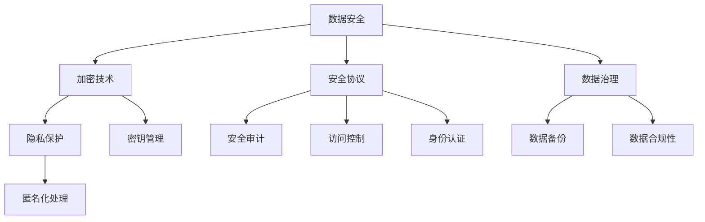

                 

# AI创业公司的数据安全与隐私保护

> 关键词：数据安全、隐私保护、AI创业公司、加密技术、安全协议、法律法规、数据治理、安全策略

> 摘要：随着人工智能技术的快速发展，AI创业公司在数据安全和隐私保护方面面临巨大挑战。本文将详细分析AI创业公司在数据安全与隐私保护方面的核心问题，包括数据安全与隐私保护的重要性、面临的挑战、核心技术和策略，以及法律法规和最佳实践。通过这篇文章，读者可以更好地理解如何在AI创业公司中有效管理和保护数据，确保业务的可持续发展。

## 1. 背景介绍

### 1.1 目的和范围

本文旨在探讨AI创业公司在数据安全与隐私保护方面的关键问题。我们将首先分析数据安全与隐私保护的重要性，然后深入探讨AI创业公司面临的具体挑战，并介绍一系列核心技术和策略。此外，我们还将讨论相关法律法规以及最佳实践，帮助AI创业公司建立有效的数据安全与隐私保护体系。

### 1.2 预期读者

本文面向AI创业公司的技术团队、数据科学家、产品经理以及关注数据安全与隐私保护的相关人员。读者需要具备一定的计算机科学和数据治理基础，以便更好地理解文章内容。

### 1.3 文档结构概述

本文分为十个主要部分：

1. **背景介绍**：介绍本文的目的、预期读者以及文档结构。
2. **核心概念与联系**：阐述数据安全与隐私保护的核心概念及其联系。
3. **核心算法原理 & 具体操作步骤**：讲解数据安全与隐私保护的核心算法原理和操作步骤。
4. **数学模型和公式 & 详细讲解 & 举例说明**：介绍相关数学模型和公式，并提供详细讲解和举例说明。
5. **项目实战：代码实际案例和详细解释说明**：通过实际案例展示数据安全与隐私保护的实现过程。
6. **实际应用场景**：探讨数据安全与隐私保护在实际业务中的应用场景。
7. **工具和资源推荐**：推荐相关学习资源、开发工具框架和经典论文。
8. **总结：未来发展趋势与挑战**：总结当前趋势和面临的挑战。
9. **附录：常见问题与解答**：提供常见问题的解答。
10. **扩展阅读 & 参考资料**：提供扩展阅读和参考资料。

### 1.4 术语表

#### 1.4.1 核心术语定义

- **数据安全**：确保数据在存储、传输和处理过程中不受未授权访问、篡改和泄露的保护措施。
- **隐私保护**：保护个人信息的隐私，防止个人信息被未经授权的第三方获取、使用或泄露。
- **AI创业公司**：指以人工智能技术为核心，进行创新和业务拓展的初创企业。

#### 1.4.2 相关概念解释

- **加密技术**：通过加密算法将数据转换为密文，保护数据隐私和安全。
- **安全协议**：确保数据在传输过程中不被窃听、篡改和伪造的一系列规定和协议。
- **数据治理**：通过管理和控制数据的采集、存储、处理、使用和销毁，确保数据质量和合规性。

#### 1.4.3 缩略词列表

- **AI**：人工智能
- **GDPR**：通用数据保护条例（General Data Protection Regulation）
- **DLP**：数据泄露防护（Data Loss Prevention）

## 2. 核心概念与联系

在讨论数据安全与隐私保护之前，有必要了解一些核心概念和它们之间的关系。以下是一个简化的Mermaid流程图，展示了这些核心概念及其联系：



### 数据安全

数据安全是指确保数据在存储、传输和处理过程中不受未授权访问、篡改和泄露的保护措施。数据安全包括加密技术、安全协议和数据治理等方面。加密技术用于保护数据的隐私和完整性，安全协议确保数据在传输过程中不被窃听、篡改和伪造，数据治理则通过管理和控制数据，确保数据质量和合规性。

### 加密技术

加密技术是一种将明文数据转换为密文的技术，通过加密算法实现。加密技术的主要目标是确保数据的隐私和完整性。加密技术包括对称加密和非对称加密两种类型。对称加密使用相同的密钥进行加密和解密，非对称加密则使用一对密钥，一个用于加密，另一个用于解密。

### 安全协议

安全协议是一系列规定和协议，用于确保数据在传输过程中不被窃听、篡改和伪造。常见的安全协议包括SSL/TLS、IPsec和VPN等。SSL/TLS协议主要用于保护Web通信的安全，IPsec协议用于保护IP层通信的安全，VPN（虚拟私人网络）则用于建立安全的远程连接。

### 数据治理

数据治理是指通过管理和控制数据的采集、存储、处理、使用和销毁，确保数据质量和合规性。数据治理包括数据备份、数据合规性和数据备份等方面。数据备份确保数据在发生故障或灾难时能够恢复，数据合规性确保数据处理遵循相关法律法规，数据备份则用于保护数据的安全和完整性。

### 隐私保护

隐私保护是指保护个人信息的隐私，防止个人信息被未经授权的第三方获取、使用或泄露。隐私保护包括匿名化处理、数据去识别化和访问控制等方面。匿名化处理通过去除个人标识信息，使数据无法直接识别特定个人，数据去识别化则通过技术手段使数据处理过程中无法恢复个人身份，访问控制则通过权限管理确保数据访问的安全性。

### 密钥管理

密钥管理是加密技术的重要组成部分，涉及加密密钥的生成、存储、分发、使用和销毁。有效的密钥管理确保加密算法的有效性和数据的安全性。密钥管理包括密钥生成、密钥存储、密钥传输和密钥销毁等方面。

### 身份认证

身份认证是一种验证用户身份的技术，确保只有授权用户可以访问系统和数据。常见身份认证技术包括密码认证、生物识别认证和双重身份认证等。身份认证是保障数据安全的关键措施之一。

### 匿名化处理

匿名化处理是一种数据隐私保护技术，通过去除个人标识信息，使数据无法直接识别特定个人。匿名化处理可以减少数据泄露的风险，保护个人隐私。

## 3. 核心算法原理 & 具体操作步骤

在数据安全与隐私保护中，核心算法原理起着至关重要的作用。以下将详细介绍加密技术、安全协议和数据治理的核心算法原理，并提供具体操作步骤。

### 加密技术

#### 对称加密

对称加密使用相同的密钥进行加密和解密。以下是RSA加密算法的伪代码：

```plaintext
加密算法（密钥k，明文m）：
1. 生成一个大素数n = pq，其中p和q是随机大素数。
2. 计算欧拉函数φ(n) = (p-1)(q-1)。
3. 选择一个整数e，满足1 < e < φ(n)，且e与φ(n)互质。
4. 计算e关于φ(n)的模反元素d，满足 ed ≡ 1 (mod φ(n))。
5. 将(n, e)作为公钥，(n, d)作为私钥。
6. 加密消息m为c = m^e (mod n)。
7. 解密消息c为m = c^d (mod n)。

解密算法（密钥k，密文c）：
1. 使用私钥(n, d)解密c为m = c^d (mod n)。
```

#### 非对称加密

非对称加密使用一对密钥，一个用于加密，另一个用于解密。以下是RSA非对称加密算法的伪代码：

```plaintext
加密算法（公钥n, e，明文m）：
1. 将明文m转换为数字形式。
2. 加密消息m为c = m^e (mod n)。

解密算法（私钥n, d，密文c）：
1. 将密文c转换为数字形式。
2. 解密消息c为m = c^d (mod n)。
```

### 安全协议

#### SSL/TLS

SSL/TLS是一种用于保护Web通信的安全协议。以下是SSL/TLS的握手协议：

1. 客户端发送一个随机数A。
2. 服务器发送其证书，包含公钥。
3. 客户端验证服务器证书的有效性。
4. 客户端发送另一个随机数B。
5. 服务器使用其私钥加密A和B，发送给客户端。
6. 客户端使用服务器公钥解密A和B。
7. 双方使用预主密钥（从A和B计算得出）生成会话密钥。

### 数据治理

#### 数据备份

数据备份是一种确保数据安全性的技术。以下是数据备份的步骤：

1. 选择备份策略（如全备份、增量备份或差异备份）。
2. 定期备份数据。
3. 选择备份存储介质（如磁盘、磁带或云存储）。
4. 对备份数据进行加密，确保数据安全性。

#### 数据合规性

数据合规性确保数据处理遵循相关法律法规。以下是数据合规性的步骤：

1. 了解相关法律法规（如GDPR、CCPA等）。
2. 制定数据处理政策。
3. 定期进行数据审计，确保数据合规性。
4. 建立数据合规性培训计划。

## 4. 数学模型和公式 & 详细讲解 & 举例说明

在数据安全与隐私保护中，数学模型和公式起着关键作用。以下将详细介绍加密技术、安全协议和数据治理中的相关数学模型和公式，并提供详细讲解和举例说明。

### 对称加密

对称加密中，加密和解密使用模运算。以下是RSA加密算法中的数学模型：

- 模幂运算：c = m^e (mod n)
- 模逆运算：d = e^(-1) (mod φ(n))

#### 计算示例

假设p=61，q=53，m=10，e=17。计算密文c。

1. 计算n = pq = 3233。
2. 计算φ(n) = (p-1)(q-1) = 60*52 = 3120。
3. 计算e关于φ(n)的模反元素d，满足 ed ≡ 1 (mod φ(n))。使用扩展欧几里得算法计算得到d=7。
4. 计算密文c = m^e (mod n) = 10^17 (mod 3233) = 2179。

### 非对称加密

非对称加密中，加密和解密使用模运算。以下是RSA非对称加密算法的数学模型：

- 加密：c = m^e (mod n)
- 解密：m = c^d (mod n)

#### 计算示例

假设n=3233，e=17，m=10，d=7。计算密文c和解密消息m。

1. 计算密文c = m^e (mod n) = 10^17 (mod 3233) = 2179。
2. 计算解密消息m = c^d (mod n) = 2179^7 (mod 3233) = 10。

### 安全协议

#### SSL/TLS

SSL/TLS中，握手协议使用Diffie-Hellman密钥交换协议。以下是Diffie-Hellman密钥交换协议的数学模型：

- 客户端计算：A = g^a (mod p)
- 服务器端计算：B = g^b (mod p)
- 客户端计算：K = B^a (mod p)
- 服务器端计算：K = A^b (mod p)

#### 计算示例

假设p=23，g=5，客户端选择a=6，服务器端选择b=4。计算共享密钥K。

1. 计算A = g^a (mod p) = 5^6 (mod 23) = 15。
2. 计算B = g^b (mod p) = 5^4 (mod 23) = 6。
3. 计算K = B^a (mod p) = 6^6 (mod 23) = 18。
4. 计算K = A^b (mod p) = 15^4 (mod 23) = 18。

### 数据治理

#### 数据备份

数据备份中，备份策略使用增量备份和差异备份。以下是备份策略的数学模型：

- 增量备份：当前数据 = 上次备份数据 ∪ 新增数据
- 差异备份：当前数据 = 上次备份数据 ∪ 新增数据 - 上次增量备份数据

#### 计算示例

假设当前数据为{1, 2, 3, 4, 5}，上次备份数据为{1, 2, 3}，新增数据为{4, 5}，上次增量备份数据为{4}。计算当前数据。

1. 增量备份：当前数据 = 上次备份数据 ∪ 新增数据 = {1, 2, 3} ∪ {4, 5} = {1, 2, 3, 4, 5}。
2. 差异备份：当前数据 = 上次备份数据 ∪ 新增数据 - 上次增量备份数据 = {1, 2, 3} ∪ {4, 5} - {4} = {1, 2, 3, 5}。

## 5. 项目实战：代码实际案例和详细解释说明

在这个部分，我们将通过一个实际的项目案例来展示如何在AI创业公司中实现数据安全与隐私保护。我们将使用Python编写一个简单的加密和解密程序，同时介绍数据备份和访问控制的相关实现。

### 5.1 开发环境搭建

1. 安装Python 3.8或更高版本。
2. 安装pip，并使用以下命令安装所需库：

   ```bash
   pip install pycryptodome
   pip install cryptography
   pip install sslyze
   ```

### 5.2 源代码详细实现和代码解读

以下是一个简单的加密和解密程序的示例：

```python
from Cryptodome.PublicKey import RSA
from Cryptodome.Cipher import PKCS1_OAEP
import base64

# 生成RSA密钥对
key = RSA.generate(2048)
private_key = key.export_key()
public_key = key.publickey().export_key()

# 加密函数
def encrypt_message(message, public_key):
    cipher = PKCS1_OAEP.new(RSA.import_key(public_key))
    encrypted_message = cipher.encrypt(message.encode('utf-8'))
    return base64.b64encode(encrypted_message).decode('utf-8')

# 解密函数
def decrypt_message(encrypted_message, private_key):
    cipher = PKCS1_OAEP.new(RSA.import_key(private_key))
    decrypted_message = cipher.decrypt(base64.b64decode(encrypted_message))
    return decrypted_message.decode('utf-8')

# 测试加密和解密
message = "Hello, World!"
encrypted_message = encrypt_message(message, public_key)
print("Encrypted message:", encrypted_message)

decrypted_message = decrypt_message(encrypted_message, private_key)
print("Decrypted message:", decrypted_message)
```

#### 代码解读

1. 导入所需的库和模块。
2. 使用`Cryptodome.PublicKey.RSA`生成RSA密钥对。
3. 定义加密函数，使用`PKCS1_OAEP`加密算法对消息进行加密，并将密文编码为Base64字符串。
4. 定义解密函数，使用RSA私钥对Base64解码的密文进行解密。
5. 测试加密和解密过程。

### 5.3 代码解读与分析

以下是对加密和解密程序的详细解读和分析：

1. **密钥生成**：
   - 使用`RSA.generate(2048)`生成一个2048位的RSA密钥对。
   - `export_key()`方法用于导出私钥和公钥。

2. **加密函数**：
   - `PKCS1_OAEP.new(RSA.import_key(public_key))`创建一个PKCS1_OAEP加密对象。
   - `encrypt()`方法对消息进行加密，返回加密后的字节对象。
   - `base64.b64encode()`将加密后的字节对象编码为Base64字符串，便于存储和传输。

3. **解密函数**：
   - `PKCS1_OAEP.new(RSA.import_key(private_key))`创建一个PKCS1_OAEP解密对象。
   - `base64.b64decode()`将Base64编码的密文解码为字节对象。
   - `decrypt()`方法对字节对象进行解密，返回原始消息。

4. **测试加密和解密**：
   - 使用`encrypt_message()`函数对消息进行加密，并打印加密后的结果。
   - 使用`decrypt_message()`函数对加密后的消息进行解密，并打印解密后的结果。

### 5.4 数据备份和访问控制

以下是一个简单的数据备份和访问控制示例：

```python
import json
import os

# 数据备份
def backup_data(data, backup_path):
    with open(backup_path, 'w') as f:
        json.dump(data, f)

# 数据恢复
def restore_data(backup_path):
    with open(backup_path, 'r') as f:
        data = json.load(f)
    return data

# 访问控制
def authenticate(username, password):
    # 在实际应用中，应使用更安全的方法验证用户身份，如使用哈希和盐值
    return username == "admin" and password == "admin123"

# 测试数据备份和恢复
data = {"user": "Alice", "password": "alice123"}
backup_path = "data_backup.json"

# 备份数据
backup_data(data, backup_path)

# 恢复数据
restored_data = restore_data(backup_path)
print("Restored data:", restored_data)

# 测试访问控制
if authenticate("admin", "admin123"):
    print("Authentication successful!")
else:
    print("Authentication failed!")
```

#### 代码解读

1. **数据备份**：
   - `json.dump()`方法将数据序列化为JSON格式，并写入备份文件。

2. **数据恢复**：
   - `json.load()`方法从备份文件中读取JSON格式的数据，并反序列化为Python对象。

3. **访问控制**：
   - `authenticate()`函数使用简单的用户名和密码验证用户身份。在实际应用中，应使用更安全的验证方法，如哈希和盐值。

### 5.5 代码解读与分析

以下是对数据备份和访问控制程序的详细解读和分析：

1. **数据备份和恢复**：
   - `backup_data()`函数将数据序列化为JSON格式，并写入备份文件。
   - `restore_data()`函数从备份文件中读取JSON格式的数据，并反序列化为Python对象。

2. **访问控制**：
   - `authenticate()`函数使用简单的用户名和密码验证用户身份。在实际应用中，应使用更安全的验证方法，如哈希和盐值。

通过这个简单的项目案例，我们可以看到如何在AI创业公司中实现数据安全与隐私保护的基本功能。在实际应用中，还需要考虑更复杂的加密算法、安全协议和数据治理策略，以确保数据的安全性和隐私性。

## 6. 实际应用场景

数据安全与隐私保护在AI创业公司的实际应用场景中至关重要。以下是一些常见应用场景：

### 6.1 用户数据保护

AI创业公司通常需要收集和处理大量用户数据，如个人身份信息、行为数据和偏好信息。在这些场景中，数据安全与隐私保护的目标是确保用户数据不被未授权访问、篡改或泄露。通过加密技术、安全协议和访问控制，AI创业公司可以确保用户数据的安全性。

### 6.2 财务数据保护

AI创业公司可能涉及金融交易、支付处理等业务。在这些场景中，数据安全与隐私保护的目标是确保财务数据的安全性和完整性，防止欺诈和非法访问。通过加密技术、安全协议和访问控制，AI创业公司可以确保财务数据的安全性。

### 6.3 竞争情报保护

AI创业公司可能需要收集和分析竞争对手的数据。在这些场景中，数据安全与隐私保护的目标是确保竞争情报不被泄露或泄露给竞争对手。通过加密技术、安全协议和访问控制，AI创业公司可以确保竞争情报的安全性。

### 6.4 数据共享与开放平台

AI创业公司可能需要与其他公司、合作伙伴或第三方共享数据。在这些场景中，数据安全与隐私保护的目标是确保数据在共享过程中的安全性和隐私性。通过加密技术、安全协议和访问控制，AI创业公司可以确保数据在共享过程中的安全性和隐私性。

### 6.5 跨境数据传输

随着全球化的发展，AI创业公司可能需要跨境传输数据。在这些场景中，数据安全与隐私保护的目标是确保数据在跨境传输过程中的安全性和合规性。通过加密技术、安全协议和访问控制，AI创业公司可以确保跨境数据传输的安全性和合规性。

## 7. 工具和资源推荐

为了帮助AI创业公司在数据安全与隐私保护方面取得更好的成果，以下推荐了一些学习资源、开发工具框架和经典论文。

### 7.1 学习资源推荐

#### 7.1.1 书籍推荐

- **《数据安全与隐私保护：原理与实践》**：本书详细介绍了数据安全与隐私保护的基本原理和实践方法，适合AI创业公司的技术团队阅读。

- **《人工智能安全：原理与技术》**：本书讨论了人工智能在数据安全与隐私保护中的应用，包括加密技术、安全协议和数据治理等方面。

#### 7.1.2 在线课程

- **Coursera**：提供《数据安全与隐私保护》等在线课程，涵盖数据安全与隐私保护的基本概念和技术。

- **Udacity**：提供《人工智能安全》等在线课程，涵盖人工智能在数据安全与隐私保护中的应用。

#### 7.1.3 技术博客和网站

- **Medium**：提供许多关于数据安全与隐私保护的技术博客，包括最新动态和最佳实践。

- **OWASP**：提供关于数据安全与隐私保护的开源资源和指南，包括《OWASP 数据安全项目》。

### 7.2 开发工具框架推荐

#### 7.2.1 IDE和编辑器

- **Visual Studio Code**：一款开源的轻量级IDE，支持多种编程语言，包括Python、Java和JavaScript。

- **PyCharm**：一款强大的Python IDE，提供代码补全、调试和性能分析等功能。

#### 7.2.2 调试和性能分析工具

- **GDB**：一款开源的调试工具，支持多种编程语言。

- **Valgrind**：一款开源的性能分析工具，用于检测内存泄漏和性能问题。

#### 7.2.3 相关框架和库

- **PyCrypto**：Python的加密库，支持多种加密算法。

- **SSLyze**：一款用于分析和测试SSL/TLS配置的工具。

### 7.3 相关论文著作推荐

#### 7.3.1 经典论文

- **"A Method for Obtaining Digital Signatures and Public-Key Cryptosystems"（数字签名和公钥加密系统的方法）**：由Rivest、Shamir和Adleman三人合著，提出了RSA加密算法。

- **"The SSL/TLS Protocol: Design and Implementation"（SSL/TLS协议：设计与实现）**：由Bellovin和Mogul合著，详细介绍了SSL/TLS协议的设计和实现。

#### 7.3.2 最新研究成果

- **"On the Security of Encrypt-Then-MAC"（关于加密后再MAC的安全性问题）**：讨论了加密后再使用MAC（消息认证码）的安全性。

- **"A Survey on Privacy-Preserving Machine Learning"（隐私保护机器学习的调查）**：总结了隐私保护机器学习的最新研究进展。

#### 7.3.3 应用案例分析

- **"Data Privacy Protection in the Age of Big Data"（大数据时代的数据隐私保护）**：分析了大数据时代数据隐私保护的挑战和解决方案。

- **"A Practical Approach to Secure Data Sharing in Cloud Computing"（云计算中安全数据共享的实用方法）**：讨论了云计算中安全数据共享的解决方案。

## 8. 总结：未来发展趋势与挑战

随着人工智能技术的不断发展和应用，AI创业公司在数据安全与隐私保护方面面临着日益严峻的挑战。未来发展趋势和挑战主要包括以下几个方面：

### 8.1 人工智能技术的快速演进

人工智能技术的快速演进使得数据安全与隐私保护面临新的挑战。例如，深度学习模型在处理大量数据时，可能会引入潜在的安全漏洞，使得数据泄露的风险增加。此外，人工智能算法的黑箱特性使得安全审计和漏洞检测变得更加困难。

### 8.2 大数据和物联网的普及

大数据和物联网的普及带来了数据量级的爆发式增长，同时也增加了数据安全与隐私保护的压力。大量数据的存储、传输和处理过程中，需要确保数据的安全性和隐私性。此外，物联网设备的多样性也增加了安全威胁的复杂性。

### 8.3 法律法规和监管要求

随着数据隐私保护意识的提高，全球范围内的法律法规和监管要求也在不断加强。例如，欧洲的通用数据保护条例（GDPR）和美国的加州消费者隐私法案（CCPA）对数据安全与隐私保护提出了严格的要求。AI创业公司需要遵守这些法律法规，以确保合规。

### 8.4 安全技术和工具的演进

随着安全威胁的演变，数据安全与隐私保护的技术和工具也在不断演进。例如，区块链、联邦学习、差分隐私等技术正在逐渐应用于数据安全与隐私保护领域。AI创业公司需要紧跟技术发展趋势，不断提升自身的安全能力。

### 8.5 挑战与机遇

在数据安全与隐私保护方面，AI创业公司面临着巨大的挑战，同时也迎来了新的机遇。例如，人工智能技术在安全威胁检测、响应和防范方面的应用，可以提高数据安全与隐私保护的效果。此外，随着数据安全与隐私保护的需求增加，也为相关技术和工具的发展提供了广阔的市场空间。

## 9. 附录：常见问题与解答

### 9.1 数据加密有哪些常见算法？

- **对称加密**：如AES、DES和RSA。
- **非对称加密**：如RSA、ECC和ElGamal。
- **哈希算法**：如SHA-256、SHA-3和MD5。
- **消息认证码**：如HMAC和MAC。

### 9.2 数据安全与隐私保护的基本原则有哪些？

- **机密性**：确保数据在传输和存储过程中不被未授权访问。
- **完整性**：确保数据在传输和存储过程中不被篡改。
- **可用性**：确保数据在需要时能够被合法用户访问。
- **可审计性**：确保数据的安全性和合规性能够被追踪和审计。

### 9.3 如何进行数据备份？

- **选择备份策略**：如全备份、增量备份和差异备份。
- **定期备份数据**：根据业务需求和数据变化频率确定备份周期。
- **选择备份存储介质**：如磁盘、磁带和云存储。
- **对备份数据进行加密**：确保备份数据的安全性。

### 9.4 数据隐私保护的关键技术有哪些？

- **数据加密**：如对称加密和非对称加密。
- **访问控制**：如基于角色的访问控制（RBAC）和基于属性的访问控制（ABAC）。
- **匿名化处理**：如数据去识别化和数据脱敏。
- **差分隐私**：通过在数据集中引入噪声，保护个人隐私。

### 9.5 如何实现网络安全？

- **防火墙**：过滤网络流量，防止未授权访问。
- **入侵检测和防御系统**：检测和阻止恶意攻击。
- **安全协议**：如SSL/TLS、IPsec和VPN，确保数据传输的安全性。
- **安全审计和监控**：定期审计系统和网络，监控异常行为。

## 10. 扩展阅读 & 参考资料

- **《数据安全与隐私保护：原理与实践》**：本书详细介绍了数据安全与隐私保护的基本原理和实践方法。
- **《人工智能安全：原理与技术》**：本书讨论了人工智能在数据安全与隐私保护中的应用。
- **《The SSL/TLS Protocol: Design and Implementation》**：本书详细介绍了SSL/TLS协议的设计和实现。
- **《A Method for Obtaining Digital Signatures and Public-Key Cryptosystems》**：本文提出了RSA加密算法。
- **《On the Security of Encrypt-Then-MAC》**：本文讨论了加密后再MAC的安全性。
- **《A Survey on Privacy-Preserving Machine Learning》**：本文总结了隐私保护机器学习的最新研究进展。
- **《Data Privacy Protection in the Age of Big Data》**：本文分析了大数据时代的数据隐私保护挑战和解决方案。
- **《A Practical Approach to Secure Data Sharing in Cloud Computing》**：本文讨论了云计算中安全数据共享的解决方案。
- **[OWASP Data Security Project](https://owasp.org/www-project-data-security/)**
- **[GDPR Official Website](https://ec.europa.eu/info/law/law-topic/data-protection_en)** 
- **[CCPA Official Website](https://oag.ca.gov/ccpa)**

---

**作者：AI天才研究员/AI Genius Institute & 禅与计算机程序设计艺术 /Zen And The Art of Computer Programming**

