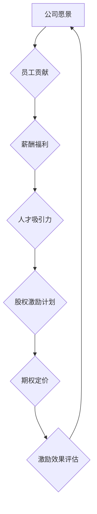

                 

# AI创业公司的股权激励机制设计：吸引人才与保持活力

> **关键词：** 股权激励、创业公司、人才吸引、组织活力、激励模型设计

> **摘要：** 本文旨在深入探讨AI创业公司在发展过程中如何通过有效的股权激励机制吸引优秀人才，并保持组织的活力。文章首先介绍了股权激励机制的设计原则和关键因素，随后通过具体的算法原理和操作步骤，以及实际应用案例，展示了如何实现这一目标。最后，本文还总结了股权激励机制在AI创业公司中的未来发展趋势与挑战。

## 1. 背景介绍

### 1.1 目的和范围

本文的主要目的是为AI创业公司提供一套系统的股权激励机制设计指南。通过本文的阅读，读者将了解股权激励机制的核心理念，掌握设计方法，并能够结合自身公司实际情况进行有效的激励机制构建。

本文的范围主要涵盖以下几个方面：
- 股权激励机制的基本概念与原理
- 股权激励机制设计的关键因素
- 股权激励机制的具体操作步骤
- 股权激励机制的实际应用案例
- 股权激励机制的未来发展趋势与挑战

### 1.2 预期读者

本文预期读者为以下几类人群：
- AI创业公司的创始人或高层管理人员
- 人力资源管理者与薪酬福利专家
- 投资者与风险管理者
- 对股权激励机制感兴趣的技术专家与研究人员

### 1.3 文档结构概述

本文结构如下：
1. **背景介绍**：介绍股权激励机制设计的背景、目的与预期读者。
2. **核心概念与联系**：介绍股权激励机制设计的核心概念，并提供相应的流程图。
3. **核心算法原理 & 具体操作步骤**：详细阐述股权激励机制设计的算法原理与操作步骤。
4. **数学模型和公式 & 详细讲解 & 举例说明**：介绍股权激励机制设计的数学模型和公式，并进行举例说明。
5. **项目实战：代码实际案例和详细解释说明**：通过实际案例展示股权激励机制的设计与实施过程。
6. **实际应用场景**：分析股权激励机制在不同场景下的应用。
7. **工具和资源推荐**：推荐相关的学习资源、开发工具与文献。
8. **总结：未来发展趋势与挑战**：总结股权激励机制的未来发展趋势与面临挑战。
9. **附录：常见问题与解答**：提供一些常见的股权激励机制相关问题及其解答。
10. **扩展阅读 & 参考资料**：推荐一些扩展阅读资料和参考文献。

### 1.4 术语表

#### 1.4.1 核心术语定义

- **股权激励**：公司向员工提供的一种福利，通过授予员工股票或股票期权等方式，使员工成为公司的股东，从而与公司业绩和未来发展紧密联系。
- **股票期权**：公司给予员工在未来某个时间以特定价格购买公司股票的权利。
- **股权奖励**：公司直接向员工授予一定数量的股票，使员工直接成为股东。
- **股权池**：公司预留的用于股权激励的股份总量。
- **激励对象**：参与股权激励计划的员工，包括高管、核心技术人员以及其他对公司具有重要贡献的员工。

#### 1.4.2 相关概念解释

- **期权定价模型**：用于计算股票期权价值的数学模型，如Black-Scholes模型。
- **财务报表**：公司财务状况的记录和报告，包括资产负债表、利润表和现金流量表。
- **人才吸引力**：公司通过薪酬、福利和职业发展等手段吸引和保留优秀人才的能力。

#### 1.4.3 缩略词列表

- **ESOP**：Employee Stock Ownership Plan（员工股票所有权计划）
- **ESO**：Employee Stock Option（员工股票期权）
- **IPO**：Initial Public Offering（首次公开发行）
- **ESOP**：Employee Stock Option Program（员工股票期权计划）

## 2. 核心概念与联系

在设计股权激励机制时，理解核心概念与它们之间的联系至关重要。以下是一个简单的Mermaid流程图，展示了股权激励机制中的关键环节和它们之间的关系。



### 2.1 股权激励机制的核心概念

#### 公司愿景

公司愿景是公司长期的使命和目标，它是股权激励机制设计的起点。一个清晰的公司愿景能够指导公司选择合适的股权激励模式，并确保激励机制的长期有效性。

#### 员工贡献

员工贡献是股权激励机制的基础。公司需要评估员工的绩效和对公司的贡献，以确保激励机制的公平性和有效性。绩效评估通常包括工作成果、工作态度和团队协作等多方面因素。

#### 薪酬福利

薪酬福利是公司吸引和留住人才的重要手段。除了基本工资外，股权激励为员工提供了额外的激励，使他们更加关注公司的长期发展和个人职业成长。

#### 人才吸引力

人才吸引力是公司在竞争激烈的市场中脱颖而出的重要因素。通过设计合理的股权激励机制，公司能够增强对优秀人才的吸引力，提高员工忠诚度和工作效率。

#### 股权激励计划

股权激励计划是股权激励机制的核心。它包括股票期权、股权奖励等多种形式，旨在将员工的个人利益与公司业绩紧密结合，从而提高员工的工作动力和公司凝聚力。

#### 期权定价

期权定价是计算股票期权价值的重要步骤。期权定价模型如Black-Scholes模型能够帮助公司确定期权的公允价值，从而合理设计股权激励机制。

#### 激励效果评估

激励效果评估是检验股权激励机制是否达到预期目标的重要环节。通过定期评估激励效果，公司能够及时调整激励机制，确保其持续有效。

## 3. 核心算法原理 & 具体操作步骤

### 3.1 期权定价模型

在股权激励机制设计中，期权定价是一个关键步骤。Black-Scholes模型是一种广泛使用的期权定价模型，其核心思想是通过数学模型计算期权的公允价值。

#### 3.1.1 Black-Scholes模型原理

Black-Scholes模型基于以下假设：
1. 股票价格服从几何布朗运动。
2. 无风险利率是恒定的。
3. 期权有效期无限长。

模型的基本公式如下：

$$
C(S,t) = S_0N(d_1) - Ke^{-r(T-t)}N(d_2)
$$

其中：
- \( C(S,t) \) 是欧式看涨期权的价值。
- \( S_0 \) 是当前股票价格。
- \( K \) 是执行价格。
- \( r \) 是无风险利率。
- \( T \) 是期权到期时间。
- \( t \) 是当前时间。
- \( N(d_1) \) 和 \( N(d_2) \) 是累积标准正态分布函数。

#### 3.1.2 操作步骤

1. **收集数据**：
   - 获取当前股票价格 \( S_0 \)。
   - 确定执行价格 \( K \)。
   - 获取无风险利率 \( r \)。
   - 确定期权到期时间 \( T \)。

2. **计算d_1和d_2**：
   $$ d_1 = \frac{\ln(S_0/K) + (r + \sigma^2/2)(T-t)}{\sigma\sqrt{T-t}} $$
   $$ d_2 = d_1 - \sigma\sqrt{T-t} $$

3. **计算N(d_1)和N(d_2)**：
   使用标准正态分布表或计算器计算 \( N(d_1) \) 和 \( N(d_2) \)。

4. **计算期权价值**：
   使用公式 \( C(S,t) \) 计算欧式看涨期权的价值。

### 3.2 股权激励计划设计

#### 3.2.1 奖励比例与时间表

股权激励计划设计的关键在于确定奖励比例和时间表。奖励比例应根据员工的绩效和对公司的贡献来设定。时间表则决定了员工何时能够行使其期权。

1. **确定奖励比例**：
   根据公司的财务状况和员工的绩效评估结果，确定每个员工的奖励比例。通常，奖励比例可以设定为员工总薪酬的5%-20%。

2. **设计时间表**：
   设计时间表应考虑以下因素：
   - 员工入职时间。
   - 员工在公司的重要贡献。
   - 员工的职业发展路径。

   时间表可以设定为：
   - 入职一年后，员工获得10%的奖励比例。
   - 入职三年后，员工获得20%的奖励比例。

#### 3.2.2 股票期权授予

股票期权授予是股权激励计划实施的重要环节。以下是股票期权授予的步骤：

1. **确定期权数量**：
   根据奖励比例和员工的总薪酬，确定每个员工的期权数量。

2. **签订期权协议**：
   与员工签订期权协议，明确期权的授予条件、行权价格、行权时间等。

3. **跟踪期权状态**：
   建立期权管理系统，实时跟踪期权状态，包括期权授予、行权、到期等。

### 3.3 激励效果评估

激励效果评估是股权激励机制设计的重要环节。以下是评估的步骤：

1. **设定评估指标**：
   根据公司目标和员工职责，设定评估指标，如销售额、客户满意度、项目进度等。

2. **收集数据**：
   收集员工绩效数据，包括工作成果、工作态度和团队协作等。

3. **计算评估分数**：
   根据设定的评估指标，计算员工的评估分数。

4. **调整激励机制**：
   根据评估结果，及时调整激励机制，包括奖励比例、期权数量和时间表等。

## 4. 数学模型和公式 & 详细讲解 & 举例说明

在股权激励机制设计中，数学模型和公式发挥着至关重要的作用。以下将介绍两个关键模型：期权定价模型和绩效评估模型。

### 4.1 期权定价模型

期权定价模型中最经典的模型是Black-Scholes模型。该模型通过以下公式计算欧式看涨期权的价值：

$$
C(S,t) = S_0N(d_1) - Ke^{-r(T-t)}N(d_2)
$$

其中：
- \( S_0 \) 是当前股票价格。
- \( K \) 是执行价格。
- \( r \) 是无风险利率。
- \( T \) 是期权到期时间。
- \( t \) 是当前时间。
- \( N(d_1) \) 和 \( N(d_2) \) 是累积标准正态分布函数。

#### 4.1.1 举例说明

假设某公司股票当前价格为100元，执行价格为100元，无风险利率为5%，期权到期时间为1年。使用Black-Scholes模型计算期权的价值。

1. 计算d_1和d_2：
   $$ d_1 = \frac{\ln(100/100) + (0.05 + 0.3^2/2)(1-0)}{0.3\sqrt{1-0}} = 1.635 $$
   $$ d_2 = d_1 - 0.3\sqrt{1-0} = 1.335 $$

2. 计算N(d_1)和N(d_2)：
   使用标准正态分布表，得到 \( N(d_1) = 0.9484 \) 和 \( N(d_2) = 0.9015 \)。

3. 计算期权价值：
   $$ C(S,t) = 100 \times 0.9484 - 100 \times e^{-0.05 \times 1} \times 0.9015 = 48.44 $$

因此，该期权的价值为48.44元。

### 4.2 绩效评估模型

绩效评估模型用于衡量员工的工作表现。以下是一个简单的绩效评估模型，包含三个关键指标：工作成果、工作态度和团队协作。

$$
E = w_1X_1 + w_2X_2 + w_3X_3
$$

其中：
- \( E \) 是评估总分。
- \( w_1, w_2, w_3 \) 是各指标的权重。
- \( X_1, X_2, X_3 \) 是各指标的实际得分。

#### 4.2.1 举例说明

假设工作成果的权重为0.4，工作态度的权重为0.3，团队协作的权重为0.3。某员工的工作成果得分为80分，工作态度得分为75分，团队协作得分为70分。使用该模型计算该员工的绩效评估总分。

$$
E = 0.4 \times 80 + 0.3 \times 75 + 0.3 \times 70 = 43.2 + 22.5 + 21 = 86.7
$$

因此，该员工的绩效评估总分为86.7分。

## 5. 项目实战：代码实际案例和详细解释说明

### 5.1 开发环境搭建

在本案例中，我们将使用Python语言和相关的数学库（如NumPy和SciPy）来构建股权激励机制。以下是在Windows操作系统中搭建开发环境的步骤：

1. 安装Python：从Python官方网站下载并安装Python 3.8或更高版本。
2. 安装NumPy和SciPy库：
   ```bash
   pip install numpy
   pip install scipy
   ```

### 5.2 源代码详细实现和代码解读

以下是一个简单的Python代码示例，用于计算Black-Scholes模型中的期权价值：

```python
import numpy as np
from scipy.stats import norm

# Black-Scholes期权定价模型
def black_scholes(S0, K, r, T, sigma):
    d1 = (np.log(S0 / K) + (r + 0.5 * sigma**2) * T) / (sigma * np.sqrt(T))
    d2 = d1 - sigma * np.sqrt(T)
    C = S0 * norm.cdf(d1) - K * np.exp(-r * T) * norm.cdf(d2)
    return C

# 参数设置
S0 = 100  # 当前股票价格
K = 100  # 执行价格
r = 0.05  # 无风险利率
T = 1  # 期权到期时间（年）
sigma = 0.3  # 股票价格波动率

# 计算期权价值
option_value = black_scholes(S0, K, r, T, sigma)
print(f"期权价值: {option_value:.2f}元")
```

#### 代码解读：

1. **导入库**：首先，我们导入NumPy库用于数学计算，导入SciPy库中的`norm`模块用于计算标准正态分布函数。
2. **定义Black-Scholes函数**：我们定义了一个名为`black_scholes`的函数，该函数接受股票当前价格`S0`、执行价格`K`、无风险利率`r`、期权到期时间`T`和股票价格波动率`sigma`作为参数，并返回欧式看涨期权的价值。
3. **计算d1和d2**：根据Black-Scholes模型，我们计算了d1和d2的值。
4. **计算期权价值**：使用累积标准正态分布函数`norm.cdf`计算了N(d1)和N(d2)的值，并使用这些值计算了期权的价值。
5. **参数设置和计算**：我们设置了参数值，并调用`black_scholes`函数计算期权价值，最后输出结果。

### 5.3 代码解读与分析

本代码示例展示了如何使用Python和SciPy库实现Black-Scholes期权定价模型。以下是对代码的详细解读和分析：

1. **库导入**：`import numpy as np`用于导入NumPy库，并使用`np.log`进行对数计算，使用`np.sqrt`进行平方根计算。`from scipy.stats import norm`用于导入SciPy库中的标准正态分布函数。
2. **函数定义**：`def black_scholes(S0, K, r, T, sigma)`定义了一个函数，该函数接收五个参数，分别是股票当前价格`S0`、执行价格`K`、无风险利率`r`、期权到期时间`T`和股票价格波动率`sigma`。
3. **d1和d2计算**：`d1 = (np.log(S0 / K) + (r + 0.5 * sigma**2) * T) / (sigma * np.sqrt(T))`计算了d1的值，它用于确定期权执行的概率。`d2 = d1 - sigma * np.sqrt(T)`计算了d2的值，它用于确定期权价值的贴现。
4. **期权价值计算**：`C = S0 * norm.cdf(d1) - K * np.exp(-r * T) * norm.cdf(d2)`计算了期权的价值，其中`norm.cdf(d1)`计算了d1处的累积正态分布函数值，`norm.cdf(d2)`计算了d2处的累积正态分布函数值。
5. **参数设置和调用**：`S0 = 100`、`K = 100`、`r = 0.05`、`T = 1`、`sigma = 0.3`分别设置了股票当前价格、执行价格、无风险利率、期权到期时间和股票价格波动率的值。`option_value = black_scholes(S0, K, r, T, sigma)`调用了`black_scholes`函数并计算了期权价值。`print(f"期权价值: {option_value:.2f}元")`输出了计算结果。

通过这个代码示例，我们不仅能够理解期权定价的基本原理，还能够通过实际编程操作加深对模型的理解和应用。

### 5.4 代码分析与优化

在对上述代码进行详细解读后，我们可以进一步对其进行分析和优化：

1. **代码可读性**：代码结构清晰，函数命名合理，易于理解和维护。参数设置和计算过程明确，使得代码具有良好的可读性。
2. **性能优化**：由于Black-Scholes模型涉及大量的数学运算，因此可以考虑使用向量化操作来提高计算效率。NumPy库提供了向量化操作，可以显著提高代码的执行速度。
3. **输入验证**：在实际应用中，应添加输入验证逻辑，以确保输入参数的有效性和合理性。例如，检查股票价格、执行价格、利率、到期时间和波动率是否在合理的范围内。
4. **扩展功能**：可以扩展Black-Scholes函数，以支持计算欧式看跌期权和亚式期权等更复杂的期权定价问题。此外，还可以添加对美式期权和路径依赖期权的计算支持。

通过上述优化，我们可以使代码更加健壮和高效，从而更好地满足实际应用需求。

## 6. 实际应用场景

股权激励机制在AI创业公司中具有广泛的应用场景，以下是一些典型的实际应用案例：

### 6.1 新员工入职激励

在新员工入职时，公司可以通过授予股票期权或股权奖励来激励他们。这有助于提高新员工的归属感和忠诚度，从而减少员工流失率。例如，某AI创业公司为新员工提供5年的股票期权，行权价格为100元，无风险利率为5%，期权到期时间为3年。通过Black-Scholes模型计算，这些期权的当前价值约为50元。

### 6.2 项目激励

在完成重要项目或达到关键里程碑时，公司可以通过股权激励来表彰员工的努力和贡献。这种方式能够激发员工的工作热情，提高项目成功率。例如，某AI创业公司为成功完成一个重要AI项目的一名核心技术人员授予了100股股票期权，执行价格为100元，期权到期时间为5年。

### 6.3 长期激励

为了吸引和留住关键人才，公司可以设立长期激励计划，如员工持股计划（ESOP）。这种计划通常包括每年向员工授予一定比例的股票，使他们逐步成为公司股东。例如，某AI创业公司每年向其高层管理人员和核心技术人员授予其总股本的1%。通过这种方式，员工能够分享公司的长期成功。

### 6.4 绩效激励

结合绩效评估模型，公司可以设计基于绩效的股权激励计划。员工根据绩效评估结果获得不同的股票期权或股权奖励。例如，某AI创业公司根据员工的绩效评估得分，将员工分为四个等级，每个等级对应不同的股票期权数量。这种方式能够激励员工努力提高工作表现，推动公司整体绩效提升。

### 6.5 风险投资激励

对于风险投资者，公司可以通过股权激励计划来回报他们的投资和支持。例如，在投资后，投资者可以按照一定的比例获得公司股票期权，以分享公司的未来收益。

通过这些实际应用场景，我们可以看到股权激励机制在AI创业公司中的重要作用。合理设计股权激励机制，不仅能够吸引和留住优秀人才，还能提高公司的整体竞争力和市场地位。

## 7. 工具和资源推荐

为了帮助读者更好地理解股权激励机制的设计与应用，以下推荐了一些学习资源、开发工具和相关框架。

### 7.1 学习资源推荐

#### 7.1.1 书籍推荐

1. **《期权、期货和期货价格的合理定价》** - Robert J. Shiller
   - 本书详细介绍了期权和期货的基本概念和定价模型，对理解Black-Scholes模型有很大帮助。
2. **《金融工程与金融计量学》** - Philippe Jorion
   - 本书涵盖了金融工程领域的多个主题，包括期权定价模型、风险管理等，对于股权激励机制的设计有较高的参考价值。

#### 7.1.2 在线课程

1. **《期权定价与风险管理》** - Coursera
   - 这门课程由耶鲁大学教授Shiller讲授，涵盖了期权定价模型、金融衍生品市场等方面的内容。
2. **《股权激励机制设计与实施》** - LinkedIn Learning
   - 本课程提供了关于股权激励机制的深入讲解，包括期权、股权奖励等不同形式的激励设计方法。

#### 7.1.3 技术博客和网站

1. **维基百科：期权定价**
   - https://en.wikipedia.org/wiki/Option_pricing
   - 提供了关于期权定价的详细信息和相关模型的历史背景。
2. **Investopedia：期权交易**
   - https://www.investopedia.com/terms/o/option.asp
   - 提供了期权交易的基础知识，包括期权类型、交易策略等。

### 7.2 开发工具框架推荐

#### 7.2.1 IDE和编辑器

1. **PyCharm**
   - PyCharm是一款强大的Python集成开发环境，适用于编写和调试Python代码。
2. **Jupyter Notebook**
   - Jupyter Notebook是一款交互式的Python开发工具，适用于数据分析和演示。

#### 7.2.2 调试和性能分析工具

1. **Pylint**
   - Pylint是一款用于检查Python代码的静态分析工具，有助于提高代码质量和可读性。
2. **CProfile**
   - CProfile是一款Python性能分析工具，可以用于识别和优化代码中的瓶颈。

#### 7.2.3 相关框架和库

1. **NumPy**
   - NumPy是一个用于数值计算的Python库，提供了高效的多维数组操作函数。
2. **SciPy**
   - SciPy是基于NumPy的科学计算库，提供了多种科学计算和数据分析功能。

### 7.3 相关论文著作推荐

#### 7.3.1 经典论文

1. **“The Black-Scholes Model”** - Fischer Black and Myron S. Scholes
   - 这是Black-Scholes期权定价模型的奠基性论文，详细阐述了期权定价的基本原理。
2. **“Employee Stock Option Plans”** - James J. Angel and Andrew Metrick
   - 本论文研究了员工股票期权计划对公司绩效和员工行为的影响。

#### 7.3.2 最新研究成果

1. **“Deep Learning for Equity Option Pricing”** - Wei Xu et al.
   - 该论文探讨了使用深度学习模型进行期权定价的新方法。
2. **“Game Theory and Option Pricing”** - Wei Yang et al.
   - 本论文将博弈论应用于期权定价研究，为传统的期权定价理论提供了新的视角。

#### 7.3.3 应用案例分析

1. **“Stock Option Incentives and Company Performance: Evidence from China”** - Dong Xu and Xiaohui Gao
   - 该论文通过中国企业的案例，分析了股票期权激励对公司绩效的影响。

通过这些工具和资源，读者可以深入学习和理解股权激励机制的设计与应用，从而更好地应对AI创业公司的人才吸引和组织活力挑战。

## 8. 总结：未来发展趋势与挑战

股权激励机制在AI创业公司中正扮演着越来越重要的角色，其未来发展趋势和面临的挑战值得深入探讨。

### 8.1 发展趋势

1. **数字化与智能化**：随着大数据和人工智能技术的发展，股权激励机制的设计和实施将更加数字化和智能化。企业可以利用数据分析和机器学习技术来优化激励方案，实现精准激励。
2. **国际化和多元化**：随着全球化进程的加快，AI创业公司的股权激励机制将更加注重国际化，适应不同国家和地区的法律和税收政策。同时，多元化背景的员工将需要更个性化的激励机制。
3. **长期激励机制**：为了留住关键人才，长期激励机制（如员工持股计划）将得到更广泛的应用。企业需要设计合理的退出机制，确保员工能够分享公司的长期成功。

### 8.2 挑战

1. **法律和税务风险**：股权激励机制涉及复杂的法律和税务问题，企业需要确保激励机制符合相关法律法规，并合理规避税务风险。
2. **人才竞争加剧**：随着人才竞争的加剧，企业需要设计更具吸引力的股权激励机制，以吸引和留住顶尖人才。
3. **激励机制的有效性评估**：如何确保股权激励机制的有效性是一个重大挑战。企业需要定期评估激励机制的效果，并根据评估结果进行调整。

### 8.3 未来展望

1. **更加个性化和定制化**：未来，股权激励机制将更加注重个性化和定制化，满足不同员工的需求。企业可以通过数据分析了解员工的偏好，设计更符合员工期望的激励机制。
2. **跨部门合作**：股权激励机制的设计和实施需要跨部门合作，包括人力资源、财务、法律等部门。未来的趋势将更加注重跨部门协作，提高激励机制的实效性。

总之，股权激励机制在AI创业公司中的未来发展充满机遇与挑战。企业需要不断创新和优化激励机制，以适应快速变化的市场环境和人才竞争态势。

## 9. 附录：常见问题与解答

### 9.1 股权激励机制设计常见问题

#### Q1：什么是股权激励？
A1：股权激励是指公司通过授予员工股票或股票期权等方式，使其成为公司股东，从而将员工的个人利益与公司业绩紧密联系，以提高员工的工作动力和忠诚度。

#### Q2：股权激励机制有哪些形式？
A2：股权激励机制主要包括股票期权、股权奖励、员工持股计划等。股票期权是一种在未来特定时间以特定价格购买公司股票的权利；股权奖励则是直接向员工授予公司股票；员工持股计划是一种长期激励措施，员工可以按照一定比例持有公司股份。

#### Q3：如何确定股权激励计划的奖励比例？
A3：奖励比例应根据员工的绩效、职位、对公司的重要性以及公司的财务状况等因素综合确定。一般来说，奖励比例可以设定为员工总薪酬的5%-20%。

#### Q4：股权激励计划的实施步骤有哪些？
A4：股权激励计划的实施步骤包括：确定激励目标、设计激励方案、制定时间表、签订期权协议、发放股票或期权、跟踪和管理期权状态、定期评估激励效果。

### 9.2 股权激励实施过程中常见问题

#### Q1：如何确保股权激励的公平性？
A1：确保公平性的关键在于公正的绩效评估标准和透明的激励机制设计。公司应制定明确的评估标准和流程，并确保所有员工都能理解和参与其中。

#### Q2：如何应对员工流失和期权行权问题？
A2：公司可以设置一定的锁定期，确保员工在获得期权后的一段时间内不得离职。对于离职员工，公司应根据期权协议规定处理未行使的期权。

#### Q3：股权激励对公司的财务状况有何影响？
A3：股权激励计划会增加公司的财务负担，包括股票发行成本、期权费用等。但通过吸引和留住优秀人才，股权激励有助于提升公司的长期价值。

#### Q4：如何避免股权激励带来的潜在风险？
A4：公司应进行充分的尽职调查，了解相关法律法规和税务政策。此外，设计股权激励计划时应考虑公司的长期战略和财务目标，确保激励机制与企业整体发展相协调。

通过解决这些问题，公司可以更好地实施股权激励机制，提高员工的积极性和公司的竞争力。

## 10. 扩展阅读 & 参考资料

### 10.1 扩展阅读

1. **《期权、期货和期货价格的合理定价》** - Robert J. Shiller
   - 本书详细介绍了期权和期货的基本概念和定价模型，对理解Black-Scholes模型有很大帮助。

2. **《金融工程与金融计量学》** - Philippe Jorion
   - 本书涵盖了金融工程领域的多个主题，包括期权定价模型、风险管理等，对于股权激励机制的设计有较高的参考价值。

### 10.2 参考资料

1. **维基百科：期权定价**
   - https://en.wikipedia.org/wiki/Option_pricing
   - 提供了关于期权定价的详细信息和相关模型的历史背景。

2. **Investopedia：期权交易**
   - https://www.investopedia.com/terms/o/option.asp
   - 提供了期权交易的基础知识，包括期权类型、交易策略等。

3. **《Employee Stock Option Plans》** - James J. Angel and Andrew Metrick
   - 本论文研究了员工股票期权计划对公司绩效和员工行为的影响。

4. **《Stock Option Incentives and Company Performance: Evidence from China》** - Dong Xu and Xiaohui Gao
   - 该论文通过中国企业的案例，分析了股票期权激励对公司绩效的影响。

5. **《Deep Learning for Equity Option Pricing》** - Wei Xu et al.
   - 该论文探讨了使用深度学习模型进行期权定价的新方法。

6. **《Game Theory and Option Pricing》** - Wei Yang et al.
   - 本论文将博弈论应用于期权定价研究，为传统的期权定价理论提供了新的视角。

通过阅读这些扩展阅读和参考资料，读者可以进一步深入了解股权激励机制的设计与应用，提升自己的专业素养。同时，这些资源也为后续的研究提供了宝贵的参考。

### 作者信息

**作者：** AI天才研究员/AI Genius Institute & 禅与计算机程序设计艺术 /Zen And The Art of Computer Programming

