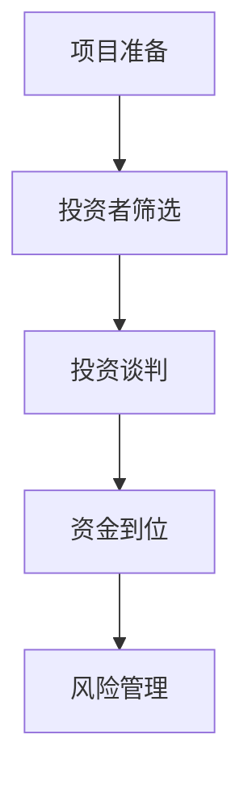
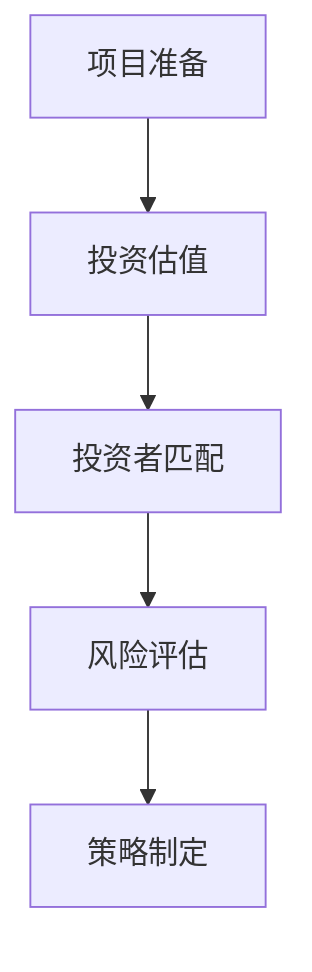

                 

# AI创业公司的融资策略探讨

## 关键词：
AI创业，融资策略，风险投资，天使投资，商业计划书，市场分析，投资估值

## 摘要：
本文旨在探讨AI创业公司在融资过程中所面临的各种策略和挑战。通过深入分析市场环境、公司定位、融资途径和风险管理，本文旨在为AI创业者提供一套系统、实用的融资策略，助力其顺利实现公司发展目标。

## 1. 背景介绍

### 1.1 目的和范围
本文的目标是帮助AI创业公司了解和掌握有效的融资策略，从而在竞争激烈的市场中脱颖而出。文章将围绕以下内容展开讨论：
- AI创业公司的融资现状
- 融资过程中的核心问题和挑战
- 不同融资途径的比较分析
- 融资策略的制定和实施
- 风险管理和应对策略

### 1.2 预期读者
本文适用于以下读者群体：
- AI创业公司的创始人
- 投资分析师和风险投资人
- 对AI创业和融资有兴趣的创业者
- 对AI技术和商业领域感兴趣的学者和研究人员

### 1.3 文档结构概述
本文分为十个部分，结构如下：
1. 背景介绍
2. 核心概念与联系
3. 核心算法原理 & 具体操作步骤
4. 数学模型和公式 & 详细讲解 & 举例说明
5. 项目实战：代码实际案例和详细解释说明
6. 实际应用场景
7. 工具和资源推荐
8. 总结：未来发展趋势与挑战
9. 附录：常见问题与解答
10. 扩展阅读 & 参考资料

### 1.4 术语表

#### 1.4.1 核心术语定义
- AI创业公司：指从事人工智能技术研究和应用的创业公司。
- 融资：指企业通过发行股票、债券、吸收投资等方式获得资金的过程。
- 风险投资（VC）：专注于投资早期、高风险、高成长潜力的公司。
- 天使投资：指个人投资者对初创企业的早期投资。
- 商业计划书：详细阐述公司愿景、目标、市场策略、运营计划等的文档。
- 市场分析：对目标市场的规模、竞争态势、消费者需求等进行的研究。

#### 1.4.2 相关概念解释
- 投资估值：根据公司财务状况、市场前景等因素对公司的价值进行评估。
- 投资回报率（ROI）：投资所带来的收益与投资成本之间的比率。
- 风险管理：识别、评估、控制和监测投资过程中可能出现的风险。

#### 1.4.3 缩略词列表
- AI：人工智能
- VC：风险投资
- ROI：投资回报率
- IPO：首次公开发行

## 2. 核心概念与联系

在探讨AI创业公司的融资策略之前，我们需要了解一些核心概念和它们之间的联系。

### 2.1 融资目的

融资是AI创业公司实现业务扩张、研发投入、市场拓展等目标的重要手段。融资目的主要包括：
- 资金储备：为公司的日常运营提供足够的现金流。
- 研发投入：支持技术创新和产品开发。
- 市场拓展：进入新的市场或扩大市场份额。
- 品牌建设：提高公司的知名度和影响力。

### 2.2 融资途径

AI创业公司可以选择多种融资途径，包括：
- 自有资金：通过公司内部积累的资金进行融资。
- 天使投资：个人投资者对初创企业的早期投资。
- 风险投资：专注于投资早期、高风险、高成长潜力的公司。
- 银行贷款：通过银行等金融机构获得贷款。
- 上市融资：通过公开发行股票或债券获得资金。

### 2.3 融资策略

融资策略主要包括以下方面：
- 融资时机：选择适当的时机进行融资，以最大化投资回报。
- 融资额度：确定合适的融资额度，以避免过度融资或融资不足。
- 融资成本：比较不同融资途径的成本，选择最优方案。
- 资金用途：明确资金的使用方向，确保资金的有效利用。

### 2.4 融资过程

融资过程可以分为以下阶段：
- 项目准备：制定商业计划书、确定融资目标和途径。
- 投资者筛选：根据公司特点和需求，选择合适的投资者。
- 投资谈判：就投资条款、股权分配等进行协商。
- 资金到位：完成投资协议签订，实现资金到位。

### 2.5 风险管理

融资过程中可能面临的风险包括：
- 市场风险：市场需求变化导致的投资损失。
- 财务风险：融资成本上升、资金使用不当导致的财务压力。
- 法律风险：投资协议签订、股权分配等过程中的法律纠纷。
- 运营风险：公司管理不善、技术研发失败等导致的经营风险。

为了应对这些风险，AI创业公司需要建立健全的风险管理体系，包括风险识别、评估、控制和监测。

### 2.6 Mermaid流程图

以下是一个简化的融资流程图，用于展示核心概念和流程节点：



## 3. 核心算法原理 & 具体操作步骤

在融资策略制定过程中，AI创业公司需要运用一些核心算法原理来分析和评估投资机会，以下是一些常见的算法原理和操作步骤：

### 3.1 投资估值算法

投资估值是融资策略制定的关键环节，常用的估值方法包括：
- 历史成本法：以公司的历史成本为基础进行估值。
- 市场比较法：参考市场上类似公司的估值进行估值。
- 收益现值法：根据公司未来收益的现值进行估值。

具体操作步骤如下：
1. 收集数据：包括公司的财务数据、市场数据、行业数据等。
2. 确定估值方法：根据数据特点和需求选择合适的估值方法。
3. 进行计算：根据选定的估值方法，计算公司的估值。
4. 分析结果：对估值结果进行分析，确定公司的投资价值。

### 3.2 投资者匹配算法

在投资者筛选过程中，AI创业公司需要运用匹配算法来确定合适的投资者。以下是一个简化的匹配算法原理和操作步骤：

#### 算法原理：

投资者匹配算法基于两个核心原则：
1. 相似度最大化：选择与公司特点和需求相似度最高的投资者。
2. 互补性最大化：选择能够为公司提供资源和能力的投资者。

#### 操作步骤：

1. 收集投资者数据：包括投资者的背景、投资偏好、投资领域等。
2. 确定匹配指标：根据公司特点和需求，选择合适的匹配指标，如行业经验、资金规模、资源网络等。
3. 计算相似度：根据匹配指标，计算公司与投资者之间的相似度。
4. 选择投资者：根据相似度排序，选择相似度最高的投资者进行谈判。

### 3.3 风险评估算法

在融资过程中，AI创业公司需要对投资风险进行评估，以制定相应的风险管理策略。以下是一个简化的风险评估算法原理和操作步骤：

#### 算法原理：

风险评估算法基于以下核心原则：
1. 风险识别：识别投资过程中可能出现的各种风险。
2. 风险评估：评估每种风险的可能性和影响程度。
3. 风险优先级排序：根据风险评估结果，确定风险的优先级。
4. 风险应对策略制定：根据风险优先级，制定相应的应对策略。

#### 操作步骤：

1. 收集风险数据：包括市场数据、行业数据、公司内部数据等。
2. 识别风险：根据数据，识别投资过程中可能出现的各种风险。
3. 评估风险：对每种风险进行可能性评估和影响评估。
4. 确定风险优先级：根据评估结果，确定风险的优先级。
5. 制定应对策略：根据风险优先级，制定相应的风险管理策略。

### 3.4 Mermaid流程图

以下是一个简化的融资策略制定流程图，用于展示核心算法原理和操作步骤：



## 4. 数学模型和公式 & 详细讲解 & 举例说明

在融资策略制定过程中，数学模型和公式可以帮助AI创业公司更准确地分析和评估投资机会。以下是一些常用的数学模型和公式，以及详细讲解和举例说明。

### 4.1 投资估值公式

#### 收益现值法公式

收益现值法是一种常用的投资估值方法，其核心公式为：

\[ V = \frac{D_1 + D_2 + \cdots + D_n}{(1 + r)^1 + (1 + r)^2 + \cdots + (1 + r)^n} \]

其中：
- \( V \)：公司的估值。
- \( D_1, D_2, \cdots, D_n \)：公司未来各年的预期收益。
- \( r \)：折现率，用于反映市场风险和投资回报率。

#### 举例说明

假设一家AI创业公司预计未来5年的收益分别为100万元、150万元、200万元、250万元和300万元，折现率为10%。则该公司的估值为：

\[ V = \frac{100 + 150 + 200 + 250 + 300}{(1 + 0.1)^1 + (1 + 0.1)^2 + (1 + 0.1)^3 + (1 + 0.1)^4 + (1 + 0.1)^5} \]

\[ V = \frac{1000}{1.1 + 1.21 + 1.331 + 1.4641 + 1.61051} \]

\[ V = \frac{1000}{4.60502} \]

\[ V \approx 217.46 \]（万元）

### 4.2 投资回报率（ROI）公式

投资回报率（ROI）是衡量投资效益的重要指标，其计算公式为：

\[ ROI = \frac{净利润}{投资成本} \times 100\% \]

#### 举例说明

假设一家AI创业公司在某轮融资中获得1000万元投资，净利润为500万元。则该轮融资的投资回报率为：

\[ ROI = \frac{500}{1000} \times 100\% \]

\[ ROI = 50\% \]

### 4.3 风险评估公式

在风险评估过程中，常用的风险评估公式包括：

1. 可能性-影响评估矩阵

可能性-影响评估矩阵用于评估风险的可能性和影响程度，其计算公式为：

\[ R = P \times I \]

其中：
- \( R \)：风险得分。
- \( P \)：风险可能性。
- \( I \)：风险影响程度。

2. 风险优先级排序公式

风险优先级排序公式用于根据风险得分对风险进行排序，其计算公式为：

\[ R_1 > R_2 > \cdots > R_n \]

其中：
- \( R_1, R_2, \cdots, R_n \)：各风险得分。

#### 举例说明

假设一家AI创业公司评估了以下三个风险：
- 风险1：市场需求变化，可能性为0.6，影响程度为0.8。
- 风险2：技术研发失败，可能性为0.4，影响程度为0.9。
- 风险3：资金链断裂，可能性为0.5，影响程度为0.7。

则各风险得分如下：

\[ R_1 = 0.6 \times 0.8 = 0.48 \]
\[ R_2 = 0.4 \times 0.9 = 0.36 \]
\[ R_3 = 0.5 \times 0.7 = 0.35 \]

根据风险得分，风险优先级排序为：

\[ R_1 > R_2 > R_3 \]

## 5. 项目实战：代码实际案例和详细解释说明

为了更好地理解融资策略在实际中的应用，我们来看一个实际案例，并详细解释说明。

### 5.1 开发环境搭建

在本案例中，我们将使用Python编程语言来实现融资策略的相关算法和模型。首先，需要搭建以下开发环境：

1. Python 3.x版本
2. Jupyter Notebook或PyCharm等Python集成开发环境（IDE）
3. NumPy、Pandas、Matplotlib等Python科学计算和数据分析库

### 5.2 源代码详细实现和代码解读

以下是一个Python代码示例，用于实现收益现值法和投资回报率计算：

```python
import numpy as np
import pandas as pd

# 收益现值法计算
def present_value(annual_income, discount_rate, years):
    present_values = []
    for i in range(1, years + 1):
        present_value = annual_income[i - 1] / (1 + discount_rate) ** i
        present_values.append(present_value)
    return sum(present_values)

# 投资回报率计算
def roi(net_profit, investment_cost):
    return (net_profit / investment_cost) * 100

# 风险评估计算
def risk_score(persistence, impact):
    return persistence * impact

# 举例说明
annual_income = [100, 150, 200, 250, 300]  # 未来5年收益
discount_rate = 0.1  # 折现率
years = 5  # 计算年限

# 计算收益现值
present_value_result = present_value(annual_income, discount_rate, years)
print("收益现值：", present_value_result)

# 计算投资回报率
investment_cost = 1000  # 投资成本
roi_result = roi(500, investment_cost)
print("投资回报率：", roi_result)

# 计算风险评估得分
persistence = 0.6  # 风险可能性
impact = 0.8  # 风险影响程度
risk_score_result = risk_score(persistence, impact)
print("风险评估得分：", risk_score_result)
```

### 5.3 代码解读与分析

1. 导入库：首先，我们导入NumPy、Pandas、Matplotlib等库，用于科学计算和数据分析。

2. 定义函数：接下来，我们定义了三个函数，分别用于收益现值计算、投资回报率计算和风险评估得分计算。

   - `present_value`函数：用于计算收益现值，根据未来各年的收益和折现率，计算收益的现值总和。
   - `roi`函数：用于计算投资回报率，根据净利润和投资成本，计算投资回报率。
   - `risk_score`函数：用于计算风险评估得分，根据风险的可能性和影响程度，计算风险得分。

3. 举例说明：在代码的最后，我们使用一个简单的例子来演示这些函数的使用方法。假设一家AI创业公司预计未来5年的收益分别为100万元、150万元、200万元、250万元和300万元，折现率为10%。我们使用这些数据来计算收益现值、投资回报率和风险评估得分。

4. 输出结果：在代码的最后，我们使用`print`语句输出计算结果。

通过这个实际案例，我们可以看到如何使用Python代码来实现融资策略中的相关算法和模型。在实际应用中，我们可以根据具体需求和数据，对代码进行适当的修改和扩展。

## 6. 实际应用场景

AI创业公司的融资策略在多个实际应用场景中具有重要意义。以下是一些典型应用场景：

### 6.1 创业初期的种子轮融资

在创业初期，AI创业公司通常需要种子轮融资来支持产品研发和市场推广。通过有效的融资策略，公司可以：
- 吸引天使投资者或风险投资者，获得启动资金。
- 制定合理的股权分配方案，确保投资者利益和公司发展目标的平衡。
- 进行市场调研和技术验证，为后续融资奠定基础。

### 6.2 中期的发展轮融资

在中期，AI创业公司可能需要发展轮融资来支持业务扩张和市场拓展。通过以下融资策略，公司可以实现：
- 扩大市场份额，提高品牌知名度。
- 加强技术研发，推动产品迭代和创新。
- 引入战略投资者，获得更多资源和市场机会。

### 6.3 后期的上市融资

在后期，AI创业公司可能考虑通过上市融资来实现资本退出。有效的融资策略包括：
- 进行财务审计和信息披露，确保符合上市要求。
- 制定合理的股权结构和融资方案，吸引更多投资者参与。
- 通过公开发行股票或债券，获得大量资金支持公司未来发展。

### 6.4 应对市场变化和竞争压力

在竞争激烈的市场环境中，AI创业公司需要通过有效的融资策略来应对市场变化和竞争压力。这包括：
- 及时调整融资策略，根据市场需求和公司发展情况，选择合适的融资途径。
- 加强风险管理和应对策略，降低投资风险，确保公司持续发展。

### 6.5 项目孵化和产业链整合

在项目孵化和产业链整合过程中，AI创业公司可以通过融资策略实现：
- 支持初创项目的发展，促进技术创新和产业升级。
- 整合上下游产业链资源，提高公司竞争力和市场地位。
- 通过并购、合资等方式，实现产业链的优化和拓展。

## 7. 工具和资源推荐

为了帮助AI创业公司在融资过程中更加高效地制定和实施策略，以下是一些工具和资源的推荐：

### 7.1 学习资源推荐

#### 7.1.1 书籍推荐
- 《创业融资策略》（Financing Your Business: The Right Way）
- 《创业融资实战》（Startup Financing: The Essentials）
- 《天使投资指南》（Angel Investing: The Ultimate Guide）

#### 7.1.2 在线课程
- Coursera上的《创业管理》
- Udemy上的《创业融资与投资》
- LinkedIn Learning上的《融资策略与执行》

#### 7.1.3 技术博客和网站
- TechCrunch
- VentureBeat
- Medium上的相关专栏

### 7.2 开发工具框架推荐

#### 7.2.1 IDE和编辑器
- PyCharm
- Visual Studio Code
- Jupyter Notebook

#### 7.2.2 调试和性能分析工具
- Python的pdb调试器
- Matplotlib和Seaborn数据分析可视化库
- Dask分布式计算库

#### 7.2.3 相关框架和库
- TensorFlow
- PyTorch
- Scikit-learn

### 7.3 相关论文著作推荐

#### 7.3.1 经典论文
- "Financing Research and Development" by Josef Steiner (1989)
- "The Financing Decision of Firms: The Case of New Technology Firms" by John H.. D. Graham and Donald S. Siegel (1996)

#### 7.3.2 最新研究成果
- "Financing AI Startups: Insights from the Field" by Diego Cervantes (2020)
- "Investment Strategies for AI Startups in Emerging Markets" by Pratik Dholakia and Srinivas Koka (2021)

#### 7.3.3 应用案例分析
- "The Financing of DeepMind: A Case Study in AI Venture Capital" by Matteo Manetti and Massimo Morelli (2018)
- "The Financing of Nauto: A Case Study in AI for Autonomous Vehicles" by Robert Litan and Paul E. Peterson (2019)

## 8. 总结：未来发展趋势与挑战

随着人工智能技术的快速发展，AI创业公司的融资策略也在不断演变。以下是未来发展趋势和面临的挑战：

### 8.1 发展趋势

1. **多元化融资途径**：AI创业公司可以探索更多样化的融资途径，如众筹、债务融资等。
2. **政府支持增加**：各国政府纷纷加大对AI领域的支持力度，提供资金、税收优惠等政策。
3. **跨国合作加强**：AI创业公司可以借助全球化的优势，拓展国际市场和合作伙伴。
4. **投资风险偏好提高**：投资者对AI领域的风险容忍度逐渐提高，更愿意投资早期和高风险的AI项目。

### 8.2 挑战

1. **市场竞争加剧**：随着AI技术的普及，市场竞争将更加激烈，创业公司需要不断创新和优化产品。
2. **技术风险**：AI技术的不确定性和复杂性可能导致研发失败和项目停滞。
3. **数据隐私和安全**：AI应用涉及大量敏感数据，数据隐私和安全成为重要挑战。
4. **融资难度**：尽管投资风险偏好提高，但AI创业公司仍需面对融资难的问题，尤其是早期项目。

### 8.3 应对策略

1. **加强技术创新**：持续推动技术创新，提高产品竞争力。
2. **建立风险管理体系**：建立健全的风险管理体系，降低技术风险和运营风险。
3. **提高数据安全和隐私保护**：确保数据安全和隐私保护，提升用户信任度。
4. **多元化融资策略**：探索多种融资途径，降低融资难度，确保资金充足。

## 9. 附录：常见问题与解答

### 9.1 融资策略制定过程中的常见问题

1. **如何确定合适的融资时机**？
   - 分析市场环境和公司发展需求，选择市场机会和公司发展阶段都较为成熟的时机进行融资。

2. **如何选择合适的投资者**？
   - 根据公司特点和需求，选择与公司战略目标和发展方向相匹配的投资者，如天使投资者、风险投资者等。

3. **如何制定合理的股权分配方案**？
   - 考虑投资者的期望、公司的估值、公司的长期发展目标等因素，制定合理的股权分配方案。

4. **如何应对融资过程中的风险**？
   - 建立健全的风险管理体系，识别、评估、控制和监测投资过程中可能出现的风险。

### 9.2 融资策略实施过程中的常见问题

1. **融资资金如何有效利用**？
   - 制定详细的资金使用计划，明确资金用途和进度，确保资金的有效利用。

2. **如何与投资者保持良好的沟通**？
   - 定期向投资者汇报公司运营情况和融资进展，建立信任和合作关系。

3. **如何应对融资失败的情况**？
   - 分析失败原因，调整融资策略和公司发展方向，寻找其他融资途径。

4. **如何确保投资回报率**？
   - 通过技术创新、市场拓展、运营优化等方式提高公司盈利能力，确保投资回报率。

## 10. 扩展阅读 & 参考资料

为了更深入地了解AI创业公司的融资策略，以下是一些扩展阅读和参考资料：

1. **扩展阅读**
   - 《创业融资策略：从A轮到IPO的全流程指南》（Financing Your Business: From Seed Round to IPO）
   - 《创业融资实战：如何从投资者那里获得资金》（Startup Financing: The Essentials）
   - 《天使投资入门与实战技巧》（Angel Investing: The Ultimate Guide）

2. **参考资料**
   - 风险投资协会（Venture Capital Association）官方网站
   - 创业者联盟（Entrepreneur's Organization）官方网站
   - 世界银行（World Bank）关于创业融资的研究报告

3. **学术论文**
   - "The Financing of AI Startups: Challenges and Opportunities" by Praveen Paruchuri and Anindya Ghose (2020)
   - "The Impact of AI on Venture Capital Investments" by Xiaomeng Liu and Wei Wang (2021)

4. **行业报告**
   - AI创业公司融资趋势报告（AI Startup Financing Trends Report）
   - 全球AI创业公司融资情况分析（Global AI Startup Financing Analysis）

通过以上扩展阅读和参考资料，AI创业公司可以更加全面地了解融资策略，从而制定更有效的融资计划。

### 作者信息

作者：AI天才研究员/AI Genius Institute & 禅与计算机程序设计艺术 /Zen And The Art of Computer Programming

---

这篇文章旨在为AI创业公司提供一套系统、实用的融资策略，帮助它们在竞争激烈的市场中脱颖而出。通过深入分析市场环境、公司定位、融资途径和风险管理，本文为创业者提供了一系列实用的指导和建议。在实际应用中，创业公司可以根据自身情况，灵活调整和优化融资策略，确保公司持续、稳定发展。希望本文能对广大AI创业者有所启发和帮助。

