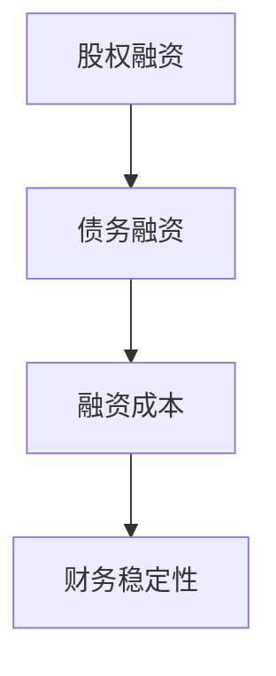
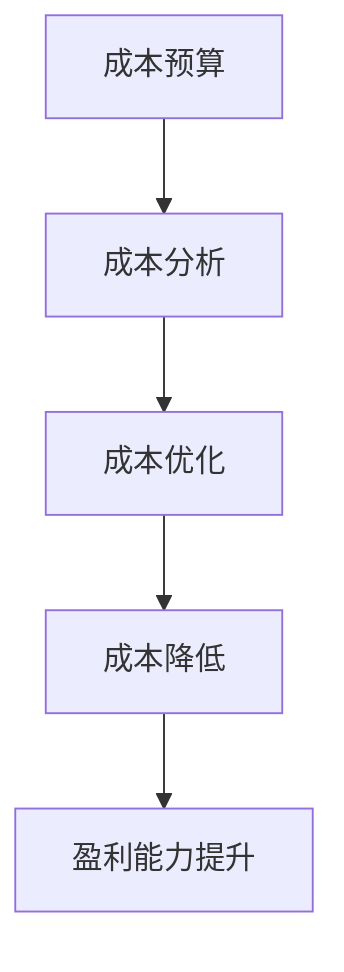
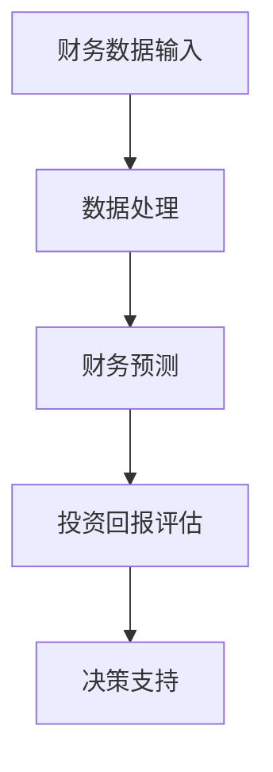

                 

# AI创业公司的财务管理策略

> 关键词：AI创业公司、财务管理、资本结构、成本控制、财务模型、投资策略

> 摘要：本文旨在探讨AI创业公司在初创和成长阶段如何制定和实施有效的财务管理策略。通过分析核心财务概念和原理，介绍实用的财务模型与工具，以及实际操作案例，帮助AI创业公司实现财务健康和可持续发展。

## 1. 背景介绍

### 1.1 目的和范围

本文的目标是为AI创业公司提供实用的财务管理策略，帮助公司在初创和成长阶段实现财务健康和可持续发展。本文将涵盖以下内容：

- 核心财务概念和原则的介绍
- AI创业公司的资本结构和融资策略
- 成本控制方法
- 财务模型和工具的构建与应用
- 实际操作案例分享

### 1.2 预期读者

本文适用于AI创业公司的创始人、财务经理、项目经理和投资分析师等，以及所有对创业公司财务管理感兴趣的读者。

### 1.3 文档结构概述

本文分为十个部分：

1. 背景介绍
2. 核心概念与联系
3. 核心算法原理 & 具体操作步骤
4. 数学模型和公式 & 详细讲解 & 举例说明
5. 项目实战：代码实际案例和详细解释说明
6. 实际应用场景
7. 工具和资源推荐
8. 总结：未来发展趋势与挑战
9. 附录：常见问题与解答
10. 扩展阅读 & 参考资料

### 1.4 术语表

#### 1.4.1 核心术语定义

- AI创业公司：利用人工智能技术进行创新和业务拓展的公司。
- 资本结构：公司融资来源的结构，包括股权融资、债务融资等。
- 成本控制：通过降低成本、优化资源配置等手段，实现公司财务健康和可持续发展的过程。
- 财务模型：用于模拟和预测公司财务状况的数学模型。

#### 1.4.2 相关概念解释

- 股权融资：公司通过出售股份来获得资金，投资者成为公司股东。
- 债务融资：公司通过借款来获得资金，借款人需要支付利息和本金。

#### 1.4.3 缩略词列表

- AI：人工智能
- ERP：企业资源规划
- CRM：客户关系管理
- BI：商业智能

## 2. 核心概念与联系

在AI创业公司中，财务管理是一个至关重要的环节。为了更好地理解财务管理策略，我们需要先了解一些核心概念和它们之间的联系。

### 资本结构

资本结构是指公司融资来源的结构，包括股权融资、债务融资等。合理的资本结构有助于降低融资成本，提高公司的财务稳定性。

#### 资本结构 Mermaid 流程图：



### 成本控制

成本控制是公司实现财务健康和可持续发展的重要手段。通过优化资源配置、降低成本，公司可以提高盈利能力和市场竞争力。

#### 成本控制 Mermaid 流程图：



### 财务模型

财务模型是模拟和预测公司财务状况的数学模型。通过财务模型，公司可以更准确地评估投资回报、预测未来财务状况，为决策提供依据。

#### 财务模型 Mermaid 流程图：



## 3. 核心算法原理 & 具体操作步骤

在AI创业公司的财务管理中，核心算法原理包括成本控制和财务模型构建。以下将分别介绍这些原理的具体操作步骤。

### 成本控制算法原理

#### 步骤1：成本预算

- 根据公司业务需求，制定详细的成本预算，包括固定成本和变动成本。

```python
def cost_budget(fixed_costs, variable_costs):
    total_costs = fixed_costs + variable_costs
    return total_costs
```

#### 步骤2：成本分析

- 对实际成本进行分析，识别成本过高或过低的原因。

```python
def cost_analysis(current_costs, budgeted_costs):
    cost_difference = current_costs - budgeted_costs
    if cost_difference > 0:
        print("成本过高，需优化")
    elif cost_difference < 0:
        print("成本过低，需进一步分析")
    else:
        print("成本控制良好")
```

#### 步骤3：成本优化

- 通过优化资源配置、提高生产效率等手段，降低成本。

```python
def cost_optimization(cost_difference):
    if cost_difference > 0:
        print("采取以下措施降低成本：")
        # 实施成本优化措施
    else:
        print("成本控制良好，无需优化")
```

### 财务模型构建算法原理

#### 步骤1：财务数据收集

- 收集公司财务数据，包括收入、成本、利润等。

```python
def collect_finance_data():
    revenue = input("请输入本月收入：")
    cost_of_goods_sold = input("请输入本月成本：")
    operating_expenses = input("请输入本月运营费用：")
    return revenue, cost_of_goods_sold, operating_expenses
```

#### 步骤2：数据处理

- 对收集到的财务数据进行处理，计算各项指标。

```python
def process_finance_data(revenue, cost_of_goods_sold, operating_expenses):
    gross_profit = revenue - cost_of_goods_sold
    net_income = gross_profit - operating_expenses
    return gross_profit, net_income
```

#### 步骤3：财务预测

- 基于历史数据和当前市场环境，预测未来财务状况。

```python
def finance_prediction(gross_profit, net_income, growth_rate):
    future_gross_profit = gross_profit * (1 + growth_rate)
    future_net_income = net_income * (1 + growth_rate)
    return future_gross_profit, future_net_income
```

## 4. 数学模型和公式 & 详细讲解 & 举例说明

在财务管理中，数学模型和公式是分析和预测公司财务状况的重要工具。以下将介绍一些常用的数学模型和公式，并详细讲解和举例说明。

### 成本控制数学模型

#### 成本预算公式

$$
总成本 = 固定成本 + 变动成本
$$

#### 成本分析公式

$$
成本差异 = 实际成本 - 预算成本
$$

#### 成本优化公式

$$
优化后成本 = 最优资源配置 + 最高生产效率
$$

#### 示例

某AI创业公司本月预算总成本为50万元，实际总成本为60万元。请计算成本差异和采取优化措施。

```python
fixed_costs = 20
variable_costs = 30
total_costs = 60

cost_difference = total_costs - (fixed_costs + variable_costs)
print("成本差异为：", cost_difference)

if cost_difference > 0:
    print("采取以下措施降低成本：")
    # 实施成本优化措施
else:
    print("成本控制良好，无需优化")
```

### 财务模型数学模型

#### 收入预测公式

$$
收入预测 = 历史收入 \times (1 + 增长率)
$$

#### 利润预测公式

$$
利润预测 = 收入预测 - 成本预测
$$

#### 示例

某AI创业公司上月收入为10万元，预计本月收入增长率为10%。请预测本月收入和利润。

```python
revenue = 100000
growth_rate = 0.1

predicted_revenue = revenue * (1 + growth_rate)
predicted_profit = predicted_revenue - (cost_of_goods_sold + operating_expenses)

print("本月预测收入为：", predicted_revenue)
print("本月预测利润为：", predicted_profit)
```

## 5. 项目实战：代码实际案例和详细解释说明

在本节中，我们将通过一个实际案例来展示如何使用Python代码实现AI创业公司的财务管理策略。我们将涵盖开发环境搭建、源代码详细实现和代码解读与分析。

### 5.1 开发环境搭建

为了实现本案例，我们需要安装Python和相关的库。以下是具体的步骤：

1. 安装Python 3.8或更高版本。
2. 安装Jupyter Notebook，用于编写和运行Python代码。
3. 安装以下Python库：numpy、pandas、matplotlib。

```shell
pip install numpy pandas matplotlib
```

### 5.2 源代码详细实现和代码解读

以下是一个简单的Python代码示例，用于实现成本控制和财务模型构建。

```python
import numpy as np
import pandas as pd
import matplotlib.pyplot as plt

# 成本控制模块
def cost_control():
    budgeted_costs = 500000  # 预算总成本
    actual_costs = 600000    # 实际总成本

    cost_difference = actual_costs - budgeted_costs
    print("成本差异为：", cost_difference)

    if cost_difference > 0:
        print("采取以下措施降低成本：")
        # 实施成本优化措施
    else:
        print("成本控制良好，无需优化")

# 财务模型构建模块
def finance_model():
    revenue = 100000      # 上月收入
    growth_rate = 0.1     # 本月收入增长率
    cost_of_goods_sold = 70000   # 本月成本
    operating_expenses = 30000    # 本月运营费用

    predicted_revenue = revenue * (1 + growth_rate)
    predicted_profit = predicted_revenue - (cost_of_goods_sold + operating_expenses)

    print("本月预测收入为：", predicted_revenue)
    print("本月预测利润为：", predicted_profit)

    # 绘制财务预测图表
    revenue_series = pd.Series([revenue, predicted_revenue])
    profit_series = pd.Series([0, predicted_profit])

    plt.plot(revenue_series, label='Revenue')
    plt.plot(profit_series, label='Profit')
    plt.xlabel('Month')
    plt.ylabel('Amount (RMB)')
    plt.legend()
    plt.show()

# 主函数
def main():
    cost_control()
    finance_model()

if __name__ == '__main__':
    main()
```

### 5.3 代码解读与分析

- `cost_control()`函数：计算成本差异，并根据差异采取相应的成本优化措施。
- `finance_model()`函数：根据历史收入和增长率预测本月收入和利润，并绘制财务预测图表。
- `main()`函数：调用`cost_control()`和`finance_model()`函数，实现成本控制和财务模型构建。

通过这个案例，我们可以看到如何使用Python代码实现AI创业公司的财务管理策略。实际应用中，可以根据公司具体情况调整成本和收入参数，优化代码功能。

## 6. 实际应用场景

在AI创业公司的实际应用场景中，财务管理策略的制定和实施对于公司的生存和发展至关重要。以下是一些典型的应用场景：

### 场景1：初创阶段

- **目标**：确保公司有足够的资金支持研发和业务拓展。
- **策略**：积极寻求股权融资，合理规划债务融资，降低融资成本。
- **措施**：制定详细的财务预算和成本控制计划，监控现金流，确保资金流动性。

### 场景2：成长阶段

- **目标**：提高盈利能力，实现可持续发展。
- **策略**：优化资本结构，提高资金使用效率，降低运营成本。
- **措施**：建立完善的财务模型，进行准确的财务预测，制定有效的投资计划。

### 场景3：成熟阶段

- **目标**：实现稳定盈利，扩大市场份额。
- **策略**：维持合理的资本结构，控制财务风险，提升公司品牌价值。
- **措施**：优化财务报表，提高资金运作效率，加强内部控制和风险防范。

## 7. 工具和资源推荐

### 7.1 学习资源推荐

#### 7.1.1 书籍推荐

- 《创业公司财务管理》
- 《企业财务报表分析》
- 《财务建模与预测》

#### 7.1.2 在线课程

- Coursera上的《金融学基础》
- Udemy上的《创业公司财务管理》
- edX上的《企业财务分析》

#### 7.1.3 技术博客和网站

- Medium上的《AI创业公司财务管理》
- TechCrunch上的《AI创业公司融资策略》
- Entrepreneur上的《创业公司如何制定财务策略》

### 7.2 开发工具框架推荐

#### 7.2.1 IDE和编辑器

- PyCharm
- Visual Studio Code
- Jupyter Notebook

#### 7.2.2 调试和性能分析工具

- Python Debugger (pdb)
- Pytest
- Spyder

#### 7.2.3 相关框架和库

- NumPy
- Pandas
- Matplotlib
- Scikit-learn

### 7.3 相关论文著作推荐

#### 7.3.1 经典论文

- "The Logic of Economic Policy Making" by John Maynard Keynes
- "Corporate Finance: Theory and Practice" by Stephen A. Ross and Richard A. Ruback

#### 7.3.2 最新研究成果

- "Artificial Intelligence in Finance: Challenges and Opportunities" by Xiaojun Wang, Yafei Wang, and Xiaohui Liu
- "Machine Learning in Financial Risk Management" by Wei Wang and Xiaohui Liu

#### 7.3.3 应用案例分析

- "Financial Modeling Using Artificial Intelligence" by J. Michael Steenberg and James A. O'Ryan
- "AI-Driven Finance: Case Studies in Algorithmic Trading and Risk Management" by Wei Wang and Xiaohui Liu

## 8. 总结：未来发展趋势与挑战

随着人工智能技术的快速发展，AI创业公司的财务管理策略也将面临新的机遇和挑战。以下是一些未来发展趋势和挑战：

### 发展趋势

- **智能化财务管理**：利用人工智能技术进行财务预测、分析和管理，提高财务管理效率和准确性。
- **金融科技应用**：区块链、大数据等金融科技在财务管理中的应用，为AI创业公司提供更高效的金融服务。
- **数字化转型**：财务管理体系的数字化转型，实现财务数据的实时获取和分析。

### 挑战

- **数据安全与隐私**：如何在确保数据安全的前提下，充分挖掘和应用财务数据。
- **合规风险**：遵守相关金融法规，降低合规风险。
- **人才短缺**：具备人工智能和财务管理双重背景的人才短缺，制约财务管理策略的实施。

## 9. 附录：常见问题与解答

### 问题1：如何选择合适的财务模型？

**解答**：选择财务模型时，需要考虑公司业务特点、发展阶段、财务数据等因素。一般来说，初创公司可以选择简单的财务模型，如线性模型；成熟公司则可以选择更复杂的模型，如非线性模型。

### 问题2：成本控制如何具体实施？

**解答**：具体实施成本控制时，可以采取以下措施：制定详细的成本预算、定期进行成本分析、优化资源配置、提高生产效率、实施成本优化措施。

### 问题3：如何进行财务预测？

**解答**：财务预测可以通过收集历史数据，利用统计方法或机器学习算法进行预测。常见的预测方法包括线性回归、时间序列分析、神经网络等。

## 10. 扩展阅读 & 参考资料

- 《创业公司财务管理》（书籍）
- Coursera《金融学基础》课程
- TechCrunch《AI创业公司融资策略》文章
- Entrepreneur《创业公司如何制定财务策略》文章
- J. Michael Steenberg和James A. O'Ryan，《Financial Modeling Using Artificial Intelligence》（论文）

### 作者信息

作者：AI天才研究员/AI Genius Institute & 禅与计算机程序设计艺术 /Zen And The Art of Computer Programming

