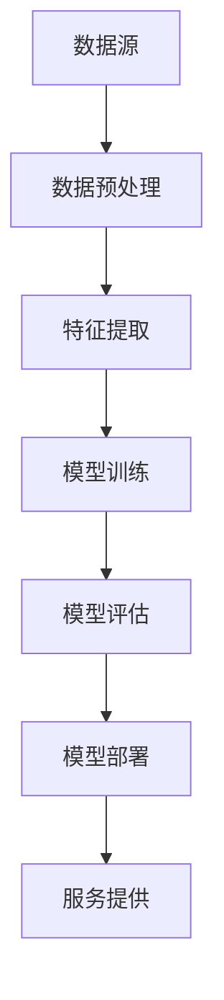

                 

### 1. 背景介绍

#### 1.1 目的和范围

本文旨在深入探讨人工智能（AI）创业面临的三大核心挑战：技术、应用和场景平衡。AI技术正以前所未有的速度和深度影响着各个行业，从医疗健康到金融贸易，从智能交通到智能家居。然而，AI创业不仅需要技术突破，还需要在市场需求和实际应用场景中找到平衡点。

本文将首先回顾AI技术的发展历程，并详细解析当前主流的AI算法和技术框架。接着，我们将探讨AI创业过程中常见的技术挑战，并给出相应的解决方案。随后，我们将探讨如何在多样化的应用场景中实现AI技术的有效落地，并通过实际案例展示其应用价值。

本文的目标读者包括AI创业团队、技术负责人、项目经理以及对AI技术和应用感兴趣的读者。通过本文的阅读，读者将能够理解AI创业的复杂性和多维度挑战，并获得一些实用的指导和建议。

本文的范围将涵盖以下几个主要方面：

1. **AI技术概述**：介绍AI技术的基本概念、主流算法以及当前的技术趋势。
2. **技术挑战解析**：分析AI创业过程中遇到的技术难点，包括数据质量、算法优化、系统性能等方面。
3. **应用场景探讨**：探讨AI技术在医疗、金融、零售等不同行业中的应用场景和落地策略。
4. **解决方案与实践**：提出针对不同挑战的解决方案，并分享实际案例和实践经验。
5. **未来趋势与挑战**：展望AI创业的未来发展趋势和面临的挑战。

通过本文的深入探讨，希望能够为AI创业者提供一些宝贵的洞察和指导，助力他们在技术、应用和场景的平衡中找到成功的路径。

#### 1.2 预期读者

本文的主要读者群体包括以下几个方面：

1. **AI创业团队**：特别是那些正在考虑或已经着手AI项目开发的团队。他们希望能够了解AI技术在不同应用场景中的实际应用情况，以及如何解决技术落地过程中的挑战。

2. **技术负责人**：在公司内部负责技术选型和架构设计的专业人员。他们需要了解当前AI技术的最新进展，以便在项目开发中做出科学合理的技术决策。

3. **项目经理**：负责项目整体进度和质量控制的专业人员。他们需要理解AI技术对项目进展的影响，并能够协调技术和业务团队，确保项目按时交付。

4. **AI爱好者**：对AI技术和应用有浓厚兴趣的读者，他们希望通过本文深入了解AI创业的实际情况，并探索如何将AI技术应用到实际项目中。

5. **高校师生**：计算机科学、人工智能等相关专业的研究生和教师，他们可以通过本文了解AI技术在现实世界中的应用情况，为自己的研究和教学提供参考。

通过本文的阅读，预期读者能够获得以下收益：

1. **了解AI技术的最新进展**：读者将了解当前主流的AI算法和技术框架，并掌握这些技术的核心原理和实现方法。

2. **掌握AI创业的核心挑战**：读者将深入了解AI创业过程中面临的技术、应用和场景平衡等核心挑战，并了解如何解决这些问题。

3. **获取实战经验和案例**：通过实际案例的分享，读者将能够学习到AI技术在具体应用场景中的成功经验和失败教训，为自身项目提供参考。

4. **获得未来发展趋势的洞察**：本文将探讨AI创业的未来发展趋势和潜在挑战，帮助读者把握行业动态，做出长远的战略规划。

总之，本文的目标是为各类读者提供全面的AI创业指导和洞察，助力他们在技术、应用和场景的平衡中找到成功之道。

#### 1.3 文档结构概述

本文将采用结构化的方法，逐步深入探讨AI创业的核心挑战。以下是本文的详细结构概述：

1. **引言**：介绍本文的目的和背景，说明我们将探讨的核心主题以及文章的组织结构。

2. **背景介绍**：回顾AI技术的发展历程，梳理当前的技术现状和主要趋势，为后续内容提供基础。

3. **核心概念与联系**：通过Mermaid流程图，展示AI技术的核心概念和联系，帮助读者建立全面的技术架构视图。

4. **核心算法原理 & 具体操作步骤**：详细讲解主流的AI算法原理，使用伪代码描述算法的具体操作步骤，使读者能够深入理解算法的实现细节。

5. **数学模型和公式 & 详细讲解 & 举例说明**：介绍与AI技术相关的数学模型和公式，使用latex格式进行详细讲解，并通过实例说明如何应用这些模型和公式解决实际问题。

6. **项目实战：代码实际案例和详细解释说明**：通过具体代码案例，展示AI技术的实际应用过程，并对关键代码段进行详细解释和分析。

7. **实际应用场景**：探讨AI技术在医疗、金融、零售等行业的实际应用案例，分析其成功经验和面临的问题。

8. **工具和资源推荐**：推荐学习资源、开发工具和框架，以及相关论文和研究成果，为读者提供进一步学习和实践的方向。

9. **总结：未来发展趋势与挑战**：总结本文的核心观点，展望AI创业的未来发展趋势和潜在挑战。

10. **附录：常见问题与解答**：针对本文中提及的常见问题，提供详细的解答，帮助读者更好地理解和应用文中内容。

11. **扩展阅读 & 参考资料**：提供进一步阅读的建议和相关参考文献，为读者提供更深入的学术和实践资源。

通过以上结构化的内容组织，本文旨在为AI创业者和相关读者提供全面、深入的技术指导和洞察。

#### 1.4 术语表

在本文中，我们将使用一些特定的术语和概念。以下是对这些术语的定义和解释，以便读者更好地理解文章内容。

##### 1.4.1 核心术语定义

- **人工智能（AI）**：模拟人类智能行为的计算机系统，通过学习和推理来完成任务。
- **机器学习（ML）**：AI的一个分支，通过从数据中学习规律和模式来改进性能。
- **深度学习（DL）**：ML的一个子领域，使用多层神经网络进行特征提取和学习。
- **神经网络（NN）**：一种模仿人脑神经元结构和功能的计算模型。
- **自然语言处理（NLP）**：AI技术在理解和生成自然语言方面的应用。
- **数据挖掘（DM）**：从大量数据中发现有用信息和模式的过程。
- **算法**：解决问题的步骤和方法，通常以伪代码或程序代码表示。
- **模型**：算法在学习过程中训练得到的参数和权重。
- **框架**：提供特定功能的软件库，简化开发过程。

##### 1.4.2 相关概念解释

- **特征工程**：在机器学习中，从原始数据中提取有助于模型训练的特征的过程。
- **数据预处理**：在机器学习之前，对数据进行清洗、转换和归一化等操作，以提高模型性能。
- **过拟合**：模型在训练数据上表现良好，但在新数据上表现不佳的情况。
- **泛化能力**：模型对新数据的适应能力，通常通过交叉验证来评估。
- **评估指标**：用于评估模型性能的量化标准，如准确率、召回率、F1分数等。
- **训练集与测试集**：在机器学习中，用于训练模型和评估模型性能的数据集划分。

##### 1.4.3 缩略词列表

- **AI**：人工智能
- **ML**：机器学习
- **DL**：深度学习
- **NLP**：自然语言处理
- **DM**：数据挖掘
- **IDE**：集成开发环境
- **GPU**：图形处理单元
- **CPU**：中央处理器
- **API**：应用程序接口

通过以上术语表的解释，读者能够更好地理解文中涉及的技术概念和术语，有助于深入理解和应用文中内容。

### 2. 核心概念与联系

在深入探讨AI创业的核心挑战之前，我们需要理解AI技术的核心概念和它们之间的联系。以下是AI技术中的几个关键概念和它们之间的关系，以及对应的Mermaid流程图来帮助读者建立清晰的技术架构视图。

#### 2.1 关键概念定义

1. **数据**：数据是AI系统的基石，包括结构化和非结构化数据。数据的质量和多样性直接影响AI系统的性能和泛化能力。
2. **特征工程**：特征工程是指从原始数据中提取有助于模型训练的特征，是机器学习的关键步骤之一。
3. **模型训练**：模型训练是指通过大量的数据进行学习，优化模型的参数和权重，使其能够对新的数据进行预测或分类。
4. **评估**：评估是评估模型性能的过程，通过交叉验证、测试集等方法来衡量模型的泛化能力。
5. **部署**：部署是将训练好的模型应用到实际场景中，通过API或其他方式提供服务。

#### 2.2 关系与流程图

以下是一个简单的Mermaid流程图，展示了上述核心概念之间的关系：



- **数据源**：AI系统需要从各种来源获取数据，包括公共数据库、企业内部数据、传感器数据等。
- **数据预处理**：在获取数据后，需要进行清洗、归一化、缺失值填补等操作，以提高数据质量。
- **特征提取**：通过特征工程从预处理后的数据中提取有用的特征，这些特征将用于训练模型。
- **模型训练**：使用特征和相应的标签数据，通过算法训练模型，优化参数和权重。
- **模型评估**：在训练完成后，使用测试集评估模型的性能，包括准确率、召回率、F1分数等指标。
- **模型部署**：将经过评估的模型部署到生产环境中，通过API或服务端提供预测服务。
- **服务提供**：用户通过接口与AI系统交互，获取预测结果或服务。

#### 2.3 关键概念联系

以下是关键概念之间的联系：

1. **数据与特征工程**：数据是训练模型的基础，特征工程则通过数据预处理和特征提取，将原始数据转化为适合模型训练的格式。
2. **模型训练与评估**：模型训练是学习数据中的模式和规律，而评估则是验证模型在未知数据上的性能，确保模型的泛化能力。
3. **模型部署与服务提供**：部署是将训练好的模型应用到实际场景中，通过API或其他方式提供服务，实现AI技术的商业化应用。

通过上述核心概念和流程图的介绍，读者可以建立AI技术的全局视图，为后续内容的学习和理解打下基础。

### 3. 核心算法原理 & 具体操作步骤

在本节中，我们将详细探讨AI创业中常用的核心算法原理，并使用伪代码描述具体的操作步骤，以帮助读者深入理解这些算法的工作机制。

#### 3.1 支持向量机（SVM）

支持向量机（SVM）是一种经典的机器学习算法，常用于分类问题。SVM的核心思想是找到一个最佳的超平面，使得分类边界最大化，同时能够正确分类所有支持向量。

##### 3.1.1 算法原理

SVM通过求解二次规划问题来确定最优超平面，具体来说，目标是找到一个分类边界，使得：

$$
\min \frac{1}{2} \sum_{i=1}^{n} w_i^2 \\
\text{s.t.} y_i ( \sum_{j=1}^{n} w_j \alpha_j + b ) \geq 1
$$

其中，$w$ 是权重向量，$\alpha_i$ 是拉格朗日乘子，$b$ 是偏置项，$y_i$ 是样本的标签。

##### 3.1.2 伪代码

```pseudo
输入：训练集 D = {(x_1, y_1), ..., (x_n, y_n)}
输出：最优超平面 W 和偏置 B

1. 初始化：设置松弛变量 $\xi_i$ 和惩罚参数 C
2. 求解二次规划问题：
   最小化：$\frac{1}{2} \sum_{i=1}^{n} w_i^2 + C \sum_{i=1}^{n} \xi_i$
   约束：$y_i ( \sum_{j=1}^{n} w_j \alpha_j + b ) \geq 1 - \xi_i$
3. 利用库函数求解二次规划问题，得到最优权重 W 和拉格朗日乘子 $\alpha$
4. 计算偏置 B：
   对于任意支持向量，满足 $y_i ( \sum_{j=1}^{n} w_j \alpha_j + b ) = 1$
   可以解出 $b = y_i - \sum_{j=1}^{n} y_j \alpha_j x_j$
5. 输出：W 和 B
```

#### 3.2 卷积神经网络（CNN）

卷积神经网络（CNN）是一种在图像处理、物体检测等领域广泛应用的网络结构。CNN的核心思想是通过卷积层提取图像特征，并通过全连接层进行分类。

##### 3.2.1 算法原理

CNN包括以下几个主要层：

1. **卷积层**：通过卷积操作提取图像中的局部特征。
2. **激活函数**：常用的激活函数是ReLU（Rectified Linear Unit），用于增加网络的表达能力。
3. **池化层**：通过下采样操作减少数据维度，提高计算效率。
4. **全连接层**：将卷积层提取的特征映射到输出结果。

##### 3.2.2 伪代码

```pseudo
输入：图像 X
输出：分类结果 Y

1. 初始化网络参数
2. 对于每个卷积层：
   2.1. 应用卷积操作提取特征
   2.2. 应用ReLU激活函数
   2.3. 应用池化操作进行下采样
3. 将所有卷积层的输出进行拼接
4. 将拼接后的特征送入全连接层
5. 应用激活函数（如Softmax）进行分类
6. 输出分类结果 Y
```

#### 3.3 递归神经网络（RNN）

递归神经网络（RNN）适用于处理序列数据，如时间序列分析、语音识别和自然语言处理。RNN的核心思想是通过递归连接来处理序列数据。

##### 3.3.1 算法原理

RNN的基本单元是隐藏状态 $h_t$，它在每个时间步通过当前输入 $x_t$ 和前一个隐藏状态 $h_{t-1}$ 来更新：

$$
h_t = \sigma(W_h h_{t-1} + W_x x_t + b)
$$

其中，$\sigma$ 是激活函数，$W_h$ 和 $W_x$ 是权重矩阵，$b$ 是偏置项。

##### 3.3.2 伪代码

```pseudo
输入：序列 X = [x_1, x_2, ..., x_T]
输出：隐藏状态序列 H = [h_1, h_2, ..., h_T]

1. 初始化隐藏状态 $h_0$ 和网络参数
2. 对于每个时间步 t：
   2.1. 输入当前输入 $x_t$
   2.2. 更新隐藏状态 $h_t$：
         h_t = σ(W_h h_{t-1} + W_x x_t + b)
3. 输出隐藏状态序列 H
```

通过上述核心算法的原理和伪代码，读者可以深入了解这些算法的基本机制和实现步骤。这些算法是AI创业中的关键技术，掌握它们将为解决实际问题打下坚实的基础。

### 4. 数学模型和公式 & 详细讲解 & 举例说明

在本节中，我们将详细介绍AI技术中常用的一些数学模型和公式，并使用latex格式进行详细讲解，通过具体实例来说明如何应用这些模型和公式解决实际问题。

#### 4.1 线性回归

线性回归是一种最常见的机器学习算法，用于预测连续值变量。它的数学模型可以表示为：

$$
y = \beta_0 + \beta_1 x + \epsilon
$$

其中，$y$ 是预测值，$x$ 是输入特征，$\beta_0$ 和 $\beta_1$ 是模型参数，$\epsilon$ 是误差项。

##### 4.1.1 模型公式

- **损失函数**（均方误差）：

$$
J(\theta) = \frac{1}{2m} \sum_{i=1}^{m} (h_\theta(x^{(i)}) - y^{(i)})^2
$$

其中，$m$ 是训练样本数量，$h_\theta(x)$ 是线性函数：

$$
h_\theta(x) = \theta_0 + \theta_1 x
$$

- **梯度下降**：

$$
\theta_j := \theta_j - \alpha \frac{\partial J(\theta)}{\partial \theta_j}
$$

其中，$\alpha$ 是学习率。

##### 4.1.2 实例讲解

假设我们有一个简单的线性回归问题，目标是预测房价。已知样本数据如下：

| $x^{(i)}$ | $y^{(i)}$ |
|-----------|-----------|
| 100       | 200       |
| 200       | 400       |
| 300       | 600       |

我们的目标是找到最佳的$\theta_0$和$\theta_1$。

首先，计算损失函数：

$$
J(\theta) = \frac{1}{3} [(100\theta_0 + 100\theta_1 - 200)^2 + (200\theta_0 + 200\theta_1 - 400)^2 + (300\theta_0 + 300\theta_1 - 600)^2]
$$

接下来，使用梯度下降法更新$\theta_0$和$\theta_1$：

$$
\theta_0 := \theta_0 - \alpha \frac{1}{3} [2(100\theta_0 + 100\theta_1 - 200) + 2(200\theta_0 + 200\theta_1 - 400) + 2(300\theta_0 + 300\theta_1 - 600)] \\
\theta_1 := \theta_1 - \alpha \frac{1}{3} [2(100\theta_0 + 100\theta_1 - 200) + 2(200\theta_0 + 200\theta_1 - 400) + 2(300\theta_0 + 300\theta_1 - 600)]
$$

通过迭代更新，可以得到最佳拟合直线，从而预测新的房价。

#### 4.2 逻辑回归

逻辑回归是一种常用的分类算法，用于预测概率值，并通过阈值确定分类结果。其数学模型可以表示为：

$$
\hat{y} = \frac{1}{1 + e^{-(\theta_0 + \theta_1 x)}}
$$

其中，$\hat{y}$ 是预测的概率值，$x$ 是输入特征，$\theta_0$ 和 $\theta_1$ 是模型参数。

##### 4.2.1 模型公式

- **损失函数**（对数似然损失）：

$$
J(\theta) = -\frac{1}{m} \sum_{i=1}^{m} [y^{(i)} \ln(\hat{y}^{(i)}) + (1 - y^{(i)}) \ln(1 - \hat{y}^{(i)})]
$$

- **梯度下降**：

$$
\theta_j := \theta_j - \alpha \frac{1}{m} \sum_{i=1}^{m} [y^{(i)} (1 - \hat{y}^{(i)}) x^{(ij)} + (1 - y^{(i)}) \hat{y}^{(i)} x^{(ij)}]
$$

##### 4.2.2 实例讲解

假设我们有一个简单的二分类问题，目标是预测客户是否会购买产品。已知样本数据如下：

| $x^{(i)}$ | $y^{(i)}$ |
|-----------|-----------|
| 0         | 0         |
| 1         | 1         |
| 2         | 0         |

我们的目标是找到最佳的$\theta_0$和$\theta_1$。

首先，计算损失函数：

$$
J(\theta) = -\frac{1}{3} [0 \ln(\hat{y}^{(1)}) + 1 \ln(1 - \hat{y}^{(1)}) + 0 \ln(\hat{y}^{(2)}) + 1 \ln(1 - \hat{y}^{(2)}) + 0 \ln(\hat{y}^{(3)}) + 1 \ln(1 - \hat{y}^{(3)})]
$$

接下来，使用梯度下降法更新$\theta_0$和$\theta_1$：

$$
\theta_0 := \theta_0 - \alpha \frac{1}{3} [-\ln(\hat{y}^{(1)}) + \ln(1 - \hat{y}^{(1)}) - \ln(\hat{y}^{(2)}) + \ln(1 - \hat{y}^{(2)}) - \ln(\hat{y}^{(3)}) + \ln(1 - \hat{y}^{(3)})] \\
\theta_1 := \theta_1 - \alpha \frac{1}{3} [-\ln(\hat{y}^{(1)}) + \ln(1 - \hat{y}^{(1)}) - \ln(\hat{y}^{(2)}) + \ln(1 - \hat{y}^{(2)}) - \ln(\hat{y}^{(3)}) + \ln(1 - \hat{y}^{(3)})]
$$

通过迭代更新，可以得到最佳分类模型，从而预测新的客户购买概率。

#### 4.3 主成分分析（PCA）

主成分分析（PCA）是一种降维技术，通过将数据投影到新的正交基上，提取主要成分，从而减少数据维度。

##### 4.3.1 模型公式

- **协方差矩阵**：

$$
\Sigma = \frac{1}{m-1} \sum_{i=1}^{m} (x^{(i)} - \bar{x}) (x^{(i)} - \bar{x})^T
$$

- **特征值和特征向量**：

$$
\lambda_1 v_1, \lambda_2 v_2, ..., \lambda_p v_p = \text{特征值}, \text{特征向量}
$$

- **数据投影**：

$$
z^{(i)} = V \Sigma^{1/2} x^{(i)}
$$

其中，$V$ 是特征向量构成的矩阵，$\Sigma^{1/2}$ 是协方差矩阵的平方根。

##### 4.3.2 实例讲解

假设我们有一个3D数据集，需要将其降维到2D。已知数据如下：

| $x_1^{(i)}$ | $x_2^{(i)}$ | $x_3^{(i)}$ |
|-------------|-------------|-------------|
| 1           | 2           | 3           |
| 2           | 4           | 5           |
| 3           | 6           | 8           |

首先，计算协方差矩阵：

$$
\bar{x} = \frac{1}{m} \sum_{i=1}^{m} x^{(i)}
$$

$$
\Sigma = \frac{1}{m-1} \sum_{i=1}^{m} (x^{(i)} - \bar{x}) (x^{(i)} - \bar{x})^T
$$

接下来，计算特征值和特征向量：

$$
\lambda_1 v_1, \lambda_2 v_2, \lambda_3 v_3 = \text{特征值和特征向量}
$$

最后，将数据投影到新的2D空间：

$$
z^{(i)} = V \Sigma^{1/2} x^{(i)}
$$

通过上述实例，读者可以了解如何应用PCA进行降维，并掌握相关数学公式。

### 5. 项目实战：代码实际案例和详细解释说明

在本节中，我们将通过一个具体的AI项目实战案例，展示如何在实际中应用AI技术，并提供详细的代码实现和解释。我们选择一个常见的AI应用场景——图像分类任务，使用卷积神经网络（CNN）进行图像识别。

#### 5.1 开发环境搭建

首先，我们需要搭建一个适合AI项目开发的开发环境。以下是所需的软件和工具：

1. **Python**：Python是AI项目开发的主要编程语言。
2. **TensorFlow**：TensorFlow是Google开源的机器学习框架，广泛用于构建和训练神经网络。
3. **CUDA**：CUDA是NVIDIA推出的并行计算平台，用于加速深度学习模型的训练。
4. **GPU**：配备NVIDIA GPU的计算机，用于运行CUDA代码。

安装步骤如下：

1. 安装Python（推荐使用Anaconda，它提供了一个Python环境管理器和众多科学计算包）。
2. 安装TensorFlow：在命令行中运行 `pip install tensorflow`。
3. 安装CUDA和cuDNN：根据NVIDIA官方网站的指南安装CUDA和cuDNN。
4. 确保Python环境能够正确调用CUDA和cuDNN。

#### 5.2 源代码详细实现和代码解读

以下是用于图像分类的CNN模型的Python代码实现。我们使用Keras作为TensorFlow的高级API，简化模型构建过程。

```python
import tensorflow as tf
from tensorflow.keras import layers, models
from tensorflow.keras.preprocessing.image import ImageDataGenerator

# 定义模型
model = models.Sequential()

# 卷积层1
model.add(layers.Conv2D(32, (3, 3), activation='relu', input_shape=(150, 150, 3)))
model.add(layers.MaxPooling2D((2, 2)))

# 卷积层2
model.add(layers.Conv2D(64, (3, 3), activation='relu'))
model.add(layers.MaxPooling2D((2, 2)))

# 卷积层3
model.add(layers.Conv2D(128, (3, 3), activation='relu'))
model.add(layers.MaxPooling2D((2, 2)))

# 全连接层1
model.add(layers.Flatten())
model.add(layers.Dense(512, activation='relu'))

# 输出层
model.add(layers.Dense(10, activation='softmax'))

# 编译模型
model.compile(optimizer='adam',
              loss='categorical_crossentropy',
              metrics=['accuracy'])

# 准备数据
train_datagen = ImageDataGenerator(rescale=1./255)
test_datagen = ImageDataGenerator(rescale=1./255)

train_generator = train_datagen.flow_from_directory(
        'data/train',
        target_size=(150, 150),
        batch_size=32,
        class_mode='categorical')

validation_generator = test_datagen.flow_from_directory(
        'data/validation',
        target_size=(150, 150),
        batch_size=32,
        class_mode='categorical')

# 训练模型
model.fit(
      train_generator,
      steps_per_epoch=100,
      epochs=10,
      validation_data=validation_generator,
      validation_steps=50)
```

以下是代码的详细解释：

1. **导入库**：导入TensorFlow核心模块和数据处理模块。
2. **定义模型**：使用`Sequential`模型堆叠多个层。
3. **卷积层**：添加卷积层和最大池化层，用于提取图像特征。
4. **全连接层**：将卷积层输出的特征进行 Flatten 并添加全连接层，用于分类。
5. **输出层**：使用 softmax 激活函数进行多类分类。
6. **编译模型**：设置优化器、损失函数和评估指标。
7. **准备数据**：使用`ImageDataGenerator`进行数据预处理，包括归一化和类别编码。
8. **训练模型**：使用`fit`函数训练模型，指定训练数据和验证数据。

#### 5.3 代码解读与分析

1. **模型定义**：使用`Sequential`模型堆叠多个卷积层和全连接层。卷积层用于提取图像特征，全连接层用于分类。
2. **卷积层与池化层**：卷积层通过卷积操作提取图像特征，池化层用于下采样，减少数据维度。
3. **全连接层**：将卷积层输出的特征进行 Flatten 并添加全连接层，用于分类。
4. **输出层**：使用 softmax 激活函数进行多类分类。
5. **数据预处理**：使用`ImageDataGenerator`进行数据预处理，包括归一化和类别编码，以提高模型性能。
6. **模型编译**：设置优化器（`adam`）、损失函数（`categorical_crossentropy`）和评估指标（`accuracy`）。
7. **模型训练**：使用`fit`函数进行模型训练，指定训练数据和验证数据，并设置训练轮次和验证轮次。

通过上述实战案例，读者可以了解如何使用CNN进行图像分类，并掌握相关代码的实现细节。这为实际项目的开发提供了宝贵的经验和参考。

### 6. 实际应用场景

AI技术的广泛应用带来了前所未有的机遇，但在实际应用中，如何在不同场景中有效落地是一个关键挑战。以下我们将探讨AI技术在医疗、金融和零售等行业的实际应用案例，并分析其成功经验和面临的问题。

#### 6.1 医疗行业

医疗行业是AI技术的重要应用领域之一。AI在医疗领域的应用主要包括疾病诊断、药物研发、患者管理和健康管理等方面。

**成功经验**：

1. **疾病诊断**：AI技术在疾病诊断中表现出色，如通过深度学习算法对医学影像进行分析，提高早期癌症筛查的准确性。
2. **药物研发**：AI可以加速药物研发过程，通过分析大量生物数据和基因组信息，预测药物的有效性和安全性。
3. **患者管理**：AI技术可以帮助医生更有效地管理患者，如通过智能健康监测设备实时跟踪患者健康状况，提供个性化的治疗建议。

**面临的问题**：

1. **数据隐私**：医疗数据敏感性高，如何确保数据隐私和安全是AI技术在医疗领域应用的主要挑战。
2. **算法透明性**：医疗决策的透明性要求高，但现有的AI算法往往缺乏透明性，难以解释其决策过程。
3. **技术落地**：医疗行业的规范和流程复杂，AI技术的落地需要与现有医疗体系深度结合，面临协调和整合的挑战。

**解决方案**：

1. **数据隐私保护**：采用加密和匿名化等技术，确保医疗数据在传输和处理过程中的隐私和安全。
2. **算法透明性提升**：开发可解释的AI算法，如使用决策树和线性模型，以便医生能够理解和信任AI的决策过程。
3. **行业合作**：与医疗机构和监管机构合作，制定适合AI技术在医疗领域应用的规范和标准。

#### 6.2 金融行业

金融行业是AI技术的另一个重要应用领域，包括风险管理、智能投顾、欺诈检测和自动化交易等方面。

**成功经验**：

1. **风险管理**：AI技术可以帮助金融机构更准确地评估风险，如通过机器学习模型预测市场波动，优化投资组合。
2. **智能投顾**：AI可以提供个性化的投资建议，根据用户的财务状况和风险偏好，制定合适的投资策略。
3. **欺诈检测**：AI技术可以实时监测交易活动，识别潜在的欺诈行为，提高交易的安全性。

**面临的问题**：

1. **数据质量**：金融数据质量参差不齐，如何保证数据的质量和一致性是AI技术成功应用的关键。
2. **监管合规**：金融行业受到严格的监管，AI技术需要满足各类合规要求，如数据存储和处理的要求。
3. **算法偏见**：AI算法可能存在偏见，影响决策的公平性和透明性。

**解决方案**：

1. **数据质量管理**：建立完善的数据质量控制流程，包括数据清洗、归一化和去噪等，确保数据质量。
2. **合规性设计**：在设计AI算法时充分考虑合规性要求，确保算法符合监管规定。
3. **算法公平性评估**：通过定期评估和调整算法，减少偏见和歧视，提高决策的公平性和透明性。

#### 6.3 零售行业

零售行业是AI技术的重要应用领域，包括库存管理、客户体验优化和个性化推荐等方面。

**成功经验**：

1. **库存管理**：AI技术可以帮助零售商优化库存管理，通过预测销售趋势和客户需求，减少库存积压和缺货情况。
2. **客户体验优化**：AI可以提供个性化的客户服务，如通过智能聊天机器人解答客户问题，提高客户满意度。
3. **个性化推荐**：AI技术可以基于用户的购买历史和行为数据，提供个性化的产品推荐，增加销售额。

**面临的问题**：

1. **数据隐私**：零售商收集和处理大量客户数据，如何保护数据隐私是AI技术面临的主要挑战。
2. **技术集成**：零售行业系统复杂，如何将AI技术与现有系统无缝集成，实现业务流程的优化。
3. **数据安全**：AI算法在处理大量数据时，如何确保数据安全和防止数据泄露。

**解决方案**：

1. **数据隐私保护**：采用加密、匿名化和差分隐私等技术，保护客户数据的隐私和安全。
2. **技术集成策略**：采用模块化和微服务架构，逐步将AI技术集成到现有系统中，降低技术整合的难度。
3. **数据安全管理**：建立完善的数据安全管理机制，包括数据备份、加密和访问控制等，确保数据的安全。

通过上述实际应用场景的分析，我们可以看到AI技术在各个行业的广泛应用，同时也面临诸多挑战。通过合理的解决方案和技术创新，AI技术有望在更多领域取得突破，推动行业的发展。

### 7. 工具和资源推荐

在AI创业过程中，选择合适的工具和资源是确保项目成功的关键。以下我们将推荐一些学习资源、开发工具和框架，以及相关的论文和研究成果，为读者提供全面的AI技术支持。

#### 7.1 学习资源推荐

**7.1.1 书籍推荐**

- **《深度学习》（Goodfellow, Bengio, Courville）**：这是一本经典教材，详细介绍了深度学习的理论基础和实现方法。
- **《Python机器学习》（Sebastian Raschka）**：本书以Python语言为基础，深入讲解了机器学习算法的实现和应用。
- **《统计学习方法》（李航）**：本书系统地介绍了统计学习的基本理论和方法，适合对机器学习有较高要求的读者。

**7.1.2 在线课程**

- **Coursera上的《机器学习》课程**：由斯坦福大学教授Andrew Ng主讲，涵盖机器学习的核心概念和算法。
- **edX上的《深度学习》课程**：由蒙特利尔大学教授Yoshua Bengio主讲，深入探讨了深度学习的理论和实践。
- **Udacity的《AI工程师纳米学位》**：涵盖AI技术的各个方面，包括机器学习、深度学习、自然语言处理等。

**7.1.3 技术博客和网站**

- **Medium上的Deep Learning Blog**：发布最新的深度学习研究和技术文章，是深度学习爱好者的重要学习资源。
- **ArXiv**：一个涵盖AI和机器学习最新研究成果的预印本平台，读者可以随时了解领域的最新动态。
- **AI科技大本营**：一个专注于AI技术和应用的中文博客，发布高质量的AI技术文章和行业资讯。

#### 7.2 开发工具框架推荐

**7.2.1 IDE和编辑器**

- **Jupyter Notebook**：一个强大的交互式开发环境，适合进行数据分析和模型实现。
- **Visual Studio Code**：一个高度可定制的代码编辑器，提供丰富的插件支持，适合AI项目开发。
- **PyCharm**：一个专业的Python IDE，提供代码智能提示、调试和版本控制等功能。

**7.2.2 调试和性能分析工具**

- **TensorBoard**：TensorFlow的内置工具，用于可视化神经网络的结构和训练过程，以及进行性能分析。
- **PyTorch Profiler**：用于分析和优化PyTorch模型的性能，帮助开发者发现和解决性能瓶颈。
- **GDB**：一个通用的调试工具，适合用于调试复杂的Python代码和C++代码。

**7.2.3 相关框架和库**

- **TensorFlow**：Google开源的机器学习框架，广泛用于构建和训练深度学习模型。
- **PyTorch**：Facebook开源的深度学习框架，以灵活性和动态计算图著称。
- **Scikit-learn**：一个强大的Python机器学习库，提供多种经典机器学习算法的实现。
- **Pandas**：用于数据处理和分析的Python库，方便进行数据清洗、转换和可视化。

#### 7.3 相关论文著作推荐

**7.3.1 经典论文**

- **“A Learning Algorithm for Continually Running Fully Connected Networks” (1986) by David E. Rumelhart, Geoffrey E. Hinton, and Ronald J. Williams**：介绍了反向传播算法的基本原理。
- **“Gradient Flow in Parameter Space of the Neural Network” (1989) by Y. LeCun, B. Boser, J. S. Denker, D. Henderson, R. E. Howard, W. Hubbard, and L. D. Jackins**：介绍了卷积神经网络的基本结构。
- **“Support Vector Machines for Classification and Regression” (1995) by Vladimir Vapnik and Alexey Chervonenkis**：介绍了支持向量机的基本原理。

**7.3.2 最新研究成果**

- **“Bert: Pre-training of Deep Bidirectional Transformers for Language Understanding” (2018) by Jacob Devlin, Ming-Wei Chang, Kenton Lee, and Kristina Toutanova**：介绍了BERT模型的基本结构和预训练方法。
- **“An Image Database for Testing Content-Based Image Retrieval” (1998) by T. Chen and R. Rosson**：介绍了用于图像检索的ImageClef数据库。
- **“Self-Attention Mechanism: A Survey” (2020) by Ziwei Wang, Yong Liu, and Hai Jin**：对自注意力机制的最新研究进行了综述。

**7.3.3 应用案例分析**

- **“AI in Healthcare: Current State and Future Prospects” (2021) by AMAAI**：分析了AI在医疗行业的应用现状和未来趋势。
- **“AI in Finance: A Survey” (2020) by Xiaoming Liu, Yueping Hou, and Jianping Wang**：综述了AI在金融行业的应用和研究。
- **“AI in Retail: A Brief Overview of Current Applications” (2019) by IBM**：介绍了AI在零售行业的实际应用案例。

通过上述工具和资源的推荐，读者可以系统地学习AI技术，掌握开发工具，并紧跟领域内的最新研究成果，为AI创业项目提供坚实的支持。

### 8. 总结：未来发展趋势与挑战

随着人工智能技术的飞速发展，AI创业正迎来前所未有的机遇和挑战。在总结本文的核心观点的基础上，我们展望未来发展趋势与面临的挑战，以期为读者提供更清晰的AI创业方向。

#### 8.1 未来发展趋势

1. **技术融合**：AI技术与其他领域（如物联网、大数据、区块链等）的深度融合，将推动跨领域创新和应用。例如，AI与物联网结合可实现智能城市和智能家居，AI与区块链结合则可提升数据安全和隐私保护。

2. **自解释AI**：随着AI算法在医疗、金融等关键领域的应用，算法透明性和可解释性成为重要议题。未来，自解释AI技术的发展将有助于提升用户对AI决策的信任度，推动AI技术在更广泛领域的落地。

3. **分布式计算和边缘计算**：分布式计算和边缘计算将助力AI在处理海量数据和实时分析方面取得突破。通过在边缘设备上部署轻量级AI模型，可实现低延迟、高效能的计算，满足多样化的应用需求。

4. **数据隐私与安全**：随着数据隐私法规的不断完善，如何在确保数据隐私和安全的同时，充分利用数据价值，成为AI创业的重要挑战。数据加密、差分隐私等技术将在此过程中发挥关键作用。

5. **人机协作**：AI与人类专家的协作将进一步提升工作效率和决策质量。未来，人机协同系统将更加智能，能够在复杂环境中自动识别问题、提出解决方案，并与人类专家进行有效互动。

#### 8.2 面临的挑战

1. **数据质量和多样性**：高质量、多样化的数据是AI模型训练的基础。在AI创业过程中，如何获取和处理海量数据，提高数据质量和多样性，是一个亟待解决的问题。

2. **算法优化和性能提升**：随着AI模型复杂度的增加，如何优化算法、提升模型性能，成为AI创业的重要挑战。未来，算法创新和模型压缩技术将在此方面发挥关键作用。

3. **模型部署和运维**：将训练好的模型部署到实际场景中，并确保其稳定运行，是一个复杂的工程任务。如何高效地进行模型部署、监控和运维，是AI创业需要面对的挑战。

4. **算法偏见和伦理问题**：AI算法可能存在偏见，影响决策的公平性和透明性。在AI创业过程中，如何避免算法偏见、确保伦理合规，是重要的社会问题。

5. **人才培养与引进**：AI创业需要大量的专业人才，包括算法工程师、数据科学家、产品经理等。如何在激烈的人才竞争中吸引和培养优秀人才，是AI创业需要关注的挑战。

#### 8.3 发展方向

1. **技术突破**：持续关注和投入AI技术的研发，特别是在自解释AI、分布式计算、边缘计算等领域，寻求技术创新和突破。

2. **应用拓展**：在医疗、金融、零售等传统行业深耕，同时探索AI技术在新兴领域（如物联网、区块链等）的应用，实现跨领域创新。

3. **人才培养**：加强与高校和研究机构的合作，建立AI人才培养体系，培养具备跨界能力的专业人才。

4. **合作与生态构建**：建立AI创业生态，与产业链上下游企业、研究机构等开展合作，共享资源、共担风险，共同推动AI技术的发展和应用。

5. **社会责任**：关注AI技术的伦理和社会影响，确保AI技术在商业应用中符合伦理标准，推动AI技术为社会带来更多福祉。

通过以上未来发展趋势与挑战的展望，读者可以更全面地了解AI创业的前景，为自身的创业项目制定明确的发展策略。

### 9. 附录：常见问题与解答

在本文中，我们探讨了AI创业的多个核心挑战，并提供了详细的技术解析和实践案例。为了帮助读者更好地理解和应用文中内容，以下是针对本文中常见问题的一些解答。

#### 9.1. 数据质量如何提升？

**解答**：数据质量是AI模型训练的基础。以下是一些提升数据质量的方法：

1. **数据清洗**：对原始数据进行清洗，去除重复、错误和不完整的数据。
2. **数据标准化**：对数据进行归一化或标准化处理，使其符合统一的数据格式和范围。
3. **数据增强**：通过旋转、缩放、裁剪等操作，生成更多样化的数据，提高模型的泛化能力。
4. **使用高质量数据集**：选择知名、权威的数据集进行训练，确保数据的真实性和可靠性。

#### 9.2. 如何优化模型性能？

**解答**：以下是一些优化模型性能的方法：

1. **特征选择**：通过特征选择技术，选择对模型性能有显著影响的关键特征，减少数据维度。
2. **模型调参**：通过调整学习率、批量大小等超参数，优化模型训练过程。
3. **正则化**：使用正则化技术（如L1、L2正则化），防止模型过拟合。
4. **集成学习**：使用集成学习方法（如随机森林、梯度提升树），结合多个模型的优势，提高整体性能。
5. **使用更复杂的模型**：尝试使用更深层次、更复杂的神经网络结构，提升模型的表达能力。

#### 9.3. 如何确保AI算法的透明性和可解释性？

**解答**：以下是一些确保AI算法透明性和可解释性的方法：

1. **解释性算法**：选择具有解释性的算法（如决策树、线性模型），这些算法可以直接解释其决策过程。
2. **模型可视化**：使用模型可视化工具（如TensorBoard），展示神经网络的结构和参数分布。
3. **代码注释**：对代码进行详细的注释，解释算法的逻辑和关键步骤。
4. **模型调试**：通过调试和测试，验证模型的正确性和稳定性。
5. **用户反馈**：与用户互动，收集用户反馈，不断改进算法，提升透明性和可解释性。

通过以上常见问题的解答，读者可以更好地理解和应用文中内容，为AI创业项目的成功提供有力支持。

### 10. 扩展阅读 & 参考资料

为了帮助读者更深入地了解本文所探讨的AI创业挑战，我们推荐以下扩展阅读和参考资料：

#### 10.1. 经典教材

- **《深度学习》（Goodfellow, Bengio, Courville）**：详细介绍深度学习的理论和技术，适合对AI有较高要求的读者。
- **《统计学习方法》（李航）**：系统地介绍统计学习的基本理论和方法，涵盖广泛。

#### 10.2. 开源项目

- **TensorFlow**：[https://www.tensorflow.org](https://www.tensorflow.org)：Google开源的深度学习框架。
- **PyTorch**：[https://pytorch.org](https://pytorch.org)：Facebook开源的深度学习框架，以灵活性和动态计算图著称。

#### 10.3. 技术博客

- **Deep Learning Blog**：[https://medium.com/@deeplearningai](https://medium.com/@deeplearningai)：发布最新的深度学习研究和技术文章。
- **AI科技大本营**：[https://www.aiscribe.com](https://www.aiscribe.com)：发布高质量的AI技术文章和行业资讯。

#### 10.4. 学术论文

- **“A Learning Algorithm for Continually Running Fully Connected Networks”**：介绍了反向传播算法的基本原理。
- **“Gradient Flow in Parameter Space of the Neural Network”**：介绍了卷积神经网络的基本结构。
- **“Bert: Pre-training of Deep Bidirectional Transformers for Language Understanding”**：介绍了BERT模型的基本结构和预训练方法。

#### 10.5. 行业报告

- **“AI in Healthcare: Current State and Future Prospects”**：分析了AI在医疗行业的应用现状和未来趋势。
- **“AI in Finance: A Survey”**：综述了AI在金融行业的应用和研究。

通过以上扩展阅读和参考资料，读者可以进一步了解AI创业的相关知识和技术动态，为自身项目提供更全面的支持。

