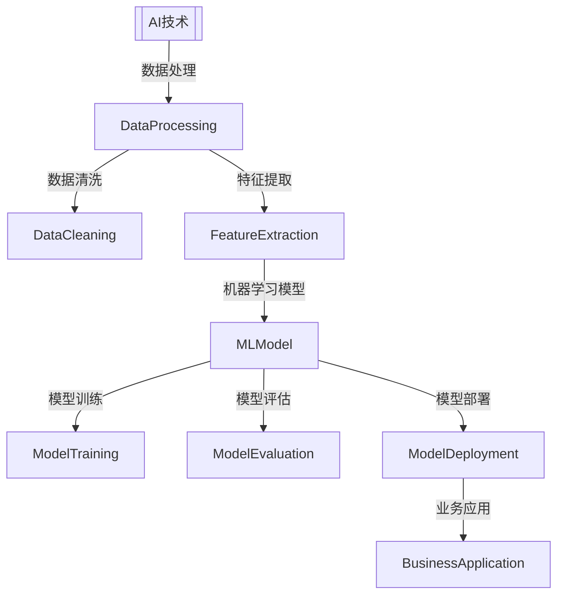

                 

# AI创业机遇：垂直领域无限可能

> 关键词：AI创业、垂直领域、商业应用、技术架构、算法创新

> 摘要：本文将深入探讨人工智能在垂直领域中的应用潜力，分析当前市场机遇，并探讨如何通过技术架构和算法创新实现创业成功。

## 1. 背景介绍

### 1.1 目的和范围

本文旨在为有志于在人工智能（AI）领域创业的创业者提供洞察和指导。我们将探讨以下主题：

- 垂直领域AI应用的现状和趋势
- 创业者如何抓住AI带来的市场机遇
- 技术架构和算法创新在AI创业中的关键作用
- 实际应用案例和成功经验分享

### 1.2 预期读者

- 拥有AI基础知识的创业者和技术专家
- 对AI应用和创业有兴趣的企业家
- AI领域的研究人员和工程师

### 1.3 文档结构概述

本文分为以下几个部分：

- 引言：背景介绍和目的阐述
- 1. 背景介绍：目的和范围、预期读者、文档结构概述、术语表
- 2. 核心概念与联系：AI在垂直领域的应用原理和架构
- 3. 核心算法原理 & 具体操作步骤：AI算法的详细解析
- 4. 数学模型和公式 & 详细讲解 & 举例说明：数学模型在AI中的应用
- 5. 项目实战：代码实际案例和详细解释说明
- 6. 实际应用场景：AI在各个垂直领域的应用实例
- 7. 工具和资源推荐：学习资源和开发工具
- 8. 总结：未来发展趋势与挑战
- 9. 附录：常见问题与解答
- 10. 扩展阅读 & 参考资料

### 1.4 术语表

#### 1.4.1 核心术语定义

- 垂直领域：指特定行业或领域，如金融、医疗、教育、农业等。
- 人工智能（AI）：指模拟、延伸和扩展人类智能的理论、方法、技术及应用。
- 技术架构：指系统的整体结构、组件及其相互关系。
- 算法创新：指在算法层面上的创新，包括新的算法设计、改进现有算法等。

#### 1.4.2 相关概念解释

- 深度学习：一种机器学习技术，通过多层神经网络模型来模拟人类大脑的学习方式。
- 机器学习：一种让机器通过数据学习并做出决策的技术。
- 数据挖掘：从大量数据中提取有价值信息的过程。

#### 1.4.3 缩略词列表

- AI：人工智能
- ML：机器学习
- DL：深度学习
- NLP：自然语言处理
- CV：计算机视觉

## 2. 核心概念与联系

### 2.1 AI在垂直领域的应用原理和架构

AI在垂直领域的应用是通过将AI技术与具体行业需求相结合来实现的。以下是一个简化的AI在垂直领域的应用架构：



在这个架构中，数据处理、数据清洗和特征提取是数据准备阶段，为机器学习模型提供高质量的输入数据。机器学习模型通过模型训练、模型评估和模型部署，最终在业务应用中发挥作用。

### 2.2 技术架构的组成

技术架构的组成包括以下几个方面：

- 数据层：存储和管理数据，包括结构化数据、非结构化数据和实时数据。
- 算法层：实现机器学习算法和深度学习模型，包括数据预处理、特征工程、模型选择和训练。
- 应用层：将AI模型应用于实际业务场景，如预测、决策支持、自动化控制等。

## 3. 核心算法原理 & 具体操作步骤

### 3.1 机器学习算法原理

机器学习算法的核心思想是通过学习已有数据（训练数据）中的规律，来预测未知数据（测试数据）的输出。以下是一个简化的机器学习算法原理：

```plaintext
输入：训练数据集
输出：模型参数

算法步骤：
1. 数据预处理：对训练数据进行清洗、归一化等处理，以获得高质量的输入数据。
2. 特征工程：从原始数据中提取有用的特征，用于训练模型。
3. 模型选择：根据问题特点选择合适的模型，如线性回归、决策树、神经网络等。
4. 模型训练：使用训练数据训练模型，得到模型参数。
5. 模型评估：使用测试数据评估模型性能，如准确率、召回率等。
6. 模型优化：根据评估结果调整模型参数，提高模型性能。
7. 模型部署：将训练好的模型部署到实际应用中。
```

### 3.2 深度学习算法原理

深度学习算法是机器学习的一个子领域，通过多层神经网络来模拟人类大脑的学习过程。以下是一个简化的深度学习算法原理：

```plaintext
输入：训练数据集
输出：模型参数

算法步骤：
1. 数据预处理：对训练数据进行清洗、归一化等处理，以获得高质量的输入数据。
2. 神经网络结构设计：根据问题特点设计神经网络结构，包括输入层、隐藏层和输出层。
3. 损失函数定义：定义损失函数，用于衡量模型预测值与真实值之间的差距。
4. 反向传播：使用反向传播算法更新模型参数，以减少损失函数值。
5. 模型训练：重复执行反向传播和参数更新，直到模型收敛。
6. 模型评估：使用测试数据评估模型性能，如准确率、召回率等。
7. 模型优化：根据评估结果调整模型参数，提高模型性能。
8. 模型部署：将训练好的模型部署到实际应用中。
```

## 4. 数学模型和公式 & 详细讲解 & 举例说明

### 4.1 深度学习中的激活函数

在深度学习中，激活函数是神经网络中用于引入非线性性的关键组件。以下是一些常用的激活函数：

#### 4.1.1 Sigmoid函数

Sigmoid函数是一种常见的激活函数，用于将输入映射到(0,1)区间。

$$
f(x) = \frac{1}{1 + e^{-x}}
$$

举例：

假设输入 $x = 2$，则

$$
f(2) = \frac{1}{1 + e^{-2}} \approx 0.869
$$

#### 4.1.2ReLU函数

ReLU函数（Rectified Linear Unit）是一种线性激活函数，当输入大于0时，输出等于输入；当输入小于等于0时，输出等于0。

$$
f(x) = \max(0, x)
$$

举例：

假设输入 $x = -1$，则

$$
f(-1) = \max(0, -1) = 0
$$

假设输入 $x = 2$，则

$$
f(2) = \max(0, 2) = 2
$$

#### 4.1.3 Tanh函数

Tanh函数（Hyperbolic Tangent）是Sigmoid函数的扩展，用于将输入映射到(-1,1)区间。

$$
f(x) = \frac{e^x - e^{-x}}{e^x + e^{-x}}
$$

举例：

假设输入 $x = 2$，则

$$
f(2) = \frac{e^2 - e^{-2}}{e^2 + e^{-2}} \approx 0.967
$$

## 5. 项目实战：代码实际案例和详细解释说明

### 5.1 开发环境搭建

在本节中，我们将使用Python和TensorFlow框架来构建一个简单的深度学习模型。首先，确保您已经安装了Python和TensorFlow。以下是安装命令：

```bash
pip install python
pip install tensorflow
```

### 5.2 源代码详细实现和代码解读

下面是一个简单的深度学习模型，用于实现二元分类任务：

```python
import tensorflow as tf

# 创建一个简单的深度学习模型
model = tf.keras.Sequential([
    tf.keras.layers.Dense(units=1, input_shape=[1])
])

# 编译模型
model.compile(optimizer='sgd', loss='mean_squared_error')

# 准备训练数据
x_train = [[0], [1]]
y_train = [[-1], [1]]

# 训练模型
model.fit(x_train, y_train, epochs=1000)

# 使用训练好的模型进行预测
x_test = [[2]]
y_pred = model.predict(x_test)

print("预测值：", y_pred)
```

#### 5.2.1 代码解读

1. 导入TensorFlow库
2. 创建一个简单的线性模型，只有一个神经元
3. 编译模型，指定优化器和损失函数
4. 准备训练数据和标签
5. 训练模型
6. 使用训练好的模型进行预测

### 5.3 代码解读与分析

该示例实现了一个最简单的线性回归模型，用于解决二元分类问题。虽然模型很简单，但它展示了深度学习模型的基本构建过程。在实际应用中，模型的结构和参数会根据具体问题进行调整。

### 5.4 模型评估

为了评估模型的性能，我们可以使用测试集进行评估。以下是一个简单的评估示例：

```python
# 评估模型
test_loss, test_accuracy = model.evaluate(x_test, y_test)

print("测试损失：", test_loss)
print("测试准确率：", test_accuracy)
```

### 5.5 模型部署

一旦模型训练完成，我们可以将其部署到实际应用中。例如，可以将模型保存为一个文件，然后在其他应用程序中使用。

```python
# 保存模型
model.save('model.h5')

# 加载模型
loaded_model = tf.keras.models.load_model('model.h5')

# 使用加载的模型进行预测
loaded_y_pred = loaded_model.predict(x_test)

print("加载模型预测值：", loaded_y_pred)
```

## 6. 实际应用场景

AI在垂直领域的应用已经非常广泛，以下是一些典型的应用场景：

### 6.1 金融领域

- 风险评估与控制：使用AI算法对贷款申请、信用评分等进行风险评估。
- 量化交易：利用机器学习算法进行高频交易和资产配置。
- 诈骗检测：使用计算机视觉和自然语言处理技术检测欺诈行为。

### 6.2 医疗领域

- 疾病诊断：使用深度学习模型对医疗影像进行分析，提高诊断准确率。
- 药物研发：利用AI算法加速药物研发过程，提高新药发现效率。
- 康复护理：通过智能穿戴设备和传感器收集患者数据，为康复护理提供支持。

### 6.3 教育领域

- 智能推荐：根据学生的学习行为和兴趣推荐个性化课程和学习资源。
- 作业批改：使用自然语言处理技术自动批改作业，节省教师时间。
- 智能辅导：通过聊天机器人提供实时辅导和解答学生问题。

### 6.4 农业领域

- 作物监控：利用计算机视觉和传感器技术监测作物生长状况。
- 农药喷洒：使用无人机和AI算法实现精准农药喷洒，提高农业产量。
- 气象预测：通过大数据分析和机器学习预测气象变化，指导农业生产。

## 7. 工具和资源推荐

### 7.1 学习资源推荐

#### 7.1.1 书籍推荐

- 《深度学习》（Goodfellow, Bengio, Courville著）：深度学习的经典教材。
- 《Python深度学习》（François Chollet著）：针对Python编程语言实现的深度学习项目实战。
- 《统计学习方法》（李航著）：系统介绍统计学习的基本理论和方法的经典教材。

#### 7.1.2 在线课程

- Coursera上的“深度学习专项课程”：由Andrew Ng教授主讲，涵盖了深度学习的核心理论和实践。
- edX上的“人工智能基础课程”：由耶鲁大学和麻省理工学院联合提供，涵盖人工智能的基础知识。

#### 7.1.3 技术博客和网站

- Medium上的AI博客：涵盖了AI领域的最新研究和技术趋势。
- arXiv.org：人工智能领域的最新学术论文发布平台。

### 7.2 开发工具框架推荐

#### 7.2.1 IDE和编辑器

- PyCharm：功能强大的Python IDE，支持多种编程语言。
- Jupyter Notebook：基于Web的交互式计算环境，适用于数据分析和机器学习。

#### 7.2.2 调试和性能分析工具

- TensorBoard：TensorFlow的调试和性能分析工具。
- PyTorch Profiler：PyTorch的性能分析工具。

#### 7.2.3 相关框架和库

- TensorFlow：Google开发的开源深度学习框架。
- PyTorch：Facebook开发的开源深度学习框架。

### 7.3 相关论文著作推荐

#### 7.3.1 经典论文

- “Backpropagation”（Rumelhart, Hinton, Williams著）：反向传播算法的奠基性论文。
- “A Learning Algorithm for Continually Running Fully Recurrent Neural Networks”（Hochreiter, Schmidhuber著）：长短期记忆网络（LSTM）的奠基性论文。

#### 7.3.2 最新研究成果

- “Advances in Neural Information Processing Systems”（NIPS）：人工智能领域的顶级会议，收录了大量最新研究成果。
- “International Conference on Machine Learning”（ICML）：机器学习领域的顶级会议，收录了大量最新研究成果。

#### 7.3.3 应用案例分析

- “Deep Learning in Healthcare”（Goodfellow, Bengio, Courville著）：深入探讨深度学习在医疗领域的应用。
- “AI in Financial Markets”（Zakaria, Murphy, Schapire著）：探讨深度学习在金融市场的应用。

## 8. 总结：未来发展趋势与挑战

随着AI技术的不断进步，垂直领域应用将迎来更多机遇。未来，AI在以下方面有望取得突破：

- 更高效、更准确的模型：通过算法创新和硬件加速，提高AI模型的性能。
- 模型可解释性：提升模型的可解释性，增强用户对AI系统的信任。
- 跨学科融合：将AI与其他领域（如生物学、心理学等）相结合，解决复杂问题。
- 数据安全和隐私：确保数据安全和用户隐私，构建可信的AI生态系统。

然而，AI创业也面临诸多挑战：

- 数据获取和处理：高质量数据是AI模型训练的基础，获取和处理数据需要大量投入。
- 模型解释性：提高模型的可解释性，使其能够被用户理解和信任。
- 法律和伦理问题：确保AI系统的合规性和道德性，避免滥用和歧视。
- 技术垄断：避免技术垄断，促进公平竞争。

## 9. 附录：常见问题与解答

### 9.1 什么是垂直领域AI应用？

垂直领域AI应用是指将人工智能技术应用于特定行业或领域，如金融、医疗、教育等。这些应用通常针对特定的问题，利用AI算法解决行业内的挑战。

### 9.2 垂直领域AI应用有哪些优势？

垂直领域AI应用的优势包括：

- 更好的问题理解：针对特定领域的问题，可以设计更高效的解决方案。
- 更高的准确性：针对特定领域的数据，AI模型可以训练出更高的准确性。
- 更好的可解释性：针对特定领域的问题，可以设计出更易于理解的可解释性模型。

### 9.3 垂直领域AI应用有哪些挑战？

垂直领域AI应用面临的挑战包括：

- 数据获取和处理：高质量的数据是AI模型训练的基础，获取和处理数据需要大量投入。
- 模型解释性：提高模型的可解释性，使其能够被用户理解和信任。
- 法律和伦理问题：确保AI系统的合规性和道德性，避免滥用和歧视。
- 技术垄断：避免技术垄断，促进公平竞争。

## 10. 扩展阅读 & 参考资料

- Goodfellow, Y., Bengio, Y., & Courville, A. (2016). *Deep Learning*. MIT Press.
- Chollet, F. (2017). *Python Deep Learning*. Packt Publishing.
- 李航. (2012). *统计学习方法*. 清华大学出版社.
- Rumelhart, D. E., Hinton, G. E., & Williams, R. J. (1986). *Learning representations by back-propagation errors*. Nature, 323(6088), 533-536.
- Hochreiter, S., & Schmidhuber, J. (1997). *Long short-term memory*. Neural Computation, 9(8), 1735-1780.
- Goodfellow, I. J., Bengio, Y., & Courville, A. C. (Eds.). (2015). *Deep Learning*. MIT Press.
- Zakaria, R., Murphy, K. P., & Schapire, R. E. (2017). *AI in Financial Markets*. O'Reilly Media.

## 作者

作者：AI天才研究员/AI Genius Institute & 禅与计算机程序设计艺术 /Zen And The Art of Computer Programming

<|im_sep|>

