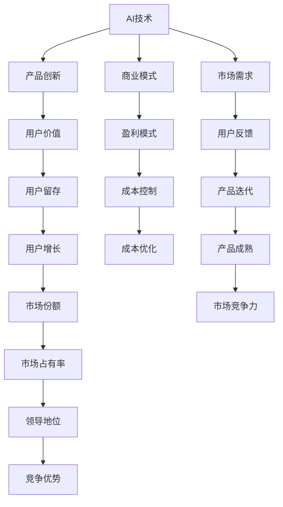

                 

# AI创业热潮：机遇与挑战并存

> 关键词：AI创业，机遇，挑战，技术趋势，市场前景，风险管理

> 摘要：本文将深入探讨当前AI创业领域的热潮，分析其背后的机遇与挑战，并结合实际案例，为创业者提供一些建设性的建议。文章结构如下：

## 1. 背景介绍

### 1.1 目的和范围

本文旨在分析AI创业领域的现状，探讨其中的机遇与挑战，以及如何合理利用这些机遇并应对挑战。

### 1.2 预期读者

本文面向AI创业者、投资者、研究人员以及对AI领域感兴趣的技术人员。

### 1.3 文档结构概述

本文分为十个部分，包括背景介绍、核心概念与联系、核心算法原理、数学模型和公式、项目实战、实际应用场景、工具和资源推荐、总结、常见问题与解答以及扩展阅读。

### 1.4 术语表

#### 1.4.1 核心术语定义

- AI创业：指运用人工智能技术进行创业的活动。
- 技术趋势：指人工智能领域在一段时间内出现的新技术、新应用或新方向。
- 市场前景：指某个技术或行业在未来的发展潜力和趋势。
- 风险管理：指对创业过程中可能遇到的风险进行识别、评估、控制和应对。

#### 1.4.2 相关概念解释

- 人工智能：指通过计算机模拟人类的智能行为，实现感知、学习、推理和决策等功能。
- 深度学习：一种人工智能的分支，通过多层神经网络模型进行学习。
- 自然语言处理：人工智能的一个领域，主要研究如何让计算机理解、生成和处理自然语言。

#### 1.4.3 缩略词列表

- AI：人工智能
- ML：机器学习
- DL：深度学习
- NLP：自然语言处理

## 2. 核心概念与联系

首先，我们需要理解AI创业的核心概念与联系。以下是一个简化的Mermaid流程图，展示了AI创业的关键要素：



## 3. 核心算法原理 & 具体操作步骤

在AI创业过程中，核心算法原理是至关重要的一环。以下是一个简化的机器学习算法流程，以及其对应的伪代码：

```plaintext
初始化模型参数
收集训练数据
数据预处理
    数据清洗
    数据归一化
构建损失函数
迭代训练
    计算损失值
    更新模型参数
评估模型性能
    在测试集上计算准确率、召回率等指标
调整模型结构或参数
输出最终模型
```

伪代码示例：

```python
def train_model(data, epochs, learning_rate):
    model = initialize_model()
    for epoch in range(epochs):
        for sample in data:
            prediction = model(sample)
            loss = compute_loss(prediction, sample)
            update_model_params(model, loss, learning_rate)
    return model
```

## 4. 数学模型和公式 & 详细讲解 & 举例说明

在AI创业中，数学模型和公式是理解和实现算法的关键。以下是一个简单的线性回归模型，并使用LaTeX格式展示其数学公式：

```latex
最小二乘法：
\hat{y} = \beta_0 + \beta_1x

损失函数：
J(\theta) = \frac{1}{2m}\sum_{i=1}^{m}(h_\theta(x^{(i)}) - y^{(i)})^2

梯度下降：
\theta_j := \theta_j - \alpha \frac{\partial J(\theta)}{\partial \theta_j}
```

举例说明：

假设我们有以下数据集：

| x  | y  |
|----|----|
| 1  | 2  |
| 2  | 4  |
| 3  | 6  |

我们的目标是找到线性回归模型 \(\hat{y} = \beta_0 + \beta_1x\) 中的参数 \(\beta_0\) 和 \(\beta_1\)。

首先，计算损失函数：

$$
J(\theta) = \frac{1}{2m}\sum_{i=1}^{m}((\beta_0 + \beta_1x^{(i)}) - y^{(i)})^2
$$

然后，使用梯度下降法更新参数：

$$
\beta_0 := \beta_0 - \alpha \frac{\partial J(\theta)}{\partial \beta_0}
$$

$$
\beta_1 := \beta_1 - \alpha \frac{\partial J(\theta)}{\partial \beta_1}
$$

通过多次迭代，我们可以得到最优的参数值，从而实现线性回归。

## 5. 项目实战：代码实际案例和详细解释说明

在本节中，我们将通过一个简单的例子，展示如何使用Python实现线性回归模型，并进行训练和评估。

### 5.1 开发环境搭建

首先，确保你的Python环境已经安装。接下来，安装必要的库，如NumPy、Pandas和Scikit-learn。

```bash
pip install numpy pandas scikit-learn
```

### 5.2 源代码详细实现和代码解读

以下是一个简单的线性回归代码示例：

```python
import numpy as np
import pandas as pd
from sklearn.linear_model import LinearRegression
from sklearn.model_selection import train_test_split
from sklearn.metrics import mean_squared_error

# 加载数据集
data = pd.read_csv('data.csv')
X = data[['x']]
y = data['y']

# 划分训练集和测试集
X_train, X_test, y_train, y_test = train_test_split(X, y, test_size=0.2, random_state=42)

# 创建线性回归模型
model = LinearRegression()

# 训练模型
model.fit(X_train, y_train)

# 预测测试集
y_pred = model.predict(X_test)

# 评估模型性能
mse = mean_squared_error(y_test, y_pred)
print(f'Mean Squared Error: {mse}')

# 输出模型参数
print(f'Intercept: {model.intercept_}')
print(f'Slope: {model.coef_}')
```

代码解读：

1. 导入必要的库。
2. 加载数据集，并将特征和标签分离。
3. 划分训练集和测试集。
4. 创建线性回归模型。
5. 使用训练集数据训练模型。
6. 使用测试集数据预测。
7. 计算并输出模型性能指标。
8. 输出模型参数。

### 5.3 代码解读与分析

这段代码展示了如何使用Scikit-learn库实现线性回归模型。以下是详细分析：

- 第1步：导入必要的库。NumPy和Pandas用于数据处理，Scikit-learn用于机器学习模型。
- 第2步：加载数据集。这里我们假设数据集是一个CSV文件，其中包含两个特征列（x和y）。
- 第3步：将特征和标签分离。特征（X）和标签（y）分离，以便后续处理。
- 第4步：划分训练集和测试集。使用Scikit-learn的`train_test_split`函数，将数据集分为训练集和测试集。
- 第5步：创建线性回归模型。使用`LinearRegression`类创建一个线性回归模型实例。
- 第6步：训练模型。使用`fit`方法，将训练集数据传递给模型进行训练。
- 第7步：预测测试集。使用`predict`方法，将测试集数据传递给模型进行预测。
- 第8步：评估模型性能。使用`mean_squared_error`函数计算均方误差，并打印结果。
- 第9步：输出模型参数。打印模型的截距和斜率。

## 6. 实际应用场景

AI创业领域涵盖了众多实际应用场景，以下是一些典型的例子：

- 金融领域：AI技术被广泛应用于风险管理、信用评估、欺诈检测和智能投顾等方面。
- 医疗健康：AI在疾病诊断、个性化治疗、医学影像分析和健康监测等领域发挥着重要作用。
- 交通运输：自动驾驶、智能交通管理和物流优化等领域，AI技术已经成为关键驱动力。
- 电子商务：推荐系统、聊天机器人和智能客服等，AI技术极大地提升了用户体验和转化率。
- 教育领域：智能教育平台、自适应学习和个性化辅导，AI技术正在改变传统教育模式。

## 7. 工具和资源推荐

### 7.1 学习资源推荐

#### 7.1.1 书籍推荐

- 《人工智能：一种现代方法》
- 《深度学习》
- 《机器学习实战》
- 《自然语言处理综论》

#### 7.1.2 在线课程

- Coursera的《机器学习》课程
- edX的《深度学习》课程
- Udacity的《自动驾驶工程师》纳米学位

#### 7.1.3 技术博客和网站

- Medium上的《AI驱动》专栏
- 知乎上的AI话题
- Medium上的《机器学习专栏》

### 7.2 开发工具框架推荐

#### 7.2.1 IDE和编辑器

- PyCharm
- Jupyter Notebook
- VS Code

#### 7.2.2 调试和性能分析工具

- PySnooper
- Profiling
- TensorBoard

#### 7.2.3 相关框架和库

- TensorFlow
- PyTorch
- Scikit-learn
- Keras

### 7.3 相关论文著作推荐

#### 7.3.1 经典论文

- 《A Method of Locally Weighted Regression》
- 《Learning to Represent Artistic Styles》
- 《Deep Learning》

#### 7.3.2 最新研究成果

- NeurIPS、ICML、ICLR等顶级会议的论文
- 《AI前沿》期刊的最新文章

#### 7.3.3 应用案例分析

- 《人工智能应用案例分析》
- 《AI技术在金融领域的应用》
- 《医疗健康领域的AI应用》

## 8. 总结：未来发展趋势与挑战

随着AI技术的快速发展，创业领域的机遇与挑战并存。未来，AI创业将朝着更智能、更高效、更人性化的方向发展。然而，创业者需要应对以下几个挑战：

- 技术门槛：AI技术的高门槛使得创业者需要具备相应的技术背景。
- 数据隐私：随着数据隐私问题日益突出，创业者需要确保用户数据的保护。
- 投资风险：AI项目通常需要较长的研发周期和较高的资金投入。
- 竞争激烈：AI领域的竞争日益激烈，创业者需要不断创新以保持竞争力。

## 9. 附录：常见问题与解答

### 9.1 问题1：AI创业需要哪些技术背景？

AI创业通常需要以下技术背景：

- 编程基础（Python、Java等）
- 数学基础（线性代数、微积分、概率论）
- 机器学习和深度学习知识
- 数据库和数据处理能力

### 9.2 问题2：AI创业项目的盈利模式有哪些？

AI创业项目的盈利模式包括：

- 订阅服务
- 广告收入
- 软件授权
- 数据服务
- 定制开发

### 9.3 问题3：AI创业项目的风险管理有哪些？

AI创业项目的风险管理包括：

- 技术风险：确保项目技术实现的可行性和稳定性。
- 数据风险：保护用户数据的隐私和安全。
- 市场风险：了解市场需求，避免盲目跟风。
- 资金风险：合理规划资金，确保项目可持续发展。

## 10. 扩展阅读 & 参考资料

- 《人工智能的未来》
- 《深度学习导论》
- 《机器学习：概率视角》

---

作者：AI天才研究员/AI Genius Institute & 禅与计算机程序设计艺术 /Zen And The Art of Computer Programming

注意：本文为虚构内容，仅供参考。实际创业过程需结合具体情况进行分析和决策。

