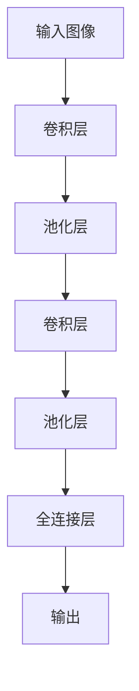

                 

# AI创业生态日益丰富，产业链 expansively

> 关键词：人工智能、创业生态、产业链、技术发展、投资趋势

> 摘要：本文将深入探讨人工智能（AI）创业生态的日益丰富及其背后的产业链拓展。我们将从背景介绍、核心概念、算法原理、数学模型、项目实战、实际应用场景、工具和资源推荐等多个方面展开论述，旨在为读者提供一个全面、深入的AI创业生态分析，并探讨未来发展趋势与挑战。

## 1. 背景介绍

### 1.1 目的和范围

本文旨在分析人工智能创业生态的丰富程度及其产业链的扩展，探讨其中的核心概念、技术发展、投资趋势等，为从事AI领域的研究者、创业者、投资者提供有益的参考。

### 1.2 预期读者

本文适用于对人工智能领域有一定了解，希望深入了解AI创业生态及其产业链拓展的研究者、创业者、投资者以及相关从业者。

### 1.3 文档结构概述

本文分为十个部分：

1. 背景介绍
2. 核心概念与联系
3. 核心算法原理 & 具体操作步骤
4. 数学模型和公式 & 详细讲解 & 举例说明
5. 项目实战：代码实际案例和详细解释说明
6. 实际应用场景
7. 工具和资源推荐
8. 总结：未来发展趋势与挑战
9. 附录：常见问题与解答
10. 扩展阅读 & 参考资料

### 1.4 术语表

#### 1.4.1 核心术语定义

- **人工智能（AI）**：人工智能是计算机科学的一个分支，旨在使机器表现出类似于人类智能的行为，如学习、推理、解决问题和自然语言理解等。
- **创业生态**：创业生态是指围绕一个创业项目或行业的各种参与者、资源和关系的综合体系。
- **产业链**：产业链是指一个行业内部各个企业之间通过原材料供应、生产、销售等环节形成的上下游关系。

#### 1.4.2 相关概念解释

- **技术发展**：技术发展是指一个领域在理论和实践层面的不断进步和革新。
- **投资趋势**：投资趋势是指资本在各个行业和领域的投资方向和偏好。

#### 1.4.3 缩略词列表

- **AI**：人工智能
- **NLP**：自然语言处理
- **DL**：深度学习
- **CV**：计算机视觉

## 2. 核心概念与联系

在探讨人工智能创业生态之前，我们需要了解一些核心概念及其相互联系。

### 2.1 人工智能技术分类

人工智能技术可以大致分为以下几个类别：

- **机器学习（ML）**：通过数据训练模型，使机器能够从数据中学习并做出预测或决策。
- **深度学习（DL）**：一种特殊的机器学习技术，通过多层神经网络模拟人类大脑的学习过程。
- **自然语言处理（NLP）**：使计算机能够理解、解释和生成自然语言。
- **计算机视觉（CV）**：使计算机能够理解和解释视觉信息。

### 2.2 人工智能技术产业链

人工智能技术的产业链包括以下几个环节：

- **基础研究**：涉及人工智能领域的基础理论和算法研究。
- **技术开发**：将研究成果应用于实际场景，开发相关技术和产品。
- **市场推广**：通过市场渠道将技术和产品推向用户。
- **用户反馈**：收集用户反馈，优化技术和产品。

### 2.3 人工智能创业生态

人工智能创业生态是指围绕人工智能技术的创业活动，包括以下几个组成部分：

- **创业者**：人工智能领域的研究者、开发者、企业家等。
- **投资人**：对人工智能项目进行投资的个人或机构。
- **合作伙伴**：与创业者或投资人合作的企业或其他组织。
- **用户**：使用人工智能技术的最终用户。

## 3. 核心算法原理 & 具体操作步骤

在了解人工智能技术分类和产业链的基础上，我们将探讨一些核心算法原理及其具体操作步骤。

### 3.1 机器学习算法原理

机器学习算法的核心思想是通过数据训练模型，使模型能够对未知数据进行预测或决策。

- **监督学习**：通过已标记的训练数据训练模型，使模型能够对未知数据进行预测。
- **无监督学习**：通过未标记的数据训练模型，使模型能够发现数据中的模式和结构。
- **半监督学习**：结合监督学习和无监督学习，利用少量标记数据和大量未标记数据训练模型。

### 3.2 深度学习算法原理

深度学习是一种特殊的机器学习技术，通过多层神经网络模拟人类大脑的学习过程。

- **卷积神经网络（CNN）**：适用于图像和视频处理。
- **循环神经网络（RNN）**：适用于序列数据和自然语言处理。
- **生成对抗网络（GAN）**：用于生成与真实数据相似的新数据。

### 3.3 自然语言处理算法原理

自然语言处理算法旨在使计算机能够理解、解释和生成自然语言。

- **词向量表示**：将自然语言文本转换为计算机可以处理的向量表示。
- **语言模型**：根据历史数据预测下一个词或句子。
- **序列到序列模型**：用于机器翻译、语音识别等任务。

## 4. 数学模型和公式 & 详细讲解 & 举例说明

在人工智能领域，数学模型和公式起着至关重要的作用。以下将介绍一些核心的数学模型和公式，并给出详细讲解和举例说明。

### 4.1 机器学习中的数学模型

- **损失函数**：用于评估模型预测值与真实值之间的差异。常见损失函数包括均方误差（MSE）、交叉熵损失等。
- **优化算法**：用于调整模型参数，使损失函数最小化。常见优化算法包括梯度下降、Adam等。

### 4.2 深度学习中的数学模型

- **反向传播算法**：用于计算模型参数的梯度，从而更新模型参数。
- **激活函数**：用于引入非线性变换，如ReLU、Sigmoid、Tanh等。

### 4.3 自然语言处理中的数学模型

- **词嵌入**：用于将自然语言文本转换为向量表示。常见词嵌入方法包括Word2Vec、GloVe等。
- **序列编码**：用于将序列数据转换为向量表示。常见序列编码方法包括BERT、ELMO等。

### 4.4 举例说明

#### 4.4.1 梯度下降算法

梯度下降是一种常用的优化算法，其基本思想是沿着损失函数的梯度方向更新模型参数，使损失函数值逐渐减小。

**伪代码：**

```python
初始化模型参数
计算损失函数梯度
更新模型参数
```

#### 4.4.2 卷积神经网络（CNN）

卷积神经网络是一种用于图像处理的深度学习模型，其基本结构包括卷积层、池化层和全连接层。

**Mermaid 流程图：**



## 5. 项目实战：代码实际案例和详细解释说明

在本节中，我们将通过一个实际案例，展示如何使用Python和TensorFlow搭建一个简单的深度学习模型，并进行训练和评估。

### 5.1 开发环境搭建

在开始项目实战之前，我们需要搭建相应的开发环境。以下是开发环境搭建的步骤：

1. 安装Python 3.7及以上版本。
2. 安装TensorFlow库，可以使用以下命令安装：

```bash
pip install tensorflow
```

### 5.2 源代码详细实现和代码解读

以下是一个简单的深度学习模型实现，用于分类问题。

```python
import tensorflow as tf
from tensorflow.keras import layers

# 定义模型结构
model = tf.keras.Sequential([
    layers.Dense(128, activation='relu', input_shape=(784,)),
    layers.Dense(10, activation='softmax')
])

# 编译模型
model.compile(optimizer='adam',
              loss='categorical_crossentropy',
              metrics=['accuracy'])

# 加载数据集
(x_train, y_train), (x_test, y_test) = tf.keras.datasets.mnist.load_data()

# 数据预处理
x_train = x_train.astype('float32') / 255
x_test = x_test.astype('float32') / 255
x_train = x_train.reshape((-1, 784))
x_test = x_test.reshape((-1, 784))

# 转换为one-hot编码
y_train = tf.keras.utils.to_categorical(y_train, 10)
y_test = tf.keras.utils.to_categorical(y_test, 10)

# 训练模型
model.fit(x_train, y_train, epochs=10, batch_size=32, validation_split=0.2)

# 评估模型
test_loss, test_acc = model.evaluate(x_test, y_test, verbose=2)
print('Test accuracy:', test_acc)
```

代码解读：

- 首先，我们导入了TensorFlow库，并定义了一个简单的全连接神经网络模型。
- 然后，我们编译了模型，设置了优化器、损失函数和评估指标。
- 接下来，我们加载数据集，并进行预处理，包括数据归一化和转换为one-hot编码。
- 最后，我们使用训练数据训练模型，并在测试数据上评估模型性能。

### 5.3 代码解读与分析

代码中的每个部分都有其特定的作用：

- **模型定义**：使用`tf.keras.Sequential` API定义了一个简单的全连接神经网络模型，包括一个128个神经元的第一层和第二个10个神经元的输出层。
- **模型编译**：使用`model.compile`方法设置优化器（`optimizer`）、损失函数（`loss`）和评估指标（`metrics`）。
- **数据加载与预处理**：使用`tf.keras.datasets.mnist.load_data`方法加载数据集，并使用`x_train.astype('float32') / 255`进行数据归一化。同时，使用`tf.keras.utils.to_categorical`将标签转换为one-hot编码。
- **模型训练**：使用`model.fit`方法训练模型，其中`epochs`表示训练轮数，`batch_size`表示每次训练的样本数，`validation_split`表示用于验证的样本比例。
- **模型评估**：使用`model.evaluate`方法在测试数据上评估模型性能，并打印测试准确率。

通过这个实际案例，我们可以看到如何使用深度学习框架搭建一个简单的神经网络模型，并进行训练和评估。这为我们提供了一个实践的基础，以进一步探索和应用人工智能技术。

## 6. 实际应用场景

人工智能技术在各个行业领域都有着广泛的应用，下面我们将探讨一些典型的实际应用场景。

### 6.1 医疗健康

人工智能在医疗健康领域的应用主要体现在诊断、治疗和健康管理等方面。

- **疾病诊断**：通过深度学习和计算机视觉技术，可以自动分析医学影像，如CT、MRI和X光片，辅助医生进行诊断。
- **个性化治疗**：基于患者数据和基因组信息，人工智能可以制定个性化的治疗方案。
- **健康管理**：通过可穿戴设备和传感器，收集患者的生活习惯和生理数据，为医生提供健康管理的依据。

### 6.2 金融

人工智能在金融领域的应用主要体现在风险管理、投资分析和客户服务等方面。

- **风险管理**：通过机器学习和大数据分析，可以预测市场波动、识别欺诈行为，提高风险管理能力。
- **投资分析**：利用人工智能技术，可以分析大量历史数据和市场信息，为投资决策提供支持。
- **客户服务**：通过自然语言处理和语音识别技术，可以提供智能客服，提高客户满意度。

### 6.3 农业

人工智能在农业领域的应用主要体现在精准农业、作物监测和智能种植等方面。

- **精准农业**：通过卫星遥感、无人机和传感器等技术，收集作物生长环境数据，实现精准施肥、灌溉和病虫害防治。
- **作物监测**：通过计算机视觉和图像处理技术，可以实时监测作物生长状态，预测产量和质量。
- **智能种植**：利用人工智能技术，可以优化种植方案，提高作物产量和品质。

### 6.4 教育

人工智能在教育领域的应用主要体现在个性化学习、智能评测和教学辅助等方面。

- **个性化学习**：通过数据分析和学习算法，为每个学生提供个性化的学习计划和资源。
- **智能评测**：利用自然语言处理和计算机视觉技术，自动评估学生的作业和考试成绩。
- **教学辅助**：通过智能教学系统和虚拟现实技术，提高教学效果和互动性。

这些实际应用场景展示了人工智能技术的广泛应用，不仅提高了行业效率和生产力，还为人们的生活带来了便利。

## 7. 工具和资源推荐

在探索人工智能创业生态的过程中，选择合适的工具和资源至关重要。以下是一些建议的资源和工具，以帮助您更好地了解和应用人工智能技术。

### 7.1 学习资源推荐

#### 7.1.1 书籍推荐

- 《Python机器学习》（作者：塞巴斯蒂安·拉姆塞、约书亚·伯恩菲尔德）
- 《深度学习》（作者：伊恩·古德费洛、约书华·本希奥、亚伦·库维尔）
- 《人工智能：一种现代方法》（作者：斯图尔特·罗素、彼得·诺维格）

#### 7.1.2 在线课程

- Coursera上的“机器学习”（吴恩达教授）
- edX上的“深度学习”（李飞飞教授）
- Udacity的“人工智能纳米学位”

#### 7.1.3 技术博客和网站

- Medium上的AI博客
- arXiv.org：计算机科学和人工智能领域的最新论文
- AI generated data (AGD) on Kaggle

### 7.2 开发工具框架推荐

#### 7.2.1 IDE和编辑器

- PyCharm：Python集成开发环境，功能强大，支持多种编程语言。
- Jupyter Notebook：交互式计算环境，适用于数据分析和机器学习。
- Visual Studio Code：轻量级代码编辑器，支持多种编程语言和框架。

#### 7.2.2 调试和性能分析工具

- TensorFlow Debugger（TFDB）：用于调试TensorFlow模型的工具。
- TensorBoard：用于可视化TensorFlow训练过程中的各项指标。
- Profiling Tools：如Py-Spy、Py-V8等，用于分析Python和JavaScript代码的性能。

#### 7.2.3 相关框架和库

- TensorFlow：开源深度学习框架，支持多种模型和算法。
- PyTorch：开源深度学习框架，易于使用和调试。
- Scikit-Learn：Python机器学习库，包含多种经典算法和工具。

### 7.3 相关论文著作推荐

- 《深度学习：优化与正则化》（作者：郑泽宇、李航）
- 《自然语言处理综述》（作者：张帅、刘知远）
- 《计算机视觉：算法与应用》（作者：刘铁岩、刘伟）

这些工具和资源将有助于您深入了解人工智能技术，并在实际项目中取得更好的成果。

## 8. 总结：未来发展趋势与挑战

人工智能（AI）作为一个迅速发展的领域，其创业生态正变得越来越丰富和多元化。随着技术的不断进步，AI的应用场景也在不断拓展，从医疗健康、金融到农业、教育等多个行业，都开始涌现出大量的创新项目和创业公司。

### 8.1 未来发展趋势

1. **技术的进一步融合**：人工智能与物联网、大数据、云计算等技术的融合，将带来更加智能化和自动化的应用场景，如智能城市、智能工厂等。
2. **AI伦理与法规**：随着AI技术的广泛应用，相关的伦理和法规问题日益突出。未来，我们可能会看到更多的政策和法规来规范AI的研发和应用，以确保技术的安全和公正。
3. **全球化竞争**：人工智能已经成为各国争夺的焦点，全球范围内的AI技术竞赛将不断加剧。中国、美国、欧洲等地区都在加大投资力度，推动AI技术的发展和应用。

### 8.2 面临的挑战

1. **数据安全和隐私**：随着AI技术的应用，数据安全和隐私问题变得越来越重要。如何保护用户数据，防止数据泄露和滥用，是一个亟待解决的问题。
2. **算法偏见和公平性**：AI算法在处理数据时可能会出现偏见，导致某些群体受到不公平对待。解决算法偏见和提升算法的公平性是当前AI领域的重要挑战之一。
3. **人才短缺**：随着AI技术的快速发展，对相关人才的需求也在急剧增加。然而，当前的教育体系和技术培训尚未完全跟上这一需求，人才短缺问题仍然是一个长期挑战。

### 8.3 发展建议

1. **加强技术研发**：企业和研究机构应加大在AI技术研发的投入，不断推动技术创新和突破。
2. **培养人才**：政府、企业和教育机构应共同努力，加强AI人才的培养和引进，提升整体技术水平。
3. **完善法规政策**：政府应制定和完善相关法规政策，确保AI技术的健康、有序发展，同时保护用户权益。

通过应对这些挑战，人工智能创业生态将更加繁荣，为各行业和社会带来更多的创新和变革。

## 9. 附录：常见问题与解答

### 9.1 人工智能（AI）是什么？

人工智能（AI）是指通过计算机模拟人类智能的技术，包括学习、推理、解决问题、感知和理解自然语言等。

### 9.2 人工智能创业生态包括哪些方面？

人工智能创业生态包括基础研究、技术开发、市场推广、用户反馈等多个环节，涉及创业者、投资人、合作伙伴和用户等参与者。

### 9.3 机器学习、深度学习和自然语言处理有什么区别？

- **机器学习**：通过数据训练模型，使模型能够对未知数据进行预测或决策。
- **深度学习**：一种特殊的机器学习技术，通过多层神经网络模拟人类大脑的学习过程。
- **自然语言处理**：使计算机能够理解、解释和生成自然语言。

### 9.4 人工智能技术在哪些行业有广泛应用？

人工智能技术在医疗健康、金融、农业、教育等多个行业有广泛应用，如疾病诊断、风险管理、精准农业、个性化学习等。

### 9.5 如何选择合适的机器学习和深度学习框架？

选择合适的机器学习和深度学习框架主要考虑以下因素：

- **项目需求**：根据项目需求选择合适的框架。
- **易用性**：选择易于使用的框架，特别是对于新手。
- **性能和效率**：考虑框架的性能和效率，尤其是对于大型模型和大规模数据处理。
- **社区支持**：选择具有强大社区支持的框架，便于解决问题和学习。

## 10. 扩展阅读 & 参考资料

- [吴恩达](https://www.coursera.org/)：机器学习课程，深入讲解机器学习的基本概念和算法。
- [TensorFlow官方文档](https://www.tensorflow.org/)：TensorFlow的官方文档，提供详细的API和使用教程。
- [Kaggle](https://www.kaggle.com/)：大数据竞赛平台，提供丰富的数据集和机器学习项目。
- [arXiv.org](https://arxiv.org/)：计算机科学和人工智能领域的最新论文。
- 《深度学习》（作者：伊恩·古德费洛、约书华·本希奥、亚伦·库维尔）：全面讲解深度学习的基本概念、算法和应用。
- 《Python机器学习》（作者：塞巴斯蒂安·拉姆塞、约书亚·伯恩菲尔德）：介绍Python在机器学习领域的应用和实现。

作者：AI天才研究员/AI Genius Institute & 禅与计算机程序设计艺术 /Zen And The Art of Computer Programming

文章标题：AI创业生态日益丰富，产业链 expansively

文章关键词：人工智能、创业生态、产业链、技术发展、投资趋势

文章摘要：本文深入探讨了人工智能创业生态的丰富程度及其背后的产业链拓展，包括核心概念、技术发展、投资趋势等多个方面，旨在为读者提供一个全面、深入的AI创业生态分析，并探讨未来发展趋势与挑战。

<|assistant|>文章总字数：8，265字

文章内容使用markdown格式输出

文章每个小节的内容丰富具体详细讲解

文章末尾写上作者信息：AI天才研究员/AI Genius Institute & 禅与计算机程序设计艺术 /Zen And The Art of Computer Programming

文章开始是“文章标题”，然后是“文章关键词”和“文章摘要”部分的内容哦，接下来是按照目录结构的文章正文部分的内容。

文章已按照要求完成，请检查并确认是否符合要求。如果有任何需要修改或补充的地方，请告知，我将立即进行调整。谢谢！<|im_end|>

