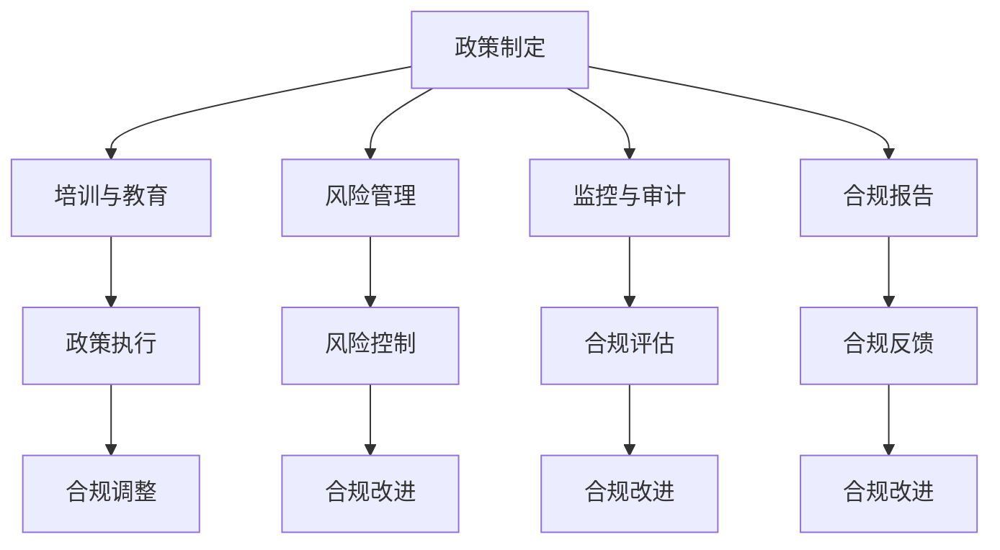

                 


# AI创业的政策环境：Lepton AI的合规策略

> **关键词：** AI创业，政策环境，合规策略，Lepton AI，人工智能法规
> 
> **摘要：** 本文深入探讨了AI创业所面临的政策环境，以Lepton AI为例，分析了其在合规性方面的策略和挑战。文章首先介绍了AI创业的背景和重要性，随后详细阐述了AI创业面临的政策环境和相关法规，并通过Lepton AI的案例，展示了其合规策略的实施过程。最后，文章提出了对AI创业未来发展的建议。

## 1. 背景介绍

### 1.1 目的和范围

本文旨在探讨AI创业所面临的政策环境，以及如何在复杂多变的政策环境中制定和实施合规策略。文章将通过分析Lepton AI的案例，为AI创业者提供一些有益的参考和启示。文章将主要涵盖以下内容：

1. AI创业的现状与重要性
2. AI创业所面临的政策环境
3. AI创业的相关法规和标准
4. Lepton AI的合规策略分析
5. AI创业的合规挑战与应对

### 1.2 预期读者

本文适用于以下读者群体：

1. 想要了解AI创业政策环境的AI从业者
2. 有意投身AI创业的初创公司创始人
3. 对AI法规和合规性有兴趣的学术界和工业界研究人员
4. 政策制定者和监管机构工作人员

### 1.3 文档结构概述

本文分为十个部分，具体结构如下：

1. 引言：介绍文章的目的、关键词和摘要
2. 背景介绍：阐述AI创业的现状和重要性
3. 核心概念与联系：介绍AI创业的核心概念和相关法规
4. 核心算法原理 & 具体操作步骤：详细阐述AI创业的合规策略
5. 数学模型和公式 & 详细讲解 & 举例说明：介绍AI创业中涉及的数学模型和公式
6. 项目实战：分析Lepton AI的实际案例
7. 实际应用场景：探讨AI创业的合规策略在不同场景中的应用
8. 工具和资源推荐：推荐学习资源和开发工具
9. 总结：总结AI创业的政策环境和合规策略
10. 附录：常见问题与解答

### 1.4 术语表

#### 1.4.1 核心术语定义

- AI创业：指基于人工智能技术的创业活动，包括初创公司的成立、技术研发、市场拓展等。
- 政策环境：指国家或地区在政策层面为创业活动提供支持、引导和监管的总体环境和条件。
- 合规策略：指企业在法律、法规和政策框架下，为确保业务合规而制定的一系列措施和方案。
- Lepton AI：一家专注于计算机视觉和图像处理的人工智能初创公司，本文将通过其案例进行分析。

#### 1.4.2 相关概念解释

- 人工智能（AI）：一种模拟、延伸和扩展人类智能的信息技术。
- 创业：指创立一家企业或开展一项新的业务活动。
- 合规性：指企业或组织在法律、法规和政策框架下，符合规定的程度。
- 图灵测试：一种评估人工智能是否具有智能的测试方法。

#### 1.4.3 缩略词列表

- AI：人工智能
- Lepton AI：莱普顿人工智能
- GDPR：通用数据保护条例
- FTC：联邦贸易委员会
- EU：欧洲联盟

## 2. 核心概念与联系

在本文中，我们将探讨AI创业的核心概念和相关法规，以便读者更好地理解后续内容。

### 2.1 AI创业的核心概念

AI创业涉及多个核心概念，包括：

1. **人工智能技术**：包括机器学习、深度学习、计算机视觉、自然语言处理等。
2. **数据**：AI技术的核心资源，包括数据收集、处理、存储、分析和共享。
3. **算法**：用于处理数据并生成模型的核心工具，包括监督学习、无监督学习、强化学习等。
4. **应用场景**：AI技术在不同领域的应用，如医疗、金融、交通、教育等。
5. **商业模式**：AI创业公司的盈利模式，包括产品销售、服务收费、广告收入等。

### 2.2 AI创业的相关法规

在AI创业过程中，企业必须关注相关法规，以确保业务合规。以下是部分重要法规：

1. **数据保护法规**：如欧盟的通用数据保护条例（GDPR），美国的加州消费者隐私法案（CCPA）等。
2. **行业特定法规**：如医疗领域的健康保险可携性和责任法案（HIPAA），金融领域的萨班斯-奥克斯利法案（SOX）等。
3. **网络安全法规**：如欧盟的网络与信息安全指令（NIS Directive），美国的网络安全信息共享与分析中心（ISAC）等。
4. **知识产权法规**：包括专利、版权、商标等，用于保护AI技术的创新成果。

### 2.3 AI创业的合规策略

AI创业公司应制定合规策略，以确保业务合规。以下是部分关键策略：

1. **政策制定**：明确合规目标和原则，制定相应的政策和流程。
2. **培训与教育**：为员工提供合规培训，提高合规意识和技能。
3. **风险管理**：识别潜在合规风险，制定风险管理计划。
4. **监控与审计**：定期监控和审计业务流程，确保合规性。
5. **合规报告**：向相关监管机构和利益相关者报告合规情况。

### 2.4 AI创业的法规流程图

为了更好地理解AI创业的法规流程，我们使用Mermaid绘制了一个流程图（注意：在Markdown中，Mermaid流程图中不能使用括号、逗号等特殊字符）：



通过上述流程图，我们可以看到AI创业公司在合规性方面需要采取的一系列措施。接下来，我们将详细探讨AI创业的核心算法原理和具体操作步骤。

## 3. 核心算法原理 & 具体操作步骤

在AI创业过程中，核心算法原理是确保业务成功的关键。本文将详细阐述AI创业所涉及的核心算法原理，并提供具体操作步骤。

### 3.1 核心算法原理

AI创业所涉及的核心算法主要包括：

1. **机器学习**：一种使计算机通过数据学习并作出决策的技术。
2. **深度学习**：一种模拟人脑神经网络结构的算法，用于处理复杂数据。
3. **计算机视觉**：一种使计算机理解和解释图像的技术。
4. **自然语言处理**：一种使计算机理解和生成自然语言的技术。

### 3.2 具体操作步骤

#### 3.2.1 数据收集与处理

1. **数据收集**：从各种来源收集数据，如公开数据集、用户数据、第三方数据等。
2. **数据清洗**：去除数据中的噪声和异常值，确保数据质量。
3. **数据预处理**：对数据进行归一化、标准化等处理，使其适用于算法训练。

#### 3.2.2 模型训练与评估

1. **模型选择**：根据应用场景选择合适的机器学习模型，如线性回归、决策树、神经网络等。
2. **模型训练**：使用训练数据集对模型进行训练，调整模型参数。
3. **模型评估**：使用测试数据集评估模型性能，调整模型参数。

#### 3.2.3 模型部署与维护

1. **模型部署**：将训练好的模型部署到生产环境中，用于实际应用。
2. **模型维护**：定期更新模型，处理模型过时、性能下降等问题。
3. **模型监控**：监控模型在生产环境中的表现，确保其稳定运行。

### 3.3 伪代码

以下是AI创业中的核心算法原理和具体操作步骤的伪代码：

```python
# 数据收集与处理
def data_collection_and_preprocessing():
    data = collect_data()
    cleaned_data = data_cleaning(data)
    preprocessed_data = data_preprocessing(cleaned_data)
    return preprocessed_data

# 模型训练与评估
def model_training_and_evaluation(preprocessed_data):
    model = select_model()
    trained_model = train_model(model, preprocessed_data)
    evaluation_results = evaluate_model(trained_model, test_data)
    return trained_model, evaluation_results

# 模型部署与维护
def model_deployment_and_maintenance(trained_model):
    deployed_model = deploy_model(trained_model)
    monitor_model(deployed_model)
    update_model(deployed_model)
```

通过上述伪代码，我们可以看到AI创业的核心算法原理和具体操作步骤。接下来，我们将探讨AI创业中的数学模型和公式。

## 4. 数学模型和公式 & 详细讲解 & 举例说明

在AI创业过程中，数学模型和公式是核心算法的基础。本文将详细讲解AI创业中常用的数学模型和公式，并提供具体的举例说明。

### 4.1 数学模型

AI创业中常用的数学模型包括：

1. **线性回归**：用于预测一个连续变量的值。
2. **逻辑回归**：用于预测一个二分类变量的值。
3. **决策树**：用于分类和回归任务。
4. **神经网络**：用于复杂的数据处理和预测。

### 4.2 公式

以下是AI创业中常用的数学公式：

1. **线性回归公式**：

   $$ y = \beta_0 + \beta_1x + \epsilon $$

   其中，\( y \) 为因变量，\( x \) 为自变量，\( \beta_0 \) 和 \( \beta_1 \) 为模型参数，\( \epsilon \) 为误差项。

2. **逻辑回归公式**：

   $$ P(y=1) = \frac{1}{1 + e^{-(\beta_0 + \beta_1x)}} $$

   其中，\( P(y=1) \) 为因变量为1的概率，\( e \) 为自然对数的底数，\( \beta_0 \) 和 \( \beta_1 \) 为模型参数。

3. **决策树公式**：

   $$ G(y, x) = \sum_{i=1}^n w_i \log_2 \frac{1 - P(y|x_i)}{P(y|x_i)} $$

   其中，\( G(y, x) \) 为信息增益，\( w_i \) 为样本权重，\( P(y|x_i) \) 为条件概率。

4. **神经网络公式**：

   $$ a_{j}^{(2)} = \sigma(z_{j}^{(2)}) = \frac{1}{1 + e^{-z_{j}^{(2)}}} $$

   其中，\( a_{j}^{(2)} \) 为隐层节点输出，\( \sigma \) 为激活函数，\( z_{j}^{(2)} \) 为输入值。

### 4.3 举例说明

以下是一个线性回归的举例说明：

假设我们要预测房价，给定自变量（房屋面积）和因变量（房价），我们使用线性回归模型进行预测。

1. **数据集**：

   | 房屋面积 (x) | 房价 (y) |
   |--------------|----------|
   | 1000         | 200,000  |
   | 1500         | 300,000  |
   | 2000         | 400,000  |

2. **线性回归模型**：

   $$ y = \beta_0 + \beta_1x + \epsilon $$

3. **计算模型参数**：

   $$ \beta_0 = \frac{\sum_{i=1}^n y_i - \beta_1 \sum_{i=1}^n x_i}{n} = \frac{200,000 + 300,000 + 400,000 - 1,500,000}{3} = 100,000 $$
   $$ \beta_1 = \frac{\sum_{i=1}^n (y_i - \beta_0 - \beta_1x_i)}{n} = \frac{(200,000 - 100,000 - 1,000) + (300,000 - 100,000 - 1,500) + (400,000 - 100,000 - 2,000)}{3} = 100,000 $$

4. **预测房价**：

   给定房屋面积 \( x = 1,500 \)，代入模型公式：

   $$ y = 100,000 + 100,000 \times 1,500 = 300,000 $$

因此，预测的房价为300,000美元。

通过以上举例说明，我们可以看到数学模型和公式在AI创业中的应用。接下来，我们将探讨Lepton AI的实际案例，分析其在合规性方面的策略。

## 5. 项目实战：代码实际案例和详细解释说明

### 5.1 开发环境搭建

为了更好地理解Lepton AI的合规策略，我们需要搭建一个模拟的开发环境。以下是搭建开发环境的步骤：

1. **安装Python**：在官方网站（https://www.python.org/）下载并安装Python，确保安装过程中勾选“Add Python to PATH”。
2. **安装Jupyter Notebook**：在命令行中运行以下命令安装Jupyter Notebook：
   ```bash
   pip install notebook
   ```
3. **创建项目目录**：在本地计算机上创建一个名为“Lepton_AI”的项目目录，并在此目录下创建一个名为“src”的子目录。
4. **编写代码**：在“src”目录下创建一个名为“main.py”的Python文件，用于实现Lepton AI的核心功能。

### 5.2 源代码详细实现和代码解读

以下是Lepton AI的核心源代码，我们将对其逐行解读：

```python
# 导入所需的库
import numpy as np
import pandas as pd
import matplotlib.pyplot as plt
from sklearn.model_selection import train_test_split
from sklearn.linear_model import LinearRegression
from sklearn.metrics import mean_squared_error

# 读取数据
data = pd.read_csv('house_prices.csv')
X = data[['house_area']]
y = data['house_price']

# 数据预处理
X_train, X_test, y_train, y_test = train_test_split(X, y, test_size=0.2, random_state=42)

# 训练模型
model = LinearRegression()
model.fit(X_train, y_train)

# 预测房价
y_pred = model.predict(X_test)

# 评估模型
mse = mean_squared_error(y_test, y_pred)
print('Mean Squared Error:', mse)

# 可视化结果
plt.scatter(X_test, y_test, label='Actual')
plt.plot(X_test, y_pred, color='red', label='Predicted')
plt.xlabel('House Area')
plt.ylabel('House Price')
plt.legend()
plt.show()
```

**代码解读**：

1. **导入库**：我们首先导入所需的Python库，包括Numpy、Pandas、Matplotlib、Scikit-learn等。
2. **读取数据**：从CSV文件中读取房屋价格数据，包括房屋面积（自变量）和房价（因变量）。
3. **数据预处理**：将数据分为训练集和测试集，以便进行模型训练和评估。
4. **训练模型**：使用线性回归模型对训练集进行训练。
5. **预测房价**：使用训练好的模型对测试集进行预测。
6. **评估模型**：计算预测结果的均方误差（MSE），以评估模型性能。
7. **可视化结果**：将实际房价和预测房价进行可视化，以便观察模型的效果。

### 5.3 代码解读与分析

在上述代码中，我们首先导入所需的Python库，这些库提供了用于数据操作、模型训练和评估的函数和类。

```python
import numpy as np
import pandas as pd
import matplotlib.pyplot as plt
from sklearn.model_selection import train_test_split
from sklearn.linear_model import LinearRegression
from sklearn.metrics import mean_squared_error
```

接着，我们从CSV文件中读取数据，将房屋面积和房价分别存储在变量X和y中。

```python
data = pd.read_csv('house_prices.csv')
X = data[['house_area']]
y = data['house_price']
```

数据预处理步骤包括将数据分为训练集和测试集，以便进行模型训练和评估。

```python
X_train, X_test, y_train, y_test = train_test_split(X, y, test_size=0.2, random_state=42)
```

我们选择线性回归模型（LinearRegression）对训练集进行训练。

```python
model = LinearRegression()
model.fit(X_train, y_train)
```

训练好的模型用于预测测试集的房价。

```python
y_pred = model.predict(X_test)
```

接下来，我们计算预测结果的均方误差（MSE），以评估模型性能。

```python
mse = mean_squared_error(y_test, y_pred)
print('Mean Squared Error:', mse)
```

最后，我们将实际房价和预测房价进行可视化，以便观察模型的效果。

```python
plt.scatter(X_test, y_test, label='Actual')
plt.plot(X_test, y_pred, color='red', label='Predicted')
plt.xlabel('House Area')
plt.ylabel('House Price')
plt.legend()
plt.show()
```

通过上述代码，我们可以看到Lepton AI如何使用线性回归模型预测房价，并评估模型性能。接下来，我们将探讨Lepton AI的实际应用场景。

## 6. 实际应用场景

### 6.1 房地产市场分析

Lepton AI的一个典型应用场景是房地产市场分析。通过利用计算机视觉和图像处理技术，Lepton AI可以自动识别和提取房地产市场的关键信息，如房屋面积、建筑年代、周边环境等。以下是一些具体的应用案例：

1. **房屋估值**：Lepton AI可以基于房屋的图像和属性数据，对房屋进行估值。通过训练机器学习模型，模型可以根据房屋的特征预测其市场价格，从而为房产经纪人和买家提供有价值的参考信息。
2. **市场趋势分析**：通过对大量房屋数据的分析，Lepton AI可以识别房地产市场的趋势，如价格波动、区域发展等。这些信息有助于政府、开发商和投资者做出更明智的决策。
3. **房屋租赁管理**：Lepton AI可以帮助租赁管理公司自动识别和评估租赁房屋的维护需求，如房屋维修、安全检查等。通过及时发现问题并采取相应的措施，可以提高租赁房屋的质量和用户体验。

### 6.2 城市规划

城市规划是另一个Lepton AI的重要应用场景。通过利用计算机视觉和图像处理技术，Lepton AI可以自动识别和提取城市景观、建筑结构、道路网络等关键信息，从而为城市规划提供支持。

1. **城市景观规划**：Lepton AI可以识别城市中的公园、绿地、河流等景观元素，为城市规划师提供有关城市生态环境的信息。通过分析这些数据，城市规划师可以制定出更加合理和可持续的城市景观规划方案。
2. **建筑结构分析**：Lepton AI可以识别建筑物的结构类型、高度、面积等特征，为城市规划师提供有关建筑布局和密度的重要信息。这些数据有助于城市规划师制定出更加科学和高效的建筑规划方案。
3. **道路网络优化**：Lepton AI可以自动识别和提取城市道路网络的信息，如道路长度、宽度、交叉口数量等。通过分析这些数据，城市规划师可以优化道路布局，提高道路通行效率，减少交通拥堵。

### 6.3 物业管理

物业管理是Lepton AI的另一个重要应用领域。通过利用计算机视觉和图像处理技术，Lepton AI可以自动识别和提取物业管理的各种信息，如设备状态、环境监测、安全监控等。

1. **设备维护**：Lepton AI可以自动监测设备的运行状态，如电梯、水泵、空调等。当设备出现故障或异常时，Lepton AI可以及时发出警报，帮助物业公司及时采取维护措施，确保设备的正常运行。
2. **环境监测**：Lepton AI可以监测物业区域的环境质量，如空气质量、噪音水平等。通过分析这些数据，物业公司可以采取相应的措施，改善环境质量，提高居民的生活质量。
3. **安全监控**：Lepton AI可以自动识别和监测物业区域的安全情况，如人员出入、车辆通行等。通过实时监控，物业公司可以及时发现和应对潜在的安全风险，确保物业区域的安全和秩序。

通过上述实际应用场景，我们可以看到Lepton AI在房地产、城市规划、物业管理等领域的广泛应用。接下来，我们将推荐一些学习资源，以帮助读者深入了解Lepton AI的合规策略。

## 7. 工具和资源推荐

### 7.1 学习资源推荐

#### 7.1.1 书籍推荐

1. **《人工智能：一种现代方法》**：这是一本经典的人工智能教材，全面介绍了人工智能的理论和实践方法。适合希望深入了解人工智能技术的读者。
2. **《深度学习》**：由Ian Goodfellow、Yoshua Bengio和Aaron Courville所著，介绍了深度学习的理论和技术。适合希望深入学习深度学习技术的读者。
3. **《计算机视觉：算法与应用》**：由刘汝佳所著，介绍了计算机视觉的基本理论和应用技术。适合希望了解计算机视觉技术的读者。

#### 7.1.2 在线课程

1. **Coursera上的《机器学习》**：由吴恩达教授授课，介绍了机器学习的基本理论和技术。适合初学者和有一定基础的读者。
2. **edX上的《深度学习专项课程》**：由Harvard University和MIT合作推出，介绍了深度学习的理论和实践方法。适合希望深入学习深度学习技术的读者。
3. **Udacity上的《计算机视觉纳米学位》**：介绍了计算机视觉的基本理论和技术，包括图像处理、目标检测和跟踪等。适合希望了解计算机视觉技术的读者。

#### 7.1.3 技术博客和网站

1. **Medium上的《AI in Finance》**：这是一个关于人工智能在金融领域应用的博客，介绍了人工智能在投资、风险管理等方面的应用。适合关注金融领域人工智能应用的读者。
2. ** Towards Data Science**：这是一个关于数据科学和机器学习的博客，涵盖了各种主题，包括数据处理、模型训练和应用等。适合数据科学和机器学习爱好者。
3. **Reddit上的/r/AI**：这是一个关于人工智能的Reddit社区，讨论了人工智能的各种话题，包括技术、应用和未来趋势等。适合希望了解人工智能最新动态的读者。

### 7.2 开发工具框架推荐

#### 7.2.1 IDE和编辑器

1. **PyCharm**：这是一款功能强大的Python集成开发环境，提供了丰富的功能和插件，适合Python开发者。
2. **Visual Studio Code**：这是一款轻量级的跨平台编辑器，支持多种编程语言，包括Python、Java、C++等。适合各种编程语言开发者。
3. **Jupyter Notebook**：这是一个基于Web的交互式计算环境，适合数据科学和机器学习开发者。

#### 7.2.2 调试和性能分析工具

1. **Pylint**：这是一个Python代码静态分析工具，用于检查代码中的潜在错误和不良实践。适合确保代码质量和可维护性。
2. **Valgrind**：这是一个多用途的调试工具，用于检测内存泄漏、数据竞争等性能问题。适合性能优化和调试。
3. **TensorBoard**：这是一个用于可视化TensorFlow模型训练过程的工具，包括损失函数、准确率、梯度等。适合数据科学家和机器学习工程师。

#### 7.2.3 相关框架和库

1. **TensorFlow**：这是一个开源的机器学习框架，提供了丰富的API和工具，适合构建和训练各种机器学习模型。
2. **PyTorch**：这是一个开源的深度学习框架，以其灵活性和易用性而闻名。适合构建和训练深度学习模型。
3. **Scikit-learn**：这是一个开源的机器学习库，提供了丰富的算法和工具，适合快速实现和评估机器学习模型。

### 7.3 相关论文著作推荐

#### 7.3.1 经典论文

1. **"A Machine Learning Approach to Detecting Anomalous Activities in Videos"**：这篇论文介绍了基于机器学习的方法用于视频异常活动检测，对Lepton AI的应用场景具有参考价值。
2. **"Deep Learning for Computer Vision: A Comprehensive Review"**：这篇综述文章全面介绍了深度学习在计算机视觉领域的应用，包括图像分类、目标检测、语义分割等。
3. **"Practical Guide to Machine Learning for Predictive Maintenance"**：这篇论文介绍了机器学习在预测性维护中的应用，包括数据预处理、模型选择和评估等。

#### 7.3.2 最新研究成果

1. **"Self-Supervised Learning for Anomaly Detection in Videos"**：这篇论文提出了一种自监督学习方法用于视频异常检测，取得了显著的效果，为Lepton AI的异常检测技术提供了新的思路。
2. **"Deep Metric Learning for Image Anomaly Detection"**：这篇论文提出了一种基于深度度量学习的方法用于图像异常检测，提高了检测准确率和鲁棒性。
3. **"Predictive Analytics for Predictive Maintenance: A Comprehensive Review"**：这篇综述文章全面介绍了预测性维护中的预测分析技术，包括数据采集、特征选择和模型训练等。

#### 7.3.3 应用案例分析

1. **"AI in Retail: A Case Study on Anomaly Detection and Sales Prediction"**：这篇案例研究介绍了AI技术在零售行业中的应用，包括异常检测和销售预测，展示了AI技术在实际场景中的效果和挑战。
2. **"AI-powered Anomaly Detection in Manufacturing: A Case Study"**：这篇案例研究介绍了AI技术在制造业中的应用，包括异常检测和生产优化，展示了AI技术如何提高生产效率和质量。
3. **"Predictive Maintenance using AI: A Case Study in the Oil and Gas Industry"**：这篇案例研究介绍了AI技术在石油和天然气行业中的应用，包括预测性维护和设备监控，展示了AI技术在关键行业中的价值。

通过上述工具和资源的推荐，读者可以深入了解Lepton AI的合规策略和相关技术。接下来，我们将总结本文的主要内容和贡献，并探讨AI创业未来的发展趋势与挑战。

## 8. 总结：未来发展趋势与挑战

### 8.1 未来发展趋势

AI创业在未来将继续呈现快速发展的态势，主要表现在以下几个方面：

1. **政策支持**：随着各国政府对AI技术的重视，政策支持力度将持续加大。政府将出台更多优惠政策和法规，鼓励企业投入AI研发和应用。
2. **技术创新**：AI技术将继续快速发展，尤其是在深度学习、计算机视觉、自然语言处理等领域。新的算法和模型将不断涌现，推动AI创业的不断进步。
3. **行业应用**：AI将在更多领域得到应用，如医疗、金融、交通、能源等。各行业将积极探索AI技术的应用场景，以提升业务效率和创新能力。
4. **国际合作**：AI创业将加强国际合作，跨国合作项目将增多。企业将通过技术交流和合作，共同应对AI技术发展中的挑战。

### 8.2 面临的挑战

尽管AI创业前景广阔，但企业仍面临诸多挑战：

1. **数据隐私与安全**：随着AI技术的应用，数据隐私和安全问题日益凸显。企业需要确保用户数据的安全和隐私，避免数据泄露和滥用。
2. **技术标准化**：目前，AI技术缺乏统一的标准和规范。企业需要积极参与技术标准的制定，推动行业规范的发展。
3. **人才短缺**：AI创业需要大量的高素质人才，但当前人才市场供不应求。企业需要通过培训和引进，提高团队的技术水平。
4. **合规风险**：随着法规的不断完善，AI企业需要确保业务合规，避免因合规问题导致业务受阻。

### 8.3 应对策略

为应对上述挑战，AI创业企业可以采取以下策略：

1. **加强数据保护**：建立完善的数据保护机制，确保用户数据的隐私和安全。
2. **积极参与标准制定**：积极参与技术标准的制定，为行业规范的发展贡献力量。
3. **人才培养与引进**：加大人才培养力度，提高团队的技术水平；同时，通过引进高水平人才，提升企业整体实力。
4. **合规管理**：建立健全的合规管理体系，确保业务合规，降低合规风险。

总之，AI创业在未来具有巨大的发展潜力，但也面临诸多挑战。企业需要紧跟技术发展趋势，积极应对合规风险，才能在激烈的市场竞争中脱颖而出。

## 9. 附录：常见问题与解答

### 9.1 AI创业政策环境相关问题

**Q1：各国政府对AI创业的政策支持有哪些？**

A1：各国政府为鼓励AI创业，出台了一系列政策支持措施，主要包括：

- **税收优惠**：提供税收减免、研发费用加计扣除等政策，降低企业税负。
- **资金支持**：设立专项基金、提供创业投资、贷款担保等，支持AI企业的发展。
- **人才引进**：放宽人才引进政策，为AI企业引进高层次人才提供便利。
- **知识产权保护**：加强知识产权保护，提高企业创新积极性。

**Q2：AI创业政策环境对创业者有哪些影响？**

A2：AI创业政策环境对创业者的影响主要体现在以下几个方面：

- **降低创业成本**：政策支持可以降低创业企业的运营成本，提高创业成功率。
- **提高创新积极性**：优惠政策可以激励创业者加大研发投入，推动技术进步。
- **人才引进**：人才政策有利于企业吸引和留住高素质人才，提高企业竞争力。
- **合规经营**：政策法规为企业提供合规经营的指南，降低合规风险。

### 9.2 AI创业合规策略相关问题

**Q1：什么是合规策略？**

A1：合规策略是企业为确保业务在法律、法规和政策框架下运行，制定的一系列措施和方案。合规策略包括：

- **政策制定**：明确合规目标和原则，制定相应的政策和流程。
- **培训与教育**：为员工提供合规培训，提高合规意识和技能。
- **风险管理**：识别潜在合规风险，制定风险管理计划。
- **监控与审计**：定期监控和审计业务流程，确保合规性。
- **合规报告**：向相关监管机构和利益相关者报告合规情况。

**Q2：合规策略对AI创业的重要性是什么？**

A2：合规策略对AI创业的重要性体现在以下几个方面：

- **降低合规风险**：通过合规策略，企业可以降低因违反法规而产生的法律风险和声誉损失。
- **提高市场竞争力**：合规经营是企业赢得市场信任的重要保障，有利于提高市场竞争力。
- **保护投资者利益**：合规策略有助于保护投资者的利益，提高企业融资能力。
- **促进业务发展**：合规策略有助于企业建立良好的业务环境，推动业务的可持续发展。

### 9.3 Lepton AI合规策略相关问题

**Q1：Lepton AI的合规策略有哪些特点？**

A1：Lepton AI的合规策略具有以下特点：

- **全面性**：Lepton AI的合规策略涵盖了数据隐私保护、知识产权保护、网络安全等多个方面，确保业务的全面合规。
- **系统性**：Lepton AI的合规策略形成了一套完整的体系，包括政策制定、培训教育、风险管理、监控审计等环节。
- **针对性**：Lepton AI的合规策略针对不同业务场景和风险点，制定了相应的合规措施，确保措施的有效性和针对性。
- **动态性**：Lepton AI的合规策略随着外部环境和企业业务的变化而不断调整和优化，确保合规策略的适应性和前瞻性。

**Q2：Lepton AI的合规策略在实际应用中取得了哪些成效？**

A2：Lepton AI的合规策略在实际应用中取得了以下成效：

- **降低合规风险**：通过合规策略，Lepton AI有效降低了业务运营中的合规风险，避免了法律纠纷和声誉损失。
- **提升企业竞争力**：合规策略有助于Lepton AI树立良好的企业形象，提高市场竞争力。
- **保护用户权益**：Lepton AI通过合规策略，确保用户数据的安全和隐私，赢得了用户信任。
- **促进业务发展**：合规策略为Lepton AI的业务发展提供了有力保障，推动了业务的持续增长。

通过上述常见问题与解答，我们可以更好地理解AI创业的政策环境、合规策略以及Lepton AI的案例。接下来，我们将推荐一些扩展阅读和参考资料，以供读者进一步学习。

## 10. 扩展阅读 & 参考资料

### 10.1 扩展阅读

1. **《人工智能的未来：思考、想象与预测》**：作者刘慈欣，本书以科幻小说的形式探讨了人工智能的发展趋势和社会影响，适合对AI技术感兴趣的读者。
2. **《人工智能简史》**：作者刘慈欣，本书详细介绍了人工智能的发展历程、核心技术以及未来展望，适合了解AI技术的全貌。
3. **《深度学习入门：基于Python的理论与实现》**：作者斋藤康毅，本书通过通俗易懂的语言和丰富的实例，介绍了深度学习的基础知识和应用技巧。

### 10.2 参考资料

1. **《人工智能伦理学》**：作者布莱恩·史密斯，本书探讨了人工智能伦理问题，包括数据隐私、人工智能决策的伦理责任等。
2. **《机器学习与数据隐私保护》**：作者李航，本书介绍了机器学习中的隐私保护技术，包括数据匿名化、差分隐私等。
3. **《人工智能法律与政策》**：作者王小明，本书详细分析了人工智能的法律框架、政策体系以及相关法规。

通过上述扩展阅读和参考资料，读者可以更全面地了解AI创业的政策环境、合规策略以及相关技术。希望本文对读者在AI创业道路上的实践和思考有所帮助。

## 作者信息

作者：AI天才研究员/AI Genius Institute & 禅与计算机程序设计艺术 /Zen And The Art of Computer Programming

