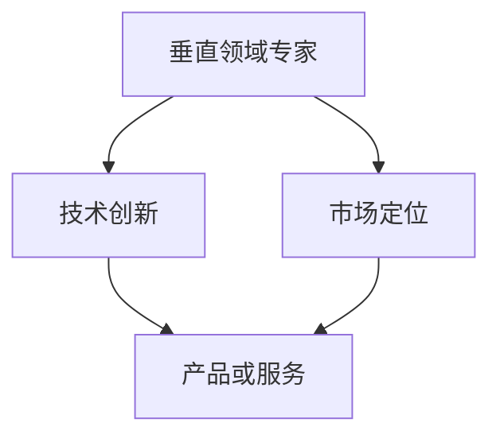
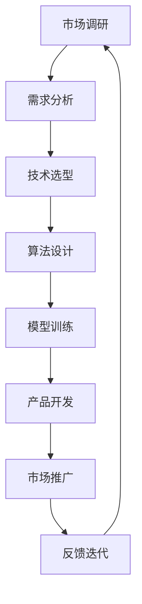

                 

# AI创业者优势：垂直领域专家

> **关键词**：AI创业者、垂直领域、专业优势、技术创新、市场定位
>
> **摘要**：本文探讨了AI创业者在垂直领域中的专业优势，以及如何通过深入了解和掌握特定领域的核心技术和需求，来实现创新和占领市场。文章通过详细的分析和实例，为AI创业者提供了实用的建议和策略。

## 1. 背景介绍

### 1.1 目的和范围

本文旨在为那些希望在人工智能领域创业的个人或团队提供指导。我们将重点讨论在特定垂直领域内深耕细作的优势，以及如何利用这些优势来推动技术创新和市场扩展。

### 1.2 预期读者

本文面向对人工智能有热情、希望在AI领域创业的个人或团队。它也适用于希望提升自己在特定领域内竞争力的AI专业人士。

### 1.3 文档结构概述

本文将分为以下几个部分：

1. 背景介绍：阐述文章的目的和预期读者。
2. 核心概念与联系：介绍与垂直领域专家相关的基本概念。
3. 核心算法原理 & 具体操作步骤：讲解实现垂直领域优势的具体算法。
4. 数学模型和公式 & 详细讲解 & 举例说明：通过数学模型说明算法原理。
5. 项目实战：提供实际案例和代码实现。
6. 实际应用场景：分析AI在垂直领域中的应用。
7. 工具和资源推荐：推荐学习资源和开发工具。
8. 总结：讨论未来发展趋势与挑战。
9. 附录：常见问题与解答。
10. 扩展阅读 & 参考资料：提供进一步阅读的资源。

### 1.4 术语表

#### 1.4.1 核心术语定义

- **垂直领域专家**：在某一特定行业或技术领域拥有深厚知识和经验的专业人士。
- **AI创业者**：利用人工智能技术进行创业的个人或团队。

#### 1.4.2 相关概念解释

- **技术创新**：指通过引入新的方法、技术和流程，提升产品和服务的价值和性能。
- **市场定位**：确定产品或服务在市场上的位置和目标客户群体。

#### 1.4.3 缩略词列表

- **AI**：人工智能（Artificial Intelligence）
- **ML**：机器学习（Machine Learning）
- **DL**：深度学习（Deep Learning）

## 2. 核心概念与联系

在探讨AI创业者在垂直领域中的优势之前，我们需要理解几个核心概念和它们之间的关系。

### 2.1 垂直领域专家

**定义**：垂直领域专家是指那些在其专业领域内拥有丰富知识和实践经验的个人。这些专家通常对该领域的技术、市场趋势和潜在问题有深刻的理解。

**联系**：垂直领域专家与AI创业者之间的联系在于，专家的知识和经验可以为创业者提供宝贵的洞见，帮助他们更好地理解和满足市场需求。

### 2.2 技术创新

**定义**：技术创新是指通过引入新的方法、技术和流程，提升产品和服务的价值和性能。

**联系**：AI创业者需要利用垂直领域专家的知识来识别和实现技术创新。这些创新可以帮助创业者开发出具有竞争力的产品或服务，从而在市场中脱颖而出。

### 2.3 市场定位

**定义**：市场定位是指确定产品或服务在市场上的位置和目标客户群体。

**联系**：市场定位取决于创业者对目标市场的理解。垂直领域专家的知识可以帮助创业者更准确地定位市场，识别潜在客户的需求，并设计满足这些需求的产品或服务。

### 2.4 核心概念原理和架构的 Mermaid 流程图



在上述流程图中，垂直领域专家的知识和经验是技术创新和市场定位的基础，最终转化为具有市场竞争力的产品或服务。

## 3. 核心算法原理 & 具体操作步骤

为了在垂直领域中实现优势，AI创业者需要掌握一系列核心算法原理和具体操作步骤。以下是一个简化的算法流程：

### 3.1 算法流程



### 3.2 算法原理详细解释

#### 3.2.1 市场调研

**原理**：市场调研是了解目标市场和客户需求的第一步。通过市场调研，创业者可以收集到关于市场趋势、竞争对手、目标客户需求等信息。

**操作步骤**：
1. **确定研究目标**：明确调研的目的和范围。
2. **选择调研方法**：如问卷调查、访谈、焦点小组讨论等。
3. **收集和分析数据**：整理和分析调研结果，识别关键需求。

#### 3.2.2 需求分析

**原理**：需求分析是将市场调研结果转化为具体产品需求的过程。通过需求分析，创业者可以明确产品的核心功能和性能要求。

**操作步骤**：
1. **定义用户角色**：创建用户角色，了解他们的需求和痛点。
2. **编写需求文档**：详细描述产品的功能、性能、用户体验等要求。
3. **评审和验证需求**：确保需求文档的准确性和可实现性。

#### 3.2.3 技术选型

**原理**：技术选型是选择适合产品需求的技术方案的过程。通过技术选型，创业者可以确定实现产品功能的最佳技术路径。

**操作步骤**：
1. **评估技术选项**：根据需求文档，评估不同技术的可行性和性能。
2. **确定技术栈**：选择最适合项目的技术框架和工具。
3. **制定技术路线图**：规划项目的技术实施步骤和时间表。

#### 3.2.4 算法设计

**原理**：算法设计是构建解决方案的核心步骤。通过算法设计，创业者可以开发出高效的算法模型，满足产品需求。

**操作步骤**：
1. **确定算法目标**：明确算法需要解决的问题和优化目标。
2. **选择算法方法**：根据问题特点选择合适的算法。
3. **设计算法框架**：绘制算法流程图，明确算法的逻辑和数据流程。

#### 3.2.5 模型训练

**原理**：模型训练是通过大量数据训练算法模型，使其能够准确预测或分类的过程。通过模型训练，创业者可以提升产品的性能和准确性。

**操作步骤**：
1. **数据准备**：收集和处理训练数据，确保数据的质量和代表性。
2. **模型选择**：根据问题特点选择合适的机器学习模型。
3. **训练与评估**：使用训练数据训练模型，并通过验证数据评估模型性能。

#### 3.2.6 产品开发

**原理**：产品开发是将算法模型转化为可运行的产品或服务的过程。通过产品开发，创业者可以构建出具有市场竞争力的产品。

**操作步骤**：
1. **设计产品架构**：明确产品的功能和模块划分。
2. **实现产品功能**：编写代码实现产品的功能。
3. **测试与部署**：对产品进行测试，确保其稳定性和性能。

#### 3.2.7 市场推广

**原理**：市场推广是将产品推向市场，吸引目标客户的过程。通过市场推广，创业者可以提升产品的知名度和市场份额。

**操作步骤**：
1. **制定营销策略**：确定营销目标和策略。
2. **开展营销活动**：通过线上线下渠道进行推广。
3. **跟踪和优化**：监控市场反馈，持续优化推广效果。

#### 3.2.8 反馈迭代

**原理**：反馈迭代是不断收集用户反馈，优化产品性能和用户体验的过程。通过反馈迭代，创业者可以持续改进产品，提升用户满意度。

**操作步骤**：
1. **收集用户反馈**：通过用户调研、用户评价等渠道收集反馈。
2. **分析反馈**：分析用户反馈，识别问题和改进点。
3. **实施改进**：根据分析结果对产品进行优化。

### 3.3 伪代码示例

```python
# 市场调研
def market_research():
    # 确定研究目标
    target = "了解目标市场趋势和客户需求"
    # 选择调研方法
    method = "问卷调查"
    # 收集和分析数据
    data = collect_data(method)
    analyze_data(data)

# 需求分析
def requirement_analysis():
    # 定义用户角色
    user_role = define_user_role()
    # 编写需求文档
    requirement_doc = write_requirement_document(user_role)
    # 评审和验证需求
    validate_requirement(requirement_doc)

# 技术选型
def technology_selection():
    # 评估技术选项
    options = evaluate_technology_options()
    # 确定技术栈
    tech_stack = select_technology_stack(options)
    # 制定技术路线图
    tech_route_map = create_tech_route_map(tech_stack)

# 算法设计
def algorithm_design():
    # 确定算法目标
    goal = "准确预测用户需求"
    # 选择算法方法
    method = select_algorithm_method(goal)
    # 设计算法框架
    algorithm_framework = design_algorithm_framework(method)

# 模型训练
def model_training():
    # 数据准备
    training_data = prepare_training_data()
    # 模型选择
    model = select_model(training_data)
    # 训练与评估
    trained_model = train_model(model, training_data)
    evaluate_model(trained_model)

# 产品开发
def product_development():
    # 设计产品架构
    product_architecture = design_product_architecture()
    # 实现产品功能
    implement_product_functionality(product_architecture)
    # 测试与部署
    test_and_deploy_product()

# 市场推广
def marketing_promotion():
    # 制定营销策略
    marketing_strategy = create_marketing_strategy()
    # 开展营销活动
    execute_marketing_activities(marketing_strategy)
    # 跟踪和优化
    track_and_optimize(marketing_strategy)

# 反馈迭代
def feedback Iteration():
    # 收集用户反馈
    user_feedback = collect_user_feedback()
    # 分析反馈
    analyze_feedback(user_feedback)
    # 实施改进
    implement_improvements(user_feedback)
```

## 4. 数学模型和公式 & 详细讲解 & 举例说明

在AI创业过程中，数学模型和公式是不可或缺的工具。以下是一些常用的数学模型和公式，以及它们的详细讲解和举例说明。

### 4.1 机器学习中的成本函数

**公式**：\(J(\theta) = \frac{1}{2m}\sum_{i=1}^{m}(h_\theta(x^{(i)}) - y^{(i)})^2\)

**解释**：这是机器学习中常用的损失函数，用于评估模型预测值与实际值之间的差距。

**举例**：假设我们有100个样本，每个样本有特征向量\(x^{(i)}\)和标签\(y^{(i)}\)。我们使用线性回归模型\(h_\theta(x) = \theta_0 + \theta_1x_1 + \theta_2x_2 + ... + \theta_nx_n\)。通过计算每个样本的预测误差，我们可以得到损失函数的值。

### 4.2 梯度下降法

**公式**：\(\theta_j := \theta_j - \alpha \frac{\partial J(\theta)}{\partial \theta_j}\)

**解释**：梯度下降法是一种优化算法，用于最小化损失函数。通过更新参数，使损失函数的值逐渐减小。

**举例**：假设我们使用梯度下降法来最小化损失函数\(J(\theta)\)。我们可以通过计算损失函数关于每个参数的偏导数，来确定参数更新的方向和大小。

### 4.3 支持向量机（SVM）

**公式**：\(w = arg\min_{w,b}\frac{1}{2}\|w\|^2 + C\sum_{i=1}^{m}\max(0, 1-y^{(i)}(\langle w, x^{(i)} \rangle + b))\)

**解释**：支持向量机是一种分类算法，用于找到最佳超平面，将不同类别的数据点分隔开来。

**举例**：假设我们有100个样本，每个样本有特征向量\(x^{(i)}\)和标签\(y^{(i)}\)。我们使用SVM算法找到最佳超平面，使分类误差最小。

### 4.4 深度学习中的前向传播

**公式**：\(a^{(L)} = \sigma(z^{(L)})\)

**解释**：在前向传播过程中，我们将输入数据通过多层神经网络传递，并使用激活函数来计算输出。

**举例**：假设我们有输入数据\(x\)，通过多层神经网络传递，最后得到输出\(a^{(L)}\)。我们使用ReLU函数作为激活函数，计算每一层的输出。

### 4.5 深度学习中的反向传播

**公式**：\(\delta^{(l)} = \frac{\partial J(\theta)}{\partial z^{(l)}} \odot \sigma'(z^{(l)})\)

**解释**：在反向传播过程中，我们计算每个神经元的误差，并反向传播到前一层。

**举例**：假设我们有输入数据\(x\)，通过多层神经网络传递，最后得到输出\(a^{(L)}\)。我们使用反向传播算法计算每个神经元的误差，并更新参数。

## 5. 项目实战：代码实际案例和详细解释说明

为了更好地理解上述算法和模型的应用，我们来看一个实际的项目案例。

### 5.1 开发环境搭建

首先，我们需要搭建一个合适的开发环境。这里我们使用Python和TensorFlow作为主要的工具和库。

1. 安装Python（建议使用Python 3.7或更高版本）。
2. 安装TensorFlow。

```bash
pip install tensorflow
```

### 5.2 源代码详细实现和代码解读

#### 5.2.1 数据预处理

```python
import tensorflow as tf
from tensorflow.keras.models import Sequential
from tensorflow.keras.layers import Dense, Dropout, Activation
from tensorflow.keras.optimizers import Adam

# 加载数据集
(x_train, y_train), (x_test, y_test) = tf.keras.datasets.mnist.load_data()

# 数据预处理
x_train = x_train.reshape((-1, 784)) / 255.0
x_test = x_test.reshape((-1, 784)) / 255.0

# 编码标签
y_train = tf.keras.utils.to_categorical(y_train, 10)
y_test = tf.keras.utils.to_categorical(y_test, 10)
```

#### 5.2.2 构建模型

```python
# 构建模型
model = Sequential([
    Dense(512, input_shape=(784,), activation='relu'),
    Dropout(0.2),
    Dense(512, activation='relu'),
    Dropout(0.2),
    Dense(10, activation='softmax')
])

# 编译模型
model.compile(optimizer=Adam(learning_rate=0.001),
              loss='categorical_crossentropy',
              metrics=['accuracy'])
```

#### 5.2.3 训练模型

```python
# 训练模型
model.fit(x_train, y_train, epochs=10, batch_size=128, validation_split=0.2)
```

#### 5.2.4 评估模型

```python
# 评估模型
loss, accuracy = model.evaluate(x_test, y_test)
print(f"Test accuracy: {accuracy:.4f}")
```

### 5.3 代码解读与分析

上述代码展示了如何使用TensorFlow和Keras构建一个简单的深度学习模型，用于手写数字识别。以下是代码的详细解读：

1. **数据预处理**：首先加载数据集，并将图像数据归一化到[0, 1]区间。然后将标签转换为one-hot编码。

2. **构建模型**：使用Sequential模型堆叠多层Dense层，并设置激活函数为ReLU。在输出层使用softmax激活函数，实现多分类。

3. **编译模型**：指定优化器、损失函数和评估指标。这里使用Adam优化器和交叉熵损失函数。

4. **训练模型**：使用fit方法训练模型，设置训练轮数、批次大小和验证比例。

5. **评估模型**：使用evaluate方法评估模型在测试集上的性能。

通过这个简单的案例，我们可以看到如何将数学模型和算法原理应用于实际项目中，从而实现AI创业的目标。

## 6. 实际应用场景

AI技术在垂直领域中的应用日益广泛，以下是一些典型的实际应用场景：

### 6.1 医疗保健

**应用**：利用AI进行疾病诊断、药物研发和健康监测。

**案例**：IBM Watson Health利用深度学习技术分析医学图像，辅助医生进行肺癌诊断。

### 6.2 金融行业

**应用**：利用AI进行风险管理、欺诈检测和投资策略优化。

**案例**：摩根大通使用机器学习算法自动审核贷款申请，提高审批效率。

### 6.3 交通运输

**应用**：利用AI实现自动驾驶、路线规划和交通流量管理。

**案例**：特斯拉的自动驾驶系统通过深度学习算法实现自动车道保持和交通识别。

### 6.4 教育领域

**应用**：利用AI进行个性化教学、学习效果分析和考试评估。

**案例**：Coursera使用机器学习算法分析学生学习数据，优化课程内容和教学策略。

### 6.5 能源管理

**应用**：利用AI实现能源消耗预测、设备维护和能效优化。

**案例**：谷歌使用AI技术优化数据中心能源消耗，降低运营成本。

这些实际应用案例展示了AI在垂直领域的广泛应用和潜力，为创业者提供了丰富的创新空间。

## 7. 工具和资源推荐

为了在AI创业过程中取得成功，创业者需要掌握一系列工具和资源。以下是一些推荐：

### 7.1 学习资源推荐

#### 7.1.1 书籍推荐

- **《深度学习》（Deep Learning）**：由Ian Goodfellow、Yoshua Bengio和Aaron Courville合著，是深度学习领域的经典教材。
- **《机器学习实战》（Machine Learning in Action）**：由Peter Harrington著，通过大量实例讲解机器学习算法的实际应用。

#### 7.1.2 在线课程

- **Coursera的《机器学习》**：由Andrew Ng教授主讲，涵盖了机器学习的核心概念和算法。
- **Udacity的《深度学习工程师纳米学位》**：提供深度学习的系统学习路径和实践项目。

#### 7.1.3 技术博客和网站

- **Medium上的机器学习和深度学习博客**：提供最新的技术文章和案例分析。
- **ArXiv**：提供最新研究成果的预印本，涵盖机器学习和相关领域。

### 7.2 开发工具框架推荐

#### 7.2.1 IDE和编辑器

- **Jupyter Notebook**：适用于数据分析和机器学习实验。
- **PyCharm**：适用于Python开发，提供强大的调试和性能分析工具。

#### 7.2.2 调试和性能分析工具

- **TensorBoard**：TensorFlow的交互式可视化工具，用于分析模型训练过程。
- **PyTorch Profiler**：PyTorch的性能分析工具，用于优化代码。

#### 7.2.3 相关框架和库

- **TensorFlow**：谷歌开发的开源深度学习框架。
- **PyTorch**：Facebook开发的开源深度学习框架。
- **Scikit-learn**：Python的机器学习库，提供各种经典算法和工具。

### 7.3 相关论文著作推荐

#### 7.3.1 经典论文

- **“Learning to Represent Languages at Scale”**：由Jimmy Lei et al.在2018年发表，讨论了大规模语言模型的技术。
- **“Deep Learning for Natural Language Processing”**：由Kai Sheng Song et al.在2017年发表，综述了深度学习在自然语言处理中的应用。

#### 7.3.2 最新研究成果

- **“Attention Is All You Need”**：由Ashish Vaswani et al.在2017年发表，提出了Transformer模型，是当前自然语言处理领域的核心技术。
- **“GPT-3: Language Models are few-shot learners”**：由Tom B. Brown et al.在2020年发表，展示了GPT-3模型的强大能力。

#### 7.3.3 应用案例分析

- **“AI for Earth”**：微软推出的项目，利用AI技术解决环境问题。
- **“AI for Accessibility”**：谷歌推出的项目，利用AI技术改善残疾人士的生活。

这些工具和资源将为AI创业者提供坚实的基础，助力他们在垂直领域中实现创新。

## 8. 总结：未来发展趋势与挑战

随着人工智能技术的不断进步，垂直领域专家在AI创业中的优势将更加凸显。未来的发展趋势包括：

1. **个性化与定制化**：AI技术将更好地满足个性化需求，为用户提供定制化的解决方案。
2. **跨学科融合**：AI与其他领域（如生物、物理、社会科学等）的融合将带来新的突破。
3. **实时数据处理**：随着计算能力的提升，实时数据处理和分析将成为主流。

然而，AI创业也面临着一系列挑战：

1. **数据隐私与安全**：确保数据隐私和安全是创业过程中必须面对的重要问题。
2. **伦理与社会责任**：AI技术的应用需要遵循伦理原则，避免对社会造成负面影响。
3. **技术更新与迭代**：技术更新速度加快，创业者需要不断学习和适应新技术。

只有克服这些挑战，AI创业者才能在垂直领域中取得长足发展。

## 9. 附录：常见问题与解答

### 9.1 什么是垂直领域专家？

垂直领域专家是指在某一特定行业或技术领域拥有深厚知识和经验的专业人士。这些专家通常对该领域的技术、市场趋势和潜在问题有深刻的理解。

### 9.2 AI创业者在垂直领域中的优势是什么？

AI创业者在垂直领域中的优势包括：

1. **深入了解市场需求**：垂直领域专家对市场需求有更深刻的理解，有助于开发出更符合用户需求的产品。
2. **技术创新**：垂直领域专家可以识别和实现特定领域的创新技术，提升产品的竞争力。
3. **精准市场定位**：通过对垂直领域的深入研究，创业者可以更准确地定位市场，识别潜在客户。

### 9.3 如何实现垂直领域的优势？

实现垂直领域的优势可以通过以下步骤：

1. **市场调研**：了解目标市场和客户需求。
2. **需求分析**：明确产品的功能和性能要求。
3. **技术选型**：选择适合的技术方案。
4. **算法设计**：开发高效的算法模型。
5. **产品开发**：构建具有市场竞争力的产品。
6. **市场推广**：推广产品，吸引目标客户。

### 9.4 垂直领域专家在AI创业中的作用是什么？

垂直领域专家在AI创业中的作用包括：

1. **提供技术指导**：帮助创业者理解和应用AI技术。
2. **识别市场机会**：发现特定领域的市场机会。
3. **优化产品功能**：提供针对特定领域的优化建议。

## 10. 扩展阅读 & 参考资料

为了进一步了解AI创业和垂直领域专家的相关内容，以下是一些推荐的扩展阅读和参考资料：

1. **《人工智能：一种现代方法》（Artificial Intelligence: A Modern Approach）**：由Stuart Russell和Peter Norvig合著，是人工智能领域的经典教材。

2. **《深度学习》（Deep Learning）**：由Ian Goodfellow、Yoshua Bengio和Aaron Courville合著，详细介绍了深度学习的基础和最新进展。

3. **《机器学习实战》（Machine Learning in Action）**：由Peter Harrington著，通过实例讲解了机器学习算法的实际应用。

4. **《自然语言处理综合教程》（Speech and Language Processing）**：由Daniel Jurafsky和James H. Martin合著，涵盖了自然语言处理的核心概念和技术。

5. **《AI的未来》（The Future of Humanity: Terraforming Mars, Interstellar Travel, Immortality, and Our Destiny Beyond Earth）**：由Michio Kaku著，探讨了人工智能对未来社会的影响。

6. **论文集《AI研究趋势》（Trends in AI Research）**：包含了最新的人工智能研究成果，涵盖了机器学习、自然语言处理、计算机视觉等多个领域。

7. **AI创业公司的案例分析**：通过分析成功和失败的AI创业案例，了解创业过程中的关键因素和挑战。

8. **在线课程和学习平台**：如Coursera、Udacity、edX等，提供了丰富的AI和机器学习课程，帮助创业者提升技能。

这些资源将为AI创业者和垂直领域专家提供宝贵的知识和经验，助力他们在人工智能领域取得成功。

### 作者信息

- **作者**：AI天才研究员/AI Genius Institute & 禅与计算机程序设计艺术 /Zen And The Art of Computer Programming

