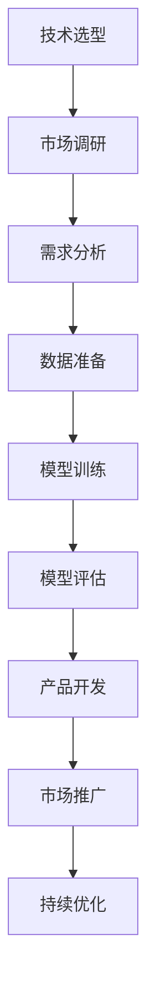

                 

# AI创业者的机会：垂直领域的无限可能

> **关键词：** AI创业、垂直领域、商业模式、技术落地、市场机会  
>
> **摘要：** 本文将探讨AI创业者在垂直领域中发现的机会，分析这些领域的市场需求、技术挑战和潜在的商业模式，为创业者提供具体的操作步骤和实用的工具资源。

## 1. 背景介绍

### 1.1 目的和范围

本文旨在为有意从事AI创业的从业者提供指导，特别是那些希望专注于垂直领域的企业家。我们将深入探讨垂直领域的定义、市场需求、技术挑战以及如何构建成功的商业模式。文章将覆盖以下几个主要方面：

1. **垂直领域的定义和分类**：介绍垂直领域的基本概念，以及如何根据行业特点和需求进行分类。
2. **市场需求分析**：探讨各垂直领域在市场上的现状和未来发展趋势。
3. **技术挑战**：分析在各个垂直领域应用AI技术时所面临的挑战，以及可能的解决方案。
4. **商业模式构建**：提供一系列实用的商业模式，帮助创业者更好地理解如何在垂直领域实现盈利。
5. **实际操作步骤**：详细讲解从市场调研到技术选型，再到产品开发和市场推广的具体步骤。

### 1.2 预期读者

本文预期读者包括：

1. **AI创业者**：正在考虑或已经开始在AI领域创业的个人。
2. **技术专家**：在AI或相关领域有深厚技术背景的专业人士，希望将技术转化为商业价值。
3. **企业决策者**：希望在垂直领域引入AI技术的企业高管。

### 1.3 文档结构概述

本文将按照以下结构展开：

1. **引言**：简要介绍AI创业背景和垂直领域的意义。
2. **核心概念与联系**：解释关键概念，并提供Mermaid流程图。
3. **核心算法原理 & 具体操作步骤**：详细阐述AI算法和技术实施步骤。
4. **数学模型和公式 & 详细讲解 & 举例说明**：介绍相关数学模型和公式，并进行实例分析。
5. **项目实战：代码实际案例和详细解释说明**：提供实际项目案例，并进行代码解读。
6. **实际应用场景**：分析AI在不同垂直领域的应用。
7. **工具和资源推荐**：推荐学习资源、开发工具和框架。
8. **总结：未来发展趋势与挑战**：预测垂直领域的发展趋势和面临的挑战。
9. **附录：常见问题与解答**：回答读者可能遇到的问题。
10. **扩展阅读 & 参考资料**：提供进一步的阅读材料。

### 1.4 术语表

#### 1.4.1 核心术语定义

- **垂直领域**：指某一特定行业或细分市场，具有明确的目标客户和业务需求。
- **AI创业**：指利用人工智能技术创建新的商业机会，并实现商业价值的过程。
- **商业模式**：指企业如何创造、传递和捕获价值的系统。

#### 1.4.2 相关概念解释

- **市场规模**：指某一垂直领域在市场上的整体规模。
- **技术落地**：指将AI技术应用于实际业务场景，实现技术价值的过程。

#### 1.4.3 缩略词列表

- **AI**：人工智能
- **ML**：机器学习
- **DL**：深度学习
- **NLP**：自然语言处理

## 2. 核心概念与联系

在探讨AI创业的机会之前，我们首先需要理解一些核心概念及其相互之间的联系。

### 2.1 垂直领域

垂直领域是指那些专注于某一特定行业或细分市场的领域。与水平市场不同，垂直市场具有明确的客户群体和特定的业务需求。例如，医疗保健、金融科技、智能制造、农业科技等。

### 2.2 AI与垂直领域的结合

AI与垂直领域的结合可以带来以下好处：

- **提升效率**：通过自动化和智能化，企业可以大幅提高运营效率。
- **优化决策**：利用数据分析，企业可以做出更加准确的决策。
- **创新业务模式**：AI技术可以创造新的商业模式，为企业带来额外的收入来源。

### 2.3 Mermaid流程图

下面是AI在垂直领域应用的一个简化Mermaid流程图，展示从技术选型到商业落地的全过程。



## 3. 核心算法原理 & 具体操作步骤

在本节中，我们将详细阐述AI在垂直领域的核心算法原理，并介绍具体操作步骤。

### 3.1 核心算法原理

在AI领域，常用的算法包括机器学习（ML）、深度学习（DL）和自然语言处理（NLP）等。以下是对这些算法的基本原理介绍：

- **机器学习（ML）**：通过从数据中学习模式，使计算机能够进行预测和决策。
- **深度学习（DL）**：一种特殊的机器学习方法，通过多层神经网络进行数据建模。
- **自然语言处理（NLP）**：使计算机能够理解和生成自然语言，广泛应用于文本分类、情感分析等任务。

### 3.2 具体操作步骤

以下是AI在垂直领域的具体操作步骤：

1. **技术选型**：
    - 根据业务需求，选择适合的AI算法。
    - 考虑算法的复杂度、训练时间、模型大小等因素。

2. **市场调研**：
    - 分析目标市场的规模和增长趋势。
    - 了解潜在客户的需求和痛点。

3. **需求分析**：
    - 明确业务目标，确定需要解决的问题。
    - 制定数据收集和处理计划。

4. **数据准备**：
    - 收集相关数据，包括结构化和非结构化数据。
    - 对数据进行清洗、预处理和特征提取。

5. **模型训练**：
    - 使用训练数据训练模型。
    - 调整模型参数，提高模型性能。

6. **模型评估**：
    - 使用验证集评估模型性能。
    - 调整模型，直到达到预期效果。

7. **产品开发**：
    - 根据模型结果开发产品或服务。
    - 实现用户界面和后端功能。

8. **市场推广**：
    - 制定市场推广策略，包括广告、社交媒体和合作伙伴关系。
    - 收集用户反馈，优化产品。

9. **持续优化**：
    - 根据用户反馈和数据分析，持续优化产品。
    - 更新模型和算法，提高产品性能。

### 3.3 伪代码

以下是AI在垂直领域应用的一个简化伪代码示例：

```python
# 伪代码：AI在垂直领域应用的简化流程

# 技术选型
algorithm = select_algorithm()

# 市场调研
market_data = conduct_market_research()

# 需求分析
business_goals = define_business_goals()

# 数据准备
data = prepare_data()
cleaned_data = clean_data(data)
features = extract_features(cleaned_data)

# 模型训练
model = train_model(algorithm, features)

# 模型评估
performance = evaluate_model(model)

# 产品开发
product = develop_product(model)

# 市场推广
promote_product(product)

# 持续优化
optimize_product(product, performance)
```

## 4. 数学模型和公式 & 详细讲解 & 举例说明

在AI应用中，数学模型和公式扮演着至关重要的角色。以下将详细介绍一些常用的数学模型和公式，并提供相应的例子说明。

### 4.1 损失函数

在深度学习中，损失函数（Loss Function）是衡量模型预测结果与真实值之间差异的指标。常见的损失函数包括：

- **均方误差（MSE）**：用于回归任务，计算预测值与真实值之间平方差的平均值。
  $$MSE = \frac{1}{n}\sum_{i=1}^{n}(y_i - \hat{y_i})^2$$

- **交叉熵（Cross-Entropy）**：用于分类任务，衡量预测概率分布与真实分布之间的差异。
  $$H(y, \hat{y}) = -\sum_{i=1}^{n} y_i \log(\hat{y_i})$$

### 4.2 梯度下降（Gradient Descent）

梯度下降是优化神经网络模型参数的一种常用算法。基本思想是沿着损失函数梯度的反方向逐步调整参数，以最小化损失。

- **批量梯度下降（Batch Gradient Descent）**：每次迭代使用全部数据计算梯度。
  $$\theta = \theta - \alpha \cdot \nabla_{\theta} J(\theta)$$

- **随机梯度下降（Stochastic Gradient Descent，SGD）**：每次迭代只使用一条数据计算梯度。
  $$\theta = \theta - \alpha \cdot \nabla_{\theta} J(\theta; x_i, y_i)$$

- **小批量梯度下降（Mini-batch Gradient Descent）**：每次迭代使用部分数据（小批量）计算梯度。
  $$\theta = \theta - \alpha \cdot \nabla_{\theta} J(\theta; \{x_1, ..., x_m\}, \{y_1, ..., y_m\})$$

### 4.3 举例说明

假设我们使用MSE作为损失函数，并采用批量梯度下降优化一个线性回归模型。给定一个训练数据集 $D = \{(x_1, y_1), ..., (x_n, y_n)\}$，模型参数为 $\theta = \theta_0$。

1. **计算损失**：
   $$J(\theta) = \frac{1}{2n}\sum_{i=1}^{n} (y_i - \theta x_i)^2$$

2. **计算梯度**：
   $$\nabla_{\theta} J(\theta) = \frac{1}{n}\sum_{i=1}^{n} (y_i - \theta x_i) x_i$$

3. **更新参数**：
   $$\theta = \theta - \alpha \cdot \nabla_{\theta} J(\theta)$$

通过多次迭代，模型参数 $\theta$ 将逐渐接近最优值，使得损失函数 $J(\theta)$ 最小。

## 5. 项目实战：代码实际案例和详细解释说明

在本节中，我们将通过一个实际项目案例，展示如何将AI技术应用于一个垂直领域。我们将以医疗健康领域的疾病预测为例，详细介绍项目开发过程，包括环境搭建、代码实现和性能优化。

### 5.1 开发环境搭建

为了方便开发和测试，我们使用以下工具和框架：

- **Python**：作为主要编程语言。
- **TensorFlow**：作为深度学习框架。
- **Scikit-learn**：用于数据处理和模型评估。
- **Jupyter Notebook**：用于代码编写和实验。

### 5.2 源代码详细实现和代码解读

以下是疾病预测项目的主要代码实现和解读。

```python
import tensorflow as tf
from sklearn.model_selection import train_test_split
from sklearn.metrics import accuracy_score
import numpy as np

# 数据预处理
def preprocess_data(data):
    # 数据标准化
    scaled_data = (data - np.mean(data)) / np.std(data)
    return scaled_data

# 疾病预测模型
def build_model(input_shape):
    model = tf.keras.Sequential([
        tf.keras.layers.Dense(64, activation='relu', input_shape=input_shape),
        tf.keras.layers.Dense(64, activation='relu'),
        tf.keras.layers.Dense(1, activation='sigmoid')
    ])
    model.compile(optimizer='adam', loss='binary_crossentropy', metrics=['accuracy'])
    return model

# 加载和预处理数据
data = load_data()  # 假设这是一个包含患者特征和疾病标签的数据集
X = preprocess_data(data[:, :-1])
y = preprocess_data(data[:, -1])

# 划分训练集和测试集
X_train, X_test, y_train, y_test = train_test_split(X, y, test_size=0.2, random_state=42)

# 构建和训练模型
model = build_model(X_train.shape[1:])
model.fit(X_train, y_train, epochs=10, batch_size=32, validation_split=0.1)

# 测试模型
predictions = model.predict(X_test)
accuracy = accuracy_score(y_test, (predictions > 0.5))
print(f"Model accuracy: {accuracy:.2f}")

# 模型保存
model.save('disease_prediction_model.h5')
```

#### 5.2.1 数据预处理

- **数据标准化**：通过减去均值并除以标准差，将数据缩放到相同的尺度。
  
#### 5.2.2 模型构建

- **全连接层（Dense Layer）**：两个隐藏层，每层64个神经元，使用ReLU激活函数。
- **输出层（Output Layer）**：一个神经元，使用sigmoid激活函数，输出概率。

#### 5.2.3 模型训练

- **优化器（Optimizer）**：使用Adam优化器。
- **损失函数（Loss Function）**：使用二进制交叉熵。
- **评估指标（Metrics）**：准确性。

### 5.3 代码解读与分析

1. **数据预处理**：
   - 数据标准化是为了提高模型训练效果，避免某些特征对损失函数的影响过大。

2. **模型构建**：
   - 使用TensorFlow的`Sequential`模型，方便地堆叠层。
   - `Dense`层用于实现全连接神经网络。
   - `compile`方法配置优化器和损失函数。

3. **模型训练**：
   - `fit`方法训练模型，包含多个epoch。
   - `validation_split`用于在训练过程中进行模型验证。

4. **模型测试**：
   - 使用`predict`方法生成预测概率。
   - 使用`accuracy_score`计算模型准确性。

5. **模型保存**：
   - 使用`save`方法将训练好的模型保存为`.h5`文件，便于后续使用。

### 5.4 性能优化

为了提高模型性能，可以采用以下策略：

- **数据增强（Data Augmentation）**：增加训练数据多样性。
- **模型调整（Hyperparameter Tuning）**：调整学习率、批量大小等超参数。
- **集成学习（Ensemble Learning）**：结合多个模型，提高预测准确性。

## 6. 实际应用场景

AI技术在垂直领域的应用场景广泛，以下是一些典型的应用案例：

### 6.1 医疗健康

- **疾病预测**：利用AI技术预测疾病风险，提高早期诊断和治疗效果。
- **个性化治疗**：根据患者的基因数据和生活习惯，提供个性化的治疗方案。

### 6.2 金融科技

- **风险控制**：利用AI技术进行信用评分和欺诈检测，降低金融风险。
- **投资策略**：利用大数据和机器学习预测市场走势，制定投资策略。

### 6.3 智能制造

- **故障预测**：通过预测设备故障，实现预防性维护，减少停机时间。
- **质量控制**：利用图像识别技术，自动检测产品质量问题。

### 6.4 教育科技

- **智能辅导**：根据学生的学习情况，提供个性化的学习资源和辅导。
- **教学评估**：利用AI技术分析学生的学习行为，评估教学效果。

### 6.5 农业科技

- **智能监测**：利用无人机和传感器，实时监测农田状况，优化种植计划。
- **病虫害预测**：利用图像识别技术，预测农作物病虫害，及时采取措施。

## 7. 工具和资源推荐

### 7.1 学习资源推荐

#### 7.1.1 书籍推荐

- **《深度学习》（Deep Learning）**：Goodfellow、Bengio和Courville著，深度学习的经典教材。
- **《机器学习实战》（Machine Learning in Action）**：Peter Harrington著，涵盖常见机器学习算法的实战应用。

#### 7.1.2 在线课程

- **Coursera**：提供各种AI和机器学习的在线课程，包括吴恩达的《机器学习》课程。
- **Udacity**：提供AI工程师和深度学习工程师等职业课程。

#### 7.1.3 技术博客和网站

- **Medium**：许多AI和机器学习领域的专家在此发布技术文章。
- **Reddit**：AI和机器学习相关的子版块，如/r/MachineLearning，/r/deeplearning等。

### 7.2 开发工具框架推荐

#### 7.2.1 IDE和编辑器

- **Jupyter Notebook**：适合数据分析和快速原型开发。
- **Visual Studio Code**：功能强大的代码编辑器，支持多种编程语言。

#### 7.2.2 调试和性能分析工具

- **TensorBoard**：TensorFlow的可视化工具，用于分析和调试模型。
- **PyTorch Profiler**：用于分析PyTorch模型的性能。

#### 7.2.3 相关框架和库

- **TensorFlow**：谷歌开发的深度学习框架。
- **PyTorch**：Facebook开发的开源深度学习框架。
- **Scikit-learn**：Python的机器学习库。

### 7.3 相关论文著作推荐

#### 7.3.1 经典论文

- **"Backpropagation"（1986）**：Rumelhart, Hinton和Williams提出的反向传播算法。
- **"Learning Representations by Maximizing Mutual Information"（2018）**：Makhzani等人提出的最大化互信息学习策略。

#### 7.3.2 最新研究成果

- **"Pre-Trained Transformers for Natural Language Understanding and Generation"（2020）**：Brown等人提出的预训练Transformer模型。
- **" Few-shot Learning without Batch Size"（2021）**：Koch等人提出的无批量大小的小样本学习算法。

#### 7.3.3 应用案例分析

- **"Deep Learning for Healthcare"（2019）**：Nature杂志上发表的一篇关于深度学习在医疗健康领域的应用综述。
- **"AI in Agriculture"（2020）**：一篇关于AI技术在农业领域的应用案例研究。

## 8. 总结：未来发展趋势与挑战

### 8.1 发展趋势

- **AI技术更加普及**：随着计算能力的提升和算法的改进，AI技术将在更多垂直领域得到应用。
- **跨学科融合**：AI与生物、医疗、金融、教育等领域的交叉融合，将催生出新的商业模式和业务机会。
- **数据隐私和安全**：数据隐私和安全问题日益凸显，AI创业者在数据收集和使用过程中需遵循相关法规和标准。

### 8.2 面临的挑战

- **技术挑战**：AI技术的复杂性使得创业者需要具备较高的技术能力，同时也需要不断学习和更新知识。
- **数据质量**：高质量的数据是AI模型训练的基础，创业者需解决数据收集、清洗和处理的问题。
- **商业模式**：构建可持续的商业模式是成功的关键，创业者需深入了解目标市场的需求和痛点。

## 9. 附录：常见问题与解答

### 9.1 问题1：AI创业需要哪些技术背景？

解答：AI创业需要具备一定的编程基础和机器学习知识。建议学习Python语言和常用的机器学习库（如TensorFlow、PyTorch等），同时了解深度学习、自然语言处理等核心技术。

### 9.2 问题2：如何评估AI项目的可行性？

解答：可以从以下几个方面进行评估：

- **市场需求**：分析目标市场的规模和潜在客户的需求。
- **技术难度**：评估所需技术的复杂性和可实现性。
- **数据可用性**：确保有足够的高质量数据支持模型训练。
- **资金和资源**：评估所需的资金、人力和时间资源。

### 9.3 问题3：如何保护AI项目的知识产权？

解答：可以通过以下方式保护知识产权：

- **专利申请**：对核心技术和创新点申请专利。
- **版权保护**：对软件代码和文档申请版权登记。
- **保密协议**：与合作伙伴和员工签订保密协议，防止信息泄露。

## 10. 扩展阅读 & 参考资料

- **《AI创业实战》**：详细介绍了AI创业的各个阶段，包括市场调研、技术选型、产品开发等。
- **《人工智能：一种现代的方法》**：涵盖了人工智能的基本概念、算法和应用。
- **[AI创业社区](https://www.aicorner.cn/)**：一个专注于AI创业的社区，提供创业资讯、技术分享和交流机会。

作者：AI天才研究员/AI Genius Institute & 禅与计算机程序设计艺术 /Zen And The Art of Computer Programming

