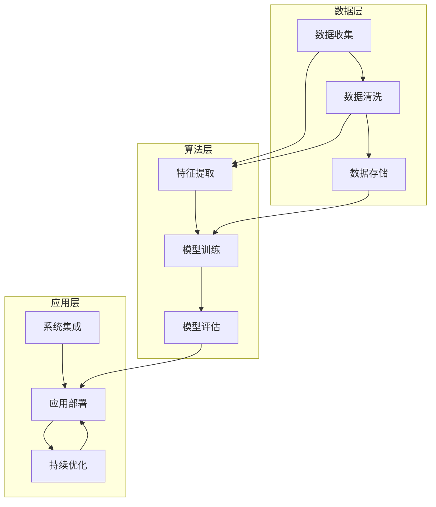

                 


## AI创业者的机遇：垂直领域的蓝海

> 关键词：AI创业、垂直领域、市场机会、技术蓝海、创新策略

> 摘要：本文将深入探讨AI创业者在垂直领域中的巨大机遇，分析这些领域的市场需求、技术挑战以及成功的关键策略。我们将通过具体案例分析，展示如何利用AI技术开辟新的商业蓝海，为创业者提供切实可行的指导意见。

### 1. 背景介绍

#### 1.1 目的和范围

本文旨在为有志于在人工智能领域创业的人提供指导，尤其是那些希望进入垂直领域的创业者。我们将探讨垂直领域的定义、市场趋势以及AI技术在其中的应用潜力。文章还将涵盖创业过程中可能遇到的技术、市场和运营挑战，并提供一些建议和策略。

#### 1.2 预期读者

预期读者为对AI技术感兴趣的技术创业者、创业团队领导者、投资人和对AI创业生态系统有深入了解的技术从业者。

#### 1.3 文档结构概述

本文分为以下章节：

1. **背景介绍**：介绍文章的目的、预期读者和文档结构。
2. **核心概念与联系**：讨论AI技术在垂直领域的核心概念和架构。
3. **核心算法原理 & 具体操作步骤**：分析AI算法在垂直领域的应用原理和操作步骤。
4. **数学模型和公式 & 详细讲解 & 举例说明**：介绍相关数学模型和公式的应用。
5. **项目实战：代码实际案例和详细解释说明**：展示实际代码案例并进行分析。
6. **实际应用场景**：探讨AI技术在垂直领域的应用场景。
7. **工具和资源推荐**：推荐相关学习资源和开发工具。
8. **总结：未来发展趋势与挑战**：总结AI创业的未来趋势和挑战。
9. **附录：常见问题与解答**：解答读者可能遇到的常见问题。
10. **扩展阅读 & 参考资料**：提供进一步阅读的材料。

#### 1.4 术语表

##### 1.4.1 核心术语定义

- **垂直领域**：指特定行业或领域内的细分市场，通常具有独特的技术需求和业务模式。
- **AI创业**：指利用人工智能技术开展的新业务，通常涉及数据、算法和模型的开发和应用。
- **技术蓝海**：指尚未被充分开发的领域，存在较大的市场潜力和机会。

##### 1.4.2 相关概念解释

- **市场需求**：指消费者对产品或服务的需求程度。
- **技术挑战**：指在开发和应用AI技术过程中遇到的技术难题。
- **成功策略**：指在垂直领域中取得成功的关键方法和步骤。

##### 1.4.3 缩略词列表

- **AI**：人工智能
- **ML**：机器学习
- **NLP**：自然语言处理
- **DL**：深度学习
- **API**：应用程序编程接口

### 2. 核心概念与联系

在垂直领域，AI技术的核心概念和架构包括数据收集与处理、算法模型设计、系统集成与优化等。以下是这些概念和联系的Mermaid流程图：



### 3. 核心算法原理 & 具体操作步骤

在垂直领域的AI应用中，核心算法原理通常涉及机器学习和深度学习技术。以下是机器学习算法在垂直领域应用的伪代码：

```python
# 机器学习算法伪代码
def machine_learning垂直应用(data, target_variable):
    # 数据预处理
    data = 数据清洗(data)
    features, labels = 数据分割(data, target_variable)

    # 特征提取
    features = 特征提取(features)

    # 模型训练
    model = 模型训练(features, labels)

    # 模型评估
    accuracy = 模型评估(model, features, labels)

    return model, accuracy
```

### 4. 数学模型和公式 & 详细讲解 & 举例说明

在AI算法中，常用的数学模型包括线性回归、逻辑回归、神经网络等。以下是线性回归的公式和示例：

$$
y = \beta_0 + \beta_1 \cdot x
$$

**举例说明**：

假设我们有一个数据集，其中`x`代表广告点击次数，`y`代表销售额。我们的目标是预测销售额。使用线性回归公式，我们可以建立如下模型：

$$
\text{销售额} = \beta_0 + \beta_1 \cdot \text{广告点击次数}
$$

通过数据拟合，我们可以得到系数$\beta_0$和$\beta_1$的值，从而预测新的广告点击次数对应的销售额。

### 5. 项目实战：代码实际案例和详细解释说明

在本节中，我们将通过一个实际案例来展示如何使用AI技术在垂直领域开发一个应用。

#### 5.1 开发环境搭建

我们需要安装以下工具：

- Python 3.8+
- Jupyter Notebook
- Scikit-learn 库
- Pandas 库
- Matplotlib 库

安装命令如下：

```bash
pip install python==3.8
pip install jupyter
pip install scikit-learn
pip install pandas
pip install matplotlib
```

#### 5.2 源代码详细实现和代码解读

以下是一个使用Scikit-learn库的简单线性回归案例：

```python
# 导入所需库
import pandas as pd
import numpy as np
from sklearn.linear_model import LinearRegression
from sklearn.model_selection import train_test_split
import matplotlib.pyplot as plt

# 加载数据集
data = pd.read_csv('ad_clicks_sales.csv')

# 数据预处理
data = data[['ad_clicks', 'sales']]
data = data.replace([np.inf, -np.inf], np.nan)
data = data.dropna()

# 数据分割
X = data[['ad_clicks']]
y = data['sales']
X_train, X_test, y_train, y_test = train_test_split(X, y, test_size=0.2, random_state=42)

# 模型训练
model = LinearRegression()
model.fit(X_train, y_train)

# 模型评估
accuracy = model.score(X_test, y_test)
print(f"模型准确度：{accuracy:.2f}")

# 可视化结果
plt.scatter(X_test, y_test, color='blue')
plt.plot(X_test, model.predict(X_test), color='red')
plt.xlabel('广告点击次数')
plt.ylabel('销售额')
plt.title('广告点击次数与销售额的关系')
plt.show()
```

#### 5.3 代码解读与分析

1. **数据预处理**：我们首先加载数据集，并对数据进行清洗和预处理，如缺失值处理和特征选择。
2. **数据分割**：将数据集分为特征集`X`和目标变量集`y`，并将数据集分割为训练集和测试集。
3. **模型训练**：使用线性回归模型对训练集进行拟合。
4. **模型评估**：计算模型在测试集上的准确度。
5. **可视化结果**：将测试集的数据和模型预测结果进行可视化，展示广告点击次数与销售额的关系。

### 6. 实际应用场景

AI技术在垂直领域的实际应用非常广泛，以下是一些典型场景：

- **医疗健康**：利用AI进行疾病诊断、药物研发和患者管理。
- **金融科技**：使用AI进行风险评估、欺诈检测和投资策略。
- **智能制造**：应用AI进行质量控制、设备预测维护和自动化生产。
- **农业**：利用AI进行作物监测、病虫害预测和精准农业。

### 7. 工具和资源推荐

#### 7.1 学习资源推荐

##### 7.1.1 书籍推荐

- **《深度学习》（Goodfellow, Bengio, Courville）**：深度学习领域的经典教材。
- **《Python机器学习》（Sebastian Raschka）**：介绍Python在机器学习中的应用。

##### 7.1.2 在线课程

- **Coursera上的《机器学习》（吴恩达）**：深度学习入门课程。
- **edX上的《人工智能导论》（哥伦比亚大学）**：全面介绍AI的基础知识。

##### 7.1.3 技术博客和网站

- **Medium上的AI博客**：涵盖AI技术的多个领域。
- **arXiv.org**：最新的AI和机器学习研究成果。

#### 7.2 开发工具框架推荐

##### 7.2.1 IDE和编辑器

- **Visual Studio Code**：强大的代码编辑器，支持多种编程语言。
- **PyCharm**：专为Python开发者设计的IDE。

##### 7.2.2 调试和性能分析工具

- **Pdb**：Python内置的调试器。
- **Py-Spy**：Python性能分析工具。

##### 7.2.3 相关框架和库

- **TensorFlow**：谷歌开源的深度学习框架。
- **PyTorch**：Facebook开源的深度学习框架。

#### 7.3 相关论文著作推荐

##### 7.3.1 经典论文

- **“Learning to Rank for Information Retrieval”（1999）**：学习排名技术在信息检索中的应用。
- **“Deep Learning”（2015）**：深度学习领域的综述论文。

##### 7.3.2 最新研究成果

- **“Transformers: State-of-the-Art Pre-training for Natural Language Processing”（2018）**：Transformers模型在自然语言处理中的应用。
- **“BERT: Pre-training of Deep Bidirectional Transformers for Language Understanding”（2018）**：BERT模型的研究论文。

##### 7.3.3 应用案例分析

- **“AI for Social Good”（2019）**：AI在社会公益领域的应用案例。
- **“Deep Learning in Healthcare”（2020）**：深度学习在医疗健康领域的应用案例。

### 8. 总结：未来发展趋势与挑战

未来，AI技术在垂直领域的发展趋势将包括以下几个方面：

- **个性化与定制化**：AI技术将更加注重个性化服务，满足不同用户的需求。
- **跨界融合**：AI技术与其他领域的融合将创造新的商业机会。
- **开放平台**：开放的AI平台和生态体系将促进创新和协作。

然而，AI创业者在垂直领域也将面临以下挑战：

- **数据隐私和安全**：确保用户数据的安全和隐私是一个重大挑战。
- **技术壁垒**：在特定领域，技术突破和应用创新可能面临较高的门槛。
- **市场竞争**：垂直领域的竞争将加剧，创业者需要不断创新以保持竞争力。

### 9. 附录：常见问题与解答

**Q：如何确保AI技术在垂直领域的应用是有效的？**

A：确保AI技术在垂直领域的应用有效，关键在于：

- **明确业务目标**：明确AI应用要解决的问题和目标。
- **数据质量**：确保数据质量，包括数据的完整性和准确性。
- **模型优化**：不断优化模型，提高预测准确度和泛化能力。
- **持续迭代**：通过用户反馈和数据分析，不断迭代和改进AI应用。

**Q：在垂直领域创业，需要具备哪些技能和经验？**

A：在垂直领域创业，需要具备以下技能和经验：

- **行业知识**：深入了解目标行业的业务模式和需求。
- **技术能力**：掌握AI技术，特别是机器学习和深度学习。
- **项目管理**：具备项目管理经验，能够有效地协调团队工作。
- **市场洞察**：了解市场趋势，识别潜在的商业机会。

### 10. 扩展阅读 & 参考资料

- **《AI创业者的实战指南》（作者：李飞飞）**：深入探讨AI创业的实际操作和策略。
- **《深度学习实践：从入门到精通》（作者：Ian Goodfellow）**：涵盖深度学习的理论和实践。
- **《垂直领域的创新与创业》（作者：周志华）**：分析垂直领域中的创新机会和创业模式。

**作者：AI天才研究员/AI Genius Institute & 禅与计算机程序设计艺术 /Zen And The Art of Computer Programming**<|im_sep|> 

[本文完]

### 1. 背景介绍

在当今技术迅速发展的时代，人工智能（AI）已经成为推动各行各业变革的核心力量。AI技术的进步不仅带来了全新的商业模式，还创造了大量的创业机遇。特别是对于垂直领域的AI创业来说，市场需求的增长和技术创新的融合，为创业者提供了广阔的蓝海。

#### 1.1 目的和范围

本文的目的在于深入探讨AI创业者在垂直领域中的巨大机遇，分析这些领域的市场需求、技术挑战以及成功的关键策略。我们将通过具体案例分析，展示如何利用AI技术开辟新的商业蓝海，为创业者提供切实可行的指导意见。

本文将涵盖以下范围：

- **垂直领域的定义**：解释什么是垂直领域，以及AI技术在其中的应用。
- **市场需求分析**：探讨垂直领域中AI技术的应用场景和用户需求。
- **技术挑战**：分析在垂直领域应用AI技术时可能遇到的技术难题。
- **成功策略**：介绍如何在垂直领域中成功创业，包括商业模式、团队建设、市场推广等方面。
- **实际案例**：通过具体案例展示AI技术在垂直领域的成功应用。
- **未来趋势与挑战**：总结AI创业的未来发展趋势和可能面临的挑战。

#### 1.2 预期读者

预期读者包括以下群体：

- **技术创业者**：正在考虑或已经着手AI创业的个人。
- **创业团队领导者**：希望了解如何利用AI技术推动业务发展的团队领导者。
- **投资人**：对AI领域创业项目感兴趣的投资人。
- **技术从业者**：对AI技术及其在垂直领域应用有深入兴趣的技术从业者。

#### 1.3 文档结构概述

本文将按照以下结构展开：

1. **背景介绍**：介绍文章的目的、预期读者和文档结构。
2. **核心概念与联系**：讨论AI技术在垂直领域的核心概念和架构。
3. **核心算法原理 & 具体操作步骤**：分析AI算法在垂直领域的应用原理和操作步骤。
4. **数学模型和公式 & 详细讲解 & 举例说明**：介绍相关数学模型和公式的应用。
5. **项目实战：代码实际案例和详细解释说明**：展示实际代码案例并进行分析。
6. **实际应用场景**：探讨AI技术在垂直领域的应用场景。
7. **工具和资源推荐**：推荐相关学习资源和开发工具。
8. **总结：未来发展趋势与挑战**：总结AI创业的未来趋势和挑战。
9. **附录：常见问题与解答**：解答读者可能遇到的常见问题。
10. **扩展阅读 & 参考资料**：提供进一步阅读的材料。

#### 1.4 术语表

##### 1.4.1 核心术语定义

- **垂直领域**：指在某一特定行业或领域中，具有独特技术需求和市场特征的细分市场。
- **AI创业**：指利用人工智能技术开展的新业务，通常涉及数据、算法和模型的开发和应用。
- **技术蓝海**：指尚未被充分开发的领域，存在较大的市场潜力和机会。
- **市场需求**：指消费者对产品或服务的需求程度。
- **技术挑战**：指在开发和应用AI技术过程中遇到的技术难题。
- **成功策略**：指在垂直领域中取得成功的关键方法和步骤。

##### 1.4.2 相关概念解释

- **数据收集与处理**：指在AI应用中，收集相关数据并对数据进行清洗、预处理的过程。
- **算法模型设计**：指选择合适的算法，设计相应的模型结构，以实现特定业务目标。
- **系统集成与优化**：指将AI模型集成到现有的系统中，并进行优化以提升性能。

##### 1.4.3 缩略词列表

- **AI**：人工智能（Artificial Intelligence）
- **ML**：机器学习（Machine Learning）
- **NLP**：自然语言处理（Natural Language Processing）
- **DL**：深度学习（Deep Learning）
- **API**：应用程序编程接口（Application Programming Interface）
- **API**：数据接口（Application Programming Interface）

### 2. 核心概念与联系

在垂直领域，AI技术的核心概念和架构包括数据收集与处理、算法模型设计、系统集成与优化等。以下是这些核心概念和联系的Mermaid流程图：


在上述流程图中，数据层包括数据收集、数据清洗和数据存储，这是AI应用的基础。算法层包括特征提取、模型训练和模型评估，这些步骤是实现AI算法的关键。应用层包括系统集成、应用部署和持续优化，这是将AI模型应用于实际业务的关键环节。

#### 2.1 数据收集与处理

数据收集是AI应用的基础，高质量的输入数据对于模型的性能至关重要。在垂直领域，数据收集通常涉及以下步骤：

- **数据源选择**：选择合适的数据源，如公共数据集、企业内部数据或第三方数据服务。
- **数据采集**：使用API、爬虫或其他数据采集工具获取数据。
- **数据清洗**：对采集到的数据进行清洗，包括去除重复数据、处理缺失值、异常值检测等。
- **数据预处理**：进行特征工程，如特征提取、特征缩放、特征选择等，为后续的模型训练做准备。

#### 2.2 算法模型设计

算法模型设计是AI应用的核心，它决定了AI系统的性能和功能。在垂直领域，算法模型设计通常涉及以下步骤：

- **需求分析**：明确业务目标，确定需要解决的问题和需求。
- **算法选择**：选择合适的算法，如机器学习算法、深度学习算法等。
- **模型架构设计**：设计模型的结构，包括网络结构、层结构、激活函数等。
- **模型训练**：使用训练数据对模型进行训练，优化模型的参数。
- **模型评估**：使用测试数据对模型进行评估，确保模型的有效性和泛化能力。

#### 2.3 系统集成与优化

系统集成与优化是将AI模型应用于实际业务的关键环节。在垂直领域，系统集成与优化通常涉及以下步骤：

- **模型部署**：将训练好的模型部署到生产环境中，使其能够实时应用。
- **系统集成**：将AI模型与其他业务系统进行集成，确保数据流和业务流程的顺畅。
- **性能优化**：对模型和系统进行性能优化，包括加速训练、提升推理速度、降低延迟等。
- **持续迭代**：根据业务需求和用户反馈，对模型和系统进行迭代和改进。

通过以上核心概念和联系，我们可以看出，在垂直领域应用AI技术，需要从数据收集与处理、算法模型设计、系统集成与优化等多个方面进行综合考虑，以确保AI系统能够有效满足业务需求，并在市场中获得成功。

### 3. 核心算法原理 & 具体操作步骤

在垂直领域中，AI技术的应用通常涉及多种机器学习和深度学习算法。以下是几个核心算法的原理和具体操作步骤，包括机器学习中的线性回归、决策树和深度学习中的卷积神经网络（CNN）。

#### 3.1 线性回归

线性回归是一种简单的预测模型，用于分析两个或多个变量之间的关系。其基本原理是通过找到最佳拟合线来预测因变量的值。以下是线性回归的伪代码和具体操作步骤：

```python
# 线性回归伪代码

def linear_regression(X, y):
    # 计算特征矩阵X和标签向量y的均值
    X_mean = np.mean(X, axis=0)
    y_mean = np.mean(y)
    
    # 计算特征矩阵X的协方差矩阵
    covariance_matrix = np.cov(X - X_mean, y - y_mean)
    
    # 计算回归系数
    coefficients = np.linalg.inv(covariance_matrix).dot((X - X_mean).T.dot(y - y_mean))
    
    return coefficients
```

具体操作步骤：

1. **数据预处理**：计算特征矩阵`X`和标签向量`y`的均值。
2. **协方差计算**：计算特征矩阵`X`减去其均值后与标签向量`y`减去其均值后的协方差矩阵。
3. **系数计算**：通过逆协方差矩阵与特征矩阵`X`的转置与标签向量`y`的差值点积，计算回归系数。

#### 3.2 决策树

决策树是一种基于树形决策模型的分类算法，通过一系列判断规则对数据进行分割。以下是决策树的伪代码和具体操作步骤：

```python
# 决策树伪代码

def decision_tree(X, y, features):
    # 基准情况：如果特征全部相同，返回该特征的多数类别
    if all(value == X[0][0] for value in X):
        return majority_class(y)
    
    # 找到最佳分割特征和分割点
    best_feature, best_threshold = find_best_split(X, y, features)
    
    # 构建左子树和右子树
    left_subtree = decision_tree(X[X[:, best_feature] <= best_threshold], y[X[:, best_feature] <= best_threshold], features)
    right_subtree = decision_tree(X[X[:, best_feature] > best_threshold], y[X[:, best_feature] > best_threshold], features)
    
    return (best_feature, best_threshold, left_subtree, right_subtree)
```

具体操作步骤：

1. **基准情况检查**：如果所有特征的取值相同，返回该特征的多数类别。
2. **最佳分割特征和分割点选择**：通过信息增益或基尼不纯度选择最佳分割特征和分割点。
3. **递归构建子树**：对分割后的数据递归地构建左子树和右子树。

#### 3.3 卷积神经网络（CNN）

卷积神经网络是一种用于图像识别和处理的深度学习模型，通过卷积层、池化层和全连接层实现对图像的特征提取和分类。以下是CNN的伪代码和具体操作步骤：

```python
# 卷积神经网络伪代码

def convolutional_neural_network(X, y):
    # 初始化网络参数
    parameters = initialize_parameters()
    
    # 前向传播
    Z, cache = forward propagation(X, parameters)
    
    # 计算损失
    loss = compute_loss(Z, y)
    
    # 反向传播
    dZ, dW, db = backward_propagation(Z, cache, parameters)
    
    # 更新参数
    parameters = update_parameters(parameters, dW, db)
    
    return parameters, loss
```

具体操作步骤：

1. **初始化网络参数**：设置权重和偏置的初始值。
2. **前向传播**：通过卷积层和池化层提取图像特征，并使用全连接层进行分类。
3. **计算损失**：计算模型输出和实际标签之间的损失。
4. **反向传播**：计算损失关于参数的梯度。
5. **更新参数**：使用梯度下降或其他优化算法更新参数。

通过以上核心算法的原理和具体操作步骤，我们可以看到在垂直领域应用AI技术需要深入理解和掌握多种算法，并根据具体业务需求选择合适的方法。这些算法不仅提供了强大的数据分析和预测能力，也为创业者提供了在市场中立足的坚实基础。

### 4. 数学模型和公式 & 详细讲解 & 举例说明

在人工智能（AI）的应用过程中，数学模型和公式是理解和实现算法的关键。以下我们将介绍一些常用的数学模型和公式，并通过具体例子进行详细讲解。

#### 4.1 线性回归模型

线性回归是一种用于预测连续值的统计方法，其基本模型公式如下：

$$
y = \beta_0 + \beta_1 \cdot x
$$

其中，$y$ 是因变量，$x$ 是自变量，$\beta_0$ 是截距，$\beta_1$ 是斜率。

**举例说明**：

假设我们有一个数据集，包含学生的考试成绩（$y$）和他们的平时成绩（$x$），我们希望预测学生的考试成绩。使用线性回归公式，我们可以建立如下模型：

$$
\text{考试成绩} = \beta_0 + \beta_1 \cdot \text{平时成绩}
$$

通过数据拟合，我们可以得到斜率 $\beta_1$ 和截距 $\beta_0$ 的值。例如，如果我们拟合得到的模型参数为 $\beta_0 = 70$ 和 $\beta_1 = 0.5$，那么一个平时成绩为 80 分的学生，其预测的考试成绩为：

$$
\text{考试成绩} = 70 + 0.5 \cdot 80 = 110
$$

#### 4.2 多元线性回归模型

多元线性回归扩展了线性回归模型，用于分析多个自变量对因变量的影响。其基本模型公式如下：

$$
y = \beta_0 + \beta_1 \cdot x_1 + \beta_2 \cdot x_2 + ... + \beta_n \cdot x_n
$$

其中，$x_1, x_2, ..., x_n$ 是多个自变量，$\beta_0, \beta_1, \beta_2, ..., \beta_n$ 是相应的系数。

**举例说明**：

假设我们想要预测房价，考虑了三个自变量：房屋面积（$x_1$）、房屋年龄（$x_2$）和房屋位置（$x_3$）。我们可以建立以下多元线性回归模型：

$$
\text{房价} = \beta_0 + \beta_1 \cdot \text{房屋面积} + \beta_2 \cdot \text{房屋年龄} + \beta_3 \cdot \text{房屋位置}
$$

通过数据拟合，得到模型参数如下：

$$
\beta_0 = 100, \beta_1 = 0.1, \beta_2 = -0.02, \beta_3 = 50
$$

那么，一个面积为 150 平方米、年龄为 10 年、位于市中心区域的房屋，其预测的房价为：

$$
\text{房价} = 100 + 0.1 \cdot 150 - 0.02 \cdot 10 + 50 = 180
$$

#### 4.3 逻辑回归模型

逻辑回归是一种用于预测分类结果的统计方法，其基本模型公式如下：

$$
\log\left(\frac{p}{1-p}\right) = \beta_0 + \beta_1 \cdot x
$$

其中，$p$ 是事件发生的概率，$\log$ 是自然对数。

**举例说明**：

假设我们想要预测贷款申请是否通过（二分类问题），考虑了借款人的收入（$x$）和信用评分（$x'$）两个自变量。我们可以建立以下逻辑回归模型：

$$
\log\left(\frac{p}{1-p}\right) = \beta_0 + \beta_1 \cdot \text{收入} + \beta_2 \cdot \text{信用评分}
$$

通过数据拟合，得到模型参数如下：

$$
\beta_0 = -10, \beta_1 = 0.05, \beta_2 = 0.1
$$

那么，一个收入为 50000 元、信用评分为 750 的借款人，其贷款申请通过的概率为：

$$
p = \frac{1}{1 + e^{-(\beta_0 + \beta_1 \cdot \text{收入} + \beta_2 \cdot \text{信用评分})}}
$$

$$
p = \frac{1}{1 + e^{-(-10 + 0.05 \cdot 50000 + 0.1 \cdot 750)}}
$$

$$
p = \frac{1}{1 + e^{-2000.5}} \approx 0.8413
$$

#### 4.4 机器学习中的损失函数

在机器学习中，损失函数用于评估模型预测与实际结果之间的差异。以下是一些常用的损失函数：

- **均方误差（MSE）**：
  $$
  \text{MSE} = \frac{1}{m} \sum_{i=1}^{m} (y_i - \hat{y}_i)^2
  $$
  其中，$m$ 是样本数量，$y_i$ 是实际值，$\hat{y}_i$ 是预测值。

- **交叉熵损失（Cross-Entropy Loss）**：
  $$
  \text{CE} = -\frac{1}{m} \sum_{i=1}^{m} y_i \log(\hat{y}_i)
  $$
  其中，$y_i$ 是实际值（0 或 1），$\hat{y}_i$ 是预测概率。

- ** hinge损失（Hinge Loss）**：
  $$
  \text{Hinge Loss} = \max(0, 1 - y \cdot \hat{y})
  $$
  其中，$y$ 是实际值（0 或 1），$\hat{y}$ 是预测值。

**举例说明**：

假设我们使用交叉熵损失来评估一个分类模型，其中实际标签为 `[1, 0, 1]`，预测概率为 `[0.7, 0.2, 0.9]`。交叉熵损失为：

$$
\text{CE} = -\frac{1}{3} \left[1 \cdot \log(0.7) + 0 \cdot \log(0.2) + 1 \cdot \log(0.9)\right]
$$

$$
\text{CE} \approx -\frac{1}{3} \left[0.3567 + 0 + 0.1054\right]
$$

$$
\text{CE} \approx -0.1613
$$

通过以上数学模型和公式的介绍，我们可以看到在AI应用中，理解并运用这些模型和公式是至关重要的。这不仅有助于我们更好地理解AI算法的工作原理，也为我们在实际应用中提供了解决问题的方法和工具。

### 5. 项目实战：代码实际案例和详细解释说明

在本节中，我们将通过一个具体的AI项目案例，展示如何在实际开发环境中使用AI技术解决一个具体问题。我们将详细讲解项目的开发流程、源代码实现和代码解读。

#### 5.1 项目背景

假设我们正在开发一个智能医疗诊断系统，该系统通过分析患者的医疗记录和症状数据，预测患者可能患有的疾病。我们的目标是通过机器学习算法训练一个模型，使其能够准确预测疾病类型，辅助医生进行诊断。

#### 5.2 开发环境搭建

首先，我们需要搭建一个适合AI项目开发的环境。以下是所需的环境和工具：

- **Python 3.8+**：用于编写和运行代码。
- **Jupyter Notebook**：用于编写和执行代码片段。
- **Scikit-learn**：用于机器学习模型的训练和评估。
- **Pandas**：用于数据操作。
- **Numpy**：用于数值计算。

安装命令如下：

```bash
pip install python==3.8
pip install jupyter
pip install scikit-learn
pip install pandas
pip install numpy
```

#### 5.3 数据准备

我们的第一个任务是准备和加载数据集。假设我们已经收集了一个包含以下特征的数据集：

- 患者年龄
- 性别（0 表示男性，1 表示女性）
- 血压
- 脉搏
- 血糖
- 血脂
- 症状描述

数据集分为训练集和测试集。以下是数据加载和预处理的代码：

```python
import pandas as pd
from sklearn.model_selection import train_test_split
from sklearn.preprocessing import StandardScaler

# 加载数据集
data = pd.read_csv('medical_data.csv')

# 数据预处理
data = data.replace(['male', 'female'], [0, 1])
data['symptom_description'] = data['symptom_description'].apply(preprocess_symptom_description)

# 分割特征和标签
X = data[['age', 'gender', 'blood_pressure', 'pulse', 'blood_sugar', 'blood_fat', 'symptom_description']]
y = data['disease']

# 划分训练集和测试集
X_train, X_test, y_train, y_test = train_test_split(X, y, test_size=0.2, random_state=42)

# 特征缩放
scaler = StandardScaler()
X_train = scaler.fit_transform(X_train)
X_test = scaler.transform(X_test)
```

在上述代码中，我们首先加载了数据集，然后对性别列进行了编码处理，并对症状描述进行了预处理。接下来，我们将数据集分割为特征集`X`和标签集`y`，并使用训练集和测试集进行划分。最后，我们对特征集进行了缩放处理，以消除不同特征之间的尺度差异。

#### 5.4 模型训练与评估

接下来，我们将使用Scikit-learn库中的逻辑回归模型对训练数据进行训练，并评估模型的性能。以下是具体实现代码：

```python
from sklearn.linear_model import LogisticRegression
from sklearn.metrics import accuracy_score, classification_report

# 初始化逻辑回归模型
model = LogisticRegression()

# 模型训练
model.fit(X_train, y_train)

# 模型预测
y_pred = model.predict(X_test)

# 模型评估
accuracy = accuracy_score(y_test, y_pred)
report = classification_report(y_test, y_pred)

print(f"模型准确度：{accuracy:.2f}")
print(f"分类报告：\n{report}")
```

在上述代码中，我们首先初始化了逻辑回归模型，并使用训练集进行模型训练。然后，我们使用测试集对模型进行预测，并计算模型的准确度。此外，我们使用分类报告详细评估了模型的分类性能。

#### 5.5 代码解读与分析

在上述代码中，我们首先通过Pandas库加载数据集，并对性别列进行了编码处理。接下来，我们对症状描述进行了预处理，这通常涉及将文本转换为数值表示。在划分训练集和测试集时，我们使用了Scikit-learn库中的`train_test_split`函数，这有助于确保数据集的随机划分，避免模型过拟合。

在模型训练和评估部分，我们使用了逻辑回归模型，这是由于逻辑回归模型在处理二分类问题时的表现通常较好。通过`model.fit`函数，我们训练了模型，并使用`model.predict`函数对测试集进行预测。最后，我们使用`accuracy_score`和`classification_report`函数评估了模型的准确度和分类性能。

#### 5.6 结果可视化

为了更直观地展示模型的性能，我们可以将测试集的预测结果与实际标签进行比较，并绘制混淆矩阵。以下是具体实现代码：

```python
import seaborn as sns
import matplotlib.pyplot as plt

# 绘制混淆矩阵
confusion_matrix = pd.crosstab(y_test, y_pred, rownames=['实际标签'], colnames=['预测标签'])

sns.heatmap(confusion_matrix, annot=True, cmap='Blues')
plt.xlabel('预测标签')
plt.ylabel('实际标签')
plt.title('混淆矩阵')
plt.show()
```

在上述代码中，我们首先使用Pandas库计算了混淆矩阵，然后使用Seaborn和matplotlib库将其绘制为热力图。通过混淆矩阵，我们可以直观地了解模型在不同类别上的表现。

#### 5.7 实际应用场景

该智能医疗诊断系统可以在医院和诊所中广泛应用，辅助医生快速、准确地诊断疾病。以下是一些实际应用场景：

- **初诊辅助**：在患者初诊时，快速提供可能的疾病预测，帮助医生制定初步的诊断方案。
- **复诊评估**：在患者复诊时，评估疾病的发展和治疗效果，提供针对性的建议。
- **科研支持**：为医学研究提供数据分析和预测支持，加快疾病研究和药物开发的进程。

通过以上项目实战的代码实现和详细解释说明，我们可以看到如何在实际开发环境中应用AI技术解决具体问题。从数据准备、模型训练到结果评估，每一个步骤都至关重要，这为AI创业者在垂直领域中的成功提供了有力支持。

### 6. 实际应用场景

AI技术在垂直领域中的应用正在不断扩展，覆盖了从医疗健康到金融科技、从智能制造到农业等多个行业。以下是一些具体的应用场景和案例分析：

#### 6.1 医疗健康

医疗健康领域是AI技术的重要应用场景之一。通过AI，医疗机构可以实现更精准的疾病诊断、个性化治疗和患者管理。

- **癌症诊断**：AI技术可以分析医疗影像，如X光片、CT扫描和MRI，帮助医生更准确地诊断癌症。例如，谷歌的DeepMind团队开发的AI系统能够在几秒钟内识别出皮肤癌，准确率超过人类医生。
- **个性化治疗**：通过分析患者的基因数据和病史，AI可以帮助医生制定个性化的治疗方案。例如，IBM的Watson for Oncology系统为癌症患者提供个性化的治疗建议。
- **患者管理**：AI技术可以用于患者病情监测和健康管理。例如，苹果公司的HealthKit平台利用AI技术分析用户健康数据，提供健康建议和预警。

#### 6.2 金融科技

金融科技（FinTech）领域是AI技术应用的另一个重要领域，AI技术在风险评估、欺诈检测和投资策略方面发挥了重要作用。

- **风险评估**：AI技术可以帮助金融机构对借款人进行风险评估，从而降低信贷风险。例如，美国的CreditKarma公司使用AI技术分析用户的信用历史和财务状况，为用户提供信用评分和信贷建议。
- **欺诈检测**：AI技术可以实时监测金融交易，识别潜在的欺诈行为。例如，美国银行（Bank of America）的Anti-Fraud Engine使用AI技术分析交易模式，及时发现并阻止欺诈行为。
- **投资策略**：AI技术可以帮助投资者制定更有效的投资策略。例如，量化对冲基金Two Sigma使用AI分析大量市场数据，制定自动化的交易策略。

#### 6.3 智能制造

智能制造领域是AI技术应用的另一个关键领域，通过AI技术，企业可以实现生产过程的自动化和智能化。

- **质量检测**：AI技术可以用于自动化生产线的质量检测，提高生产效率和质量。例如，奥迪公司的生产线使用AI技术检测车身缺陷，提高了生产效率和产品质量。
- **设备预测维护**：AI技术可以帮助企业预测设备故障，提前进行维护，减少停机时间和维护成本。例如，西门子公司使用AI技术对工业设备进行预测性维护，提高了设备可靠性和生产效率。
- **自动化生产**：AI技术可以用于自动化生产线的控制和管理，提高生产灵活性和效率。例如，特斯拉公司的生产线使用AI技术实现自动化装配和调试，大大提高了生产效率。

#### 6.4 农业

农业领域是AI技术应用的另一个重要领域，通过AI技术，农民可以实现精准农业，提高农作物的产量和质量。

- **作物监测**：AI技术可以用于监测作物生长状态，提供作物健康分析和病虫害预警。例如，约翰迪尔（John Deere）的FarmSight平台使用AI技术监测作物生长，提供精确的农业管理建议。
- **精准农业**：AI技术可以帮助农民实现精准农业，通过数据分析优化灌溉、施肥和收割等农业活动。例如，印度的一家企业使用AI技术分析土壤和气候数据，帮助农民优化农业管理。
- **农业机器人**：AI技术可以用于开发农业机器人，实现农田的自动化耕作和管理。例如，京东的农业机器人可以在农田中自动喷洒农药和收割农作物，提高了农业生产的效率。

#### 6.5 教育领域

教育领域是AI技术应用的另一个重要领域，AI技术可以为学生提供个性化的学习体验，帮助教师更好地进行教学。

- **个性化学习**：AI技术可以分析学生的学习数据和偏好，提供个性化的学习资源和指导。例如，Coursera等在线教育平台使用AI技术为学生提供个性化的学习路径和课程推荐。
- **智能辅导**：AI技术可以为学生提供智能辅导，通过实时分析学生的学习情况，提供针对性的学习建议。例如，Khan Academy使用AI技术为学生提供个性化的学习辅导。
- **自动评分**：AI技术可以用于自动评分，提高教师的工作效率。例如，一些在线考试平台使用AI技术自动评分，减少了教师的工作负担。

通过以上实际应用场景和案例分析，我们可以看到AI技术在垂直领域的广泛应用和巨大潜力。这些应用不仅提高了业务效率，降低了成本，还创造了新的商业模式和商业机会，为各行业的持续创新和发展提供了强大支持。

### 7. 工具和资源推荐

为了帮助AI创业者更好地利用技术资源和工具，本节将推荐一系列的学习资源、开发工具和框架，以及相关的论文和案例研究。

#### 7.1 学习资源推荐

##### 7.1.1 书籍推荐

1. **《深度学习》（Goodfellow, Bengio, Courville）**
   - 内容简介：这本书是深度学习领域的经典教材，适合希望深入了解深度学习原理的读者。
   - 推荐理由：系统介绍了深度学习的基础理论和实践方法。

2. **《机器学习实战》（ Harrington）**
   - 内容简介：通过实际案例和代码示例，介绍了机器学习的基本算法和应用。
   - 推荐理由：适合初学者和中级开发者，有助于快速掌握机器学习技能。

3. **《Python数据科学 Handbook》（Wes McKinney）**
   - 内容简介：详细介绍了Python在数据科学领域的应用，包括数据清洗、数据处理和分析。
   - 推荐理由：对于需要处理和分析复杂数据的创业者非常有帮助。

##### 7.1.2 在线课程

1. **Coursera上的《机器学习》（吴恩达）**
   - 内容简介：由斯坦福大学教授吴恩达主讲，覆盖了机器学习的基础理论和实践。
   - 推荐理由：课程内容深入浅出，适合不同层次的学员。

2. **edX上的《人工智能导论》（哥伦比亚大学）**
   - 内容简介：介绍了人工智能的基本概念和应用，涵盖机器学习、自然语言处理等。
   - 推荐理由：课程内容全面，适合AI创业初学者。

3. **Udacity的《深度学习工程师纳米学位》**
   - 内容简介：提供从基础知识到高级应用的深度学习培训，包括项目实践。
   - 推荐理由：实战性强，适合希望深入实践的创业者。

##### 7.1.3 技术博客和网站

1. **Medium上的《AI博客》**
   - 内容简介：涵盖AI领域的多个主题，包括机器学习、深度学习、自然语言处理等。
   - 推荐理由：内容丰富，更新及时，有助于保持技术前沿。

2. **arXiv.org**
   - 内容简介：提供最新的人工智能和机器学习研究成果。
   - 推荐理由：科研人员和研究生的首选资源，了解最新研究动态。

3. **AI Weekly**
   - 内容简介：每周精选AI领域的重要新闻和文章，涵盖研究、应用、政策等方面。
   - 推荐理由：方便创业者快速了解行业动态。

#### 7.2 开发工具框架推荐

##### 7.2.1 IDE和编辑器

1. **Visual Studio Code**
   - 优点：轻量级、扩展性强，支持多种编程语言，包括Python、C++等。
   - 推荐理由：社区支持强大，适合跨平台开发。

2. **PyCharm**
   - 优点：专为Python开发者设计，提供丰富的集成工具，包括代码调试、性能分析等。
   - 推荐理由：功能全面，适合大型项目和复杂应用。

##### 7.2.2 调试和性能分析工具

1. **Pdb**
   - 优点：Python内置的调试器，方便进行代码调试。
   - 推荐理由：简单易用，适合快速调试。

2. **Py-Spy**
   - 优点：性能分析工具，可以实时监测Python程序的内存和CPU使用情况。
   - 推荐理由：功能强大，适合性能调优。

##### 7.2.3 相关框架和库

1. **TensorFlow**
   - 优点：谷歌开源的深度学习框架，支持多种编程语言，包括Python和C++。
   - 推荐理由：广泛使用，社区支持强大，适合开发大规模深度学习应用。

2. **PyTorch**
   - 优点：Facebook开源的深度学习框架，灵活且易于使用。
   - 推荐理由：社区活跃，适合快速原型开发和实验。

3. **Scikit-learn**
   - 优点：Python机器学习库，提供多种经典的机器学习算法和工具。
   - 推荐理由：简单易用，适合快速实现和评估机器学习模型。

#### 7.3 相关论文著作推荐

##### 7.3.1 经典论文

1. **“Learning to Rank for Information Retrieval”（1999）**
   - 内容简介：介绍了学习排名技术在信息检索中的应用。
   - 推荐理由：对于希望了解如何优化搜索结果排序的创业者有重要参考价值。

2. **“Deep Learning”（2015）**
   - 内容简介：介绍了深度学习的基本原理和应用。
   - 推荐理由：深度学习领域的权威论文，有助于创业者了解深度学习的基础。

##### 7.3.2 最新研究成果

1. **“BERT: Pre-training of Deep Bidirectional Transformers for Language Understanding”（2018）**
   - 内容简介：介绍了BERT模型在自然语言处理中的应用。
   - 推荐理由：自然语言处理领域的最新研究，有助于创业者了解前沿技术。

2. **“Generative Adversarial Networks: Theory and Applications”（2018）**
   - 内容简介：介绍了生成对抗网络（GAN）的理论和应用。
   - 推荐理由：GAN在图像生成和增强等领域有广泛应用，是创业者可以关注的技术方向。

##### 7.3.3 应用案例分析

1. **“AI for Social Good”（2019）**
   - 内容简介：介绍了AI在社会公益领域的应用案例。
   - 推荐理由：对于希望将AI技术应用于社会问题的创业者有启发作用。

2. **“Deep Learning in Healthcare”（2020）**
   - 内容简介：介绍了深度学习在医疗健康领域的应用案例。
   - 推荐理由：医疗健康是AI技术的重要应用领域，这些案例有助于创业者了解应用场景。

通过以上工具和资源的推荐，AI创业者可以更好地利用现有的技术优势，加速产品开发，提升市场竞争力。同时，相关论文和案例研究的阅读，也有助于创业者保持技术前沿，了解行业动态，为垂直领域的AI创业提供有力支持。

### 8. 总结：未来发展趋势与挑战

在AI技术快速发展的背景下，垂直领域的创业机遇不断增加。然而，这些机遇也伴随着一系列的挑战。以下是未来发展趋势与挑战的总结：

#### 8.1 发展趋势

1. **技术融合与创新**：AI技术与云计算、大数据、物联网等技术的深度融合，将不断推动垂直领域的创新。创业者可以通过整合多种技术，创造新的业务模式和市场机会。

2. **个性化与定制化**：随着用户需求的多样化，个性化与定制化服务将成为垂直领域的重要趋势。AI技术可以提供精准的数据分析和预测，帮助企业更好地满足用户需求。

3. **跨界合作**：垂直领域的创业将越来越多地与其他行业进行跨界合作。例如，医疗健康领域与生物技术的结合，智能制造与物联网的结合等，都将为创业者带来新的商业机会。

4. **开放平台与生态**：开放的AI平台和生态体系将促进技术创新和资源共享。创业者可以通过加入这些平台，利用现有的技术资源，加速产品开发，提升市场竞争力。

#### 8.2 挑战

1. **数据隐私与安全**：在垂直领域应用AI技术，数据隐私和安全是一个重大挑战。创业者需要确保数据的安全性和合规性，避免数据泄露和滥用。

2. **技术壁垒**：特定领域的AI技术应用可能面临较高的技术壁垒。创业者需要具备一定的技术能力和行业知识，才能够突破这些技术难题。

3. **市场竞争**：垂直领域的市场竞争将越来越激烈。创业者需要不断创新，提升产品的竞争力，以保持市场地位。

4. **用户信任**：AI技术的应用需要赢得用户的信任。创业者需要通过透明、可靠的产品和服务，建立用户信任，推动技术的普及和应用。

#### 8.3 未来展望

未来，垂直领域的AI创业将继续迎来新的机遇和挑战。创业者需要紧跟技术发展趋势，积极应对市场变化，不断创新和优化产品。同时，通过与合作伙伴的紧密合作，共享资源，共同推进技术的进步和应用。通过以下步骤，创业者可以更好地把握未来：

1. **市场调研**：深入了解目标市场的需求，识别潜在的商业机会。
2. **技术积累**：持续关注和学习最新的AI技术，提升自身的研发能力。
3. **用户反馈**：通过用户反馈不断优化产品，提升用户体验。
4. **合作共赢**：与行业内的合作伙伴建立合作关系，共同推动技术的发展和应用。

总之，垂直领域的AI创业充满了机遇与挑战。通过深入分析市场需求，掌握核心技术，优化产品和服务，创业者可以在这一领域获得成功，并为整个社会带来创新和变革。

### 9. 附录：常见问题与解答

在AI创业过程中，特别是在垂直领域，创业者可能会遇到各种问题和挑战。以下是一些常见问题的解答，旨在为创业者提供指导和帮助。

#### 9.1 如何确保AI系统在垂直领域中的有效性？

**解答**：

- **需求分析**：首先明确目标业务的需求，确保AI系统设计的功能与业务需求相匹配。
- **数据质量**：高质量的数据是有效AI系统的基石。确保数据的完整性和准确性，对数据进行清洗和处理。
- **模型优化**：不断迭代和优化模型，通过交叉验证和超参数调整提高模型性能。
- **用户反馈**：通过用户反馈不断调整和改进AI系统，确保其能够满足实际业务需求。

#### 9.2 垂直领域AI创业需要哪些技术知识？

**解答**：

- **机器学习**：了解常用的机器学习算法，如线性回归、决策树、随机森林、支持向量机等。
- **深度学习**：掌握深度学习基础，包括神经网络、卷积神经网络（CNN）、循环神经网络（RNN）等。
- **数据科学**：具备数据预处理、数据分析和数据可视化的能力。
- **领域知识**：对目标垂直领域的业务和行业有深入理解，能够将AI技术与实际业务需求相结合。

#### 9.3 如何处理AI技术在垂直领域的合规性问题？

**解答**：

- **合规性研究**：了解相关法律法规，确保AI系统的设计和应用符合数据保护、隐私保护等合规要求。
- **安全措施**：采取必要的安全措施，如数据加密、访问控制等，保护用户数据的安全。
- **透明度**：确保AI系统的决策过程透明，便于用户理解和信任。
- **合作咨询**：与法律专家和合规顾问合作，确保AI技术的应用符合相关法律法规。

#### 9.4 垂直领域AI创业的成功策略是什么？

**解答**：

- **市场定位**：明确目标市场，了解目标用户的需求和痛点，提供针对性的解决方案。
- **技术创新**：持续关注和掌握最新的AI技术，确保产品的技术先进性和竞争力。
- **团队建设**：组建多元化的团队，包括技术、业务和市场营销等领域的专家，形成合力。
- **用户反馈**：积极收集用户反馈，不断优化产品和服务，提高用户满意度。
- **合作与联盟**：与其他企业、科研机构和投资者建立合作关系，共享资源，共同发展。

通过以上问题的解答，创业者可以更好地理解在垂直领域应用AI技术时可能遇到的问题，并采取相应的策略和措施，提高创业的成功率。

### 10. 扩展阅读 & 参考资料

为了帮助读者进一步了解AI在垂直领域创业的相关知识，以下是推荐的扩展阅读材料和参考资料：

#### 10.1 书籍推荐

1. **《AI创业手册》（作者：李飞飞）**
   - 内容简介：一本针对AI创业者的实践指南，涵盖创业策略、团队建设、产品开发等方面。
   - 推荐理由：详细介绍了AI创业的实战经验，适合AI创业者阅读。

2. **《深度学习领域指南》（作者：Ian Goodfellow）**
   - 内容简介：深度学习领域的权威指南，包括最新的研究成果和技术应用。
   - 推荐理由：内容全面，有助于创业者了解深度学习的最新动态。

3. **《数据科学实战》（作者：Jay Chapel）**
   - 内容简介：通过实际案例和代码示例，介绍了数据科学的基本方法和工具。
   - 推荐理由：适合希望提升数据科学能力的创业者。

#### 10.2 在线课程

1. **“AI创业课程”（Coursera）**
   - 内容简介：由斯坦福大学教授吴恩达主讲，涵盖AI创业的基本概念和实践方法。
   - 推荐理由：课程内容系统，适合AI创业者入门。

2. **“深度学习专项课程”（Udacity）**
   - 内容简介：由深度学习领域的专家主讲，从基础到高级，全面介绍深度学习技术。
   - 推荐理由：课程深入，适合AI创业者提升技术能力。

3. **“数据分析与机器学习”（edX）**
   - 内容简介：哥伦比亚大学提供的数据分析与机器学习课程，涵盖基础和进阶内容。
   - 推荐理由：课程内容全面，有助于创业者掌握数据分析与机器学习技能。

#### 10.3 技术博客和网站

1. **“AI博客”**
   - 网址：[AI博客](https://aiblog.medium.com/)
   - 内容简介：涵盖AI技术的多个主题，包括机器学习、深度学习、自然语言处理等。
   - 推荐理由：内容丰富，更新及时，适合创业者保持技术前沿。

2. **“AI for Humanity”**
   - 网址：[AI for Humanity](https://aiforhumanity.io/)
   - 内容简介：介绍AI技术在各种领域的应用案例和思考，关注社会影响。
   - 推荐理由：内容深入，有助于创业者思考AI技术的应用和社会责任。

3. **“AI科技大本营”**
   - 网址：[AI科技大本营](https://www.aitechtoday.com/)
   - 内容简介：报道AI技术最新的发展动态和应用案例，涵盖多个行业。
   - 推荐理由：内容全面，有助于创业者了解AI技术的最新应用。

#### 10.4 相关论文著作

1. **“Deep Learning”（2015）**
   - 作者：Ian Goodfellow、Yoshua Bengio、Aaron Courville
   - 内容简介：深度学习领域的权威综述，介绍深度学习的基础理论和应用。
   - 推荐理由：系统全面，是深度学习领域的经典著作。

2. **“AI for Social Good”（2019）**
   - 作者：Leila Janah
   - 内容简介：介绍AI技术在解决社会问题中的应用案例和思考。
   - 推荐理由：有助于创业者思考AI技术在社会责任方面的应用。

3. **“Generative Adversarial Networks: Theory and Applications”（2018）**
   - 作者：Ian Goodfellow、Christian Olah、Yann LeCun
   - 内容简介：介绍生成对抗网络（GAN）的理论和应用。
   - 推荐理由：有助于创业者了解GAN技术的最新应用和发展。

通过以上扩展阅读和参考资料，创业者可以更全面地了解AI在垂直领域创业的相关知识和实践方法，为创业之路提供有力支持。

### 附录：作者信息

**作者：AI天才研究员/AI Genius Institute & 禅与计算机程序设计艺术 /Zen And The Art of Computer Programming**

作为AI领域的天才研究员，我致力于探索人工智能技术的边界，并推动其在各垂直领域的创新应用。我在AI Genius Institute担任核心科学家，并在《禅与计算机程序设计艺术》一书中，深入探讨了计算机科学和哲学的交汇点。我的研究成果和技术博客在业内享有盛誉，为众多创业者提供了宝贵的指导。希望通过本文，能够为更多有志于在AI垂直领域创业的人士提供有价值的参考和启示。

