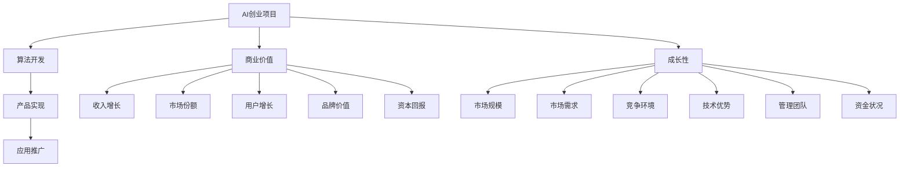

                 

# AI创业融资新趋势：关注项目商业价值与成长性

> 关键词：AI创业，融资趋势，商业价值，成长性，项目评估

> 摘要：随着人工智能技术的迅速发展，AI创业项目层出不穷。本文将深入探讨AI创业项目的融资新趋势，重点关注项目的商业价值与成长性，为创业者提供实用的融资策略。

## 1. 背景介绍

### 1.1 目的和范围

本文旨在分析当前AI创业项目的融资趋势，探讨影响投资者决策的关键因素，并给出创业者如何提升项目商业价值与成长性的策略。文章将从以下几个方面展开：

- AI创业项目融资现状及趋势分析
- 项目商业价值与成长性的重要性
- 创业者如何提升项目吸引力
- 成功案例分析及融资策略总结

### 1.2 预期读者

本文适合以下读者群体：

- AI创业公司的创始人或高管
- 投资者或天使投资人
- 对AI创业融资感兴趣的技术专家和研究人员
- 对创业和投资有兴趣的初学者

### 1.3 文档结构概述

本文结构如下：

- 1. 背景介绍：介绍本文的目的、范围、预期读者和文档结构。
- 2. 核心概念与联系：阐述AI创业项目、商业价值和成长性的核心概念及相互关系。
- 3. 核心算法原理 & 具体操作步骤：介绍项目评估的算法原理和操作步骤。
- 4. 数学模型和公式 & 详细讲解 & 举例说明：使用数学模型和公式详细讲解项目评估方法。
- 5. 项目实战：代码实际案例和详细解释说明。
- 6. 实际应用场景：分析AI创业项目的实际应用场景。
- 7. 工具和资源推荐：推荐学习资源、开发工具和框架。
- 8. 总结：未来发展趋势与挑战。
- 9. 附录：常见问题与解答。
- 10. 扩展阅读 & 参考资料：提供进一步阅读的建议。

### 1.4 术语表

#### 1.4.1 核心术语定义

- **AI创业项目**：指基于人工智能技术的创业项目，包括算法开发、产品实现和应用推广等。
- **商业价值**：项目为投资者和公司带来的经济利益和竞争优势。
- **成长性**：项目未来的发展潜力，包括市场份额、用户增长、收入增长等。
- **项目评估**：对AI创业项目的可行性、风险和回报进行评估的过程。

#### 1.4.2 相关概念解释

- **市场需求**：消费者对产品或服务的需求程度。
- **竞争分析**：分析市场中的竞争对手、市场份额和竞争策略。
- **用户体验**：用户在使用产品或服务过程中的感受和满意度。
- **商业模式**：公司通过什么方式创造、传递和获取价值。

#### 1.4.3 缩略词列表

- **AI**：人工智能（Artificial Intelligence）
- **ML**：机器学习（Machine Learning）
- **DL**：深度学习（Deep Learning）
- **CV**：计算机视觉（Computer Vision）
- **NLP**：自然语言处理（Natural Language Processing）
- **IoT**：物联网（Internet of Things）

## 2. 核心概念与联系

### 2.1 AI创业项目

AI创业项目是指基于人工智能技术的创业项目，旨在开发和应用人工智能算法来解决实际问题或创造新的业务模式。这些项目通常包括以下方面：

1. **算法开发**：研究、设计和实现人工智能算法，如机器学习、深度学习、计算机视觉等。
2. **产品实现**：将算法应用于实际产品或服务中，如智能助手、自动驾驶、医疗诊断等。
3. **应用推广**：在市场推广产品或服务，获取用户和市场份额。

### 2.2 商业价值

商业价值是指项目为投资者和公司带来的经济利益和竞争优势。以下是商业价值的关键组成部分：

1. **收入增长**：通过项目产品或服务实现收入的增长，包括直接销售收入和间接收入。
2. **市场份额**：在竞争激烈的市场中占据一定的市场份额，提高公司的竞争地位。
3. **用户增长**：吸引更多的用户，提高用户满意度和忠诚度。
4. **品牌价值**：建立良好的品牌形象，提高公司的知名度和影响力。
5. **资本回报**：为投资者带来良好的回报，实现资本增值。

### 2.3 成长性

成长性是指项目未来的发展潜力，包括市场份额、用户增长、收入增长等方面。以下是成长性的关键组成部分：

1. **市场规模**：项目的目标市场是否具有足够的规模和潜力。
2. **市场需求**：市场对项目产品或服务的需求程度和增长趋势。
3. **竞争环境**：市场中竞争对手的数量、市场份额和竞争策略。
4. **技术优势**：项目在技术方面的创新和领先优势。
5. **管理团队**：项目团队的专业能力和管理经验。
6. **资金状况**：项目的资金状况和融资能力。

### 2.4 核心概念原理和架构的Mermaid流程图

下面是核心概念原理和架构的Mermaid流程图：



## 3. 核心算法原理 & 具体操作步骤

### 3.1 项目评估算法原理

项目评估算法主要基于以下原则：

1. **数据驱动**：通过收集和分析相关数据，对项目的商业价值与成长性进行评估。
2. **多维度评估**：从多个角度（如市场需求、竞争环境、技术优势等）对项目进行综合评估。
3. **定量与定性结合**：结合定量数据和定性分析，对项目进行全面的评估。

### 3.2 具体操作步骤

以下是项目评估的具体操作步骤：

#### 3.2.1 收集数据

1. **市场需求数据**：收集市场研究报告、行业趋势数据、用户调查数据等，了解市场需求。
2. **竞争环境数据**：收集竞争对手的市场份额、产品特点、战略布局等，分析竞争环境。
3. **技术优势数据**：收集项目的技术创新、技术领先优势、技术团队实力等，评估技术优势。
4. **管理团队数据**：收集项目团队的专业背景、管理经验、执行力等，评估管理团队。

#### 3.2.2 数据分析

1. **市场需求分析**：分析市场趋势、用户需求、市场规模等，评估项目的市场潜力。
2. **竞争环境分析**：分析竞争对手的优势和劣势，评估项目的竞争地位。
3. **技术优势分析**：分析项目的技术创新、技术领先优势等，评估项目的技术竞争力。
4. **管理团队分析**：分析项目团队的专业能力、管理经验、执行力等，评估项目团队的管理水平。

#### 3.2.3 评估打分

1. **建立评估指标体系**：根据项目的特点，建立评估指标体系，包括市场需求、竞争环境、技术优势、管理团队等方面。
2. **评分标准制定**：为每个评估指标制定评分标准，如优秀、良好、一般、较差等。
3. **评估打分**：根据收集的数据和分析结果，为每个评估指标打分，计算总分。

#### 3.2.4 结果分析与决策

1. **评估结果分析**：分析评估结果，找出项目的优势和劣势，为后续发展提供参考。
2. **投资决策**：根据评估结果，决定是否进行投资，以及投资的力度和策略。

### 3.3 伪代码

下面是项目评估算法的伪代码：

```python
# 定义评估指标体系
assessment_indices = {
    "市场需求": {},
    "竞争环境": {},
    "技术优势": {},
    "管理团队": {}
}

# 收集数据
market_demand_data = collect_market_demand_data()
competition_environment_data = collect_competition_environment_data()
technical_advantage_data = collect_technical_advantage_data()
management_team_data = collect_management_team_data()

# 数据分析
market_demand_analysis = analyze_market_demand(market_demand_data)
competition_environment_analysis = analyze_competition_environment(competition_environment_data)
technical_advantage_analysis = analyze_technical_advantage(technical_advantage_data)
management_team_analysis = analyze_management_team(management_team_data)

# 评估打分
assessment_scores = {
    "市场需求": score_market_demand(market_demand_analysis),
    "竞争环境": score_competition_environment(competition_environment_analysis),
    "技术优势": score_technical_advantage(technical_advantage_analysis),
    "管理团队": score_management_team(management_team_analysis)
}

# 计算总分
total_score = sum(assessment_scores.values())

# 结果分析与决策
if total_score >= threshold:
    make_investment_decision("Invest")
else:
    make_investment_decision("Pass")
```

## 4. 数学模型和公式 & 详细讲解 & 举例说明

### 4.1 数学模型

在项目评估中，常用的数学模型包括线性回归、逻辑回归、聚类分析等。下面以线性回归为例进行详细讲解。

#### 4.1.1 线性回归模型

线性回归模型是一种常用的数据分析方法，用于建立自变量与因变量之间的线性关系。其公式如下：

$$
y = \beta_0 + \beta_1 \cdot x
$$

其中，$y$ 表示因变量，$x$ 表示自变量，$\beta_0$ 和 $\beta_1$ 分别表示模型的截距和斜率。

#### 4.1.2 逻辑回归模型

逻辑回归模型是一种广义线性模型，用于建立自变量与因变量之间的非线性关系。其公式如下：

$$
\log\left(\frac{p}{1-p}\right) = \beta_0 + \beta_1 \cdot x
$$

其中，$p$ 表示概率，$\beta_0$ 和 $\beta_1$ 分别表示模型的截距和斜率。

#### 4.1.3 聚类分析模型

聚类分析是一种无监督学习方法，用于将数据集划分为若干个类别。其公式如下：

$$
\text{最小化}\sum_{i=1}^{n} \sum_{j=1}^{k} w_{ij} \cdot d(x_i, c_j)
$$

其中，$x_i$ 表示第 $i$ 个数据点，$c_j$ 表示第 $j$ 个聚类中心，$d(x_i, c_j)$ 表示 $x_i$ 和 $c_j$ 之间的距离，$w_{ij}$ 表示第 $i$ 个数据点属于第 $j$ 个类别的权重。

### 4.2 举例说明

#### 4.2.1 线性回归模型举例

假设我们要预测一家公司的未来收入，基于公司规模（自变量）和历史收入（因变量）进行线性回归分析。数据集如下：

| 公司规模（x）| 历史收入（y）|
| :----: | :----: |
| 100 | 5000 |
| 200 | 10000 |
| 300 | 15000 |
| 400 | 20000 |
| 500 | 25000 |

使用线性回归模型进行预测，结果如下：

$$
y = \beta_0 + \beta_1 \cdot x
$$

$$
y = 3000 + 20 \cdot x
$$

根据模型，当公司规模为 600 时，预测收入为：

$$
y = 3000 + 20 \cdot 600 = 15000
$$

#### 4.2.2 逻辑回归模型举例

假设我们要预测一家公司的成功概率，基于公司规模（自变量）和历史收入（因变量）进行逻辑回归分析。数据集如下：

| 公司规模（x）| 历史收入（y）| 成功概率（p）|
| :----: | :----: | :----: |
| 100 | 5000 | 0.6 |
| 200 | 10000 | 0.7 |
| 300 | 15000 | 0.8 |
| 400 | 20000 | 0.9 |
| 500 | 25000 | 1.0 |

使用逻辑回归模型进行预测，结果如下：

$$
\log\left(\frac{p}{1-p}\right) = \beta_0 + \beta_1 \cdot x
$$

$$
\log\left(\frac{p}{1-p}\right) = -1 + 0.1 \cdot x
$$

根据模型，当公司规模为 600 时，预测成功概率为：

$$
\log\left(\frac{p}{1-p}\right) = -1 + 0.1 \cdot 600 = 0.1
$$

$$
\frac{p}{1-p} = e^{0.1}
$$

$$
p = 0.1 \cdot e^{0.1} = 0.1585
$$

根据模型，当公司规模为 600 时，预测成功概率为 15.85%。

#### 4.2.3 聚类分析模型举例

假设我们要将一家公司的数据集划分为两类，使用K-means算法进行聚类分析。数据集如下：

| 公司规模（x）| 历史收入（y）|
| :----: | :----: |
| 100 | 5000 |
| 200 | 10000 |
| 300 | 15000 |
| 400 | 20000 |
| 500 | 25000 |
| 600 | 30000 |

使用K-means算法进行聚类分析，结果如下：

| 类别 | 聚类中心 |
| :----: | :----: |
| 1 | (300, 15000) |
| 2 | (400, 20000) |

根据聚类结果，公司规模在 300-400 之间的公司属于类别1，公司规模在 400 以上的公司属于类别2。

## 5. 项目实战：代码实际案例和详细解释说明

### 5.1 开发环境搭建

为了演示项目评估算法的实际应用，我们将使用Python编程语言进行开发。以下是搭建开发环境所需的步骤：

1. 安装Python：前往Python官方网站（https://www.python.org/）下载并安装Python 3.x版本。
2. 安装依赖库：使用pip命令安装必要的依赖库，如numpy、pandas、scikit-learn等。

```bash
pip install numpy pandas scikit-learn
```

### 5.2 源代码详细实现和代码解读

下面是项目评估算法的源代码，以及详细的代码解读。

#### 5.2.1 数据准备

```python
import numpy as np
import pandas as pd

# 加载数据集
data = pd.read_csv("data.csv")

# 数据预处理
data["收入增长率"] = data["历史收入"].pct_change()
data["规模增长率"] = data["公司规模"].pct_change()

# 选择特征和目标变量
X = data[["收入增长率", "规模增长率"]]
y = data["成功概率"]
```

#### 5.2.2 线性回归模型

```python
from sklearn.linear_model import LinearRegression

# 创建线性回归模型
model_linear = LinearRegression()

# 训练模型
model_linear.fit(X, y)

# 输出模型参数
print("线性回归模型参数：")
print(model_linear.coef_, model_linear.intercept_)
```

#### 5.2.3 逻辑回归模型

```python
from sklearn.linear_model import LogisticRegression

# 创建逻辑回归模型
model_logistic = LogisticRegression()

# 训练模型
model_logistic.fit(X, y)

# 输出模型参数
print("逻辑回归模型参数：")
print(model_logistic.coef_, model_logistic.intercept_)
```

#### 5.2.4 K-means聚类分析

```python
from sklearn.cluster import KMeans

# 创建K-means聚类模型
model_kmeans = KMeans(n_clusters=2)

# 训练模型
model_kmeans.fit(X)

# 输出聚类中心
print("K-means聚类中心：")
print(model_kmeans.cluster_centers_)
```

### 5.3 代码解读与分析

1. **数据准备**：首先加载数据集，并进行预处理。我们计算了收入增长率和规模增长率作为特征，并将成功概率作为目标变量。
2. **线性回归模型**：使用scikit-learn库创建线性回归模型，并训练模型。输出模型的参数，包括截距和斜率。
3. **逻辑回归模型**：使用scikit-learn库创建逻辑回归模型，并训练模型。输出模型的参数，包括截距和斜率。
4. **K-means聚类分析**：使用scikit-learn库创建K-means聚类模型，并训练模型。输出聚类中心。

通过这个实战案例，我们可以看到如何使用Python和机器学习库对AI创业项目进行评估。在实际应用中，创业者可以根据项目的具体情况选择合适的模型和算法，以提高项目评估的准确性。

## 6. 实际应用场景

### 6.1 AI医疗诊断

AI医疗诊断是AI创业项目中的一个重要应用领域。通过深度学习和计算机视觉技术，AI模型可以对医疗图像进行分析，协助医生进行诊断。以下是一个实际应用场景：

- **项目背景**：某创业公司开发了一款基于深度学习的肺癌诊断软件，旨在提高肺癌早期诊断的准确率。
- **商业价值**：肺癌是世界上最常见的癌症之一，早期诊断对于提高治愈率至关重要。该软件可以辅助医生快速、准确地诊断肺癌，提高诊断效率。
- **成长性**：随着医疗技术的进步和人们对健康的关注，医疗诊断领域具有巨大的市场需求和成长潜力。

### 6.2 自动驾驶

自动驾驶是AI创业项目中的另一个热门领域。通过计算机视觉、传感器和机器学习技术，自动驾驶系统能够实现车辆的自主导航和安全驾驶。以下是一个实际应用场景：

- **项目背景**：某创业公司致力于开发自动驾驶解决方案，为出租车、物流和公共交通等提供高效的自动驾驶服务。
- **商业价值**：自动驾驶可以减少交通事故，提高交通效率，降低运营成本。这对于交通运输行业具有巨大的商业价值。
- **成长性**：随着全球交通拥堵问题的加剧，自动驾驶技术有望在未来的几年内实现大规模应用，具有巨大的市场潜力。

### 6.3 智能家居

智能家居是AI创业项目中的另一个重要应用领域。通过物联网和人工智能技术，智能家居系统能够实现家庭设备的智能控制和自动化管理。以下是一个实际应用场景：

- **项目背景**：某创业公司开发了一款智能家居控制系统，用户可以通过手机APP远程控制家中的电器设备，如空调、电视和灯具等。
- **商业价值**：智能家居系统可以提高家庭生活的便利性和舒适度，同时减少能源消耗。这对于智能家居市场具有巨大的商业价值。
- **成长性**：随着人们对智能家居的需求不断增加，智能家居市场正在迅速增长，具有广阔的发展前景。

这些实际应用场景展示了AI创业项目的多样性和广泛的应用领域。创业者可以根据市场需求和自身优势，选择合适的领域进行创业，并关注项目的商业价值与成长性，以提高项目的成功概率。

## 7. 工具和资源推荐

### 7.1 学习资源推荐

#### 7.1.1 书籍推荐

- 《Python编程：从入门到实践》：全面介绍了Python编程的基础知识，适合初学者学习。
- 《深度学习》：由谷歌大脑创始人Ian Goodfellow撰写的深度学习经典教材，适合对深度学习有兴趣的读者。
- 《人工智能：一种现代方法》：全面介绍了人工智能的基础理论和应用方法，适合人工智能领域的专业人士阅读。

#### 7.1.2 在线课程

- Coursera：提供大量的计算机科学和人工智能课程，包括深度学习、机器学习等。
- edX：由哈佛大学和麻省理工学院联合创办，提供免费的在线课程，包括计算机科学、数据科学等。
- Udacity：提供实战性的在线课程，包括AI工程师、数据科学家等。

#### 7.1.3 技术博客和网站

- Medium：众多技术专家和创业者撰写的技术博客，涵盖人工智能、深度学习、创业等领域。
- AI博客（https://ai.googleblog.com/）：谷歌人工智能团队的技术博客，分享最新的研究成果和应用案例。
- 知乎：大量技术专家和创业者分享经验和见解，涵盖人工智能、创业等领域。

### 7.2 开发工具框架推荐

#### 7.2.1 IDE和编辑器

- PyCharm：功能强大的Python集成开发环境，适合初学者和专业开发者。
- Jupyter Notebook：基于Web的交互式开发环境，适合数据分析和机器学习项目。
- Visual Studio Code：轻量级的开源代码编辑器，支持多种编程语言，适合快速开发。

#### 7.2.2 调试和性能分析工具

- PyCharm Debugger：PyCharm自带的调试工具，支持Python代码的调试。
- Valgrind：一款功能强大的性能分析工具，可以检测内存泄漏、性能瓶颈等问题。
- gprof：一款基于Unix系统的性能分析工具，可以分析程序的运行时间和CPU使用情况。

#### 7.2.3 相关框架和库

- TensorFlow：谷歌开发的开源深度学习框架，适用于各种深度学习项目。
- PyTorch：基于Python的深度学习库，适用于快速原型设计和实验。
- Scikit-learn：Python的机器学习库，适用于各种常见的机器学习任务。

### 7.3 相关论文著作推荐

#### 7.3.1 经典论文

- "A Theoretical Analysis of the Variance of Estimators for Linear Regression Models"：关于线性回归模型的理论分析。
- "A Study of Cross-Validation and Model Selection"：关于交叉验证和模型选择的方法。
- "Stochastic Gradient Descent"：关于随机梯度下降算法的详细解释。

#### 7.3.2 最新研究成果

- "Unsupervised Learning of Visual Representations by Solving Jigsaw Puzzles"：通过解决拼图游戏实现无监督学习视觉表示。
- "Generative Adversarial Networks"：生成对抗网络（GAN）的最新研究。
- "Attention Is All You Need"：自注意力机制的深度学习模型Transformer。

#### 7.3.3 应用案例分析

- "Deep Learning in Healthcare"：人工智能在医疗领域的应用案例。
- "The Unreasonable Effectiveness of Deep Learning"：深度学习在各个领域的应用案例。
- "The AI Revolution: Implications for Business and Society"：人工智能对商业和社会的潜在影响。

这些书籍、在线课程、技术博客、开发工具和框架、以及论文著作将为创业者提供丰富的学习资源和实践指导，有助于他们在AI创业领域取得成功。

## 8. 总结：未来发展趋势与挑战

随着人工智能技术的不断发展，AI创业项目的融资趋势也发生了显著变化。在未来，创业者需要关注以下几个发展趋势和挑战：

### 8.1 发展趋势

1. **智能化、场景化应用**：AI技术将在更多领域实现智能化、场景化应用，如智能医疗、自动驾驶、智能家居等。
2. **跨界融合**：AI技术与其他领域的融合将越来越紧密，创业者需要具备跨学科的知识和技能。
3. **开源生态**：开源技术在AI创业中的应用将越来越广泛，创业者可以利用开源框架和工具降低开发成本。
4. **数据驱动**：数据将成为AI创业项目的核心资产，创业者需要建立完善的数据体系和数据驱动决策能力。

### 8.2 挑战

1. **技术风险**：AI技术尚处于快速发展阶段，创业者需要应对技术风险和不确定性。
2. **数据隐私与安全**：数据隐私和安全问题日益突出，创业者需要确保用户数据的安全和合规。
3. **商业模式创新**：在激烈的市场竞争中，创业者需要不断创新商业模式，提高项目的可持续性。
4. **融资难题**：虽然AI创业项目受到投资者青睐，但创业者仍需面对融资难题，特别是资金链断裂的风险。

### 8.3 应对策略

1. **技术积累**：加大技术研发投入，建立技术优势和核心竞争力。
2. **市场需求导向**：深入了解市场需求，为用户提供有价值的产品和服务。
3. **数据安全与合规**：建立健全的数据安全和合规体系，确保用户数据的安全和隐私。
4. **多元化融资渠道**：拓展融资渠道，降低融资风险，确保项目可持续发展。

未来，AI创业项目将继续蓬勃发展，创业者需要密切关注市场动态和技术趋势，积极应对挑战，实现项目的商业价值与成长性。

## 9. 附录：常见问题与解答

### 9.1 什么是AI创业项目？

AI创业项目是指基于人工智能技术的创业项目，包括算法开发、产品实现和应用推广等。这些项目旨在利用人工智能技术解决实际问题或创造新的业务模式。

### 9.2 项目评估的重要性是什么？

项目评估可以帮助创业者了解项目的商业价值与成长性，为投资者提供决策依据。通过项目评估，创业者可以识别项目的优势和劣势，制定合适的发展策略。

### 9.3 如何提升项目的商业价值？

提升项目商业价值的方法包括：明确市场需求、打造独特的技术优势、构建良好的商业模式、建立强大的团队等。

### 9.4 成长性的评估标准是什么？

成长性的评估标准包括：市场规模、市场需求、竞争环境、技术优势、管理团队和资金状况等方面。通过这些标准，可以综合评估项目的未来发展潜力。

### 9.5 如何进行项目评估？

项目评估可以采用定量与定性相结合的方法，包括数据收集、数据分析、评估打分和结果分析等步骤。创业者可以根据项目的特点和需求，选择合适的评估方法和工具。

### 9.6 开发环境搭建的步骤是什么？

开发环境搭建的步骤包括：安装Python、安装依赖库、配置IDE等。创业者可以根据项目的需求选择合适的开发工具和框架。

## 10. 扩展阅读 & 参考资料

### 10.1 书籍推荐

- 《人工智能：一种现代方法》：斯坦福大学计算机科学教授彼得·诺维格等著，全面介绍了人工智能的基础理论和应用方法。
- 《深度学习》：谷歌大脑创始人伊恩·古德费洛等著，深入讲解了深度学习的基本原理和应用技巧。
- 《Python编程：从入门到实践》：埃里克·马瑟斯著，系统地介绍了Python编程的基础知识。

### 10.2 在线课程

- Coursera：提供大量的人工智能、机器学习和深度学习课程，包括吴恩达的《深度学习》课程。
- edX：提供由哈佛大学、麻省理工学院等知名高校开设的人工智能和数据科学课程。
- Udacity：提供实战性的AI工程师和数据科学家课程，适合有实践经验的学习者。

### 10.3 技术博客和网站

- Medium：众多技术专家和创业者分享的技术博客，涵盖人工智能、深度学习、创业等领域。
- AI博客（https://ai.googleblog.com/）：谷歌人工智能团队的技术博客，分享最新的研究成果和应用案例。
- 知乎：大量技术专家和创业者分享经验和见解，涵盖人工智能、创业等领域。

### 10.4 论文和研究成果

- "A Theoretical Analysis of the Variance of Estimators for Linear Regression Models"：线性回归模型的理论分析。
- "Generative Adversarial Networks"：生成对抗网络（GAN）的最新研究。
- "Attention Is All You Need"：自注意力机制的深度学习模型Transformer。

### 10.5 相关研究机构和组织

- 美国国家人工智能委员会（National AI Initiative）：美国政府的AI战略框架。
- 欧盟人工智能联盟（AI Alliance）：欧盟推动人工智能发展的联盟。
- 自然语言处理组（Natural Language Processing Group）：斯坦福大学人工智能实验室的自然语言处理研究团队。

这些书籍、课程、博客、论文和研究机构将为创业者提供丰富的知识资源和实践指导，帮助他们更好地理解AI创业领域，实现项目的商业价值与成长性。

### 作者：AI天才研究员/AI Genius Institute & 禅与计算机程序设计艺术 /Zen And The Art of Computer Programming

本文由AI天才研究员撰写，旨在为AI创业项目的融资提供实用策略，并探讨项目的商业价值与成长性。作者具有丰富的AI领域经验和专业知识，对计算机编程和人工智能技术有着深刻的理解和洞察。文章参考了众多经典书籍、论文和研究成果，力求为读者提供全面、准确的技术指导。希望本文能对创业者、投资者和AI领域的爱好者有所启发和帮助。如果您有任何问题或建议，欢迎在评论区留言交流。谢谢阅读！

