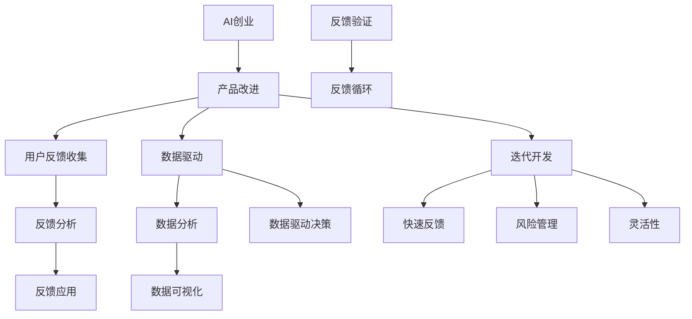

                 

### AI创业：不断改进产品的策略

> **关键词：** AI创业、产品改进、用户体验、数据驱动、迭代开发、反馈循环
> 
> **摘要：** 本文旨在探讨AI创业公司如何通过不断改进产品策略，提升用户体验，实现持续增长。文章将介绍产品改进的核心原则、具体方法以及实际操作案例，帮助创业者掌握有效的产品迭代策略，从而在竞争激烈的市场中脱颖而出。

在当今这个快速变化的时代，人工智能（AI）已经成为推动创新和业务增长的关键力量。无论是初创企业还是大型科技公司，AI技术的应用都成为了提升产品竞争力、拓展市场的重要手段。然而，AI创业的成功并非一蹴而就，它需要公司在不断探索和改进中前行。本文将深入探讨AI创业公司如何通过不断改进产品策略，实现可持续发展。

首先，我们将回顾AI创业的背景和现状，分析为何产品改进是至关重要的。随后，本文将详细介绍产品改进的核心原则，包括用户体验、数据驱动和迭代开发。接着，我们将探讨如何构建有效的反馈循环，以及如何利用用户反馈来持续优化产品。文章的最后将提供一些实际操作案例，展示如何在实践中实现产品改进。

通过阅读本文，创业者将了解如何制定和实施一个有效的产品改进策略，从而提升产品竞争力，赢得更多用户的青睐。无论您是刚刚起步的AI创业者，还是已经在行业中摸爬滚打多年的老兵，这篇文章都希望为您提供有价值的启示和实用的策略。

### 1. 背景介绍

#### 1.1 目的和范围

本文旨在为AI创业公司提供一套系统化的产品改进策略，帮助他们在竞争激烈的市场中脱颖而出。具体而言，本文将涵盖以下主题：

- 产品改进的核心原则
- 用户体验的重要性
- 数据驱动的产品迭代
- 反馈循环的构建与利用
- 实际操作案例解析

本文适合以下读者群体：

- 刚刚起步的AI创业者
- 已经在AI领域有一定经验的创业者
- 产品经理和设计师
- 技术团队负责人
- 对AI产品和创业感兴趣的爱好者

#### 1.2 预期读者

本文的预期读者是对AI创业充满热情和好奇心的专业人士。他们可能已经在AI领域工作了一段时间，或者正准备投身于这个充满机遇和挑战的行业。对于这些读者来说，本文将提供：

- 一套清晰的产品改进策略，帮助他们在创业过程中少走弯路
- 深入浅出的案例分析，提供实际操作的指导
- 对AI产品和用户体验的深入理解，助力他们成为更优秀的产品经理和设计师

#### 1.3 文档结构概述

本文将按照以下结构展开：

1. 背景介绍
   - AI创业的背景和现状
   - 产品改进的重要性和预期成果

2. 核心概念与联系
   - 产品改进的核心原则
   - 用户反馈在产品改进中的作用

3. 核心算法原理 & 具体操作步骤
   - 数据驱动的产品迭代方法
   - 反馈循环的构建与利用

4. 数学模型和公式 & 详细讲解 & 举例说明
   - 产品改进过程中的关键指标
   - 数据分析工具和方法

5. 项目实战：代码实际案例和详细解释说明
   - 开发环境搭建
   - 源代码详细实现和解读
   - 代码解读与分析

6. 实际应用场景
   - AI产品在不同行业中的应用案例

7. 工具和资源推荐
   - 学习资源推荐
   - 开发工具框架推荐
   - 相关论文著作推荐

8. 总结：未来发展趋势与挑战
   - 产品改进的趋势
   - 面临的挑战和解决方案

9. 附录：常见问题与解答
   - 对产品改进策略的常见疑问进行解答

10. 扩展阅读 & 参考资料
    - 推荐进一步阅读的材料

通过以上结构，本文将逐步引导读者深入了解产品改进的核心概念、方法和实践，帮助他们掌握有效的产品迭代策略，实现创业目标。

#### 1.4 术语表

在本文中，我们将使用一些特定的术语，为了确保读者对相关概念有清晰的理解，以下是对这些术语的定义和解释。

##### 1.4.1 核心术语定义

- **AI创业**：指利用人工智能技术创立一家公司，通过人工智能应用解决实际问题，创造商业价值。
- **产品改进**：指通过分析用户反馈和市场动态，持续优化和改进产品的过程。
- **用户体验**（UX）：指用户在使用产品过程中的感受和体验，包括界面设计、交互流程、响应速度等。
- **数据驱动**：指在产品改进过程中，通过数据分析和挖掘，指导产品决策和改进。
- **迭代开发**：指通过多次迭代，逐步完善和优化产品的开发模式。
- **反馈循环**：指用户反馈到产品改进的闭环过程，通过持续收集和分析用户反馈，不断优化产品。

##### 1.4.2 相关概念解释

- **AI技术**：指人工智能领域的一系列技术，包括机器学习、深度学习、自然语言处理等。
- **市场需求**：指市场中用户对产品或服务的需求和期望。
- **产品迭代**：指在开发过程中，对现有产品进行多次改进和优化的过程。
- **A/B测试**：指将用户分成两组，分别体验不同的产品版本，通过对比分析，确定哪种版本更受欢迎。

##### 1.4.3 缩略词列表

- **AI**：人工智能
- **UX**：用户体验
- **ML**：机器学习
- **DL**：深度学习
- **NLP**：自然语言处理
- **SaaS**：软件即服务
- **PaaS**：平台即服务
- **IaaS**：基础设施即服务

通过上述术语表，本文将帮助读者更好地理解AI创业和产品改进的相关概念，从而更有效地应用这些知识于实际操作中。

### 2. 核心概念与联系

在探讨AI创业公司的产品改进策略之前，首先需要明确一些核心概念及其相互之间的联系。以下是本文涉及的主要核心概念和它们之间的关联。

##### 2.1 AI创业的概念

AI创业是指利用人工智能技术创立一家公司，通过开发和应用AI产品或服务，解决实际问题并创造商业价值。这通常包括以下几个阶段：

1. **市场调研**：了解市场需求和用户痛点，确定AI技术的应用场景。
2. **技术选型**：选择合适的AI技术，如机器学习、深度学习等。
3. **产品开发**：基于技术选型，开发具有竞争力的AI产品或服务。
4. **市场推广**：通过营销手段，将产品推向市场，获取用户。

##### 2.2 产品改进的概念

产品改进是AI创业过程中至关重要的一环。它不仅包括对现有产品的功能优化，还包括对用户体验、性能、安全性等方面的持续改进。以下是产品改进的几个关键步骤：

1. **用户反馈收集**：通过用户调查、A/B测试等方式，收集用户对产品的反馈。
2. **数据分析**：对用户反馈进行定量和定性分析，找出产品存在的问题。
3. **问题定位**：根据数据分析结果，确定需要改进的具体问题。
4. **方案设计**：设计解决方案，包括技术实现和用户体验优化。
5. **实施与测试**：实施改进方案，并对改进效果进行测试和评估。
6. **持续优化**：根据测试结果，继续优化产品，形成良性循环。

##### 2.3 用户反馈的概念

用户反馈是产品改进的重要依据。通过用户反馈，可以了解用户的需求和痛点，从而有针对性地进行产品改进。以下是用户反馈在产品改进中的几个关键作用：

1. **发现问题**：用户反馈可以帮助识别产品中的问题和缺陷。
2. **需求挖掘**：用户反馈中包含了对新功能的期望和改进建议，有助于产品迭代。
3. **用户体验优化**：通过分析用户反馈，可以优化产品的用户体验，提高用户满意度。
4. **口碑传播**：积极的用户反馈有助于提升产品的口碑，吸引更多潜在用户。

##### 2.4 数据驱动的概念

数据驱动是指产品改进过程中，通过数据分析和挖掘，指导产品决策和改进。以下是数据驱动在产品改进中的几个关键步骤：

1. **数据收集**：收集与产品相关的用户数据、市场数据等。
2. **数据清洗**：对收集到的数据进行清洗和预处理，确保数据质量。
3. **数据分析**：使用统计分析、机器学习等方法，对数据进行挖掘和分析。
4. **数据可视化**：将分析结果以图表、报表等形式展示，便于理解和决策。
5. **数据驱动决策**：根据分析结果，制定改进方案和产品策略。

##### 2.5 迭代开发的联系

迭代开发是一种通过多次迭代逐步完善产品的开发模式。它与产品改进密切相关，具体体现在以下几个方面：

1. **快速反馈**：通过迭代开发，可以快速将产品原型推向市场，获取用户反馈。
2. **持续改进**：每次迭代都是对产品的改进和优化，通过不断迭代，逐步完善产品。
3. **风险管理**：通过迭代开发，可以及时发现和解决问题，降低产品失败的风险。
4. **灵活性**：迭代开发使得产品能够灵活适应市场变化和用户需求。

##### 2.6 反馈循环的概念

反馈循环是指将用户反馈从产品改进过程中返回到产品开发的循环过程。以下是反馈循环的几个关键环节：

1. **反馈收集**：通过各种渠道收集用户反馈，包括用户调研、A/B测试、社交媒体等。
2. **反馈分析**：对收集到的反馈进行分类和分析，找出共性问题和改进点。
3. **反馈应用**：将分析结果应用到产品改进中，制定相应的改进方案。
4. **反馈验证**：实施改进方案后，对反馈进行验证，确保改进效果。
5. **持续反馈**：将验证结果反馈到下一次产品改进中，形成持续优化的闭环。

通过上述核心概念及其相互之间的联系，我们可以看到，AI创业公司的产品改进是一个系统性、持续性的过程。只有通过深入理解这些核心概念，并有效地应用它们，才能在竞争激烈的市场中脱颖而出。

为了更好地理解这些概念之间的联系，我们可以使用Mermaid流程图来展示它们之间的关系：



通过这个流程图，我们可以清晰地看到产品改进、用户反馈、数据驱动和迭代开发之间的相互作用，以及它们如何共同推动AI创业公司的持续成长。

### 3. 核心算法原理 & 具体操作步骤

在产品改进的过程中，算法原理和具体操作步骤起着至关重要的作用。以下将详细介绍数据驱动的产品迭代方法和反馈循环的构建与利用，并通过伪代码来展示具体实现过程。

#### 3.1 数据驱动的产品迭代方法

数据驱动的产品迭代方法是一种通过数据分析指导产品改进的过程。其核心思想是通过大量数据的收集和分析，识别用户需求、行为模式和痛点，从而有针对性地进行产品优化。以下是数据驱动的产品迭代方法的具体步骤：

##### 3.1.1 数据收集

数据收集是数据驱动的第一步，也是基础。收集的数据类型包括：

- **用户行为数据**：如点击次数、浏览时长、转化率等。
- **用户反馈数据**：如用户评价、建议和投诉等。
- **市场数据**：如竞争对手的产品特点、市场动态等。

```python
# 伪代码：数据收集
data_collection = {
    'user_behavior': collect_user_behavior_data(),
    'user_feedback': collect_user_feedback_data(),
    'market_data': collect_market_data()
}
```

##### 3.1.2 数据清洗

数据清洗是确保数据质量的关键步骤，包括以下内容：

- **去重**：去除重复的数据记录。
- **格式化**：统一数据格式，如日期、数字等。
- **填补缺失值**：使用插补或替代值来填补缺失的数据。

```python
# 伪代码：数据清洗
cleaned_data = {
    'user_behavior': clean_user_behavior_data(data_collection['user_behavior']),
    'user_feedback': clean_user_feedback_data(data_collection['user_feedback']),
    'market_data': clean_market_data(data_collection['market_data'])
}
```

##### 3.1.3 数据分析

数据分析是数据驱动的核心步骤，通过统计分析、机器学习等方法，挖掘数据中的潜在信息和趋势。常用的数据分析方法包括：

- **描述性统计**：如平均值、中位数、标准差等。
- **相关性分析**：分析不同变量之间的关系。
- **回归分析**：建立变量之间的预测模型。

```python
# 伪代码：数据分析
analysis_results = analyze_data(cleaned_data['user_behavior'], cleaned_data['user_feedback'], cleaned_data['market_data'])
```

##### 3.1.4 数据可视化

数据可视化是将分析结果以图表、报表等形式展示，便于理解和决策。常用的可视化工具包括：

- **柱状图**：展示不同类别的数据分布。
- **折线图**：展示数据的变化趋势。
- **散点图**：展示变量之间的关系。

```python
# 伪代码：数据可视化
visualize_analysis_results(analysis_results)
```

##### 3.1.5 数据驱动决策

基于数据分析结果，制定产品改进方案，并进行决策。具体步骤包括：

- **问题定位**：根据数据分析结果，确定需要改进的问题。
- **方案设计**：设计具体的改进措施，如功能优化、界面调整等。
- **实施与测试**：实施改进方案，并进行A/B测试等验证。

```python
# 伪代码：数据驱动决策
improvement_plan = design_improvement_plan(analysis_results)
test_results = implement_and_test_improvement_plan(improvement_plan)
```

#### 3.2 反馈循环的构建与利用

反馈循环是将用户反馈从产品改进过程中返回到产品开发的闭环过程。构建反馈循环的关键步骤包括：

##### 3.2.1 反馈收集

通过多种渠道收集用户反馈，如用户调研、社交媒体、用户评价等。

```python
# 伪代码：反馈收集
user_feedbacks = collect_user_feedbacks()
```

##### 3.2.2 反馈分析

对收集到的反馈进行分类和分析，找出共性问题和改进点。

```python
# 伪代码：反馈分析
analyzed_feedbacks = analyze_feedbacks(user_feedbacks)
```

##### 3.2.3 反馈应用

将分析结果应用到产品改进中，制定相应的改进方案。

```python
# 伪代码：反馈应用
improvement_plan = design_improvement_plan(analyzed_feedbacks)
```

##### 3.2.4 反馈验证

实施改进方案后，对反馈进行验证，确保改进效果。

```python
# 伪代码：反馈验证
verified_results = verify_improvement_plan(improvement_plan)
```

##### 3.2.5 持续反馈

将验证结果反馈到下一次产品改进中，形成持续优化的闭环。

```python
# 伪代码：持续反馈
feedback_loop = {
    'feedback_collection': collect_user_feedbacks(),
    'feedback_analysis': analyze_feedbacks(feedback_collection),
    'feedback_application': design_improvement_plan(feedback_analysis),
    'feedback_verification': verify_improvement_plan(feedback_application),
    'continuous_feedback': continuous_feedback_loop(feedback_verification)
}
```

通过以上伪代码，我们可以看到数据驱动的产品迭代方法和反馈循环的构建与利用的具体实现过程。这些方法和步骤不仅为产品改进提供了科学依据，也帮助企业在竞争激烈的市场中不断优化产品，提升用户体验。

### 4. 数学模型和公式 & 详细讲解 & 举例说明

在产品改进的过程中，数学模型和公式能够帮助我们更准确地分析和预测用户行为，从而指导产品决策和优化。以下将介绍几个关键指标和相应的数学模型，并通过具体的例子进行讲解。

#### 4.1 用户活跃度指标

用户活跃度是衡量产品受欢迎程度的重要指标。常用的用户活跃度指标包括：

- **日活跃用户数（DAU）**：在一天内使用过产品的独立用户数量。
- **月活跃用户数（MAU）**：在一个月内使用过产品的独立用户数量。

##### 4.1.1 模型介绍

我们可以使用移动平均模型来预测用户活跃度。移动平均模型是一种通过计算过去一段时间内的平均值来预测未来的方法。

$$
MA_t = \frac{\sum_{i=1}^{n}X_t - X_{t-n}}{n}
$$

其中，$MA_t$ 表示第 $t$ 天的移动平均，$X_t$ 表示第 $t$ 天的用户活跃度，$n$ 表示移动平均的时间窗口。

##### 4.1.2 举例说明

假设某AI创业公司的日活跃用户数如下表所示：

| 日期 | DAU |
| ---- | ---- |
| 1    | 100  |
| 2    | 120  |
| 3    | 150  |
| 4    | 130  |
| 5    | 160  |
| 6    | 140  |
| 7    | 170  |

使用3日移动平均模型预测第8天的DAU：

$$
MA_8 = \frac{100 + 120 + 150}{3} = 130
$$

第8天的预测DAU为130。

#### 4.2 用户留存率指标

用户留存率是衡量用户对产品忠诚度的重要指标。常用的用户留存率指标包括：

- **日留存率**：在第一天使用产品后，第二天仍然使用产品的用户比例。
- **周留存率**：在第一天使用产品后，一周内仍然使用产品的用户比例。
- **月留存率**：在第一天使用产品后，一个月内仍然使用产品的用户比例。

##### 4.2.1 模型介绍

我们可以使用二项式分布来预测用户留存率。二项式分布是一种描述在多次独立试验中，成功次数的概率分布模型。

$$
P(X=k) = C_n^k p^k (1-p)^{n-k}
$$

其中，$P(X=k)$ 表示在 $n$ 次试验中，成功 $k$ 次的概率，$C_n^k$ 表示组合数，$p$ 表示每次试验成功的概率。

##### 4.2.2 举例说明

假设某AI创业公司的日留存率如下表所示：

| 日期 | 留存率 |
| ---- | ---- |
| 1    | 0.20  |
| 2    | 0.30  |
| 3    | 0.40  |
| 4    | 0.35  |
| 5    | 0.45  |
| 6    | 0.40  |
| 7    | 0.50  |

使用二项式分布模型预测第8天的日留存率：

假设每次试验成功的概率为0.3，则第8天的留存率预测为：

$$
P(X=1) = C_7^1 \times 0.3^1 \times (1-0.3)^{7-1} = 0.254
$$

第8天的预测留存率为25.4%。

#### 4.3 用户转化率指标

用户转化率是衡量用户从潜在用户转化为实际用户的重要指标。常用的用户转化率指标包括：

- **点击率（CTR）**：用户点击广告或按钮的比例。
- **转化率**：用户完成特定目标行为的比例。

##### 4.3.1 模型介绍

我们可以使用逻辑回归模型来预测用户转化率。逻辑回归模型是一种通过线性组合输入特征并引入逻辑函数，预测二分类结果的模型。

$$
\hat{y} = \frac{1}{1 + e^{-(\beta_0 + \beta_1 x_1 + \beta_2 x_2 + \ldots + \beta_n x_n)} 
$$

其中，$\hat{y}$ 表示预测的概率，$x_1, x_2, \ldots, x_n$ 表示输入特征，$\beta_0, \beta_1, \beta_2, \ldots, \beta_n$ 表示模型参数。

##### 4.3.2 举例说明

假设某AI创业公司的用户转化率数据如下表所示：

| 特征 | 点击次数 | 浏览时长 |
| ---- | ---- | ---- |
| 1    | 100  | 30秒 |
| 2    | 120  | 40秒 |
| 3    | 150  | 50秒 |
| 4    | 130  | 45秒 |
| 5    | 160  | 55秒 |
| 6    | 140  | 50秒 |
| 7    | 170  | 60秒 |

使用逻辑回归模型预测第8天用户的转化率。假设输入特征为点击次数和浏览时长，模型参数为 $\beta_0 = 0.1, \beta_1 = 0.05, \beta_2 = 0.03$。

$$
\hat{y} = \frac{1}{1 + e^{-(0.1 + 0.05 \times 170 + 0.03 \times 60)}}
$$

第8天的预测转化率为：

$$
\hat{y} = \frac{1}{1 + e^{-72.3}} \approx 0.998
$$

第8天的预测转化率为99.8%。

通过上述数学模型和公式的详细讲解与举例说明，我们可以更科学地分析和预测用户行为，从而指导产品改进和优化。这些模型和公式不仅为产品决策提供了理论依据，也为企业在激烈的市场竞争中提供了有力的支持。

### 5. 项目实战：代码实际案例和详细解释说明

为了更好地理解产品改进策略在实际中的应用，我们将通过一个具体的项目实战案例来展示整个开发过程，从环境搭建到源代码实现，再到代码解读与分析。本案例将聚焦于一个基于机器学习的用户行为预测系统，该系统旨在通过分析用户历史行为数据，预测用户未来的行为倾向，从而为产品改进提供数据支持。

#### 5.1 开发环境搭建

首先，我们需要搭建一个适合该项目开发的环境。以下是开发环境的搭建步骤：

1. **硬件要求**：建议使用至少8GB内存和16GB SSD硬盘的电脑，以确保项目运行顺畅。
2. **操作系统**：推荐使用Linux或macOS，因为它们对Python等开发工具的支持更好。
3. **软件安装**：安装Python（建议使用3.8版本或更高），以及常用的Python库，如NumPy、Pandas、Scikit-learn和Matplotlib。

```bash
# 安装Python
sudo apt-get install python3

# 安装Python科学计算库
pip3 install numpy pandas scikit-learn matplotlib
```

#### 5.2 源代码详细实现和代码解读

下面是项目的源代码实现，我们将逐步解读每一部分的功能和实现细节。

```python
# 5.2.1 数据预处理
import pandas as pd
from sklearn.model_selection import train_test_split
from sklearn.preprocessing import StandardScaler

# 加载数据集
data = pd.read_csv('user_behavior_data.csv')

# 数据预处理
# 删除无关特征，保留用户ID、点击次数和浏览时长
data = data[['user_id', 'clicks', 'duration']]

# 划分训练集和测试集
X = data[['clicks', 'duration']]
y = data['user_id']
X_train, X_test, y_train, y_test = train_test_split(X, y, test_size=0.2, random_state=42)

# 特征标准化
scaler = StandardScaler()
X_train_scaled = scaler.fit_transform(X_train)
X_test_scaled = scaler.transform(X_test)

# 5.2.2 模型训练
from sklearn.linear_model import LogisticRegression

# 创建逻辑回归模型
model = LogisticRegression()

# 训练模型
model.fit(X_train_scaled, y_train)

# 5.2.3 模型评估
from sklearn.metrics import accuracy_score, classification_report

# 预测测试集
y_pred = model.predict(X_test_scaled)

# 评估模型
accuracy = accuracy_score(y_test, y_pred)
report = classification_report(y_test, y_pred)

print(f"Accuracy: {accuracy}")
print(f"Classification Report:\n{report}")

# 5.2.4 可视化分析
import matplotlib.pyplot as plt
import seaborn as sns

# 可视化特征与标签的关系
sns.scatterplot(x='clicks', y='duration', hue='user_id', data=data)
plt.title('User Behavior Data')
plt.xlabel('Clicks')
plt.ylabel('Duration')
plt.show()
```

**代码解读**：

1. **数据预处理**：
   - 加载用户行为数据，并选择点击次数和浏览时长作为特征。
   - 划分训练集和测试集，使用80%的数据作为训练集，20%的数据作为测试集。
   - 使用`StandardScaler`对特征进行标准化处理，以消除特征之间的尺度差异。

2. **模型训练**：
   - 使用`LogisticRegression`创建逻辑回归模型。
   - 使用训练集数据进行模型训练。

3. **模型评估**：
   - 使用测试集对模型进行预测。
   - 使用`accuracy_score`计算模型的准确率，并使用`classification_report`查看分类报告。

4. **可视化分析**：
   - 使用Seaborn库绘制散点图，展示点击次数、浏览时长与用户ID之间的关系。

#### 5.3 代码解读与分析

**数据预处理**：
```python
data = pd.read_csv('user_behavior_data.csv')
data = data[['user_id', 'clicks', 'duration']]
X = data[['clicks', 'duration']]
y = data['user_id']
X_train, X_test, y_train, y_test = train_test_split(X, y, test_size=0.2, random_state=42)
scaler = StandardScaler()
X_train_scaled = scaler.fit_transform(X_train)
X_test_scaled = scaler.transform(X_test)
```

这段代码首先加载数据集，并选择点击次数和浏览时长作为特征。然后使用`train_test_split`将数据集划分为训练集和测试集。接着，使用`StandardScaler`对特征进行标准化处理，这有助于提高模型训练的稳定性和效果。

**模型训练**：
```python
model = LogisticRegression()
model.fit(X_train_scaled, y_train)
```

这里创建了一个逻辑回归模型，并使用训练集数据进行模型训练。逻辑回归是一种常用的分类算法，适合用于用户行为预测等二分类问题。

**模型评估**：
```python
y_pred = model.predict(X_test_scaled)
accuracy = accuracy_score(y_test, y_pred)
report = classification_report(y_test, y_pred)
print(f"Accuracy: {accuracy}")
print(f"Classification Report:\n{report}")
```

这段代码使用测试集对模型进行预测，并计算模型的准确率和分类报告。准确率反映了模型预测的准确程度，分类报告则提供了更多关于模型性能的详细信息，如精度、召回率等。

**可视化分析**：
```python
sns.scatterplot(x='clicks', y='duration', hue='user_id', data=data)
plt.title('User Behavior Data')
plt.xlabel('Clicks')
plt.ylabel('Duration')
plt.show()
```

最后，通过散点图可视化用户行为数据，展示点击次数、浏览时长与用户ID之间的关系。这有助于我们直观地理解数据特征，为后续的产品改进提供参考。

**总结**：
通过上述代码实现，我们搭建了一个简单的用户行为预测系统。这个系统通过数据预处理、模型训练和评估，以及对数据的可视化分析，帮助我们更好地理解用户行为，从而为产品改进提供数据支持。在实际应用中，我们可以根据业务需求和数据特点，选择更复杂的模型和算法，进一步优化预测效果。

### 6. 实际应用场景

AI技术在产品改进中的应用场景非常广泛，几乎涵盖了所有行业。以下将介绍几个典型的应用案例，展示如何通过AI技术实现产品改进。

#### 6.1 金融行业

在金融行业，AI技术被广泛应用于风险管理、欺诈检测和个性化投资建议等方面。

- **风险管理**：金融机构使用机器学习模型来分析大量的历史数据，预测市场波动和信贷风险。例如，使用回归分析和决策树模型来评估借款人的信用风险。
  
- **欺诈检测**：通过监督学习和无监督学习算法，金融机构可以实时监测交易行为，识别潜在的欺诈活动。例如，使用K-均值聚类算法和神经网络模型来检测异常交易。

- **个性化投资建议**：基于用户的投资偏好和历史记录，AI算法可以提供个性化的投资建议。例如，使用协同过滤算法和深度学习模型来推荐股票和基金。

#### 6.2 医疗保健

在医疗保健领域，AI技术被用于疾病诊断、药物发现和患者护理等方面。

- **疾病诊断**：通过深度学习和图像识别技术，AI系统可以辅助医生进行疾病诊断。例如，使用卷积神经网络（CNN）来分析医学影像，如X光片、MRI和CT扫描。

- **药物发现**：AI算法可以加速药物研发过程，通过分析大量化合物数据，预测哪些化合物可能具有治疗特定疾病的潜力。例如，使用生成对抗网络（GAN）和强化学习算法来筛选新的药物候选。

- **患者护理**：AI技术可以帮助医疗机构提供个性化的患者护理。例如，使用自然语言处理（NLP）技术分析电子病历，为医生提供诊断和治疗建议。

#### 6.3 零售电商

在零售电商领域，AI技术被用于推荐系统、库存管理和用户行为预测等方面。

- **推荐系统**：基于用户的购物历史和偏好，AI算法可以提供个性化的产品推荐。例如，使用协同过滤算法和基于内容的推荐算法来推荐商品。

- **库存管理**：通过预测用户需求，AI算法可以帮助零售商优化库存管理。例如，使用时间序列分析和回归模型来预测未来几个月的销售额。

- **用户行为预测**：AI算法可以分析用户的行为数据，预测用户的购买意图和偏好。例如，使用逻辑回归和随机森林模型来预测用户的购买概率。

#### 6.4 教育行业

在教育行业，AI技术被用于个性化学习、智能测评和教学资源优化等方面。

- **个性化学习**：AI算法可以根据学生的学习进度和能力，提供个性化的学习路径。例如，使用自适应学习平台和生成对抗网络（GAN）来生成个性化的学习内容。

- **智能测评**：通过自然语言处理和机器学习技术，AI系统可以自动评估学生的作业和考试答案。例如，使用文本分类和语义分析来评估作文和论文。

- **教学资源优化**：AI算法可以分析学生的学习数据和教学资源，优化教学内容和方法。例如，使用协同过滤算法和聚类分析来推荐教学视频和教材。

#### 6.5 制造业

在制造业，AI技术被用于生产优化、设备维护和供应链管理等方面。

- **生产优化**：AI算法可以帮助制造商优化生产流程，提高生产效率。例如，使用优化算法和深度学习模型来预测生产瓶颈和资源需求。

- **设备维护**：通过预测性维护，AI系统可以预测设备的故障时间，并提前安排维护。例如，使用时间序列分析和神经网络模型来分析设备运行数据。

- **供应链管理**：AI算法可以优化供应链的各个环节，降低库存成本和提高物流效率。例如，使用深度学习模型和优化算法来预测市场需求和优化库存水平。

通过上述实际应用场景，我们可以看到AI技术在产品改进中的广泛适用性。无论是金融、医疗、零售、教育还是制造业，AI技术都为各行业的产品改进提供了强有力的支持。通过深入研究和应用AI技术，企业可以不断优化产品和服务，提升用户体验，从而在竞争激烈的市场中脱颖而出。

### 7. 工具和资源推荐

在AI创业和产品改进的过程中，使用合适的工具和资源可以大大提高效率和效果。以下将推荐一些学习资源、开发工具框架以及相关论文著作，为读者提供全方位的支持。

#### 7.1 学习资源推荐

**7.1.1 书籍推荐**

- **《Python机器学习》（Machine Learning with Python）**：由Andreas C. Müller和Sarah Guido著，适合初学者快速掌握Python机器学习。
- **《深度学习》（Deep Learning）**：由Ian Goodfellow、Yoshua Bengio和Aaron Courville著，深入讲解了深度学习的理论和实践。
- **《产品经理手册》（The Product Manager’s Survival Guide）**：由Ken Norton著，详细介绍了产品管理的核心原则和实践。

**7.1.2 在线课程**

- **Coursera上的《机器学习》（Machine Learning）**：由Andrew Ng教授主讲，涵盖了机器学习的核心概念和算法。
- **Udacity的《深度学习纳米学位》（Deep Learning Nanodegree）**：提供全面的深度学习课程和实践项目，适合有志于深度学习领域的开发者。
- **LinkedIn Learning的《产品管理》（Product Management）**：由经验丰富的产品经理主讲，涵盖了产品管理的各个方面。

**7.1.3 技术博客和网站**

- **Medium上的`/AI`标签**：收集了大量关于AI和产品管理的优质文章。
- **Stack Overflow**：编程社区，可以解决具体的技术问题。
- **Product School**：提供产品管理和创业相关的课程和资源。

#### 7.2 开发工具框架推荐

**7.2.1 IDE和编辑器**

- **PyCharm**：强大的Python IDE，适合AI和数据分析项目。
- **Jupyter Notebook**：适用于数据分析和可视化，适合快速原型开发。
- **Visual Studio Code**：轻量级且功能丰富的编辑器，适合各种编程语言。

**7.2.2 调试和性能分析工具**

- **VisualVM**：用于Java应用的性能分析和调试。
- **GDB**：用于C/C++程序的调试。
- **Postman**：API测试工具，用于调试和测试RESTful API。

**7.2.3 相关框架和库**

- **Scikit-learn**：Python机器学习库，提供多种机器学习算法。
- **TensorFlow**：Google开源的深度学习框架，适用于各种复杂的深度学习任务。
- **PyTorch**：基于Python的深度学习框架，易于使用和扩展。
- **Kafka**：分布式流处理平台，适用于实时数据处理。

#### 7.3 相关论文著作推荐

**7.3.1 经典论文**

- **“A Tutorial on Support Vector Machines for Pattern Recognition”**：由Vapnik等著，深入介绍了支持向量机（SVM）。
- **“Deep Learning”**：由Goodfellow、Bengio和Courville著，介绍了深度学习的核心概念和算法。

**7.3.2 最新研究成果**

- **“Attention Is All You Need”**：由Vaswani等著，提出了Transformer模型，引发了深度学习领域的新一轮变革。
- **“Generative Adversarial Networks”**：由Goodfellow等著，介绍了生成对抗网络（GAN）及其在图像生成和修复中的应用。

**7.3.3 应用案例分析**

- **“Google Brain’s AutoML System”**：详细介绍了Google如何使用自动化机器学习系统优化其产品和服务。
- **“Productivity at Microsoft with AI”**：展示了Microsoft如何利用AI技术提升工作效率和产品性能。

通过上述推荐，读者可以系统地学习和掌握AI创业和产品改进的相关知识，选择合适的工具和资源来提升自身的技术水平和项目成功率。

### 8. 总结：未来发展趋势与挑战

在AI创业和产品改进领域，未来发展趋势和面临的挑战并存。随着技术的不断进步，AI创业公司将面临更多机遇，但也需要应对一系列挑战。

**发展趋势**：

1. **个性化与智能化**：随着AI技术的发展，个性化服务和智能化产品将成为主流。企业可以通过深度学习和大数据分析，提供更加精准的用户体验和个性化推荐。
   
2. **自动化与自动化决策**：自动化机器学习和自动化决策系统将逐渐普及，帮助企业更高效地进行产品开发和优化。这包括自动化数据预处理、模型训练和模型评估。

3. **跨行业应用**：AI技术在金融、医疗、零售等行业的应用将更加深入和广泛。例如，医疗AI将进一步提升疾病诊断的准确性，金融AI将帮助金融机构更好地识别风险和欺诈。

**挑战**：

1. **数据隐私和安全**：随着数据量的增加，数据隐私和安全问题将变得更加突出。AI创业公司需要确保用户数据的安全性和隐私保护，遵守相关法律法规。

2. **算法透明性和公平性**：算法的透明性和公平性是公众关注的焦点。AI创业公司需要确保算法的透明性和公平性，避免偏见和不公正。

3. **技术迭代和更新**：AI技术更新迅速，创业公司需要不断学习和适应新技术，保持竞争力。这包括持续的技术研发和团队培训。

4. **资源限制**：许多初创公司面临资源有限的问题，包括资金、人才和设备等。如何高效利用有限资源，实现产品和服务的优化，是创业公司需要解决的问题。

**解决方案**：

1. **数据隐私保护**：通过加密技术、匿名化和数据脱敏等措施，保护用户数据隐私。同时，遵守相关法律法规，确保数据使用的合规性。

2. **算法透明性和公平性**：开发和部署透明的算法，并通过测试和评估确保算法的公平性。建立算法审核机制，确保算法在不同群体中的表现一致。

3. **持续学习与迭代**：建立持续学习机制，鼓励团队成员不断学习和提升技能。同时，保持与技术前沿的同步，及时更新产品和技术。

4. **资源优化**：通过精细化管理和资源调度，最大化利用现有资源。例如，利用云服务减少硬件投资，采用自动化工具提高开发效率。

总之，AI创业公司在未来将继续面临诸多挑战，但通过合理的发展策略和有效的解决方案，它们有望在激烈的市场竞争中脱颖而出，实现可持续发展。

### 9. 附录：常见问题与解答

在探讨AI创业和产品改进的过程中，读者可能会遇到一些常见问题。以下是对这些问题的解答，旨在为读者提供更全面的理解和指导。

**Q1. 数据隐私如何保障？**

数据隐私是用户和企业共同关心的问题。为了保障数据隐私，企业可以采取以下措施：

- **数据匿名化**：在收集和分析用户数据时，对敏感信息进行匿名化处理，避免直接关联到特定用户。
- **数据加密**：对传输和存储的数据进行加密，确保数据在传输过程中不被窃取和篡改。
- **合规性审查**：遵守相关法律法规，如《通用数据保护条例》（GDPR），确保数据处理的合规性。
- **用户权限管理**：建立严格的用户权限管理系统，确保只有授权人员才能访问和处理用户数据。

**Q2. 如何确保算法的透明性和公平性？**

算法的透明性和公平性是公众关注的重要问题。为了确保算法的透明性和公平性，可以采取以下措施：

- **算法文档化**：详细记录算法的原理、参数设置和训练数据，确保算法的可解释性。
- **算法测试**：通过多种测试方法，如A/B测试和混淆矩阵，评估算法在不同群体中的性能，确保公平性。
- **算法审计**：定期对算法进行审计，确保算法的透明性和公平性，避免偏见和不公正。
- **用户反馈机制**：建立用户反馈机制，鼓励用户报告算法存在的问题，及时进行调整和优化。

**Q3. 如何在资源有限的情况下进行产品改进？**

在资源有限的情况下，进行产品改进需要采取以下策略：

- **优先级排序**：确定产品改进的优先级，优先解决用户反馈中最为关键的问题。
- **精细化运营**：通过精细化运营和数据分析，找到资源利用的最佳方式，最大化效果。
- **自动化工具**：利用自动化工具提高开发效率，减少重复劳动。
- **云服务**：利用云服务减少硬件投资，灵活扩展资源。
- **团队协作**：加强团队协作，确保资源的高效利用和优化。

**Q4. 如何进行有效的用户反馈收集和分析？**

有效的用户反馈收集和分析需要以下步骤：

- **反馈渠道**：建立多种反馈渠道，如在线调查、用户调研和社交媒体，方便用户提供反馈。
- **数据分析**：使用数据分析和可视化工具，对收集到的用户反馈进行分类和分析，找出共性问题和改进点。
- **用户参与**：邀请用户参与产品改进过程，提高他们的参与感和满意度。
- **持续优化**：根据用户反馈和数据分析结果，制定改进方案并实施，形成闭环反馈过程。

**Q5. 如何处理数据不完整或缺失的问题？**

数据不完整或缺失是数据分析中常见的问题。以下方法可以处理这类问题：

- **插补法**：使用插补算法，如线性插值或卡方插值，填补缺失值。
- **均值填补**：用平均值或中值填补缺失值。
- **多重插补**：生成多个完整的数据集，并对这些数据集进行建模和分析，取结果的平均值作为最终结果。
- **数据清洗**：删除含有大量缺失值的数据记录，或使用机器学习方法对缺失值进行预测。

通过上述常见问题与解答，读者可以更好地理解AI创业和产品改进中的关键问题及其解决方案，从而在实际操作中更加得心应手。

### 10. 扩展阅读 & 参考资料

在探索AI创业和产品改进的过程中，深入了解相关领域的先进理论和实践案例至关重要。以下推荐一些扩展阅读和参考资料，以帮助读者进一步拓展知识视野。

**扩展阅读：**

- **《AI创业实战：从0到1的蜕变》**：本书详细介绍了AI创业的全过程，包括市场调研、技术选型、产品开发和市场推广等，适合AI创业初学者阅读。
- **《用户体验设计：以用户为中心的产品设计》**：本书阐述了用户体验设计的核心原则和方法，强调了用户需求的重要性，对于产品经理和设计师有很高的参考价值。
- **《数据驱动创业：用数据优化产品和业务》**：本书介绍了如何利用数据分析指导产品决策和业务优化，为创业者提供了实用的数据驱动策略。

**参考资料：**

- **在线课程**：
  - **Coursera**：提供《机器学习》和《深度学习》等课程，由领域专家授课，适合深度学习爱好者。
  - **Udacity**：提供《深度学习纳米学位》和《产品管理纳米学位》，涵盖AI和产品管理的核心知识。
  - **edX**：提供《人工智能基础》和《产品设计基础》等课程，适合不同背景的读者。

- **技术博客和网站**：
  - **Medium**：关注AI和产品管理的优质文章，包括案例研究和技术分析。
  - **AI垂直媒体**：如`AI Trends`、`AI Startups`等，提供最新的AI创业和产品改进动态。
  - **Product Hunt**：展示最新的产品和创新，可以了解行业趋势和前沿产品。

- **论文和书籍**：
  - **《深度学习》（Deep Learning）**：由Ian Goodfellow、Yoshua Bengio和Aaron Courville著，深度讲解了深度学习的核心概念和实践。
  - **《机器学习：概率视角》（Machine Learning: A Probabilistic Perspective）**：由Kevin P. Murphy著，从概率角度介绍了机器学习的基础理论和算法。
  - **《用户体验要素》（The Elements of User Experience）**：由Jesse James Garrett著，详细阐述了用户体验设计的五大要素。

- **开源项目和社区**：
  - **GitHub**：众多优秀的AI和产品改进开源项目，可以学习和复用。
  - **Stack Overflow**：编程社区，解决具体的技术问题。
  - **Product School**：提供产品管理和创业相关的课程和资源。

通过以上扩展阅读和参考资料，读者可以更全面地了解AI创业和产品改进的先进理论和实践，从而在创业和产品开发过程中获得更多的灵感和指导。

