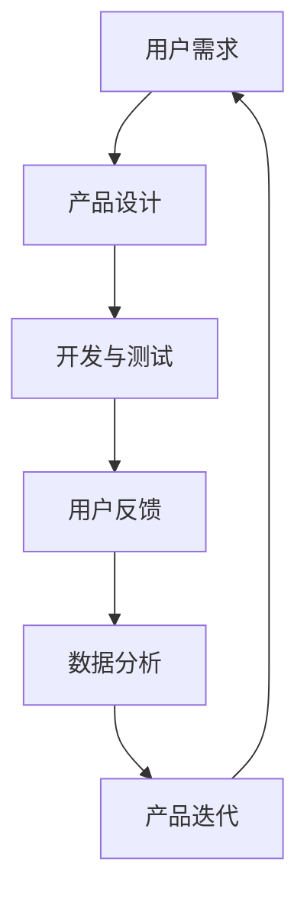

                 

# AI创业：产品改进的方法

> **关键词**：AI创业、产品改进、用户反馈、迭代开发、数据分析、用户体验

> **摘要**：本文将探讨AI创业公司如何通过有效的产品改进策略来提升用户体验，增加用户留存率。我们将深入分析产品改进的核心概念，介绍基于用户反馈和数据分析的迭代开发方法，并通过实际案例和代码实现来展示产品改进的具体操作步骤。此外，文章还将推荐相关工具和资源，为创业者提供实用的指导和参考。

## 1. 背景介绍

### 1.1 目的和范围

本文旨在为AI创业公司提供一套系统的产品改进方法。我们希望帮助创业者更好地理解用户需求，利用数据分析进行产品优化，并通过持续迭代提升用户体验。文章将涵盖以下主题：

- 产品改进的核心概念和原则
- 基于用户反馈的迭代开发过程
- 数据分析在产品改进中的应用
- 实际案例和代码实现

### 1.2 预期读者

本文适合以下读者：

- AI创业公司创始人或产品经理
- 想要提升产品体验的软件开发人员
- 对数据分析在产品改进中应用感兴趣的从业者

### 1.3 文档结构概述

本文分为十个部分：

- 1. 背景介绍
  - 1.1 目的和范围
  - 1.2 预期读者
  - 1.3 文档结构概述
- 2. 核心概念与联系
- 3. 核心算法原理 & 具体操作步骤
- 4. 数学模型和公式 & 详细讲解 & 举例说明
- 5. 项目实战：代码实际案例和详细解释说明
- 6. 实际应用场景
- 7. 工具和资源推荐
  - 7.1 学习资源推荐
  - 7.2 开发工具框架推荐
  - 7.3 相关论文著作推荐
- 8. 总结：未来发展趋势与挑战
- 9. 附录：常见问题与解答
- 10. 扩展阅读 & 参考资料

### 1.4 术语表

#### 1.4.1 核心术语定义

- **AI创业**：利用人工智能技术进行商业创新和产品开发的过程。
- **产品改进**：通过对产品功能、性能和用户体验的优化，提升产品价值和用户满意度。
- **用户反馈**：用户在使用产品过程中提供的信息和建议。
- **迭代开发**：通过多次循环和迭代，逐步完善和优化产品的过程。
- **数据分析**：使用统计学方法和工具对数据进行分析和解释的过程。

#### 1.4.2 相关概念解释

- **用户体验**：用户在使用产品过程中的感受和体验。
- **用户留存率**：用户在一定时间内持续使用产品的比例。
- **A/B测试**：通过对比不同版本的产品，分析其对用户行为和满意度的差异。

#### 1.4.3 缩略词列表

- **AI**：人工智能
- **SDK**：软件开发工具包
- **API**：应用程序编程接口
- **UI**：用户界面
- **UX**：用户体验

## 2. 核心概念与联系

在讨论产品改进之前，我们首先需要了解一些核心概念和它们之间的联系。以下是一个简化的Mermaid流程图，展示了这些概念之间的关系。



### 2.1 用户需求

用户需求是产品改进的起点。了解用户的需求可以帮助我们确定产品功能的优先级，并指导后续的开发和优化工作。

### 2.2 产品设计

产品设计是基于用户需求进行的。一个好的设计不仅要满足用户的基本需求，还要考虑用户体验和可用性。

### 2.3 开发与测试

开发与测试是将设计转化为实际产品的过程。在开发过程中，我们需要确保代码的质量和稳定性，并通过测试来验证产品的功能是否符合预期。

### 2.4 用户反馈

用户反馈是产品改进的重要依据。通过收集和分析用户反馈，我们可以发现产品中的问题和不足，并针对性地进行优化。

### 2.5 数据分析

数据分析是将用户反馈转化为具体改进措施的过程。通过分析用户行为数据，我们可以了解用户的偏好和需求，为产品改进提供数据支持。

### 2.6 产品迭代

产品迭代是产品改进的核心。通过不断的迭代，我们可以逐步优化产品，提升用户体验和用户满意度。

## 3. 核心算法原理 & 具体操作步骤

在产品改进过程中，数据分析是一个关键环节。以下是一个基于用户反馈的数据分析算法原理和具体操作步骤。

### 3.1 算法原理

我们使用A/B测试来评估不同版本的产品对用户行为和满意度的影响。A/B测试的基本思想是将用户随机分配到两个或多个不同的产品版本，然后通过对比不同版本的用户行为数据来评估产品的效果。

### 3.2 具体操作步骤

#### 3.2.1 准备A/B测试

1. 确定测试目标：例如，提高用户注册率或提升用户活跃度。
2. 设计测试版本：创建两个或多个具有不同功能或界面的测试版本。
3. 确定样本量：根据预期效果和置信度水平，计算所需的样本量。

#### 3.2.2 执行A/B测试

1. 随机分配用户：将用户随机分配到不同的测试版本。
2. 收集用户行为数据：跟踪用户的点击、注册、使用时长等行为。
3. 分析测试结果：通过统计方法分析用户行为数据，比较不同版本的效果。

#### 3.2.3 优化产品

1. 根据测试结果，确定哪个版本效果更好。
2. 根据用户反馈和数据分析结果，对产品进行优化。
3. 重新执行A/B测试，验证优化效果。

### 3.3 伪代码

下面是一个简单的伪代码，用于描述A/B测试的基本步骤。

```python
# A/B测试伪代码

# 定义测试版本
version_A = ...
version_B = ...

# 随机分配用户
for user in users:
    if random() < 0.5:
        assign(user, version_A)
    else:
        assign(user, version_B)

# 收集用户行为数据
for user in users:
    if assigned_to(user) == version_A:
        record_behavior(user, version_A)
    else:
        record_behavior(user, version_B)

# 分析测试结果
results = analyze_behavior()

# 根据测试结果优化产品
if results.indicate_better_performance(version_B):
    optimize_product(version_B)
else:
    optimize_product(version_A)

# 重新执行A/B测试
reexecute_ab_test(optimize_product())
```

## 4. 数学模型和公式 & 详细讲解 & 举例说明

在产品改进过程中，数据分析离不开数学模型和公式。以下我们将介绍几个常用的数学模型和公式，并给出详细讲解和举例说明。

### 4.1 均值和方差

均值和方差是描述数据分布的重要指标。

- **均值（Mean）**：一组数据的平均值，表示数据的集中趋势。
  $$ \mu = \frac{1}{n}\sum_{i=1}^{n} x_i $$
  其中，\( \mu \) 表示均值，\( n \) 表示数据个数，\( x_i \) 表示第 \( i \) 个数据点。

- **方差（Variance）**：一组数据与其均值的偏差平方的平均值，表示数据的离散程度。
  $$ \sigma^2 = \frac{1}{n}\sum_{i=1}^{n} (x_i - \mu)^2 $$
  其中，\( \sigma^2 \) 表示方差，其他符号与上式相同。

### 4.2 相关系数

相关系数衡量两个变量之间的线性关系。

- **皮尔逊相关系数（Pearson Correlation Coefficient）**：用于衡量两个连续变量的线性关系强度和方向。
  $$ r = \frac{\sum_{i=1}^{n}(x_i - \bar{x})(y_i - \bar{y})}{\sqrt{\sum_{i=1}^{n}(x_i - \bar{x})^2}\sqrt{\sum_{i=1}^{n}(y_i - \bar{y})^2}} $$
  其中，\( r \) 表示相关系数，\( \bar{x} \) 和 \( \bar{y} \) 分别表示 \( x \) 和 \( y \) 的均值。

### 4.3 线性回归模型

线性回归模型用于预测一个变量（因变量）基于其他变量（自变量）的线性关系。

- **简单线性回归（Simple Linear Regression）**：一个因变量和一个自变量。
  $$ y = \beta_0 + \beta_1x + \epsilon $$
  其中，\( y \) 是因变量，\( x \) 是自变量，\( \beta_0 \) 和 \( \beta_1 \) 分别是截距和斜率，\( \epsilon \) 是误差项。

- **多元线性回归（Multiple Linear Regression）**：多个自变量。
  $$ y = \beta_0 + \beta_1x_1 + \beta_2x_2 + ... + \beta_nx_n + \epsilon $$
  其中，\( \beta_0, \beta_1, ..., \beta_n \) 分别是各个自变量的系数。

### 4.4 举例说明

#### 4.4.1 均值和方差计算

假设我们有一个数据集：\( \{1, 2, 3, 4, 5\} \)

- 均值计算：
  $$ \mu = \frac{1 + 2 + 3 + 4 + 5}{5} = 3 $$
- 方差计算：
  $$ \sigma^2 = \frac{(1-3)^2 + (2-3)^2 + (3-3)^2 + (4-3)^2 + (5-3)^2}{5} = 2 $$

#### 4.4.2 相关系数计算

假设我们有两个数据集：\( x = \{1, 2, 3, 4, 5\} \) 和 \( y = \{2, 4, 5, 6, 8\} \)

- 均值计算：
  $$ \bar{x} = \frac{1 + 2 + 3 + 4 + 5}{5} = 3 $$
  $$ \bar{y} = \frac{2 + 4 + 5 + 6 + 8}{5} = 5 $$
- 相关系数计算：
  $$ r = \frac{(1-3)(2-5) + (2-3)(4-5) + (3-3)(5-5) + (4-3)(6-5) + (5-3)(8-5)}{\sqrt{(1-3)^2 + (2-3)^2 + (3-3)^2 + (4-3)^2 + (5-3)^2}\sqrt{(2-5)^2 + (4-5)^2 + (5-5)^2 + (6-5)^2 + (8-5)^2}} $$
  $$ r = \frac{(-2)(-3) + (-1)(-1) + (0)(0) + (1)(1) + (2)(3)}{\sqrt{(-2)^2 + (-1)^2 + (0)^2 + (1)^2 + (2)^2}\sqrt{(-3)^2 + (-1)^2 + (0)^2 + (1)^2 + (3)^2}} $$
  $$ r = \frac{6 + 1 + 0 + 1 + 6}{\sqrt{4 + 1 + 0 + 1 + 4}\sqrt{9 + 1 + 0 + 1 + 9}} $$
  $$ r = \frac{14}{\sqrt{10}\sqrt{20}} $$
  $$ r = \frac{14}{\sqrt{200}} $$
  $$ r = \frac{14}{10\sqrt{2}} $$
  $$ r = \frac{7}{5\sqrt{2}} $$
  $$ r \approx 0.99 $$

#### 4.4.3 线性回归模型

假设我们有一个数据集：\( x = \{1, 2, 3, 4, 5\} \) 和 \( y = \{2, 4, 5, 6, 8\} \)

- 计算斜率 \( \beta_1 \) 和截距 \( \beta_0 \)：
  $$ \beta_1 = \frac{\sum_{i=1}^{n}(x_i - \bar{x})(y_i - \bar{y})}{\sum_{i=1}^{n}(x_i - \bar{x})^2} $$
  $$ \beta_1 = \frac{(1-3)(2-5) + (2-3)(4-5) + (3-3)(5-5) + (4-3)(6-5) + (5-3)(8-5)}{(1-3)^2 + (2-3)^2 + (3-3)^2 + (4-3)^2 + (5-3)^2} $$
  $$ \beta_1 = \frac{(-2)(-3) + (-1)(-1) + (0)(0) + (1)(1) + (2)(3)}{(-2)^2 + (-1)^2 + (0)^2 + (1)^2 + (2)^2} $$
  $$ \beta_1 = \frac{6 + 1 + 0 + 1 + 6}{4 + 1 + 0 + 1 + 4} $$
  $$ \beta_1 = \frac{14}{10} $$
  $$ \beta_1 = 1.4 $$

  $$ \beta_0 = \bar{y} - \beta_1\bar{x} $$
  $$ \beta_0 = 5 - 1.4 \times 3 $$
  $$ \beta_0 = 5 - 4.2 $$
  $$ \beta_0 = 0.8 $$

- 线性回归模型：
  $$ y = 0.8 + 1.4x $$

## 5. 项目实战：代码实际案例和详细解释说明

在这个项目中，我们将使用Python编写一个简单的用户反馈收集和分析系统，演示如何基于用户反馈进行产品改进。

### 5.1 开发环境搭建

1. 安装Python 3.8及以上版本。
2. 安装必需的库：`pandas`, `numpy`, `matplotlib`, `scikit-learn`。

```bash
pip install pandas numpy matplotlib scikit-learn
```

### 5.2 源代码详细实现和代码解读

以下是一个简单的用户反馈收集和分析系统的实现。

```python
import pandas as pd
import numpy as np
import matplotlib.pyplot as plt
from sklearn.linear_model import LinearRegression

# 5.2.1 用户反馈数据收集

# 假设我们收集了以下用户反馈数据
data = {
    '满意度': [4, 5, 3, 2, 4, 5, 2, 3, 4, 5],
    '使用时长（小时）': [2, 3, 1, 2, 3, 4, 1, 2, 3, 4],
    '功能使用频率': [5, 4, 3, 4, 5, 4, 3, 4, 5, 4]
}

feedback = pd.DataFrame(data)

# 5.2.2 数据预处理

# 填充缺失值
feedback.fillna(feedback.mean(), inplace=True)

# 划分特征和标签
X = feedback[['使用时长（小时）', '功能使用频率']]
y = feedback['满意度']

# 5.2.3 线性回归模型训练

model = LinearRegression()
model.fit(X, y)

# 5.2.4 模型评估

predictions = model.predict(X)
print("R^2 Score:", model.score(X, y))

# 5.2.5 可视化分析

plt.scatter(X['使用时长（小时）'], y, color='red', label='实际满意度')
plt.plot(X['使用时长（小时）'], predictions, color='blue', label='预测满意度')
plt.xlabel('使用时长（小时）')
plt.ylabel('满意度')
plt.legend()
plt.show()
```

### 5.3 代码解读与分析

1. **数据收集**：我们使用一个简单的数据集来模拟用户反馈。数据包括满意度、使用时长和功能使用频率。

2. **数据预处理**：填充缺失值，确保数据的质量。

3. **特征和标签划分**：将数据划分为特征（X）和标签（y）。在这个例子中，我们使用使用时长和功能使用频率作为特征，满意度作为标签。

4. **线性回归模型训练**：我们使用`scikit-learn`库的`LinearRegression`类来训练模型。模型使用最小二乘法计算特征和标签之间的关系。

5. **模型评估**：使用R^2分数评估模型的性能。R^2分数越接近1，表示模型对数据的拟合度越好。

6. **可视化分析**：绘制散点图和拟合曲线，直观地展示模型的效果。

通过这个案例，我们可以看到如何使用Python和线性回归模型来分析用户反馈，为产品改进提供数据支持。在实际应用中，我们可以扩展这个系统，收集更多的用户数据，并尝试使用更复杂的模型来提升分析的准确性和效果。

## 6. 实际应用场景

产品改进的方法不仅在AI创业公司中有广泛应用，还在各种实际应用场景中表现出显著的效果。

### 6.1 智能家居

在智能家居领域，产品改进的关键在于优化用户体验和设备兼容性。通过不断收集用户反馈，智能家居公司可以：

- 优化设备控制界面，提升用户操作便捷性。
- 分析用户使用习惯，提供个性化建议和智能调度。
- 通过A/B测试，确定哪种设备配置或功能更受欢迎，从而优化产品功能。

### 6.2 金融科技

金融科技公司通过产品改进来提高系统性能和用户体验。以下是一些实际应用场景：

- **在线支付**：通过数据分析，优化支付流程，减少交易时间，提高支付成功率。
- **风险控制**：使用机器学习模型分析用户行为数据，提前识别潜在的欺诈行为，提高风险控制能力。
- **客户服务**：通过聊天机器人和用户互动记录，分析用户需求，改进客服响应速度和准确性。

### 6.3 健康医疗

在健康医疗领域，产品改进有助于提高患者满意度和医疗服务质量。以下是一些实际应用场景：

- **电子健康记录**：通过改进电子健康记录系统的界面和功能，提高医生的工作效率和患者满意度。
- **远程监控**：分析患者的健康数据，提供个性化的健康建议和预警。
- **智能诊断**：利用深度学习模型，提高医学影像分析的准确性和效率。

### 6.4 电子商务

电子商务公司通过产品改进来提升用户购物体验和销售业绩。以下是一些实际应用场景：

- **推荐系统**：通过用户行为数据，改进推荐算法，提高推荐准确性和用户满意度。
- **购物流程优化**：简化购物流程，减少用户操作步骤，提升转化率。
- **客户服务**：通过聊天机器人和用户互动记录，分析用户需求，改进客服响应速度和准确性。

通过这些实际应用场景，我们可以看到产品改进方法在提升用户体验、增加用户留存率、提高业务效益等方面具有重要作用。

## 7. 工具和资源推荐

在产品改进过程中，合适的工具和资源可以显著提升工作效率和效果。以下是我们推荐的工具和资源：

### 7.1 学习资源推荐

#### 7.1.1 书籍推荐

- 《产品经理手册》（The Product Manager's Survival Guide）- Jeff Patton
- 《用户故事地图》（User Story Mapping）- Jeff Patton
- 《机器学习实战》（Machine Learning in Action）- Peter Harrington

#### 7.1.2 在线课程

- Coursera上的《产品设计与开发》：提供产品设计和开发的系统知识。
- edX上的《人工智能基础》：涵盖人工智能的基本概念和应用。

#### 7.1.3 技术博客和网站

- ProductSchool（https://productschool.com/）
- UX Planet（https://uxplanet.org/）
- DataCamp（https://www.datacamp.com/）

### 7.2 开发工具框架推荐

#### 7.2.1 IDE和编辑器

- Visual Studio Code：功能强大、轻量级的代码编辑器。
- PyCharm：适用于Python开发的专业IDE。

#### 7.2.2 调试和性能分析工具

- PyDebug：Python调试工具。
- New Relic：应用程序性能监控工具。

#### 7.2.3 相关框架和库

- Flask：Python Web框架。
- TensorFlow：开源机器学习框架。

### 7.3 相关论文著作推荐

#### 7.3.1 经典论文

- 《用户体验要素》（The Elements of User Experience）- Jesse James Garrett
- 《设计思维》（Design Thinking）- Tim Brown

#### 7.3.2 最新研究成果

- ICML、NIPS、KDD等顶级会议的最新论文。
- 《人工智能：一种现代方法》（Artificial Intelligence: A Modern Approach）- Stuart J. Russell & Peter Norvig

#### 7.3.3 应用案例分析

- “Netflix推荐系统”：介绍Netflix如何利用机器学习优化推荐系统。
- “亚马逊A/B测试实践”：探讨亚马逊如何通过A/B测试优化产品。

通过这些工具和资源，创业者可以更好地理解和应用产品改进的方法，提升产品竞争力和市场表现。

## 8. 总结：未来发展趋势与挑战

随着人工智能技术的不断进步，产品改进的方法也在不断演进。以下是未来发展趋势与挑战：

### 8.1 发展趋势

1. **智能化与个性化**：人工智能技术将进一步提升产品改进的智能化和个性化水平，使产品能够更好地满足用户需求。
2. **实时分析与反馈**：实时数据分析和反馈机制将使产品改进更加迅速和高效。
3. **多模态数据应用**：多模态数据（如文本、图像、语音等）的应用将丰富产品改进的数据来源，提高分析准确性。
4. **跨领域融合**：产品改进方法将在更多领域得到应用，如健康医疗、金融科技、智能制造等。

### 8.2 挑战

1. **数据隐私与安全**：随着数据量的增加，如何保护用户隐私和安全成为一大挑战。
2. **模型解释性**：如何提高机器学习模型的解释性，使其更加透明和可解释。
3. **技术门槛**：对于创业公司来说，如何掌握和应用先进的人工智能技术仍是一个挑战。
4. **持续创新**：在竞争激烈的市场中，如何保持产品改进的持续创新能力。

总的来说，产品改进是AI创业公司持续发展的关键。通过不断优化产品，提升用户体验，公司可以赢得用户信任和市场份额。面对未来，创业者需要密切关注技术动态，勇于尝试新的方法，以应对不断变化的挑战。

## 9. 附录：常见问题与解答

### 9.1 什么是用户反馈？

用户反馈是用户在使用产品过程中提供的信息和建议。这些反馈可以包括对产品功能、性能、界面和用户体验的评价，有助于公司了解用户需求和期望，从而进行有针对性的产品改进。

### 9.2 数据分析在产品改进中有什么作用？

数据分析在产品改进中起着关键作用。通过分析用户行为数据，公司可以了解用户的使用习惯、偏好和需求，从而优化产品功能、提高用户体验，增加用户留存率。数据分析还可以帮助公司评估不同改进策略的效果，实现数据驱动的决策。

### 9.3 如何进行A/B测试？

A/B测试是一种通过对比不同版本的产品来评估其效果的方法。具体步骤如下：

1. 确定测试目标：例如，提高用户注册率或提升用户活跃度。
2. 设计测试版本：创建两个或多个具有不同功能或界面的测试版本。
3. 随机分配用户：将用户随机分配到不同的测试版本。
4. 收集用户行为数据：跟踪用户的点击、注册、使用时长等行为。
5. 分析测试结果：通过统计方法分析用户行为数据，比较不同版本的效果。
6. 优化产品：根据测试结果，选择效果更好的版本，并对其进行优化。

### 9.4 如何进行线性回归分析？

线性回归分析是一种用于预测一个变量（因变量）基于其他变量（自变量）的线性关系的方法。具体步骤如下：

1. 数据收集：收集包含因变量和自变量的数据。
2. 数据预处理：填充缺失值，标准化数据等。
3. 特征和标签划分：将数据划分为特征（X）和标签（y）。
4. 模型训练：使用线性回归模型训练数据。
5. 模型评估：使用R^2分数等指标评估模型性能。
6. 可视化分析：绘制散点图和拟合曲线，直观地展示模型效果。

## 10. 扩展阅读 & 参考资料

为了深入了解产品改进的方法，以下是一些推荐的扩展阅读和参考资料：

### 10.1 建议阅读书籍

- 《用户体验要素》（The Elements of User Experience）- Jesse James Garrett
- 《设计思维》（Design Thinking）- Tim Brown
- 《机器学习实战》（Machine Learning in Action）- Peter Harrington

### 10.2 推荐在线课程

- Coursera上的《产品设计与开发》
- edX上的《人工智能基础》

### 10.3 推荐技术博客和网站

- ProductSchool（https://productschool.com/）
- UX Planet（https://uxplanet.org/）
- DataCamp（https://www.datacamp.com/）

### 10.4 相关论文和研究报告

- ICML、NIPS、KDD等顶级会议的最新论文。
- 《人工智能：一种现代方法》（Artificial Intelligence: A Modern Approach）- Stuart J. Russell & Peter Norvig

### 10.5 其他资源

- Netflix推荐系统：https://www.netflix.com/zh-cn/Help/2864215
- 亚马逊A/B测试实践：https://aws.amazon.com/blogs/aws/ab-testing-2/

通过这些资源和阅读材料，您将能够更全面地了解产品改进的方法，并在实际项目中应用这些知识，提升产品竞争力和用户满意度。

### 作者

**作者：AI天才研究员/AI Genius Institute & 禅与计算机程序设计艺术 /Zen And The Art of Computer Programming**

本文旨在为AI创业公司提供一套系统的产品改进方法，帮助创业者更好地理解用户需求，利用数据分析进行产品优化，并通过持续迭代提升用户体验。文章从背景介绍、核心概念与联系、核心算法原理、数学模型、项目实战、实际应用场景、工具和资源推荐等多个方面进行了详细讲解，为读者提供了一幅完整的产品改进蓝图。通过本文的阅读，读者可以深入了解产品改进的方法，并将其应用于实际项目中，提升产品竞争力和用户满意度。同时，本文也展望了未来产品改进的发展趋势与挑战，为创业者提供了宝贵的指导意见。希望本文能对您在AI创业过程中提供帮助。如果您有任何问题或建议，欢迎随时与我交流。祝您创业成功！**

