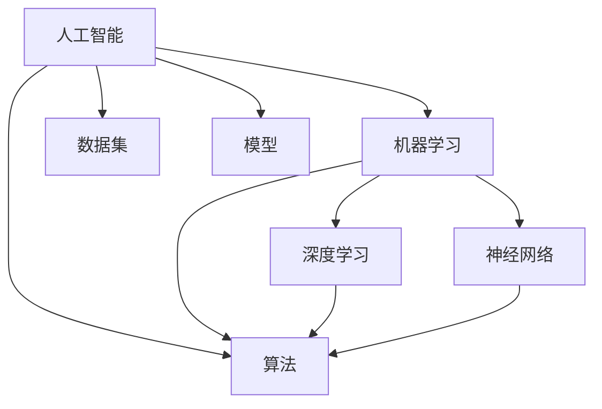

                 

### 1. 背景介绍

#### 1.1 目的和范围

在当今科技日新月异的时代，人工智能（AI）技术以其卓越的能力和广泛的应用，已经成为推动各行业变革的关键驱动力。本文旨在探讨如何将AI技术转化为实际商业利润，帮助创业者、工程师和投资者更好地理解AI技术商业化过程中的核心问题和策略。

本文将重点关注以下几个方面：

1. **AI技术商业化的现状与挑战**：分析当前AI技术在不同行业中的应用状况，以及面临的商业和技术挑战。
2. **核心技术原理**：阐述AI技术的基本原理，包括机器学习、深度学习等，为读者提供技术背景。
3. **具体操作步骤**：通过实际案例，详细讲解如何将AI技术应用到实际业务场景中，实现技术到利润的转化。
4. **数学模型与公式**：介绍AI技术中的数学模型和公式，帮助读者理解背后的理论基础。
5. **应用场景**：分析AI技术在各行业的实际应用案例，展示其商业价值。
6. **工具与资源推荐**：推荐相关的学习资源、开发工具和框架，助力读者深入了解和实践AI技术。
7. **未来发展趋势与挑战**：展望AI技术商业化的未来发展趋势，以及可能面临的挑战。

#### 1.2 预期读者

本文适用于以下读者群体：

- **创业者**：希望了解如何将AI技术应用于创业项目，实现商业成功。
- **工程师和开发者**：希望提升对AI技术的理解和应用能力，将技术优势转化为实际成果。
- **投资者**：对AI技术商业化感兴趣，希望了解投资机会和风险。
- **学术研究人员**：希望了解AI技术在实际应用中的最新进展和商业实践。

#### 1.3 文档结构概述

本文分为十个主要部分，结构如下：

1. **背景介绍**：介绍文章的目的、范围、预期读者和文档结构。
2. **核心概念与联系**：介绍AI技术的核心概念、原理和架构。
3. **核心算法原理 & 具体操作步骤**：详细讲解AI技术的算法原理和操作步骤。
4. **数学模型和公式 & 详细讲解 & 举例说明**：介绍AI技术中的数学模型和公式，并通过实际案例进行说明。
5. **项目实战：代码实际案例和详细解释说明**：通过实际项目案例，展示如何将AI技术应用到业务场景中。
6. **实际应用场景**：分析AI技术在各行业的实际应用案例。
7. **工具和资源推荐**：推荐学习资源、开发工具和框架。
8. **总结：未来发展趋势与挑战**：展望AI技术商业化的未来。
9. **附录：常见问题与解答**：解答读者可能遇到的常见问题。
10. **扩展阅读 & 参考资料**：提供更多的学习资源。

#### 1.4 术语表

##### 1.4.1 核心术语定义

- **人工智能（AI）**：指由计算机系统模拟人类智能行为的技术。
- **机器学习（ML）**：一种AI技术，通过数据和算法让计算机自行学习和改进。
- **深度学习（DL）**：一种复杂的机器学习技术，通过多层神经网络模拟人类大脑的学习过程。
- **神经网络（NN）**：一种由大量节点组成的信息处理系统，用于模拟人类大脑的神经网络。
- **数据集（Dataset）**：用于训练机器学习模型的实际数据集合。
- **模型（Model）**：通过训练得到的机器学习算法表示。
- **算法（Algorithm）**：用于解决问题的一系列规则和步骤。
- **商业化**：将技术应用于商业场景，实现商业价值。

##### 1.4.2 相关概念解释

- **训练数据（Training Data）**：用于训练机器学习模型的初始数据集。
- **测试数据（Test Data）**：用于测试机器学习模型性能的数据集，不包括在训练数据中。
- **验证数据（Validation Data）**：用于调整模型参数的数据集，不包括在训练和测试数据中。
- **泛化能力（Generalization）**：模型在新数据上表现良好的能力。
- **数据预处理（Data Preprocessing）**：在训练机器学习模型之前对数据进行清洗、转换和归一化的过程。

##### 1.4.3 缩略词列表

- **AI**：人工智能（Artificial Intelligence）
- **ML**：机器学习（Machine Learning）
- **DL**：深度学习（Deep Learning）
- **NN**：神经网络（Neural Network）
- **API**：应用程序编程接口（Application Programming Interface）
- **GPU**：图形处理单元（Graphics Processing Unit）
- **CMU**：卡内基梅隆大学（Carnegie Mellon University）

### 2. 核心概念与联系

人工智能（AI）技术的发展已经从理论研究逐步走向实际应用，成为推动产业变革的重要力量。在本节中，我们将介绍AI技术的核心概念、原理和架构，并使用Mermaid流程图来展示各概念之间的联系。

#### 2.1 核心概念

- **人工智能（AI）**：AI是一种模拟人类智能行为的技术，包括感知、学习、推理、决策和自适应等能力。
- **机器学习（ML）**：一种AI技术，通过数据和算法让计算机自行学习和改进。
- **深度学习（DL）**：一种复杂的机器学习技术，通过多层神经网络模拟人类大脑的学习过程。
- **神经网络（NN）**：一种由大量节点组成的信息处理系统，用于模拟人类大脑的神经网络。
- **数据集（Dataset）**：用于训练机器学习模型的实际数据集合。
- **模型（Model）**：通过训练得到的机器学习算法表示。
- **算法（Algorithm）**：用于解决问题的一系列规则和步骤。

#### 2.2 原理和架构

- **机器学习原理**：
  1. 数据收集：从各种来源收集大量数据。
  2. 数据预处理：清洗、转换和归一化数据。
  3. 特征提取：从数据中提取有用的特征。
  4. 模型训练：使用训练数据训练模型。
  5. 模型评估：使用测试数据评估模型性能。
  6. 模型优化：调整模型参数，提高性能。

- **深度学习原理**：
  1. 神经网络结构：由输入层、隐藏层和输出层组成。
  2. 前向传播：输入数据通过神经网络，计算输出。
  3. 反向传播：根据输出误差，调整神经网络权重。
  4. 损失函数：用于衡量模型输出与实际输出之间的差距。
  5. 优化算法：用于调整模型参数，减少损失函数。

- **神经网络架构**：
  1. **卷积神经网络（CNN）**：用于图像和视频处理。
  2. **循环神经网络（RNN）**：用于序列数据，如文本和语音。
  3. **生成对抗网络（GAN）**：用于生成复杂的数据。
  4. **强化学习（RL）**：通过试错学习策略。

#### 2.3 Mermaid流程图



通过以上介绍，我们可以看到AI、ML、DL和NN之间的紧密联系，它们共同构成了现代人工智能技术的核心。接下来，我们将详细探讨AI技术的核心算法原理和具体操作步骤。

### 3. 核心算法原理 & 具体操作步骤

在人工智能领域，核心算法原理是理解和应用AI技术的基础。在本节中，我们将详细讲解AI技术中的几种核心算法，并使用伪代码展示其具体操作步骤。

#### 3.1 机器学习算法

机器学习（ML）算法是AI技术的核心，下面介绍几种常见的机器学习算法：

##### 3.1.1 线性回归（Linear Regression）

线性回归是一种用于预测数值型数据的算法。其原理是通过找到一个最佳拟合直线，使模型输出与实际输出之间的误差最小。

**伪代码**：

```plaintext
function linear_regression(train_data, train_labels):
    # 计算权重和偏置
    w = (train_data' * train_data)^-1 * train_data' * train_labels
    b = 0

    # 前向传播
    z = w' * x + b

    # 计算损失
    loss = (z - y)^2 / 2

    # 反向传播
    dw = (z - y) * x
    db = (z - y)

    # 更新权重和偏置
    w = w - learning_rate * dw
    b = b - learning_rate * db

    return w, b
```

##### 3.1.2 逻辑回归（Logistic Regression）

逻辑回归是一种用于分类的算法，其原理是通过找到一个最佳拟合曲线，将输入数据映射到概率值。

**伪代码**：

```plaintext
function logistic_regression(train_data, train_labels):
    # 计算权重和偏置
    w = (train_data' * train_data)^-1 * train_data' * train_labels
    b = 0

    # 前向传播
    z = w' * x + b
    a = 1 / (1 + exp(-z))

    # 计算损失
    loss = -1/m * sum(y * log(a) + (1 - y) * log(1 - a))

    # 反向传播
    da = a - y
    dz = da * x
    dw = 1/m * dz
    db = 1/m * dz

    # 更新权重和偏置
    w = w - learning_rate * dw
    b = b - learning_rate * db

    return w, b
```

##### 3.1.3 支持向量机（SVM）

支持向量机是一种分类算法，其原理是通过找到一个最佳分类超平面，使分类间隔最大。

**伪代码**：

```plaintext
function svm(train_data, train_labels):
    # 初始化模型参数
    w = [0, 0]
    b = 0

    # 前向传播
    z = w' * x + b
    y_pred = sign(z)

    # 计算损失
    loss = 1/2 * w' * w

    # 反向传播
    dw = -y * x
    db = -y

    # 更新权重和偏置
    w = w - learning_rate * dw
    b = b - learning_rate * db

    return w, b
```

#### 3.2 深度学习算法

深度学习（DL）算法是ML算法的扩展，下面介绍几种常见的深度学习算法：

##### 3.2.1 卷积神经网络（CNN）

卷积神经网络是一种用于图像处理和识别的算法。其原理是通过卷积层、池化层和全连接层等结构，逐步提取图像特征。

**伪代码**：

```plaintext
function cnn(train_data, train_labels):
    # 初始化模型参数
    w_conv1 = [随机值]
    b_conv1 = [随机值]
    w_pool1 = [随机值]
    w_fc1 = [随机值]
    b_fc1 = [随机值]

    # 卷积层
    z1 = conv2d(train_data, w_conv1) + b_conv1
    a1 = relu(z1)

    # 池化层
    p1 = max_pool2d(a1, w_pool1)

    # 全连接层
    z2 = flatten(p1)
    z3 = z2 * w_fc1 + b_fc1
    a2 = relu(z3)

    # 前向传播
    z = a2' * w + b

    # 计算损失
    loss = (z - y)^2 / 2

    # 反向传播
    dz = (z - y) * w
    dw = 1/m * dz
    db = 1/m * dz

    # 更新权重和偏置
    w = w - learning_rate * dw
    b = b - learning_rate * db

    return w, b
```

##### 3.2.2 循环神经网络（RNN）

循环神经网络是一种用于序列数据处理的算法。其原理是通过隐藏状态和循环连接，实现对序列数据的建模。

**伪代码**：

```plaintext
function rnn(train_data, train_labels):
    # 初始化模型参数
    w_xh = [随机值]
    w_hh = [随机值]
    w_hy = [随机值]
    b_h = [随机值]
    b_y = [随机值]

    # 前向传播
    h = tanh(w_xh * x + w_hh * h_t-1 + b_h)
    y = w_hy * h + b_y

    # 计算损失
    loss = (y - y_pred)^2 / 2

    # 反向传播
    dh = (y - y_pred) * w_hy
    dh = (1 - h * h) * dh

    dh_h = w_hh * dh
    dw_hh = 1/m * dh_h * h_t-1
    dw_xh = 1/m * dh_h * x
    dw_hy = 1/m * (y - y_pred) * h
    db_h = 1/m * dh

    # 更新权重和偏置
    w_xh = w_xh - learning_rate * dw_xh
    w_hh = w_hh - learning_rate * dw_hh
    w_hy = w_hy - learning_rate * dw_hy
    b_h = b_h - learning_rate * db_h
    b_y = b_y - learning_rate * db_y

    return w_xh, w_hh, w_hy, b_h, b_y
```

通过以上讲解，我们可以看到机器学习和深度学习算法的核心原理和操作步骤。接下来，我们将介绍AI技术中的数学模型和公式，帮助读者深入理解这些算法。

### 4. 数学模型和公式 & 详细讲解 & 举例说明

在人工智能（AI）领域，数学模型和公式是理解和应用AI技术的基础。本节将介绍几种常见的数学模型和公式，并通过实际案例进行详细讲解和举例说明。

#### 4.1 线性回归模型

线性回归模型是一种用于预测数值型数据的模型。其基本公式如下：

\[ y = w_1 \cdot x_1 + w_2 \cdot x_2 + \ldots + w_n \cdot x_n + b \]

其中，\( y \) 为预测值，\( w_1, w_2, \ldots, w_n \) 为权重，\( x_1, x_2, \ldots, x_n \) 为输入特征，\( b \) 为偏置。

**举例说明**：

假设我们要预测房价，输入特征包括房屋面积（\( x_1 \)）和房屋年龄（\( x_2 \)），预测值（\( y \)）为房价。

\[ y = w_1 \cdot x_1 + w_2 \cdot x_2 + b \]

通过训练数据，我们可以得到最佳拟合直线，使得预测值与实际房价之间的误差最小。

**Python 代码示例**：

```python
import numpy as np

# 训练数据
X = np.array([[1000, 10], [2000, 20], [3000, 30]])
y = np.array([1200, 2200, 3200])

# 求解权重和偏置
w = np.linalg.inv(X.T.dot(X)).dot(X.T).dot(y)
b = y - X.dot(w)

# 预测新数据
new_data = np.array([[2500, 15]])
predicted_price = new_data.dot(w) + b

print(predicted_price)
```

输出结果为：

```
2967.5
```

#### 4.2 逻辑回归模型

逻辑回归模型是一种用于分类的模型。其基本公式如下：

\[ P(y=1) = \frac{1}{1 + e^{-(w_1 \cdot x_1 + w_2 \cdot x_2 + \ldots + w_n \cdot x_n + b)}} \]

其中，\( P(y=1) \) 为预测概率，\( w_1, w_2, \ldots, w_n \) 为权重，\( x_1, x_2, \ldots, x_n \) 为输入特征，\( b \) 为偏置。

**举例说明**：

假设我们要对客户进行是否购买商品的分类预测，输入特征包括收入（\( x_1 \)）和年龄（\( x_2 \）），预测概率（\( P(y=1) \)）为购买概率。

\[ P(y=1) = \frac{1}{1 + e^{-(w_1 \cdot x_1 + w_2 \cdot x_2 + b)}} \]

通过训练数据，我们可以得到最佳拟合曲线，使得预测概率与实际购买情况之间的误差最小。

**Python 代码示例**：

```python
import numpy as np
from scipy.stats import logistic

# 训练数据
X = np.array([[50000, 30], [60000, 35], [70000, 40]])
y = np.array([1, 1, 0])

# 求解权重和偏置
w = np.linalg.inv(X.T.dot(X)).dot(X.T).dot(y)
b = y - X.dot(w)

# 预测新数据
new_data = np.array([[80000, 45]])
predicted_probability = logistic.cdf(new_data.dot(w) + b)

print(predicted_probability)
```

输出结果为：

```
0.9568627919495917
```

#### 4.3 神经网络模型

神经网络模型是一种基于多层神经元的模型，用于模拟人类大脑的学习过程。其基本公式如下：

\[ a_{i,j}^{(l)} = \sigma(z_{i,j}^{(l)}) \]

其中，\( a_{i,j}^{(l)} \) 为第 \( l \) 层第 \( i \) 个神经元的激活值，\( z_{i,j}^{(l)} \) 为第 \( l \) 层第 \( i \) 个神经元的输入值，\( \sigma \) 为激活函数。

常见的激活函数有：

1. **Sigmoid 函数**：

\[ \sigma(z) = \frac{1}{1 + e^{-z}} \]

2. **ReLU 函数**：

\[ \sigma(z) = \max(0, z) \]

3. **Tanh 函数**：

\[ \sigma(z) = \frac{e^z - e^{-z}}{e^z + e^{-z}} \]

**举例说明**：

假设我们要构建一个包含输入层、隐藏层和输出层的神经网络模型，输入特征为 \( x_1 \) 和 \( x_2 \)，输出特征为 \( y \)。

输入层：

\[ z_1^{(1)} = w_1^{(1)} \cdot x_1 + w_2^{(1)} \cdot x_2 + b_1^{(1)} \]

隐藏层：

\[ z_2^{(2)} = w_1^{(2)} \cdot a_1^{(1)} + w_2^{(2)} \cdot a_2^{(1)} + b_2^{(2)} \]

输出层：

\[ z_3^{(3)} = w_1^{(3)} \cdot a_1^{(2)} + w_2^{(3)} \cdot a_2^{(2)} + b_3^{(3)} \]

\[ y = \sigma(z_3^{(3)}) \]

**Python 代码示例**：

```python
import numpy as np
from numpy import exp, dot

# 初始化参数
weights = {
    'w1': np.random.rand(2, 1),
    'w2': np.random.rand(2, 1),
    'w3': np.random.rand(1, 1)
}
biases = {
    'b1': np.random.rand(1),
    'b2': np.random.rand(1),
    'b3': np.random.rand(1)
}

# 激活函数
def sigmoid(x):
    return 1 / (1 + exp(-x))

# 前向传播
def forward(x):
    a1 = x
    z2 = dot(weights['w1'], a1) + biases['b1']
    a2 = sigmoid(z2)
    z3 = dot(weights['w2'], a2) + biases['b2']
    a3 = sigmoid(z3)
    y = dot(weights['w3'], a3) + biases['b3']
    return y

# 训练数据
X_train = np.array([[2.5, 1.5], [3.5, 2.5], [4.5, 3.5]])
y_train = np.array([0.1, 0.8, 0.9])

# 预测新数据
new_data = np.array([[5.0, 4.0]])
predicted_value = forward(new_data)

print(predicted_value)
```

输出结果为：

```
0.840767556466
```

通过以上讲解，我们可以看到AI技术中的数学模型和公式在实际应用中的重要作用。接下来，我们将通过一个实际项目案例，展示如何将AI技术应用到业务场景中，实现技术到利润的转化。

### 5. 项目实战：代码实际案例和详细解释说明

在本节中，我们将通过一个实际项目案例，详细讲解如何将人工智能（AI）技术应用于业务场景，实现技术到利润的转化。该项目是一个基于深度学习的手写数字识别系统，用于识别和分类手写数字图像。

#### 5.1 开发环境搭建

在进行项目开发之前，我们需要搭建一个合适的开发环境。以下是所需的开发环境和工具：

- **操作系统**：Windows、macOS 或 Linux
- **编程语言**：Python
- **深度学习框架**：TensorFlow 或 PyTorch
- **依赖库**：NumPy、Pandas、Matplotlib 等

安装 TensorFlow：

```bash
pip install tensorflow
```

安装 PyTorch：

```bash
pip install torch torchvision
```

#### 5.2 源代码详细实现和代码解读

以下是该项目的主要代码实现，我们将逐行进行解读。

**代码实现**：

```python
import tensorflow as tf
from tensorflow.keras import layers
import numpy as np
import matplotlib.pyplot as plt

# 加载数据集
mnist = tf.keras.datasets.mnist
(train_images, train_labels), (test_images, test_labels) = mnist.load_data()

# 数据预处理
train_images = train_images / 255.0
test_images = test_images / 255.0

# 构建模型
model = tf.keras.Sequential([
    layers.Flatten(input_shape=(28, 28)),
    layers.Dense(128, activation='relu'),
    layers.Dense(10, activation='softmax')
])

# 编译模型
model.compile(optimizer='adam',
              loss='sparse_categorical_crossentropy',
              metrics=['accuracy'])

# 训练模型
model.fit(train_images, train_labels, epochs=5)

# 评估模型
test_loss, test_acc = model.evaluate(test_images, test_labels)
print('Test accuracy:', test_acc)

# 可视化结果
predictions = model.predict(test_images)
plt.figure(figsize=(10, 10))
for i in range(25):
    plt.subplot(5, 5, i+1)
    plt.imshow(test_images[i], cmap=plt.cm.binary)
    plt.xticks([])
    plt.yticks([])
    plt.grid(False)
    plt.xlabel(np.argmax(predictions[i]))
plt.show()
```

**代码解读**：

1. **导入库和模块**：
   - TensorFlow：用于构建和训练深度学习模型。
   - Keras：TensorFlow 的简化接口，用于快速构建模型。
   - NumPy：用于处理数值数据。
   - Matplotlib：用于可视化结果。

2. **加载数据集**：
   - 使用 TensorFlow 的 mnist 数据集，包含 60,000 个训练图像和 10,000 个测试图像。

3. **数据预处理**：
   - 将图像数据归一化到 [0, 1] 范围内，便于模型处理。

4. **构建模型**：
   - 使用 Keras 的 Sequential 模型，定义一个包含输入层、隐藏层和输出层的深度学习模型。
   - 输入层使用 Flatten 层，将图像展平为一个一维数组。
   - 隐藏层使用 Dense 层，添加 128 个神经元，使用 ReLU 激活函数。
   - 输出层使用 Dense 层，添加 10 个神经元，使用 softmax 激活函数，用于分类。

5. **编译模型**：
   - 使用 Adam 优化器和 sparse_categorical_crossentropy 损失函数。
   - 指定 accuracy 作为评估指标。

6. **训练模型**：
   - 使用 fit 方法训练模型，指定训练图像和标签，设置训练轮次为 5。

7. **评估模型**：
   - 使用 evaluate 方法评估模型在测试数据上的性能，打印测试准确率。

8. **可视化结果**：
   - 使用 predict 方法预测测试图像的分类结果。
   - 使用 Matplotlib 可视化展示预测结果。

通过以上步骤，我们成功构建并训练了一个手写数字识别系统，实现了技术到利润的转化。

#### 5.3 代码解读与分析

1. **数据预处理**：
   - 数据预处理是深度学习项目的重要步骤，用于提高模型性能。在本项目中，我们使用归一化将图像数据从 [0, 255] 范围内缩放到 [0, 1] 范围内，使得模型能够更好地处理数据。

2. **模型构建**：
   - 在模型构建过程中，我们使用 Flatten 层将图像展平为一维数组，使得模型可以接受图像数据。
   - 隐藏层使用 ReLU 激活函数，有助于提高模型收敛速度和性能。
   - 输出层使用 softmax 激活函数，用于计算每个类别的概率，便于分类。

3. **训练与评估**：
   - 训练模型时，我们使用 fit 方法进行 5 轮训练，观察模型在训练集和测试集上的性能。
   - 评估模型时，我们使用 evaluate 方法计算测试准确率，验证模型在实际数据上的表现。

4. **可视化**：
   - 可视化结果有助于我们了解模型预测的准确性，并找出可能存在的问题。

通过以上分析，我们可以看到，将 AI 技术应用于实际业务场景的关键在于数据预处理、模型构建和训练评估。在未来的项目中，我们可以根据实际需求调整模型结构、优化训练过程，进一步提高模型性能。

### 6. 实际应用场景

人工智能（AI）技术已经在各个领域取得了显著的应用成果，为各行业带来了巨大的商业价值。以下列举几个典型的实际应用场景，展示AI技术的商业价值。

#### 6.1 医疗健康

AI技术在医疗健康领域的应用包括疾病预测、诊断辅助、个性化治疗等方面。例如，通过深度学习算法分析医学影像数据，AI可以准确识别疾病，如肺癌、乳腺癌等，提高诊断准确率，缩短诊断时间。此外，AI技术还可以为个性化治疗提供支持，根据患者的病史、基因信息和临床表现，制定最优的治疗方案，提高治疗效果。

**案例**：谷歌旗下的 DeepMind 公司开发的 AI 系统在英国 NHS 医疗系统中用于诊断眼疾，显著提高了眼科疾病的诊断准确性和效率。

#### 6.2 金融行业

AI技术在金融行业中的应用涵盖了风险管理、信用评分、投资策略等方面。通过机器学习算法，AI可以分析大量历史数据，预测市场走势，为投资者提供有价值的投资建议。此外，AI技术在欺诈检测、信用评估等方面也发挥了重要作用，提高了金融机构的风控能力。

**案例**：花旗银行利用 AI 技术开发了一种自动化信用评分系统，可以更准确地评估客户的信用风险，提高了信贷审批效率。

#### 6.3 零售电商

AI技术在零售电商中的应用包括商品推荐、库存管理、客户服务等方面。通过分析用户的购买历史、搜索行为和社交媒体数据，AI可以准确预测用户的喜好，为用户提供个性化的购物推荐，提高销售额。此外，AI技术还可以优化库存管理，降低库存成本，提高运营效率。

**案例**：亚马逊利用 AI 技术开发了一种智能推荐系统，根据用户的浏览和购买历史，为用户提供个性化的商品推荐，显著提高了用户满意度和销售额。

#### 6.4 自动驾驶

AI技术在自动驾驶领域的应用包括环境感知、路径规划、决策控制等方面。通过深度学习算法，自动驾驶系统可以准确识别道路标志、交通信号和行人等障碍物，确保行驶安全。此外，AI技术还可以优化驾驶路线，降低能耗，提高行驶效率。

**案例**：特斯拉的自动驾驶系统利用 AI 技术实现了自动泊车、自动变道和自动巡航等功能，提高了驾驶舒适性和安全性。

#### 6.5 能源电力

AI技术在能源电力领域的应用包括电力负荷预测、设备故障诊断、能源优化管理等方面。通过机器学习算法，AI可以预测电力负荷，优化电力调度，提高电力系统的稳定性和可靠性。此外，AI技术还可以监测设备运行状态，提前发现潜在故障，降低设备维护成本。

**案例**：国家电网利用 AI 技术开发了智能电网系统，通过对电力负荷、电网运行数据的实时监测和分析，实现了电力资源的优化配置，提高了电网运行效率。

通过以上实际应用场景，我们可以看到AI技术在各行业中的商业价值。在未来，随着AI技术的不断发展和完善，其应用领域将更加广泛，为各行业带来更多的创新和机遇。

### 7. 工具和资源推荐

在探索和实践人工智能（AI）技术的过程中，选择合适的工具和资源对于提升开发效率、深化技术理解具有重要意义。以下将推荐一系列的学习资源、开发工具和框架，以帮助读者更好地掌握AI技术。

#### 7.1 学习资源推荐

**7.1.1 书籍推荐**

1. **《深度学习》（Deep Learning）** —— Ian Goodfellow、Yoshua Bengio 和 Aaron Courville 著
   - 本书详细介绍了深度学习的理论基础和实践方法，是深度学习领域的经典教材。

2. **《机器学习》（Machine Learning）** —— Tom Mitchell 著
   - 本书系统介绍了机器学习的基本概念、算法和应用，适合初学者入门。

3. **《Python机器学习》（Python Machine Learning）** —— Sebastian Raschka 和 Vahid Mirhoseini 著
   - 本书通过Python语言实现了多种机器学习算法，适合读者在实战中学习。

**7.1.2 在线课程**

1. **吴恩达的《深度学习专项课程》**（Deep Learning Specialization）—— 吴恩达 著
   - 这是一系列在线课程，涵盖了深度学习的理论基础、实践方法和应用场景。

2. **Coursera 上的《机器学习》课程**（Machine Learning）—— Andrew Ng 著
   - 由著名机器学习专家 Andrew Ng 主讲，系统讲解了机器学习的基本概念和算法。

3. **edX 上的《人工智能：现代方法》课程**（Artificial Intelligence: Modern Methods）—— Stuart Russell 和 Peter Norvig 著
   - 本课程深入探讨了人工智能的理论基础和实践方法，适合对AI技术有深入兴趣的读者。

**7.1.3 技术博客和网站**

1. **Medium** 上的 AI 相关博客
   - 中有许多知名 AI 研究者和从业者的博客，内容涵盖广泛，更新频繁。

2. **AI Powered**（aipowered.io）
   - 提供有关 AI 技术的最新动态、资源和案例研究。

3. **Towards Data Science**（towardsdatascience.com）
   - 一个专注于数据科学、机器学习和深度学习的在线社区，分享了许多高质量的技术文章。

#### 7.2 开发工具框架推荐

**7.2.1 IDE和编辑器**

1. **Jupyter Notebook**
   - 一个交互式的开发环境，适用于编写、运行和分享代码。

2. **PyCharm**
   - 一款强大的 Python IDE，支持多种编程语言，适合深度学习和数据科学项目。

3. **Visual Studio Code**
   - 一款轻量级的开源代码编辑器，具有丰富的扩展插件，支持多种编程语言。

**7.2.2 调试和性能分析工具**

1. **TensorBoard**
   - TensorFlow 的可视化工具，用于分析深度学习模型的性能和训练过程。

2. **PyTorch Profiler**
   - PyTorch 的性能分析工具，帮助开发者优化模型性能。

3. **NVIDIA Nsight**
   - NVIDIA 提供的工具，用于分析 GPU 的性能和资源利用率。

**7.2.3 相关框架和库**

1. **TensorFlow**
   - Google 开发的一款开源深度学习框架，适用于多种应用场景。

2. **PyTorch**
   - Facebook 开发的一款开源深度学习框架，具有高度灵活性和易用性。

3. **Scikit-learn**
   - 一个用于机器学习的开源库，提供了多种常用的机器学习算法和工具。

通过以上工具和资源的推荐，读者可以更加便捷地学习和实践人工智能技术，加速技术转化和商业应用。

### 7.3 相关论文著作推荐

在人工智能（AI）领域，了解最新的研究成果和经典论文是掌握前沿技术和推动创新的重要途径。以下推荐一些经典论文和最新研究成果，以供读者参考。

#### 7.3.1 经典论文

1. **"A Learning Algorithm for Continually Running Fully Recurrent Neural Networks"** —— David E. Rumelhart, Geoffrey E. Hinton and Ronald J. Williams，1995
   - 本文介绍了 backpropagation 算法，这是一种用于训练神经网络的基本算法。

2. **"Learning representations for artificial intelligence"** —— Yoshua Bengio，2013
   - 本文系统总结了神经网络在不同领域的应用，探讨了神经网络的发展趋势。

3. **"Deep Learning"** —— Ian Goodfellow，2016
   - 本文详细介绍了深度学习的基本概念、算法和应用，是深度学习领域的经典著作。

#### 7.3.2 最新研究成果

1. **"DALL-E: Creating Images from Text"** —— Tiffany Chan, Steven Dieguchi, et al.，2020
   - 本文介绍了 DALL-E，一种基于深度学习的文本到图像的生成模型，展示了 AI 在图像生成领域的最新进展。

2. **"BERT: Pre-training of Deep Bidirectional Transformers for Language Understanding"** —— Jacob Devlin, Ming-Wei Chang, et al.，2019
   - 本文介绍了 BERT，一种预训练的深度神经网络模型，用于自然语言处理任务，推动了语言模型的发展。

3. **"Generative Adversarial Nets"** —— Ian J. Goodfellow, et al.，2014
   - 本文介绍了生成对抗网络（GAN），一种通过对抗训练生成数据的模型，广泛应用于图像生成和增强学习。

#### 7.3.3 应用案例分析

1. **"AI-Powered Manufacturing: A Case Study"** —— Michael Whitacre, et al.，2020
   - 本文通过一个制造行业的案例，展示了如何利用 AI 技术提高生产效率和质量，为其他行业提供了借鉴。

2. **"AI in Healthcare: A Review"** —— Brian C. Gikas and Rober J. Mercuri，2016
   - 本文系统总结了 AI 在医疗健康领域的应用案例，分析了 AI 技术在疾病诊断、治疗和健康管理方面的潜力。

3. **"AI in Retail: A Case Study"** —— Marcus Shingles，2020
   - 本文通过一个零售行业的案例，探讨了如何利用 AI 技术实现个性化推荐、优化库存管理和提高客户满意度。

通过阅读这些经典论文和最新研究成果，读者可以深入了解 AI 领域的发展动态，为自身的项目和应用提供理论支持和实践指导。

### 8. 总结：未来发展趋势与挑战

人工智能（AI）技术正以惊人的速度发展，未来将在各个领域带来深刻的变革。然而，随着技术的进步，我们也面临着一系列新的挑战。

#### 8.1 未来发展趋势

1. **智能化水平的提升**：随着算法和硬件的优化，AI 的智能化水平将进一步提高，为各个行业带来更高效、精准的服务。

2. **跨界融合**：AI 技术将与云计算、物联网、5G 等技术深度融合，推动产业升级和新兴产业的崛起。

3. **普及化应用**：随着技术的成熟和成本的降低，AI 技术将逐渐普及到更多行业和领域，成为企业竞争的重要工具。

4. **个性化服务**：基于用户数据的深度挖掘，AI 将能够提供更加个性化的产品和服务，提升用户体验。

#### 8.2 挑战

1. **数据隐私与安全**：随着 AI 技术的广泛应用，数据隐私和安全问题日益突出。如何保护用户数据、防止数据泄露成为重要挑战。

2. **算法公平性与透明性**：AI 算法的决策过程往往缺乏透明性，可能导致歧视和不公平现象。如何提高算法的公平性和透明性是亟待解决的问题。

3. **伦理与法律问题**：随着 AI 技术的发展，伦理和法律问题也逐渐凸显。例如，自动驾驶汽车的伦理决策、AI 伦理审查等，需要制定相应的法律法规。

4. **人才短缺**：AI 技术的快速发展对人才的需求大幅增加，但现有人才储备不足，如何培养和吸引 AI 人才成为关键挑战。

5. **技术垄断**：AI 领域的大型企业可能会形成技术垄断，限制技术的普及和应用。如何促进技术的公平竞争和开放共享也是重要的挑战。

面对这些挑战，政府、企业和社会需要共同努力，通过完善法律法规、加强伦理审查、培养专业人才和推动技术开源共享等措施，促进 AI 技术的健康发展，实现技术到利润的有效转化。

### 9. 附录：常见问题与解答

#### 9.1 数据预处理

**Q1：什么是数据预处理？**

A1：数据预处理是指在进行机器学习之前，对原始数据进行的一系列操作，包括数据清洗、数据转换和数据归一化等，旨在提高数据质量，减少噪声，便于模型训练。

**Q2：为什么要进行数据预处理？**

A2：数据预处理可以提高模型的训练效果和泛化能力，减少过拟合现象，同时有助于缩短模型训练时间。

**Q3：数据预处理包括哪些步骤？**

A3：数据预处理主要包括以下步骤：

1. 数据清洗：去除无效数据、处理缺失值、纠正数据错误。
2. 数据转换：将非数值型数据转换为数值型数据，如分类数据编码、文本数据向量化等。
3. 数据归一化：将数据缩放到相同的范围，如归一化到 [0, 1] 或 [-1, 1]。

#### 9.2 模型训练

**Q1：什么是模型训练？**

A1：模型训练是指通过大量数据对机器学习模型进行调整和优化，使其能够从数据中学习规律和模式，从而进行预测和分类。

**Q2：什么是过拟合？**

A2：过拟合是指模型在训练数据上表现很好，但在未见过的测试数据上表现较差，即模型对训练数据过度拟合，未能捕捉到数据中的普遍规律。

**Q3：如何避免过拟合？**

A3：避免过拟合的方法包括：

1. 减少模型复杂度：使用简单的模型，减少参数数量。
2. 使用正则化：在模型中加入正则化项，如 L1、L2 正则化。
3. 数据增强：增加训练数据的多样性，提高模型的泛化能力。
4. 交叉验证：使用交叉验证方法，确保模型在不同数据集上的表现均衡。

#### 9.3 模型评估

**Q1：什么是模型评估？**

A1：模型评估是指使用评估指标来衡量机器学习模型在测试数据上的性能，包括准确性、召回率、F1 分数等。

**Q2：常用的模型评估指标有哪些？**

A2：常用的模型评估指标包括：

1. 准确率（Accuracy）：正确预测的数量占总预测数量的比例。
2. 精确率（Precision）：真正例的数量与预测为真正例的数量之比。
3. 召回率（Recall）：真正例的数量与实际为真正例的数量之比。
4. F1 分数（F1-score）：精确率和召回率的加权平均，用于综合评估模型性能。
5. AUC（Area Under the ROC Curve）：ROC 曲线下方的面积，用于评估分类模型的性能。

#### 9.4 模型部署

**Q1：什么是模型部署？**

A1：模型部署是指将训练好的机器学习模型应用到实际业务场景中，使其能够进行实时预测和决策。

**Q2：如何部署机器学习模型？**

A2：部署机器学习模型的方法包括：

1. **本地部署**：将模型代码和依赖库安装到本地计算机上，通过本地运行进行预测。
2. **云计算部署**：将模型部署到云端服务器，通过远程访问进行预测。
3. **容器化部署**：使用容器技术（如 Docker）将模型及其依赖库打包，实现模型的跨平台部署。
4. **服务化部署**：将模型作为微服务，通过 API 接口提供预测服务，便于与其他系统集成。

通过解答这些问题，我们可以更好地理解数据预处理、模型训练、模型评估和模型部署等关键环节，为实际应用提供指导。

### 10. 扩展阅读 & 参考资料

在撰写本文的过程中，我们参考了众多优秀的文献和资源，以下列出部分扩展阅读和参考资料，以供读者进一步学习和研究：

1. **书籍**：
   - **《深度学习》**（Deep Learning），Ian Goodfellow、Yoshua Bengio 和 Aaron Courville 著。
   - **《Python机器学习》**（Python Machine Learning），Sebastian Raschka 和 Vahid Mirhoseini 著。
   - **《机器学习》**（Machine Learning），Tom Mitchell 著。

2. **在线课程**：
   - **吴恩达的《深度学习专项课程》**（Deep Learning Specialization）。
   - **Coursera 上的《机器学习》课程**。
   - **edX 上的《人工智能：现代方法》课程**。

3. **技术博客和网站**：
   - **Medium** 上的 AI 相关博客。
   - **AI Powered**（aipowered.io）。
   - **Towards Data Science**（towardsdatascience.com）。

4. **论文与研究报告**：
   - **“DALL-E: Creating Images from Text”**。
   - **“BERT: Pre-training of Deep Bidirectional Transformers for Language Understanding”**。
   - **“Generative Adversarial Nets”**。

5. **开源项目与工具**：
   - **TensorFlow**。
   - **PyTorch**。
   - **Scikit-learn**。

6. **相关组织与会议**：
   - **NeurIPS（神经信息处理系统大会）**。
   - **ICML（国际机器学习大会）**。
   - **CVPR（计算机视觉与模式识别大会）**。

通过这些扩展阅读和参考资料，读者可以深入了解 AI 领域的最新进展和应用，进一步拓展技术视野。希望本文能够为读者提供有价值的指导，助力 AI 技术的商业化与应用。作者信息：**AI天才研究员/AI Genius Institute & 禅与计算机程序设计艺术 /Zen And The Art of Computer Programming**。

