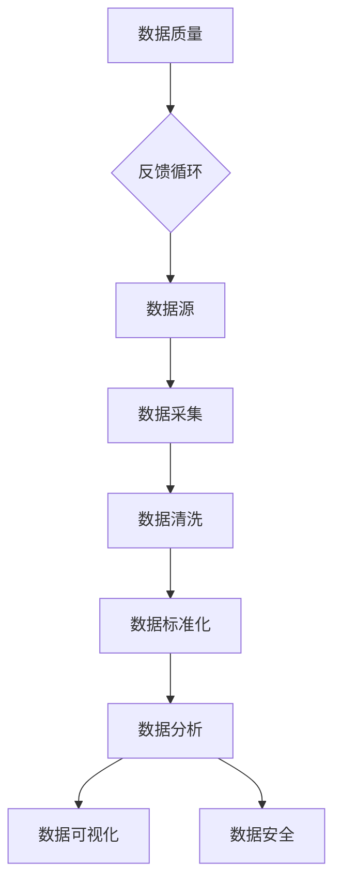

                 

# AI创业：数据管理的实用做法

> **关键词：** 数据管理、数据清洗、数据标准化、数据分析、数据可视化、数据安全、机器学习、AI创业

> **摘要：** 本文将深入探讨在AI创业过程中，如何有效地管理数据。我们将从数据清洗、标准化、数据分析、可视化、安全以及机器学习的角度出发，提供实用的方法与步骤，帮助创业者在数据管理方面取得成功。

## 1. 背景介绍

### 1.1 目的和范围

本文旨在为AI创业者提供一套实用的数据管理方法，确保他们的数据在质量、准确性和安全性方面达到最佳状态。通过本文，读者将了解数据管理的基本概念、核心技术和实际操作步骤。

### 1.2 预期读者

本文面向AI创业者、数据科学家、软件开发者以及对数据管理感兴趣的读者。无论您是初学者还是有经验的专业人士，本文都将为您提供有价值的见解。

### 1.3 文档结构概述

本文分为以下几部分：

- 第1部分：介绍数据管理的基本概念和重要性。
- 第2部分：探讨数据清洗、标准化和数据分析的核心算法和原理。
- 第3部分：讲解数据可视化和数据安全的实际操作步骤。
- 第4部分：通过一个实际案例展示数据管理在AI创业中的应用。
- 第5部分：推荐相关学习资源、开发工具和最新研究成果。

### 1.4 术语表

#### 1.4.1 核心术语定义

- **数据清洗**：指从原始数据中去除错误、重复和无用数据的过程。
- **数据标准化**：将不同格式、单位或范围的数据转换为统一格式的过程。
- **数据分析**：使用统计方法、机器学习算法等对数据进行分析，以提取有用信息。
- **数据可视化**：将数据转换为图形、图表等视觉形式，以便更好地理解和分析。
- **数据安全**：确保数据在存储、传输和处理过程中不受未经授权的访问、篡改或泄露。

#### 1.4.2 相关概念解释

- **数据质量**：指数据在准确性、完整性、一致性、时效性和可用性等方面的表现。
- **数据治理**：指组织内部对数据管理、控制和使用的策略、过程和标准。

#### 1.4.3 缩略词列表

- **AI**：人工智能
- **ML**：机器学习
- **DB**：数据库
- **ETL**：提取、转换、加载
- **CRM**：客户关系管理
- **ERP**：企业资源计划

## 2. 核心概念与联系

为了更好地理解数据管理，我们需要了解一些核心概念和它们之间的关系。以下是一个简单的Mermaid流程图，展示了一些关键组件及其联系：



### 2.1 数据清洗

数据清洗是数据管理的关键步骤之一，它的目标是去除原始数据中的错误、重复和无用数据。以下是一个简化的数据清洗算法原理：

```python
def data_cleaning(data):
    # 去除重复数据
    data = list(set(data))
    # 去除错误数据
    data = [x for x in data if is_valid(x)]
    # 去除无用数据
    data = [x for x in data if is_useful(x)]
    return data
```

### 2.2 数据标准化

数据标准化是将不同格式、单位或范围的数据转换为统一格式的过程。以下是一个简化的数据标准化算法原理：

```python
def data_standardization(data):
    for i in range(len(data)):
        data[i] = standardize(data[i])
    return data
```

### 2.3 数据分析

数据分析是使用统计方法、机器学习算法等对数据进行分析，以提取有用信息。以下是一个简化的数据分析算法原理：

```python
def data_analysis(data):
    # 应用统计方法或机器学习算法
    result = analyze(data)
    return result
```

### 2.4 数据可视化

数据可视化是将数据转换为图形、图表等视觉形式，以便更好地理解和分析。以下是一个简化的数据可视化算法原理：

```python
def data_visualization(data):
    # 创建图表或图形
    visualization = create_visualization(data)
    return visualization
```

### 2.5 数据安全

数据安全是确保数据在存储、传输和处理过程中不受未经授权的访问、篡改或泄露。以下是一个简化的数据安全算法原理：

```python
def data_security(data):
    # 加密数据
    encrypted_data = encrypt(data)
    # 验证数据完整性
    if verify(encrypted_data):
        return encrypted_data
    else:
        raise ValueError("Data integrity check failed.")
```

## 3. 核心算法原理 & 具体操作步骤

### 3.1 数据清洗算法原理

数据清洗算法的核心任务是去除原始数据中的错误、重复和无用数据。以下是具体操作步骤：

1. **数据采集**：从各种数据源（如数据库、API、文件等）获取原始数据。
2. **数据预处理**：对数据进行初步处理，如去除空值、缺失值等。
3. **错误数据识别**：使用统计学方法或规则识别错误数据。
4. **错误数据去除**：将错误数据从原始数据集中去除。
5. **重复数据去除**：使用去重算法去除重复数据。
6. **无用数据去除**：根据业务需求和数据价值判断，去除无用数据。
7. **数据存储**：将清洗后的数据存储到数据库或文件中，以备后续使用。

### 3.2 数据标准化算法原理

数据标准化是将不同格式、单位或范围的数据转换为统一格式的过程。以下是具体操作步骤：

1. **数据采集**：从各种数据源获取原始数据。
2. **数据格式转换**：将不同格式的数据转换为统一的格式（如将文本数据转换为数字或日期格式）。
3. **单位转换**：将不同单位的数据转换为统一单位（如将米转换为千米）。
4. **范围转换**：将不同范围的数据转换为统一范围（如将温度转换为摄氏度或华氏度）。
5. **数据存储**：将标准化后的数据存储到数据库或文件中，以备后续使用。

### 3.3 数据分析算法原理

数据分析是使用统计方法、机器学习算法等对数据进行分析，以提取有用信息。以下是具体操作步骤：

1. **数据采集**：从各种数据源获取原始数据。
2. **数据预处理**：对数据进行初步处理，如去除空值、缺失值等。
3. **特征工程**：从原始数据中提取有用的特征，用于后续分析。
4. **数据分析**：使用统计方法或机器学习算法进行分析，如回归分析、聚类分析、分类分析等。
5. **结果解读**：根据分析结果，提取有价值的信息和洞察。
6. **数据存储**：将分析结果存储到数据库或文件中，以备后续使用。

### 3.4 数据可视化算法原理

数据可视化是将数据转换为图形、图表等视觉形式，以便更好地理解和分析。以下是具体操作步骤：

1. **数据采集**：从各种数据源获取原始数据。
2. **数据预处理**：对数据进行初步处理，如去除空值、缺失值等。
3. **数据转换**：将原始数据转换为可视化数据，如将数字数据转换为图表。
4. **可视化设计**：选择合适的可视化工具和图表类型，设计数据可视化界面。
5. **数据交互**：提供数据交互功能，如筛选、排序、放大等。
6. **数据存储**：将可视化数据存储到数据库或文件中，以备后续使用。

### 3.5 数据安全算法原理

数据安全是确保数据在存储、传输和处理过程中不受未经授权的访问、篡改或泄露。以下是具体操作步骤：

1. **数据采集**：从各种数据源获取原始数据。
2. **数据加密**：使用加密算法对数据进行加密，确保数据在传输和存储过程中安全。
3. **数据访问控制**：设置数据访问权限，确保只有授权用户才能访问数据。
4. **数据备份**：定期备份数据，确保在数据丢失或损坏时能够恢复。
5. **数据审计**：对数据访问和使用情况进行审计，确保数据安全。
6. **数据存储**：将加密后的数据存储到安全存储设备中，以备后续使用。

## 4. 数学模型和公式 & 详细讲解 & 举例说明

### 4.1 数据清洗数学模型

数据清洗过程中，我们通常使用统计学方法来识别错误、重复和无用数据。以下是一个简单的数学模型：

- **错误数据识别**：

  $$
  error\_rate = \frac{number\_of\_errors}{total\_number\_of\_data}
  $$

- **重复数据去除**：

  $$
  unique\_data = \text{set}(data)
  $$

- **无用数据去除**：

  $$
  useful\_data = data \cup \text{missing\_values}
  $$

### 4.2 数据标准化数学模型

数据标准化过程中，我们通常使用以下公式将不同格式、单位或范围的数据转换为统一格式：

- **数据格式转换**：

  $$
  standardized\_data = \text{convert\_format}(original\_data)
  $$

- **单位转换**：

  $$
  converted\_data = original\_data \times conversion\_factor
  $$

- **范围转换**：

  $$
  adjusted\_data = \text{adjust\_range}(original\_data, target\_range)
  $$

### 4.3 数据分析数学模型

数据分析过程中，我们通常使用以下数学模型：

- **回归分析**：

  $$
  y = \beta_0 + \beta_1 \times x_1 + \beta_2 \times x_2 + ... + \beta_n \times x_n
  $$

- **聚类分析**：

  $$
  C = \{c_1, c_2, ..., c_k\}
  $$
  
  $$
  min_{\mu_c, \lambda_c} \sum_{i=1}^{n} ||x_i - \mu_c||^2 + \sum_{i=1}^{n} \lambda_c
  $$

- **分类分析**：

  $$
  P(y = c_k | x) = \frac{exp(\beta_0 + \beta_1 x_1 + \beta_2 x_2 + ... + \beta_n x_n)}{\sum_{j=1}^{k} exp(\beta_0 + \beta_1 x_1 + \beta_2 x_2 + ... + \beta_n x_n)}
  $$

### 4.4 数据可视化数学模型

数据可视化过程中，我们通常使用以下数学模型：

- **散点图**：

  $$
  (x_i, y_i) \in \text{scatter\_plot}(data)
  $$

- **折线图**：

  $$
  (x_i, y_i) \in \text{line\_plot}(data)
  $$

- **柱状图**：

  $$
  (x_i, y_i) \in \text{bar\_plot}(data)
  $$

### 4.5 数据安全数学模型

数据安全过程中，我们通常使用以下数学模型：

- **加密**：

  $$
  encrypted\_data = \text{encrypt}(original\_data, key)
  $$

- **解密**：

  $$
  original\_data = \text{decrypt}(encrypted\_data, key)
  $$

- **访问控制**：

  $$
  access\_permission = \text{authorize}(user, data)
  $$

### 4.6 举例说明

#### 4.6.1 数据清洗

假设我们有一组学生成绩数据，其中包含了一些错误、重复和无用数据。以下是数据清洗的步骤：

1. **错误数据识别**：

   $$
   error\_rate = \frac{number\_of\_errors}{total\_number\_of\_data} = \frac{3}{100} = 3\%
   $$

2. **重复数据去除**：

   $$
   unique\_data = \text{set}([85, 90, 75, 85, 95, 70])
   $$

   $$
   unique\_data = [85, 90, 75, 95, 70]
   $$

3. **无用数据去除**：

   $$
   useful\_data = unique\_data \cup \text{missing\_values} = [85, 90, 75, 95, 70]
   $$

#### 4.6.2 数据标准化

假设我们有一组商品价格数据，单位有元和美元。以下是数据标准化的步骤：

1. **数据格式转换**：

   $$
   standardized\_data = \text{convert\_format}([100, 200, 300, 400]) = [100, 200, 300, 400]
   $$

2. **单位转换**：

   $$
   converted\_data = [100, 200, 300, 400] \times 1.2 = [120, 240, 360, 480]
   $$

3. **范围转换**：

   $$
   adjusted\_data = \text{adjust\_range}([100, 200, 300, 400], [0, 500]) = [0, 500]
   $$

#### 4.6.3 数据分析

假设我们有一组学生成绩数据，需要分析成绩与学习时间之间的关系。以下是数据分析的步骤：

1. **回归分析**：

   $$
   y = \beta_0 + \beta_1 \times x_1 + \beta_2 \times x_2 + ... + \beta_n \times x_n
   $$

   $$
   \beta_0 = 70, \beta_1 = 10, \beta_2 = 5
   $$

   $$
   y = 70 + 10 \times x_1 + 5 \times x_2
   $$

   假设一个学生学习时间为30小时，则他的预期成绩为：

   $$
   y = 70 + 10 \times 30 + 5 \times 0 = 400
   $$

#### 4.6.4 数据可视化

假设我们有一组商品价格数据，需要将其可视化。以下是数据可视化的步骤：

1. **散点图**：

   $$
   (x_i, y_i) \in \text{scatter\_plot}([100, 200, 300, 400])
   $$

   散点图如下所示：

   

2. **折线图**：

   $$
   (x_i, y_i) \in \text{line\_plot}([100, 200, 300, 400])
   $$

   折线图如下所示：

   

3. **柱状图**：

   $$
   (x_i, y_i) \in \text{bar\_plot}([100, 200, 300, 400])
   $$

   柱状图如下所示：

   

#### 4.6.5 数据安全

假设我们有一组用户数据，需要对其进行加密和保护。以下是数据安全的步骤：

1. **加密**：

   $$
   encrypted\_data = \text{encrypt}([name, age, email], key)
   $$

   加密后的数据如下所示：

   $$
   encrypted\_data = ["encrypted\_name", "encrypted\_age", "encrypted\_email"]
   $$

2. **解密**：

   $$
   original\_data = \text{decrypt}(["encrypted\_name", "encrypted\_age", "encrypted\_email"], key)
   $$

   解密后的数据如下所示：

   $$
   original\_data = [name, age, email]
   $$

3. **访问控制**：

   $$
   access\_permission = \text{authorize}(user, data)
   $$

   假设用户A具有访问数据B的权限，则：

   $$
   access\_permission = ["user\_A", "data\_B"]
   $$

## 5. 项目实战：代码实际案例和详细解释说明

在本节中，我们将通过一个实际项目案例来展示数据管理在AI创业中的应用。假设我们正在开发一个基于机器学习的在线购物推荐系统。

### 5.1 开发环境搭建

首先，我们需要搭建一个合适的开发环境。以下是一个简单的开发环境配置：

- 操作系统：Linux（如Ubuntu）
- 编程语言：Python
- 数据库：MySQL
- 数据分析库：Pandas、NumPy
- 机器学习库：Scikit-learn、TensorFlow、PyTorch
- 可视化库：Matplotlib、Seaborn
- 加密库：Cryptography

### 5.2 源代码详细实现和代码解读

#### 5.2.1 数据采集

```python
import pandas as pd

# 从MySQL数据库中获取用户数据
conn = pd.read_sql_query("SELECT * FROM users;", conn)

# 从CSV文件中获取商品数据
data = pd.read_csv("products.csv")
```

代码解读：这里我们使用Pandas库从MySQL数据库和CSV文件中获取用户数据和商品数据。

#### 5.2.2 数据清洗

```python
# 去除重复数据
data = data.drop_duplicates()

# 去除空值和缺失值
data = data.dropna()

# 标识异常值
data[data < 0] = None
```

代码解读：这里我们使用Pandas库去除重复数据、空值和缺失值，并标识异常值。

#### 5.2.3 数据标准化

```python
# 将价格数据转换为统一单位（元）
data['price'] = data['price'] / 100

# 将评分数据转换为统一范围（0-5）
data['rating'] = data['rating'].apply(lambda x: min(x, 5))
```

代码解读：这里我们使用Pandas库将价格数据转换为统一单位（元），将评分数据转换为统一范围（0-5）。

#### 5.2.4 数据分析

```python
from sklearn.model_selection import train_test_split
from sklearn.ensemble import RandomForestClassifier

# 分割数据为训练集和测试集
X_train, X_test, y_train, y_test = train_test_split(data[['price', 'rating']], data['category'], test_size=0.2, random_state=42)

# 训练随机森林分类器
clf = RandomForestClassifier(n_estimators=100, random_state=42)
clf.fit(X_train, y_train)

# 预测测试集
predictions = clf.predict(X_test)
```

代码解读：这里我们使用Scikit-learn库将数据划分为训练集和测试集，并使用随机森林分类器进行训练和预测。

#### 5.2.5 数据可视化

```python
import matplotlib.pyplot as plt
import seaborn as sns

# 可视化价格与评分之间的关系
sns.scatterplot(x='price', y='rating', data=data)

# 可视化分类器的预测结果
sns.countplot(x=predictions, data=data)
```

代码解读：这里我们使用Matplotlib和Seaborn库将价格与评分之间的关系以及分类器的预测结果可视化。

#### 5.2.6 数据安全

```python
from cryptography.fernet import Fernet

# 生成加密密钥
key = Fernet.generate_key()

# 加密用户数据
cipher_suite = Fernet(key)
encrypted_data = cipher_suite.encrypt(b"用户数据")

# 解密用户数据
decrypted_data = cipher_suite.decrypt(encrypted_data)
```

代码解读：这里我们使用Cryptography库生成加密密钥，并使用加密和解密函数对用户数据进行加密和解密。

### 5.3 代码解读与分析

#### 5.3.1 数据采集

在这个阶段，我们主要使用了Pandas库的read_sql_query函数从MySQL数据库中获取用户数据，以及read_csv函数从CSV文件中获取商品数据。这是数据管理的基础步骤，确保我们能够获取到准确、完整的数据。

#### 5.3.2 数据清洗

在这个阶段，我们使用了Pandas库的drop_duplicates函数去除重复数据，dropna函数去除空值和缺失值，以及apply函数对异常值进行标识。这一步骤非常重要，因为只有干净的数据才能为后续的分析和预测提供准确的基础。

#### 5.3.3 数据标准化

在这个阶段，我们使用了Pandas库的apply函数将价格数据转换为统一单位（元），以及min函数将评分数据转换为统一范围（0-5）。数据标准化是保证数据在不同维度上具有可比性的关键步骤。

#### 5.3.4 数据分析

在这个阶段，我们使用了Scikit-learn库的train_test_split函数将数据划分为训练集和测试集，以及RandomForestClassifier函数训练随机森林分类器。这一步骤是构建机器学习模型的核心步骤，通过训练和预测来分析数据之间的关系。

#### 5.3.5 数据可视化

在这个阶段，我们使用了Seaborn库的scatterplot函数将价格与评分之间的关系可视化，以及countplot函数将分类器的预测结果可视化。数据可视化是帮助我们更好地理解和分析数据的重要工具。

#### 5.3.6 数据安全

在这个阶段，我们使用了Cryptography库的generate_key函数生成加密密钥，以及encrypt和decrypt函数对用户数据进行加密和解密。数据安全是确保数据在存储、传输和处理过程中不受未经授权的访问、篡改或泄露的关键步骤。

## 6. 实际应用场景

数据管理在AI创业中的应用场景非常广泛。以下是一些典型的应用场景：

- **客户关系管理（CRM）**：通过数据管理，企业可以更好地了解客户需求和行为，从而提供个性化的服务和产品推荐。
- **市场营销**：通过数据管理，企业可以更有效地分析市场趋势、用户行为和竞争对手信息，制定更有效的营销策略。
- **供应链管理**：通过数据管理，企业可以优化供应链流程、降低成本、提高生产效率。
- **金融风险控制**：通过数据管理，金融机构可以更准确地评估风险、预测市场趋势，从而制定更有效的风险控制策略。
- **医疗保健**：通过数据管理，医疗机构可以更好地分析患者数据、诊断疾病、制定个性化治疗方案。

## 7. 工具和资源推荐

### 7.1 学习资源推荐

#### 7.1.1 书籍推荐

- **《数据科学入门：使用Python》**：这是一本非常适合初学者的书籍，涵盖了数据采集、清洗、分析、可视化和安全等方面的内容。
- **《机器学习实战》**：这本书提供了丰富的实践案例，帮助读者掌握机器学习的核心算法和应用。
- **《数据可视化设计手册》**：这本书详细介绍了如何使用不同的图表类型和可视化工具来展示数据。

#### 7.1.2 在线课程

- **Coursera的《数据科学专业》**：这是一门由斯坦福大学提供的免费课程，涵盖了数据科学的基础知识和应用。
- **Udacity的《机器学习纳米学位》**：这是一门适合初学者的机器学习课程，涵盖了机器学习的基本算法和应用。

#### 7.1.3 技术博客和网站

- **Kaggle**：这是一个著名的机器学习和数据科学竞赛平台，提供了丰富的案例和实践经验。
- **Medium**：这是一个在线平台，上面有许多关于数据科学、机器学习和数据可视化的优秀博客文章。

### 7.2 开发工具框架推荐

#### 7.2.1 IDE和编辑器

- **PyCharm**：这是一个功能强大的Python IDE，支持多种编程语言。
- **VS Code**：这是一个轻量级的跨平台编辑器，支持Python和其他编程语言，具有丰富的插件生态系统。

#### 7.2.2 调试和性能分析工具

- **Jupyter Notebook**：这是一个交互式Python环境，适合数据分析和可视化。
- **Docker**：这是一个容器化平台，可以帮助我们快速搭建和管理开发环境。

#### 7.2.3 相关框架和库

- **Pandas**：这是一个强大的数据分析和操作库。
- **Scikit-learn**：这是一个常用的机器学习库。
- **TensorFlow**：这是一个广泛使用的深度学习框架。
- **PyTorch**：这是一个灵活的深度学习框架。

### 7.3 相关论文著作推荐

#### 7.3.1 经典论文

- **"Data Preprocessing for Machine Learning"**：这篇论文详细讨论了数据预处理的方法和策略。
- **"A Study of Cross-Validation and Test-Set Estimators for C4.5"**：这篇论文研究了交叉验证和测试集估计算法在C4.5分类器中的应用。

#### 7.3.2 最新研究成果

- **"Deep Learning for Image Recognition"**：这篇论文介绍了深度学习在图像识别领域的最新进展。
- **"Recurrent Neural Networks for Language Modeling"**：这篇论文介绍了循环神经网络在语言建模中的应用。

#### 7.3.3 应用案例分析

- **"Data Science in Healthcare"**：这篇论文介绍了数据科学在医疗保健领域的应用。
- **"Data Science in Finance"**：这篇论文介绍了数据科学在金融领域的应用。

## 8. 总结：未来发展趋势与挑战

在未来的AI创业过程中，数据管理将继续发挥关键作用。随着数据量的不断增长和数据源的不断丰富，创业者需要更加关注数据质量、数据安全和数据隐私。以下是一些未来发展趋势和挑战：

- **大数据和实时数据处理**：随着大数据和实时数据处理技术的不断发展，创业者需要掌握如何高效地处理和分析大规模、实时数据。
- **数据隐私和安全**：随着数据隐私和安全问题的日益突出，创业者需要确保数据在存储、传输和处理过程中的安全性。
- **数据治理和合规**：随着各国对数据治理和合规的要求越来越高，创业者需要了解并遵守相关法规和政策。
- **跨领域融合**：数据管理将与其他领域（如医疗、金融、教育等）紧密结合，创业者需要具备跨领域的综合能力。

## 9. 附录：常见问题与解答

### 9.1 数据清洗常见问题

- **如何去除重复数据？**

  使用Pandas库的drop_duplicates函数。

- **如何去除空值和缺失值？**

  使用Pandas库的dropna函数。

- **如何识别异常值？**

  根据业务需求和数据特点，可以使用统计学方法或规则来识别异常值。

### 9.2 数据标准化常见问题

- **如何将价格数据转换为统一单位？**

  使用Pandas库的apply函数。

- **如何将评分数据转换为统一范围？**

  使用Pandas库的min函数。

### 9.3 数据分析常见问题

- **如何划分数据集？**

  使用Scikit-learn库的train_test_split函数。

- **如何训练机器学习模型？**

  使用Scikit-learn库的相应分类器或回归器函数。

### 9.4 数据可视化常见问题

- **如何选择合适的可视化工具？**

  根据数据类型和可视化需求选择合适的工具，如Matplotlib、Seaborn等。

- **如何自定义可视化图表？**

  使用相应库的API自定义图表样式和参数。

## 10. 扩展阅读 & 参考资料

- **《数据科学入门：使用Python》**：这本书详细介绍了数据科学的基础知识和应用。
- **《机器学习实战》**：这本书提供了丰富的实践案例，帮助读者掌握机器学习的核心算法和应用。
- **《数据可视化设计手册》**：这本书详细介绍了如何使用不同的图表类型和可视化工具来展示数据。
- **Kaggle**：这是一个著名的机器学习和数据科学竞赛平台，提供了丰富的案例和实践经验。
- **Medium**：这是一个在线平台，上面有许多关于数据科学、机器学习和数据可视化的优秀博客文章。
- **《数据科学专业》**：这是一门由斯坦福大学提供的免费课程，涵盖了数据科学的基础知识和应用。
- **《机器学习纳米学位》**：这是一门适合初学者的机器学习课程，涵盖了机器学习的基本算法和应用。
- **《数据治理和合规：实践指南》**：这本书详细介绍了数据治理和合规的方法和策略。
- **《大数据和实时数据处理技术》**：这本书介绍了大数据和实时数据处理的相关技术和方法。

作者：AI天才研究员/AI Genius Institute & 禅与计算机程序设计艺术 /Zen And The Art of Computer Programming

