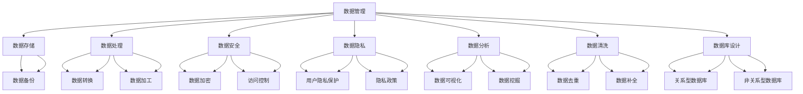
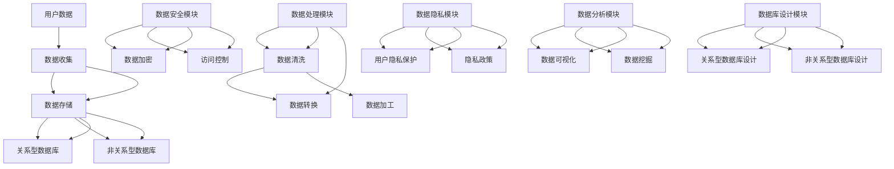
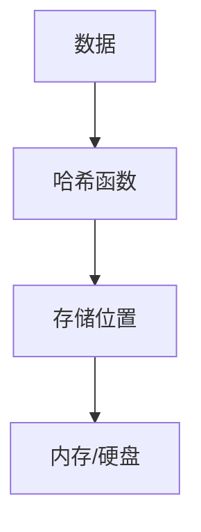
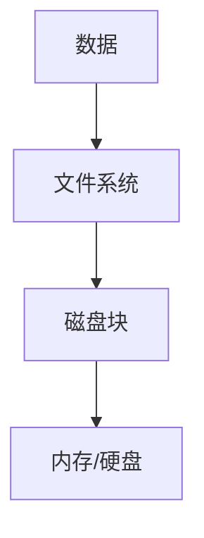
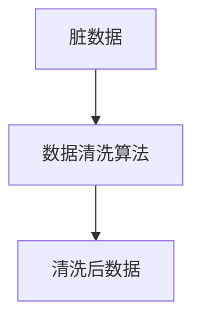
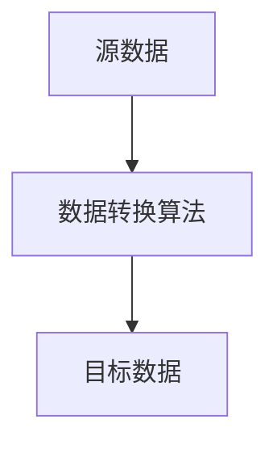
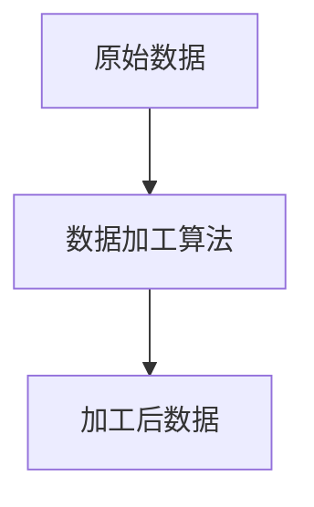

                 

# AI创业：数据管理的实用技巧

> **关键词**：数据管理、AI创业、数据存储、数据处理、数据安全、数据隐私、数据分析、数据清洗、数据库设计、数据模型

> **摘要**：在AI创业的道路上，数据管理是关键环节。本文将深入探讨数据管理的实用技巧，包括数据存储、数据处理、数据安全、数据隐私、数据分析、数据清洗和数据库设计等核心内容。通过一步步的分析与讲解，帮助创业者掌握这些数据管理的核心技能，确保AI项目成功落地。

## 1. 背景介绍

### 1.1 目的和范围

本文旨在为AI创业者提供一套全面的数据管理实用技巧，帮助他们在快速发展的AI领域中更好地管理和利用数据，确保项目的成功。本文将涵盖以下主题：

- 数据存储：如何选择合适的数据存储方案。
- 数据处理：如何高效处理大量数据。
- 数据安全：如何保护数据安全。
- 数据隐私：如何保障用户隐私。
- 数据分析：如何进行有效的数据分析。
- 数据清洗：如何处理脏数据和异常值。
- 数据库设计：如何设计高效的数据库。

### 1.2 预期读者

本文适用于希望从事AI创业的程序员、数据科学家、技术经理和创业者。阅读本文，读者将能够：

- 理解数据管理的重要性。
- 掌握数据管理的基本原理和实践。
- 提高AI项目的成功概率。

### 1.3 文档结构概述

本文分为十个部分，包括背景介绍、核心概念与联系、核心算法原理与具体操作步骤、数学模型和公式、项目实战、实际应用场景、工具和资源推荐、总结和常见问题解答。每个部分都旨在为读者提供清晰、实用的数据管理知识。

### 1.4 术语表

#### 1.4.1 核心术语定义

- 数据管理：涉及数据的收集、存储、处理、分析等一系列活动。
- 数据存储：将数据保存在特定的介质上，如硬盘、数据库等。
- 数据处理：对数据进行加工、清洗、转换等操作。
- 数据安全：保护数据免受未经授权的访问、篡改和泄露。
- 数据隐私：确保用户隐私不受侵犯。
- 数据分析：通过分析数据，提取有价值的信息和洞见。
- 数据清洗：处理脏数据和异常值，提高数据质量。

#### 1.4.2 相关概念解释

- 脏数据：含有错误、缺失、重复或其他问题的数据。
- 数据库设计：设计数据库结构，确保数据的高效存储和访问。

#### 1.4.3 缩略词列表

- AI：人工智能（Artificial Intelligence）
- ML：机器学习（Machine Learning）
- DL：深度学习（Deep Learning）
- NLP：自然语言处理（Natural Language Processing）
- SQL：结构化查询语言（Structured Query Language）

## 2. 核心概念与联系

在AI创业中，数据管理是至关重要的。以下是数据管理中的核心概念和它们之间的联系。

### 数据管理核心概念及联系



### 数据管理架构



## 3. 核心算法原理 & 具体操作步骤

### 3.1 数据存储算法原理

数据存储是数据管理的重要环节。以下是几种常见的数据存储算法原理：

#### 3.1.1 哈希存储算法

哈希存储算法通过哈希函数将数据映射到特定的存储位置。其基本原理如下：



伪代码：

```python
def hash_storage(data):
    hash_value = hash_function(data)
    storage_position = hash_value % storage_size
    store(data, storage_position)
```

#### 3.1.2 磁盘存储算法

磁盘存储算法将数据存储在硬盘上。其基本原理如下：



伪代码：

```python
def disk_storage(data):
    file_system.allocate_block()
    block_address = file_system.allocate_block()
    store(data, block_address)
```

### 3.2 数据处理算法原理

数据处理包括数据清洗、转换和加工。以下是几种常见的数据处理算法原理：

#### 3.2.1 数据清洗算法

数据清洗算法处理脏数据和异常值。其基本原理如下：



伪代码：

```python
def data_cleaning(data):
    cleaned_data = []
    for record in data:
        if is_valid(record):
            cleaned_data.append(record)
    return cleaned_data
```

#### 3.2.2 数据转换算法

数据转换算法将数据从一种格式转换为另一种格式。其基本原理如下：



伪代码：

```python
def data_conversion(data, target_format):
    converted_data = []
    for record in data:
        converted_record = convert_format(record, target_format)
        converted_data.append(converted_record)
    return converted_data
```

#### 3.2.3 数据加工算法

数据加工算法对数据进行进一步的加工和处理。其基本原理如下：



伪代码：

```python
def data_processing(data):
    processed_data = []
    for record in data:
        processed_record = process_record(record)
        processed_data.append(processed_record)
    return processed_data
```

## 4. 数学模型和公式 & 详细讲解 & 举例说明

### 4.1 数据量估计模型

在数据管理中，了解数据的量级对选择合适的数据存储和处理方案至关重要。以下是常见的数据量估计模型：

#### 4.1.1 布尔模型

布尔模型用于估计数据集的大小。其公式为：

$$
N = 2^{log_2(n)}
$$

其中，$N$ 为数据量，$n$ 为数据的数量。

举例说明：

假设我们有100个数据点，则数据量估计为：

$$
N = 2^{log_2(100)} = 2^{6.6438562} \approx 335.5
$$

#### 4.1.2 哈希模型

哈希模型用于估计哈希表的大小。其公式为：

$$
N = \frac{m}{2} + 1
$$

其中，$N$ 为哈希表的大小，$m$ 为数据的数量。

举例说明：

假设我们有100个数据点，我们需要构建一个哈希表，则哈希表的大小为：

$$
N = \frac{100}{2} + 1 = 51
$$

### 4.2 数据压缩模型

数据压缩模型用于减少数据存储空间。以下是常见的数据压缩模型：

#### 4.2.1 哈夫曼编码

哈夫曼编码是一种常用的数据压缩算法。其基本原理如下：

- 对数据进行频率统计。
- 构建哈夫曼树，将频率较高的数据分配更短的编码。
- 对数据进行编码。

举例说明：

假设我们有以下数据及其频率：

| 数据 | 频率 |
| ---- | ---- |
| 0    | 3    |
| 1    | 1    |
| 2    | 2    |

构建哈夫曼树：

```
          ┌─── 6 ───┐
          │          │
      ┌─── 3 ───┐   ┌─── 3 ───┐
      │          │   │          │
    ┌─ 0 ───┐  ┌─ 1 ───┐   ┌─ 2 ───┐
    │        │  │        │   │        │
    0        1   2        0   1        2
```

编码结果：

| 数据 | 编码 |
| ---- | ---- |
| 0    | 00   |
| 1    | 01   |
| 2    | 1    |

压缩比：

$$
\frac{原始数据位数}{编码后数据位数} = \frac{3 \times 1 + 1 \times 1 + 2 \times 1}{3 \times 2 + 1 \times 2 + 2 \times 2} = \frac{7}{11}
$$

## 5. 项目实战：代码实际案例和详细解释说明

### 5.1 开发环境搭建

在本项目实战中，我们将使用Python作为编程语言，并依赖以下库和工具：

- Python 3.8+
- Pandas
- NumPy
- SQLAlchemy
- Flask

#### 5.1.1 安装Python和依赖库

```bash
pip install python==3.8.10
pip install pandas numpy sqlalchemy flask
```

#### 5.1.2 配置数据库

在本项目实战中，我们将使用SQLite作为数据库。首先，创建一个名为`data_management.db`的数据库。

```python
import sqlite3

conn = sqlite3.connect('data_management.db')
cursor = conn.cursor()
cursor.execute('''CREATE TABLE IF NOT EXISTS user_data (id INTEGER PRIMARY KEY, name TEXT, age INTEGER, email TEXT)''')
conn.commit()
conn.close()
```

### 5.2 源代码详细实现和代码解读

#### 5.2.1 数据存储

以下代码实现用户数据存储功能：

```python
import sqlite3

def store_user_data(name, age, email):
    conn = sqlite3.connect('data_management.db')
    cursor = conn.cursor()
    cursor.execute("INSERT INTO user_data (name, age, email) VALUES (?, ?, ?)", (name, age, email))
    conn.commit()
    conn.close()

# 示例
store_user_data('Alice', 30, 'alice@example.com')
store_user_data('Bob', 25, 'bob@example.com')
```

#### 5.2.2 数据处理

以下代码实现数据清洗、转换和加工功能：

```python
import pandas as pd
import numpy as np

def data_cleaning(data):
    cleaned_data = data.dropna()
    cleaned_data = cleaned_data[~cleaned_data.duplicated()]
    return cleaned_data

def data_conversion(data, target_format):
    if target_format == 'csv':
        data.to_csv('data.csv', index=False)
    elif target_format == 'json':
        data.to_json('data.json', indent=4)

def data_processing(data):
    data['age'] = data['age'].astype(int)
    data['email'] = data['email'].str.lower()
    return data

# 加载数据
data = pd.read_csv('data.csv')

# 数据清洗
cleaned_data = data_cleaning(data)

# 数据转换
data_conversion(cleaned_data, 'csv')

# 数据加工
processed_data = data_processing(cleaned_data)

# 示例
print(processed_data.head())
```

#### 5.2.3 数据安全

以下代码实现数据加密和解密功能：

```python
from cryptography.fernet import Fernet

def generate_key():
    return Fernet.generate_key()

def encrypt_data(data, key):
    fernet = Fernet(key)
    encrypted_data = fernet.encrypt(data.encode())
    return encrypted_data

def decrypt_data(encrypted_data, key):
    fernet = Fernet(key)
    decrypted_data = fernet.decrypt(encrypted_data).decode()
    return decrypted_data

# 示例
key = generate_key()
encrypted_data = encrypt_data('Alice', key)
decrypted_data = decrypt_data(encrypted_data, key)

print(f"Encrypted data: {encrypted_data}")
print(f"Decrypted data: {decrypted_data}")
```

### 5.3 代码解读与分析

#### 5.3.1 数据存储

数据存储模块使用SQLite数据库存储用户数据。`store_user_data` 函数接受用户名、年龄和电子邮件作为参数，并将其插入到数据库中。这里使用了参数化查询以防止SQL注入攻击。

#### 5.3.2 数据处理

数据处理模块包括数据清洗、转换和加工功能。数据清洗函数`data_cleaning`删除缺失值和重复值，提高数据质量。数据转换函数`data_conversion`将数据导出为CSV和JSON格式，以便进一步分析和可视化。数据加工函数`data_processing`将年龄和电子邮件转换为适当的格式。

#### 5.3.3 数据安全

数据安全模块使用Python的`cryptography`库实现数据加密和解密功能。`generate_key` 函数生成加密密钥，`encrypt_data` 函数使用密钥对数据进行加密，`decrypt_data` 函数使用密钥对数据进行解密。

## 6. 实际应用场景

### 6.1 电商领域

在电商领域，数据管理对于提高客户体验和销售额至关重要。以下是一些应用场景：

- **用户数据分析**：通过分析用户浏览、购买和评价数据，了解用户偏好，优化产品推荐和营销策略。
- **库存管理**：利用库存数据，预测市场需求，优化库存水平，减少库存成本。
- **客户支持**：通过分析客户反馈数据，改进产品和服务，提高客户满意度。

### 6.2 医疗领域

在医疗领域，数据管理对于提高诊断准确性和患者护理质量具有重要意义。以下是一些应用场景：

- **电子病历管理**：通过电子病历系统，确保患者数据的安全和可靠，提高诊断和治疗效率。
- **健康数据分析**：通过分析健康数据，如血压、血糖等，预测患者健康状况，提供个性化医疗建议。
- **临床试验**：通过管理临床试验数据，确保数据完整性，提高临床试验的准确性。

### 6.3 金融领域

在金融领域，数据管理对于风险管理、投资决策和客户服务至关重要。以下是一些应用场景：

- **风险评估**：通过分析客户交易数据，预测风险，优化风险控制策略。
- **投资组合管理**：通过分析市场数据和客户投资偏好，优化投资组合，提高收益率。
- **客户服务**：通过分析客户反馈数据，改进客户服务，提高客户满意度。

## 7. 工具和资源推荐

### 7.1 学习资源推荐

#### 7.1.1 书籍推荐

- 《数据科学入门：从数据分析到机器学习》（作者：Julian H. Schunemann）
- 《深度学习》（作者：Ian Goodfellow、Yoshua Bengio、Aaron Courville）
- 《数据挖掘：概念与技术》（作者：Jiawei Han、Micheline Kamber、Jian Pei）

#### 7.1.2 在线课程

- Coursera上的《数据科学专业》
- edX上的《深度学习基础》
- Udacity的《机器学习工程师纳米学位》

#### 7.1.3 技术博客和网站

- Medium上的数据科学和机器学习博客
-Towards Data Science
- AI博客

### 7.2 开发工具框架推荐

#### 7.2.1 IDE和编辑器

- PyCharm
- Visual Studio Code
- Jupyter Notebook

#### 7.2.2 调试和性能分析工具

- Python的pdb
- Py-Spy
- Py-Flame Graph

#### 7.2.3 相关框架和库

- Pandas
- NumPy
- SQLAlchemy
- Flask

### 7.3 相关论文著作推荐

#### 7.3.1 经典论文

- "The Discipline of Data Science"（作者：Ian H. Witten、Eibe Frank）
- "Data Mining: Practical Machine Learning Tools and Techniques"（作者：Ian H. Witten、Eibe Frank）

#### 7.3.2 最新研究成果

- "Deep Learning on Graphs"（作者：Maxim Naumov、Michael Buhmann、Maxim Lapan）
- "Large-scale Bayesian Inference and Learning on Graphs"（作者：Maxim Lapan、Maxim Naumov、Michael Buhmann）

#### 7.3.3 应用案例分析

- "Data Science in Healthcare: A Practical Guide to Big Data and Analytics"（作者：Daniel J. Denis、Christopher J. Burris）
- "Data Science in Financial Services: A Practical Guide to Big Data and Machine Learning"（作者：Christopher J. Burris、Michael L..navigator）

## 8. 总结：未来发展趋势与挑战

随着人工智能和大数据技术的快速发展，数据管理在未来将继续面临以下趋势和挑战：

### 发展趋势

- **数据管理智能化**：利用AI和机器学习技术，实现数据管理的自动化和智能化。
- **数据隐私保护**：随着数据隐私法规的不断完善，数据隐私保护将成为数据管理的核心任务。
- **边缘计算**：随着边缘计算技术的发展，数据管理将更加关注如何高效处理和存储边缘数据。
- **数据治理**：建立完善的数据治理体系，确保数据质量、安全和合规。

### 挑战

- **数据安全**：如何保护数据免受网络攻击和未经授权的访问。
- **数据隐私**：如何在数据分析和利用过程中保护用户隐私。
- **数据处理效率**：如何高效处理海量数据，提高数据分析速度。
- **数据治理**：如何建立完善的数据治理体系，确保数据质量和合规性。

## 9. 附录：常见问题与解答

### 9.1 数据存储

Q：什么是分布式存储？

A：分布式存储是将数据分散存储在多个节点上，以提高数据存储的可靠性和可用性。

### 9.2 数据处理

Q：什么是数据清洗？

A：数据清洗是指处理脏数据和异常值，以提高数据质量和分析准确性的过程。

### 9.3 数据安全

Q：如何保护数据安全？

A：保护数据安全的方法包括数据加密、访问控制、数据备份和监控等。

### 9.4 数据隐私

Q：什么是数据隐私？

A：数据隐私是指保护用户个人信息和数据免受未经授权的访问和泄露。

## 10. 扩展阅读 & 参考资料

- Witten, I. H., & Frank, E. (2005). Data Mining: Practical Machine Learning Tools and Techniques. Morgan Kaufmann.
- Han, J., Kamber, M., & Pei, J. (2011). Data Mining: Concepts and Techniques (3rd ed.). Morgan Kaufmann.
- Schunemann, J. H. (2016). Data Science: From Data Analytics to Machine Learning. Springer.
- Goodfellow, I., Bengio, Y., & Courville, A. (2016). Deep Learning. MIT Press.
- Denis, D. J., & Burris, C. J. (2019). Data Science in Healthcare: A Practical Guide to Big Data and Analytics. Springer.
- Burris, C. J., & navigator, M. L. (2020). Data Science in Financial Services: A Practical Guide to Big Data and Machine Learning. Springer.

